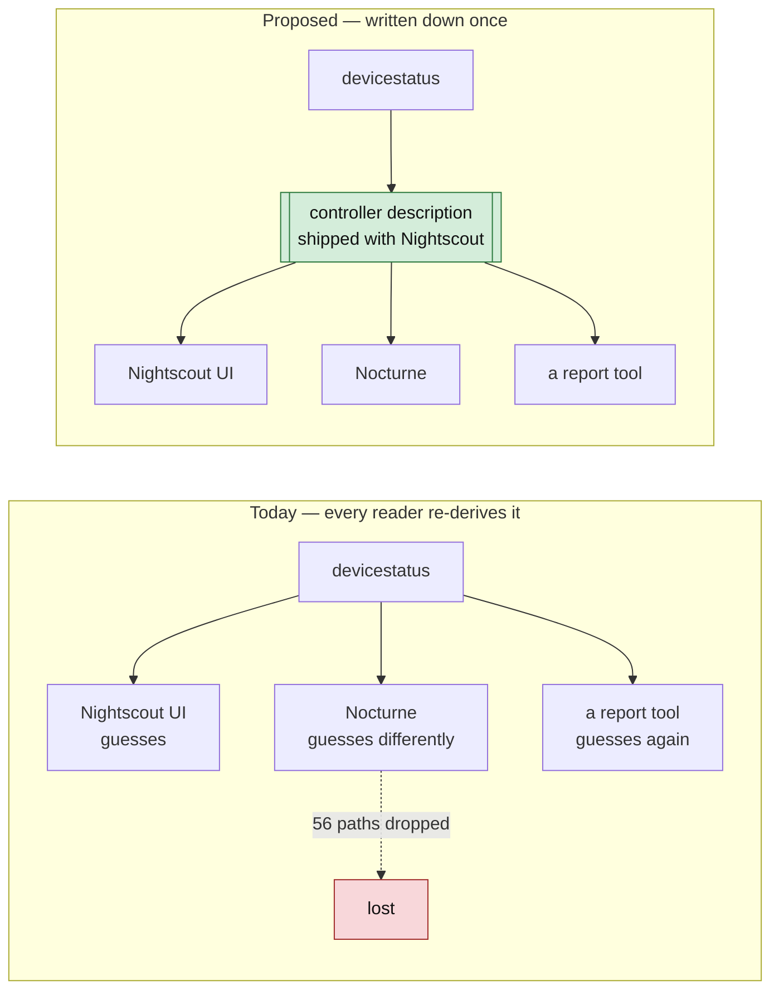
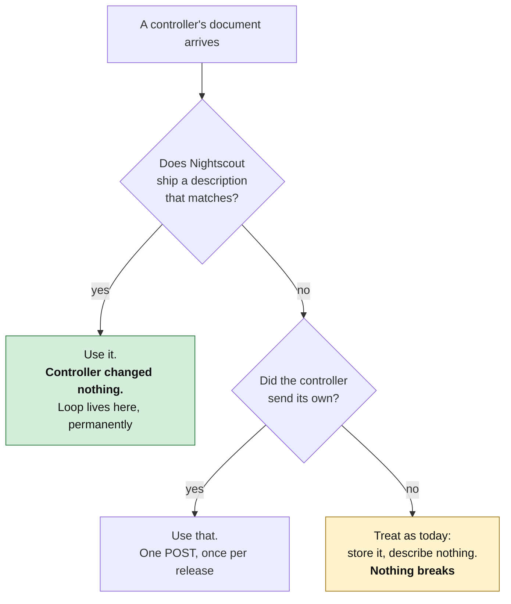

# Proposal: let Nightscout describe the controllers it already recognises

Date: 2026-09-11. Status: draft for discussion. **One page of proposal, then
a worked example, then the evidence.**

> **This is not Kubernetes.** There is no control plane, no admission
> controller, no operator, no CRDs, and nothing a controller must call before
> it is allowed to write. See [§4](#4-what-this-is-not), which exists because
> the first version of this idea was described as "registration" and read as
> all of that.

---

## 1. The problem, in one paragraph

Nightscout already knows what kind of controller wrote a document — it has to,
because Loop's `devicestatus` and Trio's look nothing alike. But that
knowledge lives nowhere: it is re-derived, differently, by every reader.
So the same divergence is rediscovered over and over, and the parts nobody
writes down get silently dropped. Three measured consequences:

| | Measured |
|---|---|
| `devicestatus` paths a typed consumer silently drops | **56 of 166** — including Loop's automatic dose recommendation, on 10 of 11 sites |
| Loop dosing inputs recorded in Nightscout | **4 of 20**. Eight are absent, including the factor that scales every automatic dose |
| Temporary effects that record what they *did*, not just why | **2,934 of 3,415** — the other 481 carry a label and no effect at all |

None of this is a bug in any project. It is the cost of the shape being
tacit.

## 2. The proposal

**Write the description down, in the hub, on the controller's behalf.**



A **controller description** is a static file that says: here is how to
recognise this controller's documents, here is what it writes, here is which
dosing inputs it publishes and which it does not.

**Nightscout ships these files.** A controller that never changes anything
still gets described correctly, because the descriptions are generated from
measurements of what controllers actually write — not from what they promise.

## 3. What changes, for whom



| Actor | What they do | When |
|---|---|---|
| **Loop** | nothing, ever | — |
| **Trio, AAPS, a new controller** | optionally POST a description to correct or extend the shipped one | once per release, if they want |
| **Nightscout** | ship the files; read them where it already guesses | phase 1 |
| **A report or replay tool** | read one file instead of reverse-engineering four codebases | immediately |

**The default path requires no controller change at all.** That is not a
concession to get adoption — it is forced by the evidence: Loop has made 24
commits in six months, none touching Nightscout, and is 9 of 11 sites in the
corpus. A proposal Loop must act on is a proposal that does not happen.

## 4. What this is *not*

The word "registration" did the damage. Concretely:

| Not this | Actually this |
|---|---|
| A control plane that must be running | A file. If it is missing, everything works as it does today |
| Something a controller must call before writing | Controllers never have to call anything |
| Dynamic schema upload, CRD-style | Static descriptions, shipped in the repo, reviewed in a PR |
| A new API version | No new endpoints in phase 1 |
| A validator that rejects documents | It describes; it does not gate. Nothing is rejected that is not rejected today |
| Per-tenant configuration | One file per *controller product*, not per user or per site |

The closest familiar thing is not a Kubernetes CRD. It is **a browser's list
of known user agents**, or **`.well-known`**: a description of something that
already exists, kept where everyone can read it, which the thing described
may correct but need not publish.

## 5. Worked example

The whole of phase 1 for Loop, which involves no change to Loop.

**Step 1 — the description Nightscout ships** (abbreviated; the generated
file is `specs/sync/registrations/loop.yaml`):

```yaml
apiVersion: nightscout.dev/sync/v1
kind: ControllerStateModel
metadata:
  vendor: LoopKit
  product: Loop
  algorithmFamily: loop
spec:
  documents:
    - collection: devicestatus
      discriminator: {path: loop, test: is-object}   # structural, not the device string
      decomposesTo: [ApsSnapshot, PumpSnapshot, UploaderSnapshot]
  replayInputs:
    - {input: maxBolus,  status: recorded, path: loopSettings.maximumBolus}
    - {input: automaticBolusApplicationFactor, status: absent, path: null}
```

That last line is the point. `status: absent` with `path: null` is how the
file says **"Loop has this value and does not publish it."** It is not a
complaint; it is the thing that makes "can this dose be reproduced?" a
question with an answer.

**Step 2 — what a tool can now do**, without reading any controller source:

```python
import yaml
reg = yaml.safe_load(open("specs/sync/registrations/loop.yaml"))
absent = [i["input"] for i in reg["spec"]["replayInputs"] if i["status"] == "absent"]
print(f"Loop replay is missing {len(absent)} inputs: {absent[:3]} ...")
# Loop replay is missing 8 inputs: ['automaticBolusApplicationFactor',
#   'carbAbsorptionModel', 'gradualTransitionsThreshold'] ...
```

Today the same answer takes reading `AlgorithmInput.swift`, `LoopStatus.swift`
and a corpus of documents. `oref-digital-twin` currently gets settings out of
**screenshots, with a vision model**, because there is nowhere to read them
from.

**Step 3 — a controller that wants to correct it** posts the same document to
the hub. One request, per release, optional.

## 6. Impact, measured

| | Today | With descriptions |
|---|---|---|
| A reader learning a controller's shape | read 4 codebases | read 1 file |
| Loop's dose recommendation reaching a typed consumer | dropped, 10 of 11 sites | described, so droppable only on purpose |
| "Which dosing inputs can I not replay?" | unanswerable without source | 8, named, per controller |
| A new controller's on-ramp | improvise an `eventType`, hope | a file to copy |
| Cost to Loop | — | **zero** |
| Cost to Nightscout | — | read a file it can already generate |

## 7. If you only do one thing

**Phase 1 is not this proposal.** It is smaller, and it needs neither
descriptions nor new endpoints:

> Agree a schema for the `settings` collection — which cgm-remote-monitor
> already enables in v3 — so controllers can publish the settings that
> determine dosing.

That closes the complaint physicians actually make, and the
[roadmap](./nightscout-adoption-roadmap-2026-09-11.md) sequences it first for
that reason. Controller descriptions are phase 3, and are worth doing because
they make phase 1 *checkable* — a description states which settings a
controller publishes, so "it publishes none" stops being invisible.

## 8. Evidence and caveats

Every number above is reproducible from this repository:

| Claim | Command | Output |
|---|---|---|
| 56 of 166 `devicestatus` paths dropped | `make schema-nocturne` | `reports/schema-census/nocturne-coverage.json` |
| Loop records 4 of 20 dosing inputs | `make schema-dosing` | `reports/schema-census/dosing-inputs.json` |
| 2,934 of 3,415 effects separable | `make schema-effects` | `reports/schema-census/effects.json` |
| The shipped descriptions | `make schema-sync-model` | `specs/sync/registrations/` |

**Caveats that matter to this proposal specifically:**

* The corpus is **Loop-dominant** — 9 of 11 sites — and contains **no AAPS
  closed-loop site at all**. Every AAPS statement is read from its source, not
  observed.
* The descriptions are generated from **one corpus and today's source**. A
  wrong shipped description is worse than none, which is why they are
  versioned, derived from measurement rather than assertion, and why a
  controller must always be able to disown one.
* **No maintainer has been asked anything.** Every phase that names a project
  is a proposal to that project, not a plan for it.

## 9. Where to read more

| If you want | Read |
|---|---|
| Why the schemas were wrong, with measurements | [Typed schemas](./nightscout-typed-schema-evidence-2026-09-10.md) |
| What `devicestatus` loses and why replay fails | [devicestatus and profile fidelity](./nightscout-devicestatus-profile-fidelity-2026-09-10.md) |
| Effects versus motivations, and privacy | [Effects and versioning](./nightscout-effects-and-versioning-2026-09-11.md) |
| The sync contract, if descriptions are adopted | [Hub-and-spoke sync](./nightscout-hub-sync-architecture-2026-09-11.md) |
| Who should do what, in what order | [Adoption roadmap](./nightscout-adoption-roadmap-2026-09-11.md) |
