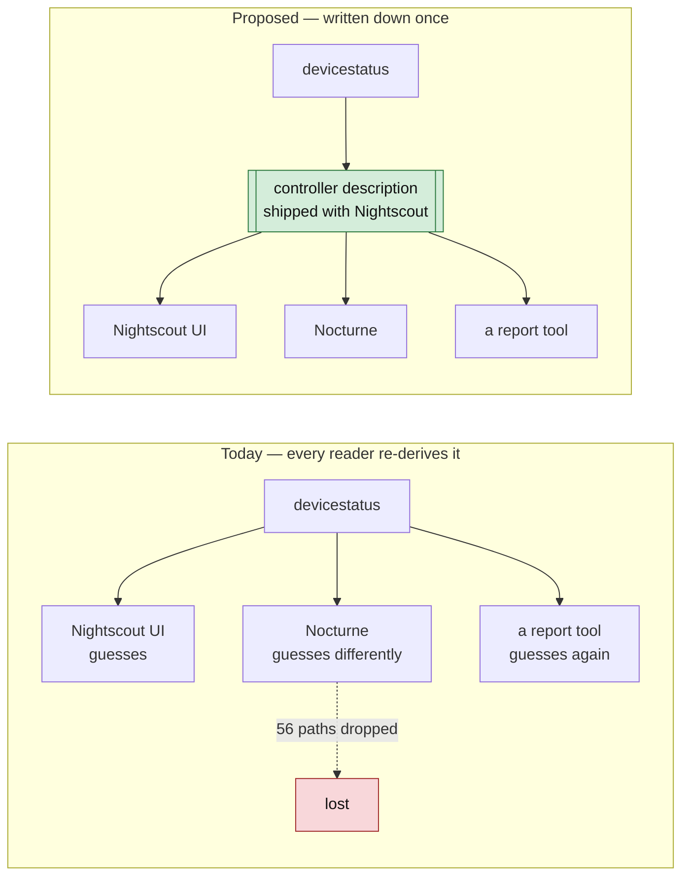
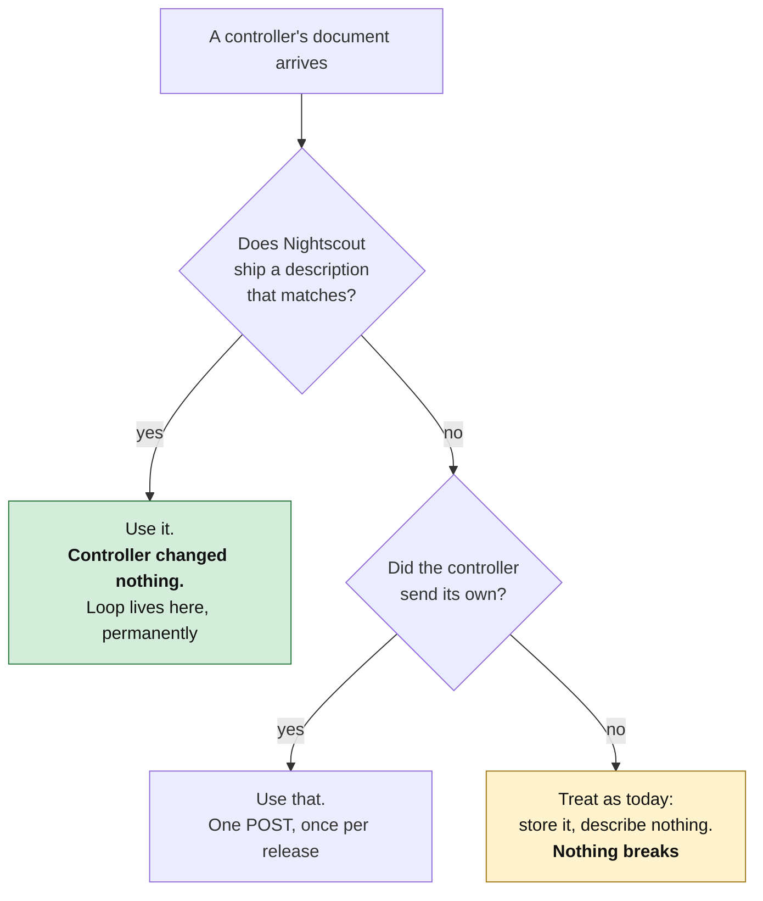

# Proposal: let Nightscout describe the controllers it already recognises

Date: 2026-09-11. Status: draft for discussion. **One page of proposal, then
a worked example, then the evidence.**

> **This is not Kubernetes.** There is no control plane, no admission
> controller, no operator, no CRDs, and nothing a controller must call before
> it is allowed to write. See [§4](#4-what-this-is-not), which exists because
> the first version of this idea was described as "registration" and read as
> all of that.

---

## 0. What this series is for

Nine documents precede this one and none of them said this plainly, which is
a defect worth fixing before the tenth. The work has three motivations, and
every measurement in the series serves one of them:

| | Motivation | Why it is not optional | Where the evidence is |
|---|---|---|---|
| **a** | **Unify typed representations of data.** One place says what a field means, what type it holds, and which controller writes it | Today every reader re-derives it and they disagree. 56 of 166 `devicestatus` paths are dropped by a typed consumer because the shape was never written down | [Typed schemas](./nightscout-typed-schema-evidence-2026-09-10.md), [Primitive coverage](./nightscout-primitive-coverage-2026-09-11.md), `specs/sync/primitives.yaml` |
| **b** | **Provide ways to extend it.** A controller can ship a feature nobody else has without negotiating with the ecosystem first | The current answer is "invent an `eventType` and hope". The [quirks registry](../../specs/quirks/) is the archaeology of that answer | [Extensibility models](./nightscout-extensibility-models-2026-09-10.md) §1, §5 |
| **c** | **Offer full data fidelity — replay and observability.** What a controller decided, on what inputs, in what state, is recoverable afterwards | Replay completeness is **20% for Loop, 50% for the oref0 family**. A real consumer reads settings from screenshots because there is nowhere else | [devicestatus and profile fidelity](./nightscout-devicestatus-profile-fidelity-2026-09-10.md) §3, [Hub-and-spoke sync](./nightscout-hub-sync-architecture-2026-09-11.md) §4.2, `specs/conformance/observability-profile.yaml` |

**Motivation (c) now has a change list rather than a measurement.**
[Concrete changes for replay fidelity](./PROPOSAL-replay-fidelity-changes-2026-09-11.md)
names them: eight more keys in a settings block Loop already writes takes it
from 20% to 65% recorded and 100% recorded-or-derivable; one input-vector
object takes the oref0 family from 50% to 78% and 100%. Neither needs a new
API version, and the same document shows why adding typed resources need not
cost a single extra request.

**These pull against each other, and the controller description is the
artifact that resolves the tension.** Unification (a) pushes toward one
fixed schema; extensibility (b) pushes toward letting each controller differ;
fidelity (c) fails if either wins outright — a schema too fixed drops the
vendor subtrees, and a schema too open cannot say what is missing. A
description is the third option: **the shape stays per-controller, and the
*fact* of it is unified.** That is also how (c) becomes measurable at all,
because "Loop does not publish `automaticBolusApplicationFactor`" is only
sayable once something enumerates what Loop publishes.

**And the practical outcome, which is the point of the whole exercise:** a
controller keeps innovating on the features unique to it, while every
controller gets a sync and observability floor for free. Being *described*
earns the floor with no controller change (§3); publishing a description of
your own is how you go above it. Nothing in this series asks a controller to
give up what makes it different — it asks that the difference be written
down where other software can read it.

---

## 1. The problem, in one paragraph

Nightscout already knows what kind of controller wrote a document — it has to,
because Loop's `devicestatus` and Trio's look nothing alike. But that
knowledge lives nowhere: it is re-derived, differently, by every reader.
So the same divergence is rediscovered over and over, and the parts nobody
writes down get silently dropped. Three measured consequences:

| | Measured |
|---|---|
| `devicestatus` paths a typed consumer silently drops | **56 of 166** — including Loop's automatic dose recommendation, on 10 of 11 sites |
| Loop dosing inputs recorded in Nightscout | **4 of 20**. Eight are absent, including the factor that scales every automatic dose |
| Temporary effects that record what they *did*, not just why | **2,934 of 3,415** — the other 481 carry a label and no effect at all |

None of this is a bug in any project. It is the cost of the shape being
tacit.

## 2. The proposal

**Write the description down, in the hub, on the controller's behalf.**



A **controller description** is a static file that says: here is how to
recognise this controller's documents, here is what it writes, here is which
dosing inputs it publishes and which it does not.

**Nightscout ships these files, and serves them.** A controller that never
changes anything still gets described correctly, because the descriptions are
generated from measurements of what controllers actually write — not from what
they promise.

### 2.1 Serving the catalogue: `.well-known`

Shipping the files only helps software that vendors this repository. Serving
them helps everything that can make an HTTP request:

```
GET /.well-known/nightscout/controllers          → the catalogue index
GET /.well-known/nightscout/controllers/loop      → one description
```

Static JSON or YAML, cacheable, no authentication — a description of a
*controller product* contains nothing about a person, which is what makes it
servable at all (`specs/sync/sensitivity.yaml` carries the type-level
sensitivity annotation that says so).

This is a small change with a disproportionate effect on motivation (a),
because it moves the unification from *this repository* to *the deployment*:

| Reader | Today | With a served catalogue |
|---|---|---|
| Nightscout's own UI | re-derives the shape inline | reads its own catalogue |
| Nocturne | re-derives it differently — 56 paths dropped | reads the same file |
| A report or replay tool | vendors this repo, or reverse-engineers four codebases | one GET, no dependency on this repo |
| `oref-digital-twin` | vision model over screenshots | discovers which settings *should* exist, then reads them |
| A follower app | guesses from the device string | structural discriminator, published |
| The site operator | — | can see what their own site believes it is talking to |

It also gives the operator-declared posture a runtime home: a site configured
with `ENABLE=loop` (see the [roadmap](./nightscout-adoption-roadmap-2026-09-11.md) §2.2)
serves the Loop description as its declared expectation, and a controller
that disagrees overrides it by publishing its own. The precedence is the
same three-way order in both places — controller-published, then
operator-declared, then structurally inferred.

**What this is still not:** a required endpoint. A hub that does not serve it
behaves exactly as it does today, and a client that cannot fetch it falls back
to what it does today. It is discovery, not dependency.

## 3. What changes, for whom



| Actor | What they do | When |
|---|---|---|
| **Loop** | nothing, ever | — |
| **Trio, AAPS, a new controller** | optionally POST a description to correct or extend the shipped one | once per release, if they want |
| **Nightscout** | ship the files; read them where it already guesses | phase 1 |
| **A report or replay tool** | read one file instead of reverse-engineering four codebases | immediately |

**The default path requires no controller change at all.** That is not a
concession to get adoption — it is forced by the evidence: Loop has made 24
commits in six months, none touching Nightscout, and is 9 of 11 sites in the
corpus. A proposal Loop must act on is a proposal that does not happen.

## 4. What this is *not*

The word "registration" did the damage. Concretely:

| Not this | Actually this |
|---|---|
| A control plane that must be running | A file. If it is missing, everything works as it does today |
| Something a controller must call before writing | Controllers never have to call anything |
| Dynamic schema upload, CRD-style | Static descriptions, shipped in the repo, reviewed in a PR |
| A new API version | No new endpoints in phase 1 |
| A validator that rejects documents | It describes; it does not gate. Nothing is rejected that is not rejected today |
| Per-tenant configuration | One file per *controller product*, not per user or per site |

The closest familiar thing is not a Kubernetes CRD. It is **a browser's list
of known user agents**, or **`.well-known`**: a description of something that
already exists, kept where everyone can read it, which the thing described
may correct but need not publish. §2.1 takes that from analogy to mechanism —
the catalogue is *served* at a well-known path — but the properties that make
it not-a-control-plane survive the change: it is fetched, not called; it is
advisory, not gating; and its absence is indistinguishable from today.

## 5. Worked example

The whole of phase 1 for Loop, which involves no change to Loop.

**Step 1 — the description Nightscout ships** (abbreviated; the generated
file is `specs/sync/registrations/loop.yaml`):

```yaml
apiVersion: nightscout.dev/sync/v1
kind: ControllerStateModel
metadata:
  vendor: LoopKit
  product: Loop
  algorithmFamily: loop
spec:
  documents:
    - collection: devicestatus
      discriminator: {path: loop, test: is-object}   # structural, not the device string
      decomposesTo: [ApsSnapshot, PumpSnapshot, UploaderSnapshot]
  replayInputs:
    - {input: maxBolus,  status: recorded, path: loopSettings.maximumBolus}
    - {input: automaticBolusApplicationFactor, status: absent, path: null}
```

That last line is the point. `status: absent` with `path: null` is how the
file says **"Loop has this value and does not publish it."** It is not a
complaint; it is the thing that makes "can this dose be reproduced?" a
question with an answer.

**Step 2 — what a tool can now do**, without reading any controller source:

```python
import yaml
reg = yaml.safe_load(open("specs/sync/registrations/loop.yaml"))
absent = [i["input"] for i in reg["spec"]["replayInputs"] if i["status"] == "absent"]
print(f"Loop replay is missing {len(absent)} inputs: {absent[:3]} ...")
# Loop replay is missing 8 inputs: ['automaticBolusApplicationFactor',
#   'carbAbsorptionModel', 'gradualTransitionsThreshold'] ...
```

Today the same answer takes reading `AlgorithmInput.swift`, `LoopStatus.swift`
and a corpus of documents. `oref-digital-twin` currently gets settings out of
**screenshots, with a vision model**, because there is nowhere to read them
from.

**Step 2a — the same thing over HTTP**, for a reader that does not vendor this
repository:

```
GET https://<site>/.well-known/nightscout/controllers/loop
```

Same document, no checkout, no authentication, cacheable. This is what makes
Nocturne and a report tool able to agree without either depending on the
other.

**Step 3 — a controller that wants to correct it** posts the same document to
the hub. One request, per release, optional. The served catalogue then
reflects the correction, so every other reader of that site picks it up
without coordinating with anyone.

## 6. Impact, measured

| | Today | With descriptions |
|---|---|---|
| A reader learning a controller's shape | read 4 codebases | read 1 file |
| Loop's dose recommendation reaching a typed consumer | dropped, 10 of 11 sites | described, so droppable only on purpose |
| "Which dosing inputs can I not replay?" | unanswerable without source | 8, named, per controller |
| A new controller's on-ramp | improvise an `eventType`, hope | a file to copy |
| Two readers agreeing on a controller's shape | vendor the same repo, or diverge | fetch the same URL |
| Sync request floor for a described controller | 1,440–5,760 requests/day, per controller's own design | the batched contract's 576, earned by being described |
| A controller's unique feature | negotiate, or be silently dropped | declared in its own description; readers can choose to handle it |
| Cost to Loop | — | **zero** |
| Cost to Nightscout | — | read a file it can already generate; optionally serve it |

## 7. If you only do one thing

**Phase 1 is not this proposal.** It is smaller, and it needs neither
descriptions nor new endpoints:

> Agree a schema for the `settings` collection — which cgm-remote-monitor
> already enables in v3 — so controllers can publish the settings that
> determine dosing.

That closes the complaint physicians actually make, and the
[roadmap](./nightscout-adoption-roadmap-2026-09-11.md) sequences it first for
that reason. Controller descriptions are phase 3, and are worth doing because
they make phase 1 *checkable* — a description states which settings a
controller publishes, so "it publishes none" stops being invisible.

## 8. Evidence and caveats

Every number above is reproducible from this repository:

| Claim | Command | Output |
|---|---|---|
| 56 of 166 `devicestatus` paths dropped | `make schema-nocturne` | `reports/schema-census/nocturne-coverage.json` |
| Loop records 4 of 20 dosing inputs | `make schema-dosing` | `reports/schema-census/dosing-inputs.json` |
| 2,934 of 3,415 effects separable | `make schema-effects` | `reports/schema-census/effects.json` |
| The shipped descriptions | `make schema-sync-model` | `specs/sync/registrations/` |

**Caveats that matter to this proposal specifically:**

* The corpus is **Loop-dominant** — 9 of 11 sites — and contains **no AAPS
  closed-loop site at all**. Every AAPS statement is read from its source, not
  observed.
* The descriptions are generated from **one corpus and today's source**. A
  wrong shipped description is worse than none, which is why they are
  versioned, derived from measurement rather than assertion, and why a
  controller must always be able to disown one.
* **No maintainer has been asked anything.** Every phase that names a project
  is a proposal to that project, not a plan for it.

## 9. Where to read more

| If you want | Read |
|---|---|
| Why the schemas were wrong, with measurements | [Typed schemas](./nightscout-typed-schema-evidence-2026-09-10.md) |
| What `devicestatus` loses and why replay fails | [devicestatus and profile fidelity](./nightscout-devicestatus-profile-fidelity-2026-09-10.md) |
| Effects versus motivations, and privacy | [Effects and versioning](./nightscout-effects-and-versioning-2026-09-11.md) |
| The sync contract, if descriptions are adopted | [Hub-and-spoke sync](./nightscout-hub-sync-architecture-2026-09-11.md) |
| Who should do what, in what order | [Adoption roadmap](./nightscout-adoption-roadmap-2026-09-11.md) |
| Whether the primitives are actually evidenced | [Primitive coverage](./nightscout-primitive-coverage-2026-09-11.md) |
| Prior art for all of this in the hub's own tree | `cgm-remote-monitor/docs/proposals/` — `agent-control-plane-rfc.md`, `bridge-rules.md`, `conflict-resolution.md`, `integration-questionnaire.md`. See [hub-and-spoke sync](./nightscout-hub-sync-architecture-2026-09-11.md) §5.2 |
| What to change in that prior art, and what it already gets right | [Reconciling the agentic control plane RFC](./nightscout-control-plane-reconciliation-2026-09-11.md) — seven claims the corpus confirms, five it corrects, twelve proposed edits |
| The concrete changes that raise replay fidelity, per project | [Replay fidelity changes](./PROPOSAL-replay-fidelity-changes-2026-09-11.md) — five changes, measured before and after |
