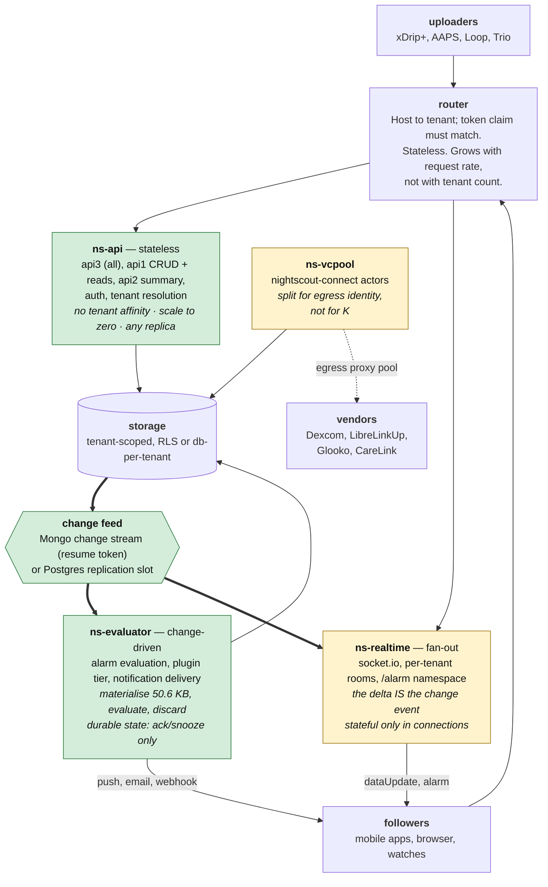

# Deployable components: entrypoints, program structure, and what an operator actually runs

Date: 2026-09-14. Status: draft for maintainer discussion.
Companion to [Nightscout multitenancy: evidence and options](nightscout-multitenancy-discussion-2026-09-09.md)
and [What sets K](../60-research/multitenancy-k-and-residency-2026-09-14.md).

**Nothing here is a proposal to merge.** This answers a specific question: given everything
the experiments measured, *what are the deployable units*, what goes in each, how do they
talk to each other, and which arrangement is cheapest for an operator to run.

**Baseline.** [PR #8733](https://github.com/nightscout/cgm-remote-monitor/pull/8733) — the
two quadratic scans over the treatment window — is treated as **landed**, not as a branch of
the decision tree. It is open against `dev` with differential tests over 636 randomised
fixtures and a measured 6.3×–43× improvement. Every number below is post-#8733.

**Objective function, as stated by the maintainer: minimise operator cost first, then
maximise performance.** So the units here are processes, gigabytes and database operations
per second — not milliseconds.

---

## TL;DR

**Recommendation: three hosted entrypoints — `api` (stateless), `evaluator` (change-driven),
`realtime` (socket fan-out) — plus `vcpool`, over one shared core, with the existing
single-tenant server as a fourth entrypoint that changes nothing.** At 10,000 tenants that is
**5 processes, 0.5 GB and 633 database operations per second**, against **13–17 processes**,
5–27 GB and 4,285–6,183 ops/s for the resident-shard options — process counts now measured
with a real database in the loop (EXP-MT-026), not modelled.

**This reverses the [K report](../60-research/multitenancy-k-and-residency-2026-09-14.md)
§7's rejection of architecture D**, and the maintainer's objection is why: an 8–15 ms CPU
margin is not the right axis on which to choose a design that needs a tenant→shard map,
sticky routing and a rebalancer over one that needs none. Three measured facts, none of them
latency, decide it:

| # | Finding | Evidence |
|---|---|---|
| 1 | **After #8733, ~81 % of the load cycle is residency bookkeeping, not derivation.** `cache.insertData`'s defensive deep clone is **4.08 ms of a 6.27 ms cycle**; `calcDelta` spends another ~1.0 ms deep-comparing two snapshots to rediscover what the write path already knew | {R} §12.3 |
| 2 | **Polling costs an order of magnitude more database than querying on demand.** The resident model runs ~14 DB ops per tenant per cycle *on a timer*, for tenants nobody is asking about: **6,183 ops/s** at 10,000 tenants against **633** stateless | {R} §12.6 |
| 3 | **API v3 already holds no resident state.** Zero `ctx.ddata` references in `lib/api3/`; its "cached" collection wrapper is write-through only. The stateless tier does not have to be built — it has to be *given its own entrypoint* | {R} §12.1 |

**The two things that made residency look necessary both dissolve on measurement.** Alarms
for idle tenants need a **50.6 KB transient** working set, not a resident `ddata` — and its
only durable part is ack/snooze state, a few hundred bytes that belong in storage anyway. The
socket delta needs a *change*, which both storage engines already produce.

**What residency genuinely buys, and it is one endpoint**: `/api/v1/entries.json` is served
from memory with **zero database operations** today. That is the highest-QPS endpoint in the
ecosystem. Replacing it with a query is 533 ops/s at 10,000 tenants — affordable, and
collapsible with a shared response cache keyed on `(tenant, lastUpdated)`. **A cache, which
is evictable and correctness-neutral, not a resident `ddata`, which is neither.**

**Storage: Postgres + RLS, and the evidence for it is now narrower and firmer.** EXP-MT-011b
showed index locality no longer separates the engines — an explicit discriminator gives
MongoDB's planner perfect bounds. EXP-MT-057 shows what does: under RLS an unbound connection
returns **0 rows** and a bound one with **no tenant predicate in the SQL at all** returns only
that tenant's, at **0.383 ms p50** — *faster* than writing the filter by hand, with the policy
predicate compiled into an `Index Cond`. The same forgotten filter against a Mongo
discriminator returns **every tenant's rows**. For a system holding other people's clinical
data, fail-closed is the deciding property.

**At 1,000 tenants all three options cost 3–5 processes.** The stateless decomposition is
never materially more expensive to start and is 2–3× cheaper by 10,000. There is no scale at
which it is the wrong first move.

> **EXP-MT-026 has now been run** with MongoDB 7.0 in the loop, including real RTT via
> `tc netem` —
> [the report](../60-research/exp-mt-026-database-in-the-loop-2026-09-14.md). **The
> recommendation survives and its margin widens**: the measured database cost moves A from 13
> to **17** processes and B from 10 to **13**, leaving C at **5**. The assumption the model
> rested on is confirmed — CPU per operation grows **2.5×** between loopback and 50 ms RTT
> while wall time grows ~75×, and event-loop delay p50 stays flat at 1.1 ms — so **process
> count is RTT-insensitive** and what RTT buys you is a pool-depth requirement (~100 in flight
> at 50 ms), not more machines. Two things changed: a typed cache hit is **10×** cheaper than
> the equivalent query (0.02 vs 0.207 ms CPU), making §2.1's response cache load-bearing
> rather than optional; and **§6.7's A′ storage rung does not scale** — `mongod` holds ~3.7 MB
> of non-evictable RSS per tenant database containing zero documents, more than the app-side
> state A′ was supposed to save — though **that ceiling is a property of database-per-tenant,
> not of multitenancy**: one logical database with a tenant discriminator holds **104
> WiredTiger files in total at 400 tenants**, flat, with the planner examining 10 keys per
> 10-document read at every scale (EXP-MT-011b). The storage shape these components sit on
> should be **shared-collection with a storage-enforced predicate**, not database-per-tenant.
>
> What remains unmeasured, and it is not small: **no TLS and no authentication** were in the
> loop, and both land on exactly the CPU-per-operation term the recommendation depends on.

---

## 1. What the evidence actually constrains

Three questions decide a component boundary. Only the third is about performance.

1. **What state does this code need, and for how long?** — decides whether it can be
   replicated freely.
2. **What wakes it up?** — a request, a timer, or a change. Decides whether it can scale to
   zero.
3. **What binds it?** — CPU, memory, sockets, or somebody else's rate limiter. Decides
   whether it belongs with its neighbours.

Counted against `dev` @ `a8888f0d`, every server-side reader of resident state
({R} §12.1):

| Path | Resident state | Woken by | Binds on |
|---|---|---|---|
| **`lib/api3/**` — all of it** | **none** | request | request rate |
| API v1 CRUD and writes | none (borrows `processRawDataForRuntime` as a function) | request | request rate |
| API v1 `entries` read | optional cache, **graceful DB fallback** | request | clone CPU |
| API v1 `Last-Modified` | latest SGV | request | — |
| Loop remote API (`server/loop.js`) | profile only | request | — |
| `/alarm` socket namespace | **none** — pure fan-out off the bus | change | sockets |
| Alarm evaluation (18 plugins) | **50.6 KB transient** + durable ack/snooze | change | CPU |
| API v2 `summary` | full `ddata` | request | CPU |
| `dataUpdate` socket delta | full `ddata` **+ prior snapshot** | change | CPU |
| Vendor connectivity | 419 KB/actor session state | timer | **vendor rate limit** |

**Only two paths require a whole resident `ddata`**, and both are derivable without one: v2's
summary is a report over a window — a query — and the socket delta is a change, which both
engines emit natively (§4).

**Everything else is already stateless, already transient, or already has a fallback.** The
single-tenant assumption people reach for — `ctx` bound at module scope — turns out to be
less load-bearing than the assumption nobody wrote down: *that all of these consumers should
be served from one merged object rebuilt on one debounce.*

## 2. The components



**The integration rule that makes this tractable: no hosted component calls another
synchronously.** They share a store and a change feed. `router → api` is the only
request-path edge. That is what lets each one be replicated, restarted, or scaled to zero
without anything else knowing.

### 2.1 `ns-api` — stateless

**Holds:** nothing per tenant. **Woken by:** a request. **Binds on:** request rate.

All of API v3 unchanged, API v1 CRUD and reads, API v2 summary re-expressed as a query,
auth, tenant resolution. Any replica serves any tenant; there is no map to keep, no warm-up,
no rebalance, and a replica can be killed mid-flight.

The one real change is `/api/v1/entries.json`, which today answers from `ctx.cache` with no
database operation. Two honest consequences:

- **It becomes 533 queries/s at 10,000 tenants** (three followers polling once a minute).
  That is included in the 633 ops/s total and is well within one primary.
- **A shared response cache keyed on `(tenant, lastUpdated)` collapses it** to roughly the
  change rate. This is the *right* use of Redis/keyv here — an opaque value, no query
  language needed, exactly what {M} §7.6 already scoped keyv for — and it is a cache: a miss
  costs a query, not a correctness failure.

**Fix `lib/api/entries/index.js:459-500` before anything else touches it.** `?count=10`
costs 0.83 ms or 0.02 ms for a byte-identical response depending on whether the caller passed
`find[type]=sgv`, because the untyped branch deep-clones the whole 48-hour array before
slicing ({R} §12.2). A **42× overcharge on the ecosystem's busiest endpoint**, fixed by
slicing before cloning, which preserves the defensive property exactly.

**Storage shape.** These components assume one logical store with a tenant discriminator, not
database-per-tenant. EXP-MT-011b measures the namespace cost of that choice as flat (104 files
total at 400 tenants, against 47 per tenant for database-per-tenant) and index locality as
exact (10 keys examined per 10-document read at every tenant count). The cost it trades for is
that **a query omitting the discriminator silently returns every tenant's rows** — 230,400
documents in 92 ms, no error — which is why the isolation predicate has to be enforced by the
storage engine (Postgres RLS binding per transaction) rather than by ~30 call sites
remembering a filter. `ns-api` is the component where that matters most, because it is the one
that takes arbitrary client queries.

### 2.2 `ns-evaluator` — change-driven

**Holds:** a 50.6 KB working set per evaluation, discarded immediately. **Woken by:** the
change feed. **Binds on:** CPU, at 0.92 ms per evaluation.

This is the component that makes residency unnecessary, so it is worth being precise about
what it needs. Surveying all 18 plugins implementing `checkNotifications` ({R} §12.5): the
latest reading, ~20 minutes of SGVs for `ar2`, the latest of six special treatment types —
which `dataloader.js:396-418` **already fetches as six `count:1` queries** — the latest
devicestatus, the profile, and a DIA window of treatments for `boluswizardpreview`.

At 10,000 tenants uploading every five minutes: **33 evaluations/s, 31 ms/s of CPU, one
process.**

**The one piece of durable state is ack/snooze**, and this is where {M} §3.1's blocker
finally resolves properly rather than incidentally. `lib/notifications.js:15`'s module-scope
`alarms` map has no tenant dimension; the modernization branch moved it inside `init()` for
teardown reasons. In this design it does not live in process memory at all — it is a
`(tenant, level, group)` row in storage, which is what lets **any** evaluator replica handle
**any** tenant's change. Alarm state surviving a process restart is a safety property that
happens to be free here and is genuinely hard in a resident design.

**Scale-to-zero is safe for this component in a way it is not for a resident shard.** The
{M} §7.4 objection — "a quarter-second to start the process before any round-trip, bad for
an alarm engine cold-booting" — applied to *per-tenant* processes. These replicas are shared
and always warm; 266 ms of process start is paid once per replica, not once per tenant.

### 2.3 `ns-realtime` — fan-out

**Holds:** connections. **Woken by:** the change feed. **Binds on:** socket memory,
~31 KB/socket.

Socket.IO with per-tenant rooms and the `/alarm` namespace. `lib/api3/alarmSocket.js` is
already independent of `calcdelta` — it is bound to `ctx.bus.on('notification')` — so alarm
fan-out moves here unchanged except for tenant rooms. It currently emits to the whole
namespace with no room at all, which is a worse leak than `DataReceivers` and must be fixed
before any second tenant exists ({M} §3.4).

**`calcdelta` does not move here; it goes away.** At 6,000 sockets and 33 changes/s the emit
cost is 1.8 ms/s — three orders of magnitude below the 1.0 ms/tenant/cycle that `calcDelta`
spends deep-comparing snapshots. The delta *is* the change event, already carrying which
document changed and for which tenant. This is the conclusion {M} §5.4 reached from the
headless direction, now supported from the cost direction as well.

**10,000 tenants at 15 % active and four sockets each is 6,000 sockets, 0.2 GB, one
process.** Sockets need affinity only within this component (sticky sessions or a socket.io
adapter) — a property of the protocol, not of the tenancy model.

### 2.4 `ns-vcpool` — vendor connectivity

Separate for one reason, and it is not K: the machinery holds ~9,700 accounts, but what binds
it is the **vendor's per-account and per-egress-IP rate limiting** ({R} §6.2, {M} §10.5),
which is a resource no other component budgets and which no harness here can measure
(EXP-MT-051). Its failure modes — thundering herds, backoff storms, vendor outages — are also
unrelated to anything else's.

Two changes that need no vendor access and should land regardless: **start jitter** (800
actors fire their first request inside one second, on every restart and deploy, because
`run()` has no jitter) and **interval jitter** (they stay phase-locked on the same five-minute
boundary afterwards).

### 2.5 `ns-single` — the existing server, unchanged

Self-hosted single-tenant stays first-class permanently, on data-rights and mission grounds
({M} §11). It keeps `ctx.ddata`, `ctx.cache`, `calcdelta` and one process, because at one
tenant residency is unambiguously right: the cache costs 2.6 MB and saves every read a
round-trip, and nothing about a single site needs a change feed.

**This is what stops the decomposition from being a rewrite.** The hosted entrypoints and the
single-tenant server are different `bin/` scripts over the same `lib/`. Nothing in §2.1–2.4
deletes code the single-tenant target needs; it selects a different subset of it.

## 3. Program structure

```
packages/
  core/                 domain logic, no server, no ctx binding
    data/               ddata, calcdelta        <- kept: ns-single and the derivation paths
    plugins/            the 30-plugin registry  <- unchanged, already sandbox-shaped
    storage/            the §6.2 repository seam <- the one real prerequisite
    notifications/      alarm evaluation + delivery
    connect/            nightscout-connect, in-tree
  server/               express app, routers, auth, socket transport
bin/
  single.js             ns-single    — today's server, unchanged
  api.js                ns-api       — express + storage, no bus, no ddata
  evaluator.js          ns-evaluator — change feed + notifications, no express
  realtime.js           ns-realtime  — socket.io + change feed, no storage writes
  vcpool.js             ns-vcpool    — connect actors + egress proxy
```

**Four hosted entrypoints and one legacy entrypoint, over one `package.json` and one CI
pipeline** — not five repositories. {M} §10.5 already argued this and it holds: these are
thin `bin/` scripts selecting which factories to call, not independent products with
independent release cycles.

**The structure is mostly already there.** {M} §9.1's finding was that `bootevent()`,
`sandbox.js`, `plugins/index.js` and `data/*` are already `init(env, ctx)` factories with
essentially no module-level mutable state. What each entrypoint does is call a *subset* of
that chain:

| Entrypoint | bus | dataloader | ddata | cache | plugins | notifications | express | socket.io | storage |
|---|:-:|:-:|:-:|:-:|:-:|:-:|:-:|:-:|:-:|
| `single` | ✓ | ✓ | ✓ | ✓ | ✓ | ✓ | ✓ | ✓ | ✓ |
| `api` | | | | opt | | | ✓ | | ✓ |
| `evaluator` | ✓ | | | | ✓ | ✓ | | | ✓ |
| `realtime` | ✓ | | | | | | | ✓ | r/o |
| `vcpool` | ✓ | | | | | | | | w |

The genuinely new code is small and bounded: **a change-feed consumer**, **ack/snooze state
in storage instead of a module-scope map**, **tenant rooms**, and **the storage seam**
({M} §6.2) that everything else already depended on.

## 3.5 How the evaluator is woken, and how alarms reach subscribers

**Measured 2026-09-14, EXP-MT-057** — PostgreSQL 16.14, 400 tenants, 230,400 rows.

**No single mechanism is sufficient, and the split is not about throughput.** For an alarm
path, a delayed event is a nuisance and a dropped event is a missed hypo alert, so the
question that separates the candidates is *what happens while the consumer is not there*:

| mechanism | while connected | **written while consumer down** | **delivered when it returned** |
|---|---|---:|---:|
| `LISTEN`/`NOTIFY` | 500/500, **1 ms** p50 | 200 | **0 — all lost, permanently** |
| logical replication slot | — | 200 | **200/200, and no replay on re-consume** |
| write-path publish | — | — | misses anything not written through `ns-api` |
| bounded aggregate poll | — | — | **~1 ms per sweep, any backlog** |

**The recommendation is three of them, layered:**

1. **A logical replication slot is the spine.** The only mechanism that survives a consumer
   restart without losing an alarm. Its cost is WAL retention — 574 bytes per row, so an
   *abandoned* slot pins ~0.06 GB/hour at a 10,000-tenant write rate. That needs an alert, but
   an operator has days to react, not minutes.
2. **`NOTIFY` is an optional latency accelerator.** It cuts write-to-evaluation to ~1 ms. It
   carries no correctness weight, so its lossiness is irrelevant.
3. **A bounded aggregate poll is the non-optional backstop.** Not today's per-tenant poll —
   *one* query for "which tenants have a reading newer than their last evaluation", bounded by
   a `date` index: **1.02 ms per sweep** whatever the tenant count, against 13.7 ms unbounded
   and 20.9 ms at cold start. At one sweep per 30 s that is 0.03 ms/s. **Slots get dropped and
   consumers get partitioned; for an alarm path, "the feed broke and nobody noticed" is the
   failure that matters.** It also handles cold start, where every watermark is behind.

**Write-path publish is rejected**: it misses backfills, migrations and anything
`nightscout-connect` writes directly, and it couples two components that otherwise share only
storage.

### 3.5.1 What controls the evaluator's scaling

**The change rate, not the tenant count** — 33 evaluations/s at 10,000 tenants uploading every
five minutes, 0.92 ms each (EXP-MT-026 §5), so one process with room to spare.

Scaling out has one structural constraint worth stating: **a replication slot is a single
ordered stream and cannot be consumed by N workers.** The shape that follows is one cheap slot
reader feeding a queue partitioned by tenant hash, with N stateless workers behind it. The
partition is not for throughput — it is because two changes for the same tenant evaluated
concurrently would race on that tenant's ack/snooze state. **Per-tenant ordering is required;
cross-tenant ordering is not.** Because ack state lives in storage, any worker can take any
partition, so there is still no tenant→worker affinity to maintain.

### 3.5.2 Does the evaluator tell the socket engine?

**For data updates, no.** `ns-realtime` consumes the same feed independently. Chaining them
would make socket latency depend on alarm evaluation finishing, for no benefit.

**For alarms, yes — but not by calling it.** The evaluator **writes the alarm as a row**, and
the feed carries it to `ns-realtime` like any other change. One mechanism, and three
properties fall out that the current design has to work for:

- **Alarms become durable and auditable** — today they exist only as a socket emit and a
  push notification.
- **A reconnecting client can query what it missed**, which is the offline-delivery property
  §5.4 of {M} wanted an MQTT broker for. No broker.
- **`lib/api3/alarmSocket.js` barely changes.** It is already bound to
  `ctx.bus.on('notification')` rather than to `calcdelta`; the bus event becomes a feed event.

```
writes ──> storage ──> feed ──┬──> ns-realtime ──> dataUpdate to tenant room
                              └──> ns-evaluator ──> alarm row ──> storage ──> feed ──> ns-realtime ──> /alarm
```

### 3.5.3 How a change actually reaches one tenant's subscribers

**Measured 2026-09-14, EXP-MT-058.** The evaluator does not push to subscribers at all — and
neither hop needs stateful tracking beyond the sockets themselves.

- **Fan-out works without affinity.** 32 concurrent `LISTEN` connections, 200 `NOTIFY`s:
  **6,400/6,400 deliveries, 0 ms p50 / 4 ms max.** Every `ns-realtime` process sees every
  event it subscribed to, so none of them needs to be *the* process for a given tenant.
- **Postgres does the per-tenant routing itself.** One connection held **10,000 `LISTEN`
  channels** at ~0.1 ms per subscribe, and a `NOTIFY` to an unsubscribed channel was filtered
  server-side. So `ns-realtime` `LISTEN`s on `tenant_<id>` for exactly the tenants it holds
  sockets for, and `UNLISTEN`s on last disconnect.
- **A real delta fits inline.** A `dataUpdate` with one SGV and one Loop devicestatus
  (72-point prediction) is **1,039 bytes** against a 7,900-byte usable limit. A batch upload
  can exceed it, so the fallback — `NOTIFY` carries a row id, the listener reads the row at
  **0.183 ms** — should be implemented rather than assumed away.

**What state `ns-realtime` holds: the socket rooms, and one `LISTEN` per tenant it currently
serves.** Both are connection state, discarded on disconnect. **No per-tenant cursor, no
delivery tracking, no polling.** Durability is not in this path — it is in the alarm row, which
a reconnecting client queries, and in the push channel, which `ns-evaluator` emits directly so
the safety-critical delivery never traverses a socket.

```
write ──> WAL ──> slot reader (privileged, cross-tenant)
                    ├──> queue partitioned by tenant hash ──> ns-evaluator workers
                    │                                            └──> alarm row ──> WAL ──┐
                    └──> pg_notify('tenant_<id>', delta) ────────────────────────────────┤
                                                                                          │
                       ns-realtime ── LISTEN only on tenants it holds sockets for ◄────────┘
                            └──> io.to('DataReceivers:<id>').emit(...)
```

**One hazard, and it changes the implementation.** A `LISTEN`ing session that stops consuming
pins the shared 8 GB notification queue: measured at **~2.6 M notifications to fill, ~21.7
hours** at a 10,000-tenant change rate with 4 KB payloads (roughly 4× that at the realistic
1,039 bytes). Write latency does not degrade on the way, so there is no early warning —
`pg_notification_queue_usage()` has to be a real alert. **And when it fills, `NOTIFY` blocks.**

> **So do not `NOTIFY` from an `AFTER INSERT` trigger.** That puts it inside the ingest
> transaction, and a wedged display component would eventually stop CGM uploads. **`NOTIFY`
> from the slot reader instead** — it is already consuming every change for the evaluator, so
> this costs nothing and removes the notification queue from the write path entirely. Ingest
> then depends only on the WAL, and a stuck `ns-realtime` can only make realtime stale.

### 3.5.3.1 Does `NOTIFY` scale this way, and should this be Kafka?

**Measured 2026-09-14, EXP-MT-059.** `NOTIFY` degrades in **listener count**, not in message
rate — 7,873 NOTIFY/s at one listener falling to 495 at 256 (**15.9×**), while the message-rate
ceiling is ~35,000/s, **286× the 33/s this design generates** at 10,000 tenants.

**The design survives because subscribers are not listeners.** Websockets are held by
`ns-realtime` processes and only the *processes* `LISTEN`. At ~31 KB/socket one process holds
~10⁵ sockets, so 10,000 tenants × 4 followers is 40,000 sockets — **one or two listeners**, at
the top of that curve. Reaching 100 listeners needs ~10⁶ tenants.

> **Write this into the design, because the two shapes look alike:** 10,000 channels on **one**
> connection (§3.5.3) works. 10,000 connections holding one channel each does not. A design in
> which each subscriber or each tenant holds its own `LISTEN` collapses.

**A live trap between two recommendations.** §6.7 of {M} wants **pgbouncer in transaction
mode**; `LISTEN` is *session* state. Measured against `edoburu/pgbouncer` at
`pool_mode = transaction`: `LISTEN` is **accepted with no error and delivers nothing** — 50
`NOTIFY`s sent, 0 received. Nothing logs a reason. **`ns-realtime` and the slot reader must
connect directly to Postgres**, not through the transaction-mode pooler; that is a handful of
direct connections beside a pool serving `ns-api`, so it costs nothing, but it fails silently
if missed.

**On Kafka: the design already has the durable ordered log — the WAL.** A replication slot
delivers everything written while the consumer was gone and does not replay (§8.3). Kafka would
be a *second* log, and its central value is durability and replay, which is precisely what this
hop deliberately does not want (§3.5's asymmetry). {M} §6.3 reached the same conclusion from
the migration direction, and {M} §7.4 notes per-tenant Kafka topics were part of the 11–12
Kubernetes objects per tenant that made the current hosting model expensive.

**If `NOTIFY` ever binds, Kafka is still not the next step** — the limit is listener fan-out,
and the tools for that are Redis pub/sub or NATS, which are fan-out buses without durability.
Concrete triggers for revisiting: >~100 listening processes (~10⁶ tenants), a change rate near
10⁴/s (~100×), storage moving off Postgres, or a requirement that fan-out survive database
unavailability. **None is within an order of magnitude of the target.**

### 3.5.4 The constraint this exposes: RLS cannot protect the feed

**The evaluator must see every tenant** — that is its job — so it cannot run under a policy
binding it to one. Reading a replication slot needs the `REPLICATION` attribute, which is not
tenant-scoped at all: the WAL is one stream containing every tenant's rows. So the isolation
story is genuinely split, and the design should say so rather than imply RLS covers everything:

| path | isolation enforced by |
|---|---|
| `ns-api` — arbitrary client queries | **the database** — RLS, per-transaction bind, fail-closed |
| slot reader + `ns-evaluator` | **code review**. Cross-tenant privilege by construction |
| `ns-realtime` | **the database** — it `LISTEN`s only on the tenants it serves (§3.5.3) |

RLS protects the path that takes untrusted input, which is the one that most needs it. §3.5.3
narrows the privileged surface further than expected: because Postgres filters per-tenant
channels server-side, **`ns-realtime` never receives another tenant's data at all**, leaving
only the slot reader and the evaluator unavoidably cross-tenant.

**That is still a blast radius of every tenant, and no storage mechanism will fix it** — a
replication slot is one stream containing everyone's rows. The design consequence is that the
privileged part must stay **small, single-purpose and genuinely reviewed**, which is an
argument for these being separate narrow entrypoints rather than modes of one large process —
and a better argument for this decomposition than the cost model is.

## 4. Integration: the change feed

Both engines produce a change stream natively, and the differences matter more than the
similarity ({M} §5.4 covers the transport question; this covers delivery).

| Mechanism | Delivery | Retention on consumer restart | Per-tenant filter |
|---|---|---|---|
| Postgres `LISTEN`/`NOTIFY` | fire-and-forget, 8 KB payload cap | **none** — a disconnected listener misses everything | in the payload |
| Postgres logical replication slot | resumable | **retains position** — but an abandoned slot pins WAL and fills the disk | `tenant_id` on the row |
| MongoDB change stream | resumable via resume token | bounded by the **oplog window** | server-side `$match` |

**`NOTIFY` is a wake-up signal, not a delivery guarantee.** For a browser refresh that is
fine. **For alarm delivery it is not** — an evaluator that was restarting when a hypo landed
must still fire. Use a replication slot (with slot monitoring) or a Mongo change stream, and
treat `NOTIFY` as an optimisation layered on top.

**One constraint on the A′ storage rung that {M} §6.7 does not note.** Change streams are
scoped per database, so database-per-tenant means N cursors — reintroducing exactly the
per-tenant resource multiplication A′ exists to delete. It is resolvable: `client.watch()`
opens one deployment-level stream across all databases and each event carries `ns.db` for
routing. But that needs a replica set and the `changeStream` privilege at deployment scope,
and it should be stated as a precondition of A′ rather than discovered during implementation.

**Latest-reading projection.** On Postgres, `SELECT DISTINCT ON (tenant_id) … ORDER BY
tenant_id, mills DESC` over an index on `(tenant_id, mills DESC)` returns every tenant's
current reading in **one index skip-scan — O(tenants), not O(rows)**. That *is* the alarm
slice's hot part, maintained by the database. {M} §6.3 already wants generated columns for
the 22 `indexedFields`, and `mills` is among them, so most of this is already on the roadmap.

**Do not plan around engine-maintained projections.** Neither engine has incremental
materialized views — Postgres MVs need `REFRESH`, Mongo's `$merge` views are batch. A
latest-value projection is the index above or a small trigger-maintained table.

## 5. The cost model

`tools/mt-bench/deployment-cost.js`. Every input is listed at the top of that file with its
provenance; assumptions are labelled as assumptions. Post-#8733, 30 % event-loop budget,
4 GB/process, 15 % active fraction, three followers per tenant.

**10,000 tenants:**

| | processes | resident RAM | DB ops/s | routing |
|---|---:|---:|---:|---|
| A · stateful shards, all resident | 13 | 26.4 GB | 6,183 | tenant→shard map, sticky, rebalancing |
| B · stateful shards, tiered | 10 | 5.0 GB | 4,285 | + eviction policy + cold-alarm path |
| **C · stateless api + evaluator + realtime** | **5** | **0.5 GB** | **633** | **none except socket stickiness** |

**1,000 tenants:** A = 4 processes, B = 3, C = 5. **The options converge at small scale**, so
the decomposition costs an operator nothing to adopt early and saves 2–3× by 10,000. There is
no crossover where starting with C is the expensive choice.

**Where the post-#8733 cycle goes**, which is why A and B stay expensive:

| | ms | share |
|---|---:|---:|
| `ddata` derivation work (post-#8733) | 2.19 | 35 % |
| `cache.insertData` defensive deep clone | **4.08** | **65 %** |
| **total** | **6.27** | K = **239** active tenants/shard |

**#8733 does not make the load cycle cheap — it makes a defensive clone the dominant term.**
Add `calcDelta`'s ~1.0 ms of deep-comparison and roughly **81 % of the cycle is reconciling a
resident copy rather than deriving anything**. That is the cost C does not pay, and it is a
much stronger argument than any latency margin.

## 6. Answering the objection directly

> *"It's not clear a difference of 8–15 ms should be a deciding factor on stateful monolith
> over a stateless component if the stateless component will scale and the stateful monolith
> does not."*

**Correct, and {R} §7 decided it on the wrong axis.** Three corrections:

1. **The 9.5 ms was never browser latency.** No browser request waits on a load cycle; the
   browser gets `/api/v1/entries` from cache and socket deltas already computed. It is a
   charge on a single-threaded budget, paid per tenant per cycle — a **capacity denominator**,
   not a latency. Comparing it to a per-request rebuild compares two different units.
2. **Even read as capacity, the comparison flattered residency**, because the cycle
   measurement stopped at `ddata`'s door and missed 4.08 ms of cache cloning ({R} §12.3).
3. **And capacity was not the binding consideration anyway.** What separates the options is
   that one needs a tenant→shard map, sticky routing, an eviction policy, a cold-alarm path
   and a rebalancer, and the other needs none of them. At 10,000 tenants that is 5 processes
   against 10–13, and 633 DB ops/s against 4,285–6,183.

**What survives from D's original rejection, and it is not nothing:**

- **Cost is paid per request, not per cycle.** At N consumers per tenant, a naive stateless
  tier does N× the work. This is real and it is what the shared response cache in §2.1 exists
  to answer — and a response cache is not residency, because a miss costs a query rather than
  a wrong answer.
- **Alarms have no requester.** A purely request-driven tier cannot do alarms at all. That is
  why `ns-evaluator` is change-driven rather than being an endpoint, and it is the one place
  where the original framing of D was genuinely incomplete rather than merely mis-weighted.

## 7. Ordering

Each step is independently useful and independently reviewable. Nothing before step 4
requires a tenancy decision.

1. **Land #8733.** In flight.
2. **Fix the `/api/v1/entries` untyped branch** ({R} §12.2). ~10 lines, 42× on the busiest
   endpoint in the ecosystem, single-tenant benefit, no tenancy decision.
3. **Audit `cache.getData`'s five call sites** ({R} §12.3) and stop deep-cloning the whole
   retained array per cycle — resolving `dataloader.js:203`'s in-place write first. Worth
   4.08 ms per cycle to every site, single- and multi-tenant alike.
4. **The storage seam** ({M} §6.2). The one real prerequisite for everything else, and it is
   validated by the existing suites because it changes no behaviour.
5. **Split `bin/`.** Carve `api`, `evaluator` and `realtime` entrypoints out of `bootevent`'s
   factory chain, still single-tenant, still one deployment. **This is the step that proves
   the decomposition without betting anything on it** — if the entrypoints cannot be carved
   cleanly, that is discovered here, cheaply.
6. **Ack/snooze state into storage**, replacing the module-scope map. The §3.1 blocker,
   resolved for tenancy reasons rather than teardown reasons, with a regression test.
7. **Change feed + tenant rooms.** The genuinely new code.
8. **Tenant resolution and storage-enforced isolation** ({M} §6.7's ladder).

**Steps 1–3 ship to every existing single-tenant operator and are worth doing on their own
merits.** Steps 4–5 are reorganisation with no behaviour change. Only 6–8 are multitenancy.

## 8. What would change this recommendation

- ~~**EXP-MT-026 — a real database in the loop.**~~ **Run** — see
  [the report](../60-research/exp-mt-026-database-in-the-loop-2026-09-14.md). It went C's way:
  the ordering held at every RTT tested, and the measured numbers moved A and B further from
  C, not closer. `dbQueryCpu_ms` measured at **0.207 ms** at 10 ms RTT against the 0.15 ms
  guess.
- **TLS and authentication were not in the loop, and they land on the term that matters.**
  Every EXP-MT-026 figure is an unencrypted, unauthenticated connection. A managed database is
  neither. This is the most likely direction for CPU-per-operation to be understated, and the
  api tier has the least headroom (110 ms/s of a 300 ms/s budget at 10,000 tenants). **This is
  now the highest-value follow-up.**
- **Writes were not measured.** Every EXP-MT-026 arm is a read; uploaders generate writes.
- **The 15 % active fraction is unvalidated** against a real hoster. It drives A and B much
  harder than C, so a higher real figure widens C's margin rather than narrowing it.
- **If the change feed proves unreliable at tenant scale** — oplog rollover under load, slot
  management overhead — the evaluator needs a polling fallback, and that reintroduces some of
  A's database load. This is a design, not a measurement, and it should be prototyped early.
- **If an operator's tenants are few and their sites are large**, residency wins on its own
  terms and `ns-single` per tenant is the honest answer. The decomposition targets density,
  which is a hoster's problem and not everyone's.

---

## References

- **{M}** — [Nightscout multitenancy: evidence and options](nightscout-multitenancy-discussion-2026-09-09.md)
- **{R}** — [What sets K: residency, the load cycle, and two quadratics](../60-research/multitenancy-k-and-residency-2026-09-14.md), especially §12
- [PR #8733](https://github.com/nightscout/cgm-remote-monitor/pull/8733) — the two quadratic scans
- `tools/mt-bench/apitier.js`, `deployment-cost.js` — the measurements and the model
