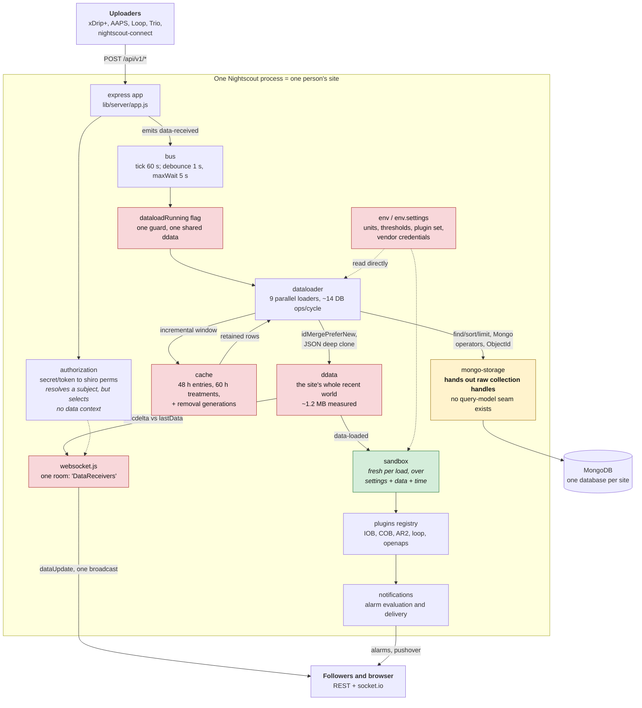
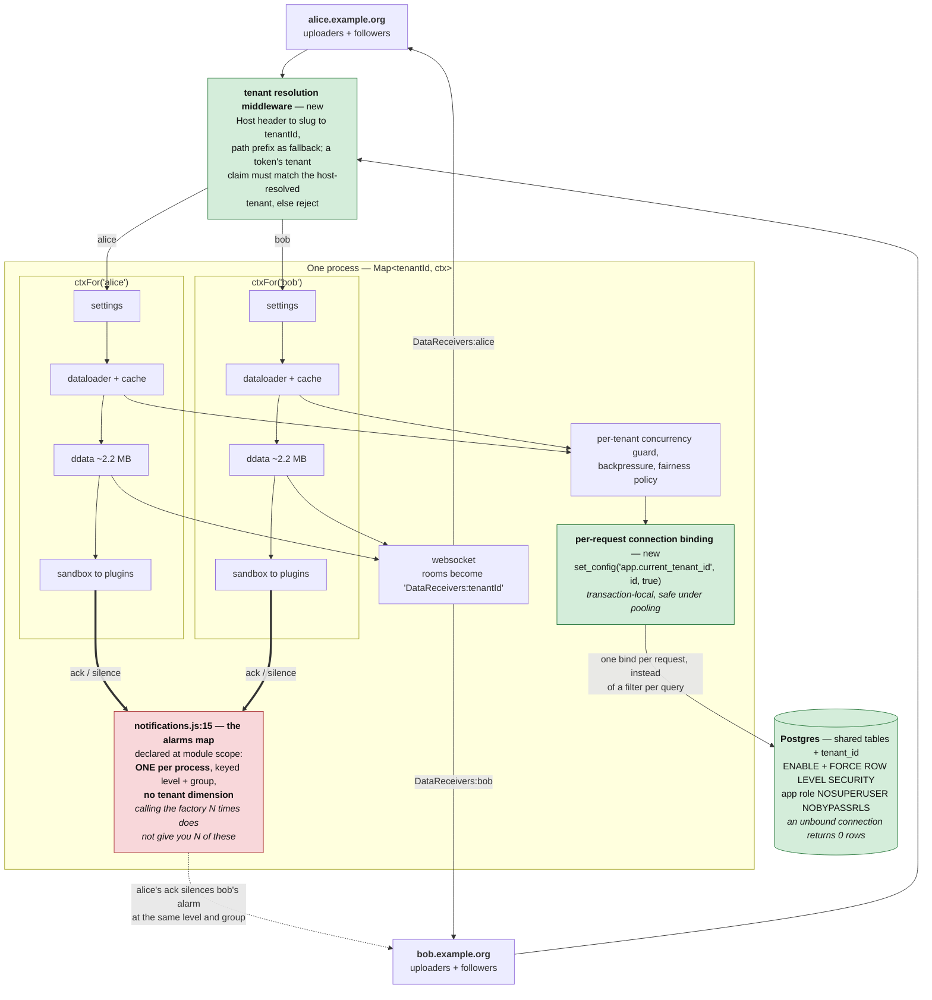
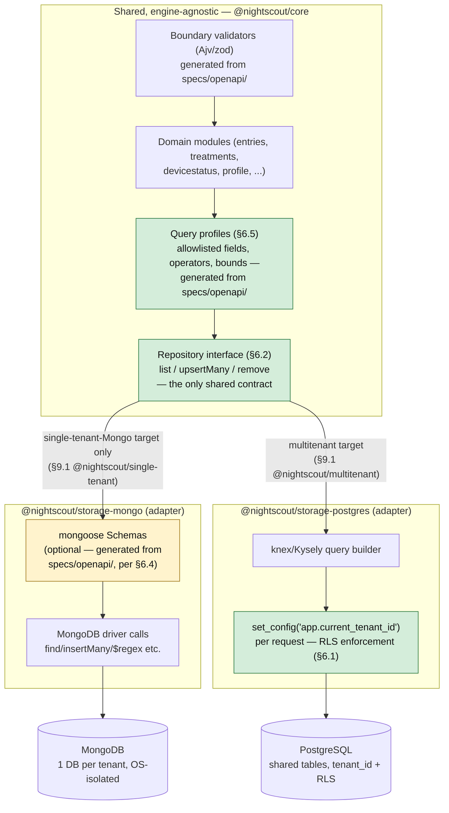
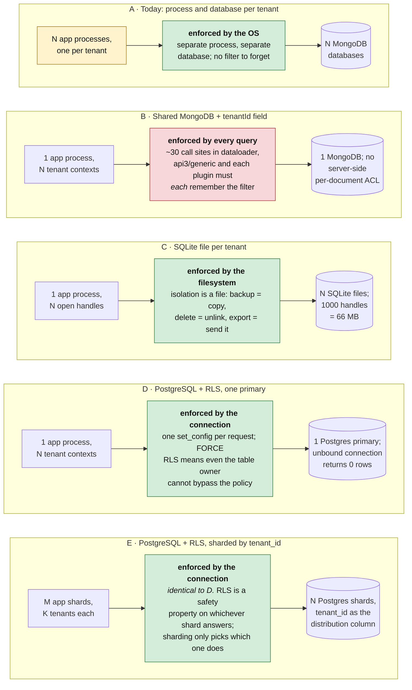
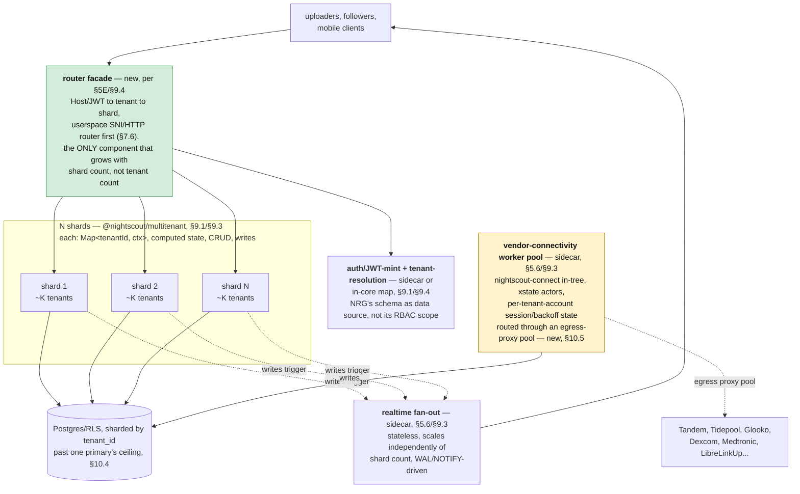

# Nightscout multitenancy: evidence and options

Date: 2026-09-09. Status: draft for maintainer discussion. Companion to
[Nightscout modernization review and proposed next steps](../60-research/nightscout-modernization-next-steps-2026-09-09.md);
deliberately *tangential* to that work and not dependent on its outcome.

**Nothing here is a proposal to merge. The deliverable being requested is evidence.**

---

## TL;DR

**Recommendation: extend cgm-remote-monitor to hold many tenants in one process; adopt
Postgres RLS (or an equivalent storage-enforced predicate) as the isolation primitive; stay
on Node.** Confident on the architecture axis; "10 000 tenants" is a target to design
towards and then verify, not a number demonstrated (§10.1).

**Five findings that should change the intuition** — all reproduced on a re-verification
pass (§1 explains the confidence tiers):

| # | Finding | Evidence |
|---|---|---|
| 1 | **One process holding N tenants costs 2.2 MB/tenant; a process per tenant costs 55 MB.** Worker threads are *not* a middle ground — at realistic code size they cost the same as processes, because isolate count is the driver, not process count | §7.4 |
| 2 | **Today, code and runtime outweigh tenant data ~80:1.** A bare Nightscout pod is ~99 MB RSS before loading one document; that tenant's actual `ddata` is ~1.2 MB | §7.4, §2.7 |
| 3 | **Representation beats language.** Columnar JS (9.9 KB/tenant) *ties* columnar Rust (10.2 KB), and untyped Rust **loses** to V8 by ~1.9× on time and ~7.7× on memory. "Rewrite in Rust" without a schema is a regression — which makes schemas performance infrastructure, not documentation | §7.3 |
| 4 | **Multitenancy and a runtime rewrite are substitutes, not complements.** Both attack the same ~41 MB per-process constant. Doing both buys the second one almost nothing — **this is the actual fork in the road** (§11 Q8) | §7.3 |
| 5 | **RLS is fail-closed by construction, and cheap.** A query with *zero* `tenant_id` predicate in the SQL returns only the bound tenant's rows; an unbound connection returns zero rows, not an error and not everything. Overhead ~0.3–0.6 ms — noise at Nightscout's ~14 queries per 1–5 s. It converts "every query must remember to filter" into "every *connection* must remember to bind": one call site instead of every call site | §6.1 |

**One blocker, in the code today.** `lib/notifications.js:15` holds the alarm/ack/silence
map at **module scope with no tenant dimension**. N tenants in one process would share it —
tenant A acknowledging a hypo alarm silences tenant B's. Small, bounded fix; **must be a
named prerequisite of shared-process work, not discovered during it** (§3.1).

**What ships regardless of the tenancy decision** — and is the entire near-term roadmap for
a maintainer not yet sold on multitenancy (§9.2 steps 1–4):

- **Layer 0**: generate validators from `specs/openapi/`, formalizing the 22 fields already
  declared in `indexedFields`. Correctness win today, and the measured precondition for
  every later win.
- **Layer 1b′**: close the §3 hazards. Independently reviewable.
- **Layer 3**: columnar hot window — ~20× less memory and ~500× faster wake on the SGV
  window. **Self-hosted single-tenant operators get this the day it ships.**

**What is not measured, and should gate any commitment**: the 2.2 MB/tenant figure against
the *real* `ddata`/`dataloader` code rather than a synthetic fixture (EXP-MT-035); a single
Postgres primary's ceiling past 500 tenants (EXP-MT-040); Kubernetes control-plane
behaviour at 10 000 tenants even under a reduced-object model. §8.5 pre-registers the
decision rule — **if no arm clears it, the finding is "keep the single-tenant deployment
model," which is itself a publishable result.**

**Two things worth knowing that are not about multitenancy at all**: the `re`/`$regex`
filter operator reaches MongoDB with no pattern guard, no index requirement, and **no
`maxTimeMS` or `.hint()` anywhere in the query path** — a live, unmitigated ReDoS and
full-scan vector today, which multitenancy would sharpen into a noisy-neighbour problem
(§6.5). And the O(n²) merge and delta sites are **a fairness problem, not a throughput
problem**: invisible at typical sizes, an 81 ms event-loop stall at 5 000 treatments, and
the "fix" is 3× *slower* at normal sizes. Justify them with p99 under a noisy tenant, and
make them adaptive (§7.5).

## 1. Scope, provenance and confidence

Nightscout's single-tenant design is a real feature: one process, one `env`, one
`API_SECRET`, one Mongo database, one in-memory data universe. It also means the *unit of
deployment is a person* — one bill, one upgrade, one TLS cert, one set of environment
variables per person with diabetes. That per-capita cost is the ceiling on who can use
Nightscout, and the reason distributed care teams, clinics, research cohorts and
"family runs five sites" cases are painful.

The maintainers' long-standing intuition is that the fix lives at `ddata`: if the runtime
data universe were keyed by tenant, the rest of the server might follow. This document
tests that intuition against the code, sets out the candidate architectures, and proposes
how to *measure* rather than argue the tradeoffs.

**Sources inspected.** `externals/cgm-remote-monitor-official` (v15.0.9, `dev` @
`a8888f0d`, node `>=20.x`, express 4.22.2, socket.io ~4.8.3, mongodb driver ^5.9.2, no
ODM) and `externals/nocturne` (.NET 10 + PostgreSQL, host-based multitenancy, with two
small Rust crates). `externals/cgm-remote-monitor` in this workspace is a 0.5.0 historical
checkout; all Nightscout citations use `-official`.

**Confidence tiers.** Every number below carries one of three labels, because they are not
equally trustworthy:

| Tier | Meaning |
|---|---|
| **measured** | Produced by a committed script in `tools/mt-bench/`, re-run and reproduced within a few percent on a second pass |
| **carried** | Produced by a committed script, but not re-run on the second pass (needs deps or fixtures reinstalled) — treat as ordinal, re-run before quoting |
| **inferred** | Reasoned from code or from another project's records, not executed here |

All measurements come from a **shared development machine with no remote database in the
loop**. They rank hypotheses; they are not capacity results. A real deployment adds
Mongo/Atlas round-trips expected to dominate every local cost here.

---

## 2. What is actually single-tenant today

### 2.1 The runtime data object and its three cost centres

`ddata` is a plain object created once at boot holding the whole site's recent world —
`sgvs`, `treatments`, `mbgs`, `cals`, `profiles`, `devicestatus`, `food`, `activity`,
`dbstats`, `lastUpdated` (`lib/data/ddata.js:11-22`). Processing attaches derived arrays
(`sitechangeTreatments`, `insulinchangeTreatments`, `batteryTreatments`,
`sensorTreatments`, `profileTreatments`, `combobolusTreatments`, `tempbasalTreatments`,
`tempTargetTreatments`) at `lib/data/ddata.js:249-337`.

| Cost | Location | Shape |
|---|---|---|
| JSON deep clone of every loaded document | `lib/data/ddata.js:29-79` (`processRawDataForRuntime`) | `JSON.parse(JSON.stringify(...))` per load |
| Old/new merge | `lib/data/ddata.js:82-106` (`idMergePreferNew`) | O(old × new), not hash-indexed |
| Client delta | `lib/data/calcdelta.js:15-76` | O(old × new) with deep compares |

`clone()` (`:108-123`) and `dataWithRecentStatuses()` (`:126-145`) produce the
client-facing projection.

### 2.2 Cache and retention windows

`lib/server/cache.js:26-31` sets retention to 60 h treatments, 48 h entries, 24–48 h
devicestatus. Steady-state working set is roughly that, plus long-tail queries merged into
`ddata.treatments` (profile switches up to ~12 months; sensor/site/insulin/battery changes
up to ~62 days — `lib/data/dataloader.js:341-430`).

The cache also keeps **removal generations** per datatype so the loader can detect a delete
that landed mid-query and retry rather than resurrect the document
(`lib/server/cache.js:29-34`, `lib/data/dataloader.js:159-196`, `:301-332`, `:456-489`).
Any tenant-aware cache must preserve this property *per tenant*.

### 2.3 The load cycle

Nine loaders run in parallel per update (`lib/data/dataloader.js:136-146`), expanding to
roughly **14 database operations per load**: entries, treatments, profile switches, six
"latest special treatment" queries, profile, food, devicestatus, activity, dbstats.
Incremental loads shrink the *rows* (15-minute windows — `:159`, `:301`, `:456`) but not
the *query count*.

Loads are debounced on the event bus (`lib/server/bootevent.js:301-330`;
`UPDATE_DEBOUNCE_WAIT = 1000`, `UPDATE_MAX_WAIT = 5000`, heartbeat default 60 s —
`bootevent.js:3-4`, `lib/settings.js:37`, `lib/bus.js:7`), guarded by a concurrency flag
that prevents overlapping loads **on the shared ddata** (`bootevent.js:301-318`) — a guard
that must become per tenant.

After each load, plugins run against a freshly built sandbox (`bootevent.js:332-341`):

```js
var sbx = require('../sandbox')().serverInit(env, ctx);
ctx.plugins.setProperties(sbx);
ctx.notifications.initRequests();
ctx.plugins.checkNotifications(sbx);
ctx.notifications.process(sbx);
```

**This is the most encouraging fact in the codebase.** `sandbox.serverInit(env, ctx)`
(`lib/sandbox.js:45-84`) is already a per-invocation object parameterised over
*(settings, data, time)*. The plugin contract is already tenant-shaped; `ctx` is not.

### 2.4 Realtime

Socket.IO uses exactly one room: `io.to('DataReceivers').compress(true).emit('dataUpdate', delta)`
(`lib/server/websocket.js:150`, join at `:792`). Per-connection authorization exists and
resolves secret/token into shiro permissions (`:123-140`), but **the resolved subject does
not select a data context.** Tenant rooms (`DataReceivers:<tenantId>`) plus tenant-bound
authorization are a *correctness and safety* requirement, not an optimisation: a leak here
is another person's glucose and alarms.

### 2.5 The storage seam — the single most important structural finding

`lib/storage/mongo-storage.js` is a connection/collection factory (`:105-205` connect,
`:207-209` raw collection, `:211-223` indexes). Domain modules (`lib/server/entries.js`,
`treatments.js`, `devicestatus.js`, `profile.js`, `food.js`, `activity.js`) receive **raw
Mongo collections** and use driver semantics directly: `find/findOne/sort/limit/toArray`,
`insertOne/insertMany`, upserts, `ObjectId`, Mongo query operators, `$`-aggregation in
reporting paths. API v3 adds its own query translation (`lib/server/query.js`, `lib/api3/`).

**There is no adapter seam capable of accepting a different query model today.** API v3's
`lib/api3/storage/mongoCachedCollection/` and `mongoCollection/` add a thin caching layer,
but it is Mongo-shaped too. Every storage option in §6 depends on introducing that seam
first.

### 2.6 The process-global surface

`env` and `env.settings` (`lib/server/env.js:106-208`, `lib/settings.js:7-31`, `:261-280`,
`:328-340`), `API_SECRET`, authorization storage/roles/subjects (`bootevent.js:198-203`),
the Mongo pool, the cache, the dataloader, the websocket namespace, the plugin registry
and its per-plugin closure state, external clients and timers, the event bus, language, and
enclave key material (`lib/server/enclave.js:1-22`).

**Per-tenant settings surface** (the real work item): units, timezone/language, alarm
thresholds and snooze intervals, alarm type selection, enabled/shown plugins, raw-BG
visibility, device provenance obscuring, devicestatus retention, bridge/connect
credentials, notification credentials and recipients, auth defaults.

### 2.7 Sizing anchor — **measured**

`node --expose-gc`, 200 tenants, one `ddata`-shaped object each (576 SGVs, 600 treatments,
576 Loop-style devicestatus with 72-point prediction arrays; no derived arrays, no clones,
no `lastData`):

```
tenants 200   heap delta 241.2 MB   per tenant 1.21 MB   JSON 795 KB/tenant
```

That is the **floor**, not the estimate. Steady state additionally holds cache arrays,
derived treatment arrays, the previous `lastData` for delta computation, and transient
clones during load. Treat **4–8 MB resident per active tenant** as a hypothesis to be
measured (EXP-MT-035), not a number to quote. At 6 MB, 1 000 tenants ≈ 6 GB of live JS
objects before headroom — which is why the residency question (§5C) matters more than the
storage question.

### 2.8 The runtime as a component graph

Everything above, as components and the relationships between them. The chokepoints that
assume a single tenant are shaded: each is a real object that exists **exactly once per
process** and that every request implicitly shares.



Two relationships in this graph decide how hard multitenancy is.

**`sandbox` is green because it is already parameterised.** It is constructed fresh on every
`data-loaded` event over *(settings, data, time)* — so the entire plugin tier downstream of
it is already tenant-shaped and needs no change. The single-tenant assumption is not in the
data model; it is in the fact that `bootevent()` is called once and the resulting `ctx` is
bound to module scope by its caller.

**`mongo-storage` is amber because it is a factory, not an adapter.** It hands `dataloader`
and every domain module a raw Mongo collection, so driver semantics leak into ~30 call
sites. That single relationship is why §6.2's repository seam is a prerequisite for every
storage option, and why isolation currently has nowhere to be enforced except in each
call site's own filter.

---

## 3. Cross-tenant hazards already present in the code

Any shared-process design (§5B–E) inherits these. They are listed first because they are
correctness and **safety** gates, not performance items — an arm that trips one is
disqualified regardless of throughput (§8.4).

### 3.1 Shared alarm state — the blocker

`lib/notifications.js:15` declares `var alarms = {};` at **module scope, outside
`init(env, ctx)`**, keyed only by `level + '-' + group`. There is **no tenant dimension**,
and the only reset is test-mode-only (`resetStateForTests`, `:208`).

`bootevent.js:253` constructs notifications per-ctx
(`ctx.notifications = require('../notifications')(env, ctx)`). So calling the factory
chain N times — precisely the Layer 2 proposal (§9) — yields N notification objects
**sharing one alarm/ack/silence map**. Tenant A acknowledging a hypo alarm would silence
tenant B's alarm at the same level and group.

§5.1 draws this as a system relationship: every tenant's plugin tier writing into one
shared box. This is the one place the "tenants as data" refactor is not merely wiring, and
it lands on the safety question maintainers should care about most (§11 Q5). It is a small, bounded fix
— thread a tenant key into `getAlarm`'s composite key — but it must be a named
prerequisite of Layer 2, not discovered during it.

Note this is also the **only** module-level mutable state of this shape in server-side
`lib/` (repo-wide scan; `lib/client/*` hits are browser-side). The general instinct in
§9.1 — that the factories are already tenant-shaped — is right. This is its exception.

### 3.2 Plugin closure state

`lib/plugins/speech.js:3-5` holds `lastEntryValue`, `lastMinutes`, `lastEntryTime` at
module scope. Plugins are per-tenant instances under Layer 2, but module-scope variables
are not. A lint rule or test banning module-level mutable plugin state is a cross-cutting
requirement (§5), and `speech.js` is the known instance to fix.

**A second, previously unlisted instance: `lib/plugins/bridge.js:4`** holds
`mostRecentRecord` at module scope, and it is not cosmetic — it is read on every poll to
compute the next fetch window (`bridge.js:119`, `opts.fetch.minutes = parseInt((new
Date() - mostRecentRecord) / 60000)`) and to decide whether a poll is due at all
(`bridge.js:89`, `next_entry_expected = mostRecentRecord + msRUN_AFTER`). Two tenants'
Dexcom-Share bridges sharing one process would corrupt each other's fetch windows —
tenant A's bridge could compute its next fetch size from tenant B's most-recent-record
timestamp, silently over- or under-fetching. This matters specifically for §5.6 below:
vendor-connectivity plugins are not the "purely stateless" thing §5.3 characterized them
as at the code-shape level (their *invocation* is interval-shaped and side-effect-free
between ticks, which is what §5.3 was about) — but this one instance shows the same
module-scope hazard class as `speech.js`, needing the identical fix (a per-instance
closure variable, not module scope) before Layer 2 shared-process work, regardless of
which storage engine or deployment target is chosen.

### 3.3 Direct `process.env` reads outside the env module

**17 occurrences across 4 files**: `lib/server/app.js` (6), `lib/api3/index.js` (5),
`lib/plugins/webhook.js` (4), `lib/server/bridge-connect-compat.js` (2).

`lib/api3/index.js:22-25` is the consequential one — a generic
`CUSTOMCONNSTR_<var>`/`<var>` resolver, i.e. **connection-string resolution**, which is
per-tenant configuration reached without going through `env`. Small and closable, but it is
in the API v3 layer, not only in peripheral files.

### 3.4 Single socket room and unscoped socket authorization

§2.4. Tenant-scoped rooms plus tenant-bound socket authorization.

### 3.5 Shared concurrency guard and no fairness policy

§2.3's `dataloadRunning` flag guards one shared `ddata`. Per-tenant guard, backpressure and
a fairness policy are required so one tenant cannot monopolise the loop (§7.5).

### 3.6 Unbounded query cost

§6.5. Not multitenancy-specific, but multitenancy converts it from a private problem into
a noisy-neighbour amplifier.

---

## 4. What Nocturne settled

Nocturne is the strongest available evidence because it solved this in production shape.

| Concern | Nocturne's answer | Citation |
|---|---|---|
| Tenant identity | `tenants` row; `Guid Id` stable, mutable `Slug` for routing | `Entities/TenantEntity.cs:8-91` |
| Request resolution | **Host header subdomain** `{slug}.{BaseDomain}`, not path prefix or token claim | `Multitenancy/TenantResolutionMiddleware.cs:14-15`, `:244-248` |
| Special modes | apex/single-tenant fallback, tenantless setup routes, `{token}.share.{domain}` | `TenantResolutionMiddleware.cs:249-279` |
| Isolation | Shared tables + `tenant_id`, EF Core global query filter **and** PostgreSQL RLS | `NocturneDbContext.cs:14-64`; `Migrations/20260227034745_EnforceMultitenancy.cs:66-76` |
| Fail-closed | `FORCE ROW LEVEL SECURITY`; unpinned context ⇒ zero rows; roles `NOSUPERUSER NOBYPASSRLS` | `Interceptors/TenantConnectionInterceptor.cs`; `CLAUDE.md` |
| Credential binding | Token tenant claim must match host-resolved tenant, else reject | `Handlers/LegacyJwtHandler.cs:73-97`, `DirectGrantTokenHandler.cs:127-152` |
| Cache | Many small tenant-GUID-keyed caches with TTL + explicit invalidation; **no monolithic per-tenant aggregate** | `Services/Entries/EntryCacheAdapter.cs:24-120` |
| Realtime | SignalR groups always prefixed `"{tenantId}:{group}"`; hub rejects tenantless connections | `Hubs/TenantAwareHub.cs:29-74` |
| Benchmarks | BenchmarkDotNet micro/query benchmarks + RLS isolation integration tests | `tests/Performance/**`, `tests/Integration/**/Rls/*` |

**Four transferable lessons:**

1. **Isolation must fail closed at the storage layer**, not only in application code. RLS is
   the difference between "we filter correctly" and "we cannot fail to filter."
2. **Host-based routing keeps existing clients working.** Every uploader, follower app and
   `API_SECRET` already points at a hostname; subdomain-per-site means xDrip+, AAPS, Loop,
   Trio and nightscout-connect need no changes.
3. **Nocturne deliberately did *not* build a per-tenant `ddata`.** It uses bounded,
   individually keyed, TTL'd caches — the opposite of Nightscout's design, and a direct
   challenge to the "just make ddata multitenant" instinct.
4. **Its native boundary is stateless and coarse-grained** — one JSON envelope per
   evaluation, which is the shape that survives an FFI/WASM boundary.

**Two caveats Nocturne itself records**: the browser bridge fans some notifications to the
whole tenant room rather than per-subject rooms (`Services/Realtime/RealtimeGroups.cs:32-57`
documents this in its own remarks), and there is **no published tenants-per-instance target
and no tenant-count scaling benchmark** — no k6/NBomber/Socket.IO load harness exists in
the repo (verified). **Nocturne proves the correctness of an approach, not its capacity.**

**On Nocturne's Rust**: do not index the "should we rewrite in Rust" question on Nocturne's
example. The engine selector **defaults to the managed C# evaluator**; Rust runs only in
`shadow` (side-effect-free) or explicit `rust` mode
(`Services/Alerts/Engines/AlertEngineSelector.cs:6-13`, `:28-45`). Nocturne's production
default ships zero Rust in the request path, and the crates are a small, bounded,
swappable slice of the codebase (6 618 lines of Rust). Its actual multitenancy lever is
shared-process + RLS-shared-Postgres — a *representation and isolation-primitive* choice,
not a language choice.

### 4.1 Should cgm-remote-monitor depend on Nocturne?

Four options were considered; the evidence favours the middle two:

- **Independent implementation** — no new runtime, community-maintainable in JS, but
  duplicates solved work and risks two divergent tenancy semantics.
- **Shared contracts (recommended)** — adopt Nocturne's tenant model, slug/GUID semantics,
  RLS pattern and group naming as a *spec*, with independent code. Cheap; buys interop and
  migration paths. Grounds already exist: `specs/openapi/` and
  `mapping/cross-project/terminology-matrix.md`.
- **Shared stateless algorithm cores (recommended, conditional)** — reuse
  `nocturne-alerts-core`-style cores for parity testing. Pays off only where the hot path
  is genuinely CPU-bound (§9 Layer 5).
- **Nocturne as data plane** — cgm-remote-monitor becomes a UI/plugin tier over Nocturne's
  API. Inherits RLS and benchmarks, but Node deployment then requires .NET+Postgres, adds a
  hard dependency on another project's roadmap, and makes hosting *harder* for small
  operators. **This should be argued for explicitly if anyone wants it, because it inverts
  the project's independence.** §6.1 and §7.3 find nothing it supplies that shared
  contracts do not.

---

## 5. Candidate architectures

The choice is *where tenant state lives*, decomposing into two independent axes:
**isolation unit** (process vs. context) and **residency** (always-resident vs. tiered vs.
computed-on-demand). A–D are points on those axes; **E is a multiplier on whichever of
B/C/D wins, not a peer of them.**

**A. Process per site (today, at scale).** One process per person, N containers. Zero code
change; isolation by OS. Cost is the node baseline plus a Mongo pool plus a container per
person. Worth benchmarking as the **control arm**: everything else must beat it on
$/tenant while matching it on isolation.

**B. Context per tenant, one process ("multi-ctx").** `ctxFor(tenantId)`: per-tenant
`settings`, `ddata`, `cache`, `dataloader`, `plugins`, `bus`, authorization, socket room.
*Pro*: smallest conceptual change; the sandbox contract already fits (§2.3); plugin API
unchanged. *Con*: N × timers, buses and plugin instances; memory scales with *registered*
not *active* tenants; §3's hazards become live; one tenant's O(n²) merge stalls the shared
loop. Probably the honest first prototype (§7.4 measures it at 2.2 MB/tenant), and the
option most likely to hit a wall on *registrations*.

**C. Context per tenant + residency tiering ("hot/warm/cold").** As B, but ddata is
materialised on demand and evicted on inactivity: *hot* (active viewer ⇒ resident ddata,
deltas, plugins, alarms), *warm* (recent writes, no viewers ⇒ cache only, rebuilt lazily),
*cold* (uploads land in storage). **Alarms are the hard part**: a person with no browser
open still needs hypo alerts, so a cheap always-on bounded alarm evaluator must run for
cold tenants without materialising a full ddata. *Pro*: cost tracks *concurrency*, not
registrations — most sites have one viewer and long idle periods, so this is where the
order of magnitude lives. *Con*: needs a real eviction policy, a cold-start latency budget,
and a separated alarm path. Wake cost now looks affordable (~3–4 ms from a local store,
near-zero from a columnar cache — §7.1, §7.2), so the hard part is **policy and cold
alarms, not latency.** The most promising direction, and what the benchmark plan should
prove or kill.

**D. Stateless server, storage-resident derived data.** No resident ddata; every read pages
from the store, which does the ranges and aggregation. *Pro*: memory ≈ O(concurrent
requests); horizontal scaling trivial; restart free. *Con*: the client protocol is
delta-oriented (`calcdelta.js`) and plugin chains assume a whole-world object;
recomputation per request could be *more* total CPU than one resident copy. Needs
measurement, not assertion.

**E. Sharded: K tenants per process, M processes.** Orthogonal and pragmatic. Bounds blast
radius and GC pause impact, allows rolling upgrades, lets a noisy tenant be moved. Any
serious deployment ends up here; the open question is *best K*, not B-vs-E.

### 5.1 The same system, tenant-scoped — and what does not scope with it

Architecture B applied to §2.8's component graph. The per-tenant boxes are the same
factories called N times; the differences from §2.8 are the three new components at the
edges (tenant resolution, per-request connection binding, tenant-scoped rooms) — and one
component that **does not** become per-tenant on its own.



The two thick edges converging on one red box are §3.1 drawn as a system relationship
rather than a code citation: every tenant's plugin tier writes acknowledgement and silence
state into a **single process-global map**, because that map is declared at module scope
rather than inside the factory. Everything else in the per-tenant boxes duplicates
correctly when `bootevent()`'s factory chain is called N times; this does not.

The graph also shows why RLS is the isolation primitive worth adopting (§6.1). `BIND` is a
**single relationship on the path to storage** — one middleware, one `set_config` per
request. The alternative on Mongo is a correct filter on every one of the ~30 edges that
`dataloader`, `lib/api3/generic/*` and each plugin draw to the store, with no component
able to enforce that they did.

### 5.2 Cross-cutting requirements for B–E

1. Tenant resolution middleware (host, then path prefix as fallback, then token claim
   verified against the resolved tenant — Nocturne's ordering and its rejection rule).
2. Tenant-scoped socket rooms and tenant-bound socket authorization (§3.4).
3. Tenant-scoped settings object; every read of `env.settings` audited (§2.6).
4. Per-tenant plugin instances, and a lint rule or test banning module-level mutable
   plugin state (§3.1, §3.2).
5. Per-tenant concurrency guard, backpressure and a fairness policy (§3.5).
6. Storage-layer fail-closed isolation — RLS, separate database, or separate file (§6.1).
7. Per-tenant quotas and accounting: memory, docs, query rate — needed for fairness *and*
   for the cost model that justifies the whole exercise.
8. Alarm delivery for non-resident tenants, with per-tenant alarm state (§3.1).

### 5.3 Headless: does removing the browser change the recommendation?

A **headless** deployment target — API/websocket for AID controllers and alarm followers
only, no HTML views, no browser session — is worth treating as its own point in the
design space, because two of §2's three cost centres exist specifically **to serve the
browser cheaply**, and headless removes that consumer entirely.

**What the browser actually causes in §2's component graph.** `calcdelta.js`'s O(old×new)
deep-compare (§2.1) and the single `'DataReceivers'` socket room (§2.4) exist to turn one
resident `ddata` into a cheap incremental diff for potentially many concurrently-polling
viewers of the *same* site — a human refreshing a dashboard, a family member's phone, a
clinic view. **An AID controller or alarm follower is not that consumer.** Loop, AAPS and
xDrip+ poll on their own schedule (typically every 1–5 minutes), want a small, predictable
response for a known query shape, and have no use for a delta-versus-last-broadcast
optimisation — they already re-request from scratch each cycle. §6.5's proposed query
profiles were arrived at independently of this question, for a different reason (bounding
DoS surface), but they describe exactly the request shape a headless server would only
ever receive.

**What's actually left resident, once the browser is gone, is alarm evaluation — and that
does not require the same architecture either.** `plugins.checkNotifications(sbx)`
(`bootevent.js:338`, §2.3) still has to run against something for cold/inactive tenants
(§3's C tier, §5C) — a person with no viewer open still needs a hypo alert. But this is a
bounded computation over a short recent window (IOB/COB curves, AR2 trend, a handful of
plugins), not a reason to hold a whole site's `ddata` resident indefinitely. §5D
("stateless server, storage-resident derived data") was previously the least-favoured
architecture in this document specifically because the *client protocol is delta-oriented*
(§5D's con) — a constraint that assumes a browser. Remove the browser, and D's objection
mostly disappears: there is no delta stream to maintain, so the recompute-per-invocation
cost is the only one left to justify against a resident copy, and that computation is
small and infrequent (once per alarm-evaluation cycle, not once per HTTP poll).

**Vendor connectivity is a second, independent thing that does not need a resident
process at all, and this is a *finding*, not an assumption.** `lib/plugins/bridge.js:115`
(Dexcom Share) and `lib/plugins/mmconnect.js:24` (Medtronic CareLink) both run their own
`setInterval` closure, opened once per process over that tenant's `env.extendedSettings`
credentials (`mmconnect.js:5-8`), with no shared state between ticks and no dependency on
`ddata`/`sandbox` at all — each tick is "wake, fetch one vendor API with one tenant's
stored credentials, hand the parsed entries to the loader." That shape is a cron job, not
a server: it does not need Node running continuously per tenant, it needs to run on a
schedule and terminate. At 1 000 tenants, 1 000 resident `setInterval` timers in shared
processes (Layer 2, §9) is a real, avoidable cost and a fairness/backpressure hazard in
its own right (§5.2 item 5) — a scheduled/queued invocation model removes it entirely,
independent of whether the rest of the stack stays Node.

**So, directly: scaling the in-process cache/sandbox is very likely *not* needed for a
headless target**, on three separable grounds, each independently supported above:
(1) the query surface serving AID controllers/alarm followers is already the bounded,
typed-profile shape §6.5 recommends regardless of residency, so a well-built query
builder against Postgres+RLS (§6.1, §6.6/D) can answer it directly without a resident
merge step; (2) alarm evaluation is a small, boundable, event- or schedule-triggered
computation (§5D), not a reason to hold megabytes of merged JSON per tenant for months;
and (3) vendor polling is stateless-per-tick and belongs on a scheduler, not in a resident
timer. What remains genuinely resident-shaped is a browser-serving concern this target
does not have.

**Low/no-code: what Supabase specifically would and would not buy.** Supabase is managed
Postgres + RLS + JWT-based auth + Realtime (logical-replication-driven push) + Edge
Functions (Deno, per-invocation V8 isolates, cron-triggerable) — and it maps onto this
document's own layers more directly than any other option evaluated so far:

| Supabase piece | Maps to | What it removes from application code |
|---|---|---|
| Managed Postgres + RLS | Layer 1b exactly (§6.1, §6.6/D) | Nothing extra over self-managed Postgres+RLS — same `set_config`-per-request pattern, just operated for you |
| JWT auth + RLS policies reading `auth.jwt()` claims | Tenant resolution (§5.2 item 1) | Tenant binding becomes a DB-enforced predicate on the presented JWT, not app-tier middleware — collapses §5.2 items 1 and 6 into one enforcement point |
| Realtime (WAL → subscription push) | The delta/broadcast half of §2.1/§2.4 | For a headless follower that wants live updates, Postgres already knows what changed; no app-level `calcdelta` deep-compare or resident `ddata` needed to produce a delta at all |
| Edge Functions (Deno, cron-triggerable) | The vendor-connectivity scheduler above | A near-exact fit for `bridge.js`/`mmconnect.js`'s actual shape — stateless, credentialed, scheduled — with no code-shape change needed to the fetch/parse logic itself, only to how it's invoked |

**The honest cost, stated plainly: platform lock-in, and it does not replace the
self-hosted target.** Every Supabase-shaped piece above is a *specific vendor's*
implementation of an architecture this document already recommends in vendor-neutral
terms (RLS, a repository seam, an event-driven scheduler) — adopting it verbatim would
tie the multitenant target to Supabase's specific Postgres extensions, Realtime protocol
and Edge Function runtime, which is a real, ongoing cost against the ecosystem's
self-hosted ethos, and is exactly the kind of two-deployment-model split §10.3 already
concluded should be permanent (self-hosted operators keep MongoDB or self-managed
Postgres; nothing here proposes removing that path). The correct scoping is: Supabase (or
any managed Postgres+Realtime+Edge-Function platform — Neon, Cloudflare with D1/Workers,
a self-hosted PostgREST+pg_cron stack) is **one implementation of the §6.2 repository
seam and the scheduler above**, evaluated and swappable behind it, not a hard dependency
of the multitenant target itself.

**Reorganisation vs. new code, answered directly.** The compute logic itself needs almost
no rewriting — §9.1 already established `bootevent`, `sandbox`, the plugin registry and
the vendor-connectivity plugins are factory-shaped over `(env, ctx)` with essentially zero
module-level mutable state, and that finding holds unchanged for a headless target: the
same `init(env, ...)` calls work whether the caller is a resident process, an on-demand
stateless handler, or (per Supabase) an Edge Function. What is genuinely **new**, not a
reorganisation, is the *trigger model*: today's bus (`bootevent.js:301-330`, a 60 s
heartbeat plus 1 s/5 s debounce) assumes a resident process polling its own timer; a
headless, cost-optimised target instead wants **event-triggered** invocation — a Postgres
`NOTIFY`/webhook/queue message on write, driving a stateless alarm-evaluation and
vendor-poll dispatch, rather than N resident bus instances. That scheduler/dispatch layer,
plus stripping the already-separable static-file and browser-socket mounts
(`lib/server/app.js:192-197`, §2.4), is the actual new-code surface — small, bounded, and
independent of whether the storage/auth layer underneath is self-hosted Postgres+RLS or a
managed platform.

**Net recommendation for this target, restated as a change to §9's ordering**: for a
headless-only deployment, Layer 2 (shared-process `ctxFor(tenantId)`, §9) is likely
*skippable entirely* in favour of going from Layer 1 (storage isolation) straight to a
variant of Layer 2/D — an event-triggered, mostly-stateless compute layer over
Postgres+RLS, with the query-profile work of §6.5 doing the load-bearing work of bounding
per-tenant resource cost that a resident, scaled-up sandbox would otherwise have to do.
This should be checked, not assumed: EXP-MT-043/044 (§8.3) are the arms that would confirm
or kill it.

### 5.4 Does headless preclude real-time push — and where does MQTT fit?

**No — and §5.3 needs one correction first.** §5.3 grouped "browser-socket mounts" with
static-file serving as the thing a headless target sheds; that overstates it. What
headless actually removes is the *browser-specific cost centre* — `calcdelta.js`'s
O(old×new) diff computed once per load cycle and broadcast to everyone in one shared room
(§2.1, §2.4) — not the general idea of push. A lightweight or mobile-first UI, and for
that matter an AID controller that wants faster-than-polling notice of a new reading, is
exactly a **realtime consumer that isn't a browser**, and nothing in §5.3's argument
removes the value of push for it; it only argues the *current mechanism* (one
process-wide Socket.IO room, `lib/server/websocket.js:150,792`, fed by a resident merged
`ddata`) is more machinery than a headless deployment needs to produce that push. The
right framing is: **keep push, change what produces it.**

**Correction, from maintainer feedback: MQTT is not a new idea for this codebase, and it
is not required.** `lib/server/mqtt.js` existed in cgm-remote-monitor for bidirectional
mobile-sync support and was removed in 2018 (`0e2ae003`, "npm update and remove mqtt" —
317 lines of `lib/server/mqtt.js` plus its test suite deleted, `env.js`/`server.js` wiring
removed alongside it). So this section is evaluating **bringing back a capability the
project already tried and dropped**, not proposing something novel — worth being explicit
about, since the reason it was dropped previously (unclear from the commit message alone;
likely maintenance burden of a second realtime transport, not a technical dead end) is
exactly the kind of cost the "additive" framing below needs to be weighed against, not
waved away. Given that history, MQTT is presented here as **one available transport
option for a mobile-first client, not a required piece of the headless architecture** —
Postgres logical-replication push alone (below) already closes most of the gap headless
opens, with none of the "run and maintain a broker" cost. Treat what follows as "if a
mobile UI wants MQTT specifically, here is how it would fit," not "MQTT is recommended."

**What already generalises, and what doesn't, from §5.3's storage-first architecture.**
The three transports worth naming, and what each would need:

| Transport | What it needs, on top of §5.3's Postgres+RLS baseline | Fit for mobile/light UI |
|---|---|---|
| **Socket.IO (today's mechanism)** | The full resident-`ddata`/`calcdelta` pipeline (§2.1) to compute a delta, plus per-tenant rooms (§5.1's `WS` box) instead of one shared room | Works, but reintroduces exactly the resident-state cost §5.3 argued away — this is the "reorg, not new code" case only if the delta computation moves to a cheap, storage-driven form (below), not if the current in-memory pipeline is kept as-is |
| **Postgres logical replication → push** (Supabase Realtime, or a hand-rolled `LISTEN`/`NOTIFY` + `pgoutput` consumer) | Nothing beyond Layer 1b (§6.1) already recommended — the database already knows which row changed and for which `tenant_id`; a change event *is* the delta, computed by the WAL, not by an app-level deep-compare | Very good fit, and the recommended default: RLS-scoped subscriptions mean a mobile client can subscribe directly to "my tenant's rows changed" with the isolation guarantee already enforced at the same layer as everything else in §5.3, no per-tenant resident merge step, and no second piece of broker infrastructure to run |
| **MQTT (broker + per-tenant topic, e.g. `tenants/{tenantId}/entries`)** | A publish step *somewhere* in the write path — either the app tier publishes on ingest, or a Postgres→MQTT bridge (e.g. a `pg_net`/trigger-driven publisher, or a small dispatcher consuming the same WAL/`NOTIFY` stream as the row above) — **plus a broker to operate**, the cost that likely motivated dropping it in 2018 | A real, optional upgrade specifically for **battery- and bandwidth-constrained mobile clients** over what Postgres Realtime alone gives you (QoS/persistent-session semantics), but not a requirement — worth adding only if EXP-MT-045 shows Realtime's delivery/miss behaviour is measurably worse for the mobile case |

**Where MQTT would still be worth it, if chosen.** Its concrete advantages over
Realtime/Socket.IO specifically: (1) **QoS 1/2 delivery** means a phone that drops
connectivity for an hour (subway, flight, low battery) does not miss a hypo alert the way
a disconnected Socket.IO or Realtime client would — the broker holds it for a persistent
session; (2) **topic-per-tenant** (`tenants/{tenantId}/entries`, `tenants/{tenantId}/alarms`)
maps directly onto the tenant-scoped-room pattern §5.1 already establishes for Socket.IO,
so the *authorization* problem is unchanged — a client still must only be able to
subscribe to its own tenant's topic, enforced the same way (a broker ACL keyed by the same
resolved tenant identity, checked at CONNECT/SUBSCRIBE time, structurally the same
requirement as §5.2 item 2's "tenant-bound socket authorization"); (3) **last-will** lets
an alarm-follower app publish "I went offline" so a caregiver's dashboard can show
"follower unreachable" rather than silently going stale — a safety-relevant property this
document has not previously had a mechanism for. None of these is free: each is a reason
to *reconsider* MQTT specifically for a mobile client, not a reason it must be built.

**What doesn't change, and is worth stating plainly so this isn't read as walking back
§5.3**: none of this reopens the residency question, and none of it makes MQTT mandatory.
Whichever transport carries the push — Socket.IO fed by a lighter delta source, Postgres
Realtime, or (optionally) MQTT — the *content* of what's pushed should still come from the
same place §5.3 already argued for: a change computed at or near the storage layer
(WAL-driven), not a resident, per-tenant merged `ddata` recomputed on a heartbeat. The
transport question and the residency question are separable, and this section only
answers the first.

**Net effect on the headless recommendation**: Postgres Realtime/`NOTIFY` is the default
recommendation for realtime push in a headless/mobile deployment — it needs no new
infrastructure beyond Layer 1b. MQTT is named as an available, previously-shipped, and
optional upgrade for the mobile-specific QoS/offline case, to be added only if EXP-MT-045
shows a measurable gap Realtime doesn't close, not built by default. Neither choice
changes §5.3's core claim that the in-process cache/sandbox does not need to scale — the
push mechanism sits on top of the same storage-first architecture either way. This is
EXP-MT-045 (§8.3).

### 5.5 Is a PostgREST-only headless backend feasible? — **measured**

§5.3 asked whether headless changes the residency recommendation; this asks a sharper
version — could the CRUD half of Nightscout's API be served with **no Node process at
all**, directly by [PostgREST](https://postgrest.org) against the same RLS table from
§6.1? Tested against a live PostgREST 16.2 + Postgres 16 stack
(`tools/mt-bench/postgrest-poc/`, committed and reproducible), not asserted from the
project's marketing:

| Test | Live result |
|---|---|
| No JWT presented | `401` — `web_anon` has zero grants; a permission error, not a silent empty list |
| Tenant A JWT, **zero `tenant_id` in the querystring** | 5 rows, only tenant A |
| Date-range query, PostgREST's native `date=gte.<iso>&order=date.desc&select=...` | works — the same operator shape (`gte`, `order`, `select`, `limit`) as API v3's `find[date][$gte]` |
| Tenant B JWT, `limit=1000` | only tenant B's rows |
| Tampered JWT signature | `401` — verified before RLS is ever reached |

**The mechanism needs no custom code**: a JWT with a `role` claim makes PostgREST `SET
ROLE` per request, and PostgREST always exposes the verified JWT's payload as the
`request.jwt.claims` GUC — the RLS policy from §6.1 reads `tenant_id` back out of that JSON
unmodified, same `NULLIF(current_setting(...), '')` fail-closed shape, no pre-request
PL/pgSQL function required for this case.

**What this answers**: yes, for the storage-scoped CRUD surface — list/insert
entries/treatments, filtered/sorted/paginated, tenant-isolated — PostgREST is a real
candidate for the "no Node in the request path" headless target, reusing §6.1's isolation
primitive exactly, with query ergonomics close enough to API v3's existing querystring
shape (§6.2) to be a plausible drop-in for that portion.

**What this does not answer**: PostgREST has no place to put computed state.
`calcdelta`/IOB/COB, alarm evaluation (§3.1's blocker still applies wherever that state
ends up), and vendor-connectivity polling (`lib/plugins/bridge.js`,
`lib/plugins/mmconnect.js`, §5.3) all need a process somewhere. The realistic shape is
PostgREST in front for the CRUD surface plus a small stateless service (Node or otherwise)
for computed views and connectors — "PostgREST instead of the CRUD half of Node," not
"PostgREST instead of Node." Postgres generated columns (§6.3) absorb the cheapest of
these (e.g. a `delta` column); IOB/COB curves are not expressible as SQL generated columns
without reimplementing oref's algorithm in SQL, which nobody here is proposing. This is
EXP-MT-047 (§8.3).

### 5.6 What sits alongside PostgREST, and does a hoster need a different shape than an indie operator?

Three services beyond PostgREST are needed regardless of tenant count, verified against
`node_modules/nightscout-connect` (the module `bootevent.js` wires in as
`ctx.nightscoutConnect`) and `lib/plugins/bridge.js`/`mmconnect.js`:

1. **A tenant-provisioning/auth-minting service.** PostgREST verifies JWTs; it does not
   issue them. Something has to authenticate a user, look up which `tenant_id` they own,
   and mint the JWT §5.5's `role`/`tenant_id` claims depend on — a small, genuinely
   stateless service (session lookup → sign), the one new component this architecture
   needs that today's Nightscout doesn't have an equivalent of at all (today's Basic-Auth
   API-secret model doesn't map to per-tenant JWT issuance).
2. **A realtime fan-out service.** Confirmed in §5.4: PostgREST itself has no WebSocket/MQTT
   surface. Something has to `LISTEN` on Postgres's `NOTIFY` channel (or read the WAL) and
   push to connected clients — Supabase Realtime is one implementation of exactly this, not
   a dependency this architecture requires by name.
3. **Vendor-connectivity workers — and these are a different problem from (1) and (2), not
   a variant of the same one.** `nightscout-connect`'s own `builder.js` composes
   session/fetch/poll `xstate` machines (`createSession`, `createFetch`, `createCycle`,
   `createPoller`) with real backoff (`lib/backoff.js`) — not a stateless request handler.
   Every source (`lib/sources/librelinkup.js:74-117`, `lib/sources/glooko/index.js:258-`,
   `lib/sources/minimedcarelink/index.js:235-`) does `authFromCredentials` → `session` →
   repeated `dataFromSession(session, last_known)`, reusing the session token across polls
   rather than re-authenticating every tick (Glooko's is a scraped CSRF-token web login;
   CareLink's is a multi-step `sessionID`/`sessionData` flow) — re-authenticating every
   poll would itself risk vendor-side rate limiting or lockout. **A vendor-connectivity
   worker is a long-lived, credentialed, per-tenant-account actor holding session/backoff
   state across ticks, structurally unlike (1) and (2), which are stateless per request.**
   §3.2's newly-flagged `bridge.js:4` module-scope hazard is exactly this class of bug: a
   worker meant to hold state *per tenant credential set* accidentally holding it globally.

**Single-tenant (indie) vs. multitenant (hoster) shape for each of these — this is where
the answer genuinely diverges, not a cosmetic detail:**

| Component | Indie / single-tenant target | Hoster / multitenant target (T1Pal-, NSPro-shaped) |
|---|---|---|
| CRUD + auth-minting | Today's Node app is already right-sized; no separate service needed | PostgREST + a small auth-mint service, because the economics only work once one process serves many tenants (§7.4) |
| Realtime fan-out | Today's Socket.IO, in-process, is already right-sized | A shared fan-out service multiplexing many tenants' channels — this is the piece with a real concurrency/isolation requirement (§3.4's socket-room hazard, generalized) |
| Vendor connectivity | Today's shape (`bridge.js`/`mmconnect.js`/`nightscout-connect`, one process, N in-process actors) is already close to optimal — one indie site has O(1) vendor accounts | **The scaling axis that actually matters for a 1 000-tenant hoster is not "1 pod per tenant," it's "N actors per worker process," and this is *already how `nightscout-connect` is shaped internally*** — one process running many `xstate` actors is exactly the multitenant-friendly shape §7.4 argues for elsewhere in the doc. The hoster-specific work is a scheduler/queue in front (assign tenant accounts to worker processes, rebalance on worker death) plus per-tenant credential storage (§6's RLS/isolation applies to *credentials*, arguably more sensitively than to glucose data) — not a rewrite of the vendor-fetch logic itself |

**Answering "do websocket/MQTT and vendor connectivity need different solutions" directly:
yes, and the reason is which side initiates.** Realtime push is server→client, triggered by
a data change already committed to the store (WAL-driven, §5.4) — the natural shape is a
stateless fan-out multiplexer with no per-tenant business logic of its own, just routing.
Vendor connectivity is the opposite: an outbound, rate-limited, credentialed *pull* against
a third party that doesn't know about Nightscout's tenants at all, gated by how each vendor's
auth works (LibreLinkUp's bearer token, Glooko's scraped CSRF/cookie session, CareLink's
multi-step session flow) — a session/backoff state machine per tenant account, not a
routing problem. Collapsing these into "the realtime layer" would be a mistake: the fan-out
service can be rebuilt stateless and horizontally scaled trivially; the vendor-connectivity
workers cannot, because vendor sessions are inherently sticky to whichever process
authenticated them, and losing that session on worker restart costs a re-login (itself
rate-limit-risky) not just a reconnect. This is a new arm, EXP-MT-048 (§8.3).

---

## 6. Storage and isolation

### 6.1 Postgres RLS, demonstrated against a live database — **measured**

Rather than take Nocturne's "fail closed at the storage layer" on faith, the primitive was
reimplemented in Node with `knex` against a real Postgres 16 container
(`tools/mt-bench/rls-poc/`, committed and reproducible), because Node's tool for this is
knex/Kysely/Prisma, not EF Core.

```sql
CREATE TABLE entries (
  id bigserial PRIMARY KEY, tenant_id uuid NOT NULL, sgv integer NOT NULL,
  date timestamptz NOT NULL DEFAULT now()
);
-- The application connects as this role: not the owner, no BYPASSRLS. Table owners and
-- BYPASSRLS roles see every row regardless of policy — the easiest way to accidentally
-- make RLS a no-op, and exactly what FORCE prevents even for the owner.
CREATE ROLE app_user LOGIN NOSUPERUSER NOBYPASSRLS NOCREATEDB NOCREATEROLE;
GRANT SELECT, INSERT, UPDATE, DELETE ON entries TO app_user;
ALTER TABLE entries ENABLE ROW LEVEL SECURITY;
ALTER TABLE entries FORCE ROW LEVEL SECURITY;
CREATE POLICY tenant_isolation ON entries
  USING (tenant_id = NULLIF(current_setting('app.current_tenant_id', true), '')::uuid);
```

The `NULLIF(current_setting(..., true), '')` form matches Nocturne's own migration
(`Migrations/20260227034745_EnforceMultitenancy.cs:66-76`) and is deliberate. The second
argument `true` makes a missing GUC return NULL rather than raise; `NULLIF` extends that to
an *empty-string* GUC. Since `NULL = anything` is NULL and never true, an unbound
connection sees **zero rows** — not an error, and not everything. **That
NULL-comparison behaviour, not the `POLICY` syntax, is the actual fail-closed mechanism.**
A naive `current_setting(...)::uuid` with no second argument would instead throw — also
fail-closed, but noisier and easy to get backwards.

Per-request binding, the Node equivalent of `TenantConnectionInterceptor.cs`:

```js
async function withTenant(tenantId, fn) {
  const trx = await knex.transaction();
  try {
    await trx.raw('select set_config(?, ?, true)', ['app.current_tenant_id', tenantId]);
    return await fn(trx); // is_local=true: scoped to this transaction, safe under pooling
  } finally { await trx.commit(); }
}
```

**Results, live container, 300 000 rows across 500 tenants (two independent runs):**

| Scenario | Rows returned | p50 (run 1 / run 2) |
|---|---|---|
| No tenant context bound at all | **0** — not an error, not all rows | 0.19 / 0.13 ms |
| Tenant-scoped query, **no `tenant_id` predicate in the SQL at all** | only that tenant's 600 | 0.95 / 1.03 ms |
| Plain table + explicit `WHERE tenant_id=`, no RLS | correct 600, but only because the developer remembered | 0.63 / 0.46 ms |
| Plain table, **no filter at all** (the actual bug) | **all 300 000 rows leaked** | 16.9 / 13.9 ms |
| Mongo-shaped app-layer-only filter, same forgotten-filter bug | **all rows across tenants leaked** | — |

Three conclusions, in order of importance:

1. **The forgotten-filter query against the RLS table returns the correct rows with zero
   tenant predicate written in the SQL.** This is the value proposition: RLS converts
   "every query must remember to filter" into "every *connection* must remember to bind" —
   one call site (middleware) instead of every call site (`lib/data/dataloader.js`,
   `lib/api3/generic/*`, every plugin). It is fail-closed in the specific sense that
   *forgetting* fails safe, not merely that malicious input is rejected.
2. **Overhead is sub-millisecond but run-variable: ~0.3–0.6 ms**, i.e. 1.5–2.2× a
   hand-written predicate. Quote it as a range, not a point. At Nightscout's actual query
   rate (~14 ops per tenant load cycle, once per 1–5 s — §2.3) this is noise, not a
   capacity concern. EXP-MT-036/040 should establish it properly under load.
3. **This has no equivalent in MongoDB as Nightscout uses it today** — but the
   stronger claim this bullet originally made, that *MongoDB has no server-enforced
   per-document ACL comparable to RLS*, **was wrong and is corrected in §6.1.2.**
   MongoDB 7.0+ does have one, via a read-only view keyed on `$$USER_ROLES`. What
   remains true is the "as Nightscout uses it today" half:
   `ctx.store.collection(env.entries_collection)` (`lib/server/entries.js:203-205`) hands
   back a raw collection handle; isolation would be whatever filter every call site
   remembers to add. The honest Mongo options are: (a) application-only isolation behind a
   single enforced query-builder seam — closable, but a discipline problem rather than a
   database property; (b) database-per-tenant — real isolation, no RLS needed, but N
   connections and index sets; (c) migrate tenant-scoped collections to Postgres and keep
   the rest on Mongo.

#### 6.1.2 Correction: MongoDB does have a server-enforced equivalent for reads — **measured**

Added 2026-09-11, after a maintainer pushed back that Mongo's projections and views
should be equally feasible and that the preference for tables may be familiarity.
**They were substantially right, and §6.1 bullet 3 overstated the case.**

§6.1.1 tested an *application-level* seam. Neither section tested the mechanism MongoDB
actually provides: a **read-only view whose pipeline reads `$$USER_ROLES`** (7.0+), with
users granted `find` on the view and **no privilege on the base collection**. Measured
against a live MongoDB 8.3.9 container (`tools/mt-bench/mongo-views-poc/`, committed and
reproducible):

| Test | Result |
|---|---|
| `alice` (role `tenant_a`) reads the view | her tenant's rows only |
| `bob` (role `tenant_b`), **the same view definition** | his tenant's rows only |
| A user holding the view privilege but **no tenant role** | **0 rows** — not an error, not everything |
| Base collection, read directly or via `aggregate` | `Unauthorized` |
| Client re-requests a projected-out credential field | still absent; cannot be filtered on either |

One view definition serves every tenant, because the predicate reads the connected
user's roles rather than a literal. That is fail-closed in precisely the sense this
section called the value proposition, and it covers **field-level** projection in the
same place — which the RLS demonstration above does not.

**What survives the correction, measured in the same run**, and it is narrower and more
specific than "Mongo can't":

1. **Views are read-only.** Insert and update through the view are refused, and the user
   has no write privilege on the base collection. Reads are server-enforced; **writes are
   not covered at all**, and granting write on the base collection reopens exactly the
   bypass §6.1.1 measured. Postgres RLS policies cover `INSERT`/`UPDATE`/`DELETE` too.
   This is the sharpest remaining difference.
2. **The role-keyed predicate cannot seek to one tenant.** With 60,004 rows and an index
   on `{tenantId, sgv}`: the view does a COLLSCAN (60,004 docs examined, 60 ms); coaxed
   with a static `$in` prefix it manages an IXSCAN but examines **every tenant's keys**
   (25,003 keys, 45 ms); the direct query with an explicit `tenantId` filter examines
   12,500 keys in 11 ms. `$expr` over a value computed from `$$USER_ROLES` gives the
   planner no constant to build index bounds from. So it is O(all tenants), not O(one
   tenant) — the wrong direction for the thing it would be adopted for.
3. **Tenant identity binds to the authenticated user, not to connection state.** Postgres
   rebinds per transaction on a shared pool via `set_config(..., is_local => true)`;
   MongoDB needs a distinct authenticated identity per tenant, so a hub cannot multiplex
   tenants over one pool. At the counts §7.4 discusses that is an operational difference,
   not a detail.

One shared caveat: `root` reads everything, as a Postgres table owner does — except
Postgres has `FORCE ROW LEVEL SECURITY` to close that even for the owner, and MongoDB has
no equivalent for `root`.

**Effect on the recommendation.** The storage-engine argument should now rest on writes,
index locality and connection multiplexing — not on "Mongo has no server-enforced
isolation", which is false for 7.0+. It does not by itself overturn §10.2, because those
three are the properties a multitenant hot path actually exercises; it does mean anyone
re-arguing the engine choice should argue against *these*, and that a single-tenant or
low-tenant-count deployment has materially less to gain from moving.

#### 6.1.1 Is switching engines actually required, or is most of the change "just add a tenant discriminator"? — **measured**

A fair challenge to the above: doesn't multitenancy mostly come down to a `tenantId` field
plus an index, and can't Mongo's aggregation pipeline stand in for the joins/views a
relational engine would use? Tested directly against a live MongoDB 7 container
(`tools/mt-bench/mongo-iso-poc/`, committed and reproducible), not argued from precedent:

```js
// The enforced seam §6.1(a) describes — the one sanctioned way to reach entries.
function entriesRepo(db) {
  const col = db.collection('entries');
  return { list: (tenantId, opts = {}) => {
    if (!tenantId) throw new Error('tenantId is required');
    return col.find({ tenantId, ...(opts.find || {}) }).toArray();
  }};
}
```

| Test | Live result |
|---|---|
| Seam used correctly | 10 rows, all tenant A |
| Seam called with no `tenantId` | throws — **fail-loud** (a bug caught only on that code path), not fail-closed regardless of code path (§6.1) |
| Same collection reached directly, bypassing the seam (mirrors `entries.js:203-205`) | **20 rows, both tenants — the leak** |
| `$lookup` correlating treatments with nearby entries, tenantId matched on both sides | 1 doc, correlated entries from tenant A only |
| Same `$lookup`, sub-pipeline's tenantId `$match` omitted | correlated entries from **both tenants** — same bug, moved into pipeline authoring |

**Both parts of the challenge are correct, and neither changes the §6.1 conclusion:**

1. **"Most of the change is a tenant discriminator" — true for the data model.** Nothing
   about Mongo's document model resists multitenancy; `tenantId` + a compound index is the
   entire schema change (mirrored in the storage-comparison table below).
2. **"Aggregation/projections can do what joins/views do" — also true, demonstrated
   above.** `$lookup` reproduces a Postgres-view-shaped correlation (temp basal near a
   contemporaneous SGV) correctly, and does it whether the correlated collection is
   tenant-scoped identically to the driving one or not.

**What does not change**: the seam and the `$lookup` pipeline both do the *filtering* job
fine — they do not do the *enforcement* job. A bypassed seam or an omitted `$match` in a
join's sub-pipeline still leaks, and nothing at the database layer stops it, because Mongo
(without a paid Atlas/Queryable-Encryption tier neither this analysis nor Nightscout's
current deployments assume) has no per-document ACL analogous to RLS. This is not a
capability gap in Mongo's query model — it is the same discipline-vs-database-property
distinction §6.1 already drew, now demonstrated with a join query too, not just a plain
find. Whether that distinction is worth a storage migration is the §10 cost/risk question,
answered there — it is not, by itself, a reason multitenancy is infeasible on Mongo.

### 6.2 What a storage abstraction has to be

Given §2.5, an adapter must be introduced at the **domain module** level, not below it. The
plausible seam is a small repository interface per collection:

```
entries.list({find, sort, limit, skip})  →  Promise<Doc[]>
entries.upsertMany(docs)                 →  Promise<{inserted, updated}>
entries.remove(filter)                   →  Promise<count>
```

with the **existing API v3 query model** (`lib/api3/`, `lib/server/query.js`,
`specs/openapi/aid-entries-2025.yaml`) as the canonical query language rather than raw
Mongo filters. That reframes the work as *make internal call sites speak the documented
public API's query model* — defensible independently of multitenancy, testable against the
existing suites, and the prerequisite for **any** alternative engine.

| Backend | Isolation model | Strengths | Risks |
|---|---|---|---|
| MongoDB + `tenantId` | Compound index `{tenantId, date}` | Zero migration; keeps all current queries | No RLS equivalent; **application-enforced only** (§6.1); noisy-neighbour on shared Atlas |
| MongoDB, DB-per-tenant | DB per site | Strong isolation; per-tenant backup/restore/export | Connection/namespace overhead; cost per DB; N × index sets |
| PostgreSQL + RLS | Nocturne's model, fail-closed | Proven in-ecosystem; real constraints; JSONB for messy documents | New engine; migration of every query; ops learning curve |
| **SQLite file per tenant** | Filesystem | Isolation is a *file*; backup = copy; delete = unlink; near-zero idle cost; per-tenant export trivial. **Carried**: 1 000 open handles = 66 MB RSS, cold open p99 0.06 ms | Replication/HA; cloud filesystems; WAL contention under multi-writer load |
| Columnar/Parquet for history | File per tenant per period | Reports and long-window analytics much cheaper; `externals/ns-parquet*` precedent | Not for the hot 48 h; a second storage tier |

**SQLite-file-per-tenant is the most intriguing under-explored option**: it makes isolation
a filesystem property, per-tenant cost near-zero when idle (aligning with residency
tiering, §5C), and "export my data / move my site" a file copy — a digital-rights win as
much as a cost win (cf. `docs/DIGITAL-RIGHTS.md`). Its risks are the kind a benchmark
settles in a day. `node:sqlite` is built in from Node 22.5 but still release-candidate as
of Node 25/26; `better-sqlite3` remains the mature option. A benchmark input, not a belief.

### 6.3 Migrating off MongoDB without a flag day

**The documents are far less regular than they look, and that argues *for* JSONB.**
`specs/openapi/aid-treatments-2025.yaml:130-132` requires only `eventType` and
`created_at`; every other field is optional and varies across **28** enumerated `eventType`
values (`:77-111`, counted directly). A `Temporary Override` has `reason.minValue/maxValue`;
a `Temp Basal` has `rate`/`duration`/`absolute`; an SMB needs `type`, not `eventType`, to
identify at all. A relational redesign would fight this heterogeneity for no benefit —
clinical event shapes evolve per-controller (Loop vs AAPS vs Trio) faster than a migration
could track.

**What is actually indexed today is a small, stable, already-declared set** — the storage
modules' own `api.indexedFields`:

| Collection | Indexed fields today | Scalar count |
|---|---|---|
| entries | `date, type, sgv, mbg, sysTime, dateString, identifier` + 2 compounds | 7 |
| treatments | `created_at, eventType, insulin, carbs, glucose, enteredBy, boluscalc.foods._id, notes, NSCLIENT_ID, percent, absolute, duration, identifier` + 2 compounds | 13 |
| devicestatus | `created_at, NSCLIENT_ID` + 1 compound | 2 |

(`lib/server/entries.js:217`, `lib/server/treatments.js:417`,
`lib/server/devicestatus.js:161`.) **22 scalar fields total.** The schema work does not need
to invent a taxonomy; it needs to formalize one that already exists.

**Proposed shape — JSONB-first, generated columns for the hot set, nothing else typed:**

```sql
CREATE TABLE treatments (
  id         bigserial PRIMARY KEY,
  tenant_id  uuid NOT NULL,
  doc        jsonb NOT NULL,                                   -- the whole document, as-is
  eventType  text GENERATED ALWAYS AS (doc->>'eventType') STORED,
  created_at timestamptz GENERATED ALWAYS AS ((doc->>'created_at')::timestamptz) STORED,
  duration   numeric GENERATED ALWAYS AS ((doc->>'duration')::numeric) STORED,
  identifier text GENERATED ALWAYS AS (doc->>'identifier') STORED
  -- ...remaining fields from the table above, same pattern
);
CREATE INDEX ON treatments (tenant_id, eventType, duration, created_at);
ALTER TABLE treatments ENABLE ROW LEVEL SECURITY;
ALTER TABLE treatments FORCE ROW LEVEL SECURITY;
CREATE POLICY tenant_isolation ON treatments
  USING (tenant_id = NULLIF(current_setting('app.current_tenant_id', true), '')::uuid);
```

This is a **mechanical translation of the existing `indexedFields` list**, not a new schema
design — every generated column already has a one-line justification in today's Mongo index
declaration. Other treatment fields stay in `doc`, queryable via `doc->>'field'`, indexed
with GIN if a plugin needs it. **Full normalization is deferred indefinitely, by design**:
the query-model seam (§6.2) translates API v3-shaped filters into either a Mongo query or a
generated-column/JSONB Postgres query, so most call sites never notice which store answered.

**Mechanism — a strangler fig, not a flag day.** Because multitenancy arrives at the same
time, the storage migration and the tenancy migration are the *same* migration, one tenant
at a time:

1. New tenants (and any site owner who opts in) are created directly on Postgres/RLS.
2. Existing single-tenant Mongo sites keep running unchanged — no forced cutover date.
3. For a site that opts in: one-time bulk backfill into the JSONB tables, then a bounded
   dual-write window (both stores accept writes, a background job diffs them) before
   cutting reads over.
4. Because isolation is per-tenant (§6.1), a bug in migration tooling for one tenant cannot
   corrupt another's data on either side — **the RLS boundary is also a migration
   blast-radius boundary.**

**Build the backfill; do not assume Kafka.** `~/src/node-multienv` contains real
Mongo-change-stream-to-Kafka wiring (`cmd/webhook/handlers/resources.js:717-860`: a
`KafkaConnector` CRD around `com.mongodb.kafka.connect.MongoSourceConnector`, per-tenant
topic map, DLQ, `errors.tolerance: all`). But it is **manifest-generation code only**, with
no test exercising it, and that project's own `STATUS.md` lists Strimzi/KafkaConnect as an
unchecked prerequisite (line 136) and end-to-end CDC validation as pending (line 217).
Critically, only the *source* side exists — **there is no sink connector anywhere writing
Kafka topics into Postgres** (verified). Borrow the *shape* (per-tenant topic, DLQ,
tolerant errors); treat the code as a design sketch and one unvalidated half.

The dual-write job in step 3 does **not** require Kafka: it can be a plain
change-stream-tailing Node script reading Mongo's change streams and writing Postgres
directly — less infrastructure and more directly testable than standing up Strimzi for a
one-time-per-tenant migration. Kafka earns its keep only if dual-write must run
continuously across many concurrently migrating tenants. **Default to the plain script
until proven otherwise** (EXP-MT-037).

### 6.4 Schemas and ODMs: is mongoose really ruled out, given a permanent single-tenant-Mongo target?

**Reconsidered, given maintainer pushback — the prior blanket rejection was overbroad.**
The original argument ("mongoose would couple the codebase harder to Mongo") is correct
for one specific scope — a *shared, engine-agnostic core* — and wrong as a blanket
statement, because §5.3/§10.3 already established there will permanently be a
single-tenant-on-MongoDB deployment target that has no reason to ever be engine-neutral.
For that target specifically, mongoose is not "coupling the codebase to Mongo" — the
codebase is already, permanently, coupled to Mongo by the deployment choice itself
(§10.3); the only question is whether that Mongo-specific code gets schema-driven casting
or not, and §6.5 already found a concrete, real bug class (`query.js`'s walker-only-covers-
listed-fields gap) that schema-driven casting would close outright. So: **yes, mongoose
would plausibly help, on exactly the level the maintainer is pointing at — correctness and
casting for the Mongo-specific code path** — and the earlier rejection should have said so
explicitly instead of treating "don't adopt an ODM" as a single undifferentiated verdict.

**What mongoose does *not* change, restated precisely so the concession doesn't overreach:**
tenant isolation is still not what an ODM does — §6.1's leak table shows the application-
enforced-filter failure mode is about a forgotten *predicate*, not an untyped *field*, and a
mongoose `Schema` casts and validates a document shape, it does not add a query filter a
developer forgot to write. Query-cost bounding (§6.5's DoS concern) is a third, still
separate problem — mongoose does not itself cap which fields are queryable, limit regex
complexity, or bound result size; §6.5's query-profile proposal is unchanged and still
needed regardless of whether mongoose is adopted underneath it. So the corrected position
has three independent parts, not one: **casting** (mongoose helps, scoped as below),
**isolation** (mongoose does nothing, RLS/discriminator-with-enforced-filter is still the
answer, §6.1), **cost-bounding** (mongoose does nothing, query profiles are still needed,
§6.5).

**Where mongoose belongs, concretely: entirely inside the MongoDB adapter, behind the
§6.2 repository seam — never in call-site code, and never in `@nightscout/core`.** This is
what makes it safe to adopt without reopening the multitenant-core neutrality argument:
`entries.list()`/`upsertMany()`/`remove()` (§6.2) is the boundary every domain module
already needs to be refactored to speak, independent of this question. Once that seam
exists, the *implementation* behind it for the Mongo adapter specifically is an internal
choice with no visibility outside the adapter — mongoose schemas casting/validating
documents on the way in and out of MongoDB calls, while the Postgres adapter behind the
same interface uses `knex`/Kysely, and neither adapter's internal tooling choice is visible
to a domain module, a plugin, or `@nightscout/multitenant`. The single-tenant-Mongo target
(§9.1's `@nightscout/single-tenant`) is free to depend on the MongoDB adapter package,
which is free to depend on mongoose; `@nightscout/multitenant` simply never imports that
package if it's running on Postgres.

**One real cost to name honestly, not a reason to reject it, but a reason to sequence it
correctly:** a mongoose `Schema` is a *fourth* place a field's type could be declared,
alongside the OpenAPI spec (`specs/openapi/aid-*.yaml`), the Ajv/zod boundary validators
generated from it (this section's prior recommendation, unchanged), and `knex`'s
Postgres-side column types/migrations. Adopting mongoose without generating its schemas
from the same OpenAPI source the other two already use would recreate exactly the
drift-prone, hand-maintained-in-N-places problem §6.5 diagnosed in `query.js`'s walker
spec — just with a fourth list instead of a third. The fix is the same one already
recommended for Ajv/zod: **generate the mongoose `Schema` from `specs/openapi/` too** (a
mechanical OpenAPI-schema-object → mongoose-`Schema`-definition mapping is a small, bounded
piece of tooling, not a research problem), so there is one source of truth and four
generated consumers, not four independently-maintained ones.

The workspace already holds the real schema assets: OpenAPI 3.0 in
`specs/openapi/aid-*-2025.yaml` with `x-aid-*` annotations.

- **Runtime validation at boundaries only** (HTTP ingest, connector output, storage
  read-back), with zod or an Ajv/JSON-Schema compilation of the existing specs. Vendor and
  uploader payloads are hostile; TypeScript types would not validate them.
- **Generate, don't duplicate**: derive validators from `specs/openapi/` so the spec, the
  `conformance/` scenarios and the server cannot drift — and, per the above, the same rule
  now explicitly extends to a mongoose `Schema` if the MongoDB adapter adopts one.
- **Validation is a hot path in multitenancy**: N tenants × ingest rate. Compiled
  validators (Ajv `standalone`, precompiled zod) belong in the benchmark matrix
  (EXP-MT-013) — naive per-document validation can dominate CPU. Mongoose's own casting
  cost at ingest rate is a related, previously-unmeasured question — see EXP-MT-046 below.
- Tenant identity must be a *storage-enforced* predicate, never a validated application
  field — unchanged by this section; mongoose is not where tenant isolation lives (§6.1).

### 6.4.1 Shared infrastructure between a MongoDB and a PostgreSQL backend

This is the direct answer to "what would shared storage infrastructure between Mongo and
Postgres look like": **the repository interface (§6.2) is the entire shared surface.**
Everything above that line — domain modules, plugins, the query-profile validation of
§6.5, tenant resolution, RLS/discriminator enforcement decisions — is written once and is
engine-agnostic by construction, because it only ever calls `entries.list(...)`, never a
driver method. Everything below that line — mongoose schemas, raw Mongo `find`/`$regex`
operators, `knex` query builders, Postgres-specific RLS `set_config` calls — is
engine-specific, lives entirely inside one adapter package, and the two adapters share
**zero code with each other**, only the interface shape.



**What this settles about "does mongoose help on a number of levels":** yes, exactly one
level — casting/validation correctness inside the Mongo adapter, which is real and closes
a genuine bug class (§6.5) — and the diagram is what makes that a *safe*, contained yes:
mongoose's blast radius is the shaded amber box only. It never becomes a dependency of
`@nightscout/core`, never appears in a domain module's signature, and the multitenant
target on Postgres never loads the package at all. This is the same "adapter, not
core-coupling" pattern §9.1 already established for the storage-isolation primitive
generally — mongoose is just one more legitimate implementation choice made *inside* one
adapter, not a new architectural decision.

**One consequence worth flagging rather than assuming away:** if the single-tenant-Mongo
target's adapter and the multitenant-Postgres target's adapter diverge in which query
shapes they can efficiently serve (e.g., mongoose/Mongo handling an ad hoc nested filter
that the Postgres adapter's stricter query-profile enforcement (§6.5) would reject), a
plugin or third-party API consumer written against one target may not behave identically
against the other. The repository interface guarantees a *common contract*, not identical
*permissiveness* — this is a real, honest cost of running two backends (already named in
§10.3's discussion of a two-store Nightscout) and is a reason the query-profile work of
§6.5 should be treated as the actual shared contract to test conformance against
(`conformance/` scenarios, run against both adapters), not just documentation.

This is EXP-MT-046 (§8.3).

### 6.5 Query cost is unbounded today — a live finding

Two independently-built query layers exist, with two wire formats and the same underlying
gap: **type and constrain by hand-listed field name, with no declared schema and no
query-shape budget.**

*Legacy* `lib/server/query.js` takes the nested object Express already produced — Express
4.22's default query parser is `qs` (confirmed: `query parser` = `extended`, not
overridden), so `find[date][$gte]=...` is nested **before any application code**, with all
leaf values as strings. That PHP-style behaviour is Express's, not an ODM feature;
Nightscout has it today with no dependency. `create(params, opts)` then applies
`enforceDateFilter` (a default 4-day window, `:52-77`), `updateIdQuery` (`:83-113`) and
`walker(spec)` (`:186-238`), which types leaf nodes **only for field names listed in that
collection's hand-written spec**: `lib/server/entries.js:186-193` lists 7 fields, all
`parseInt`; `lib/server/treatments.js:260-267` lists `insulin`/`carbs`/`glucose` as
`parseInt` and `notes`/`eventType`/`enteredBy` as `parseRegEx` — the only three fields
anywhere where a client-supplied `/pattern/flags` becomes a `RegExp`.

**Any field not named in the spec passes through untyped and unconstrained straight into
`.find(query)`.** There is no field allowlist: any field name a client sends becomes a
query clause. Numeric fields outside the walker list are compared as strings against
numbers and silently return wrong results.

*API v3* `lib/api3/generic/search/` has a flat `field$operator=value` DSL
(`input.js:9`, `:60`) with a genuine **operator allowlist** — `eq, ne, gt, gte, lt, lte,
in, nin, re` (`input.js:111`), rejecting others with
`HTTP_400_UNSUPPORTED_FILTER_OPERATOR` — and a real result cap, `API3_MAX_LIMIT` = 1000
(`lib/api3/const.json:6`, also defaulted in `mongoCollection/find.js`). Both are real
hardening v1 lacks. But the same gap is relocated, not closed:

- **No field allowlist.** `parseFilter` (`input.js:107-152`) accepts any field name; there
  is no check against `indexedFields` or any declared queryable set.
- **`parseValue` casts by hard-coded field-name special-casing** — the same "only fields
  someone thought of get typed" shape as v1's walker, just inlined.
- **The `re` operator is wired straight to `$regex` with no guard**:
  `filter[itemDef.field]['$regex'] = itemDef.value.toString()`
  (`lib/api3/storage/mongoCollection/utils.js:77-79`). No pattern length or complexity
  limit, no requirement that the field be indexed, and — **confirmed by grep across
  `lib/` — no `maxTimeMS`, no `.hint()`, and no regex-safety wrapper anywhere in the query
  path.** A request such as `notes$re=(a+)+$` against an unindexed field is a genuine,
  unmitigated ReDoS / full-collection-scan vector **today**.

That last item is not multitenancy-specific, but multitenancy makes it far sharper: one
client's unconstrained query steals CPU and IO from every co-resident tenant instead of
only its own container (§7.5).

**Proposed fix: typed query *profiles* per consumer class**, not one generic surface —
and note that *casting* and *cost-bounding* are two separable problems, only one of which
an ODM would address:

| Consumer class | Example | Needed shape |
|---|---|---|
| **AID controller / alarm follower** | Loop, AAPS, xDrip+ polling recent entries to drive a loop decision or alarm | A small set of pre-declared shapes: indexed fields only, no regex, no arbitrary field names, bounded window and result size, known cost per request. DoS resistance matters *more* than flexibility — a controller needs no ad hoc filtering |
| **Human dashboard / reports / plugins** | Browser reports, third-party analysis | Broader querying (regex on an explicit whitelist of text fields, larger but capped limits), because request rate is low and human-supervised — still bounded, still schema-validated for casting |

Concretely a *persisted-query* pattern: define, as data, the queryable fields + allowed
operators + result/time bounds per consumer class, and generate **both** the casting
(zod/Ajv from `specs/openapi/`, §6.4) and the allowlist from that one source, so v1's
walker spec and v3's `parseValue` stop being two hand-maintained lists that drift. A natural
home is an `x-aid-query-profile` extension alongside the existing `x-aid-gap`/
`x-aid-controllers` extensions, scoped by the API-token scopes Nightscout already uses to
distinguish read-only controller tokens from browser sessions — no new authentication
concept, just a stricter query budget on an existing scope.

This is Layer 0 work (§9), applies whether the store stays Mongo or moves to Postgres, and
is validated by EXP-MT-042.

### 6.5.1 If tenants can upload their own resource schemas (a CRD-like extensibility model), does that simplify the analysis?

Short answer: it simplifies the *decision* (adopt a typed vocabulary now, not provisionally
— §9.2's "Layer 0" already recommended this, so committing early costs nothing new), but
it does **not** simplify away the tension §7.2/§7.3 already surfaced — it relocates it to a
boundary that has to be drawn explicitly rather than left implicit. Two genuinely separate
claims, not one:

**What it simplifies: the query-profile and casting story in §6.5 becomes a runtime
concern instead of a build-time one, and that is the *easier* direction to extend, not a
new problem.** §6.5's proposal already treats "queryable fields + operators + bounds" as
data generated from `specs/openapi/`. A Kubernetes-CRD-shaped registration flow (a tenant
or plugin author submits a schema for a new resource type, the system compiles it into
casting validators *and* a query profile, the same way `kubectl apply -f
mycrd.yaml` triggers the API server to register a new `/apis/.../mycrd` route backed by
its OpenAPI v3 structural schema) is the same generation step §6.5 already needs, just
triggered at registration time rather than at `specs/openapi/` build time. Nothing about
multitenancy or isolation changes: a custom resource is still just rows carrying
`tenant_id` (§6.1/§6.2), still needs a query profile before any consumer class touches it
(§6.5), and still needs the boundary validator generated from one source, not
hand-maintained per resource type (§6.4/§6.4.1). Deciding *now* to make every resource —
built-in and custom — pass through the same "generate casting + query profile from a
declared schema" pipeline removes an entire later migration (retrofitting typing onto
resources that shipped untyped), which is exactly the sequencing risk the roadmap's
"Layer 0 first" ordering (§9.2) already exists to avoid.

**What it does not simplify: which resources are eligible for the columnar,
resident-in-`ddata` representation that §7.2/§7.3 measured the 9.9 KB/tenant and 10-20×
wins from.** Those wins came from the representation being **known and fixed at compile/
build time** — a columnar layout, or a Rust/WASM struct, is a bet on shape stability that
open-ended, tenant-uploaded schemas are structurally unable to make, because the whole
point of CRD-like extensibility is that the shape is not known until a tenant registers
one. This is not a Nightscout-specific problem; it is the same tradeoff Kubernetes itself
made and is open about: built-in resource types (`Pod`, `Deployment`) get typed Go
structs, protobuf codecs, and dedicated storage/index paths, while CRDs are stored as
generic JSON validated against a structural schema, with `list`/`watch` cost scaling with
object count rather than getting the same specialized caching built-ins receive — CRD
authors are explicitly warned about this ceiling in Kubernetes' own API conventions. That
is an architectural pattern being cited by analogy, not a benchmark run against this
codebase; it is not a substitute for measuring Nightscout's own case.

**The reconciliation is a boundary, not a single answer, and it should be decided
explicitly rather than left to accrete implicitly:**

- **A closed, versioned "core" set (SGV, treatments, devicestatus, profile — the existing
  four `specs/openapi/aid-*.yaml` collections) stays compile-time-typed and eligible for
  the columnar/resident representation.** This is the set the 10-20× win and the
  alarm/IOB/COB compute path (§3, §7.2) actually depend on, and it is closed by design —
  extending it is a maintainer-reviewed spec change, not a tenant action.
- **Tenant-uploaded custom resources are a second, explicitly separate tier**: validated
  at write time against their registered schema (closing the casting gap §6.5 already
  wants), stored as schema-validated JSON/JSONB rather than promoted into the hot columnar
  cache, and given their own query profile (bounded fields/operators/limits, §6.5) so an
  open-ended custom type cannot become a new unbounded-query surface the moment it exists.
  A custom resource is available to plugins/reports through the normal repository seam
  (§6.2) — it is simply not a candidate for the resident-memory fast path until and unless
  it is promoted into the closed core set through the same reviewed process.

**Net effect on the roadmap: this argues for committing to the typed-vocabulary step
(§9.2 Layer 0) immediately and unconditionally**, since it is the one piece of
infrastructure both tiers need regardless of which tier a given resource ends up in — and
it argues against a single "schema" concept covering both tiers, since conflating them
would either freeze the core set's performance eligibility criteria out of a
generic-JSON model (losing §7.2/§7.3's win) or require the columnar representation to
handle arbitrary, runtime-registered shapes (a materially harder engineering problem than
either tier alone, and not the thing this document's evidence has shown is needed to hit
"10 000 tenants"). This is EXP-MT-053 (§8.3): register a synthetic custom resource type
through a CRD-like flow and confirm the generated casting/query-profile pipeline and the
tier boundary hold together, before any tenant-facing custom-schema feature ships.

### 6.6 Where isolation is enforced, per storage architecture

The engine matters less than **which component is responsible for isolation**, because that
determines what has to be true for a forgotten filter to be safe. The same question asked
of five architectures:



**B is the only architecture where the enforcement component is "developer discipline",
and it is the tempting cheap-looking step.** It requires no migration and keeps every
current query working, which is exactly why it should not be treated as a resting point:
§6.1's leak table is what its middle box produces in practice. If Mongo must be kept, the
honest version of B is to make that middle box a *single* enforced query-builder that all
call sites are structurally required to pass through — which is closable, but is a property
of the codebase rather than of the database, and has to be re-established after every future
contribution.

**A is shaded amber on the left, not the right.** Its isolation is excellent and free; what
it costs is the app tier — ~99 MB per pod against ~1.2 MB of tenant data, and 11–12
Kubernetes objects per tenant (§7.4). It is not a bad isolation architecture; it is a bad
*density* architecture, and those are separable choices.

**D and E have the same middle box.** That is the load-bearing observation for §10.4:
adopting RLS now does not have to be revisited if one primary later proves insufficient,
because sharding changes which node answers, not what enforces. And the tenant→shard map E
needs is the same control plane Layer 2 already had to build to route requests to
`ctxFor(tenantId)`.

---

## 7. What actually moves the number

Harness: `tools/mt-bench/` (node v24.15.0, Linux, shared development machine). Synthetic
tenant = 576 SGVs + 600 treatments + 576 Loop-style devicestatus with 72-point prediction
arrays, i.e. one 48-hour window. See §1 for confidence tiers.

### 7.1 Cold wake costs ~3–4 ms, and ~80 % of it is `JSON.parse` — **measured**

| Wake path | Time |
|---|---:|
| `JSON.parse` of a 795 KB snapshot (the "hot cache in Redis/keyv" path) | 2.52 ms |
| `v8.deserialize` of a 706 KB snapshot | 3.26 ms |
| `node:sqlite`, cold open + 3 range scans + `JSON.parse` rows | 3.94 ms |
| `node:sqlite`, warm handle + prepared statements + `JSON.parse` rows | 3.18 ms |
| `node:sqlite`, warm handle, **rows only, no `JSON.parse`** | 0.71 ms |
| current `processRawDataForRuntime` clone | 3.78 ms |
| `structuredClone` of live ddata | 4.13 ms |

Two counterintuitive results that both survived re-running: **`v8.deserialize` is *slower*
than `JSON.parse`**, so the obvious "snapshot the object graph" trick does not pay; and
**`structuredClone` is *worse* than the existing `JSON.parse(JSON.stringify(...))`**, so
the clone win must come from not cloning at all, not from a better clone.

**Carried** (not re-run this pass): SQLite file-per-tenant at 1 000 tenant databases —
cold open p50 0.03 / p99 0.06 ms, first query p50 0.30 / p99 0.69 ms, 1 000 handles held
open with no failure at 66.1 MB RSS (≈ 67.7 KB per open tenant). If that holds, handle
count and cold-open cost are **not** limiters, which strengthens the SQLite-per-tenant
option considerably.

### 7.2 Representation is the biggest single lever — **measured**

Comparing representations of the 48-hour SGV window (`heapUsed + external`, 200 tenants):

| Representation | Memory | Wake time |
|---|---:|---:|
| JS objects (`JSON.parse`) | 202.5 KB/tenant | 0.559 ms |
| Columnar typed arrays (f64 mills, i32 sgv, f32 delta, u8 direction) | 9.9 KB/tenant | 0.001 ms |
| **Ratio** | **≈ 20×** | **≈ 500×** |

A hot cache holding *JSON* costs ~2.5 ms and a full object graph per wake. A hot cache
holding *columnar blobs* costs effectively nothing to wake — typed-array views over bytes
are pointer arithmetic — at 20× less memory. Buffer-backed storage is also **external to
the V8 heap**, so it adds no GC pressure, which matters more than raw bytes once hundreds
of tenants share one event loop.

Two honest limits: **this requires no WASM** (typed arrays are plain JavaScript); and **not
everything columnarises** — SGVs, MBGs, calibrations and Loop's
`devicestatus.loop.predicted.values` (72 floats each) are ideal, but treatments are
heterogeneous documents with optional fields and free text and will compact far less well.
Expect the blended win well below 20×; EXP-MT-025 should measure per collection.

### 7.3 Language buys a constant; representation buys a slope — **carried**

| Representation | Parse (SGV window) | Memory / tenant |
|---|---:|---:|
| Node — JS objects (`JSON.parse`) | 0.559 ms | 202.5 KB |
| Node — typed arrays (columnar) | 0.001 ms | 9.9 KB |
| Rust — `serde_json::Value` (untyped) | — | **1 552.3 KB** |
| Rust — typed structs (serde derive) | 0.26 ms | 53.7 KB |
| Rust — columnar struct-of-arrays | 0.25 ms | 10.2 KB |

Whole-tenant untyped parse: Node `JSON.parse` 2.47 ms vs Rust `serde_json::Value`
4.60–4.82 ms.

1. **Rust loses to V8 on untyped JSON**, ~1.9× on time and ~7.7× on memory. V8's
   `JSON.parse` is heavily optimised C++ with hidden-class layout; `serde_json::Value` is a
   tree of enums, `String`s and `BTreeMap`s. Choosing Rust while keeping a schemaless
   document model makes things **worse**.
2. **Columnar JS ties columnar Rust**: 9.9 vs 10.2 KB/tenant, within 3 %.
3. **The lever is the schema, not the language.** Rust only wins after committing to a
   typed representation (1 552 → 53.7 → 10.2 KB) — and that same commitment is available in
   JavaScript and reaches the same endpoint. This makes the schema work of §6.4
   **load-bearing for performance**, not adjacent to it.

On baseline footprint (**measured**): Node HTTP server with no data, 44.0 MB RSS; Rust,
3.0 MB. That 41 MB gap is a **fixed cost per process**, so it amortises to 0.41 MB/tenant
at 100 tenants and 0.04 MB at 1 000. Hence the sharpest strategic finding here:

> **Multitenancy and a runtime rewrite are substitutes, not complements.** The single
> largest per-tenant saving a rewrite offers is eliminating a ~41 MB per-process runtime
> baseline — exactly the cost that multitenancy amortises to nothing. Doing both buys the
> second one almost nothing.

In today's one-process-per-person model the Node baseline genuinely *is* a per-tenant cost,
and "rewrite it in something smaller" is a rational response. If the goal is many tenants
per process, that argument dissolves, and what remains is the per-tenant *slope* — set by
representation, achievable without leaving Node.

### 7.4 Deployment models: where the cost of "one Nightscout per person" actually is

Hosters (T1Pal, NSPro, and this workspace's `node-multienv` prototype) run one Node process
— usually one database — per tenant under Kubernetes. `/home/bewest/src/node-multienv` is
exactly this, evolved over four generations to a Metacontroller CompositeController
declaring **11–12 child resources per tenant** (MongoDB StatefulSet + Service + Secret,
Nightscout Deployment + Service, Kafka Topic + Connector, PVCs, PodDisruptionBudgets,
migration Jobs, VolumeSnapshots — `COMPONENT-SEPARATION-SUMMARY.md:127-135`). Its defaults:
Nightscout request/limit `128Mi`/`256Mi`, MongoDB `256Mi`/`512Mi`
(`cmd/webhook/handlers/resources.js:1353-1362`) — **≥ 384 MiB requested per tenant** before
loading a document.

**1. A bare Nightscout pod before any tenant data — measured.** Requiring layers of the
actual `-official` server one at a time (`footprint.js`):

| Layer added | RSS (MB) | PSS (MB) | Δ RSS |
|---|---:|---:|---:|
| bare Node | 45.5 | 13.1 | — |
| + express | 63.2 | 24.0 | +17.8 |
| + socket.io | 67.0 | 26.8 | +3.8 |
| + mongodb driver | 77.8 | 36.7 | +10.8 |
| + Nightscout server modules | **98.7** | **56.7** | +20.8 |

**~99 MB RSS before one tenant's data**, against §2.7's ~1.2 MB for that tenant's actual
`ddata`. In the pod-per-tenant model, code and runtime outweigh data roughly **80:1**. Note
`node-multienv`'s 128Mi *request* is below this measured RSS floor — it relies on
overcommit and the limit, not the request, being the operative ceiling. A concrete
discrepancy worth flagging to that project independently.

**2. Three ways to hold N tenants in Node — measured.** Each tenant loads the identical
fixture, so architecture is the only variable:

| Architecture | What it is | RSS/tenant | PSS/tenant | at 16 tenants w/ full NS require graph |
|---|---|---:|---:|---|
| **process** (today) | fork per tenant, one pod each | 54.8 MB | 12.4 MB | 101.9 / 53.7 MB |
| **worker** (`worker_threads`) | threads in one process | 15.0 MB | 13.0 MB | 56.8 / 54.4 MB |
| **shared** (`Map<tenantId, ctx>`) | the `ctxFor(tenantId)` proposal, §5B | **2.2 MB** | **2.3 MB** | 5.4 / 5.1 MB |

1. **RSS and PSS diverge hugely for `process`, barely for the others.** The kernel
   deduplicates the Node binary's text segment and shared libraries across forks, so the
   *physical* cost of process-per-tenant is much less alarming than the *provisioned* cost
   a Kubernetes `resources.requests` must declare. **The real waste is in what Kubernetes
   must book, not what the kernel pays** — an argument for bin-packing before it is an
   argument for rewriting.
2. **Worker threads are not a free lunch.** At 16 tenants with the real require graph,
   `worker` is statistically indistinguishable from `process` — each V8 isolate re-compiles
   and re-holds its own copy of every module. Threads look cheap only when real application
   code is not loaded into them. **Isolate count, not OS process count, is the cost
   driver.**
3. **`shared` wins by 10–20× on both metrics** — the same conclusion the columnar work
   (§7.2) and Nocturne's bounded-cache design (§4) reach independently: one process, one
   isolate, one copy of the require graph, tenants as data.

**3. Cold start — measured.** Spawn + require, no DB I/O: bare Node p50 22 ms / p95 23 ms;
+ mongodb driver 129 / 354 ms; + full Nightscout require graph **266 / 503 ms**. A
quarter-second to *start the process* before any Mongo round-trip is the real argument
against per-tenant scale-to-zero — tolerable for a background sync, bad for "someone opens
the app and the alarm engine has to cold-boot." The `shared` architecture has no cold-start
problem for existing tenants at all.

**4. What actually limits Kubernetes — inferred.** Not raw node memory first;
`node-multienv`'s history shows the tipping point is **object count and control-plane
reconcile load**. 11–12 objects per tenant means 1 000 tenants is 11 000–12 000 objects,
each watched, reconciled and diffed and stored in etcd — a well-documented Kubernetes
scaling axis (request rate and watch fan-out, not disk). It is **orthogonal to the runtime
language**: a Rust or Go rewrite would still need 11–12 objects per tenant, because the
count comes from the *database-per-tenant* and *CDC-per-tenant* choices, not from Node.
Shrinking object count (shared database with tenant isolation, shared topic with a
tenant-keyed payload, one Deployment scaled horizontally) removes the ceiling regardless of
language, and is a **strict prerequisite** for any "radically more tenants" option here.

### 7.5 The quadratics are a fairness problem, not a throughput problem — **measured**

| Workload | Nested scan (current) | Map-indexed |
|---|---:|---:|
| `idMergePreferNew`, 600 old / 3 new (typical incremental) | 0.022 ms | 0.073 ms |
| treatment delta, 600 × 600 | 0.834 ms | 0.850 ms |
| treatment delta, **5 000 × 5 000** (long-history tenant) | **81.2 ms** | **2.6 ms** |

At typical sizes the nested scan is **already fine, and the "fix" is over 3× slower** —
building an index costs more than scanning three new documents. The quadratic only bites
the tail: at 5 000 treatments it is a **31× difference and an 81 ms event-loop stall.**

In single-tenant Nightscout an 81 ms hiccup is invisible. In a shared process it is a
**fairness incident**: one person with a long treatment history stalls everyone else's
broadcasts. So justify these fixes with **p99 under a noisy tenant, not with
tenants-per-process**, and prefer an *adaptive* fix (scan when small, index when large) to
an unconditional one.

### 7.6 Questions closed with a number

Each of these was raised, measured or checked, and can be set aside. They are recorded so
they are not re-litigated, not because they need further discussion.

| Question | Answer | Evidence |
|---|---|---|
| Does SQLite-in-WASM help on the server? | **No — 2.5–7× slower than native.** SQLite-WASM exists so *browsers*, which have no native SQLite, can have one. On a server it only adds a sandbox boundary and bounds checks | 3.06 → 7.68 ms with parse; 0.53 → 3.79 ms rows-only (carried) |
| Would a WASM runtime wake a tenant faster? | **No — wrong term of the equation.** WASM runtimes optimise *instantiation*, but Nightscout's cold start is ~3–4 ms of *data materialisation* (§7.1) plus Mongo RTT. And "run Nightscout in WASM" means running JS inside QuickJS/SpiderMonkey, trading V8's JIT for a commonly-cited 5–20× steady-state penalty on exactly the plugin/delta CPU Nightscout spends its time on | §7.1; inferred |
| Would keyv decouple us from the storage engine? | **Not for clinical records** — keyv is key→value with no query language, and Nightscout's access is range and predicate queries (§6.5). "Load a namespace and filter in JS" *is* the resident-memory cost we are reducing. **But it is the right abstraction for ephemeral tenant-keyed state** — sessions, share tokens, rate-limit counters, slug→tenant cache, socket presence, and the columnar hot blob of §7.2 (an opaque value, so the missing query language is irrelevant). Namespaces map 1:1 onto tenant prefixes; adapters let small deployments use memory/SQLite and large ones Redis with no code change | §6.2, §7.2 |
| Should we adopt mongoose? | **Reconsidered — yes, but scoped.** Not for `@nightscout/core` or the multitenant target (unchanged: doesn't solve isolation, §6.1, or query cost, §6.5, and the nested `find[x][$gte]` parsing people attribute to it is actually Express's `qs`, which we already have). But **for the permanent single-tenant-Mongo target specifically (§10.3)**, mongoose is a legitimate, contained choice entirely inside the MongoDB adapter (§6.4.1) — it closes a real casting gap (§6.5) with zero blast radius outside that adapter, as long as its schemas are generated from `specs/openapi/` rather than hand-maintained as a fourth drift-prone list | §6.4, §6.4.1, §6.5 |
| Should eBPF route tenants to shards? | **Not first.** The mechanism is narrower than "eBPF": only `sockmap`/`sk_msg` can inspect a ClientHello's SNI and splice sockets in-kernel — `sk_lookup` sees L3/L4 only, and XDP does not reassemble TCP. But SNI routing is already mature in userspace (nginx `ssl_preread_server_name`, HAProxy `req.ssl_sni`, Envoy SNI matching), and **the hard part is the tenant→shard control-plane map**, which eBPF makes faster to *consult*, not easier to build, keep consistent, or rebalance. Build a boring userspace router first; replace it only if measured to be the bottleneck. Serving data *from inside* an eBPF program is not feasible — programs are verifier-bounded with no heap or unbounded loops | §5E, EXP-MT-041 |
| eBPF for anything? | **Yes — as measurement infrastructure**, explicitly out of scope as an application dependency. Off-CPU and scheduler analysis, per-tenant syscall/network accounting via `bpftrace`, TCP retransmits and socket-buffer pressure under N websocket clients. Per-tenant flamegraphs would make the architecture debate short | §8.1 |
| Bun, Deno, or .NET instead of Node? | **Not a language question.** At the multi-process scale hosters actually run, .NET's marginal PSS/process converges with Node's (21.3 vs 22.3 MB at N=4) because CoreCLR's ReadyToRun images page-share well; Bun trails both at roughly 2× Node even at N=8, and its available build hit a real CLI-compatibility gap. Deno is unmeasured. **None of them eliminate the ~20 MB/tenant process floor that sharing removes for all of them.** What distinguishes "stay on Node" is switching cost against a technical case (§7.3) that a typed runtime need not be a different language | carried; EXP-MT-038/039 |
| Grain? Go? | Grain's ecosystem has no Mongo driver, no socket.io, no plugin community — not viable as a host. Go is plausible if a rewrite were happening anyway, with no measured advantage over Rust here. Neither addresses §7.4's object-count ceiling | inferred |

**The through-line:** no candidate host is faster than Node at what Nightscout actually
spends its time on, once representation is held constant. What alternatives offer is
*isolation* and *baseline footprint* — and multitenancy deletes the second while sharding
(§5E) plus fairness fixes (§7.5) address the first more cheaply than a rewrite.

**Where a native/WASM boundary does belong**: where data is **already typed and compute is
already stateless** — per-tenant IOB/COB/AR2/loop and alarm evaluation. That is precisely
`nocturne-alerts-core`'s shape, and precisely *not* the shape of Nightscout's request
handling. It is also the one case where WASM is unambiguously right in the **browser**: a
shared Rust core compiled native for the server and WASM for the browser gives one
implementation, two targets, parity testable in CI — a *correctness* argument first. The
unifying idea worth testing is **one columnar format used as wire, storage and compute
format**, deleting the JSON encode/decode hops that exist only because the format changes
at every hop (EXP-MT-031).

### 7.7 If the monolith struggles first, where — and does Redis change the cold-start/DB-op picture?

Two related questions, answered from measurements already in this section rather than
speculation, plus one honest gap.

**Where the monolith struggles first: the event loop's CPU budget, not memory and not the
database.** Node is single-threaded; every synchronous per-tenant operation — the ~3–4 ms
wake/clone (§7.1), and especially the O(n²) merge/delta at a long-history tenant, measured
at **81.2 ms for one 5 000-treatment tenant (§7.5)** — blocks *every other tenant sharing
that process* for its duration, not just the tenant that caused it. This is already the
document's central fairness finding (§7.5: "a fairness problem, not a throughput
problem"), restated here as the answer to "which area breaks first": **not RSS** (§7.2
shows representation keeps memory to 9.9–202.5 KB/tenant, nowhere near a ceiling at 10k),
and **not the database** (§6.1's RLS overhead is ~0.3–0.6 ms/query, and DB I/O is async —
it yields the event loop rather than blocking it, unlike a synchronous JS merge/clone). The
practical signature: **p99 latency degrades for the whole shard whenever one co-resident
tenant does something CPU-heavy synchronously** — a large incremental sync, a
long-history delta, a wide unbounded query (§6.5) run against a co-resident tenant's data.
This is why §9.2's roadmap and EXP-MT-005 (§8.3) already frame the scaling knob as
**tenants-per-process (K)**, not total tenant count: the ceiling is set by how much
synchronous CPU work K tenants can collectively spend inside one event loop's budget
before the slowest one's tail latency drags down all K, not by how much data K tenants can
fit in RAM.

**Does Redis (in place of the resident in-process `ddata` cache) help with cold start, or
wherever a DB round-trip would otherwise be required?** Partially, and the honest answer
depends on separating two things Redis is being asked to replace, which the existing §7.1
and §7.6 numbers already distinguish:

1. **It can remove a Mongo/Postgres round-trip specifically** — the case where a shard has
   never held a given tenant and must otherwise query the primary store to rebuild
   `ddata` from scratch. Serving that tenant's warm snapshot from Redis instead is a
   real win over paying full query latency plus §7.1's materialisation cost on every
   shard's first touch, and it is also what makes tenant→shard routing (§10.5's `ROUTER`)
   less brittle: a tenant is no longer pinned to "whichever shard already warmed it,"
   because any shard can rehydrate from the shared cache instead of the primary store.
2. **It does not remove the materialisation cost, and that cost — not the round-trip — is
   what §7.1 actually measured as dominant.** §7.1's own row for exactly this scenario,
   "`JSON.parse` of a 795 KB snapshot (the hot cache in Redis/keyv path)," costs **2.52
   ms** — that is *after* the network fetch, purely the cost of turning cached JSON back
   into a live object graph. Redis holding JSON changes *where* the bytes come from, not
   the ~2.5 ms parse tax paid on every wake. This is the same representation lever as
   §7.2/§7.3, now applied one layer up: **a Redis/keyv cache is only as fast as what is
   stored in it.** Storing the §7.2 columnar buffer (an opaque typed-array-backed blob,
   already the shape §6.2/§7.6 recommend keyv for) instead of JSON removes the parse cost
   the same way it does in-process — `Buffer`-in, typed-array-view-out, no `JSON.parse`.

**The honest gap: this document has not measured the network round-trip cost of fetching
that columnar blob from Redis**, only the in-process case (§7.2's 0.001 ms is a same-
process typed-array view, no network hop). A loopback Redis GET is typically sub-
millisecond, but is not free, and it is **strictly slower than the resident in-process
map** a shard already holding that tenant would use instead — so Redis is a win *only* for
the "this shard doesn't have this tenant warm yet" case (point 1) and the
"process just restarted" case, not a replacement for the in-process resident cache once a
shard already holds a tenant. This is EXP-MT-054 (§8.3): measure Redis GET-plus-columnar-
deserialise round-trip time against (a) the in-process resident map and (b) a full
DB-backed rebuild, to confirm the ordering the reasoning above predicts rather than assert
it.

---

## 8. Benchmark plan

The purpose is to replace opinion with numbers. Capacity per process should be modelled and
then *checked*:

```
resident_bytes  ≈ base_rss
                + Σ_hot ( ddata + cache + lastData + derived arrays )
                + Σ_warm ( cache only )
                + Σ_cold ( alarm state only )

cpu_per_minute  ≈ Σ_active ( loads_per_min × ( db_ops(≈14) + clone + merge + sort
                                              + plugins + delta + serialize ) )
```

### 8.1 Harness

`tools/mt-bench/` exists as a seed (micro-benchmarks only) and must be extended:

- **Workload generator**: replayable tenant traces from realistic uploader behaviour —
  xDrip+/Dexcom 5-minute entries, AAPS batch uploads (the case `UPDATE_DEBOUNCE_WAIT` and
  `UPDATE_MAX_WAIT` exist for), Loop devicestatus every 5 minutes with 72-point predictions,
  careportal bursts, nightscout-connect backfills. Derive distributions from the real-shape
  data in `externals/ns-data*` and `externals/ns-parquet*` rather than inventing rates.
- **Tenant mix profiles**: `idle` (uploads only, no viewers), `single-viewer`, `family`
  (3–5 followers), `clinic-view` (many read-only sessions), `heavy` (AAPS batch + Loop +
  xDrip + reports), as population ratios, e.g. 70/20/7/2/1 %.
- **Clients**: HTTP via `autocannon`/`k6`; websockets via a socket.io-client swarm doing the
  real `authorize` handshake and consuming `dataUpdate` deltas
  (`lib/server/websocket.js:123-150`, `:776-801`).
- **Instrumentation**: RSS sampling, `--cpu-prof`/`--heap-prof`,
  `clinic doctor|flame|bubbleprof`, `monitorEventLoopDelay` histograms, GC traces,
  server-side query stats, and `bpftrace` for off-CPU, syscall and TCP behaviour.
- **Reuse**: `npm run test:stress` (`tests/concurrent*.test.js`), the socket flaky harness
  (`test:flaky:socket`), `tests/hooks.js` fixtures for correctness gating; Nocturne's
  `tests/Performance/**` for cross-server comparison shape.

### 8.2 Metrics — fixed set, reported for every arm

**Cost**: peak/steady RSS per tenant; total RSS at N; CPU-seconds per tenant-hour; DB ops
per tenant-minute; DB storage per tenant-month; **$ per tenant-month** on two reference
deployments (single VM; managed container + managed DB).
**Latency**: p50/p95/p99 for `POST /api/v1/entries` ack, entry→`dataUpdate` propagation,
`/api/v1/entries.json?count=N`, report generation, cold-tenant first paint.
**Safety**: alarm evaluation latency and miss rate for cold/warm tenants; delta correctness
vs. a full-payload reference; **zero cross-tenant leakage** (hard gate).
**Stability**: event-loop delay p99 under a noisy tenant; GC pause distribution; behaviour
at 2× target N; recovery after restart.
**Fairness**: p99 latency of a quiet tenant while a heavy tenant runs a 12-month report.

### 8.3 Arms

Arms whose preliminary result is already recorded in §6–§7 are marked; they still need
running at scale, but they are no longer open questions.

| ID | Arm | Question |
|---|---|---|
| EXP-MT-001 | **Control**: N separate processes, current code | Baseline $/tenant, RSS/tenant, isolation reference |
| EXP-MT-002 | Multi-ctx in one process (§5B), Mongo + tenantId | Where does the wall sit? |
| EXP-MT-003 | Multi-ctx + residency tiering (§5C) | Does cost track concurrency instead of registrations? |
| EXP-MT-004 | Stateless/on-demand (§5D) | Is recompute-per-request cheaper than resident ddata? |
| EXP-MT-005 | Sharded K-tenants-per-process (§5E) | Best K for fairness vs. overhead |
| EXP-MT-010 | **Cold-tenant alarm evaluator** | Can alarms be safe without a resident ddata? |
| EXP-MT-011 | Storage: Mongo discriminator vs DB-per-tenant vs Postgres+RLS vs SQLite-per-tenant | Query cost, isolation, idle cost, backup/restore/export time |
| EXP-MT-012 | `better-sqlite3` vs `node:sqlite` at 100/1 000 open tenant DBs | Handle limits, WAL contention, cold open — *preliminary: not a limiter (§7.1, carried)* |
| EXP-MT-013 | Validation: none vs zod vs compiled Ajv-from-OpenAPI | CPU cost of boundary validation at N × ingest |
| EXP-MT-014 | keyv for ephemeral tenant state (memory/SQLite/Redis adapters) | Does it hold as the shard-safe state layer? |
| EXP-MT-020 | Hot loops: current JS vs Map-optimised JS vs WASM vs worker offload | Is WASM worth the boundary cost *after* the JS fix? **Must baseline against optimised JS, never current JS** |
| EXP-MT-021 | Representation: objects vs columnar ddata | *preliminary: ~20× memory, ~500× wake on SGVs (§7.2)* |
| EXP-MT-022 | eBPF-instrumented run of the winning arm | Where does time really go at scale? |
| EXP-MT-023 | Snapshot format: JSON vs `v8.serialize` vs FlatBuffers/Arrow vs hand-rolled columnar | Wake time, bytes, encode cost per update |
| EXP-MT-025 | Columnar coverage per collection (entries vs devicestatus vs treatments) | Where the 20× holds and where it collapses |
| EXP-MT-026 | Cold wake with a **real remote Mongo/Atlas in the loop** | Confirm network RTT dominates local compute |
| EXP-MT-028 | Adaptive merge/delta (scan when small, index when large) | Best crossover; p99 under a heavy tenant |
| EXP-MT-029 | Worker threads + `SharedArrayBuffer` over columnar buffers | Can fairness be bought without leaving Node? |
| EXP-MT-030 | **Nocturne under the identical workload** | Cross-server capacity comparison; validates the harness itself |
| EXP-MT-031 | One columnar format server→wire→browser vs today's JSON hops | End-to-end bytes, parse time, battery on mobile followers |
| EXP-MT-035 | **`shared` mode against real `ddata`/`dataloader`, 300/1 000 tenants** | Does §7.4's 2.2 MB/tenant survive real query and cache code? *Highest-value open arm* |
| EXP-MT-036 | Postgres RLS overhead at N tenants × ingest rate | *preliminary: 0.3–0.6 ms, noise at Nightscout's query rate (§6.1)* |
| EXP-MT-037 | Migration spike: port entries + treatments from Mongo filters to the §6.2 seam + Postgres/RLS, **and** build/time a plain change-stream-tailing backfill+dual-write script | The one real unmeasured cost in the "adopt RLS" recommendation; also settles whether Kafka is ever necessary or is over-engineering |
| EXP-MT-038 | Repeat §7.6's process-footprint sweep against Deno (unavailable here) and a current Bun, not the stale build used | The Bun result is real but version-dated; Deno is an outright gap |
| EXP-MT-039 | Repeat §7.6 with the *real* require graphs on both sides — `footprint.js`'s `nightscout` layer vs a minimal Nocturne API host booted, not a "Hello World" — at N=16/32 | A first-order answer used synthetic minimal apps; confirm the process-sharing curve against real code before it drives any decision |
| EXP-MT-040 | Single Postgres primary under simulated 10 000-tenant RLS connection/query load | Is pgbouncer transaction mode required? Does a primary saturate before a shared-Node shard does? |
| EXP-MT-041 | Tenant→shard routing two ways: userspace SNI router vs eBPF `sockmap`/`sk_msg` splice | Is the userspace router ever the bottleneck? (§7.6) |
| EXP-MT-042 | Query-cost bound under adversarial input: unindexed-field `$regex` through today's path vs. a declared query profile | Quantifies the confirmed unmitigated ReDoS exposure (§6.5) as a noisy-neighbour number |
| EXP-MT-043 | Headless-only workload (§5.3) — resident multi-ctx (§5B/C) vs. stateless-on-read over Postgres+RLS with event-triggered alarms (§5D) | Does removing the browser consumer make D competitive with or better than B/C on $/tenant and alarm latency? |
| EXP-MT-044 | Managed platform (Supabase-equivalent: Postgres+RLS+Realtime+Edge Functions) vs. self-hosted Postgres+RLS+Node, same headless workload (§5.3) | Quantifies the lock-in-vs-cost tradeoff of a low/no-code storage+auth+scheduler platform |
| EXP-MT-045 | Push-delivery comparison for headless/mobile: Socket.IO+resident-ddata vs. Postgres logical-replication push vs. MQTT broker fed by the same WAL stream (§5.4) | Does WAL-driven push match delivery latency without resident `ddata`, and does MQTT's QoS/persistent-session reduce missed alarms under mobile connectivity drops? |
| EXP-MT-046 | Mongoose-schema casting cost at N-tenant ingest rate, generated from `specs/openapi/`, vs. today's hand-rolled `parseInt`/`find_options` casting (§6.4/§6.5) | Does mongoose's casting close the correctness gap at acceptable CPU cost inside the MongoDB adapter only — feeds the same validation-hot-path concern as EXP-MT-013 |
| EXP-MT-047 | PostgREST-fronted CRUD (`tools/mt-bench/postgrest-poc/`) vs. a thin Node API layer over the same RLS tables, at realistic tenant/request counts (§5.5) | Does removing the Node process from the request path change p50/p99 or memory per tenant for the storage-scoped CRUD surface specifically, and does it hold up once a companion compute service (IOB/COB/alerts) is added back for the parts PostgREST cannot do |
| EXP-MT-048 | Vendor-connectivity worker density: how many concurrent `nightscout-connect` session/poll actors (real LibreLinkUp/Glooko/CareLink auth flows) can one worker process hold before session-refresh latency or memory becomes the limit, vs. splitting across N worker processes (§5.6) | Is "N actors per worker process" (already `nightscout-connect`'s internal shape) actually the right multitenant scaling axis, or does per-vendor rate-limiting/session stickiness force a lower density than the CRUD/realtime layers achieve |
| EXP-MT-049 | Split topology (PostgREST + auth-mint + realtime-fanout + Node compute service + vendor-connectivity pool) vs. `@nightscout/multitenant` alone with only vendor-connectivity split out, at N tenants (§9.3) | Does the four-process split add measurable correctness or latency cost from re-deriving/re-forwarding tenant identity at each hop, relative to the minimal-sidecar alternative |
| EXP-MT-050 | Migrate `nightscout-roles-gateway`'s `registered_sites` schema (`tools/mt-bench/nrg-resolution-poc/`) into an in-core tenant-resolution `Map`, keep RBAC/schedule/OAuth2-brokering features running unchanged in NRG (§9.4) | Does the resolution-only migration actually drop the ~1 000× per-request hop cost measured, and does any production RBAC/schedule rule get silently lost in the process |
| EXP-MT-051 | Simulated vendor-endpoint rate limiter (e.g. HTTP 429 past N req/min per source IP) in front of a `nightscout-connect` worker pool holding many tenant accounts on one egress IP, with and without an egress-proxy-pool layer routing accounts across multiple apparent IPs (§10.5) | Does per-IP vendor rate limiting actually degrade poll success/latency at density with a single egress path, and does distributing accounts across a small proxy pool restore the density `nightscout-connect`'s per-account backoff alone cannot |
| EXP-MT-052 | End-to-end harness running all five component types (`ROUTER`, `AUTH`, `APP` shards, `REALTIME`, `VCPOOL`) together at increasing shard/tenant count (§10.5) | Does the composed router-facade picture hold together operationally — correct routing, no cross-shard leakage, realtime delivery latency stable — or does a component interaction appear that no single-component benchmark (EXP-MT-041/045/047/048/050) would have caught |
| EXP-MT-053 | Register a synthetic custom resource type through a CRD-like schema-submission flow; confirm casting validators and a query profile (§6.5) are generated automatically and the resource is excluded from the resident columnar cache by default (§6.5.1) | Does the registration-time generation pipeline actually produce the same casting/allowlist guarantees §6.5 requires for built-in resources, and does the core-vs-custom tier boundary hold without manual per-resource wiring |
| EXP-MT-054 | Redis GET-plus-columnar-deserialise round-trip for a cold-on-this-shard tenant, vs. the in-process resident map (already-warm shard) and a full DB-backed rebuild (§7.7) | Does an external cache actually sit between "resident" and "full rebuild" in the ordering §7.1/§7.2's numbers predict, and by how much |

`EXP-MT-030` matters disproportionately: the *same* generator against Nocturne gives the
ecosystem its first apples-to-apples server comparison, and fills the gap that Nocturne's
own repo has no tenant-count scaling benchmark (§4).

### 8.4 Method notes

- **Sweep N**: 1, 10, 50, 100, 250, 500, 1 000, 2 500. Stop each arm at its first gate
  failure and record where and why. **The failure mode is the finding.**
- **Fix the workload, vary one thing.** No arm may change two axes at once.
- **Benchmark the fix at more than one size.** §7.5 is the cautionary case: a single
  measurement of the Map-indexed rewrite supports either conclusion depending on the size
  chosen.
- **Warm-up + steady state**: ≥30 min after warm-up; report distributions, not means;
  report the noisy-neighbour scenario separately.
- **Correctness gate before performance.** An arm that leaks data or drops an alarm is
  disqualified regardless of throughput. Cross-tenant isolation must be asserted by an
  automated test, modelled on
  `externals/nocturne/tests/Integration/Nocturne.Infrastructure.Data.Tests/Rls/RlsEnforcementTests.cs`,
  and must include §3.1's alarm-state case explicitly.
- **Publish**: raw JSON results + a `docs/60-research/` report per arm, with exact commit
  SHAs of every server under test.
- **Pre-register the decision rule** before running.

### 8.5 Decision rule — proposed, to be argued now rather than later

Adopt a multitenant direction only if the winning arm shows, at **N ≥ 250 tenants**:

1. **≥ 5× reduction** in $/tenant-month vs. EXP-MT-001; and
2. p99 entry→broadcast propagation **within 2×** of the control; and
3. **zero** cross-tenant leakage across the full correctness suite; and
4. cold/warm alarm latency **no worse** than the control; and
5. a credible operational story for backup, restore, per-tenant export and per-tenant
   deletion.

If no arm clears the bar, the finding is **"keep the single-tenant deployment model and
spend the effort on the §7 amplifiers"** — itself a valuable, publishable result.

---

## 9. Phasing — a layered dependency model

Some of these moves are **substitutes** (doing both wastes effort), not complements.
Restated as layers, with what each requires, what it replaces, and whether it ships alone:

| Layer | Move | Requires | Substitute for | Ships alone? |
|---|---|---|---|---|
| **0. Typed vocabulary** | Generate zod/Ajv validators from `specs/openapi/`, formalizing the *existing* `indexedFields` lists (§6.3) as the schema; add query profiles (§6.5) | Nothing — first move | Nothing; load-bearing infrastructure | **Yes.** Correctness win today, single-tenant, zero risk — and the *measured* precondition for every later win (§7.3: Rust without a schema loses to V8; columnar without a schema is undefined) |
| **1. Storage isolation primitive** | Either (1a) a single enforced query-builder seam on Mongo, or (1b) JSONB + generated columns + RLS on Postgres, migrated per tenant (§6.3) | Layer 0 | Nothing — but a **prerequisite**, not an option, for Layer 2 | **Yes**, and should ship before Layer 2 |
| **1b′. Cross-tenant hazard fixes** | §3: per-tenant alarm state, plugin module state, `process.env` closure, tenant socket rooms, per-tenant guard | Nothing structurally | Nothing | **Yes**, and **must** precede Layer 2 (§3.1 is a safety blocker) |
| **2. Shared-process architecture** | `ctxFor(tenantId)`, one process holds N tenants (§5B) | Layers 1 **and** 1b′, non-negotiably | **A runtime rewrite** (§7.3 — both attack the same 41 MB constant; measured, don't do both) | No |
| **3. Representation (columnar hot window)** | Typed schema (Layer 0) to know field shapes | Nothing directly | Nothing; independent axis | **Yes**, and helps single-tenant sites without Layers 1–2 |
| **4. Fairness fixes for the O(n²) sites** | Nothing structurally | Nothing | Nothing | **Yes**, but must land *with* Layer 2 |
| **5. Native/WASM compute core** | Layer 0 (typed, stateless data) **and** evidence of a genuine CPU-bound hot path after Layers 2–3 | Layers 0, 2, 3 | **Nothing** — not a substitute for Layer 2 | No — conditional and last |

**Three orderings that are load-bearing, not just tidy:**

1. **Layers 1 and 1b′ before Layer 2 are safety requirements, not style preferences.**
   Sharing a process means an isolation bug now has a *live co-resident neighbour* to leak
   into, not just a log line in an already-compromised single-tenant pod. §6.1 showed RLS is
   fail-closed by construction; shipping Layer 2 on Mongo's application-only filter would
   turn a discipline problem into a live cross-tenant breach surface. And §3.1's shared
   alarm map would silence real people's hypo alerts. If Layer 1 must be deferred for cost,
   Layer 2 defers with it — or is restricted to a small set of mutually-trusting tenants
   (one operator's own test sites), not the general case.
2. **Layer 4 ships *with* Layer 2, not after.** §7.5 showed the O(n²) sites are invisible at
   single-tenant sizes and a 31× tail at heavy ones. Layer 2 is precisely the change that
   turns one tenant's private 81 ms hiccup into every co-resident tenant's stall. Shipping
   Layer 2 without Layer 4 creates the exact failure Layer 4 prevents, on a schedule set by
   whichever tenant is busiest that day.
3. **Layer 5 strictly after Layer 0.** A native core before a typed representation is the
   single most measurably counterproductive sequencing mistake available here — §7.3 shows
   untyped Rust *losing* to V8.

**What is genuinely parallelizable:** Layers 0, 1b′ and 3 have no dependency on tenancy work
at all and should ship on their own timeline, reviewed by whoever owns
performance/correctness today. This is deliberate: **if the multitenancy program stalled or
were rejected outright, Layers 0, 1b′ and 3 would still have been worth doing.**

**What this rules out plainly:** "migrate to Nocturne" is not a layer — §4 and §7.6 found
nothing it supplies that Layers 0–2 don't, at much higher migration cost. "Rewrite in
Rust/Go" is Layer 2's *substitute*, not its complement — pick one.

### 9.1 Codebase shape: two targets over one shared core

Tested against the actual module structure, because it changes how Layer 2 should be built.

**Most of the codebase is already shaped this way; it just isn't packaged as such.**
`lib/server/bootevent.js` is already a pure factory: `boot(ctx, env)` builds a fresh `ctx`
(store, authorization, plugins, sandbox, language) hanging entirely off that one object
(`:16-226`), not off module state. `lib/sandbox.js`'s `init()` allocates a fresh `sbx = {}`
per call (`:8-13`). `lib/plugins/index.js`'s `init(ctx)` and
`lib/data/{ddata,dataloader,calcdelta}.js` are the same shape: constructor functions closed
over an injected `ctx`/`env`, not singletons.

This does not contradict §2.6's list of process-global things — those *are* one per process
today, but because each is constructed exactly once by whichever code calls `bootevent()`,
not because the constructors reach for global state. §2.6 is the *symptom*; the *cause* is
in the outer wiring. That is what makes calling the same factories N times a viable path.

**The exceptions are §3 and they are small but real** — one shared alarm map (§3.1), one
plugin's module-scope variables (§3.2), 17 direct `process.env` reads across 4 files (§3.3).
Layer 2 therefore needs: (a) calling the factory chain N times and keeping the results in a
`Map<tenantId, ctx>`; (b) closing §3's named leaks. That is materially smaller and more
auditable than "rearchitect the data model" — **the data model was never the part assuming
single tenancy; the outer wiring and a handful of module-scope variables were.**

A natural package boundary already exists:

- **`@nightscout/core`** (shared): `sandbox.js`, `data/{ddata,dataloader,calcdelta}`,
  `plugins/*` — including vendor connectivity (`bridge.js` Dexcom Share, `mmconnect.js`
  CareLink, `openaps.js`, `loop.js`), all already `init(env, bus, ...)`-shaped and reading
  per-tenant credentials from `env.extendedSettings` rather than a global —
  `authorization/`, `storage/` adapters, `api3/`. **`nightscout-connect` belongs here too,
  once brought in-tree** (already decided independently of multitenancy —
  `docs/reports/nightscout-release-planning-2026-09/feature-backlog-prioritization.md:19`,
  proposed for PR-ownership reasons: today it is a tarball dependency pinned to a commit
  hash, `package.json`'s `"nightscout-connect":
  "https://github.com/nightscout/nightscout-connect/archive/<sha>.tar.gz"`, so any change
  needing coordination between the connector and the server already requires touching both
  repos regardless of tenancy). It fits the same shape as the rest of `core`: its
  `manage(env, ctx)` entry point   (`node_modules/nightscout-connect/index.js:20`) is already
  `init`-shaped and per-invocation, not a singleton, and its internal `xstate`
  session/fetch/poll actors (§5.6) are already tenant-account-scoped by construction —
  bringing it in-tree changes *where the code lives*, not its multitenancy-readiness,
  which was already established in §5.6.
- **`@nightscout/single-tenant`** (target A): today's `server.js` + `lib/server/app.js`, one
  `bootevent()` per process, one Mongo connection, one listener. **Unchanged**, for
  operators running their own instance — a permanently valid deployment target.
- **`@nightscout/multitenant`** (target B): a router resolving `tenantId` per
  request/socket, calling the same core factories per tenant, holding them in
  `ctxFor(tenantId)`, and owning the §3 cleanup and Layer 1 isolation concerns.

**Why this is lower-risk than it sounds:** every layer localizes to one of these three
packages without new abstraction. Layers 0 and 3 land in `core` and benefit *both* targets
immediately — a self-hosted single-tenant operator gets the columnar hot-window win the day
it ships, with no multitenancy code in their deployment. Layer 1 is a `core` storage-adapter
concern that `single-tenant` can decline (it is already isolated, by being a separate
process). Layer 2 lives entirely in `multitenant`. **No layer requires `core` to know which
target loaded it** — which is the real test of whether "shared core, two targets" is sound.

### 9.2 Ordered execution

1. **Measure first.** Extend `tools/mt-bench/` into the §8 harness; run EXP-MT-001/002 and
   EXP-MT-026 (real remote DB in the loop). Cheap, independently useful, non-invasive.
2. **Layer 0 — schema work.** Generate validators from `specs/openapi/`; formalize the
   existing `indexedFields` lists rather than inventing a taxonomy; add query profiles.
3. **Layer 1b′ — close the §3 hazards**, starting with per-tenant alarm state. Small,
   independently reviewable, and a hard gate on everything downstream.
4. **Layer 3 — columnar hot window** for entries/MBGs/cals and Loop `predicted.values`
   (EXP-MT-021/025). Ships independently; helps single-tenant sites today.
5. **Layer 1 — storage isolation.** Either harden the Mongo query-builder seam (1a: cheaper,
   weaker) or begin the incremental per-tenant Postgres/RLS migration (1b: §6.3 — JSONB
   first, generated columns for the 22 already-indexed fields, per-tenant cutover via a
   change-stream-tailing script, no flag day, no Kafka). **Run EXP-MT-037 before committing
   to 1b at scale.**
6. **Layer 4 — fairness fixes** (§7.5), timed to land with or just before Layer 2. Adaptive
   (EXP-MT-028).
7. **The query-model seam** (§6.2) as a refactor toward the *documented* API v3 query model,
   validated by existing suites — this is what makes Layer 1's backend choice invisible to
   most call sites.
8. **Tenant-scope the request path**: resolution middleware, socket rooms, socket auth
   binding, per-tenant settings — behind a flag defaulting to single-tenant.
9. **Layer 2 — tenant-scope the data path**: `ctxFor(tenantId)`, per-tenant
   cache/loader/plugins. Only after steps 3 and 5 are in place for the tenants being shared.
10. **Residency tiering + cold alarm path**, if EXP-MT-003/010 support it.
11. **Layer 5 — shared native cores** only where already typed and stateless, conditional on
    profiling *after* steps 2–9 still showing a CPU-bound hot path. Preferably by reusing
    Nocturne's crates, native for the server and WASM for the browser. Not a host change.

**The gate sits after step 5, not at the end.** The expensive, hard-to-reverse work (Layer 2
onward) is deliberately positioned so that a failed decision-rule result costs only the
storage-isolation work — which was going to improve query discipline anyway (§6.1) — not the
whole multitenant build-out. **Steps 1–4 are the entire near-term roadmap for a maintainer
who is not yet sure multitenancy is worth it.**

### 9.3 Monolith vs. PostgREST-plus-sidecars — which owns which piece

§5.5/§5.6 established the pieces a full connectivity + realtime multitenant Nightscout
needs: CRUD, tenant auth/JWT-minting, computed state (`calcdelta`/IOB/COB, alarms), realtime
fan-out, and vendor connectivity. This section answers directly: **is one Node process
(§9.1's `@nightscout/multitenant`, extended) the right home for all of it, or should
PostgREST plus separate sidecar processes replace parts of it?** Not a single yes/no —
each piece has a different answer, and the answer follows directly from §7.4 and §9.1's
already-established findings, not a new argument.

| Piece | Best home | Why (citing existing findings, not re-arguing them) |
|---|---|---|
| CRUD (list/insert entries, treatments) | **Either** — genuinely a tie | §5.5 measured PostgREST can serve this correctly; §9.1 shows the Node monolith already can too, cheaply, once Layer 2's `ctxFor(tenantId)` lands. Neither has a forcing argument over the other for this piece alone — the decision should follow from which one is already being stood up for other reasons (below), not be litigated separately |
| Tenant auth/JWT-minting | **Sidecar, either way** | Stateless, small, has no equivalent in today's code at all (§5.6) — a new component regardless of which side owns CRUD, no reason to fold it into either the monolith or PostgREST |
| **Computed state** (`calcdelta`, IOB/COB, alarm evaluation) | **Node monolith, not a sidecar** | This is the load-bearing case. §7.4's `shared` architecture wins 10–20× specifically *because* `ddata`/`calcdelta`/alarm state live in the same process, same isolate, as the tenant's loaded data — a network hop to a separate compute sidecar per write reintroduces exactly the constant-cost-per-tenant problem §7.4 measured away. §3.1's alarm-state blocker also gets *harder*, not easier, split across processes: cross-tenant leakage prevention and cross-request consistency (has this tenant's ack already been applied before the next poll's alert fires?) are easiest to guarantee in one process holding the authoritative in-memory state, hardest across a network call with its own failure/ordering semantics |
| Realtime fan-out | **Sidecar, once tenant count justifies it** | Genuinely stateless multiplexing (§5.6) — the one piece where "many small tenant-agnostic connections" is the entire job, a natural fit for a separately-scaled process (Elixir/Phoenix-shaped, or Supabase Realtime, §5.3), independent of whether CRUD is PostgREST or Node |
| Vendor connectivity | **Sidecar pool, but not because of PostgREST** | §5.6 already established this is naturally isolate-per-tenant-account-shaped, independent of the CRUD/compute decision — `nightscout-connect`'s `xstate` actors would be split into their own worker pool whether the rest of the system is a Node monolith or PostgREST, because the reason to split it (session stickiness, per-vendor rate limits, EXP-MT-048) has nothing to do with which database sits underneath |

**The answer is neither pure "integrated monolith" nor pure "PostgREST alongside several
sidecars" — it's a hybrid, and the split follows the isolate-cost argument (§7.4), not a
stylistic preference for one pattern:**

- **PostgREST can front the CRUD surface** if that is otherwise being stood up anyway (e.g.
  because a hoster is already committing to Postgres/RLS per §6.1 for isolation reasons),
  but doing so is not what makes the computed-state piece work, and does not reduce the
  need for the `@nightscout/multitenant` process to exist — it still needs to hold
  `ctxFor(tenantId)` for `calcdelta`/alarms, and now must additionally subscribe to
  Postgres's `NOTIFY`/WAL stream to know when PostgREST-mediated writes happened, rather
  than seeing those writes directly. That is a real added integration cost the "PostgREST
  replaces Node" framing hides — the monolith does not go away, it moves from "owns writes"
  to "owns computed state, reacts to writes it doesn't perform," a materially different
  (and more complex) role, not a smaller one.
- **The vendor-connectivity split is worth doing regardless of the CRUD decision.** It is
  already the natural shape internally (§5.6) and its isolation/rate-limit reasons are
  orthogonal to whether Postgres or Mongo, PostgREST or Node, sits underneath.
- **Realtime fan-out is worth splitting out once tenant count justifies a dedicated
  connection-handling process**, again independent of the CRUD decision, but for a small
  hoster or an indie site, in-process Socket.IO (today's shape) remains simplest and is not
  worth splitting prematurely.

**A sidecar-sprawl warning, directly tied to §6.1's central finding**: every additional
network hop between a client's request and the data it's allowed to see is another place
the tenant-isolation check must be re-derived or re-forwarded correctly (a JWT, a re-issued
session, a passed-through tenant header) — RLS's whole value proposition was collapsing
"every call site must remember to filter" into "every connection must remember to bind"
(§6.1). Splitting CRUD (PostgREST), auth-minting, realtime fan-out, and vendor connectivity
into four separate processes reintroduces four places that binding can be gotten wrong,
instead of one. This is not an argument against splitting — the vendor-connectivity and
realtime-fan-out splits are justified above on independent grounds — but it is a reason to
default to **the fewest sidecars the isolate-cost argument actually requires**, not a
services-per-concern architecture as a default posture. This is EXP-MT-049 (§8.3): does
running the split topology (PostgREST + auth-mint + realtime-fanout + Node compute
service + vendor-connectivity pool) at N tenants show a measurable correctness or latency
cost from the added hops, versus the same feature set in `@nightscout/multitenant` alone
with only the vendor-connectivity pool split out.

### 9.4 Where does `nightscout-roles-gateway` fit — a sidecar to keep, or features to fold into core?

`~/src/nightscout-roles-gateway` (NRG) is not a hypothetical fourth sidecar — it is an
**already-built, already-running** gateway that does part of what §5.6/§9.3 assigned to
the (currently hypothetical) auth/tenant-resolution sidecar, and considerably more:
host→tenant resolution (`lib/policies/index.js:33-49`'s `find_expected_name`, a knex
LEFT JOIN across `registered_sites`/`nightscout_authenticity_records`), RBAC group
policies with weekly schedules (`lib/policies/`, `migrations/20220430225902_*`), delegated
ownership claims over OAuth2 identity traits via ORY Kratos/Hydra (`env.js:8-13`), and
brokering existing per-site Nightscout JWTs by calling each site's own
`/api/v2/authorization/subjects` with its `API_SECRET` (`lib/tokens/index.js:9-40`) —
then handing NGINX an `x-upstream-origin` header for `auth_request`-style reverse proxying
(`lib/routes.js:327-330`).

**A live measurement of the resolution step alone**, mirroring NRG's actual query
(`tools/mt-bench/nrg-resolution-poc/`, committed and reproducible): a knex/Postgres
`LEFT JOIN` shaped exactly like `find_expected_name`, against 2 000 seeded sites, two
independent runs:

| Shape | p50 | p99 |
|---|---:|---:|
| Sidecar — knex/Postgres LEFT JOIN (NRG's actual query) | 0.21 / 0.45 ms | 1.08 / 1.11 ms |
| In-core — same data in a `Map<hostname, siteRow>`, no network hop | 0.0002 / 0.0004 ms | 0.0011 / 0.0025 ms |

**~1 000× for the resolution step specifically** — small in absolute terms (§2.3's request
rate makes even the sidecar path negligible per-request), but it is the concrete number
behind §9.3's abstract "every added hop is a place to re-derive tenant identity" argument,
now measured for the piece NRG actually performs.

**But this measurement is deliberately narrow, and answering "should NRG fold into core"
requires being honest about what it leaves out.** NRG today assumes a *fleet of separate
single-tenant Nightscout instances* behind one gateway (§5.1 Architecture A, "the same
system, tenant-scoped" only at the routing layer) — its `upstream_origin` per site is
literally a different backend process/pod per tenant, the exact model §7.4 measured as
costly at scale. It is not, today, wired to mint the `tenant_id`-claimed JWTs a *shared*
Postgres/RLS multitenant target (§5.5's PostgREST prototype, §6.1) would need — it brokers
each site's own existing JWT subject list, which presumes each site already has its own
auth surface to broker.

**Three claims, kept separate rather than bundled into one yes/no, mirroring how §6.4
handled the mongoose question:**

1. **Resolution (hostname → tenant/upstream) — candidate to fold into core, cheaply.** If
   the multitenant target's need is genuinely "which `tenantId` does this Host header
   belong to," NRG's schema (`registered_sites`) is a fine source of truth to load into the
   in-process `Map` §9.1 already proposed — this is a data-shape reuse, not a code reuse,
   and the ~1 000× number above is the argument for not doing this resolution as a
   per-request network hop once the target is the shared-process architecture (§5B/§9.1)
   rather than the fleet-of-single-tenant-pods architecture NRG was built for.
2. **RBAC/group-policy/schedule enforcement — keep separately scoped, do not fold in.**
   This is genuinely richer than anything `cgm-remote-monitor`'s authorization model
   attempts today (`lib/authorization/`'s role/subject model has no notion of a *schedule*
   or *group inclusion by identity trait*) and depends on ORY Kratos/Hydra as an identity
   provider — a real external dependency, unlike the resolution step. Folding this into
   `@nightscout/core` would mean either vendoring an OAuth2/OIDC provider relationship
   into the server itself (a scope increase Nocturne did not take on either — its
   `LegacyJwtHandler`/`DirectGrantTokenHandler`, §4, verify a tenant claim, they do not
   implement group/schedule policy authoring) or reimplementing NRG's policy engine
   in-process, neither of which this analysis finds a forcing reason to do. **Nocturne's
   precedent argues for folding in *tenant-claim verification* (already core's job per
   §5.1's resolution middleware), not for folding in a full RBAC/scheduling product.**
3. **JWT brokering against per-site `API_SECRET`s (`lib/tokens/index.js`) — specific to the
   fleet-of-single-tenant-instances model, does not carry over.** In the shared multitenant
   target, there is one process minting tenant-scoped tokens directly (§5.6's auth-mint
   sidecar or §9.1's in-core resolution), not N separate sites each with their own
   `API_SECRET` to broker against — this piece of NRG answers a problem the shared-process
   architecture does not have.

**Net**: NRG remains the right answer for exactly the deployment model it was built for —
a hoster running many *separate* single-tenant Nightscout instances behind one gateway
(§5.1 Architecture A), where its RBAC/schedule richness is the actual value proposition.
For the shared-process multitenant target this document otherwise recommends (§10.2), only
the *resolution data shape* (which hostname maps to which tenant) is worth reusing, and
only by folding it into core's in-process lookup rather than keeping it a per-request
sidecar call — the RBAC/scheduling/OAuth2-brokering value NRG adds has no shared-process
equivalent need yet, and inventing one would be scope creep this document has no evidence
to justify. This is EXP-MT-050 (§8.3): validate NRG's `registered_sites` schema as a
migration source for the in-core tenant-resolution map, and confirm no RBAC/schedule
feature currently in production use gets silently dropped by that migration.

---

## 10. At scale: the recommendation and what is still unmeasured

### 10.1 Is there enough evidence for a recommendation?

Enough for a **direction**, with the gaps named rather than papered over.

**Measured, cumulatively**: the per-process footprint and its sharing behaviour (§7.4); the
marginal cost of the `shared` architecture on synthetic tenants (~2.2 MB/tenant, §7.4); the
Kubernetes object-count ceiling and its cause (§7.4); live Postgres RLS fail-closed
behaviour and its sub-millisecond overhead (§6.1); the representation lever (§7.2); and the
fairness cost of the O(n²) sites (§7.5).

**Not measured at anything near 10 000 tenants**:

- The `shared` marginal cost against real `ddata`/`dataloader` code rather than a synthetic
  fixture (**EXP-MT-035** — the highest-value open arm).
- A single Postgres primary under 10 000 tenants' worth of policies, connections and ingest.
  Nothing here establishes whether that needs pgbouncer transaction mode, read replicas, or
  a sharding extension — nothing was tested past 500 tenants × 600 rows on one unloaded
  container (**EXP-MT-040**).
- Kubernetes control-plane behaviour at 10 000 tenants **even under the reduced-object
  model** — §7.4's object-count fix is inferred from `node-multienv`'s per-tenant count, not
  re-tested at that scale.

So: recommend the direction with high confidence on the *architecture* axis, and treat
**"10 000" as a target to design towards and then verify**, not a number demonstrated.

### 10.2 The recommendation

**Extend cgm-remote-monitor with the `shared` architecture; adopt Nocturne's isolation
primitive; stay on Node.**

- **Extend cgm-remote-monitor (§5B → §9 Layer 2).** It is the measured winner at 10–20× the
  density of *every* process-per-tenant alternative tested — Node, Bun and .NET alike —
  needs no new language or toolchain, and directly attacks the two real ceilings found here:
  per-pod require-graph overhead and per-tenant Kubernetes object count. A runtime rewrite
  would have to *also* solve both to be worth its migration cost, and nothing measured shows
  Rust/Go/C# doing so for free — they all still pay per-process, not per-tenant.
- **Adopt Nocturne's isolation primitive, not its runtime.** Fail-closed RLS (or an
  equivalent storage-enforced predicate on whichever database is kept) is a *database*
  property, not a .NET property — directly portable to Node + `pg`/`knex`, and the actual
  lesson worth taking. Do not adopt the runtime: the reason is switching cost (a 15+-year JS
  codebase and its maintainer base), not footprint, since §7.6 found .NET's process cost
  converges with Node's at realistic multi-process density.
- **Stay on Node.** The technical argument for leaving does not clear its own bar (§7.3:
  untyped Rust loses to V8; a typed-schema Node core was not shown to need replacing), and
  the architecture decision dominates the language decision by roughly two orders of
  magnitude. At 10 000 tenants, 10 000 processes × ~20 MB marginal PSS is ~200 GB before a
  single document loads, regardless of language. **10 000 tenants at a few MB marginal each
  is the number worth chasing, and it is available on Node today.**
- **A native/WASM core stays in reserve** (Layer 5), conditional on a real CPU-bound hot path
  surfacing under load — and §7.3's typed-first requirement applies regardless of host.

**Where this leaves the PostgREST/edge-function question, stated plainly, since §5.5/§5.6/
§9.3 explored it in depth and the answer is easy to lose in that detail: the lean is toward
extending the Node monolith, with PostgREST/edge-functions positioned as an optional
front for one piece (CRUD), not as the architecture.** Restating §9.3's per-piece table at
the recommendation level, because "custom Node server" vs. "PostgREST + edge/lambda" is a
false binary at the level this document can defend:

- **The piece that decides the architecture — computed state (`calcdelta`, IOB/COB, alarm
  evaluation) — has no edge/lambda-shaped answer and was never a PostgREST candidate.**
  §7.4's measured 10–20× win is inseparable from that state living in one long-running
  process's memory alongside the tenant's loaded data; a lambda/edge function is
  cold-started per-invocation and shares nothing across invocations by design (§5.3's ~3–4
  ms/cold-wake cost, mostly `JSON.parse`, already establishes this is a real, measured
  tax, not a theoretical one) — the opposite of what this document's central finding
  needs. **This is why the recommendation is "extend the monolith," not "go serverless":
  the one piece that must not be serverless is also the piece the whole 10–20× argument
  rests on.**
- **CRUD is where PostgREST is a legitimate, load-bearing option, not a rejected one** —
  §5.5 measured it working correctly against the same RLS primitive §10.2's isolation
  recommendation already calls for. If a hoster is *already* standing up Postgres/RLS for
  isolation reasons, fronting the CRUD surface with PostgREST is a reasonable
  implementation choice for that piece specifically, at the cost §9.3 named honestly (the
  monolith doesn't disappear, it now consumes a WAL/NOTIFY stream instead of owning writes
  directly). It is not, however, a reason to prefer PostgREST's *architecture* over the
  monolith's — it is a choice about which process performs writes, made after the
  isolation-primitive decision, not instead of the compute-locality decision.
- **Edge functions/lambda fit exactly one already-identified piece: vendor connectivity's
  *invocation shape*, not its runtime state.** §5.3 named `bridge.js`/`mmconnect.js` as
  near-exact fits for a cron-triggered edge function *at the level of a single fetch
  tick*; §5.6 and §9.3 then established the actual constraint is session/backoff state
  held *across* ticks (LibreLinkUp/Glooko/CareLink auth sessions), which most edge/lambda
  platforms do not preserve between invocations without an explicit external store —
  making this a qualified fit (good for the interval-triggering half of the problem,
  requiring extra plumbing for the session-continuity half) rather than an unqualified one.
  Realtime fan-out is the other place a managed edge platform (Supabase Realtime, §5.3)
  is a reasonable swap-in, because that piece is genuinely stateless per §5.6/§9.3.

**So: not "custom Node server" vs. "PostgREST + edge/lambda" as competing whole-system
answers — a custom Node process for the piece that must stay stateful and colocated
(computed state, §7.4/§9.3), with PostgREST and edge/lambda as legitimate, independently
justified options for the pieces that are genuinely stateless or interval-shaped (CRUD,
realtime fan-out, vendor-connectivity's per-tick invocation). Treating either extreme as
the whole architecture would be a real mistake in different directions: an all-PostgREST/
edge design has nowhere to put the piece the 10–20× finding depends on; an all-custom-Node
design forgoes a measured, working, lower-maintenance option (§5.5) for the one piece that
does not need to be stateful at all.**

### 10.3 Can it support both MongoDB and Postgres?

**Temporarily yes; permanently no — and this document is not recommending the latter.**

The §6.2 seam plus §6.3's per-tenant backfill → bounded dual-write → verify → cutover is the
standard **strangler fig** shape, whose defining feature is that the old system is *meant to
be strangled and removed*, not maintained in parallel forever. It bounds risk precisely
because any tenant's migration can be paused, verified or rolled back without affecting
another (§6.3 point 4) — the same isolation property Layer 1 already buys.

The distinction that matters for scoping:

1. **Migration-window dual-backend support** (bounded, per-tenant, temporary) — recommended,
   already specified.
2. **Permanent dual-backend support as a standing feature** — every future query feature,
   index and isolation change designed, implemented and tested against *both* engines
   forever. That roughly doubles the ongoing query-surface and test-matrix cost of every
   future feature, for optionality that mostly only matters during the migration itself.

Recommended end state: new and migrated tenants on Postgres+RLS; the MongoDB adapter kept
alive only while sites still use it; **an explicit target to retire the MongoDB adapter from
the multitenant service** once migration completes. The one legitimate long-term reason to
keep a MongoDB adapter is unrelated to migration: **self-hosted single-tenant operators who
choose to keep running their own MongoDB** are a permanently valid second deployment target
(§9.1), and that adapter should stay for their sake. That is "two deployment models
forever," not "two backends inside the multitenant service forever."

### 10.4 If one Postgres primary saturates, does multitenancy make sharding easier?

Directionally yes, but for a more specific reason than "Postgres shards better than Mongo."
The two models differ in **whether the hard part of sharding has already been forced to
exist**, not in which engine partitions more easily. §6.6's lanes A and E are the two
models being compared here.

**Today's per-tenant-Mongo model is not hard to shard — it is already sharded to the maximum
possible degree, which is why it is expensive.** One tenant, one database (or one whole pod)
is shard-count = tenant-count, the finest possible partition. There is no sharding *problem*
at the database layer, no router, no rebalancing, no cross-shard concern, because nothing is
ever shared. The costs measured throughout (§7.4's ~99 MB/pod floor, 11–12 objects/tenant)
*are* the price of that maximal partitioning. Critically, **that model has no dial to turn**:
you cannot ask it to put 50 tenants on one database, because nothing in its design ever built
a tenant→location mapping — every tenant *is* its own location.

**The multitenant model is forced to build exactly that mapping to work at all** — §5E's
tenant→shard router, needed the moment more than one process exists. Once it exists for
routing *app* processes, extending it to mean "which database node holds this tenant's rows"
is the same generalization applied to one more layer, not new infrastructure. And it is the
standard shape for scaling Postgres past one primary: shard by a **distribution column**,
colocate all of one tenant's tables on the same physical shard so a tenant's queries never
cross a boundary, and route by that column. That is exactly what Citus is built for, and
**RLS and sharding-by-tenant are orthogonal and stack cleanly**: RLS is a safety property
enforced on whichever shard answers; sharding decides which shard answers. Adding Citus later
does not revisit or weaken the RLS work.

So the precise claim is *not* "Postgres shards easier than MongoDB" — MongoDB has had native
sharding for years, and a shared-Mongo-with-`tenantId` model would face an analogous
shard-by-tenant exercise. The real asymmetry is between **today's deployed model** (one full
database per tenant, no tenant→shard concept because it never needed one) and **the
multitenant model** (either engine, but with a tenant→shard control plane built as a Layer 2
prerequisite). **The multitenancy program is what buys the option to shard storage cheaply
later, by reusing infrastructure it needed anyway.** That is a reason to expect "10 000" to
be reachable even if one primary is not enough — not a reason to skip measuring where that
primary's ceiling is (EXP-MT-040).

### 10.5 The mature architecture: components at k tenants, the router facade, and how many deployment targets

Pulling together §5.5, §5.6, §9.3, §9.4 and §10.2 into one picture, because the per-piece
tables in those sections can leave the *composed system* implicit. This restates nothing
new as a finding — it is the assembly of findings already made.

**A new constraint not yet covered: vendor-side rate limiting scales with tenant *density
per egress path*, not with tenant count alone.** `nightscout-connect`'s `lib/backoff.js`
implements exponential backoff with jitter — but that is a **per-account** retry policy for
one account's own failures. It has no notion of a *shared egress IP* being the unit a
vendor's rate limiter actually keys on. At low density (an indie site, or even one hoster's
process holding tens of accounts) this is invisible; at the density this document's
multitenancy work specifically aims for — many vendor-connectivity actors sharing one
process, one pod, one outbound IP (§5.6/§9.3) — many *distinct* tenant accounts polling
LibreLinkUp, Glooko, Dexcom Share, CareLink etc. all appear to the vendor as one client.
This is structurally new, not a variant of the backoff problem already solved: backoff
answers "should I retry," this answers "does my IP's *aggregate* request rate look like
abuse regardless of any single account's behavior," and the fix (proxying vendor-facing
egress through a rotating/varied IP pool, keyed so one tenant's polling cadence cannot
degrade another's, and per-egress-path — not just per-account — rate accounting) is not
present in `nightscout-connect` today (verified: no egress-proxy or per-IP accounting code
exists in the module). **This is exactly the kind of cost the pod-per-tenant model hides by
accident** — one account per IP today, so the vendor never sees the aggregate — and exactly
the kind of cost a naive "just run more actors in one process" multitenancy answer
(§5.6/§9.3's own recommendation) would reintroduce at scale if not designed for up front.
This is new: EXP-MT-051 (§8.3).

**The component picture, assembled from already-recommended pieces — not a new
architecture, a naming of what the prior sections already imply exists together:**



**Reading this against the "custom Node vs. PostgREST + edge/lambda" framing from
§10.2 one more time, at the level of the whole picture**: `APP` (the shards) is where the
compute-locality argument (§7.4, §10.2) is absolute — this is the one box that cannot be
serverless or PostgREST-only. `REALTIME` and `VCPOOL` are the two boxes that can be, and
Elixir/Phoenix or a managed platform (Supabase Realtime) are legitimate implementations of
`REALTIME` specifically. `ROUTER` and `AUTH` are thin and framework-agnostic by design —
their entire job is "resolve an identity, forward a connection," which is precisely the
shape a userspace SNI/HTTP router or a small stateless function handles well.

**Does Elixir/Phoenix "fill all the concerns," or does a Unix-style composition of
right-tool pieces describe the tradeoffs better?** The honest answer, following directly
from the picture above rather than from a preference: **Phoenix (via OTP's process/actor
model, `:global`/`pg` process groups, and Phoenix Channels/Presence) is a genuinely strong
fit for exactly two boxes — `REALTIME` and `VCPOOL`** — both are "hold many small pieces of
per-tenant state, supervised, restartable, distributable across nodes" problems, which is
what BEAM was built for, more so than what an `xstate`-in-one-Node-process pool
approximates today. **It is not a fit for `APP`**: the compute-state box needs a typed
schema and columnar representation to win (§7.2/§7.3's measured 9.9 KB/tenant JS result,
carried, not language-specific), not an actor model — nothing about BEAM's concurrency
model changes the representation lever, and rewriting `APP` in Elixir would face the same
"representation beats language" finding §7.3 already made for Rust. **This is the same
per-piece answer as §9.3/§10.2, now with a third runtime added to the comparison, not a
reason to prefer one runtime for the whole system.** A Unix-style composition — small,
independently-scaled, right-tool components, communicating over well-defined boundaries
(HTTP/gRPC, Postgres NOTIFY, a queue) — describes the tradeoffs *because* the system
already decomposes this way on its own evidence, not because composability is a value
preferred in the abstract. The practical takeaway is narrower than "pick Elixir" or "stay
Unix-y": **use whichever runtime is measured best per-box** (§7.6's carried "representation
buys a slope, language buys a constant" applies uniformly), and do not let one runtime's
strength in one box argue for adopting it everywhere.

**How many deployment targets should `cgm-remote-monitor` have?** Distinguish two axes
that get conflated: **codebase targets** (what §9.1 already proposed — `@nightscout/core`,
`@nightscout/single-tenant`, `@nightscout/multitenant`, three packages) and **deployable
units** (how many separately-running processes the mature picture above implies). The
codebase-target count does not need to grow past three for this picture to work: `ROUTER`,
`AUTH`, `REALTIME`, and `VCPOOL` are all thin enough to be small additional entry points
*within* `@nightscout/multitenant` or `@nightscout/core` (vendor connectivity already lives
in `core` per §9.1's in-tree-Connect note), not separate codebases needing independent
release cycles — a `bin/` of small servers sharing one `package.json`'s dependencies and
one CI pipeline is a materially smaller commitment than N repositories. **The deployable
count, by contrast, legitimately grows to 4–5** at mature scale (N `APP` shards, 1
`ROUTER`, 1 `REALTIME`, 1 `VCPOOL` pool, optionally 1 `AUTH`) — but that is an operational
scaling decision made per-deployment, not a codebase decision; an indie single-tenant
operator's `@nightscout/single-tenant` deploys as one process today and continues to,
unaffected by how many processes a hoster chooses to run `@nightscout/multitenant` as.

**How much does the repo need to transform to become this composable?** Less than the
picture implies, per §9.1's central finding: **most of the codebase is already
factory-shaped** (`bootevent()`, `sandbox.js`, `plugins/index.js`, `data/*` are already
`init(ctx/env, ...)` constructors, not singletons). The concrete, bounded transformation
list this section adds nothing new to, beyond making it explicit as one list:

1. Close §3's module-scope leaks (alarm map, `speech.js`, `bridge.js`'s
   `mostRecentRecord`) — a hard prerequisite regardless of how many deployable units exist,
   because every one of `ROUTER`/`REALTIME`/`VCPOOL`/`APP` calls the same shared factories.
2. Bring `nightscout-connect` in-tree into `@nightscout/core` (§9.1) — already decided,
   independent of this analysis.
3. Build the four *new* thin components (`ROUTER`, `AUTH`, `REALTIME`'s WAL-listener,
   `VCPOOL`'s egress-proxy layer) — genuinely new code, but each is small, bounded, and
   independently testable, not a rewrite of `APP`.
4. Land the storage/query-model seam (§6.2) so `APP` can run against Postgres/RLS.

**Nothing here requires the number of codebase targets to exceed three, and nothing
requires the transformation to be a rewrite** — it is closing named leaks, moving one
already-external dependency in-tree, and adding a handful of new, small, single-purpose
services around an `APP` core that is already shaped to be called this way. This is
EXP-MT-052 (§8.3): full end-to-end harness running all five component types together at
increasing shard count, to validate the router-facade/shard picture holds together
operationally, not just per-component.

---

## 11. Open questions for the maintainers

1. Is the target **"many people on one operator's instance"** (a hosted service — needs
   billing, support, liability and an explicit trust/threat model) or **"one family or clinic
   runs a few sites cheaply"**? These lead to different architectures, and the second is far
   easier.
2. What **isolation contract** are we willing to promise, and who is the adversary — another
   tenant, the operator, or a bug? Nocturne's answer is "the storage engine refuses," which
   is the strongest available and should probably be the floor (§6.1).
3. **Host-based routing** (Nocturne-compatible) or path prefix? Host preserves every existing
   uploader and follower config; paths are cheaper to host without wildcard TLS.
4. Do we accept a **hard dependency on Nocturne**, or align on shared contracts and shared
   algorithm cores (§4.1)?
5. Who owns per-tenant **safety**? Alarm delivery for idle tenants is the requirement most
   likely to be dropped by a cost-optimising design, and the one that hurts people. **§3.1
   shows the current code would already get this wrong under Layer 2** — this question is now
   concrete, not hypothetical.
6. Is **data portability** (per-tenant export and delete as first-class operations) a
   requirement? If yes it strongly favours file- or DB-per-tenant isolation, and is a
   `docs/DIGITAL-RIGHTS.md` matter, not only an engineering one.
7. Sequencing against the modernization gate: this work should stay **measurement-only** until
   #8605 is resolved, to avoid a second moving baseline.
8. Given §7.3 — that multitenancy and a runtime rewrite are **substitutes** for the same
   ~41 MB per-process cost — does the project prefer to keep one process per person and shrink
   the process, or keep Node and share the process? Both are defensible; doing both buys
   little. **This is arguably the actual fork in the road.**
9. Is the project willing to treat **schemas as performance infrastructure** (§7.3) rather
   than documentation? That reframing is what makes the representation work possible, and it
   changes who needs to review it.

---

## 12. Relationship to the parallel tooling evaluation

`docs/reports/nightscout-release-planning-2026-09/tooling-evaluation-keyv-mongoose-zod-wasm.md`
reaches compatible conclusions from the *single-tenant* side:

| Point | Tooling evaluation | This document |
|---|---|---|
| mongoose | Do not adopt; reaffirms prior rejection | **Refined, not a straight disagreement**: do not adopt for the shared core or the multitenant/Postgres target (agree, same reasoning — doesn't solve isolation or query cost). But reconsidered for the permanent single-tenant-MongoDB target specifically: scoped entirely inside that target's MongoDB adapter (§6.4.1), it closes a real casting gap (§6.5) with no coupling cost to the rest of the codebase, provided its schemas are generated from `specs/openapi/` rather than hand-maintained separately |
| zod | Adopt only inside the broader schema-vocabulary item; API3 `validate.js` is hand-rolled and drifts from `specs/openapi/` | Agree; add that validation becomes a *hot path* at N tenants (EXP-MT-013), favouring compiled validators generated from the specs |
| keyv | Low-priority, behaviour-preserving swap inside `lib/api3/storage/mongoCachedCollection/` so a future Redis move is config-only | Agree, and multitenancy is the concrete motivation: namespaces map onto tenant prefixes and shard-safe ephemeral state (EXP-MT-014). Still not a substitute for a query model (§7.6) |
| WASM | Reopen narrowly as a shared Rust oref core, without re-litigating ADR-005 | Agree; add that the first WASM benchmark must baseline against *Map-optimised JS* (EXP-MT-020), and that the strongest case is memory representation (EXP-MT-021) |

`docs/90-decisions/adr-005-adapter-protocol.md` rejected WASM as the common runtime for the
oref cross-validation harness. Nothing here reverses that: the proposal is Rust/WASM as an
*additional* shared implementation, not as the harness runtime.

**One correction to record**: the claim that Nocturne's `src/Core/oref/` is Rust with a
`wasm-bindgen` feature does not match this checkout. `src/Core/Nocturne.Core.Oref/` is C# and
P/Invokes a native `oref` Rust library (`OrefInterop.cs:17`, `LibraryName = "oref"`) whose
crate is **not vendored here** — `externals/nocturne/crates/` contains only
`nocturne-alerts-core` and `nocturne-alerts-ffi`, and neither `Cargo.toml` declares a wasm
feature (verified). The confirmed ecosystem precedent is therefore *Rust behind a stateless C
ABI*; the WASM target should be treated as unconfirmed until the oref crate is located and
inspected. Cheap follow-up, and it materially affects the shared-cores option in §4.1.

---

## 13. References

**Nightscout** (`externals/cgm-remote-monitor-official`, `dev` @ `a8888f0d`):
`lib/data/{ddata,dataloader,calcdelta}.js`, `lib/server/{cache,websocket,bootevent,env,query,entries,treatments,devicestatus}.js`,
`lib/notifications.js`, `lib/settings.js`, `lib/sandbox.js`, `lib/storage/mongo-storage.js`,
`lib/api3/`, `lib/plugins/`, `lib/bus.js`.

**Nocturne** (`externals/nocturne`):
`src/API/Nocturne.API/Multitenancy/TenantResolutionMiddleware.cs`,
`Hubs/TenantAwareHub.cs`, `Services/Realtime/{RealtimeGroups,SignalRBroadcastService}.cs`,
`Services/Entries/EntryCacheAdapter.cs`, `Services/Alerts/Engines/AlertEngineSelector.cs`,
`src/Infrastructure/Nocturne.Infrastructure.Data/{NocturneDbContext.cs,Interceptors/TenantConnectionInterceptor.cs,Migrations/20260227034745_EnforceMultitenancy.cs}`,
`src/Core/Nocturne.Core.Oref/OrefInterop.cs`, `crates/`, `tests/Performance/`,
`tests/Integration/**/Rls/`, `CLAUDE.md`.

**Harness**: `tools/mt-bench/` (`gen.js`, `coldwake.js`, `columnar.js`, `handles.js`,
`amplifiers.js`, `footprint.js`, `arch.js`, `wasmvsnative.js`, `rust/`, `rls-poc/`), each with
its own README recording what it measures and the traps it exists to avoid.

**Workspace**: `docs/60-research/nightscout-modernization-next-steps-2026-09-09.md`,
`docs/reports/nightscout-release-planning-2026-09/tooling-evaluation-keyv-mongoose-zod-wasm.md`,
`docs/90-decisions/adr-005-adapter-protocol.md`, `docs/DIGITAL-RIGHTS.md`,
`specs/openapi/aid-*-2025.yaml`, `conformance/`, `mapping/cross-project/terminology-matrix.md`,
`externals/ns-data*`, `externals/ns-parquet*`, `~/src/node-multienv`.

---

## Appendix: revision note

This revision (2026-09-09) tightened the document from ~2 200 lines by folding
question-by-question digressions into §7.6 ("Questions closed with a number") and removing
tables that restated adjacent prose. An earlier pass had also removed four diagrams; three
system diagrams replace them, drawn as **components and their relationships** rather than as
views of the roadmap — the single-tenant runtime (§2.8), the same system tenant-scoped with
the shared alarm map visible as a system relationship (§5.1), and where isolation is
enforced in each candidate storage architecture (§6.6). All three are rendered and checked
with `@mermaid-js/mermaid-cli` rather than only eyeballed as source. Four factual corrections were made against
a re-verification pass in which every code citation was re-checked and the benchmarks re-run:

1. **Added §3** — cross-tenant hazards found in the code, including
   `lib/notifications.js:15`'s process-global alarm map, which a previous draft's
   four-file grep missed and which is a **safety blocker** for Layer 2.
2. **Corrected the `process.env` count** from "13 in 3 files" to **17 in 4 files**; the
   previously missed file is `lib/api3/index.js`, whose reads resolve connection strings.
3. **Removed an unreproducible Nocturne C# line count** (a prior draft's "89 430 lines,
   Rust ~7 %") from the Rust discussion, retaining only the verified and decision-relevant
   facts: 6 618 lines of Rust, confined to two crates, with the engine selector defaulting to
   the managed C# evaluator.
4. **Restated RLS overhead as a range** (~0.3–0.6 ms across two runs) rather than a
   single-run point estimate, and aligned the PoC's policy SQL with Nocturne's
   `NULLIF(current_setting(...), '')` form, which is empty-string-safe.

Every number now carries a confidence tier (§1). Numbers marked **carried** were produced by
a committed script but not re-run on the verification pass — `handles.js`, `wasmvsnative.js`
and the Rust comparison need their dependencies and fixtures reinstalled, and should be
re-run before being quoted.
