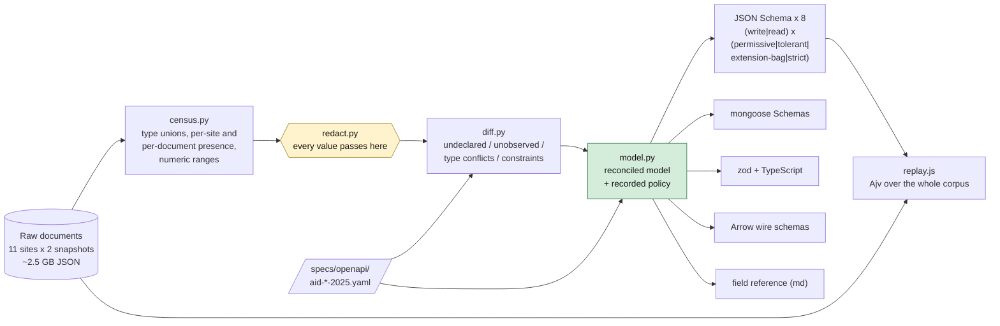

# Typed schemas for Nightscout: what the documents actually contain

Date: 2026-09-10. Status: draft for maintainer discussion. Companion to
[Nightscout multitenancy: evidence and options](./nightscout-multitenancy-discussion-2026-09-09.md)
(§6.4 in particular) and to the
[`x-aid-extensions` convention proposal](../sdqctl-proposals/x-aid-extensions-convention-proposal.md).

**Nothing here is a proposal to merge. The deliverable is evidence, plus the
tooling that produced it, so that any of it can be re-derived or disputed.**

---

## TL;DR

The multitenancy discussion's §6.4 recommends one source of truth for a
field's type, with validators, an ODM schema and column types generated
from it. That recommendation has a precondition nobody had checked: **the
spec has to match the data.** It does not.

Measured over **1,968,464 real documents from 11 consenting Nightscout
sites**, against `specs/openapi/aid-*-2025.yaml`:

| # | Finding | Evidence |
|---|---|---|
| 1 | **`entries.date` is declared `integer` and is fractional in 61.5% of values, on 9 of 11 sites.** 13-digit epoch milliseconds with 1–4 decimal places. A generated `type: integer` validator would reject the majority of real CGM traffic | §4.1 |
| 2 | **`treatments.carbs` is `null` in 95.8% of documents and `treatments.insulin` in 60.7%**, both declared as a bare `number`. Nullability is not an edge case here, it is the common case | §4.2 |
| 3 | **`treatments.timestamp` is declared `integer` and is a string in 100% of its occurrences; `profile.mills` is declared `integer` and is a string in 99% of documents.** These are not near-misses, they are wholly wrong declarations | §4.2, §4.4 |
| 4 | **Strict vs. permissive is now a measured number, not a preference.** Against the 2025.1.0 specs, `additionalProperties: false` rejected **93.5% / 63.4% / 100% / 100%** of live documents per collection. That was spec debt, not bad data: **applying the corrections in §9 drops it to 6.4% / 15.2% / 10.5% / 0.0%**, and the residue is exactly the single-site vendor fields | §5, §9 |
| 5 | **Validation is not a throughput problem.** Compiled validators run at 85,000–330,000 documents/second on one core. At 10,000 tenants each writing one entry per five minutes — 33 documents/second — validation costs about 0.03% of one core | §6 |
| 6 | **The analysis pipeline has already drifted from the wire.** `tools/ns2parquet` never mentions `entries.isCalibration` (62% of documents, 10 sites), `treatments.amount` (46%, 10 sites), `treatments.unabsorbed` (35%, 10 sites) or `profile.loopSettings` (99%, 10 sites), and reads `carbs`/`insulin` without accounting for their majority-null reality | §7 |
| 7 | **Nocturne independently built tolerance for exactly the two type conflicts this corpus shows.** Its `FlexibleLongConverter` rounds a fractional JSON number into `long` and parses a numeric string, which is precisely what findings 1 and 3 require of a reader. Convergent evidence from an unrelated codebase | §8 |

**The recommendation this supports** is narrow and sequenced:

1. **Correct the specs against the evidence — done, in this change.**
   `specs/openapi/aid-{entries,treatments,devicestatus,profile}-2025.yaml`
   are now at version `2025.2.0`, with every corrected or added field
   carrying an `x-aid-evidence` block pointing at the census record that
   justifies it. Reconciliation against the corpus now reports **zero type
   conflicts and zero constraint violations** in all four collections,
   where it previously reported eight and four. These are spec bugs, fixed
   independently of any decision about tenancy, ODMs or storage engines.
2. **Adopt `tolerant` at the write boundary, not `strict`.** It rejects
   nothing in the corpus, drops nothing on storage, and asks no shipped
   client to change. Even after the corrections, `strict` still rejects
   6–15% of `entries`, `treatments` and `devicestatus` traffic, because
   single-site vendor fields remain undeclared by design (§10).
3. **Treat `x-aid-extensions` as a forward-looking convention with a
   measured migration cost**, not a validator to switch on. Its rejection
   rate *is* the size of the client migration it asks for, and that number
   is now known rather than assumed.

---

## 1. What was measured, and what it cannot tell you

### 1.1 The corpus

| Snapshot | Layout | Sites |
|---|---|---|
| 2026-04-01 | `externals/ns-data/patients/<site>/raw/` | 11 |
| 2026-04-26 | `externals/ns-resync-2026-04-26/raw/<site>/` | 11 |

| Collection | Documents | Observed paths | Declared paths |
|---|---|---|---|
| `entries` | 896,589 | 19 | 27 |
| `treatments` | 369,419 | 41 | 47 |
| `devicestatus` | 702,254 | 166 | 117 |
| `profile` | 202 | 66 | 45 |
| `settings` (`/api/v1/status`) | 11 | 115 | — |

Sites appear only as the single-letter pseudonyms the original collection
pass assigned. No site URL, hostname or token is read by any tool in this
pipeline.

### 1.2 The three limits that matter

**The corpus is Loop-dominant, and contains no AndroidAPS closed-loop
site at all.** Nine of eleven sites are Loop (100% of their device
statuses) and one is Trio (98%, having previously run Loop). The eleventh
runs no closed loop: its device statuses carry only uploader battery, its
treatments are `Carbs`, `Bolus` and `BG Check` with `automatic` never
true, and its entries come from xDrip4iOS and LibreLinkUp. Ten of eleven
report an Insulet Dash pump.

An earlier revision of this document described that eleventh site as
AndroidAPS, on the strength of its `devicestatus.device` string. That was
wrong: the device string there identifies the *uploading phone*, not a
controller, and the treatment record shows no automated dosing. Every
statement about AndroidAPS in this series is therefore source-derived —
from its own wire models — and none of it is corroborated by data. **A field marked
"universal" in this report is universal *in a Loop-dominant corpus*,** which
is not the same as universal across the ecosystem. This is why the model
never promotes an observation into a *write* requirement (§3.3): requiring
a field because Loop always sends it would reject AAPS and xDrip documents
that this corpus is too thin to speak for.

**The corpus was collected through `/api/v1/`.** `tools/ns2parquet/ns_fetch.py`
fetches `/api/v1/entries.json` and siblings, which do not return the API v3
metadata envelope. The absence of `identifier`, `srvCreated`, `srvModified`,
`subject`, `isValid`, `isReadOnly`, `modifiedBy` and `app` from the census is
a property of the collection method, not evidence that clients never write
them. The reconciliation reports these separately from genuinely unobserved
fields rather than blaming the spec for them.

**Two snapshots 25 days apart are not a longitudinal study.** They catch
what two points in April 2026 contained. A field that appeared in May, or
that a client stopped writing in March, is invisible here.

### 1.3 Privacy

The corpus is real health data from consenting sites. `tools/nsschema/redact.py`
is the single chokepoint every recorded value passes through. Field *names*,
*types*, *counts* and *numeric ranges* are recorded; a *value* is recorded
only if it survives all five checks below, and is then masked for digit
runs, emails, URLs and hex tokens.

Each check exists because the one before it was demonstrably insufficient,
on this corpus, during this work:

| # | Check | What got through without it |
|---|---|---|
| 1 | **Identifying-name denylist**, exact names | — |
| 2 | **Cardinality cap** (>60 distinct values → drop) | — |
| 3 | **Value-shape rejection**: timestamps, clock times, timezones, reverse-DNS bundle identifiers, any non-ASCII character | Profile-edit timestamps to the millisecond; Apple Developer Team IDs inside Loop `bundleIdentifier` values; users' own override-preset emoji; timezones; individual insulin schedule times |
| 4 | **Name-suffix denial** (`*Id`, `*Identifier`, `*Token`, `*Name`, `*Url`, `*Serial`, …, ignoring trailing digits) | `extendedSettings.loop.apnsDeveloperTeamId`; `settings.frameName1`, whose name no exact list would have contained |
| 5 | **Cross-site corroboration** (a value must be written by ≥3 independent sites) | **Two people's first names**, from one site's `frameName1`/`frameName2` dashboard labels — ordinary-looking tokens that match no shape rule at all |
| | **Small-sample numeric suppression** (<20 observations → no min/max) | One site's exact event timestamp, as a `mills` field's min and max |

Check 5 is the structurally important one, and it was the last to be found.
A collection with few documents has no effective cardinality cap: `settings`
holds **one document per site**, so every string in it is per-site free text
that a 60-value cap never reaches. Corroboration replaces pattern-matching
with a property: **a shared vocabulary term is by definition used by more
than one site; a person's own text is not.** Three sites rather than two,
because two installs sharing a value can simply be two builds by the same
person — which is exactly how the Apple Developer Team ID survived a
two-site threshold.

The rule has a real cost, and the census records it rather than hiding it:
`distinct_value_count` and `values_withheld` are reported per field, and the
reconciliation now separates **`enum_unverifiable`** from
`constraint_violations`. A declared enum may still be incomplete in ways
this corpus deliberately cannot show — `treatments.eventType` had 14
distinct values observed and 6 publishable — and saying so is more useful
than a clean-looking zero.

Every rule is asserted in `tools/nsschema/test_nsschema.py` (96 tests), and
a sweep over every committed artifact for personal-shaped values,
single-site values, small-sample numeric extremes and site URLs returns
zero.

None of the leaked material was needed to know a field is a string.

### 1.3.1 The same policy, pointed at files already in the repo

`redact.py` protects what this pipeline emits. It cannot protect what was
committed before it existed. `tools/nsschema/scan_pii.py` applies the same
rules in reverse to any JSON file — reporting *paths and categories, never
values*, because a report about a leak should not be a second copy of it:

```bash
make schema-scan-pii                       # the ns2parquet fixtures
make schema-scan-pii FILES='path/to/*.json'
```

Run against `tools/ns2parquet/fixtures/` it reports live personal data in
committed test fixtures — APNs `deviceToken` values, Loop
`bundleIdentifier` values carrying Apple Developer Team IDs, override-preset
names and symbols, pump identifiers, timezones and exact timestamps. Those
fixtures predate this work and are already published; remediating them is a
maintainer decision, not something this pipeline should do silently, and it
is raised here rather than fixed. The scanner exists so the question can be
asked of any file, repeatably.

## 2. Method



Reproduce any number in this document:

```bash
make schema            # census -> reconcile -> model -> emit -> impact -> drift
make schema-test       # 96 unit tests, including the redaction policy
make schema-verify     # committed artifacts still match their model
```

`make schema-census` takes about four minutes over ~2.5 GB of JSON;
everything downstream of it is seconds.

## 3. How evidence becomes a schema decision

### 3.1 Tiers count sites, not documents

One busy site can contribute a quarter of a collection. Tiering is
therefore driven by the number of **independent sites** a field appears on,
with document frequency as a secondary signal:

| Tier | Rule | Schema commitment |
|---|---|---|
| `universal` | every site, ≥95% of documents | safe to require **on read** |
| `core` | ≥60% of sites, ≥10% of documents | typed, optional |
| `common` | ≥3 independent sites | typed, optional |
| `vendor` | 1–2 sites but written in ≥80% of their documents | the population `x-aid-extensions` is about |
| `sparse` | 1–2 sites, inconsistently | document, do not type |
| `rare` | <10 documents in the whole corpus | document only |

### 3.2 Type unions are preserved, not flattened

`integer` and `number` are counted separately throughout, because JSON
Schema `type: integer` rejects `1.5` and this corpus contains fields where
the majority of values are fractional. Where a spec declares `integer` and
the data is fractional, the model widens to `number` **and records why**;
where a field holds genuinely different types by client, the union survives
into every emitted artifact rather than being resolved by guesswork.

### 3.3 Read and write are different contracts

A Nightscout document does not have one schema. `_id` is present in 100% of
returned documents and is never sent by a client. Conflating the two
produces a validator that either rejects legitimate writes or lets consumers
assume a field that is sometimes absent. Every artifact is therefore
emitted in a `write` and a `read` profile.

Write requirements are deliberately **not** derived from evidence, for the
reason in §1.2: `sgv`, `sysTime` and `utcOffset` are universal in this
corpus, and the model marks them `candidate_required_write` rather than
requiring them, because "Loop always sends it" is not "a client must send
it."

### 3.4 An enum is a closed set, and observation cannot close one

The model never creates an enum from observed values; it only *extends* an
enum the spec already declares. An earlier version did create them, and
`devicestatus.loop.version` promptly acquired a spurious enum of the eight
Loop versions that happened to appear — which then rejected 81.8% of live
device statuses in the replay. Observed values are still carried, as
`x-observed-values` documentation.

## 4. Findings, by collection

Every number below was measured against the **2025.1.0** specs, and is what
motivated the corrections in §9. The specs in this repo are now at
`2025.2.0`; re-running `make schema-reconcile` against them reports zero
type conflicts and zero constraint violations, so these tables are the
record of what was wrong, not a description of the current specs.

### 4.1 `entries` — the timestamp is not an integer

| Path | Declared | Observed | Impact |
|---|---|---|---|
| `date` | `integer` | `integer` 345,332 · `number` 551,257 | **61.5% of values rejected** by the declared type, across 11 sites |
| `direction` | enum of 9 | also `NONE` | enum incomplete |
| `trend` | *undeclared* | `integer`, 71.6% of documents, 10 sites | core field missing from the spec |
| `isCalibration` | *undeclared* | `boolean`, 61.9%, 10 sites | core field missing from the spec |
| `trendRate` | *undeclared* | `number`, 46.0%, 10 sites | core field missing from the spec |
| `glucose` | *undeclared* | 1 site, 86% of its documents | vendor field |
| `scale`, `slope`, `intercept` | declared | never observed | calibration fields no client in this corpus writes |

The `date` finding was verified independently of the census, by scanning
raw bytes for `"date":` and counting values containing a decimal point:
**399,739 of 649,840 (61.5%) in the 2026-04-01 snapshot alone**, ranging
from 0.0% on two sites to over 99% on five. The shape is consistently a
13-digit epoch millisecond value with 1–4 fractional digits — sub-millisecond
precision leaking into a field the ecosystem treats as an integer. This is
the same class of defect as Trio [#1476](https://github.com/nightscout/Trio/pull/1476),
and it is not confined to one client.

### 4.2 `treatments` — null is the common case

| Path | Declared | Observed | Impact |
|---|---|---|---|
| `carbs` | `number` | `null` 353,734 · `integer` 10,656 · `number` 5,029 | **95.8% of values are null** |
| `insulin` | `number` | `null` 224,268 · `number` 142,360 · `integer` 2,791 | **60.7% of values are null** |
| `timestamp` | `integer` | `string`, 311,648 occurrences | **100% wrong type** |
| `eventType` | enum of 28 | also `Bolus`, `Carbs` | enum incomplete |
| `type` | enum `Normal/Priming/SMB` | `normal` | case mismatch, 130,257 documents |
| `amount` | *undeclared* | 45.7% of documents, 10 sites | core field missing from the spec |
| `unabsorbed` | *undeclared* | 35.3%, 10 sites | core field missing from the spec |
| `userEnteredAt` | *undeclared* | 10 sites | cross-client, low volume |
| `insulinNeedsScaleFactor`, `correctionRange` | *undeclared* | 9 and 7 sites | cross-client override fields |
| `id` | *undeclared* | 1 site, 90% of its documents | vendor field |

`carbs` and `insulin` are present in 100% of documents on all 11 sites and
null in most of them — Nightscout writes the key regardless. A generated
type of `number` is not a near-miss here; it is wrong for the majority
case, and it is the kind of wrongness that surfaces as a crash in a
consumer that trusted the type.

### 4.3 `devicestatus` — 65 undeclared paths, and the pump subtree is missing

166 observed paths against 117 declared. The undeclared set splits cleanly:

* **Cross-client, undeclared**: `pump.bolusing`, `pump.pumpID`,
  `pump.secondsFromGMT`, `pump.suspended`, `pump.manufacturer`,
  `pump.model`, `uploader.timestamp` — each on 10 sites, 84–85% of
  documents. Seven core fields absent from the spec.
* **Single-vendor subtrees**: 40-odd `openaps.suggested.*`,
  `openaps.enacted.*` and `openaps.iob.*` paths, all on the one Trio site.
  Real, but this corpus cannot distinguish "Trio-specific" from "the corpus
  only has one openaps site" — see §10.
* One type conflict: `openaps.iob.lastTemp.duration`, declared `integer`,
  fractional in 97.2% of its values.

### 4.4 `profile` — the whole Loop subtree is undeclared

| Path | Declared | Observed |
|---|---|---|
| `mills` | `integer` | `string` in 200 of 202 documents (**99%**) |
| `store.{}.carbs_hr` | `number` | `string` in 99% |
| `store.{}.delay` | `integer` | `string` in 99% |
| `units` | enum `mg/dl`, `mmol` | `mg/dL`, `mmol/L` |
| `store.{}.units` | *undeclared* | present in **100%** of documents, all 11 sites |
| `loopSettings.*` | *undeclared* | 26 paths, 10 sites, 99% of documents |

`loopSettings` is the attribute-flattening camp from the `x-aid-extensions`
proposal, measured: an entire 26-path subtree that ten of eleven sites write
into every profile document and that no spec in this repo describes.

The `units` enums are also mutually inconsistent *within* our own specs:
`aid-entries-2025.yaml` declares `[mg, mmol]`, `aid-profile-2025.yaml`
declares `[mg/dl, mmol]`, and the data contains `mg/dL`, `mg/dl` and
`mmol/L`. No single declared enum matches any other, or the data.

## 5. Strict vs. permissive, measured

Every document in the corpus was replayed through compiled Ajv 8 validators
for each policy — 1,968,464 documents × 8 policies. Rejection rate, write
profile (read differs by <0.2 points), **against the 2025.1.0 specs**:

| Collection | `permissive` | `tolerant` | `extension-bag` | `strict` |
|---|---|---|---|---|
| `entries` (896,589) | 0.00% | 0.00% | 6.44% | **93.48%** |
| `treatments` (369,419) | 0.00% | 0.00% | 15.19% | **63.43%** |
| `devicestatus` (702,254) | 0.00% | 0.00% | 14.94% | **100.00%** |
| `profile` (202) | 0.00% | 0.00% | 0.99% | **100.00%** |

What each policy means:

* **`permissive`** — types and enums checked, `additionalProperties: true`.
  Closest to Nightscout today, plus type checking.
* **`tolerant`** — every field the corpus has ever shown, typed where its
  clients actually write it, `additionalProperties: false`. Only genuinely
  novel fields are rejected.
* **`extension-bag`** — core fields at the top level, weakly-evidenced
  vendor fields required to live under `x-aid-extensions`,
  `additionalProperties: false`.
* **`strict`** — only what the spec declares, `additionalProperties: false`
  everywhere.

**That `permissive` and `tolerant` both reject nothing is the load-bearing
result.** It says the reconciled model is a faithful description of the
corpus — if it were not, these columns would not be zero — and it says a
closed-world schema is adoptable *today* at the `tolerant` level, with no
client changing anything.

### 5.1 What `strict` actually rejects

`strict` fails not because live data is malformed but because the spec is
incomplete. Its top causes are precisely the undeclared-but-core fields of
§4:

| Collection | Dominant cause | Share of documents |
|---|---|---|
| `entries` | `trend` | 71.6% |
| `treatments` | `amount` | 45.7% |
| `devicestatus` | `uploader.timestamp`, `pump.pumpID`, `pump.bolusing`, `pump.secondsFromGMT`, `pump.suspended` | 85.1% each |
| `profile` | `store.{}.units` (100%), `loopSettings` (99%) | — |

### 5.1a The same measurement after the corrections

The §9 corrections were applied and the replay re-run, unchanged in every
other respect:

| Collection | `strict`, 2025.1.0 | `strict`, 2025.2.0 | What still fails |
|---|---|---|---|
| `entries` | 93.48% | **6.44%** | `glucose`, 1 site |
| `treatments` | 63.43% | **15.21%** | `id` (1 site, 90% of its documents), `units`, `remoteAddress`, `mills`, `endmills`, `durationType` |
| `devicestatus` | 100.00% | **10.52%** | the `openaps.*` subtree, 1 site |
| `profile` | 100.00% | **0.00%** | nothing |

Reconciliation against the corrected specs reports **zero type conflicts and
zero constraint violations** in all four collections. `profile` is now fully
described: every path in 202 real documents is declared.

This is the load-bearing confirmation that the 93–100% figures were spec
debt rather than data quality. It also shows where the honest limit is:
`strict` and `extension-bag` now report identical rates, because the only
remaining rejections are single-site vendor fields — precisely the
population §3.1 declines to promote into a typed core schema on the evidence
of one site, and precisely what `x-aid-extensions` exists to give a home.

### 5.2 Storage and return are not symmetric

Rejection is one reading of "strict". The other is *strip-unknown*: accept
the document, silently discard fields the schema does not name. Measured as
undeclared top-level values per policy:

| Collection | Under `strict`, values dropped | Documents affected |
|---|---|---|
| `entries` | 1,667,406 | 838,093 (93.5%) |
| `treatments` | 236,075 | 234,340 (63.4%) |
| `profile` | 200 | 200 (99.0%) |

Under `permissive` the same numbers are 57,722 / 56,105 / 0 — the vendor
fields of §4. Under `tolerant`, zero: nothing observed is dropped.

The distinction matters because the two failure modes are visible in
different places. Rejection is loud and lands on the uploader; stripping is
silent and lands on whoever reads the data months later. **For a
storage-and-return boundary, the `tolerant` policy is the only one of the
four that neither rejects nor drops anything in this corpus.**

## 6. Validation cost

Compiled Ajv, single-threaded, all errors collected (a production validator
would short-circuit on the first and be faster):

| Collection | `permissive` | `tolerant` | `strict` |
|---|---|---|---|
| `entries` | 328,788 docs/s | 315,365 | 275,971 |
| `treatments` | 149,598 | 135,999 | 157,601 |
| `devicestatus` | 119,798 | 106,041 | 84,793 |
| `profile` | 65,541 | 71,162 | 91,553 |

The multitenancy discussion flags per-document validation as a candidate
CPU sink at N tenants × ingest rate (EXP-MT-013). At 10,000 tenants each
writing one entry every five minutes, ingest is ~33 documents/second.
Against 100,000 documents/second, **validation is roughly 0.03% of one
core.** Even three orders of magnitude of headroom off, it is not the
bottleneck. This does not settle mongoose's casting cost at ingest
(EXP-MT-046), which is a different measurement.

## 7. The analysis pipeline has already drifted

`tools/ns2parquet/` is the fifth independent declaration of the document
model, and the one furthest from review. `make schema-drift` checks it
against the measured wire model. Fields whose name appears **nowhere** in
the pipeline source:

| Field | Tier | Documents | Sites |
|---|---|---|---|
| `entries.isCalibration` | core | 61.9% | 10 |
| `treatments.amount` | core | 45.7% | 10 |
| `treatments.unabsorbed` | core | 35.3% | 10 |
| `profile.loopSettings` | core | 99.0% | 10 |

Plus two type risks: `treatments.carbs` and `treatments.insulin` are read
without accounting for being null in 96% and 61% of the documents that
carry them.

The check is deliberately at name level. An earlier, stricter version that
looked only at `.get()` and subscript access reported `sysTime`,
`startDate`, `mills` and `defaultProfile` as dropped — all four are read,
through a varargs helper (`_parse_ts(doc, 'created_at', 'startDate', 'mills')`)
that the narrower analysis could not see. A field whose name appears
nowhere cannot be being read; a field whose name appears might only be in a
comment. The check under-reports rather than over-reports, by design.

This is not an argument for regenerating `ns2parquet`. Its normalization is
deliberate semantic work — unit conversion, controller detection, SMB
inference — that a schema cannot express. It is an argument for the drift
check running in CI.

## 8. Cross-check against Nocturne

Nocturne (pinned at `cb43fae5`) arrives at the same two conclusions from
the other direction, without having seen this corpus:

* **Fractional timestamps.** `Entry.date` carries
  `[JsonConverter(typeof(FlexibleLongConverter))]`, and
  `FlexibleNumberReader.ReadLong` falls back from `TryGetInt64` to
  `TryGetDouble` plus rounding. A fractional `date` — finding 1, 61.5% of
  values — is absorbed rather than rejected.
* **Type unions on timestamps.** The same reader parses a numeric *string*,
  which is exactly finding 3 (`profile.mills` is a string in 99% of
  documents).
* **Extension data.** `DeviceStatus.ExtensionData` (`[JsonExtensionData]`)
  captures unknown top-level keys, matching the extension-bag camp the
  `x-aid-extensions` proposal recommends.
* **mills-first timestamp chain.** `Entry` documents its
  `mills` → `date` → `dateString` fallback explicitly, with a comment
  noting that AAPS reads `date` alone with no fallback.

Two independent efforts — a C# reimplementation and a census of 2 million
documents — converging on the same tolerance requirements is stronger
evidence than either alone. It also suggests the right question for the
spec is not "which type is correct" but "which types must a conforming
reader accept", which is a different and more useful thing to write down.

## 9. Spec corrections — proposed, applied, and re-measured

Each is a change to `specs/openapi/aid-*-2025.yaml`, justified by a number
above, and independent of any decision about tenancy, ODMs or storage
engines. **All thirteen have been applied** and the specs bumped to
`2025.2.0`; every corrected or added field carries an `x-aid-evidence` block
naming the census record behind it, and each spec's `description` carries a
changelog. §5.1a is the re-measurement.

| # | Spec | Change | Justification |
|---|---|---|---|
| 1 | entries | `date`: `integer` → `number` | 61.5% of values, 11 sites |
| 2 | entries | `direction`: add `NONE` | observed |
| 3 | entries | add `trend`, `trendRate`, `isCalibration` | 10 sites each |
| 4 | treatments | `carbs`, `insulin`: allow `null` | 95.8% / 60.7% |
| 5 | treatments | `timestamp`: `integer` → `string` (or a union) | 100% of occurrences |
| 6 | treatments | `eventType`: add `Bolus`, `Carbs` | observed |
| 7 | treatments | `type`: accept `normal` or normalise case at the boundary | 130,257 documents |
| 8 | treatments | add `amount`, `unabsorbed`, `userEnteredAt`, `insulinNeedsScaleFactor`, `correctionRange` | 7–10 sites each |
| 9 | devicestatus | add `pump.{bolusing,pumpID,secondsFromGMT,suspended,manufacturer,model}`, `uploader.timestamp` | 10 sites each |
| 10 | devicestatus | `openaps.iob.lastTemp.duration`: `integer` → `number` | 97.2% of values |
| 11 | profile | `mills`, `store.{}.carbs_hr`, `store.{}.delay`: accept `string` | 99% of documents |
| 12 | profile | add `store.{}.units`; reconcile the three different `units` enums across specs | 100% of documents |
| 13 | profile | describe `loopSettings` (26 paths) | 10 sites, 99% of documents |

### 9.1 Three of these are a widening, and should not stay one

Items 1, 5 and 11 were applied as type unions, which keeps every real
document valid but encodes an ambiguity rather than resolving it. The useful
contract is probably two-sided: **"a conforming reader MUST accept these
types", with a narrower "a conforming writer SHOULD emit" beside it.** That
is what Nocturne's flexible converters implement in practice (§8), and it is
not expressible as a single `type:` keyword. The applied specs say so in
prose — `entries.date` reads "a conforming reader MUST accept a fractional
value; a conforming writer SHOULD emit a whole number" — but prose is not
checkable, and a `x-aid-writer-type` companion keyword would be.

Item 7 (`treatments.type` accepting lowercase `normal`) and item 12 (three
mutually inconsistent `units` enums across our own specs) are the same shape
of problem: the widening keeps readers working while leaving the underlying
disagreement in place. Both are ecosystem questions to raise alongside the
`x-aid-extensions` proposal — which the §5 numbers now give a migration cost
— rather than spec edits to make unilaterally.

### 9.2 Two fields were marked sensitive, not merely typed

`profile.loopSettings.deviceToken` is an APNs credential and
`profile.loopSettings.bundleIdentifier` embeds the builder's Apple Developer
Team ID. Both are now described as values not to log, display or copy into
derived data. They reached an intermediate version of this pipeline's own
output before the value-shape redaction of §1.3 caught them, which is a fair
indication of how easily they travel.

## 10. What is not measured

* **Whether the `openaps.*` subtree is Trio-specific.** One Trio site and
  one AAPS site cannot separate "this client writes it" from "only one site
  runs this client". Needs more AAPS and Trio sites.
* **Whether the undeclared `pump.*` fields are Loop-specific.** Same
  problem, inverted: 10 of 11 sites are Loop.
* **Anything about xDrip, LibreLink, or non-Dash pumps.** Ten of eleven
  sites report Insulet Dash.
* **API v3 documents.** The corpus is v1 (§1.2). The v3 metadata envelope
  and `identifier` semantics are unmeasured here.
* **`food`, `activity`, `entries` of type `cal`.** `cal` entries do not
  appear in the corpus at all despite being a declared `EntryType`.
* **mongoose's casting cost at ingest rate** (EXP-MT-046) — §6 measures
  JSON Schema validation only.
* **Whether the generated mongoose schemas behave correctly against a live
  MongoDB.** They are generated and reviewable; they have not been run.
* **Enum completeness for values written by fewer than three sites.** The
  corroboration rule of §1.3 withholds them by design; `enum_unverifiable`
  in each reconciliation names the affected fields and how many values were
  withheld. Closing this needs either more sites or a separate,
  non-publishing check.

## 11. What was built

All under `tools/nsschema/`, with 96 unit tests:

| Artifact | Location |
|---|---|
| Per-field census, 5 collections | `reports/schema-census/*.census.json` |
| Spec reconciliation | `reports/schema-census/*.reconcile.json` |
| Strictness impact measurement | `reports/schema-census/impact.json` |
| ns2parquet drift check | `reports/schema-census/ns2parquet-drift.json` |
| Reconciled model (the source of truth) | `specs/nsschema/*.model.json` |
| JSON Schema 2020-12, 8 variants each | `specs/jsonschema/generated/` |
| mongoose Schemas | `specs/generated/mongoose/` |
| zod schemas + inferred TypeScript types | `specs/generated/typescript/` |
| Arrow wire schemas | `specs/generated/arrow/` |
| Human-readable field reference | `docs/10-domain/field-reference/` |
| Corrected specs, `2025.2.0`, with `x-aid-evidence` | `specs/openapi/aid-*-2025.yaml` |

Every artifact below `specs/nsschema/*.model.json` is generated from it and
nothing else, which is what makes §6.4's "one source, four consumers"
checkable: `make schema-verify` fails if any committed artifact has drifted
from the model.

## 12. References

* [Nightscout multitenancy: evidence and options](./nightscout-multitenancy-discussion-2026-09-09.md) — §6.4 schemas and ODMs, §6.5 query cost, §8.3 EXP-MT-013 and EXP-MT-046
* [`x-aid-extensions` convention proposal](../sdqctl-proposals/x-aid-extensions-convention-proposal.md)
* [Nightscout modernization review and proposed next steps](../60-research/nightscout-modernization-next-steps-2026-09-09.md)
* [Tooling evaluation: keyv, mongoose, zod, WASM](../reports/nightscout-release-planning-2026-09/tooling-evaluation-keyv-mongoose-zod-wasm.md)
* `tools/nsschema/README.md` — pipeline, commands, privacy policy
* Nocturne `cb43fae5`: `src/Core/Nocturne.Core.Models/Entry.cs`, `Serializers/FlexibleNumberConverters.cs`, `DeviceStatus.cs`
