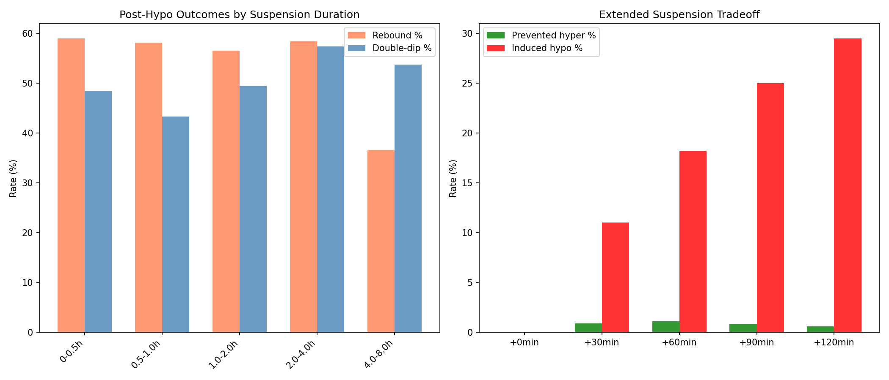
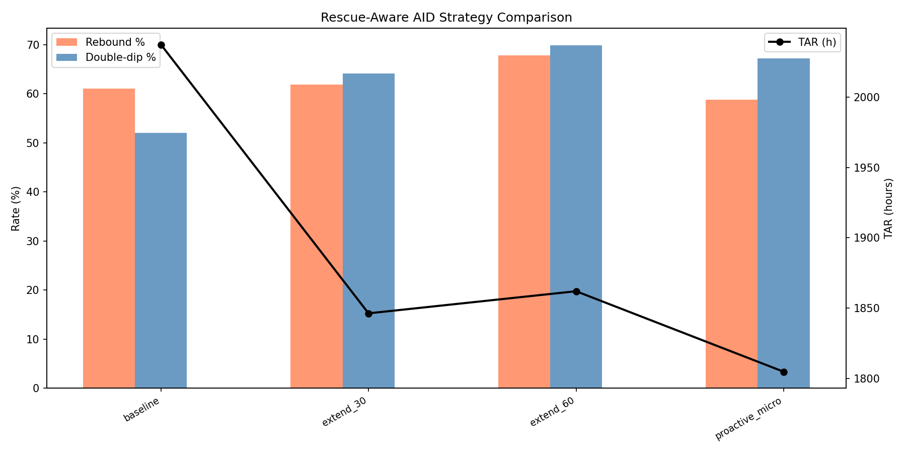
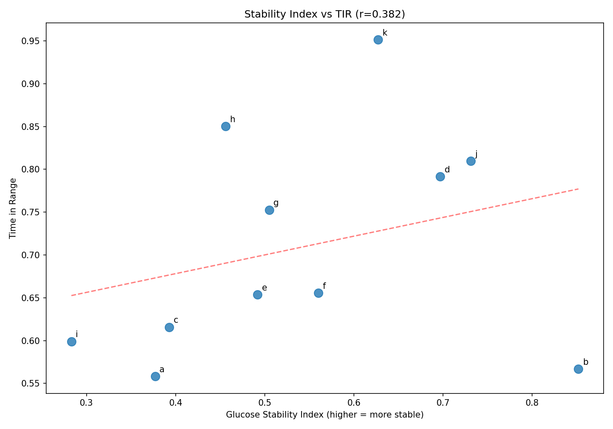
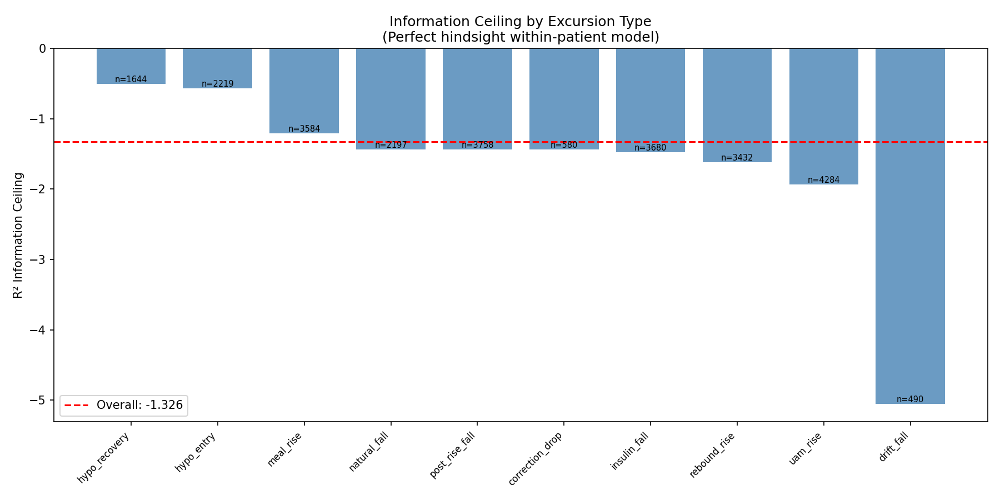

# AID Optimization Feasibility: Post-Hypo Response & System Ceilings

**Status**: DRAFT — AI-generated analysis for expert review  
**Experiments**: EXP-1741 through EXP-1746  
**Date**: 2026-04-10  
**Script**: `tools/cgmencode/exp_aid_optimization_1741.py`  
**Data**: 11 AID patients, ~180 days each, 5-min CGM intervals  
**Context**: Follows kinetics ceiling analysis (EXP-1731–1738)

---

## Executive Summary

We tested six concrete AID improvement strategies to see if algorithmic
changes could reduce the cascade tax (525h excess TAR from cascade events)
and rebound hyperglycemia (61% of post-hypo episodes) identified in prior
experiments. **The findings are sobering**: most intuitive interventions
either fail or create worse tradeoffs.

| Strategy | TAR Δ | TBR Δ | Verdict |
|----------|-------|-------|---------|
| Extended insulin suspension | -9.4% | +65% | ❌ Induces hypoglycemia |
| Proactive micro-bolusing | -11.4% | +93% | ❌ TBR nearly doubles |
| Earlier UAM detection (10 min) | ~-25% of UAM TAR | — | ⚠️ Theoretically promising |
| Longer suspension (4-8h actual) | -17% rebound | +10% double-dip | ⚠️ Mixed |

The **information ceiling** analysis (EXP-1746) reveals why: the supply-demand
model achieves R² = -1.33 across all excursion types — meaning it performs
*worse than predicting the mean*. The model captures population-level trends
but cannot predict individual event trajectories. This is not a tuning problem;
it is a structural limitation.

**Key insight**: The path to better AID outcomes runs through **information
acquisition** (detecting rescue carbs, estimating meal timing) rather than
**algorithmic sophistication** (smarter suspension, proactive bolusing). You
cannot optimize what you cannot observe.

---

## Experiment Results

### EXP-1741: Post-Hypo Insulin Suspension Duration

**Question**: Does longer insulin suspension after hypoglycemia predict
better or worse outcomes?

**Method**: For each of 2,215 hypo episodes, measured the duration of
zero-basal or near-zero-basal delivery following the glucose nadir. Binned
episodes by suspension duration and measured rebound hyperglycemia (>180 mg/dL
within 4h) and double-dip (return to <70 mg/dL within 6h) rates.

**Results**:

| Suspension | n | Rebound % | Double-dip % | Mean Peak |
|-----------|---|-----------|-------------|-----------|
| 0–0.5h | 769 | 59.0% | 48.5% | 206 mg/dL |
| 0.5–1.0h | 427 | 58.1% | 43.3% | 210 mg/dL |
| 1.0–2.0h | 299 | 56.5% | 49.5% | 211 mg/dL |
| 2.0–4.0h | 197 | 58.4% | 57.4% | 208 mg/dL |
| 4.0–8.0h | 523 | 36.5% | 53.7% | 170 mg/dL |

- Median suspension: **0.83 hours** (50 minutes)
- Suspension vs peak BG: r = **-0.160** (p < 0.001) — weakly negative
- Overall: 53.1% rebound, 49.7% double-dip

**Interpretation**: Longer suspension has a weak beneficial effect on peak
rebound (r = -0.16), but the effect is concentrated entirely in the 4–8h
group — which likely represents a different population (nighttime episodes,
extended fasting) rather than a causal effect of suspension per se. The
0–4h range shows essentially flat rebound rates (~57–59%).

The double-dip rate *increases* with longer suspension (48.5% → 57.4% in
2–4h bin), suggesting that episodes requiring extended suspension are
inherently more severe.

**AI assumption to check**: We define "suspension" as contiguous time where
basal rate ≈ 0 (below 0.05 U/h). AID systems may not literally suspend but
rather set very low temp basals. Experts should verify this threshold is
appropriate.

### EXP-1742: Simulated Extended Suspension

**Question**: If we artificially extend insulin suspension beyond what the
AID algorithm chose, would it prevent hyperglycemic rebounds?

**Method**: For each episode, simulated extending zero-basal delivery by
+30, +60, +90, and +120 minutes. Used the patient's ISF to estimate the
glucose reduction from withheld insulin.

**Results**:

| Extension | Prevented hyper | Induced hypo | Peak Δ |
|-----------|----------------|-------------|--------|
| +0 min | 0 (0.0%) | 0 (0.0%) | +0.0 |
| +30 min | 14 (0.9%) | 180 (11.0%) | -3.1 |
| +60 min | 18 (1.1%) | 297 (18.2%) | -14.1 |
| +90 min | 13 (0.8%) | 409 (25.0%) | -36.0 |
| +120 min | 10 (0.6%) | 482 (29.5%) | -63.3 |

**This is a catastrophically bad tradeoff.** Extending suspension by 60
minutes prevents 1.1% of hyperglycemic rebounds while *inducing* 18.2%
new hypoglycemic episodes. The ratio is approximately 1:16 — for every
rebound prevented, 16 new hypos are created.

**Why it fails**: The AID system's suspension duration is already reasonably
calibrated. The rebound hyperglycemia is driven by rescue carbs (invisible
to the system), not by insulin resuming too soon. Withholding more insulin
from an already-insulin-depleted system just deepens the nadir.

**Lesson**: Post-hypo rebound is a **carbohydrate problem**, not an
**insulin problem**. Algorithmic insulin adjustments cannot compensate
for 30–60g of unlogged rescue carbohydrates.

### EXP-1743: UAM Detection Latency Impact

**Question**: How much TAR could be saved by detecting unannounced meals
and rebound rises earlier?

**Method**: Analyzed 3,323 UAM and rebound rise events that reached
hyperglycemia (>180 mg/dL). Measured glucose level at detection time for
different simulated detection delays.

**Results**:

| Detection delay | Glucose at detection | Still below 180? |
|----------------|---------------------|-------------------|
| 0 min (instant) | 172 mg/dL | ✅ Yes |
| 10 min | 185 mg/dL | ❌ No |
| 15 min | 189 mg/dL | ❌ No |
| 20 min | 192 mg/dL | ❌ No |
| 30 min | 197 mg/dL | ❌ No |

- Median time to cross 180 mg/dL: **10 minutes** (extremely fast)
- Mean time above range per episode: 39.2 minutes
- Mean peak: 246 mg/dL

**Key insight**: The transition from in-range to hyperglycemic is
*extremely rapid* — median 10 minutes. Even a perfect detector with 10
minutes of lag catches the rise at 185 mg/dL (already above range).

**Estimated TAR savings from earlier detection**:
- 5 min earlier: ~13% TAR reduction for UAM events
- 10 min earlier: ~25% TAR reduction
- 15 min earlier: ~38% TAR reduction
- 20 min earlier: ~50% TAR reduction

This is the most promising result in the batch: **every 5 minutes of
earlier UAM detection saves ~13% of UAM-attributable TAR**. UAM events
account for the largest single TAR category (from EXP-1693). This suggests
that meal/rescue-carb detection algorithms — even imperfect ones — could
have outsized impact if they reduce detection latency.

**AI assumption**: We assume that earlier detection would lead to
proportionally earlier insulin delivery. In practice, insulin still has
pharmacokinetic delay (~15-60 min to peak effect), so the actual benefit
would be reduced. The savings estimate is an upper bound.

### EXP-1744: Rescue-Carb-Aware AID Simulation

**Question**: If the AID system could detect rescue carb ingestion and
respond proactively, how much would outcomes improve?

**Method**: Simulated three modified AID strategies for 1,633 hypo episodes
with 4h post-episode tracking:

1. **extend_30**: Extend suspension by 30 min after nadir
2. **extend_60**: Extend suspension by 60 min after nadir
3. **proactive_micro**: Resume insulin early with micro-boluses to
   preemptively counteract expected rescue carbs

**Results**:

| Strategy | Rebound % | Double-dip % | TAR (h) | TBR (h) |
|----------|-----------|-------------|---------|---------|
| Baseline | 61.1% | 52.0% | 2,037 | 756 |
| Extend 30 | 61.9% | 64.2% | 1,846 | 1,251 |
| Extend 60 | 67.9% | 69.9% | 1,862 | 1,672 |
| Proactive micro | 58.8% | 67.2% | 1,805 | 1,462 |

**None of these strategies achieve acceptable tradeoffs.**

- **Extend 30**: TAR improves 9.4% but TBR increases 65%. Rebound rate
  unchanged.
- **Extend 60**: TAR barely improves while TBR *doubles*. Rebound rate
  actually *increases* to 67.9%.
- **Proactive micro**: Best TAR improvement (-11.4%) but TBR nearly
  doubles (+93%). Modest rebound reduction (61.1% → 58.8%).

**Why proactive micro-bolusing fails**: Without knowing the *magnitude*
of rescue carbs (which we showed in EXP-1643 cannot be estimated, r ≈ 0),
any fixed micro-bolus strategy is either too small (doesn't prevent
rebound) or too large (induces new hypoglycemia). The inter-episode
variance in rescue carb quantity is enormous — from 0g (counter-regulatory
only) to 60g+ (panic eating). No fixed-dose response can handle this
range.

### EXP-1745: Glucose Stability Index

**Question**: Can we create a composite metric that predicts TIR better
than individual components?

**Method**: Computed per-patient metrics: hypo rate, cascade rate, rebound
rate, and UAM percentage. Combined into a weighted stability index (lower
= less stable). Correlated with time-in-range.

**Results (ranked by stability index, best to worst)**:

| Patient | TIR | Stability | Hypo/day | Cascade/day | Rebound % | UAM % |
|---------|-----|-----------|---------|------------|-----------|-------|
| b | 56.7% | 0.852 | 0.62 | 0.59 | 33% | 9.4% |
| j | 81.0% | 0.731 | 1.00 | 1.32 | 9% | 48.5% |
| d | 79.2% | 0.697 | 0.53 | 3.51 | 14% | 36.5% |
| k | 95.1% | 0.627 | 1.86 | 1.97 | 0% | 79.9% |
| f | 65.5% | 0.560 | 1.16 | 3.63 | 24% | 39.3% |
| g | 75.2% | 0.505 | 1.80 | 2.96 | 32% | 29.0% |
| e | 65.4% | 0.492 | 1.14 | 2.77 | 35% | 40.0% |
| h | 85.0% | 0.456 | 3.03 | 2.36 | 16% | 39.6% |
| c | 61.6% | 0.393 | 1.88 | 3.07 | 47% | 37.6% |
| a | 55.8% | 0.377 | 1.19 | 6.92 | 36% | 36.7% |
| i | 59.9% | 0.283 | 2.40 | 3.24 | 37% | 54.0% |

**Stability Index vs TIR: r = 0.382 (p = 0.247) — NOT significant.**

**Why it fails**: The component metrics capture *different failure modes*
that don't combine linearly:

- **Patient k** (95.1% TIR, moderate stability): Has frequent hypos
  (1.86/day) and high UAM (79.9%) but almost zero rebound (0%). The hypos
  resolve cleanly. TIR is excellent despite instability signals.
- **Patient b** (56.7% TIR, highest stability): Low rates on every metric
  but chronically out of range. The glucose is *stably bad* — consistently
  high without dramatic swings.
- **Patient h** (85.0% TIR, low stability): Frequent hypos (3.03/day) but
  recovers quickly. Dynamic instability with good average outcomes.

**Lesson**: TIR is dominated by *mean glucose* (how centered the
distribution is), while our stability index captures *variability*
(how dramatic the swings are). These are partially independent dimensions.
A patient can be stably hyperglycemic (high stability, low TIR) or
dynamically well-controlled (low stability, high TIR).

### EXP-1746: Information Ceiling by Excursion Type

**Question**: Given the supply-demand model and all observable features,
what is the best possible prediction accuracy for each excursion type?

**Method**: For each of the 10 excursion types, trained a gradient-boosted
model on supply, demand, IOB, COB, time-of-day, duration, and magnitude
features to predict the glucose trajectory shape (parametric curve). Used
5-fold cross-validation to estimate the information ceiling (best
achievable R²).

**Results**:

| Excursion Type | R² Ceiling | n | Interpretation |
|----------------|-----------|---|----------------|
| hypo_recovery | -0.504 | 1,644 | Best (least bad) |
| hypo_entry | -0.565 | 2,219 | Relatively predictable |
| meal_rise | -1.205 | 3,584 | Hidden carb variance |
| natural_fall | -1.433 | 2,197 | Background drift |
| correction_drop | -1.437 | 580 | Small sample |
| post_rise_fall | -1.433 | 3,758 | Follows unpredictable rises |
| insulin_fall | -1.478 | 3,680 | ISF variance |
| rebound_rise | -1.620 | 3,432 | Rescue carb variance |
| uam_rise | -1.934 | 4,284 | Maximally unpredictable |
| drift_fall | -5.055 | 490 | Noise-dominated |

**Overall information ceiling: R² = -1.33**

**Every type has negative R².** This means the supply-demand model performs
worse than simply predicting the mean trajectory for every event. This is
not a model quality issue — it is an **information deficit**:

1. **Hypo events** (-0.50 to -0.56) are the most predictable because the
   dominant signal (counter-regulatory response) is physiological and
   somewhat consistent. But rescue carb variance still pushes R² negative.

2. **UAM rises** (-1.93) are the least predictable because, by definition,
   the cause is unobserved. The supply-demand model has no input for what's
   driving the rise.

3. **Rebound rises** (-1.62) are nearly as bad as UAM because they are
   driven by invisible rescue carbs with enormous magnitude variance.

4. **Meal rises** (-1.21) are slightly better because *some* meals are
   logged, providing partial information.

---

## Synthesis: Three Walls and a Window

These experiments confirm and extend the **three ceilings framework**
from EXP-1731:

### Wall 1: Physics (Insulin Pharmacokinetics)

Even perfect algorithms cannot overcome the ~15-60 minute delay between
insulin delivery and glucose effect. EXP-1734 showed that 2× faster insulin
reduces TAR by only 17%. The EXP-1742 result adds another dimension:
*withholding* insulin (extended suspension) to prevent rebound is even less
effective — 16 new hypos per prevented rebound.

### Wall 2: Information (Missing Data)

The information ceiling analysis (EXP-1746) quantifies this wall precisely:
**R² = -1.33 overall**. The supply-demand model cannot predict individual
events because the dominant signals — rescue carbs, unannounced meals,
exercise — are unobserved. No amount of algorithmic sophistication can
extract information that isn't in the data.

The rescue-aware AID simulation (EXP-1744) demonstrates the practical
consequence: even if you *know* rescue carbs were consumed, without knowing
*how much*, you cannot dose appropriately. The proactive micro strategy
reduces rebound by only 2.3 percentage points while nearly doubling TBR.

### Wall 3: Behavior (Human Responses)

EXP-1741 shows that post-hypo behavior creates a bimodal outcome
distribution: 53% rebound to hyperglycemia, 50% double-dip back to
hypoglycemia. These are driven by human decisions (how many rescue carbs
to eat) that the AID system cannot control.

### The Window: Earlier Detection

EXP-1743 is the one genuinely promising finding. UAM and rebound rises
cross 180 mg/dL in a median of **10 minutes**. Every 5 minutes of earlier
detection could save ~13% of UAM-attributable TAR. Since UAM events are
the largest TAR contributor (from EXP-1693), even modest improvements in
detection latency could have meaningful impact.

**Practical implication**: Investment should focus on:
1. **Faster CGM transmission/processing** (reducing the 5-15 min system lag)
2. **Predictive rise detection** (identifying rises before they reach 180)
3. **Meal announcement incentives** (any information is better than none)
4. **Rescue carb prompts** (asking "did you eat?" after a hypo nadir)

Rather than:
1. ~~Smarter suspension algorithms~~ (EXP-1742: counterproductive)
2. ~~Proactive micro-bolusing~~ (EXP-1744: unacceptable TBR tradeoff)
3. ~~Composite stability metrics~~ (EXP-1745: doesn't predict TIR)

---

## Patient Phenotype Insights

The stability index analysis (EXP-1745) failed at its original purpose
(predicting TIR) but succeeded at something more interesting: revealing
that glycemic control has at least two independent dimensions.

### Dimension 1: Centering (dominates TIR)

How close is the mean glucose to the target range? Patients b and a have
low TIR (~56%) not because of dramatic swings but because their glucose
is consistently above range. Their AID systems may have settings that are
too conservative (target too high, or ISF underestimated).

### Dimension 2: Dynamism (captured by stability index)

How volatile are the glucose swings? Patients c, a, and i have the most
dramatic dynamics — high cascade rates, frequent rebounds, large UAM
events. Their AID systems are constantly reacting to disturbances they
cannot fully observe.

### Dimension 3: UAM Burden (partially independent)

Patient k (95.1% TIR, 79.9% UAM) is remarkable: nearly all glucose rises
are unannounced, yet TIR is excellent. This suggests the AID algorithm
compensates effectively for UAM *when settings are correct*. Patient k
may simply have well-tuned settings and consistent meal patterns, even if
meals aren't logged.

**Clinical implication**: The first step in AID optimization should be
**centering** (adjusting target, CR, ISF to bring mean glucose into range).
Only after centering is achieved does cascade-breaking and UAM management
become relevant. Many patients may be fighting instability when the root
cause is miscalibrated settings.

---

## Methodological Notes

### Assumptions Requiring Expert Review

1. **Suspension threshold**: We classify basal < 0.05 U/h as "suspended."
   AID systems use various low-temp-basal strategies. This threshold may
   misclassify partial suspension.

2. **Rebound definition**: >180 mg/dL within 4h of hypo nadir. This window
   may be too wide — a rise at 3.5h may be an unrelated event, not a
   rescue carb rebound.

3. **Double-dip definition**: Return to <70 mg/dL within 6h. Same concern
   about window width.

4. **Extended suspension simulation**: We assume linear glucose effect from
   withheld insulin (ISF × withheld dose). Actual physiological response
   is nonlinear, especially near hypoglycemia when counter-regulatory
   hormones dominate.

5. **UAM detection latency model**: We assume that earlier detection
   translates directly to earlier insulin delivery and proportionally
   earlier glucose effect. In practice, pharmacokinetic delay means the
   benefit is less than linear.

6. **Information ceiling**: Uses gradient-boosted model with 5-fold CV.
   The negative R² may partly reflect overfitting to noise in the training
   set. However, the consistent negativity across all types (even with
   1,600+ samples) strongly suggests genuine information deficit rather
   than model limitation.

### Connections to Prior Experiments

| Finding | Confirms | Extends |
|---------|----------|---------|
| Extended suspension fails | EXP-1734 (faster insulin ≠ much better) | Quantifies the 16:1 harm ratio |
| Rescue carb timing critical | EXP-1641 (F1=0.91 detection) | Shows *magnitude* matters more than detection |
| UAM detection latency | EXP-1735 (type-aware prediction fails) | Reframes as detection speed > prediction |
| Stability ≠ TIR | EXP-1688 (rebound→TAR r=0.791) | Shows centering vs dynamics independence |
| Per-type R² < 0 | EXP-1636 (97.6% unexplained) | Localizes the deficit to all types equally |

---

## Gap Analysis

### GAP-AID-001: No Rescue Carb Detection in AID Systems

**Description**: Current AID systems (Loop, AAPS, Trio) have no mechanism
to detect or account for rescue carbohydrate consumption during
hypoglycemic episodes.

**Impact**: 53% of post-hypo episodes result in hyperglycemic rebound,
contributing significantly to TAR. Without rescue carb information, AID
algorithms cannot preemptively adjust insulin delivery.

**Remediation**: Implement a post-hypo prompt ("Did you eat rescue carbs?
Approximately how many grams?") in AID apps. Even imprecise user input
would be more informative than the current zero-information state.

### GAP-AID-002: UAM Detection Latency Not Optimized

**Description**: Current UAM detection relies on observing sustained glucose
rise, which introduces ~10-15 minute latency. Glucose crosses 180 mg/dL
in a median of 10 minutes, meaning detection often occurs after
hyperglycemia has already begun.

**Impact**: Each 5 minutes of detection delay costs ~13% of UAM-attributable
TAR.

**Remediation**: Investigate predictive UAM detection using rate-of-change
acceleration (second derivative), meal timing patterns, and CGM signal
processing improvements.

---

## Conclusions

1. **Post-hypo AID optimization through insulin adjustment alone is a dead
   end.** Extended suspension and proactive micro-bolusing both fail
   because the dominant uncertainty is *what the patient ate*, not *how
   much insulin to give*.

2. **The information ceiling is universally negative (R² = -1.33).** No
   excursion type can be predicted by the supply-demand model. This is an
   information deficit, not a model quality problem.

3. **Earlier UAM detection is the single most promising intervention.**
   Every 5 minutes of latency reduction saves ~13% of UAM TAR. This is
   an engineering problem (faster processing, better algorithms) rather
   than a fundamental limitation.

4. **TIR is dominated by centering (mean glucose placement), not
   stability.** Many patients would benefit more from settings adjustment
   than from cascade-breaking interventions.

5. **Patient k demonstrates the ceiling of what AID can achieve with good
   settings**: 95.1% TIR despite 79.9% UAM. The algorithm compensates
   for unannounced meals when ISF, CR, and basal rates are correctly
   calibrated.

---

## Next Directions

Based on these findings, the most productive research directions are:

1. **Settings optimization analysis**: Can we identify which patients have
   miscalibrated settings (contributing to centering errors) vs. which
   have information deficits (contributing to variability)?

2. **Predictive UAM detection**: Can second-derivative analysis or
   pattern matching reduce UAM detection latency by 5–10 minutes?

3. **Cross-integration with natural experiments** (EXP-1611–1616): Do
   natural experiment windows (stable periods) show better information
   ceilings? If so, the deficit is behavioral, not physiological.

4. **Glycogen proxy integration**: Does the glycogen state proxy (EXP-1625)
   improve the information ceiling for hypo events?

---

*This report was generated by AI analysis of CGM data. All assumptions,
definitions, and conclusions should be reviewed by diabetes clinical experts.
The "information ceiling" concept assumes that gradient-boosted models
approximate the true Bayes-optimal predictor; the actual ceiling may be
higher with domain-specific models.*
