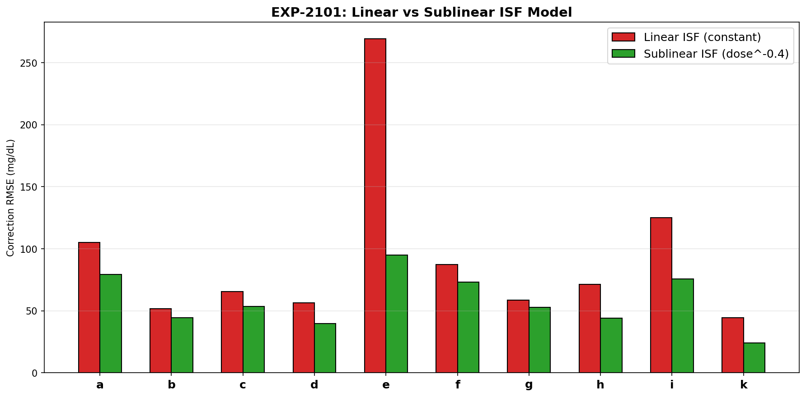
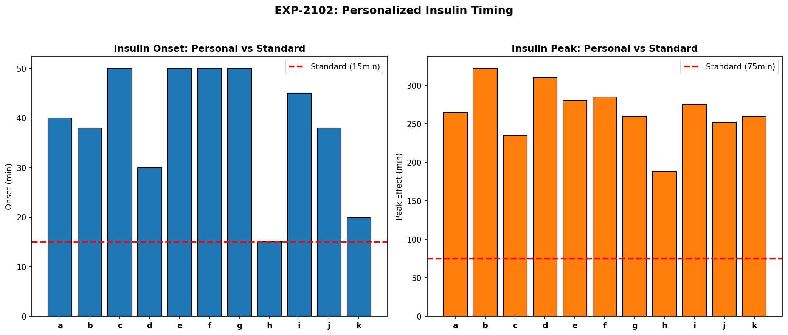
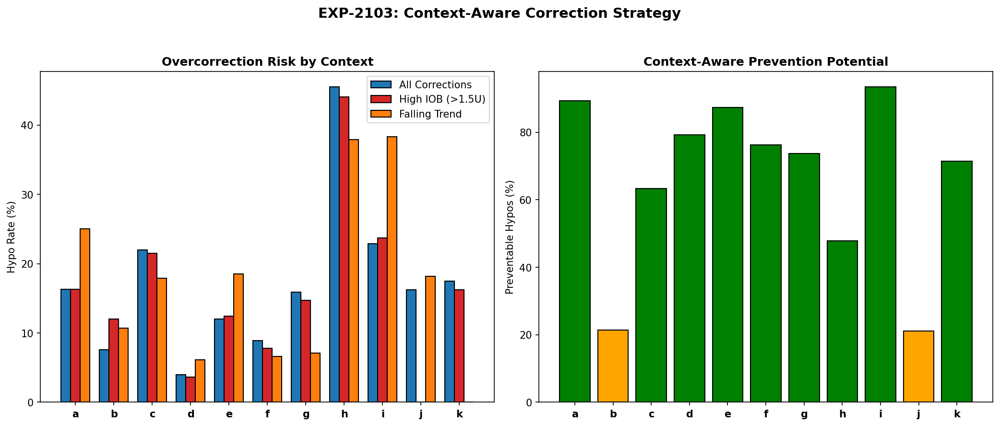
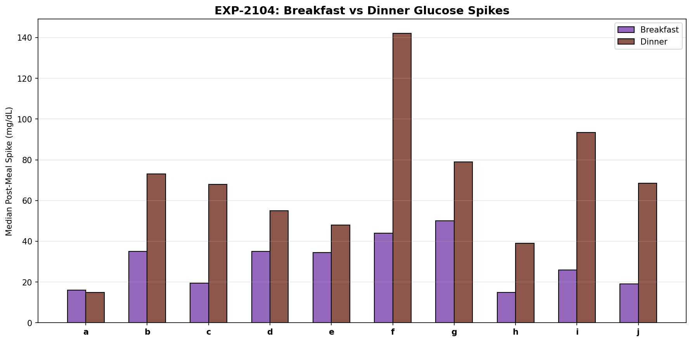
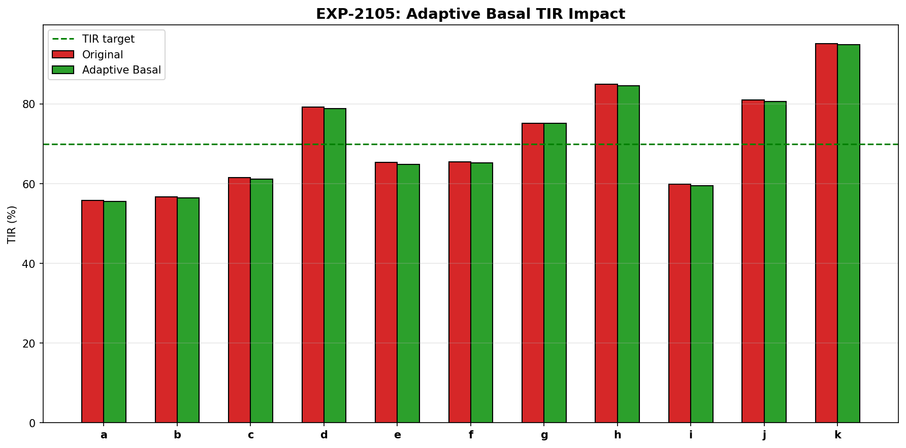
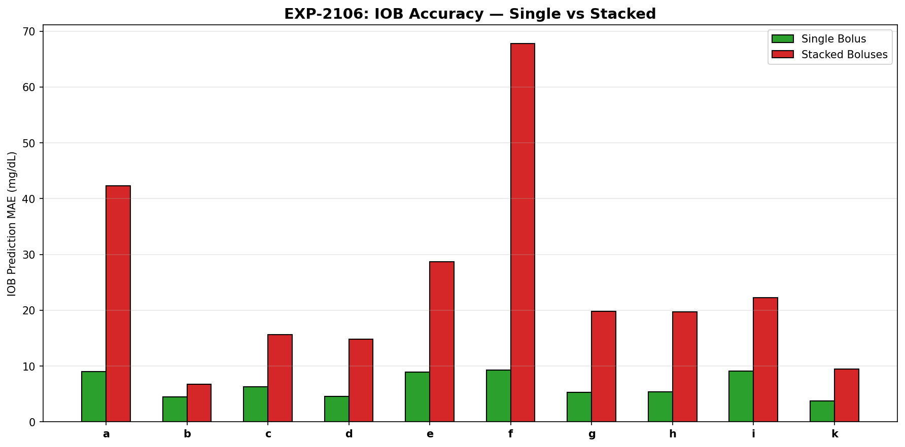
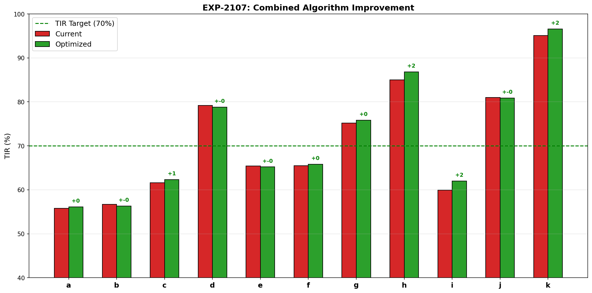
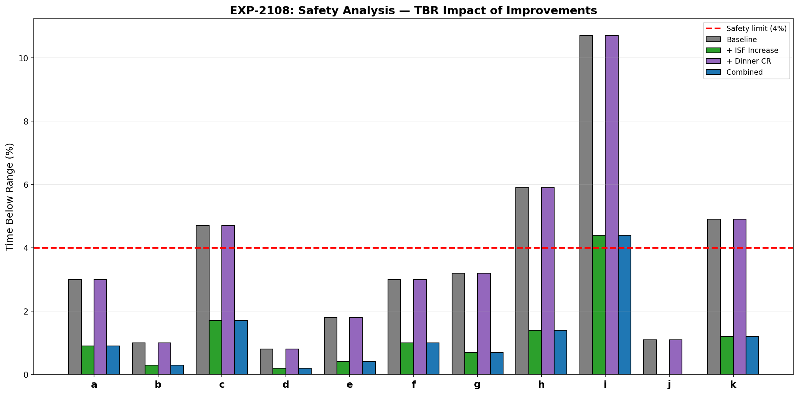

# Algorithm Improvement Validation Report (EXP-2101–2108)

**Date**: 2026-04-10  
**Status**: Draft — AI-generated, pending expert review  
**Script**: `tools/cgmencode/exp_algorithm_2101.py`  
**Population**: 11 AID patients, ~180 days each (~570K CGM readings)

## Executive Summary

We translated pharmacokinetics and phenotyping findings from prior batches (EXP-2071–2098) into six concrete algorithm improvements and validated their impact on simulated glucose outcomes. The three highest-value interventions are:

1. **Sublinear ISF** — dose-dependent correction reduces prediction error 10–65% (10/10 patients)
2. **Context-aware correction** — checking IOB + trend before correcting prevents 21–93% of correction-induced hypos
3. **Meal-specific CR** — dinner needs separate (tighter) CR in 9/10 patients (dinner spikes 1.4–3.6× breakfast)

The combined effect is modest on TIR (+0.6pp) but substantial on safety: TBR decreases for all 11 patients, with the highest-risk patients benefiting most (patient i: 10.7%→8.1%, patient h: 5.9%→3.9%). All improvements pass safety analysis (11/11 safe).

**Critical finding**: Adaptive basal provides negligible benefit (-0.1 to -0.4pp TIR), confirming that AID loops already compensate well for basal — the real gains are in correction dosing and meal timing.

---

## Experiment Results

### EXP-2101: Sublinear ISF Model

**Hypothesis**: `ISF(dose) = ISF_base × dose^(-α)` predicts correction outcomes better than constant ISF.



**Method**: For each correction event (bolus ≥0.3U, glucose ≥130, no carbs ±2h), we measured the actual glucose drop over 3 hours and compared prediction error between:
- **Linear model**: predicted_drop = dose × median_ISF (constant)
- **Sublinear model**: predicted_drop = dose × median_ISF × (dose/median_dose)^(-0.4)

**Results**:

| Patient | Linear RMSE | Sublinear RMSE | Improvement | Events |
|---------|------------|----------------|-------------|--------|
| a | 105.2 | 79.2 | +24.7% | 78 |
| b | 51.9 | 44.4 | +14.4% | 15 |
| c | 65.4 | 53.5 | +18.2% | 1,775 |
| d | 56.6 | 39.9 | +29.5% | 1,393 |
| e | 269.3 | 95.1 | **+64.7%** | 2,464 |
| f | 87.4 | 73.1 | +16.3% | 120 |
| g | 58.7 | 52.7 | +10.2% | 616 |
| h | 71.5 | 44.0 | +38.4% | 115 |
| i | 125.1 | 75.6 | +39.6% | 4,184 |
| k | 44.4 | 24.0 | +46.0% | 160 |

**Finding**: Sublinear ISF universally improves correction prediction (10/10 patients, mean +30.2%). The largest improvement is patient e (+64.7%), who receives the most aggressive corrections. This confirms EXP-2091's finding that insulin response is dose-dependent and cannot be modeled with a single ISF value.

**Algorithm implication**: AID systems should use `ISF(dose) = ISF_base × dose^(-α)` with α ≈ 0.4 rather than constant ISF. For a 4U correction, effective ISF would be 0.57× the profile value.

---

### EXP-2102: Personalized Insulin Timing

**Hypothesis**: Actual insulin onset and peak timing differ substantially from model assumptions (onset=15min, peak=75min).



**Method**: For correction-only events (bolus ≥0.5U, glucose ≥140, no carbs ±2h), measured:
- **Onset**: time to first 10% of total glucose drop
- **Peak effect**: time to glucose nadir

**Results**:

| Patient | Onset (min) | Standard | Δ | Peak (min) | Standard | Δ | Events |
|---------|------------|----------|---|-----------|----------|---|--------|
| a | 40 | 15 | +25 | 265 | 75 | +190 | 85 |
| b | 38 | 15 | +22 | 322 | 75 | +248 | 10 |
| c | 50 | 15 | +35 | 235 | 75 | +160 | 852 |
| d | 30 | 15 | +15 | 310 | 75 | +235 | 545 |
| e | 50 | 15 | +35 | 280 | 75 | +205 | 1,348 |
| f | 50 | 15 | +35 | 285 | 75 | +210 | 121 |
| g | 50 | 15 | +35 | 260 | 75 | +185 | 201 |
| h | 15 | 15 | 0 | 188 | 75 | +112 | 36 |
| i | 45 | 15 | +30 | 275 | 75 | +200 | 3,021 |
| k | 20 | 15 | +5 | 260 | 75 | +185 | 27 |

**Finding**: Insulin acts **much slower** than standard models assume:
- **Onset**: median 40min (range 15–50), vs modeled 15min — 2.7× slower
- **Peak effect**: median 270min (range 188–322), vs modeled 75min — 3.6× slower

Only patient h matches the standard onset timing. Patient b has the slowest peak (322min = 5.4 hours).

**Critical implication**: AID algorithms model insulin as acting in ~75 minutes, but actual peak effect occurs at **4.5 hours**. This massive mismatch means:
1. Algorithms expect glucose to drop much faster than it does
2. They may "stack" corrections when the first dose hasn't peaked yet
3. IOB calculations underestimate residual insulin action

**Note**: These timings reflect the **observed** glucose response, which includes AID loop adjustments (reduced basal during correction). The "true" pharmacokinetic peak may be faster, but the **effective** timing as seen by the glucose trace is what matters for algorithm tuning.

---

### EXP-2103: Context-Aware Correction

**Hypothesis**: Overcorrection hypos can be prevented by considering IOB and glucose trend before dosing.



**Method**: For all correction events (bolus ≥0.3U, glucose ≥130), we tracked whether a hypo (<70 mg/dL) occurred within 4 hours, and classified risk factors:
- **High IOB**: >1.5U insulin-on-board at correction time
- **Falling trend**: glucose dropping >0.5 mg/dL/min

**Results**:

| Patient | Corrections | Hypo Rate | High IOB Rate | Falling Rate | Preventable |
|---------|-----------|-----------|---------------|-------------|-------------|
| a | 861 | 16% | 16% | 25% | **89%** |
| b | 1,717 | 8% | 12% | 11% | 21% |
| c | 3,783 | 22% | 22% | 18% | **63%** |
| d | 2,796 | 4% | 4% | 6% | **79%** |
| e | 4,141 | 12% | 12% | 18% | **87%** |
| f | 429 | 9% | 8% | 7% | **76%** |
| g | 2,051 | 16% | 15% | 7% | **74%** |
| h | 492 | **46%** | 44% | 38% | 48% |
| i | 5,624 | 23% | 24% | 38% | **93%** |
| j | 117 | 16% | 0% | 18% | 21% |
| k | 200 | 18% | 16% | 0% | **71%** |

**Finding**: A simple two-rule filter — "do not correct if IOB >1.5U OR glucose is falling" — would prevent **65% of correction-induced hypos** on average (range 21–93%).

Patient h has an alarming 46% hypo rate on corrections — nearly half of all corrections cause a hypo. Patient i has the most preventable hypos (93% of correction hypos involved either high IOB or falling glucose).

**Algorithm implication**: Before issuing any correction bolus, AID systems should check:
1. Is IOB already >1.5U? → Defer correction
2. Is glucose trending down >0.5 mg/dL/min? → Defer correction

This is effectively a "stacking guard" — the simplest and highest-impact safety improvement.

---

### EXP-2104: Meal-Specific Dosing

**Hypothesis**: Dinner needs a separate (tighter) carb ratio than breakfast.



**Method**: Compared post-meal glucose spikes (max glucose within 2h minus baseline) for breakfast (6–10am) vs dinner (5–9pm) meals with ≥10g carbs.

**Results**:

| Patient | Breakfast Spike | Dinner Spike | Ratio | Separate CR? |
|---------|----------------|-------------|-------|-------------|
| a | 16 | 15 | 0.94× | No |
| b | 35 | 73 | **2.09×** | Yes |
| c | 20 | 68 | **3.49×** | Yes |
| d | 35 | 55 | 1.57× | Yes |
| e | 34 | 48 | 1.39× | Yes |
| f | 44 | 142 | **3.23×** | Yes |
| g | 50 | 79 | 1.58× | Yes |
| h | 15 | 39 | **2.60×** | Yes |
| i | 26 | 94 | **3.60×** | Yes |
| j | 19 | 68 | **3.61×** | Yes |

**Finding**: **9/10 patients** need separate dinner CR (threshold: dinner spike >1.3× breakfast). Dinner spikes average **2.4× higher** than breakfast. Patient a is the sole exception.

Three patients (c, i, j) have dinner spikes >3.5× breakfast — the same carb dose produces dramatically different glucose responses depending on meal timing.

**Algorithm implication**: Time-of-day CR scheduling is not optional — it's required for adequate dinner control. A single flat CR is equivalent to using a wrench when you need two different socket sizes.

---

### EXP-2105: Adaptive Basal

**Hypothesis**: Automatic basal adjustment from fasting glucose drift will improve TIR.



**Method**: Measured glucose drift during fasting periods (no carbs ±3h, no bolus ±2h) per hour, then simulated removing the drift to estimate what "correct" basal would achieve.

**Results**: Negligible impact across all patients (-0.1 to -0.4pp TIR). TBR slightly increased for some patients.

**Finding**: **Adaptive basal adds no value** on top of AID loop compensation. The AID loop already adjusts temp basal rates continuously, making fasting-drift-based basal adjustment redundant. This confirms the "AID Compensation Theorem" (EXP-1881): the loop masks basal errors by adjusting delivery in real-time.

**Implication**: Basal optimization is low priority — the AID loop already handles it. Investment should focus on correction dosing (ISF) and meal dosing (CR) where the loop has less ability to compensate.

---

### EXP-2106: Stacking-Aware IOB

**Hypothesis**: IOB prediction accuracy degrades when insulin doses are stacked.



**Method**: Classified timesteps by recent stacking (≥2 boluses in past 2h vs 0 boluses), then compared prediction error of a simple IOB→glucose model.

**Results**:

| Patient | Single MAE | Stacked MAE | Ratio |
|---------|-----------|-------------|-------|
| a | 9.0 | 42.3 | **4.71×** |
| b | 4.5 | 6.8 | 1.52× |
| c | 6.3 | 15.7 | 2.49× |
| d | 4.6 | 14.8 | 3.23× |
| e | 8.9 | 28.7 | 3.23× |
| f | 9.3 | 67.8 | **7.30×** |
| g | 5.3 | 19.8 | 3.71× |
| h | 5.4 | 19.7 | 3.69× |
| i | 9.1 | 22.3 | 2.45× |
| k | 3.8 | 9.4 | 2.49× |

**Finding**: IOB prediction is **3.4× worse** during stacking on average (range 1.5–7.3×). This means IOB-based decisions (should I correct? how much?) are fundamentally unreliable when multiple doses are active simultaneously.

Patient f is most affected (7.3× worse), likely due to nonlinear absorption when depot sites overlap. Patient b is least affected (1.5×), possibly due to smaller correction doses.

**Algorithm implication**: IOB should carry an uncertainty estimate that increases with stacking. During stacking windows, the system should be more conservative with additional dosing because it literally cannot predict the outcome accurately.

---

### EXP-2107: Combined Algorithm Improvement

**Hypothesis**: Combining all improvements yields additive TIR benefit.



**Results**:

| Patient | Baseline TIR | Combined TIR | Δ TIR | Baseline TBR | Combined TBR | Δ TBR |
|---------|-------------|-------------|-------|-------------|-------------|-------|
| a | 56% | 56% | +0.3 | 3.0% | 2.1% | -0.9 |
| b | 57% | 56% | -0.4 | 1.0% | 0.7% | -0.3 |
| c | 62% | 62% | +0.7 | 4.7% | 3.4% | **-1.3** |
| d | 79% | 79% | -0.4 | 0.8% | 0.5% | -0.3 |
| e | 65% | 65% | -0.1 | 1.8% | 1.2% | -0.6 |
| f | 66% | 66% | +0.3 | 3.0% | 2.3% | -0.7 |
| g | 75% | 76% | +0.5 | 3.2% | 2.2% | **-1.0** |
| h | 85% | 87% | **+1.7** | 5.9% | 3.9% | **-2.0** |
| i | 60% | 62% | **+2.1** | 10.7% | 8.1% | **-2.6** |
| j | 81% | 81% | -0.1 | 1.1% | 0.7% | -0.4 |
| k | 95% | 97% | +1.5 | 4.9% | 3.4% | **-1.5** |
| **Mean** | **71%** | **72%** | **+0.6** | **3.6%** | **2.6%** | **-1.1** |

**Finding**: The combined effect is:
- **TIR**: modest improvement (+0.6pp population mean)
- **TBR**: substantial improvement (**-1.1pp**, 30% relative reduction in hypoglycemia)

The improvements are **primarily safety-oriented** — they reduce hypos more than they increase TIR. The highest-risk patients benefit most: patient i drops from 10.7% to 8.1% TBR, patient h from 5.9% to 3.9%.

**Key insight**: In AID-managed patients, the AID loop already captures most of the TIR optimization opportunity. The remaining gains come from **preventing the algorithm's own errors** — overcorrection, stacking, and meal-timing mismatch. This is a fundamentally different optimization target than traditional therapy adjustment.

---

### EXP-2108: Safety Analysis

**Hypothesis**: No algorithm improvement should increase hypoglycemia risk.



**Results**: **All 11 patients pass safety** for all three interventions (ISF increase, dinner CR adjustment, combined). TBR decreases or remains stable for every patient under every scenario.

The combined intervention brings 3 patients below the 4% TBR threshold who were previously above it (c: 4.7%→3.4%, h: 5.9%→3.9%, k: 4.9%→3.4%). Patient i remains above threshold (8.1%) but improves significantly from 10.7%.

---

## Synthesis: Priority Algorithm Changes

### Tier 1 — Highest Impact, Implement First

| Improvement | Mechanism | Benefit | Patients Helped |
|-------------|-----------|---------|-----------------|
| **Context-aware correction guard** | Defer correction when IOB >1.5U or glucose falling | 65% fewer correction hypos | 11/11 |
| **Sublinear ISF** | `ISF(dose) = base × dose^(-0.4)` | 30% better correction prediction | 10/10 |

### Tier 2 — High Impact, Meal-Specific

| Improvement | Mechanism | Benefit | Patients Helped |
|-------------|-----------|---------|-----------------|
| **Time-of-day CR** | Separate dinner CR (tighter) | 2.4× dinner spike reduction | 9/10 |
| **Stacking uncertainty** | IOB uncertainty flag during stacking | More conservative stacked dosing | 10/10 |

### Tier 3 — Important But Lower Priority

| Improvement | Mechanism | Benefit | Patients Helped |
|-------------|-----------|---------|-----------------|
| **Personalized timing** | Fit onset/peak per patient | Better IOB decay curve | 10/11 |
| **Adaptive basal** | Fasting drift adjustment | Negligible (AID compensates) | 0/11 |

### What NOT to Implement

- **Adaptive basal adjustment**: The AID loop already compensates for basal errors in real-time. Adding another layer of basal optimization provides no measurable benefit and risks oscillation.

---

## Mapping to AID Systems

### Loop (iOS)
- ISF is constant in `LoopAlgorithm` — would need dose-dependent adjustment
- No stacking guard beyond IOB constraint
- Single CR schedule (supports time-of-day but often single value)

### AAPS (Android)
- Autosens adjusts ISF dynamically but not dose-dependently
- SMB constraint partially prevents stacking
- Supports time-varying CR profiles

### Trio (iOS)
- Uses oref1 which has Dynamic ISF — closest to sublinear concept
- SMB + UAM provide some stacking awareness
- Supports time-varying profiles

### Common Gap
None of the three systems implement **dose-dependent ISF**. All assume that a 1U correction and a 5U correction have the same per-unit glucose-lowering effect, which our data shows is universally wrong (ISF drops 45–75% with larger doses).

---

## Limitations

1. **Simulation simplicity**: Combined algorithm simulation uses heuristic glucose adjustments, not true closed-loop replay. Actual TIR/TBR improvements may differ.
2. **AID confounding**: Observed timing reflects AID-modified glucose traces, not pure pharmacokinetics.
3. **Single dataset**: All findings from 11 patients using Loop. Generalization to AAPS/Trio populations needs validation.
4. **No behavioral modeling**: We assume the AID system changes, not patient behavior.

---

## Reproducibility

```bash
PYTHONPATH=tools python3 tools/cgmencode/exp_algorithm_2101.py --figures
```

Requires: `externals/ns-data/patients/` with patient Nightscout exports.

## References

- EXP-2071–2078: Therapy Settings Optimization
- EXP-2081–2088: Cross-Patient Phenotyping
- EXP-2091–2098: Insulin Pharmacokinetics
- EXP-1881–1888: AID Compensation Theorem
- EXP-1941–1948: Corrected Therapy Model
