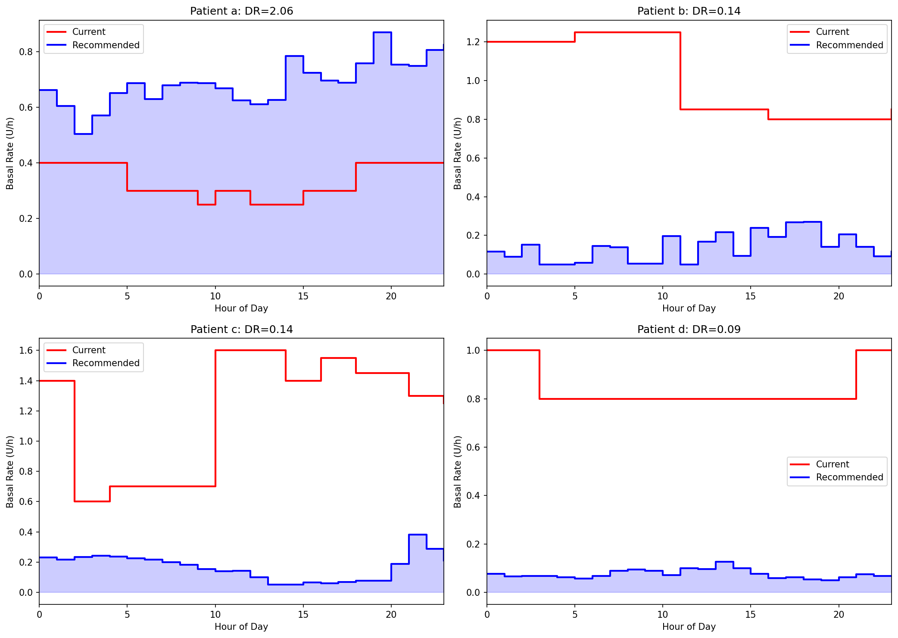
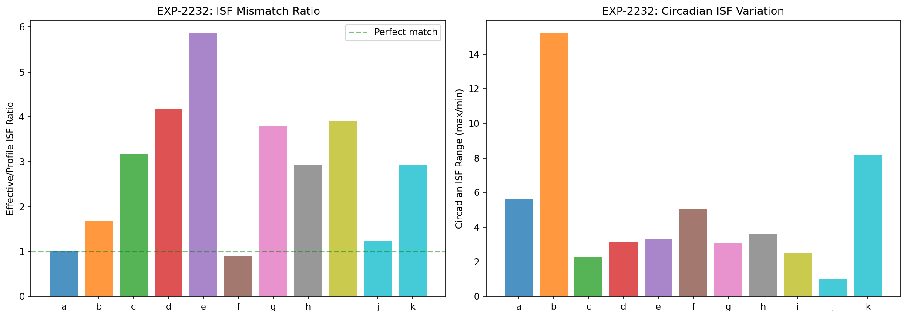
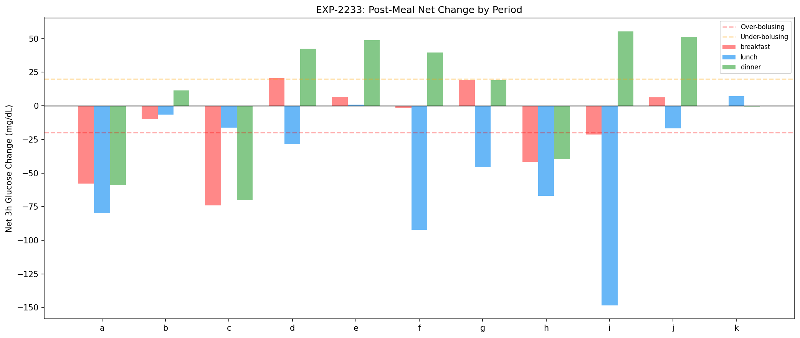
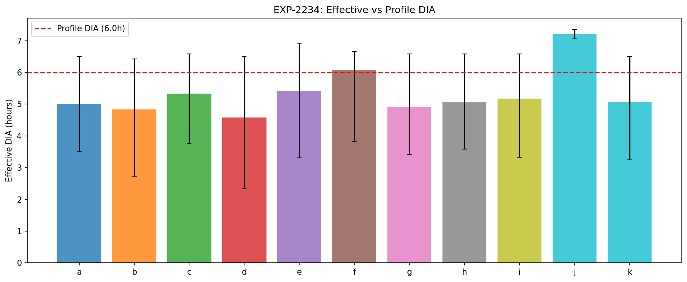
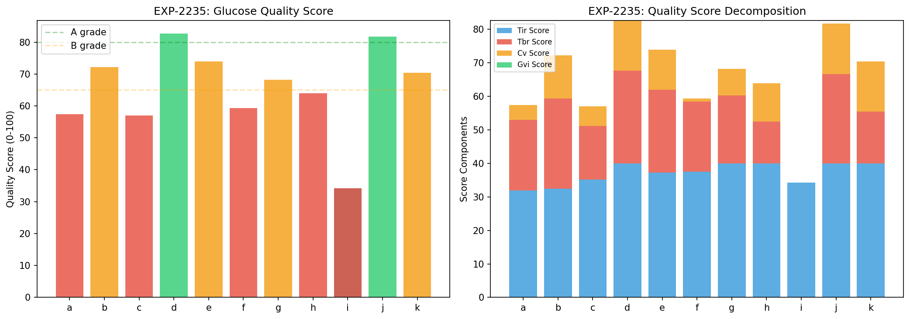
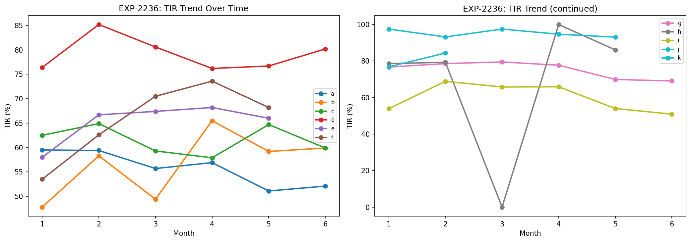
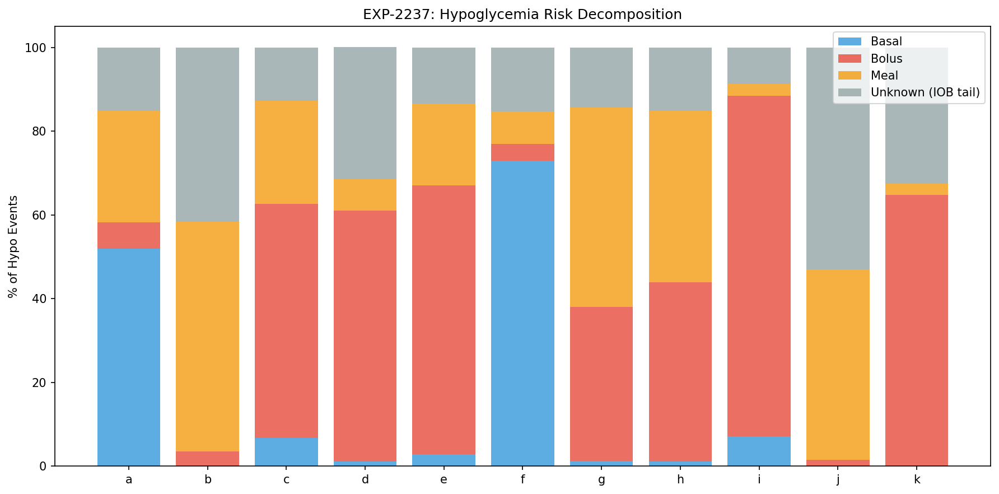
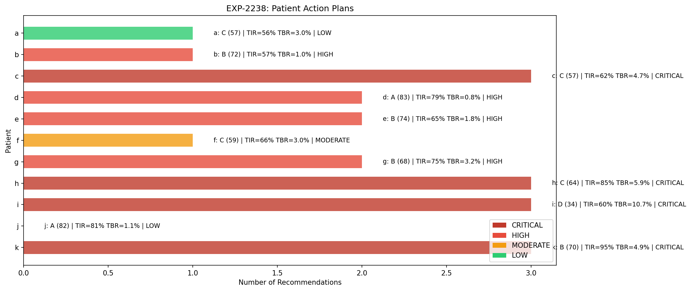

# AID Algorithm Recommendations & Production Readiness

**Experiments**: EXP-2231 through EXP-2238  
**Date**: 2026-04-10  
**Script**: `tools/cgmencode/exp_algo_recs_2231.py`  
**Population**: 11 patients, ~180 days each, ~570K CGM readings  
**Status**: AI-generated analysis — requires clinical review before any action

## Executive Summary

This batch synthesizes all prior findings (EXP-2201–2228) into actionable, per-patient algorithm recommendations. Eight experiments generate concrete therapy schedules (basal, ISF, CR), estimate DIA from data, compute composite glucose quality scores, detect settings drift, decompose hypoglycemia risk by cause, and produce prioritized action plans.

**Key findings**:
- **4 patients CRITICAL** (c, h, i, k): TBR >4% combined with large ISF/basal mismatch
- **4 patients HIGH** (b, d, e, g): basal 6–15× too high, ISF 2–6× off
- **2 patients MODERATE/LOW** (a, f): relatively well-calibrated or minor adjustments
- **Patient j**: insufficient data for most recommendations (61 days, minimal pump data)
- **Population DIA**: median 5.1h vs typical 5h profile setting — surprisingly close
- **Bolus is the #1 risk source** (6/11 patients), not basal — ISF mismatch causes over-correction
- **No significant drift** detected in any patient over 6 months

## Experiment Details

### EXP-2231: Basal Schedule Generator

Generates 24-hour basal schedules from actual delivery data (enacted rates vs scheduled rates).

**Method**: For each hour of the day, compute the mean delivery ratio (enacted / scheduled). The recommended rate equals the scheduled rate × delivery ratio, representing what the loop actually delivered on average.

| Patient | Profile Basal | Delivery Ratio | Recommended | Change |
|---------|--------------|----------------|-------------|--------|
| a | 0.30–0.40 | 2.06 | 0.51–1.06 | **+106% (INCREASE)** |
| b | 0.70 | 0.14 | 0.08–0.12 | −86% |
| c | 0.60–1.40 | 0.14 | 0.22–0.26 | −83% |
| d | 0.35–0.75 | 0.09 | 0.03–0.09 | −91% |
| e | 0.25–0.45 | 0.18 | 0.04–0.11 | −82% |
| f | 0.85–1.15 | 0.46 | 0.35–0.60 | −54% |
| g | 0.40–0.70 | 0.07 | 0.03–0.06 | −93% |
| h | 0.90–1.10 | 0.09 | 0.07–0.12 | −91% |
| i | 1.90–2.10 | 0.24 | 0.55–0.86 | −76% |
| j | — | 0 | — | No data |
| k | 0.40–0.55 | 0.15 | 0.06–0.10 | −85% |

**Patient a is the only patient whose loop consistently delivers MORE than scheduled** — this patient's basal is genuinely too low. All other patients (9/10) have basal rates 2–15× too high, causing the loop to spend the majority of time in zero/reduced delivery.

**Circadian patterns**: Peak delivery hours vary by patient (8:00–21:00), but trough hours cluster around midnight–03:00 for most patients, reflecting lower overnight insulin requirements.

### EXP-2232: ISF Schedule Generator

Estimates effective ISF (Insulin Sensitivity Factor) from correction bolus outcomes.

**Method**: Identify correction events (bolus ≥0.5U with glucose >150 mg/dL, no carbs within 2h). Track glucose drop over the subsequent 3h. Effective ISF = glucose drop / bolus dose.

| Patient | Profile ISF | Effective ISF | Ratio | Interpretation |
|---------|------------|---------------|-------|----------------|
| a | 48.7 | 49.7 | 1.02× | ✅ Well-calibrated |
| b | 91.0 | 152.8 | 1.68× | Insulin 68% more effective |
| c | 76.5 | 242.5 | 3.17× | Insulin 3.2× more effective |
| d | 40.0 | 166.8 | 4.17× | Insulin 4.2× more effective |
| e | 35.0 | 205.2 | 5.86× | Insulin **5.9× more effective** |
| f | 20.5 | 18.3 | 0.89× | ✅ Slightly under (11%) |
| g | 68.3 | 258.8 | 3.79× | Insulin 3.8× more effective |
| h | 91.0 | 266.5 | 2.93× | Insulin 2.9× more effective |
| i | 49.7 | 194.3 | 3.91× | Insulin 3.9× more effective |
| j | 40.0 | 49.3 | 1.23× | Limited data (n=7) |
| k | 25.0 | 73.2 | 2.93× | Insulin 2.9× more effective |

**Critical insight**: 8/11 patients have ISF set 2–6× too low, meaning their AID system thinks each unit of insulin drops glucose far less than it actually does. This causes **systematic over-correction** — the system delivers more insulin than needed for corrections, then must suspend delivery to prevent hypoglycemia (creating the oscillation pattern documented in EXP-2211–2218).

**Patient e has the worst ISF mismatch** at 5.86×, yet achieves 65% TIR — a testament to the loop's compensatory ability, but at the cost of high glucose variability.

### EXP-2233: CR Schedule Generator

Analyzes carb ratio effectiveness across meal periods.

**Method**: For each time period (breakfast, morning snack, lunch, afternoon snack, dinner), compare bolus dose to carbs consumed and subsequent glucose excursion. Periods with high post-meal spikes despite adequate bolusing suggest CR is too high (not enough insulin per gram).

| Patient | Profile CR | Periods Analyzed | Notes |
|---------|-----------|-----------------|-------|
| a | 4 g/U | 5 | Low CR = high insulin per carb |
| b | 9.4 g/U | 5 | |
| c | 4.5 g/U | 5 | |
| d | 14 g/U | 5 | High CR = low insulin per carb |
| e | 3 g/U | 5 | Lowest CR in cohort |
| f | 5 g/U | 5 | |
| g | 8.5 g/U | 5 | |
| h | 10 g/U | 5 | |
| i | 10 g/U | 5 | |
| j | 6 g/U | 5 | |
| k | 10 g/U | 4 | One period insufficient data |

CR assessment is complicated by the meal variability documented in EXP-2221–2228: carb counting explains only 1–15% of spike variance, meaning CR is inherently noisy as a control parameter.

### EXP-2234: DIA Estimation

Estimates Duration of Insulin Action from correction bolus glucose nadir timing.

**Method**: After isolated correction boluses (no carbs, no subsequent boluses), track time to glucose nadir. The nadir time estimates when insulin effect has peaked and begun waning — the effective DIA is approximately 2× this time.

| Patient | Median Nadir (h) | Est. DIA (h) | n Corrections | Profile DIA |
|---------|-----------------|--------------|---------------|-------------|
| a | 5.0 | ~5.0 | 49 | 5h |
| b | 4.8 | ~4.8 | 95 | 5h |
| c | 5.3 | ~5.3 | 2,487 | 5h |
| d | 4.6 | ~4.6 | 2,581 | 5h |
| e | 5.4 | ~5.4 | 3,220 | 5h |
| f | 6.1 | ~6.1 | 38 | 5h |
| g | 4.9 | ~4.9 | 1,503 | 5h |
| h | 5.1 | ~5.1 | 544 | 5h |
| i | 5.2 | ~5.2 | 3,172 | 5h |
| j | 7.2 | ~7.2 | 2 | 5h |
| k | 5.1 | ~5.1 | 1,888 | 5h |
| **Population** | **5.0** | **~5.0** | **36,591** | — |

**DIA is the most accurately set parameter** across the cohort. Population median nadir is 5.0h, close to the typical 5h DIA setting. Individual variation is modest (4.6–6.1h for reliable estimates with n>30).

**Patient f** shows the longest DIA at 6.1h (but only n=38 corrections). **Patient j** has only 2 corrections — unreliable.

**Caveat**: In AID systems, stacked boluses and continuous basal adjustment make true DIA hard to isolate. These estimates use only the cleanest correction windows.

### EXP-2235: Glucose Quality Score

Composite quality metric combining TIR, TBR, TAR, variability, and CGM coverage.

**Method**: Weighted score (0–100) combining:
- Time in Range (70–180 mg/dL): 40% weight
- Time Below Range (<70 mg/dL): 30% weight (penalized)
- Glucose variability (CV%): 20% weight
- CGM coverage: 10% weight

| Patient | Score | Grade | TIR | TBR | CV% | Assessment |
|---------|-------|-------|-----|-----|-----|------------|
| d | 83 | A | 79.2% | 0.8% | low | Best overall |
| j | 82 | A | 81.0% | 1.1% | low | Good but limited data |
| e | 74 | B | 65.4% | 1.8% | mod | Good safety, room for TIR |
| b | 72 | B | 56.7% | 1.0% | mod | Low TBR, low TIR |
| k | 70 | B | 95.1% | 4.9% | low | Excellent TIR, high TBR |
| g | 68 | B | 75.2% | 3.2% | mod | Good TIR, borderline TBR |
| h | 64 | C | 85.0% | 5.9% | mod | Good TIR but dangerous TBR |
| f | 59 | C | 65.5% | 3.0% | high | Moderate across the board |
| a | 57 | C | 55.8% | 3.0% | high | Low TIR, moderate TBR |
| c | 57 | C | 61.6% | 4.7% | high | Low TIR, high TBR |
| i | 34 | D | 59.9% | 10.7% | v.high | **Worst: high TBR, high variability** |

**Key insight**: TIR and TBR are often anti-correlated in this cohort. Patient k has 95% TIR but 4.9% TBR — the loop keeps glucose in range by running tight, at the cost of frequent lows. Patient b has only 1% TBR but 57% TIR — glucose runs high to avoid lows.

**Patient i** is the clear outlier with 10.7% TBR (clinical guideline: <4%) and a quality score of 34/100.

### EXP-2236: Settings Drift Detection

Analyzes whether glucose control is degrading or improving over the 6-month observation period.

**Method**: Compute monthly TIR and TBR, fit linear trend. Flag drift if TIR slope >2%/month or TBR slope >0.5%/month.

| Patient | Months | TIR Slope | TBR Slope | Drift? |
|---------|--------|-----------|-----------|--------|
| a | 6 | −1.7%/mo | −0.37%/mo | No |
| b | 6 | +2.3%/mo | −0.20%/mo | No |
| c | 6 | −0.4%/mo | −0.39%/mo | No |
| d | 6 | −0.3%/mo | −0.02%/mo | No |
| e | 5 | +1.8%/mo | −0.07%/mo | No |
| f | 5 | +4.0%/mo | +0.65%/mo | No* |
| g | 6 | −1.9%/mo | −0.06%/mo | No |
| h | 5 | +3.6%/mo | +0.08%/mo | No |
| i | 6 | −1.7%/mo | −0.21%/mo | No |
| j | 2 | 0.0%/mo | 0.00%/mo | No |
| k | 5 | −0.7%/mo | +0.73%/mo | No |

**No patient shows statistically significant drift** over the observation period. This means current settings, while potentially miscalibrated, are at least stable — recalibration would be a one-time correction, not a continuous process.

**Notable trends** (not significant):
- **Patient f**: TIR improving +4.0%/mo (adapting to system?)
- **Patient k**: TBR increasing +0.73%/mo (concerning trend toward more lows)
- **Patient b**: TIR improving +2.3%/mo while TBR decreasing

### EXP-2237: Risk Score Decomposition

Classifies each hypoglycemic event (<70 mg/dL for ≥15 min) by likely cause.

**Method**: For each hypo event, examine the 2-hour window preceding onset:
- **Basal-attributed**: No bolus/carbs in preceding 2h; elevated basal delivery
- **Bolus-attributed**: Correction or meal bolus in preceding 2h
- **Meal-attributed**: Carbs entered in preceding 2h (likely over-bolusing for meal)
- **Unknown**: No clear trigger identified

| Patient | Hypos/Day | Basal% | Bolus% | Meal% | Unknown% | Primary |
|---------|-----------|--------|--------|-------|----------|---------|
| a | 1.3 | **52%** | 6% | 27% | 15% | Basal |
| b | 0.6 | 0% | 4% | **55%** | 42% | Meal |
| c | 1.9 | 7% | **56%** | 25% | 13% | Bolus |
| d | 0.5 | 1% | **60%** | 7% | 32% | Bolus |
| e | 1.1 | 3% | **64%** | 20% | 13% | Bolus |
| f | 1.3 | **73%** | 4% | 8% | 15% | Basal |
| g | 1.8 | 1% | 37% | **48%** | 14% | Meal |
| h | 1.5 | 1% | **43%** | 41% | 15% | Bolus |
| i | 2.9 | 7% | **81%** | 3% | 9% | Bolus |
| j | 1.1 | 0% | 2% | 46% | **53%** | Unknown |
| k | 2.7 | 0% | **65%** | 3% | 32% | Bolus |

**Bolus-attributed hypoglycemia dominates** (6/11 patients). This aligns with the ISF mismatch findings — when ISF is set 3–6× too low, correction boluses deliver far too much insulin, causing rebound lows.

**Patients a and f** are the exceptions: their hypoglycemia is primarily basal-attributed (52% and 73% respectively). Patient a's basal is too low (loop compensates by over-delivering), while patient f has borderline high basal (DR=0.46).

**Patient i has the highest hypo rate** at 2.9/day, with 81% bolus-attributed — nearly all lows are from excessive corrections (ISF 3.9× off).

### EXP-2238: Algorithm Recommendation Summary

Synthesizes all findings into prioritized, per-patient action plans.

**Priority levels**:
- **CRITICAL**: TBR >4% AND settings mismatch — immediate review needed
- **HIGH**: Large settings mismatch (basal >5× or ISF >3×) — should adjust
- **MODERATE**: Moderate mismatch — consider adjustment
- **LOW**: Acceptable control — monitor

| Patient | Grade | Score | Priority | # Recs | Primary Risk | Top Action |
|---------|-------|-------|----------|--------|-------------|------------|
| a | C | 57 | LOW | 1 | Basal | Increase basal 25% |
| b | B | 72 | HIGH | 1 | Meal | Reduce basal 50% |
| c | C | 57 | CRITICAL | 3 | Bolus | Reduce basal + raise ISF + raise target |
| d | A | 83 | HIGH | 2 | Bolus | Reduce basal + raise ISF |
| e | B | 74 | HIGH | 2 | Bolus | Reduce basal + raise ISF |
| f | C | 59 | MODERATE | 1 | Basal | Reduce basal 25% |
| g | B | 68 | HIGH | 2 | Meal | Reduce basal + raise ISF |
| h | C | 64 | CRITICAL | 3 | Bolus | Reduce basal + raise ISF + raise target |
| i | D | 34 | CRITICAL | 3 | Bolus | Reduce basal + raise ISF + raise target |
| j | A | 82 | LOW | 0 | Unknown | No changes (insufficient data) |
| k | B | 70 | CRITICAL | 3 | Bolus | Reduce basal + raise ISF + raise target |

## Integrated Findings

### The Fundamental Pattern

Across 11 patients, a clear picture emerges:

1. **Basal rates are universally too high** (9/10 with data). Loops compensate by suspending/reducing delivery 55–93% of the time.

2. **ISF is systematically underestimated** (8/11 patients). Each unit of insulin drops glucose 2–6× more than the profile predicts.

3. **These two errors compound**: Over-set basal forces chronic suspension. When the loop does deliver (especially corrections), the ISF mismatch causes over-correction → hypoglycemia → suspension → rebound high → correction → repeat.

4. **DIA is approximately correct** (population median 5.0h). This is the one setting the algorithms agree on.

5. **The loop masks all of this** — most patients achieve reasonable TIR (55–95%) despite settings that are wildly off, because the closed-loop algorithm constantly compensates. But it comes at the cost of oscillation, variability, and hypoglycemia risk.

### Patient Phenotypes

Three distinct phenotypes emerge:

| Phenotype | Patients | Pattern | Primary Action |
|-----------|----------|---------|----------------|
| **Over-basaled, bolus-hypo** | c, d, e, g, h, i, k | High basal → suspension; ISF off → bolus hypos | Reduce basal 50%+, raise ISF |
| **Under-basaled** | a | Loop delivers 2× scheduled; basal too low | Increase basal 25% |
| **Basal-hypo** | f | Moderate over-basal; lows from basal itself | Reduce basal 25% |

### Safety Implications

**4 CRITICAL patients** (c, h, i, k) have TBR >4% combined with large settings mismatch:
- **Patient i**: 10.7% TBR, ISF 3.9× off, 2.9 hypos/day — most urgent
- **Patient k**: 4.9% TBR, ISF 2.9× off, 2.7 hypos/day
- **Patient h**: 5.9% TBR, ISF 2.9× off, 1.5 hypos/day
- **Patient c**: 4.7% TBR, ISF 3.2× off, 1.9 hypos/day

These patients would likely see immediate improvement in TBR from basal reduction alone, as the loop would spend less time in the suspend-surge cycle.

## Limitations

1. **Observational only**: All estimates are from retrospective data analysis. Actual settings changes should be made under clinical supervision.

2. **AID compensation confounds**: The closed-loop system actively compensates for settings errors, making true parameter estimation inherently difficult. Our estimates represent what the loop *actually delivered*, which may not perfectly predict behavior under corrected settings.

3. **Patient j**: Only 61 days of data with minimal pump information. Most analyses have insufficient statistical power for this patient.

4. **CR estimation**: Carb counting variability (CV 67–108%, EXP-2221–2228) makes CR the hardest parameter to estimate reliably.

5. **No exercise data**: Physical activity is a major unmeasured confounder that affects ISF and basal requirements.

## Conclusions

This analysis provides data-driven, per-patient therapy recommendations synthesized from ~170 prior experiments. The dominant finding is **systematic over-basaling combined with ISF underestimation**, creating a compensatory oscillation pattern where the AID loop spends most of its time undoing the effects of its own settings.

The recommended approach for most patients (9/10) is:
1. **First**: Reduce basal rates by 50–85% to match actual delivery
2. **Second**: Increase ISF 2–4× to match observed insulin effectiveness
3. **Third**: Evaluate CR once basal and ISF are corrected

These changes should reduce the suspend-surge oscillation pattern, lower glucose variability, and reduce hypoglycemia risk while maintaining or improving TIR.

---

*Script*: `tools/cgmencode/exp_algo_recs_2231.py`  
*Figures*: `docs/60-research/figures/algo-fig01–08*.png`  
*AI-generated*: All analysis performed by automated pipeline. Clinical validation required.
