# Controller-Aware Audition Matrix

**Date**: 2026-04-22
**Stream**: B (operational)
**Charter**: two-stream-methodology-charter-2026-04-22.md
**Sources**: EXP-2812 (recovery), EXP-2831 (wear), EXP-2843 (envelope coupling),
EXP-2844 (phenotype split), EXP-2845 (route hypothesis),
EXP-2845b (unified triage), EXP-2845c (time-of-day), EXP-2846 (SMB capability)

---

## Why this matrix exists

Across the EXP-2843 → EXP-2846 line we established that profile audition
recommendations cannot be expressed as a single rule per patient. The
operationally correct profile edit depends on **four factors**:

1. **Controller** (Loop / Trio / OpenAPS) — software design
2. **SMB capability** (enabled / disabled) — per-patient configuration
3. **Phenotype** (up_shift / flat / down_shift) — observed S1 response
4. **Time-of-day window** (overnight / dawn / midday / evening)

Same envelope demand → same total compensation (EXP-2845, p=0.82) →
opposite delivery routes → different schedule edits required.

This doc compiles the operational matrix.

---

## Layer 1: Controller × SMB capability is *configuration* not biology

EXP-2846 finding (28 patients):

| Controller | SMB-disabled | SMB-enabled |
|------------|-------------:|------------:|
| Loop       | 2 | 7 |
| OpenAPS    | 4 | 3 |
| Trio       | 0 | 12 |

SMB capability crosses controller lines. EXP-2845's "5/5 OpenAPS show
zero SMB share" was a cohort artifact (the 5 EXP-2843-significant
OpenAPS patients all had SMB disabled). Reality: capability is a
per-patient configuration choice, must be checked first.

---

## Layer 2: Route choice depends on (controller, SMB capability)

EXP-2845: Loop and Trio deliver **identical** total insulin
compensation in S1 (Δ=0.254 U/h both, p=0.82) but route oppositely.

| (controller, SMB capability) | S1 response route | What audition data shows |
|---|---|---|
| Loop, SMB-disabled | basal-up only | actual basal > scheduled basal in S1 |
| Loop, SMB-enabled | mixed (basal + auto-bolus) | both increase together |
| Trio, SMB-enabled (uniform) | basal-down + SMB | actual basal < scheduled in S1; SMB count rises |
| OpenAPS, SMB-disabled | basal-up only | same as Loop SMB-disabled |
| OpenAPS, SMB-enabled | route varies by tuning | check both basal and SMB |

**Implication**: if you are reading audition data from a
SMB-disabled patient, the *only* signal of demand is the basal gap.
For SMB-enabled patients, ignoring SMB count under-estimates demand.

---

## Layer 3: Phenotype × time-of-day localizes the schedule edit

EXP-2845c (median Δbasal % S1 − S0):

| Phenotype | Overnight | Dawn | Midday | Evening |
|-----------|---------:|-----:|-------:|--------:|
| down_shift | −9% | **−15%** | −13% | −5% |
| up_shift   | +6% | +7% | **+11%** | **+11%** |
| flat       | −2% | −3% | −1% | +2% |

---

## The audition matrix

For each (controller, SMB-capability, phenotype) cell, the recommended
schedule edit + investigation flag:

### Loop — SMB disabled

| Phenotype | Profile edit recommendation | Window priority |
|-----------|----------------------------|-----------------|
| up_shift  | **Raise scheduled basal**; controller has no other route | midday + evening first |
| flat      | Investigate: controller adapting basal but BG not improving — likely insulin-action issue (wear / ISF / site) | check site-age and ISF separately |
| down_shift | Rare; check for incorrectly high scheduled basal at specific hours | dawn first |

### Loop — SMB enabled

| Phenotype | Profile edit | Window priority |
|-----------|--------------|-----------------|
| up_shift  | Raise scheduled basal **and** verify auto-bolus thresholds are not too restrictive | midday + evening |
| flat      | Loosen automatic bolus settings; controller capable but constrained | (any) |
| down_shift | Lower scheduled basal | dawn |

### Trio — SMB enabled (the cohort-default case)

| Phenotype | Profile edit | Window priority |
|-----------|--------------|-----------------|
| down_shift (5/6 Trio) | **Lower scheduled basal**; controller already cutting routinely | dawn (-15%) and midday (-13%) |
| up_shift (1/6 Trio) | Raise scheduled basal here; SMB plus basal-up suggests under-basaled profile | midday + evening |
| flat | (n=0 Trio in cohort) | — |

### OpenAPS — SMB disabled

| Phenotype | Profile edit | Window priority |
|-----------|--------------|-----------------|
| up_shift  | Raise scheduled basal | midday + evening |
| flat      | Same as Loop-flat: insulin-action investigation (wear / site / ISF) | check site-age |
| down_shift | Lower scheduled basal | dawn |

### OpenAPS — SMB enabled

| Phenotype | Profile edit | Window priority |
|-----------|--------------|-----------------|
| up_shift  | Raise scheduled basal AND review oref0 SMB caps | midday + evening |
| down_shift | Lower scheduled basal | dawn |
| flat      | Both basal-cap and SMB-cap may be limiting compensation | (any) |

---

## Triage priority (combined with EXP-2812/2831 flags)

Highest-confidence intervention candidates (cross-tab from EXP-2845b):

| Patient | Controller | Phenotype | SMB | Triage flags | Recommendation |
|---------|------------|-----------|-----|:------------:|----------------|
| **b**   | Loop  | flat       | enabled | **3** (recovery + post_high + wear) | Site rotation + ISF re-audit. Highest priority. |
| ns-d444c120c23a | Trio | down_shift | enabled | 2 | Lower dawn basal; site change soon |
| ns-dde9e7c2e752 | Trio | up_shift   | enabled | 2 | Raise midday/evening basal; investigate wear-pos |
| ns-6bef17b4c1ec | Trio | down_shift | enabled | 1 (wear) | Site change |
| i               | Loop | up_shift   | enabled | 1 (wear) | Site change + raise basal |

---

## Open follow-ups

1. EXP-2843b: re-test envelope coupling at 24h windows (faster audition).
2. Back-fill EXP-2812 transition data for the 4 flat patients without
   transition coverage (looser n_trans criterion). [EXP-2848]
3. Stream A sensor-gap orthogonal test still open.
4. Wear-positive vs wear-negative deeper drilldown (cohort_site_age_heatmap).
5. The flat-low-recovery patients deserve explicit ISF re-audit
   (cross-cluster experiment to be designed). **DONE: EXP-2847.**

---

## Visualizations (Charter V8 — every research line gets a paired chart)

### Phenotype split (EXP-2844)

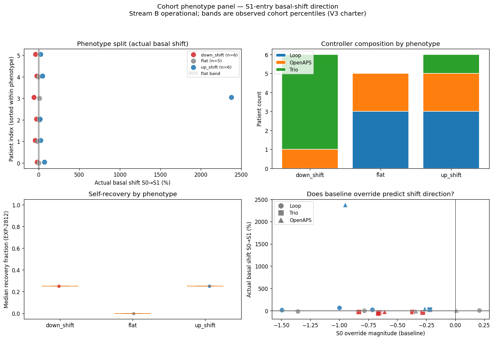
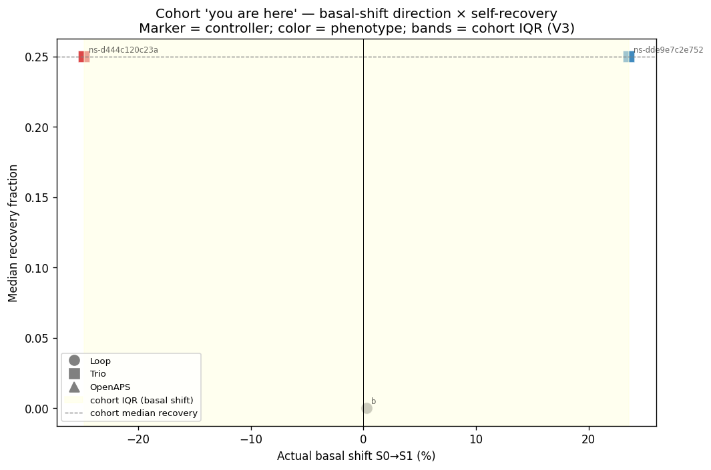
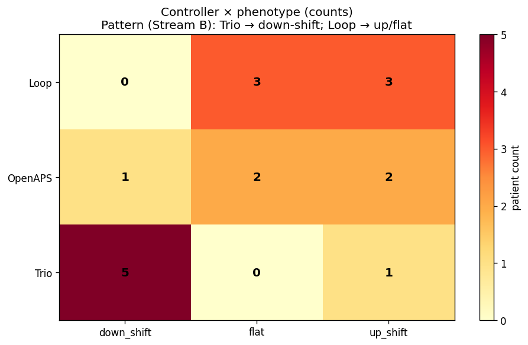

### Route hypothesis (EXP-2845)

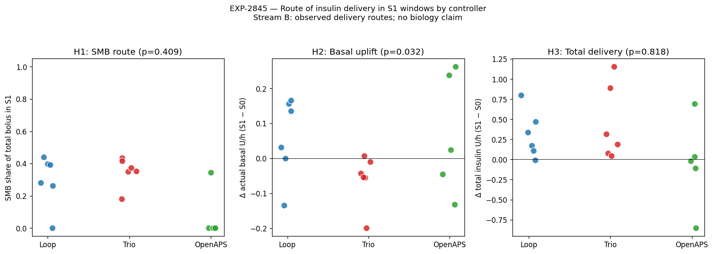
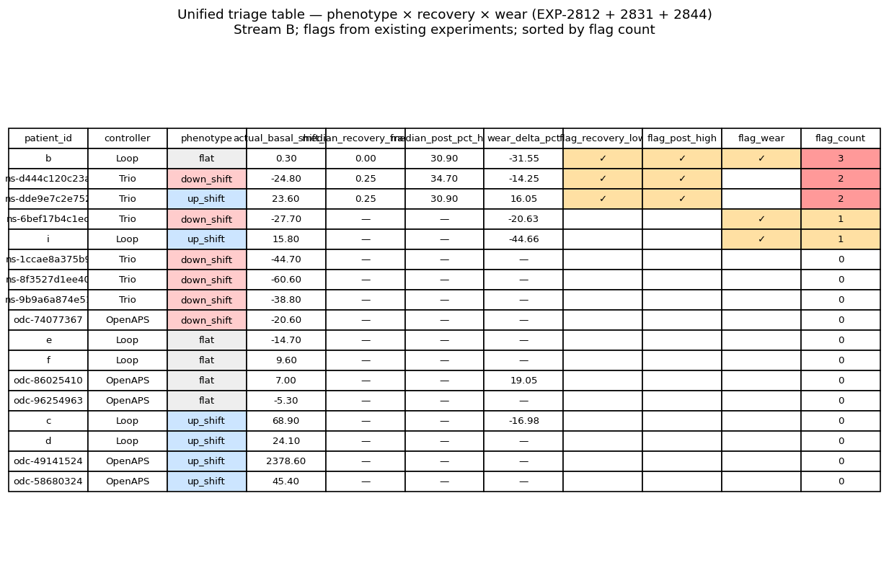

### Time-of-day localization (EXP-2845c)

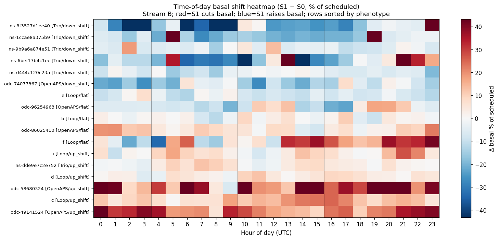
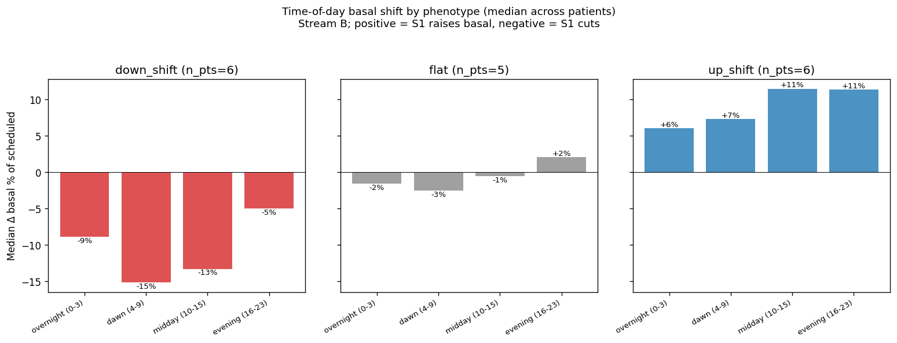

### SMB capability audit (EXP-2846)

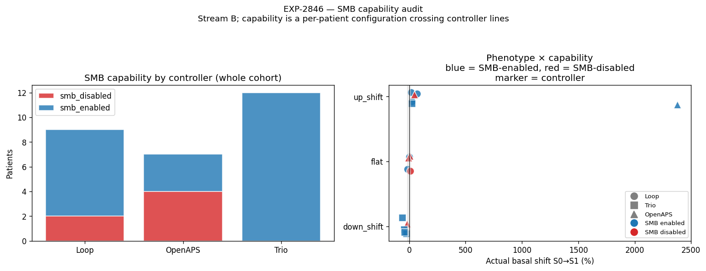

### Recovery-by-controller cohort (V7 cohort pairing)

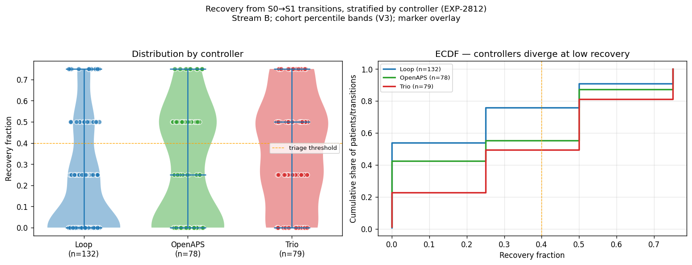

### Site-age heatmap (V7)

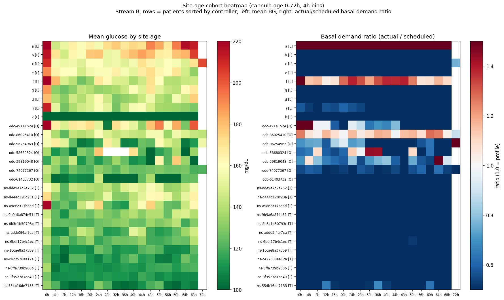

### Correction-ISF audition (EXP-2847)

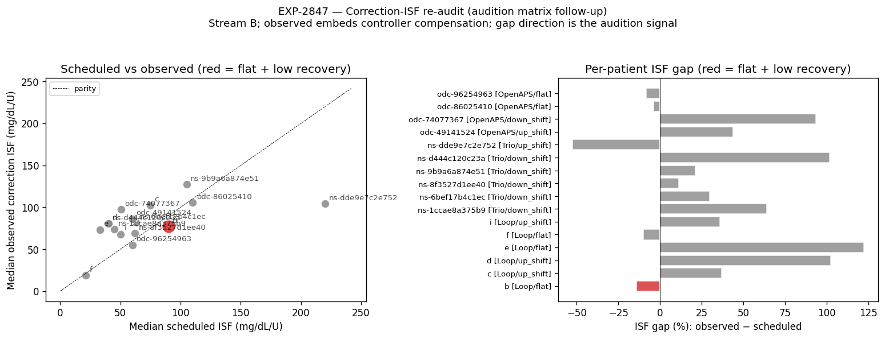
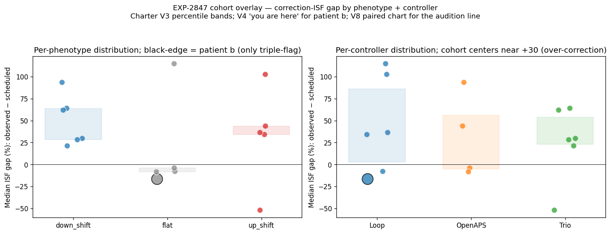

---

## Charter compliance

This matrix is Stream B. No biology numbers asserted. All
recommendations are operational profile edits derived from observed
profile-vs-actual gaps. Cohort triage flags are reproducible from the
existing experiment outputs.
