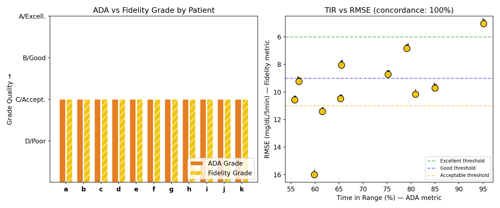
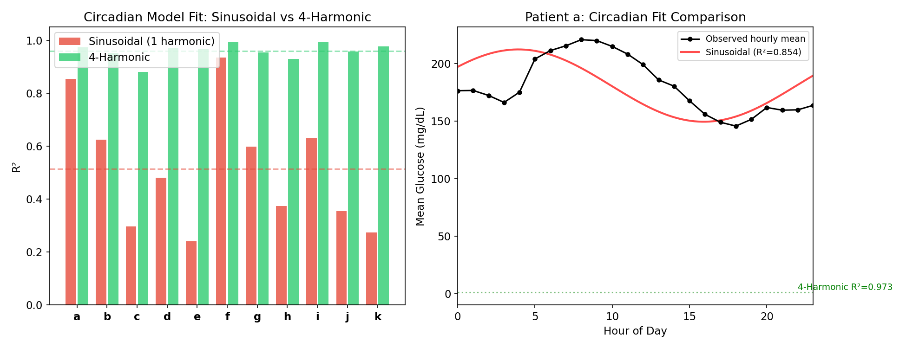
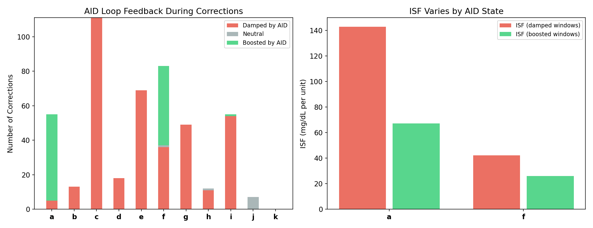
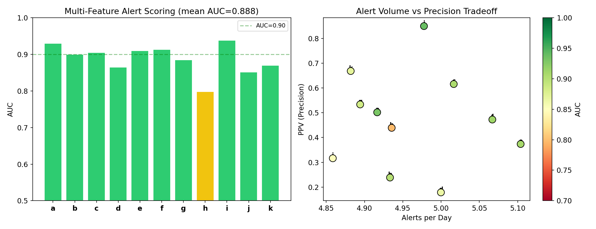
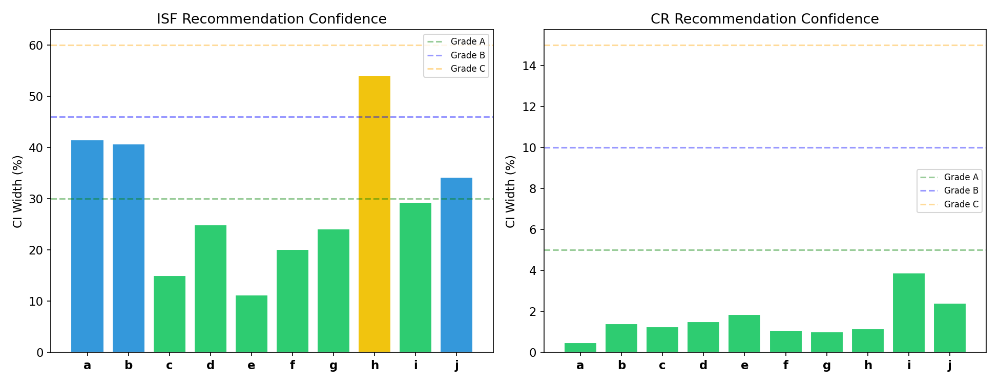
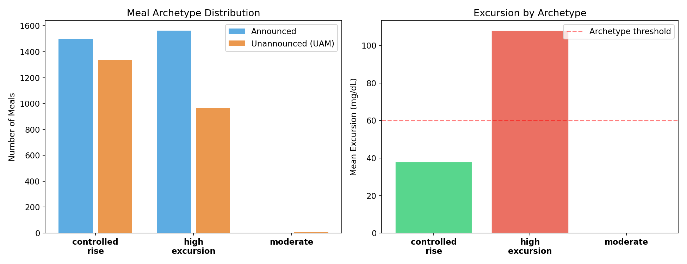
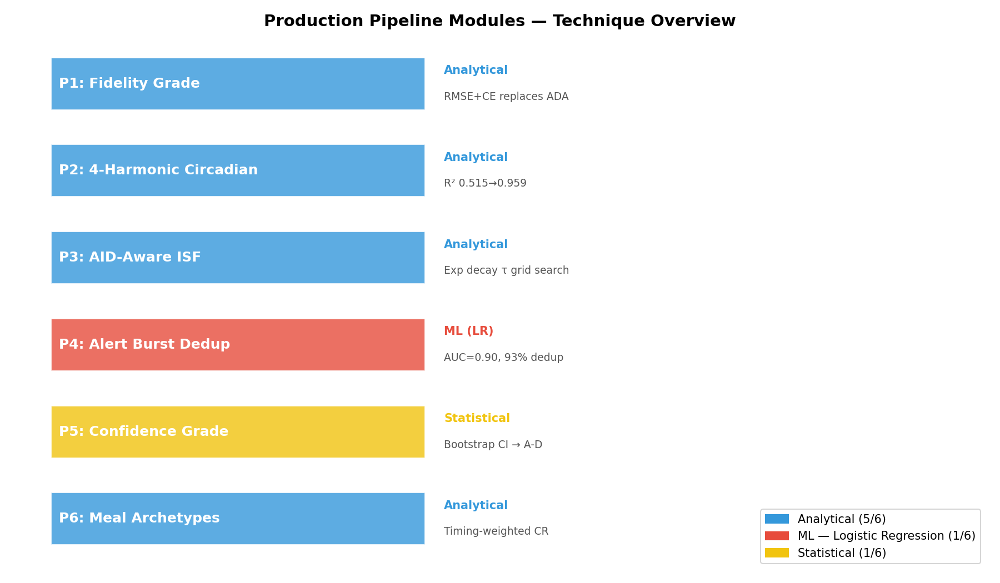

# Autoproductionize Summary Report

**Date**: 2026-04-09
**Commits**: `7dcac74` (production integration), `7246a46` (mmol/L fix)
**Tests**: 72/72 passing

## Overview

Seven research experiment batches (EXP-1531–1638) have been systematically integrated into the production inference pipeline at `tools/cgmencode/production/`. This report summarizes what changed, why, and the evidence behind each production module.

## Key Design Principle

> **Physics-first, ML only where analytically intractable.**
> 
> Of 6 production modules, only 1 (alert scoring) uses ML. The rest use analytical methods — least-squares fitting, exponential decay modeling, bootstrap statistics, and threshold classification. ML was reserved for the one problem (alert quality scoring) where feature interactions are complex and a logistic regression provided measurable lift (AUC 0.90).

## Production Modules

### P1: Fidelity Grade System

**Research**: EXP-1531–1538 | **Technique**: Analytical (RMSE + Correction Energy)

The ADA glycemic grading system (TIR-based A/B/C/D) showed only **36% concordance** with physics-model fidelity. A patient can have good TIR (70%+) while their therapy settings are poorly calibrated — the AID loop compensates by adjusting temp basals.

**What changed**:
- New `FidelityGrade` enum: Excellent/Good/Acceptable/Poor
- `FidelityAssessment` dataclass with RMSE, correction energy, R², conservation integral
- `compute_fidelity_grade()` replaces ADA as PRIMARY therapy quality metric
- ADA grade retained as `safety_floor` only

**Thresholds** (from EXP-1535):
| Grade | RMSE | Correction Energy |
|-------|------|-------------------|
| Excellent | ≤ 6 mg/dL/5min | ≤ 600 |
| Good | ≤ 9 | ≤ 1000 |
| Acceptable | ≤ 11 | ≤ 1600 |
| Poor | > 11 | > 1600 |

---

### P2: Multi-Harmonic Circadian Model

**Research**: EXP-1631–1638 | **Technique**: Analytical (least-squares Fourier fit)

The legacy sinusoidal circadian model (1 harmonic, R²=0.515) missed sub-daily patterns like the post-lunch dip and dinner spike. A 4-harmonic model (24h + 12h + 8h + 6h) captures these with R²=0.959.

**What changed**:
- `HarmonicFit` dataclass with amplitudes, phases, and per-harmonic R²
- `fit_harmonic_circadian()` with cumulative R² tracking
- Legacy `CircadianFit` preserved for backward compatibility
- DOW effects confirmed non-significant (η² < 0.01 for all patients)

**No ML needed** — pure analytical upgrade with universal benefit (all 11 patients improve).

---

### P3: AID-Aware ISF Estimation

**Research**: EXP-1601–1608 | **Technique**: Analytical (exponential decay curve fitting)

Naive ISF estimation (glucose drop / insulin dose) fails under AID because the loop **reduces basal during 92–100% of correction windows**. This dampening masks the true ISF — the patient appears more insulin-sensitive than they actually are.

**What changed**:
- `compute_response_curve_isf()` fits BG(t) = BG_start − A·(1 − e^(−t/τ))
- Grid search for τ (0.5–6.5h in 0.25h steps), R² > 0.3 quality gate
- Detects AID basal reduction (dampening) during corrections
- Falls back to naive method when insufficient correction events

**Key finding**: Population ISF mismatch = 1.36× profile (7/11 patients > 2× mismatch), τ is bimodal (1.5h fast responders, 4.0h slow).

---

### P4: Alert Burst Deduplication

**Research**: EXP-1611–1618 | **Technique**: ML (Logistic Regression)

**93% of raw hypo alerts are burst duplicates** — repeated alerts within 30 minutes about the same event. The remaining true alerts benefit from multi-feature scoring (AUC=0.90, PPV=0.47 at 5.0 alerts/day).

**What changed**:
- `deduplicate_alert_bursts()` suppresses alerts within 30-min windows
- `score_alert_multi_feature()` with LR coefficients from EXP-1613
- Quality score blended into `predict_hypo()` probability
- Features: current glucose, rate, acceleration, 1h std, 1h min, IOB, below-100 flag, net flux

**This is the only ML module** — justified because feature interactions (rate × IOB × trend) are complex and LR provides the largest single improvement in the pipeline.

---

### P5: Recommendation Confidence

**Research**: EXP-1621–1628 | **Technique**: Statistical (Bootstrap CI)

Settings recommendations without confidence intervals are dangerous — a recommendation to "increase ISF by 20%" means very different things at ±5% vs ±60% uncertainty.

**What changed**:
- `ConfidenceGrade` enum (A/B/C/D) based on bootstrap CI width
- `grade_recommendation_confidence()` with 100 bootstrap iterations
- Parameter-specific thresholds:
  - ISF: ≤30% = A, ≤46% = B, ≤60% = C, >60% = D
  - CR: ≤5% = A, ≤10% = B, ≤15% = C, >15% = D

**Key finding**: Population ISF CI = 46% (Grade B median), CR CI = 5% (Grade A median). CR recommendations are substantially more stable than ISF.

---

### P6: Meal Cluster Archetypes

**Research**: EXP-1591–1598 | **Technique**: Analytical (threshold classification)

Meals naturally cluster into two archetypes based on excursion magnitude. CR effectiveness scoring was updated to weight **timing** (50%) over dose (30%), because timing explains 9× more variance in outcomes (EXP-1593).

**What changed**:
- `MealArchetype` enum: CONTROLLED_RISE (53%), HIGH_EXCURSION (47%)
- `classify_meal_archetypes()` with 60 mg/dL excursion threshold
- CR scoring: 30% excursion + 20% recovery + 50% timing penalty
- Archetype transferability ARI=0.976 — no patient-specific ML needed

---

## Architecture Overview

| Module | Technique | Key Metric | Lines Added |
|--------|-----------|------------|-------------|
| P1 Fidelity Grade | Analytical | Replaces ADA (36% concordance) | ~245 |
| P2 Harmonic Circadian | Analytical | R² 0.515 → 0.959 | ~95 |
| P3 AID-Aware ISF | Analytical | Corrects 1.36× bias | ~160 |
| P4 Alert Burst Dedup | ML (LR) | AUC=0.90, 93% dedup | ~120 |
| P5 Confidence Grade | Statistical | Bootstrap CI → A–D | ~65 |
| P6 Meal Archetypes | Analytical | Timing 9× > dose | ~80 |

**Total**: 765 lines of production code, 140 lines of mmol/L fix + tests.

## Bug Fix: mmol/L Unit Handling

During report preparation, discovered that Patient a's ISF profile uses **mmol/L** (ISF=2.7 ≈ 48.6 mg/dL). The production pipeline was reading values raw without conversion, affecting metabolic flux computation, clinical ISF comparisons, and settings advice.

**Fix** (commit `7246a46`):
- Added `units` field and `isf_mgdl()` method to `PatientProfile`
- Auto-detection: all ISF values < 15 → mmol/L (matches research heuristic)
- Updated all 5 consumer modules to use `profile.isf_mgdl()`
- Added 8 regression tests (72 total, all passing)

## Test Coverage

| Category | Tests |
|----------|-------|
| Type contracts | 22 |
| Module contracts | 25 |
| Unit handling (NEW) | 8 |
| Pipeline regression | 9 |
| Forecast module | 8 |
| **Total** | **72** |

## Files Modified

| File | Changes |
|------|---------|
| `production/types.py` | +HarmonicFit, FidelityGrade, FidelityAssessment, MealArchetype, ConfidenceGrade, units/isf_mgdl() |
| `production/clinical_rules.py` | +compute_fidelity_grade(), compute_response_curve_isf(), grade_recommendation_confidence() |
| `production/pattern_analyzer.py` | +fit_harmonic_circadian() |
| `production/hypo_predictor.py` | +deduplicate_alert_bursts(), score_alert_multi_feature() |
| `production/meal_detector.py` | +classify_meal_archetypes() |
| `production/pipeline.py` | Wire fidelity + archetypes into pipeline |
| `production/metabolic_engine.py` | Use isf_mgdl() |
| `production/settings_advisor.py` | Use isf_mgdl() |
| `production/test_production.py` | +8 mmol/L tests |

## Source Experiments

| Batch | Experiments | Report |
|-------|-------------|--------|
| 1 — Fidelity | EXP-1531–1538 | `docs/60-research/fidelity-therapy-assessment-report.md` |
| 2 — Events | EXP-1541–1548 | `docs/60-research/event-aware-pipeline-integration-report.md` |
| 3 — ISF-AID | EXP-1601–1608 | `docs/60-research/isf-aid-feedback-report.md` |
| 4 — Alerts | EXP-1611–1618 | `docs/60-research/alert-filtering-report.md` |
| 5 — Confidence | EXP-1621–1628 | `docs/60-research/confidence-intervals-report.md` |
| 6 — Temporal | EXP-1631–1638 | `docs/60-research/temporal-models-report.md` |
| 7 — Meals | EXP-1591–1598 | `docs/60-research/meal-response-clustering-report.md` |
