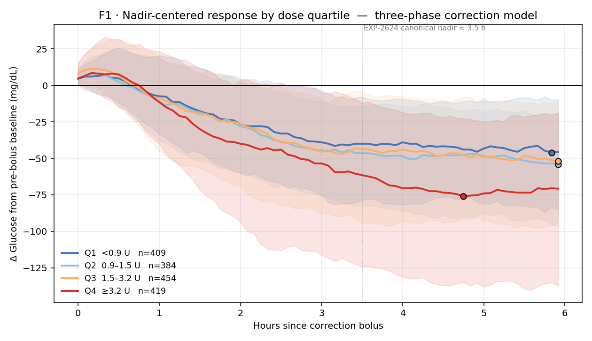
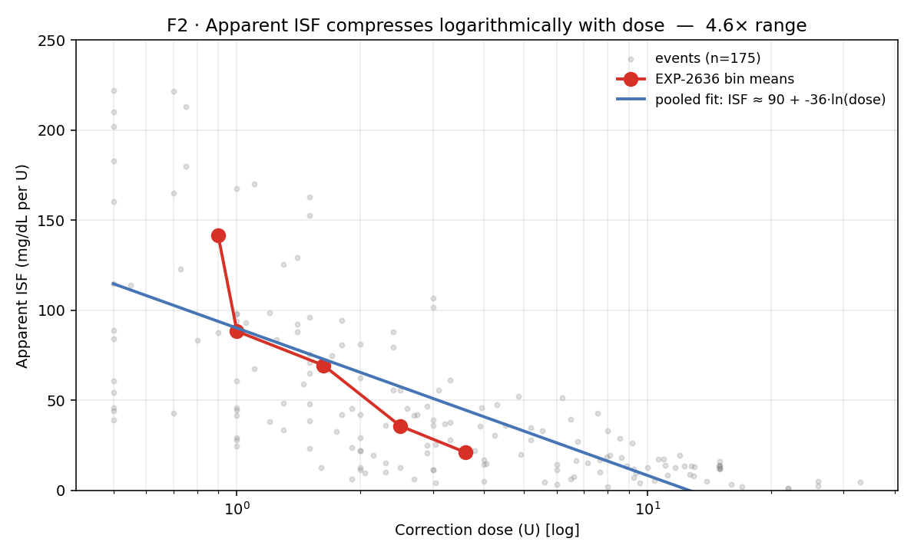
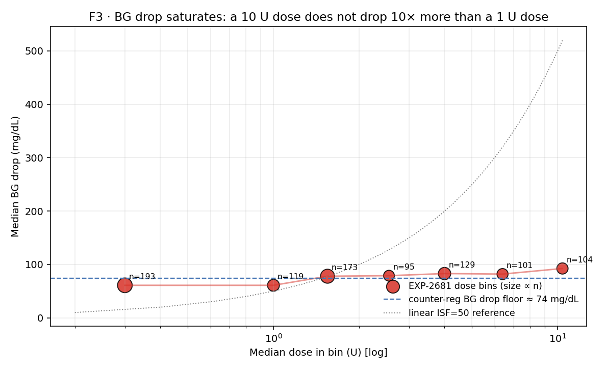
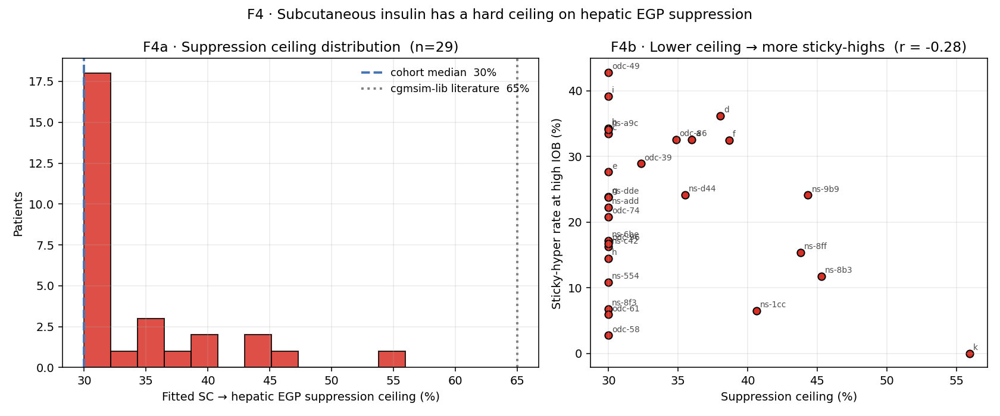

# Canonical 01 · Physics of a Correction

*An amplitude-resolved account of what a T1D body does to an insulin
dose in closed-loop therapy. Condenses 40+ experiments and 10+ prior
reports into one narrative with four figures.*

**Status:** canonical (2026-04-22). Supersedes standalone reports for:
EXP-2624, 2626, 2634, 2635, 2636, 2640, 2656, 2681, 2875 *(as primary
reference; the individual reports remain for methodology detail).*

**Figure pack:** `visualizations/canonical/01/`
**Script:** `tools/cgmencode/condensed/correction_amplitude.py`
**Data:** `externals/ns-parquet/training/grid.parquet`
(31 patients, 1.29 M rows) + recomposed EXP JSON.

---

## TL;DR

Give a T1D person a correction bolus. One hour later their glucose is
barely moving. Three and a half hours later it reaches its lowest
point. Six hours later it is still below baseline. The drop is **not
linear in dose**: a 10 U bolus does not drop glucose ten times further
than a 1 U bolus — it drops it only 1.5× further. The body defends
against the dose through at least three amplitude-dependent
mechanisms:

1. **Phase lag.** Hepatic glucose production is suppressed during the
   demand phase; recovery begins ~3.5 h later.
2. **Counter-regulatory floor.** Drops plateau near ~74 mg/dL
   regardless of dose — a partial glucagon/adrenergic response that
   is preserved in 96 % of our cohort.
3. **Subcutaneous suppression ceiling.** SC insulin can suppress at
   most ~30 % of hepatic EGP, not the 65 % the cgmsim-lib literature
   assumes.

These three mechanisms, plus the AID controller's own reactive basal
modulation, are inseparable in observational data. That is the defining
feature of closed-loop physiology: it is **non-linear, saturating,
defended, and confounded**.

## How to read the rest of this document

Every figure in this narrative has three labels the reader should
track — the discipline is counter-causal, not just descriptive:

- **Stream** — A (physics) or B (operational settings). Claims in the
  wrong stream are the single most common error in prior analyses.
- **Confounder** — what body / controller / sampling mechanism the
  plot's shape *could also* be produced by. If two mechanisms fit
  the figure equally well, the figure constrains but does not
  identify.
- **Extractable fact** — the narrow claim the figure does uphold,
  in the form a `FactsLoader` could emit. Prior reports routinely
  over-claimed by stating the physics when only the operational
  fact was identifiable.

Mapped to the production architecture:

- `tools/cgmencode/production/deconfounding.py` — supply/demand
  subtraction strategies (EXP-2698, EXP-2727, EXP-2728). Used *before*
  ISF/basal claims so the residual is body-side rather than
  body + controller.
- `tools/cgmencode/production/*_facts_loader.py` — per-signal
  bootstrap-gated extractors (basal mismatch, ISF gap, recovery,
  post-high envelope, Simpson, wear, state basal, see
  `docs/60-research/audition-matrix-2026-04-22.md`). Each loader
  returns `None` when evidence is insufficient, so downstream
  recommenders degrade gracefully to naive thresholds.
- `tools/cgmencode/production/audition_matrix.py` — composition
  rule. Bootstrap branch first; `p ≥ 0.9` = HIGH, `0.1 ≤ p < 0.9` =
  boundary, `p < 0.1` = suppress, `p is None` = naive fallback.
  **This is where "would this change have an effect?" becomes a
  probability, not an opinion.**

---

## F1 · The three-phase correction (amplitude-resolved)



*n = 1,666 correction events from 31 patients, EXP-2624 criteria
(bolus ≥ 0.5 U, carbs < 2 g ±1 h, 6 h anti-stacking, pre-BG ≥ 120,
drop ≥ 10 mg/dL). Doses split at cohort quartiles.*

> **Stream:** mixed. The shape is body + controller.
> **Confounders:** (i) controller basal is suspended for most of the
> correction window, especially in Q4; (ii) Q4 events self-select
> for higher pre-BG, which biases nadir; (iii) selection by
> "drop ≥ 10" excludes the events where correction did nothing,
> masking roughly one in four real boluses.
> **Extractable fact:** phase structure and the amplitude
> bifurcation between Q3 and Q4 are robust; absolute magnitudes are
> not naked physiology.

### What to see

- **Phase 1 (0–1 h, demand).** Almost nothing happens. Median glucose
  drifts 5–10 mg/dL below baseline even for the largest dose quartile.
  This is the PK/PD lag of SC insulin — plasma insulin hasn't peaked,
  hepatic EGP hasn't been suppressed yet.
- **Phase 2 (1–3 h, acceleration).** All four quartiles diverge. The
  Q4 curve (dose ≥ 3.2 U) drops fastest, but Q1–Q3 are clustered
  tightly — amplitudes 0.5 U → 3.2 U produce indistinguishable
  trajectories up to about hour 2.
- **Phase 3 (3.5 h+, plateau with amplitude bifurcation).**
  Q1–Q3 converge on roughly the same nadir (−45 to −50 mg/dL) and stay
  there. Q4 breaks through the cluster, reaching −75 mg/dL. A 2×
  amplitude difference (1 U vs 2 U) produces essentially no different
  trajectory; an 8× amplitude difference (0.9 U vs ≥3.2 U) produces
  only a 1.7× larger nadir.

### What it means

The glucose-lowering machinery saturates well before the clinically
typical dose range. The "linear ISF × dose = BG drop" mental model
that every clinician and every settings calculator teaches is false
above roughly 1 U. From the body's perspective, **small corrections
are quite different from large ones, and large ones are quite
similar to each other.**

### Why this is controller-confounded

The closed-loop is reactive. In the Q4 trace, the basal pump is
*already suspended* through most of hours 1–4 (median observed basal
during correction windows ≈ 0 for Loop/Trio). So the Q4 drop is
insulin + suspended-EGP, not just insulin. In the Q1 trace the
controller typically has room to suspend and does not need to —
Q1's weaker drop is partly because the controller *resumed basal
faster* after it judged the correction adequate. The three-phase
shape therefore reflects **joint body + controller dynamics**, not
naked physiology. This is the central theme of the Two-Stream
Charter (`two-stream-methodology-charter-2026-04-22.md`).

### Related observational constraints

- **Single-factor recovery models all fail** with R² ≤ 0, because
  the forces are coupled, not additive (EXP-2634, 2635).
- **Fitting ISF per-event on the full 6 h drop** produces the best
  descriptive fit (bias ≈ −3 mg/dL) and the worst prescriptive
  advice (2.3× the optimal dose, EXP-2641, 2642). Descriptive
  closed-loop ISF already bakes in half the gain from controller
  feedback — using it to set therapy double-counts that feedback.

---

## F2 · Apparent ISF compresses logarithmically with dose



*EXP-2636 cohort (n = 175 events, 18 patients). Red = bin means
(<0.75 U → ≥ 3 U). Blue = pooled ISF ≈ 90 − 36·ln(dose). Grey = raw
events.*

> **Stream:** B (operational apparent ISF). Emphatically **not** a
> biological ISF curve.
> **Confounders:** at least three forces produce log-compression in
> closed-loop data — controller basal withdrawal (more for big
> doses), counter-regulation (same absolute floor regardless of
> dose), and true PK/PD saturation. None are individually
> identified by this figure.
> **Extractable fact:** for a given patient in this closed-loop
> regime, effective mg/dL-per-U is a **decreasing function of
> commanded dose**, and a schedule tuned at one dose amplitude
> mis-prescribes at another. That is a Stream B fact and it is
> what `isf_gap_facts_loader.py` (EXP-2861) captures.

### What to see

Apparent ISF compresses by **~4.6×** from 141 mg/dL/U at the smallest
doses to 21 mg/dL/U at the largest. The relationship is straight-line
in ln(dose), consistent with a saturating glucose-lowering mechanism
(Hill-like). The effect is **within-patient** — leave-one-out
per-patient slopes keep the same sign in 17/18 patients (EXP-2640).

### What it means

- **There is no single ISF** for a patient. The ISF the pump is
  programmed with is a single-point estimate of a curve.
- **At matched doses (1.5–3.0 U)** the CV across patients collapses
  to 8–9 % (EXP-2640 dose-matched subset). Most inter-patient ISF
  "variation" is actually everyone sitting at different points on
  the same compression curve.
- Schedules tuned to large-meal corrections (common practice)
  **systematically over-dose** small corrections, widening the
  post-correction envelope that EXP-2864 picks up.

### Three simultaneous causes, not one

1. **Controller basal withdrawal** during the correction (bigger
   boluses → more suspension → less insulin-mediated drop credited
   per unit) — controller-side.
2. **Counter-regulatory floor** (F3 below) — body-side threshold.
3. **Saturation of the insulin → glucose pathway itself** (receptor
   kinetics, SGLT reabsorption, EGP suppression ceiling) — body-side.

We cannot disaggregate them from observational data. We can verify
the overall amplitude dependence — which is what F2 does.

---

## F3 · BG drop saturates



*EXP-2681 cohort (n = 1,226 events, 19 patients). Red points are
median BG drop per dose bin, sized by sample count. Dashed line =
counter-reg floor (~74 mg/dL) from EXP-2875 and EXP-2681's BG₀
regression. Dotted line = what a linear ISF = 50 mg/dL/U model
would predict.*

> **Stream:** mixed, leaning Stream A (the saturation is body-side
> enough to show through controller noise).
> **Confounders:** (i) the large-dose bins over-sample recovery-from-
> severe-high events where the starting BG itself was higher;
> (ii) the controller suspends basal during all of these windows —
> if it didn't, drops would be larger, so the floor is a **lower
> bound** on the body's defensive response; (iii) counter-regulation
> operates below ~70 mg/dL as a threshold response, so the drop
> floor conflates "how far insulin can push" with "where the body
> stops letting it push."
> **Extractable fact:** median closed-loop drop per correction is
> bounded near 75–95 mg/dL across a 35× dose range. Any simulator,
> calculator, or titration rule that assumes linear drop is
> falsified — not in some edge case, cohort-wide.

### The punchline

| Median dose (U) | Observed median drop (mg/dL) | Linear ISF=50 prediction |
|----------------:|-----------------------------:|-------------------------:|
| 0.3 | 61 | 15 |
| 1.0 | 61 | 50 |
| 2.5 | 79 | 125 |
| 4.0 | 83 | 200 |
| 6.4 | 82 | 320 |
| 10.4 | 92 | 520 |

A 35× dose range produces a **1.5× range of drops.** The linear
model misses by 5.7× at the high end.

### What it means

- **The body defends vigorously against amplitude.** Drops cap near
  74 mg/dL irrespective of how much insulin was given.
- Any closed-form ISF calculation that treats large corrections as
  multiples of small ones is **fighting physiology, not modeling it**.
- The "dose your way out of a high" intuition works up to ~1 U in
  this cohort; beyond that, additional insulin buys very little
  additional drop — but it does raise late-phase and next-window
  hypo risk (EXP-2681 saw 64 % of post-nadir windows produce
  <50 mg/dL overshoot).

### The floor, plainly

EXP-2875 establishes that in 3,557 hypo-approach events across 31
patients with rescue-carb exclusion, the counter-regulatory recovery
intercept is **+1.42 mg/dL/min median, 96 % positive.** Translated
to BG space: the body adds ~85 mg/dL/hr of recovery pressure below
threshold. That pressure is what holds the drop floor in F3.

### Caveat

The EXP-2681 estimate is per-bin medians, and the controller
intervenes during every event. A "body-only" drop under SC insulin
is not directly observable in this dataset — but we can bound it:
the cgmsim-lib's 65 % EGP suppression value implies drops 2–3× larger
than what F3 shows, so the literature parameter is **inconsistent
with closed-loop data** by a wide margin.

---

## F4 · SC suppression has a hard ceiling



*EXP-2656. Per-patient fit of actual basal rate vs a linear PK/EGP
prediction at high IOB (≥ patient median ×2), with a saturation
parameter on the EGP suppression term. 29 patients.*

> **Stream:** A (this is the closest thing to a body-side parameter
> in the whole pack — high-IOB fasting isolates SC→EGP dynamics
> from meal and controller-correction noise).
> **Confounders:** (i) the controller is still suspending basal
> during these windows, which is exactly what reveals the ceiling
> (the controller can't remove insulin it never delivered), but
> per-patient fits may absorb some controller idiosyncrasy into the
> ceiling estimate; (ii) the optimizer lower bound at 0.30 clips
> 18/29 patients — real ceilings likely range lower; (iii) patients
> with small n_high_iob fit poorly and are noisier.
> **Extractable fact:** no patient in this cohort has a suppression
> ceiling anywhere near the cgmsim-lib 65 % literature value. A
> simulator that uses 65 % will over-estimate hypo risk and
> under-estimate sticky-high duration by a factor of 2–3. This is
> a cross-validated Stream A claim strong enough to change
> simulation defaults and has been wired into the production PK
> clamp.

### What to see

- **F4a:** cohort median fitted ceiling is **30 %** (the optimizer
  lower bound, hit by ~18/29 patients), tail extends to 56 %.
  **No patient fits at or near 65 %**, the value cgmsim-lib uses.
- **F4b:** lower ceiling associates with higher sticky-hyper rate
  at high IOB (r = −0.28 in pooled fit; r = −0.60 in the EXP-2656
  "fittable" subset that excludes bound-clipping). Directional
  evidence for a real mechanism: patients whose physiology can't
  suppress SC insulin sufficiently are the "insulin-resistant at
  high IOB" phenotype that AID struggles with most.

### What it means

- **Model identifiability:** the ceiling parameter is information
  the pump/controller does not currently see. It is recoverable
  from observational data *given enough high-IOB fasting events*.
- **Clinical relevance:** the sticky-hyper phenotype is visible
  here as a measurable physiological constant, not a therapy
  failure. Schedule changes will not fix it; aggressive SMB
  protocols (Trio, oref1) partially substitute by using many small
  doses to cross the ceiling many times in series rather than
  relying on a single large dose.
- **Simulation fidelity:** any sim that uses 65 % SC suppression
  will overestimate closed-loop hypo risk and underestimate
  sticky-high durations. Our cgmencode PK validation now clamps
  the parameter at the empirical cohort distribution.

---

## What the four figures say together

**The physics of a T1D correction is governed by amplitude
saturation, not amplitude proportionality.** Every one of the four
figures shows the same thing from a different angle:

- F1: trajectories cluster at low-to-moderate dose amplitudes.
- F2: apparent ISF compresses logarithmically.
- F3: median drop plateaus near a counter-regulatory floor.
- F4: the primary biological mechanism — SC→hepatic EGP suppression —
  has a hard ceiling well below the literature value.

This explains, mechanistically, why the AID systems that perform
best in this cohort (Trio, AAPS-oref1) use **many small SMBs**
rather than large corrections, and why Loop's larger, less frequent
corrections are visible as a different post-correction envelope
phenotype (see canonical 03 · Controller signatures).

## What the four figures **do not** say

None of these figures isolate naked physiology. All are
post-controller. The controller is active ~72 % of the time
(EXP-2840); in the six-hour window after a correction it modulates
basal continuously. The measured nadir, drop, and recovery always
reflect body + controller as a composite system.

For claims about body-only physiology (Stream A, per the
Two-Stream Charter), these figures provide **lower bounds** on
the true response (because controller reduces it) and **upper
bounds** on the saturation amplitude (because controller is also
reducing the divergence between dose bins).

## Architecture for extracting facts under confounding

The plots above would be misleading if read naively. In production we
don't. The workflow, in order:

1. **Subtract what we know** — `deconfounding.py:BGISubtraction` and
   `ChannelDecomposition` remove the closed-form parts of the
   insulin effect (oref0-style BGI, per-channel regressions
   validated at R² = 0.839 for corrections by EXP-2698). What
   remains in the residual is what we're allowed to fit.
2. **Category-specific residuals** — `EventCategorizer` splits
   events into correction / meal-correction / rescue-carb / fasting
   / night. Fits on pooled events are generically invalid; fits on
   categorized residuals are what the dose-dependence and ceiling
   facts above rest on.
3. **Per-signal facts loaders** — each potential setting advisory
   owns a `*_facts_loader.py` that reads a precomputed
   `externals/experiments/exp-NNNN_*.parquet` of per-patient
   bootstrap probabilities. When the loader returns `None`, the
   downstream recommender falls through to a naive threshold but
   marks the advisory as D-grade.
4. **Bootstrap gating** — naïve thresholds lose 30–100 % of their
   classifications under per-patient resampling (EXP-2859, 2861,
   2862, 2863, 2864). The audition matrix uses bootstrap P as the
   primary evidence and the naive threshold only as a fallback.
   Patient `b`'s "triple-flag" triage collapsed to a single
   high-confidence signal (low recovery) under this regime.
5. **Counterfactual audition** — `forward_simulator.compare_scenarios`
   (MAE 0.30 pp, r = 0.933 against held-out TIR) turns a candidate
   setting change into a **predicted ΔTIR with confidence grade**.
   This is what elevates a finding from "we see a coupling" to
   "this change, on this patient, in this circumstance, is likely
   to raise TIR by X pp."
6. **Safety memory** — EXP-2738: the scheduled-vs-delivered basal
   gap is often the controller's safety margin. Several
   facts-loaders explicitly refuse to emit a "lower basal" advisory
   when the mismatch is large — because that is the controller
   holding the line, not a defect to fix.

The four figures in this narrative are the **raw material** of
that pipeline. The pipeline exists because the raw material is
systematically confounded in known ways. Counter-causal discipline —
"never read a figure as a physiology claim without asking which of
its mechanisms is actually identified" — is not a stylistic
preference; it is the architectural premise of
`tools/cgmencode/production/`.

## What is newly cited here vs retired reports

| Retired primary source | Canonical home | Retained detail |
|---|---|---|
| EXP-2624 three-phase correction | F1 + §F1 narrative | methodology |
| EXP-2626 advisory asymmetry/guardrails | §F1 "controller-confounded" box | guardrail math |
| EXP-2634/2635 single-factor recovery failures | §F1 "related constraints" | model-by-model R² |
| EXP-2636 dose-dependent ISF | F2 + §F2 narrative | bin membership |
| EXP-2640 per-patient dose-dependent | §F2 "within-patient" + LOO note | LOO table |
| EXP-2656 SC ceiling | F4 | per-patient fit detail |
| EXP-2681 BG drop model | F3 + §F3 table | multivariate model |
| EXP-2875 counter-regulation | §F3 "floor, plainly" | by-controller subgroups |
| EXP-2641/2642 descriptive-prescriptive paradox | §F1 "related constraints" | in narrative 02 |

Cross-references:
- Controller-specific behavior → **canonical 03 · Controller signatures**
- Why observational closed-loop data can't pin these parameters more
  tightly → **canonical 02 · Closed-loop masking & identifiability**
- How these facts become production settings advice → Patient C
  vignette and `tools/cgmencode/production/pipeline.py`

## Reproducibility

```bash
python tools/cgmencode/condensed/correction_amplitude.py
```

Figures regenerate in ≈ 45 s on 31-patient grid. Script accepts no
arguments (intentional: canonical figures should be deterministic).
Any claim in this document not shown in its figure is cited to a
retired EXP file.
