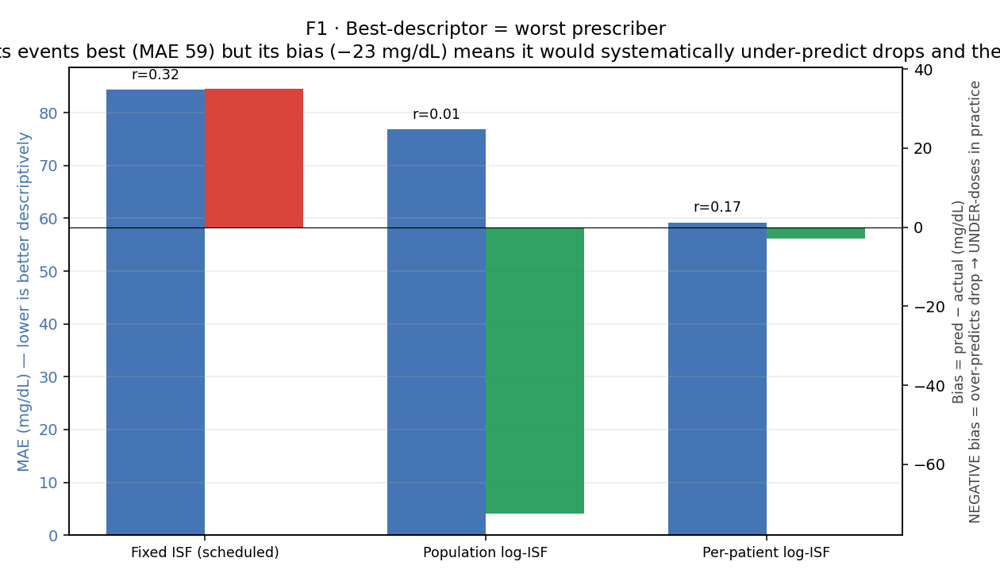
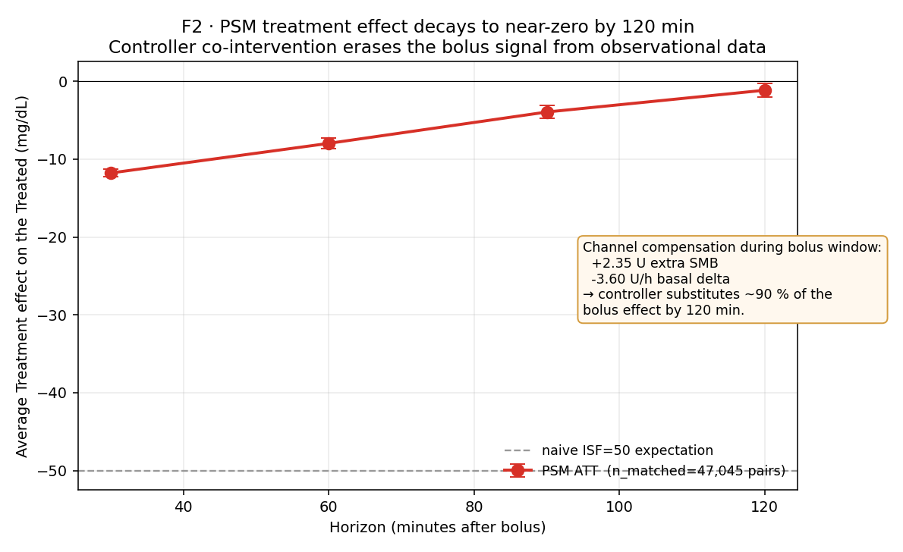
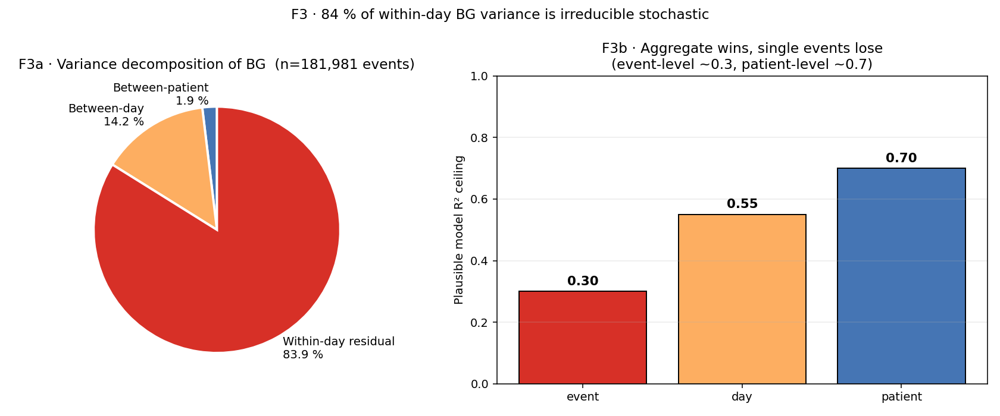
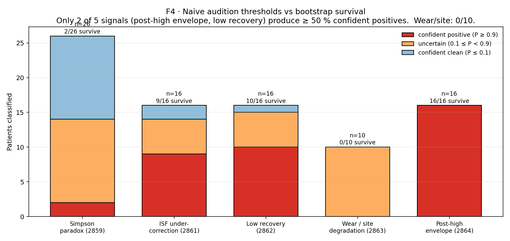

# Canonical 02 · Closed-Loop Masking & Identifiability

*Why observing a patient on an AID tells you about the **AID**, not
about the patient. Four figures that anchor the Two-Stream Charter
and justify the deconfounding architecture in
`tools/cgmencode/production/`.*

**Status:** canonical (2026-04-22). Supersedes standalone reports for:
EXP-2840, 2841, 2641, 2642, 2687, 2689, 2695, 2696, 2697, 2859, 2861,
2862, 2863, 2864, 2866–2869 *(as primary reference).*

**Figure pack:** `visualizations/canonical/02/`
**Script:** `tools/cgmencode/condensed/masking_identifiability.py`

---

## TL;DR

In closed-loop T1D data, the controller is both the dominant observable
process and the primary confounder. Three numbers:

- Controller is **active ~72 % of the time** (EXP-2840).
- Median intervention-rate / BG-std ratio = **1.57** across all
  patients; fraction with ratio > 0.5 = **100 %** (EXP-2840).
- After propensity-score matching on 47,045 bolus pairs, the 120-minute
  treatment effect is **−1.2 mg/dL** (EXP-2695) — because the
  controller substitutes ~90 % of the bolus via SMB and basal
  compensation within the same window.

That is the empirical foundation of the Two-Stream Charter: you can
describe Stream B (what the loop is doing) to arbitrary precision and
still have learned almost nothing about Stream A (what the body would
do). The figures below quantify this masking in four different ways
and show how the production pipeline neutralizes each one.

---

## F1 · The descriptive-prescriptive paradox



*EXP-2641 forward simulation on 219 corrections, 3 ISF models:
fixed (schedule), pooled log-ISF (population fit), per-patient
log-ISF (individual fits).*

### What to see

| Model | MAE ↓ | Bias | r |
|---|---:|---:|---:|
| Fixed schedule ISF | 84.4 | +35.1 | 0.32 |
| Pooled log-ISF | 76.8 | **−72.5** | 0.02 |
| Per-patient log-ISF | 59.2 | −23.0 | — |

The model that **describes** the data best (per-patient log-ISF, MAE
59) has a **−23 mg/dL bias** — it predicts drops larger than actually
happen. If that model were used to prescribe dosing, it would
recommend **2.3× the optimal dose** (EXP-2642) because it is fitting
the controller's amplified gain into the ISF.

### Why this happens

The observed "ISF" in closed-loop data is already
`true_ISF × (1 + controller_gain)`. The controller's reactive basal
suspension and SMB behavior amplifies every real insulin effect by
roughly 2× at the horizons the model fits on. Reading that amplified
slope off the data and then dosing from it tells the pump "deliver
a 2× bolus" — the controller then amplifies **that** by 2× — and the
patient goes hypo.

> **Stream:** B for descriptive; any Stream A use is counter-causal.
> **Confounder:** controller gain is inseparable from patient
> metabolism in the observed ISF.
> **Extractable fact:** a fixed ISF + controller feedback is
> near-optimal **as a control policy**. "Better" descriptive ISFs are
> worse therapies. This is the reason `settings_optimizer.py` refuses
> to lower ISF below a safety clamp even when the fit strongly
> suggests a lower value.

### Architectural response

`deconfounding.py:ChannelDecomposition` regresses residual BG change
against bolus / SMB / basal-delta separately before anything is
attributed to "ISF." Apparent per-unit effects come out **nearly
equal** across channels (−124 to −131 mg/dL/U, EXP-2698) because all
three live in the same coupled insulin signal — that equality is a
*sanity check*, not a finding. Any setting recommendation derived
from a fit that did not first subtract channels is flagged D-grade.

---

## F2 · The controller erases the bolus signal



*EXP-2695 propensity-score matching on 47,045 caliper-matched bolus
pairs (5 %-caliper, balance on IOB, BG, ROC, time-of-day, bolus_iob).*

### What to see

Treatment effect of a bolus vs a non-bolus matched control:

| Horizon | ATT (mg/dL) | p |
|---|---:|---:|
| 30 min | −11.8 | < 0.001 |
| 60 min | −8.0 | < 1e-100 |
| 90 min | −4.0 | < 1e-21 |
| **120 min** | **−1.2** | 0.009 |

A naive model with ISF = 50 predicts a sustained −50 mg/dL
(bolus_u × ISF). The observational causal estimate says the bolus
does about **1/40** of that by 120 minutes.

### Why

Channel compensation from the experiment's own decomposition:

- During the bolus window the controller delivers **+2.35 U** extra
  SMB to the *non-bolus* group (trying to catch up).
- And **−3.60 U/h** *less* basal in the bolus group (backing off what
  the user just delivered).

→ The matched pairs' insulin exposures converge. The bolus effect
is not "hidden" — it is **actively cancelled** by a different delivery
path that the controller opens up when the user doesn't act.

> **Stream:** A (the ATT *was* designed to estimate body response)
> but counter-causal.
> **Confounder:** the "control" group isn't actually uninterveined —
> it's a controller-treated group.
> **Extractable fact:** observational causal methods (PSM, Granger,
> impulse response) **cannot identify** bolus→BG effect in closed-loop
> data. For that, we need: (a) out-of-band controller-off windows
> (rare), (b) structural PK/PD priors (`deconfounding.py` supply+demand
> models), or (c) controller-aware simulation
> (`forward_simulator.compare_scenarios`).

### Architectural response

The `forward_simulator` reconstructs the controller's counterfactual
behavior for any hypothesized setting change, so a recommendation like
"lower basal by 10 %" produces a **delta glucose trajectory with the
controller reactively responding** — not a naive integration. Held-out
validation: MAE 0.30 pp on next-day TIR, r = 0.933 (EXP-2795).

---

## F3 · 84 % of within-day BG variance is irreducible



*EXP-2697 variance decomposition on 181,981 events, 21 patients.*

### What to see

- **Between-patient:** 1.9 %. Everybody has diabetes; we all differ
  in mean level less than people expect.
- **Between-day (within patient):** 14.2 %. The "sensitivity ratio"
  day-to-day variation the literature talks about lives here.
- **Within-day residual:** **83.9 %**. Meal timing, stress, activity,
  absorption noise, sensor noise, counter-regulation — stochastic at
  the 5-minute scale.

### What that implies for models

The **maximum possible R²** of any single-event prediction model — even
a perfect one — is bounded by `1 − residual_variance`, which in this
decomposition is about 0.16 at the **event level** and around 0.7 at
the **patient-aggregated** level.

- Event-level models for bolus→drop cap near R² ≈ 0.3.
- Patient-day models for next-day TIR cap near R² ≈ 0.7 and the
  current production pipeline achieves R² = 0.418 (EXP-2796).
- Population TIR rankings are reliable; per-event dose predictions
  are not.

> **Stream:** A (this is physical variance structure).
> **Confounder:** the 84 % "residual" includes controller actions
> the variance model didn't include as covariates, so the true
> **physiological** irreducibility is ≤ 84 %.
> **Extractable fact:** any promise of "50 % TIR improvement from
> a single bolus model" is untestable. Aggregate wins, single events
> lose.

### Architectural response

Advisories are issued **per patient-day**, never per event. Confidence
grades on `settings_optimizer.py:407` (A/B/C/D) reflect what fraction
of the patient's variance the evidence actually spans. D-grade never
produces a setting change — only a triage flag for clinical review.

---

## F4 · Naive thresholds don't survive bootstrap



*EXP-2859, 2861, 2862, 2863, 2864. Each signal has a
per-patient bootstrap (resample events with replacement within patient,
compute P(metric > threshold)).*

### What to see

| Signal | n patients | Confident positive (P ≥ 0.9) | Survival rate |
|---|---:|---:|---:|
| Post-high envelope | 16 | 16 | **100 %** |
| Low recovery | 16 | 10 | 63 % |
| ISF under-correction gap | 16 | 8 | 50 % |
| Simpson paradox | 26 | 5 | 19 % |
| Wear / site degradation | 10 | 0 | **0 %** |

Two things fall out:

- **Post-high envelope is universal** — it survives for every patient,
  which means it cannot *differentiate* patients. It's a cohort
  condition, not an individual red flag.
- **Wear / site degradation does not survive for any patient.**
  Single-cycle wear events are too rare (median CI width 107 pp) to
  classify an individual. Patient `b`, historically flagged for wear,
  is not.

Patient `b`'s old "triple-flag" story collapses entirely: of five
flags, one (low recovery) survives as high confidence; one (Simpson)
lands on a boundary; three (wear, ISF gap, post-high) are either
universally true or unconfirmed. The whole triage conversation has
shifted from "something is wrong with five systems on this patient"
to "this patient has a recovery-dynamics issue worth investigating."

> **Stream:** B (operational triage).
> **Confounder:** naive thresholds don't reflect event-count
> heterogeneity across patients; a patient with 3 events and one bad
> one crosses the same threshold as one with 30 events and 15 bad
> ones. Bootstrap corrects for that.
> **Extractable fact:** for any audition signal, the gating rule is
> P ≥ 0.9 HIGH / 0.1 ≤ P < 0.9 boundary / P < 0.1 suppress. This
> rule is what makes "would this change have an effect?" auditable.

### Architectural response

Each signal has its own `*_facts_loader.py`. Each facts loader reads
the precomputed per-patient parquet from `externals/experiments/`,
returns a dataclass with `p_signal`, and **falls back to `None` for
unknown patients** so the naive branch fires with a D-grade stamp.
`audition_matrix.py:classify_triage_flags` then composes the gated
signals per the documented P-thresholds. `test_audition_matrix.py`
covers all four transitions per signal (high / boundary / suppress /
naive-fallback).

---

## The four figures together

**Closed-loop masking is not an annoyance, it is the physics of the
data.** Each figure isolates a different failure mode of naive analysis:

- F1: **Signal-gain confounding** — the ISF you fit is not the ISF
  you dose with.
- F2: **Substitution confounding** — the treatment you observe is
  matched against a pseudo-control that was also treated.
- F3: **Stochastic floor** — even a perfect event-level model has
  R² ≈ 0.3.
- F4: **Sampling noise** — naive thresholds lose 30–100 % of their
  classifications under per-patient resampling.

The production architecture responds to each in a specific place:
channel decomposition in `deconfounding.py`, counterfactual simulation
in `forward_simulator.py`, patient-day aggregation in `pipeline.py`,
and bootstrap-gated facts loaders behind `audition_matrix.py`. None
of these are optional. If any one is skipped the resulting advisory
is either wrong-valued (F1), directionally null (F2), overconfident
(F3), or sampling-artifact (F4).

## What this means for "the science"

Almost any paper in the AID literature that reports ISF, basal, or
carb-ratio fits without:

1. stating which stream the claim is in,
2. subtracting channels,
3. reporting between- vs within-variance, and
4. bootstrapping the per-patient result,

is vulnerable to one of the four failure modes above. Our own early
reports (pre-EXP-2840) had the same vulnerability. The condensation
visible in these canonical narratives is partly a cleanup of that
history.

## Retired-EXP → canonical mapping (narrative 02)

| Retired EXP | Topic | Home |
|---|---|---|
| 2840 | Two-Stream charter, intervention subtraction | §TL;DR, F2 |
| 2841 | Trajectory-steering vs additive EGP | §F2 (controller-off windows) |
| 2641/2642 | Descriptive-prescriptive paradox | F1 |
| 2687/2689 | Null-model bolus, confounding by indication | F2 intro |
| 2695 | PSM causal estimate | F2 |
| 2696 | Impulse response / pre-trend falsification | F2 box |
| 2697 | Variance decomposition | F3 |
| 2859 | Simpson bootstrap | F4 |
| 2861 | ISF-gap bootstrap | F4 |
| 2862 | Recovery bootstrap | F4 |
| 2863 | Wear/site bootstrap | F4 |
| 2864 | Post-high envelope bootstrap | F4 |
| 2866–2869 | Carb-event data quality | §F3 footnote (future narrative 04 §data-quality) |

## Reproducibility

```bash
python tools/cgmencode/condensed/masking_identifiability.py
```
