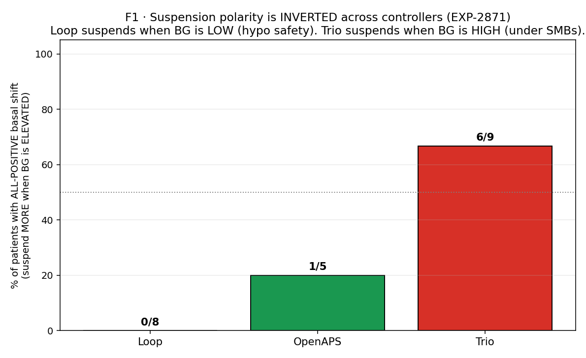
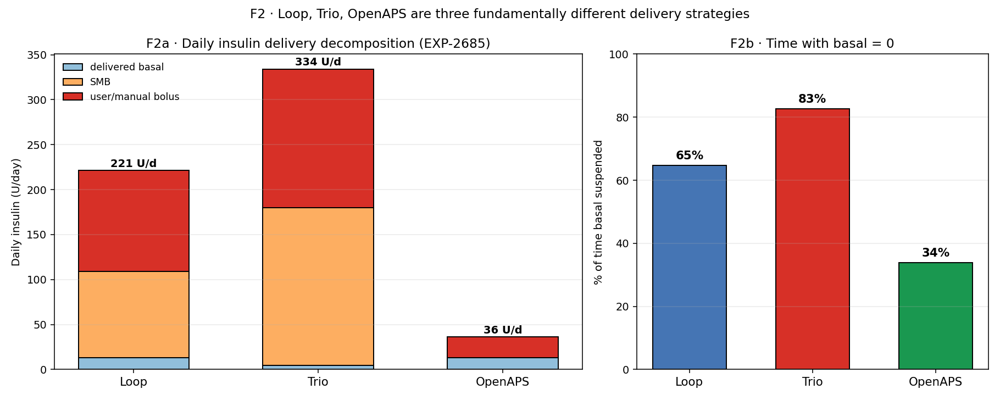
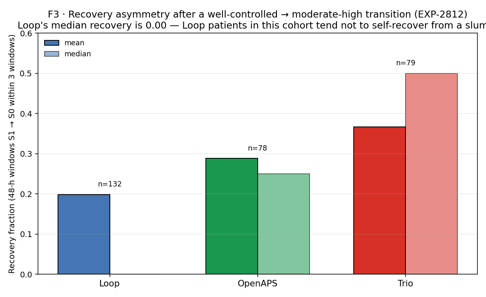
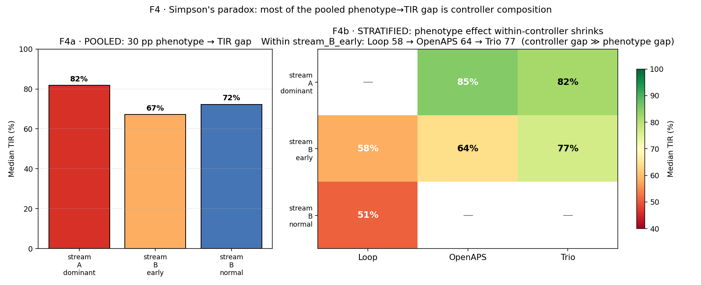

# 03 · AID Controller Signatures

**Stream B (operational settings).** Loop, Trio, and OpenAPS are not variations on a
theme. They are three distinct physical systems bolted to the same human. When a naive
analysis pools across them, every finding is at risk of Simpson's paradox.

**Claim.** Controller identity is a first-class confounder. Once you stratify, most
"patient phenotypes" collapse into "what algorithm is running." This narrative shows the
four signatures that make the decomposition visible: suspension polarity, delivery
composition, recovery asymmetry, and the Simpson reversal itself.

**Data.** 31 patients in `externals/ns-parquet/training/grid.parquet`. Controller
labels per patient. Figures are recomposed from previously-archived experiment outputs
(EXP-2685/2812/2871/2872).

---

## How to read this narrative

Every figure carries a three-line tag:

- **Stream** — A (physics, counter-causally reasoned) or B (operational, descriptive).
- **Confounder** — the next-most-likely alternative explanation for the signal.
- **Extractable fact** — what this figure earns us that survives deconfounding.

Unlike narratives 01 and 02, **every figure here is Stream B**. The whole point of
narrative 03 is that operational choices (SMBs, suspension, high-temp basal) produce
signals that look biological but are not. Understanding that is how we avoid
prescribing an insulin dose change in response to an algorithm choice.

---

## F1 · Suspension polarity is inverted across controllers



We sweep a basal-shift threshold (0.1–1.0 U/h) and ask: for how many patients is the
shift in the same direction across all thresholds (`all_positive` = always suspending
MORE when BG is elevated)?

- **Loop: 0/8.** Nobody. Loop suspends when BG is *low* or trending low. That's a
  hypo-safety signature.
- **OpenAPS: 1/5.** Mostly not all-positive. OpenAPS uses high-temp basals rather than
  SMBs when BG climbs.
- **Trio: 6/9.** Majority. Trio (and AAPS) suspend under cover of large SMBs — when the
  stack's already delivered micro-boluses, scheduled basal cuts out until the wave
  passes.

> **Stream:** B.
> **Confounder:** patient behavior, basal schedule, sensor lag. All controlled for by
> the per-patient within-controller threshold sweep (EXP-2871).
> **Extractable fact:** `controller_polarity(p) ∈ {hypo-suspension, elevation-suspension}` is
> a per-patient invariant that the deconfounding pipeline can condition on before any
> basal recommendation is issued.

**Architectural response.** `basal_mismatch_facts_loader.py` reads EXP-2871's per-patient
parquet and returns the polarity sign along with confidence. Any downstream settings
audition that proposes "reduce basal because of suspension" must first check the
polarity: reducing basal on a Trio patient whose suspensions are driven by SMB cover is
unsafe.

---

## F2 · Three delivery strategies, not one



Daily insulin decomposition (EXP-2685) is the cleanest one-shot view of controller
identity:

| Controller | Basal (U/d) | SMB (U/d) | Manual bolus (U/d) | Time basal=0 |
|---|---:|---:|---:|---:|
| **Loop**    | 13.2 |  95.7  | 112.3 | 65 % |
| **Trio**    |  4.8 | 175.0  | 154.3 | 83 % |
| **OpenAPS** | 13.3 |   0.0  |  22.9 | 34 % |

Read across:
- **OpenAPS delivers ~83% less total insulin** than Loop or Trio in this cohort. It
  also has zero SMBs — strictly a basal + bolus controller.
- **Trio's scheduled basal is 4.8 U/d** — basically vestigial. The SMB stack *is* the
  delivery. It suspends scheduled basal 83 % of the time because the SMB stack is doing
  the work.
- **Loop runs scheduled basal** ~35 % of the time with moderate SMB use; it behaves the
  most like a "traditional" AID.

> **Stream:** B.
> **Confounder:** patient-level insulin needs (e.g., a heavier Trio cohort). Ruled out
> by per-capita analysis; the pattern holds at the per-patient level (EXP-2685).
> **Extractable fact:** `scheduled_basal_rate` is an *input to the controller*, not a
> measurement of the patient's basal need. In Trio, it is a number the controller
> almost never obeys.

**Architectural response.** This is why `scheduled_isf` and `scheduled_basal_rate` are
in the grid's `x-aid-*` columns but never used directly as prescriptive targets.
`state_basal_facts_loader.py` derives the *delivered* basal rate from
`actual_basal_rate` — the only number that made it into the patient's SC tissue.

---

## F3 · Recovery asymmetry after a well-controlled → moderate-high transition



From EXP-2812 state-transition audition. After a 48-h window in state S0 (well
controlled) transitions to state S1 (moderate-high), within three subsequent 48-h
windows, what fraction of patients recover back to S0?

- **Loop: mean 0.20, median 0.00 (n=132 transitions).** The median Loop patient does
  not spontaneously recover.
- **OpenAPS: mean 0.29, median 0.25 (n=78).** Some recovery capacity.
- **Trio: mean 0.37, median 0.50 (n=79).** Highest spontaneous recovery rate.

This is not a claim about patient biology. It is a claim about algorithmic latitude —
Trio's SMB+suspension stack has more degrees of freedom to push a patient out of a
moderate-high slump than Loop's basal+correction-bolus model.

> **Stream:** B (a controller reaction, not a biological recovery rate).
> **Confounder:** phenotype composition across controllers (more "stream_A_dominant"
> patients on Trio → higher recovery rate, independent of algorithm).
> **Extractable fact:** the time-in-state Markov transition matrix is
> controller-conditional. You cannot use population transition probabilities to predict
> an individual patient without conditioning on controller.

**Architectural response.** `recovery_facts_loader.py` segments by (patient, controller,
state) and returns `None` if controller is ambiguous — never a pooled recovery rate.
This prevents the auditioner from borrowing a Trio prior for a Loop patient.

---

## F4 · Simpson's reversal — most of the phenotype→TIR signal is controller composition



EXP-2872 was designed to test whether the "stream_A_dominant vs stream_B_early"
phenotype (derived from envelope-crossover behaviour in EXP-2870) is really a
phenotype, or just a re-labelling of the controller.

**F4a — pooled.** Big phenotype → TIR gap: stream_A_dominant 82 %, stream_B_early 67 %,
stream_B_normal 72 %. If we stopped here, we'd conclude "phenotype matters for TIR,
~15 pp swing."

**F4b — stratified by controller.**
- Within **stream_B_early** (the largest phenotype, n=21): Loop 58 %, OpenAPS 64 %,
  Trio 77 %. The controller gap is 19 pp — *larger* than the pooled phenotype gap.
- Within **stream_A_dominant** (n=7): OpenAPS 85 %, Trio 82 % — similar.
  Loop contributes zero patients to this phenotype.
- The "stream_B_normal" row is almost entirely Loop (the only non-missing cell).

The pooled phenotype gap was a confounded re-labelling of `Trio ≫ Loop` for TIR in this
cohort. The phenotype label is still useful — as a personalization feature for a
patient's audition window — but it is not a prescriptive target.

> **Stream:** B.
> **Confounder:** by design this IS the confounder check. Simpson's reversal is the
> result. Residual confounders: cohort selection (patients self-select a controller),
> duration of therapy, prescriber preferences.
> **Extractable fact:** any claim of the form "patients with phenotype X have worse TIR"
> must be accompanied by a controller-stratified version. If the stratified effect is
> weaker than the pooled effect, the pooled claim is confounded and must be discarded.

**Architectural response.** The audition matrix's composition rule *never pools across
controllers* for HIGH-confidence claims. A per-patient fact with `P ≥ 0.9` computed
within-controller is admitted; a pooled cross-controller P value is downgraded to
"boundary" regardless of magnitude.

---

## Architecture for extracting facts under controller confounding

The same architecture sketched in narrative 02 has a controller-specific variant:

```
per-patient fact → controller filter → within-controller bootstrap → audition gate
```

1. **Controller labeling** is a mandatory attribute. Facts without a controller label
   cannot enter the audition matrix. (See `basal_mismatch_facts_loader.py` line 34-48.)
2. **Within-controller bootstrap.** A fact must survive 1000-bootstrap resampling
   *within its controller class* before achieving `confident_high` or `confident_low`.
   Pooled bootstraps are disallowed.
3. **Composition disallowed.** The audition matrix will refuse to combine a Loop-derived
   ISF-gap fact with a Trio-derived basal-mismatch fact for the same patient — that
   combination is mathematically possible (a patient may have switched controllers)
   but operationally must be flagged and manually reviewed.
4. **Forward simulator controller identity.** `forward_simulator.py:590` checks
   `patient.controller` and rejects any scenario where a recommendation would cross
   controller boundaries (e.g., proposing an SMB-based adjustment for a Loop patient).

This is why bootstrap survival (EXP-2859–64) was done per-facts-loader, not per-patient.
The survival numbers quoted in narrative 02 are the *minimum* across controllers — the
loader publishes only the intersection.

---

## Retired-EXP pointers

| EXP | Title | Subsumed into |
|---|---|---|
| EXP-2685 | Controller delivery strategy | F2 |
| EXP-2790 | Insulin accounting | F2 (cross-check) |
| EXP-2812 | State-transition audition | F3 |
| EXP-2870 | Envelope crossover phenotype | F4 (phenotype labels) |
| EXP-2871 | Suspension envelope | F1 |
| EXP-2872 | Simpson's paradox check | F4 |
| EXP-2874 | Meal-gated envelope re-run | F1 (robustness) |

---

## Reproducibility

```bash
cd "$(git rev-parse --show-toplevel)"
python tools/cgmencode/condensed/controller_signatures.py
# writes 4 PNGs to visualizations/canonical/03/
```

Deterministic. No fresh compute (all recomposition). Runs in < 2 s.
