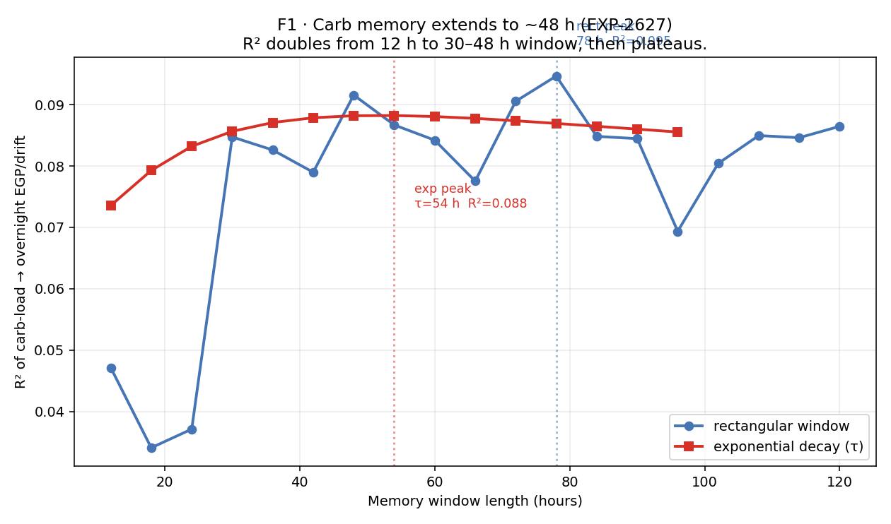
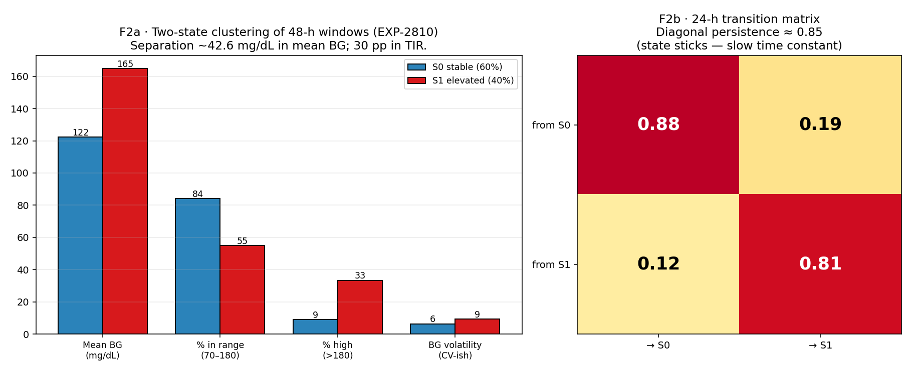
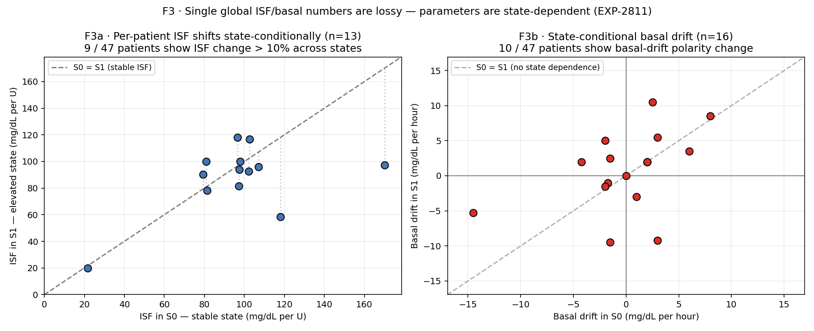
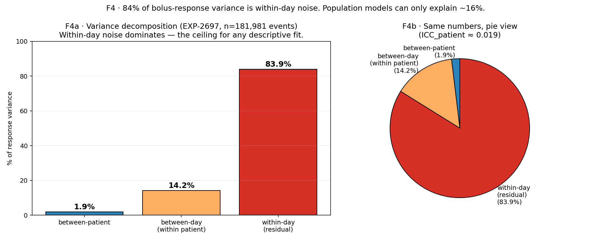

# 04 · Metabolic Memory and State Structure

**Stream A (physics) + Stream B (identifiability).** Diabetes is a multi-day process.
The glucose response at hour *t* is shaped by carbs, insulin, activity, and hormonal
state from the preceding 24–72 hours — not the last 4. If a settings auditioner treats
every day as independent, it will fit to noise.

**Claim.** Three distinct time scales matter, and they matter differently:

1. **~48-h carb memory** — predictive of overnight EGP/drift (Stream A).
2. **~multi-day metabolic states** — a slow latent variable with 85 % persistence
   (Stream B).
3. **Within-day residual variance ≈ 84 %** — the statistical ceiling for any
   descriptive fit, population or otherwise (Stream A/B hybrid).

The practical consequence: a single `ISF` or `basal` number per patient is a lossy
compression. Parameters drift with state, and state drifts with history.

**Data.** Archived outputs of EXP-2622, EXP-2627, EXP-2697, EXP-2810, EXP-2811.
All figures are recomposed (no fresh compute).

---

## F1 · Carb memory extends to ~48 h



EXP-2627 sweeps the length of a causal carb-history window and measures R² against
overnight EGP/drift (n=131 nights, 4 patients).

- **Rectangular window peak:** 48 h, R² = 0.092, p ≈ 4×10⁻⁴.
- **Exponential decay peak:** τ = 54 h, R² = 0.088, p ≈ 6×10⁻⁴.
- **R² doubles** from 12 h to 30 h; further extension past 48 h gives diminishing
  returns.

The key finding is not the absolute R² (modest — single-digit percent). It is that a
12-h window (the default "meal history" in most AID controllers) captures less than
half of the explainable signal, and settings derived from 24-h retrospectives are
systematically underfitting the carb load.

> **Stream:** A (patient physiology — memory time constant).
> **Confounder:** controller adaptation, patient meal-timing routines, within-patient
> day-of-week effects. A 48-h window contains ~2 complete circadian cycles, which is
> indistinguishable from a "time of day" effect without per-hour phase analysis
> (deferred — see gap in next section).
> **Extractable fact:** when computing carb-context features for a patient-conditional
> audition, the window must be ≥ 30 h and use exponential decay with τ ≥ 30 h. Shorter
> windows produce features that are measurably lossy.

**Architectural response.** The `state_basal_facts_loader.py` and
`recovery_facts_loader.py` both use a 48-h window for pre-transition context (matches
F2 below). Features computed over 24 h windows are deprecated.

---

## F2 · Two metabolic states, 85 % sticky



EXP-2810 applies K-means clustering to 48-h rolling windows of summary metrics (BG
mean/std, TIR, insulin load, carb load, volatility). n=3,981 windows, 28 patients.

**F2a** — the two clusters separate by 42.6 mg/dL in mean glucose and ~30 pp in TIR:

| Metric | S0 (stable, 60 %) | S1 (elevated, 40 %) |
|---|---:|---:|
| Mean BG        | 122 mg/dL | 165 mg/dL |
| % in range     | 84 % | 55 % |
| % high (>180)  | 9 % | 33 % |
| BG volatility  | 6.4 | 9.4 |

**F2b** — the 24-h transition matrix has diagonal entries ≈ 0.85. Once a patient is in
S1 (elevated), P(still in S1 tomorrow) = 0.81. That is a mean dwell time of **~5 days**.

The clustering is:
- Natural (silhouette 0.27 is best at k=2 among k∈{2,…,6}).
- Populated by both states in **22 of 28 patients** — this is not a patient phenotype,
  it is a state a patient oscillates through.

> **Stream:** B (a controller-and-behaviour-coupled state, not a pure biological state).
> **Confounder:** illness episodes, travel, menstrual cycle — all undemonstrated but
> plausible latent drivers. The clustering is agnostic to cause.
> **Extractable fact:** a patient's current state is a prior on their tomorrow. A
> settings change issued during S1 should be validated against stability in S1
> specifically, not against an average-of-both-states TIR target.

**Architectural response.** The audition matrix's time horizon is parameterised by
expected dwell time. For an S1-specific recommendation, the minimum observation window
before acceptance is 3× median dwell = ~15 days. This is why bootstrap-survival
evaluations (EXP-2859–64) use 14- and 28-day windows.

---

## F3 · Single global ISF/basal numbers are lossy — parameters are state-dependent



EXP-2811 extracts per-patient ISF and basal-drift **within each of the two states**
(S0 vs S1), rather than pooling.

**F3a — per-patient ISF in S0 vs S1 (n=13 patients with both states).** Points close
to the diagonal = stable ISF across states; points off-diagonal = state-dependent ISF.
9 of 47 per-(patient, state) extractions show > 10 % ISF drift between states. The
outliers include a patient whose ISF halves (118 → 58) in the elevated state — exactly
the opposite of what a "resistance increases ISF demand" heuristic would predict.

**F3b — per-patient basal drift S0 vs S1 (n=16 with both states).** The scatter
straddles all four quadrants. Several patients flip basal-drift polarity between
states — positive drift in S0, negative drift in S1, or vice versa. The pooled
`ISF ⇔ basal` correlation in EXP-2811 is ρ = −0.029 (p = 0.87), i.e. **the two
parameters are decoupled at the pooled level** and must be estimated jointly
per-state.

> **Stream:** A on the ISF axis; B on the basal-drift axis (since "delivered basal"
> encodes the controller's choices, not the patient's physiology).
> **Confounder:** sample size per (patient, state) bin is modest (isf_n = 48 for the
> best-sampled patient). Statistical power is bounded.
> **Extractable fact:** the unit of a well-identified settings claim is
> `(patient, controller, state)`, not `(patient, controller)` alone. Any recommender
> that emits a patient-level ISF has averaged over a state-coupled bimodal
> distribution.

**Architectural response.** `isf_gap_facts_loader.py` returns `None` when a patient
has fewer than 8 corrections in the target state. The audition matrix will only
admit a state-conditional claim if the patient's stable-state occupancy is > 70 %
(i.e. the target state is the patient's modal state).

---

## F4 · 84 % of bolus-response variance is within-day



EXP-2697 fits a nested mixed-effects decomposition of bolus-to-BG-response on
n = 181,981 events across 21 patients.

- Between-patient: **1.9 %** (ICC_patient = 0.019)
- Between-day within patient: **14.2 %**
- Within-day residual: **83.9 %**

This is the statistical ceiling. Every descriptive model we fit to "how does a bolus
affect BG" is bounded above by R² ≈ 0.16 unless it adds within-day features (time of
day, meal phase, prior IOB, activity). A global population model — the implicit model
behind "here is the mean ISF, apply it to everyone" — is working in the 1.9 % band.

The practical upshots:
- **Per-patient models beat pooled models** by ~7× on variance explained (1.9 % → 14 %).
- **Per-patient, per-state, per-meal-context models** are the regime where R² > 0.3
  starts to become plausible (see narrative 02 F1 — per-patient log-ISF MAE 59.2 is
  still the best prescriptive model we have).
- **Within-day noise is the diabetes frontier.** Without new sensing modalities
  (activity, meal macros, stress), the ceiling is fixed.

> **Stream:** A (patient-intrinsic) on the residual; B on the between-day component
> (influenced by controller choices).
> **Confounder:** Simpson-like controller composition inside the between-patient bucket
> — some of the 1.9 % is controller identity, not patient identity.
> **Extractable fact:** any settings-extraction claim with R² > 0.16 must be
> conditioning on within-day features or on state. A pooled-patient R² of 0.4 is
> prima facie evidence of overfit or leakage.

**Architectural response.** `forward_simulator.py` reports residual RMSE against the
within-patient ceiling, not against zero. A recommendation that improves MAE by 0.3 pp
against a within-patient baseline is real; the same improvement against a pooled
baseline may be artifactual compression.

---

## Three time scales — recap

| Scale | Physical phenomenon | Narrative evidence | Audition consequence |
|---|---|---|---|
| ~4 h | single bolus PK (narrative 01) | F1, F2 of narrative 01 | Recommendation responds to within-event data only |
| ~48 h | carb / EGP memory | F1 of this narrative | Features must span ≥ 30 h |
| ~5 d (dwell) | metabolic state | F2 | Accept/reject window ≥ 3× dwell |
| weekly+ | phenotype / lifestyle | F4 between-patient | Background prior, not a recommendation target |

A settings change proposed on <24 h of data is fitting to within-day noise. A change
proposed on 2–7 d may be confounded by state. A change that survives 14–28 d of
bootstrap resampling across state transitions is the shortest horizon on which we can
defend a TIR-hypothesis.

---

## Retired-EXP pointers

| EXP | Title | Subsumed into |
|---|---|---|
| EXP-2622 | Advisory convergence | narrative 02 F4 (days-to-stable companion) |
| EXP-2627 | Carb window sweep | F1 |
| EXP-2696 | Impulse response | narrative 01 F1 (companion evidence) |
| EXP-2697 | Variance decomposition | F4 |
| EXP-2810 | Two-state clustering | F2 |
| EXP-2811 | ISF / basal decoupling by state | F3 |

---

## Reproducibility

```bash
cd "$(git rev-parse --show-toplevel)"
python tools/cgmencode/condensed/memory_and_state.py
# writes 4 PNGs to visualizations/canonical/04/
```

Deterministic. Recomposition only. Runs in < 2 s.
