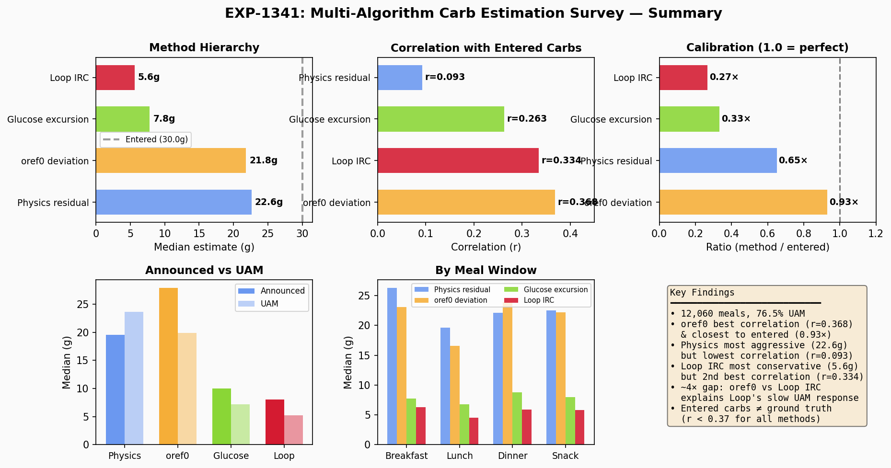
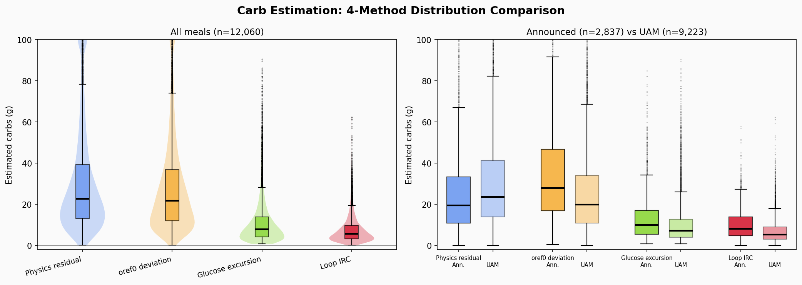
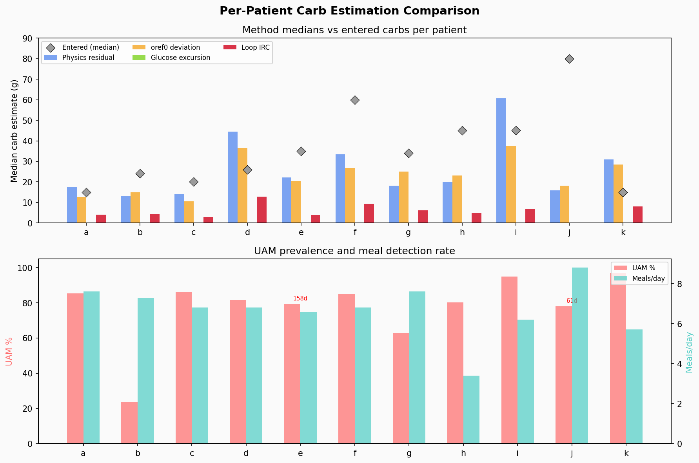
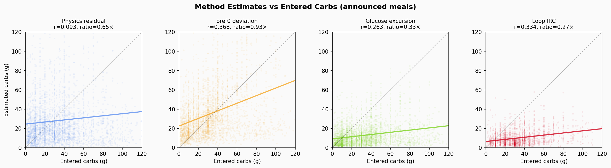

# EXP-1341: Multi-Algorithm Meal Carb Estimation Survey

## Summary

We survey how four different algorithms estimate meal carbohydrate magnitude
from the same CGM/AID data, comparing their qualitative behavior across
12,060 detected meals in 11 patients (typically 180 days each; range 61–180).

**Key finding**: All algorithmic estimates are 27–93% of user-entered carbs,
and correlations with entered carbs are weak to moderate (r = 0.09–0.37).
This confirms entered carbs are **not** reliable ground truth.  The four
methods form a clear hierarchy of aggressiveness, reflecting their design
philosophies.  After correcting the oref0 BGI calculation, **oref0 deviation
achieves the highest correlation with entered carbs** (r=0.368), surpassing
Loop IRC (r=0.334).

*Figure 4: Six-panel summary — method hierarchy, correlation ranking, calibration ratios,
announced vs UAM split, meal window breakdown, and key findings.*

## Methods

| # | Method | What it measures | Source |
|---|--------|-----------------|--------|
| 1 | **Physics residual** | Unexplained glucose rise after subtracting modeled insulin/hepatic effects | EXP-441/753 supply–demand decomposition |
| 2 | **Glucose excursion** | Simple peak minus nadir glucose rise | Baseline / naive |
| 3 | **Loop IRC** | Retrospective prediction error (actual − predicted_30), simplified integral of positive deviations | `IntegralRetrospectiveCorrection.swift` (currentDiscrepancyGain=1, persistentDiscrepancyGain=2, differentialGain=2, τ=60 min) |
| 4 | **oref0 deviation** | Glucose rate of change minus expected insulin effect (BGI) | `determine-basal.js` deviation logic (`bgi = -activity * sens * 5`) |

All methods convert the glucose-domain integral to grams via `carbs_g = integral × CR / ISF`.

## Population Results

| Method | All meals | Announced | UAM | vs Entered (ratio) | Corr w/ entered |
|--------|----------|-----------|-----|---------------------|-----------------|
| Physics | **22.6g** | 19.5g | 23.6g | 0.65× | 0.093 |
| oref0 | **21.8g** | 27.9g | 19.9g | 0.93× | **0.368** |
| Excursion | 7.8g | 10.0g | 7.2g | 0.33× | 0.263 |
| Loop IRC | 5.6g | 8.0g | 5.2g | 0.27× | 0.334 |
| *(Entered)* | *—* | *30.0g* | *—* | — | — |

- **12,060 meals** detected across 11 patients (**76.5% unannounced**)
- Physics and oref0 give the largest estimates (22–23g); Loop IRC the smallest (6g)
- **oref0 has the highest correlation with entered carbs** (r=0.368) and
  the closest ratio (0.93×), suggesting it best captures the insulin-adjusted
  magnitude of carb absorption
- Physics has the **lowest correlation** (r=0.093) — it captures non-meal
  glucose rises too (dawn phenomenon, stress, exercise rebounds)

*Figure 1: Distribution of carb estimates by method (violin + box plots), split by announced vs UAM meals.
Physics and oref0 have broad, overlapping distributions; Excursion and Loop IRC are tightly clustered near zero.*

## By Meal Window

| Window | n | % UAM | Physics | Excursion | Loop IRC | oref0 |
|--------|---|-------|---------|-----------|----------|-------|
| Breakfast | 2,476 | 73% | 26g | 8g | 6g | 23g |
| Lunch | 1,783 | 87% | 20g | 7g | 5g | 17g |
| Dinner | 2,096 | 70% | 22g | 9g | 6g | 24g |
| Snack/other | 5,705 | 77% | 22g | 8g | 6g | 22g |

Breakfast shows the largest physics estimates, consistent with dawn phenomenon
amplifying post-meal glucose rise.  47% of detected events fall in "snack/other"
— many are likely not true meals (exercise, stress, sensor noise).

## Per-Patient Highlights

*Figure 3: Per-patient median carb estimates across methods, with UAM% and meal detection rates.
Patient i is a physics outlier (60.8g); patient j has no Loop IRC data (0% pred30 coverage).*

| Patient | Meals | UAM% | Physics | Loop IRC | Entered | Notes |
|---------|-------|------|---------|----------|---------|-------|
| a | 1,366 | 85% | 17.6g | 4.0g | 15.0g | Miscalibrated settings |
| b | 1,319 | 23% | 13.0g | 4.4g | 24.1g | Most announced meals; only 2% pred30 coverage |
| d | 1,233 | 82% | **44.5g** | 12.9g | 26.0g | CR=14 amplifies estimates |
| f | 1,219 | 85% | 33.4g | 9.3g | 60.0g | Low ISF=20 + CR=5 |
| i | 1,123 | **95%** | **60.8g** | 6.8g | 45.0g | Physics extreme outlier |
| j | 540 | 78% | 15.9g | — | 80.0g | 0% pred30 → no Loop IRC |
| k | 1,013 | **97%** | 31.0g | 8.1g | 15.0g | Only 30 announced meals |

### Patient i: Physics Outlier

Physics estimates 60.8g median vs Loop IRC 6.8g (9× ratio).  Patient i has
95% UAM, suggesting large meals without carb entries.  The physics model
attributes all unexplained glucose rise to "carbs," including insulin
resistance effects that inflate the integral.  This patient has ISF mismatch
2.2× (from EXP-1291 therapy assessment) — the physics model tries to explain
the ISF gap as "carb absorption."

### Patient d: CR Amplification

With CR=14 (highest in cohort), small glucose integrals translate to large
carb estimates.  Physics 44.5g exceeds entered 26g — suggesting either the
CR is too high or the person regularly underreports carbs.

## Qualitative Interpretation

### How Each Algorithm "Sees" Meals

1. **Physics residual** — Most aggressive.  Attributes any glucose rise not
   explained by insulin pharmacokinetics and hepatic output to "carb absorption."
   Captures dawn phenomenon, stress, and exercise rebounds as false positives.
   Best for *total unexplained glucose variability*, not just meals.

2. **Glucose excursion** — Simplest, least informative.  Just measures how high
   glucose went.  Ignores insulin counteraction, so underestimates true carb
   impact in well-controlled patients (where insulin blunts the rise).

3. **Loop IRC** — Most conservative.  PID controller with integral forgetting
   (τ=60 min) intentionally dampens accumulation.  Loop's philosophy: better to
   underestimate carbs than over-correct.  In UAM scenarios, Loop sees a median
   5.2g event — essentially treating most UAM as very small snacks.  This
   conservative approach means **Loop is slow to ramp up insulin for unannounced
   meals**, relying on repeated correction cycles.

4. **oref0 deviation** — Most insulin-aware.  Direct deviation (actual ΔBG
   minus expected insulin effect BGI) without PID damping.  With corrected
   BGI calculation (`bgi = -activity * sens * 5`), oref0 properly accounts
   for how much glucose *should* be dropping due to insulin.  When glucose
   stays stable or rises despite insulin activity, the full deviation is
   attributed to carb absorption.  This yields estimates (22g) close to
   physics (23g), but with the **highest correlation** to entered carbs
   (r=0.368) — because insulin-adjustment removes non-meal noise that
   inflates physics estimates.  The `min_5m_carbimpact` floor (8 mg/dL/5min)
   is used only in COB decay tracking, not in the deviation calculation.

### What This Means for UAM Handling

The ~4× difference between oref0 (22g) and Loop IRC (6g) in UAM cases explains
a known clinical observation: **AAPS/Trio respond faster to unannounced meals
than Loop**.  Loop's PID-dampened IRC requires more evidence (higher glucose,
longer duration) before it "believes" a significant meal is occurring.  oref0's
insulin-aware deviation properly credits glucose stability during insulin
activity as carb absorption, giving it a more complete picture of meal impact.

### Entered Carbs Are Unreliable

*Figure 2: Each method's estimate vs user-entered carbs (announced meals only).
oref0 tracks the diagonal best (r=0.368); Physics is nearly flat (r=0.093).*

- Median entered carbs (30g) are 1.1–3.7× the announced-meal algorithmic estimates
- Correlation with all methods is weak to moderate (r < 0.37)
- Patient j enters 80g median but algorithms see 6–18g
- Patient k enters only 15g — surprisingly close to excursion estimate (10g)

This reflects: (a) people round up carb entries, (b) AID insulin delivery
partially hides carb effects from the glucose trace, (c) some "carbs" entries
are pre-boluses where insulin acts before glucose rises.

## Limitations

1. **Meal detection sensitivity**: 15 mg/dL threshold catches ~7 events/day,
   many likely not meals.  A stricter threshold would reduce count but miss
   small meals.

2. **Profile settings are static**: We use fixed ISF/CR per patient.
   Actual values vary by time of day and change over months.

3. **Loop IRC approximation**: We integrate positive retrospective deviations
   directly, while actual Loop IRC uses a PID controller with proportional,
   integral (with exponential forgetting, τ=60 min), and differential terms.
   Our estimate captures the direction but not the exact dynamics of Loop's
   correction logic.  See `IntegralRetrospectiveCorrection.swift` for the
   full implementation.

4. **Patient j has 0% predicted_30 coverage**: No Loop IRC estimates available.

5. **Physics captures non-meal signals**: Dawn phenomenon, stress, exercise
   rebounds all contribute to physics estimates.

6. **oref0 uses IOB differences as activity proxy**: The experiment derives
   insulin activity from `diff(IOB)` rather than the activity curve model
   used by actual oref0.  This conflates new bolus additions with absorption,
   introducing noise at bolus times.  During basal-only periods the proxy is
   reasonable.

## Implications

1. **For algorithm design**: The conservative Loop IRC approach trades
   responsiveness for safety.  oref0's insulin-aware deviation tracking
   produces estimates closest to entered carbs (r=0.368, ratio=0.93×),
   suggesting it best captures actual carb magnitude.  Physics captures
   the theoretical maximum signal but includes non-meal noise.

2. **For carb estimation**: oref0 deviation provides the best single
   estimator of carb magnitude.  An ensemble approach could combine
   physics for detection sensitivity with oref0 for calibrated magnitude.

3. **For UAM handling**: The 5–6g median IRC estimate for UAM events means
   Loop treats most unannounced meals as negligible.  oref0 sees 20g median
   for the same events — a ~4× difference that explains Loop's slower
   response to unannounced meals.

## Files

- Script: `tools/cgmencode/exp_clinical_1341.py`
- Summary JSON: `externals/experiments/exp-1341_carb_survey.json`
- Detail JSON: `externals/experiments/exp-1341_carb_survey_detail.json` (12,060 per-meal records)

### Visualizations (`visualizations/carb-estimation-survey/`)

| Figure | Description |
|--------|-------------|
| `fig1_method_distributions.png` | Violin + box plots: 4-method distribution comparison, announced vs UAM |
| `fig2_correlation_scatter.png` | Scatter: each method vs entered carbs (announced meals) |
| `fig3_per_patient_comparison.png` | Per-patient medians, UAM%, and meal detection rate |
| `fig4_summary_dashboard.png` | 6-panel summary: hierarchy, correlation, calibration, meal windows |

Generated by `visualizations/carb-estimation-survey/generate_figures.py` from
experiment JSON data.

> **Note**: `visualizations/meal-characterization/fig5_carb_distributions.png`
> is from an earlier analysis with different meal detection and only shows
> Physics + Excursion (2 of 4 methods, n=3,074).  The figures above supersede it.
