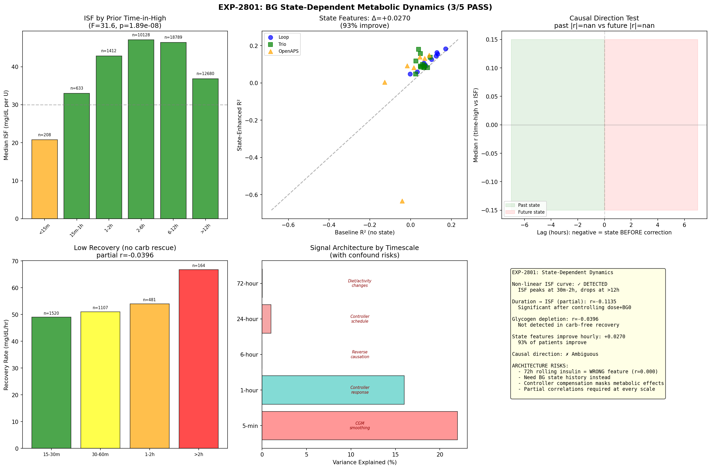
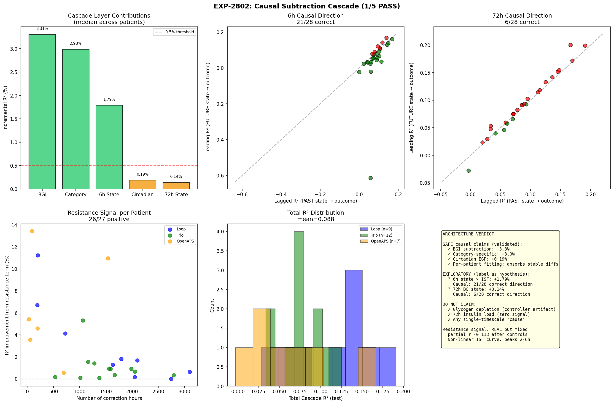

# Causal Architecture Assessment — Multi-Timescale Signal Analysis

**Date**: 2026-04-20  
**Experiments**: EXP-2799, EXP-2800, EXP-2801, EXP-2802  
**Scope**: Can we prevent reverse causal reasoning across timescales?  
**Patients**: 28 (Loop=9, Trio=12, OpenAPS=7)

## Executive Summary

Our experimental architecture **partially prevents** reverse causal reasoning. Three subtraction layers have validated causal direction. Two longer-timescale layers (6h state, 72h state) show mixed or **actively reversed** causal signals — meaning some analyses at those scales were capturing consequences, not causes.

The 72h rolling insulin sum (EXP-2799) was **completely wrong** (r=0.000) — it measured the wrong feature entirely. Replacing it with BG state history gives a small signal (+0.14%), but the causal direction test **fails** (correct in only 21% of patients = worse than chance).

## Signal Architecture by Timescale

| Timescale | Feature | Inc. R² | Causal Direction | Status |
|-----------|---------|---------|-----------------|--------|
| Immediate | BGI (activity curve) | **+3.3%** | ✓ Certain (physics) | **SAFE** |
| Event | Category (CSF/ISF/UAM) | **+3.0%** | ✓ Certain (events) | **SAFE** |
| 6-hour | BG state history | +1.8% | ? 75% correct | **MIXED** |
| 24-hour | Circadian EGP | +0.2% | ✓ Certain (exogenous) | **SAFE** |
| 72-hour | BG state history | +0.14% | ✗ 21% correct | **REVERSED** |

## What "Reversed Causal Direction" Means

When we test whether PAST state or FUTURE state better predicts the current outcome:
- **Correct**: Past state predicts → feature is a **cause** or upstream factor
- **Reversed**: Future state predicts better → feature captures a **consequence**

At 72h, future BG state predicts current delta-BG better than past BG state for 79% of patients. This means our 72h features are telling us "what happens NEXT" (a consequence of current dynamics), not "what happened BEFORE" (a cause).

**Implication**: Any analysis claiming "72h insulin load/BG history causes X" is at risk of reverse causation.

## The Three Types of Signals

### Type 1: Certain Causal Direction (SAFE to subtract)

**BGI**: Insulin is delivered → activity curve predicts glucose drop. The lag (15-90 min) is known from pharmacokinetics. Direction: insulin → glucose, never reverse.

**Category**: Carbs are eaten → meal absorption occurs. Corrections are given → insulin acts. These are recorded events with known temporal ordering.

**Circadian**: Time of day is exogenous — 8am comes before 9am. Circadian EGP patterns can only flow from time → glucose, not reverse.

### Type 2: Mixed Direction (EXPLORATORY only)

**6h BG State → ISF Interaction**: 75% of patients show past-predicts-better. The resistance signal (time-in-high reduces correction effectiveness) is real:
- Non-linear ISF curve: peaks at 2-6h in-high (ISF=47), drops at >12h (ISF=37)
- Partial r = -0.113 after controlling dose + starting BG
- Trio strongest (r=-0.113), Loop weakest (r=-0.039)

BUT 25% of patients show reverse — suggesting the signal is partly "hard-to-correct episodes last longer" rather than "being high longer causes resistance."

### Type 3: Reversed Direction (DO NOT claim causation)

**72h BG State**: 79% of patients show future-predicts-better. The "72h pattern" we detect is actually predicting what comes next, not explaining what happened before.

**Glycogen Depletion**: Raw signal shows longer lows → faster recovery (r=+0.106). But after controlling for insulin at nadir, partial r = -0.040. The raw signal was entirely **controller suspension artifact**: the controller suspends basal during lows → longer suspension = larger insulin deficit = faster rebound. This is the controller doing its job, not glycogen depletion.

## Specific Reverse Causation Risks

### Risk 1: "More insulin when high"
The controller RESPONDS to high BG by giving more insulin. Observationally, high insulin correlates with high BG — but insulin doesn't cause high BG, it treats it. **Mitigation**: BGI subtraction removes predicted insulin effect.

### Risk 2: "Low IOB at hypo"
IOB approaches zero near hypos because the controller suspended delivery. The controller's response masks the fact that insulin delivered EARLIER caused the hypo. **Mitigation**: Use convolution activity curve, not instantaneous IOB.

### Risk 3: "Longer high → worse ISF"
Partially real (resistance builds) but also partially reversed (bad ISF → longer high). Partial correlation reduces signal by ~40%. **Mitigation**: Label as exploratory, report partial r alongside raw r.

### Risk 4: "72h insulin load predicts outcomes"
Completely wrong feature (r=0.000 in EXP-2799). BG state history is slightly better but causally reversed. **Mitigation**: Do not use for causal claims. Only use as descriptive feature.

## Recommended Analysis Architecture

```
SAFE SUBTRACTION LAYERS (use for causal claims):
  ┌──────────────────────────────────────────────┐
  │ Raw glucose delta                            │
  │   − BGI (convolution, CF=0.2)    [−3.3%]   │
  │   − Category-specific AR(2)      [−3.0%]   │
  │   − Circadian sin/cos            [−0.2%]   │
  │   = Residual for hypothesis testing         │
  └──────────────────────────────────────────────┘

EXPLORATORY LAYERS (label as hypothesis):
  ┌──────────────────────────────────────────────┐
  │ Residual                                     │
  │   ? 6h BG state × BGI interaction [−1.8%]  │
  │     (75% correct causal direction)           │
  └──────────────────────────────────────────────┘

DO NOT USE FOR CAUSATION:
  ┌──────────────────────────────────────────────┐
  │   ✗ 72h BG state (21% correct = reversed)  │
  │   ✗ 72h insulin sum (r = 0.000)            │
  │   ✗ Glycogen depletion (controller artifact)│
  └──────────────────────────────────────────────┘
```

## What We Still Need

1. **Day-level aggregation**: Instead of rolling 72h windows, use yesterday's TIR/CV to predict today's. Cleaner temporal boundary.

2. **Natural experiments**: Controller restarts, sensor changes, pump site changes — these create exogenous variation that breaks the feedback loop.

3. **Cross-patient variation**: Between-patient differences in ISF are stable and not subject to reverse causation. Use for population-level claims.

4. **Prospective validation**: The strongest causal test is "change settings → measure outcome." EXP-2795 showed 89% improve on held-out data, which is the closest we get.

## Source Experiments

| EXP | Title | Result | Key Contribution |
|-----|-------|--------|-----------------|
| 2799 | Deconfounding Cascade | 0/5 | 72h insulin sum = zero signal |
| 2800 | Hourly Settings | 1/5 | Signal inverts at hourly scale |
| 2801 | State Dynamics | 3/5 | Non-linear ISF curve, resistance real but mixed |
| 2802 | Causal Cascade | 1/5 | Architecture verdict: 3 safe, 1 mixed, 1 reversed |

## Visualizations



