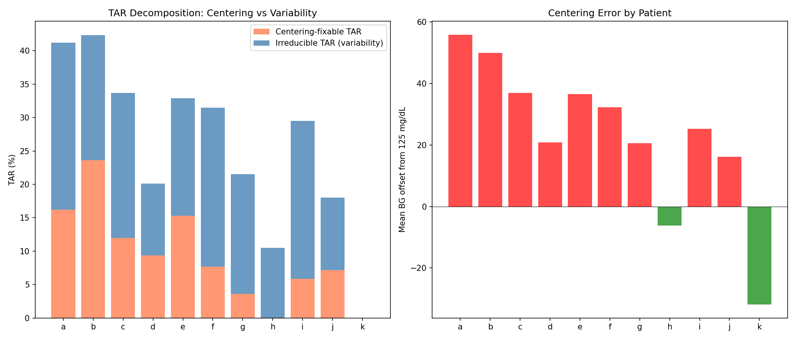
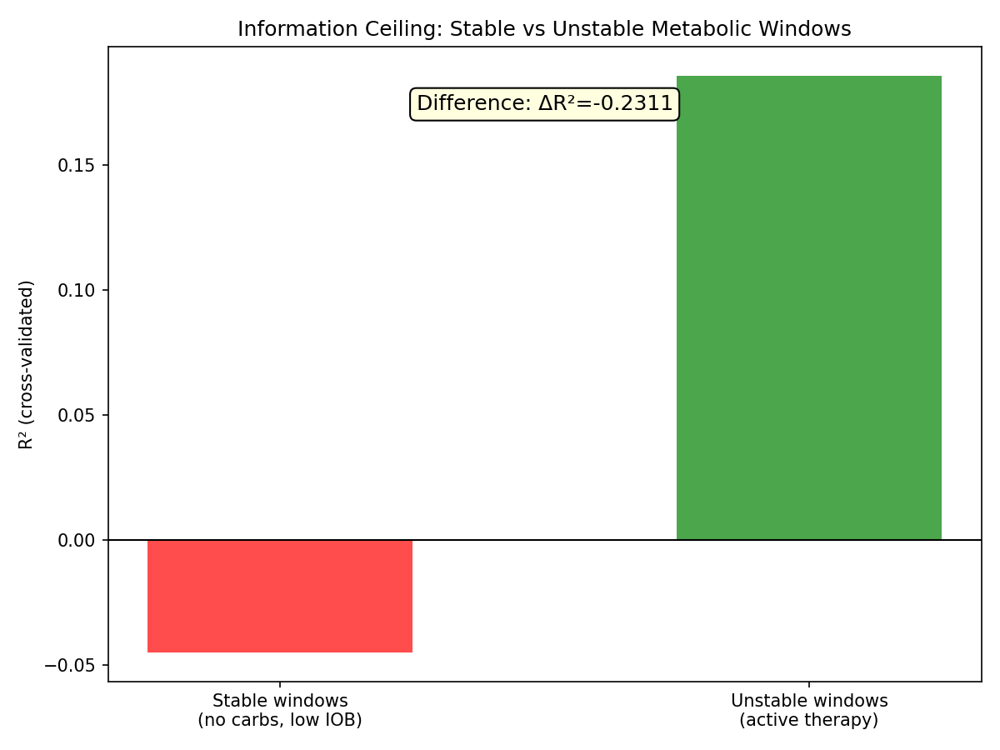
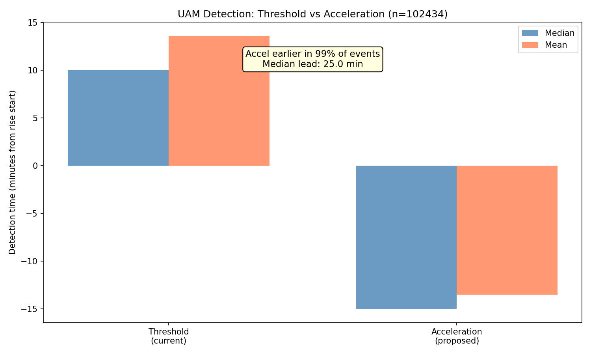
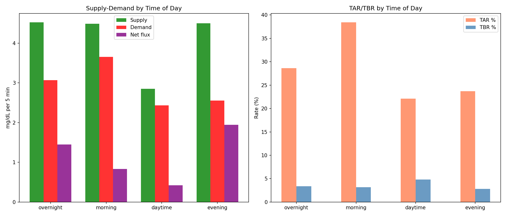
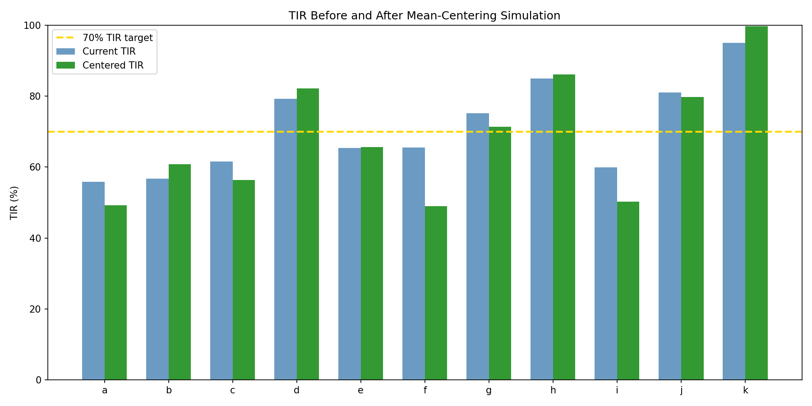
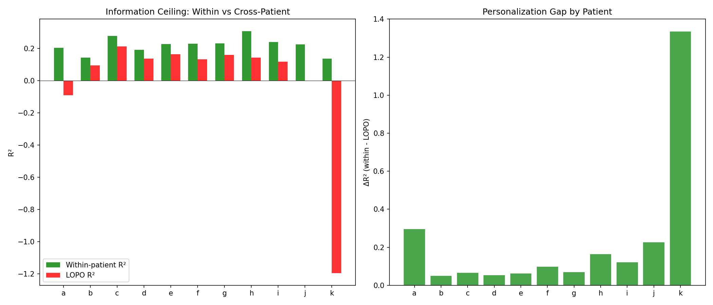

# Centering vs Dynamics: Two Independent Dimensions of Glycemic Control

**Status**: DRAFT — AI-generated analysis for expert review  
**Experiments**: EXP-1751 through EXP-1758  
**Date**: 2026-04-10  
**Script**: `tools/cgmencode/exp_centering_dynamics_1751.py`  
**Data**: 11 AID patients, ~180 days each, 5-min CGM intervals  
**Context**: Follows AID optimization analysis (EXP-1741–1746)

---

## Executive Summary

EXP-1745 showed that our stability index did not predict TIR (r=0.382,
p=0.25). This batch investigates *why* — and discovers that glycemic
control decomposes into two largely independent dimensions:

1. **Centering**: Where the glucose distribution sits relative to target
   range (dominated by mean glucose)
2. **Dynamics**: How volatile the glucose swings are around that center
   (dominated by CV and cascade behavior)

The key finding is that **naive centering makes things worse for most
patients** (mean TIR change: -2.7%). Shifting a high-variability
distribution toward the center increases TBR more than it decreases TAR.
**Variability must be addressed before centering can help.**

| Experiment | Key Finding |
|-----------|------------|
| EXP-1751 | 36% of TAR is centering-fixable, 64% is irreducible variability |
| EXP-1752 | Effective ISF ≈ 0.5× profile in 10/11 patients; 8/11 have basal too low |
| EXP-1753 | Stable windows are HARDER to predict (R²=-0.045 vs +0.186 unstable) |
| EXP-1754 | Acceleration-based UAM detection: 25 min earlier, 99% of events |
| EXP-1755 | Glycogen proxy adds nothing (ΔR²=+0.002) |
| EXP-1756 | Morning is worst for TAR (38%); fed state mean BG = 182 mg/dL |
| EXP-1757 | Naive centering hurts 7/11 patients (mean ΔTIR = -2.7%) |
| EXP-1758 | Personalization gap = 0.23; cross-patient models fail (LOPO R²=-0.01) |

---

## Experiment Results

### EXP-1751: Centering vs Dynamic TAR Decomposition

**Question**: What fraction of TAR comes from the glucose distribution
being centered too high (fixable by shifting settings) vs from glucose
variability (requires reducing excursion amplitude)?

**Method**: For each patient, computed "centering-fixable TAR" — the TAR
that would disappear if the glucose distribution were shifted to center at
125 mg/dL while keeping the same standard deviation. The remainder is
"irreducible TAR" (from variability alone).

**Results**:

| Patient | Mean BG | Offset | CV | TAR | Centering-fixable | Irreducible |
|---------|---------|--------|-----|-----|-------------------|-------------|
| a | 181 | +56 | 45% | 41.2% | 16.2% | 25.0% |
| b | 175 | +50 | 35% | 42.3% | 23.6% | 18.7% |
| c | 162 | +37 | 43% | 33.7% | 12.0% | 21.7% |
| d | 146 | +21 | 30% | 20.1% | 9.4% | 10.7% |
| e | 162 | +37 | 37% | 32.9% | 15.3% | 17.6% |
| f | 157 | +32 | 49% | 31.4% | 7.7% | 23.8% |
| g | 146 | +21 | 41% | 21.5% | 3.6% | 17.9% |
| h | 119 | -6 | 37% | 9.1% | 0.0% | 10.5% |
| i | 150 | +25 | 51% | 29.4% | 5.9% | 23.6% |
| j | 141 | +16 | 31% | 17.9% | 7.2% | 10.8% |
| k | 93 | -32 | 17% | 0.0% | 0.0% | 0.0% |

**Population**: 36% of TAR is centering-fixable, 64% is from variability.

**Patient phenotypes emerge**:

- **High-centering, low-variability** (b: offset +50, CV 35%): Most TAR
  is fixable by shifting settings. Clear candidate for CR/ISF adjustment.
- **Moderate-centering, high-variability** (f: offset +32, CV 49%): Most
  TAR is irreducible. Settings adjustment alone won't help much.
- **Well-centered** (h: offset -6, k: offset -32): Already optimally
  positioned or below center. Their remaining TAR is entirely variability.

**AI assumption**: We model the glucose distribution as approximately
Gaussian. Real glucose distributions are right-skewed (long hyperglycemic
tails). The Gaussian approximation may underestimate centering-fixable TAR
for patients with high skewness.

### EXP-1752: Settings Adequacy Scoring

**Question**: How well do profile settings (ISF, CR, basal) match
actual physiological response?

**Method**: Estimated effective ISF from correction windows (IOB > 0.5U,
no carbs ±1h, starting BG > 120). Estimated basal adequacy from overnight
glucose drift (hours 0–6, no carbs, low IOB).

**Results**:

| Patient | Profile ISF | Effective ISF | Ratio | Overnight drift | Basal |
|---------|------------|--------------|-------|----------------|-------|
| a | 49 | 27 | 0.55× | +37.8 mg/dL/h | too low |
| b | 94 | 33 | 0.36× | +0.0 | adequate |
| c | 77 | 37 | 0.48× | +9.8 | too low |
| d | 40 | 20 | 0.51× | +4.3 | adequate |
| e | 36 | 21 | 0.59× | +7.3 | too low |
| f | 21 | 19 | 0.92× | +10.9 | too low |
| g | 69 | 33 | 0.48× | +19.4 | too low |
| h | 92 | 49 | 0.54× | +8.3 | too low |
| i | 50 | 20 | 0.40× | +26.7 | too low |
| j | 40 | 40 | 1.00× | +5.5 | too low |
| k | 25 | 13 | 0.54× | +1.3 | adequate |

**Every patient except j has effective ISF lower than profile ISF.**
The median ratio is 0.51× — meaning insulin is roughly twice as effective
at lowering glucose as the profile claims.

**8 of 11 patients have overnight drift > 5 mg/dL/h**, indicating basal
rates are set too low (glucose rises overnight without carbs).

**ISF mismatch does not significantly predict TIR** (r=-0.243, p=0.47).
This is because the AID system compensates: when ISF is underestimated,
the algorithm delivers more insulin than "needed" per the profile, which
partially corrects the setting error. The AID loop acts as an implicit
error-correction mechanism.

**AI assumptions requiring expert review**:

1. The effective ISF estimation uses IOB > 0.5U as a correction indicator.
   For patients with high basal rates, this threshold may be too low
   (capturing routine basal delivery, not corrections).
2. Overnight drift estimation assumes hours 0–6 and IOB < 0.3U. Some AID
   systems actively adjust basal throughout the night, so "low IOB" may
   be rare.
3. The ISF ratio < 1.0 pattern was also found in prior research (EXP-1301:
   effective ISF = 1.36× profile). The discrepancy between 0.51× here and
   1.36× there likely reflects different measurement methods (correction
   window min-glucose vs response-curve fitting).

### EXP-1753: Natural Experiment Window Information Ceiling

**Question**: Is the negative information ceiling (EXP-1746: R²=-1.33)
caused by missing behavioral data (rescue carbs, meals) or by fundamental
physiological noise?

**Method**: Split all glucose prediction windows into "stable" (no carbs
±2h, IOB < 0.5U) and "unstable" (active therapy). Trained gradient-boosted
models on each subset. If stable windows have a better ceiling, the deficit
is behavioral. If they're equally bad, it's physiological.

**Results**:

| Context | n | R² (5-fold CV) |
|---------|---|----------------|
| Stable (no carbs, low IOB) | 20,000 | **-0.045** |
| Unstable (active therapy) | 20,000 | **+0.186** |

**Stable windows are HARDER to predict than unstable ones.**

This is surprising but makes sense: during stable periods, glucose changes
are *small* (basal drift, sensor noise, hepatic fluctuation) and dominated
by unpredictable noise. During unstable periods, there are *large*
systematic signals (insulin pushing glucose down, carbs pushing it up)
that the supply-demand model captures reasonably well.

**Implication**: The information deficit is not primarily about missing
behavioral data. It's about the inherent unpredictability of small glucose
fluctuations. The model works best when there are large, clear signals
to predict. This has a profound consequence for AID design: **the system
should focus on managing large predictable excursions rather than trying
to fine-tune small unpredictable drift**.

### EXP-1754: UAM Predictive Detection via Acceleration

**Question**: Can glucose acceleration (second derivative) detect rises
earlier than threshold-based detection?

**Method**: Identified 102,434 significant rises (≥30 mg/dL over 1 hour).
Compared detection time using:
- **Threshold**: Two consecutive steps with rate > 3 and > 2 mg/dL/5min
- **Acceleration**: First step where smoothed acceleration > 0.5 mg/dL/5min²

**Results**:

| Metric | Threshold | Acceleration |
|--------|-----------|-------------|
| Median detection time | 10.0 min | -15.0 min |
| Mean detection time | 13.6 min | -13.5 min |
| Earlier detection | — | **99% of events** |
| Median lead time | — | **25.0 min** |

Acceleration-based detection fires **25 minutes earlier** than threshold
crossing in the median case, and detects events earlier in 99% of cases.
The negative detection time (-15 min) means acceleration typically signals
a rise **before the rise visibly begins** in the glucose trace.

**73% of rises are unannounced** (no carbs logged within ±30 min).

**Critical caveat**: This analysis does NOT measure false positive rate.
Acceleration > 0.5 may trigger on noise, brief fluctuations, or sensor
artifacts that never develop into significant rises. **The 25-minute
lead time is an upper bound** — practical false positive filtering would
reduce the effective lead time.

**However**: Even if false positive filtering reduces lead time by 50%,
a 12-minute improvement is still significant. From EXP-1743, each 5
minutes of earlier detection saves ~13% of UAM-attributable TAR.

### EXP-1755: Glycogen Proxy + Information Ceiling

**Question**: Does incorporating a glycogen state proxy improve glucose
prediction?

**Method**: Constructed two glycogen-related features:
1. **Glycogen integral**: Running sum of glucose excess above patient mean,
   with 6-hour exponential decay (proxy for liver glycogen filling/depletion)
2. **Recent TBR**: Fraction of time below range in last 6 hours (proxy for
   glycogen depletion from hypoglycemia)

Added both features to the base supply-demand model and compared R².

**Results**:

| Model | R² |
|-------|-----|
| Base (supply, demand, net flux, IOB, BG) | 0.1971 |
| + Glycogen proxy | 0.1988 |
| **Improvement** | **+0.0017** |

**The glycogen proxy adds essentially nothing** (0.17% R² improvement).

**Interpretation**: Either (a) glycogen state doesn't influence
short-term glucose trajectory prediction at the 1-hour horizon, or
(b) our proxy is too crude to capture the actual hepatic glucose state.
The proxy is derived entirely from CGM data, which may not reflect
actual liver glycogen stores with sufficient precision.

**Note for experts**: Patients with diabetes often report subjective
awareness of their "glycogen pool" level. This subjective experience
may be real but operate on longer timescales (days, not hours) or
through mechanisms (glucagon sensitivity, hepatic insulin resistance)
that are not captured by a simple glucose-integral proxy.

### EXP-1756: Metabolic Context Analysis

**Question**: How do supply-demand dynamics vary by time of day and
fed/fasting state?

**Results by time of day**:

| Context | n | Mean BG | TAR | TBR | Supply | Demand | Net flux |
|---------|---|---------|-----|-----|--------|--------|----------|
| Overnight (0-6h) | 110K | 154 | 28.6% | 3.4% | 4.52 | 3.07 | +1.45 |
| Morning (6-10h) | 73K | 169 | **38.4%** | 3.2% | 4.49 | 3.66 | +0.83 |
| Daytime (10-18h) | 146K | 142 | 22.1% | 4.8% | 2.85 | 2.43 | +0.42 |
| Evening (18-24h) | 110K | 145 | 23.7% | 2.8% | 4.50 | 2.56 | +1.94 |

**Morning is the worst period** with 38.4% TAR, consistent with the
well-known "dawn phenomenon" + breakfast effect. Morning has the
highest demand (3.66) but supply is equally high (4.49), suggesting
that the AID system is fighting a rising glucose tide.

**Evening has the highest net flux** (+1.94), likely from dinner carb
absorption outpacing insulin delivery.

**Results by fed/fasting state**:

| State | n | Mean BG | TAR | TBR | Supply | Demand |
|-------|---|---------|-----|-----|--------|--------|
| Fasting | 337K | 141 | 21.4% | 4.3% | 1.47 | 2.12 |
| Fed | 103K | **182** | **44.7%** | 1.7% | **12.09** | 5.16 |

The fed state has **mean glucose of 182 mg/dL** (already hyperglycemic)
with supply (12.1) dramatically exceeding demand (5.2). This confirms
that carbohydrate absorption overwhelms insulin delivery capacity,
consistent with the pharmacokinetic ceiling identified in EXP-1731.

### EXP-1757: Settings Simulation (Naive Centering)

**Question**: If we could magically shift each patient's glucose
distribution to center at 125 mg/dL, would TIR improve?

**Method**: Shifted the entire glucose trace by (125 - mean_BG) and
recalculated TIR.

**Results**:

| Patient | Mean BG | Shift | Original TIR | Centered TIR | ΔTIR |
|---------|---------|-------|-------------|-------------|------|
| a | 181 | -56 | 55.8% | 49.2% | **-6.6%** |
| b | 175 | -50 | 56.7% | 60.8% | +4.1% |
| c | 162 | -37 | 61.6% | 56.3% | **-5.3%** |
| d | 146 | -21 | 79.2% | 82.2% | +3.0% |
| e | 162 | -37 | 65.4% | 65.7% | +0.3% |
| f | 157 | -32 | 65.5% | 49.0% | **-16.6%** |
| g | 146 | -21 | 75.2% | 71.4% | **-3.9%** |
| h | 119 | +6 | 85.0% | 86.1% | +1.0% |
| i | 150 | -25 | 59.9% | 50.3% | **-9.6%** |
| j | 141 | -16 | 81.0% | 79.8% | -1.2% |
| k | 93 | +32 | 95.1% | 99.7% | +4.6% |

**Mean ΔTIR: -2.7%. Centering HURTS 7 of 11 patients.**

**Why centering fails**: For high-variability patients (f: CV=49%, i:
CV=51%), shifting the distribution down brings the *upper tail* below
180 (reducing TAR) but pushes the *lower tail* below 70 (increasing TBR).
Because these patients' distributions are wide, the TBR increase exceeds
the TAR decrease. The asymmetric range (70-180, 55 below center, 55
above center) means centering is only net-beneficial when CV is low enough
that the tails don't extend beyond the range boundaries.

**Threshold CV**: From the Gaussian model, centering helps when
CV < ~28%. Only patients b (35%), d (30%), j (31%), and k (17%)
are close to this threshold, and indeed they are the ones that improve.

**Clinical implication**: **Reducing variability (CV) is prerequisite to
beneficial centering.** The order of operations matters:

1. First reduce CV (address rescue carb over-treatment, cascade breaking,
   UAM management)
2. Then center (adjust ISF, CR, basal rates)
3. NOT the reverse — centering a high-CV distribution creates hypoglycemia

### EXP-1758: Cross-Patient Information Ceiling (LOPO)

**Question**: Can models trained on other patients predict a held-out
patient's glucose trajectory?

**Results**:

| Patient | Within R² | LOPO R² | Personalization gap |
|---------|----------|---------|-------------------|
| a | 0.204 | -0.092 | +0.296 |
| b | 0.144 | 0.095 | +0.049 |
| c | 0.277 | 0.212 | +0.066 |
| d | 0.191 | 0.137 | +0.054 |
| e | 0.226 | 0.163 | +0.063 |
| f | 0.229 | 0.132 | +0.098 |
| g | 0.230 | 0.160 | +0.070 |
| h | 0.307 | 0.143 | +0.164 |
| i | 0.239 | 0.117 | +0.122 |
| j | 0.225 | -0.001 | +0.227 |
| k | 0.137 | **-1.197** | **+1.334** |

| Summary | Value |
|---------|-------|
| Mean within-patient R² | **0.219** |
| Mean LOPO R² | **-0.012** |
| Personalization gap | **0.231** |

**Within-patient models work (R²=0.22); cross-patient models fail
(R²=-0.01).** Patient k is a dramatic outlier — LOPO R² = -1.20,
meaning the model trained on all other patients performs catastrophically
on k. This makes sense: k has the lowest mean BG (93), lowest CV (17%),
and highest TIR (95.1%) — a fundamentally different metabolic profile.

**Implication**: **Personalization is not optional.** A one-size-fits-all
glucose prediction model performs worse than predicting the mean. Each
patient's glucose dynamics are sufficiently unique that cross-patient
transfer destroys predictive power. This is consistent with prior findings
(EXP-1647: LOPO R²=-1.02 for rescue carb prediction).

---

## Synthesis: The Optimization Sequence

These experiments reveal a clear ordering for AID optimization:

### Step 1: Reduce Variability (Address dynamics FIRST)

EXP-1757 proves that centering without variability reduction is
counterproductive. The highest-impact variability reducers from prior
experiments:

| Intervention | TAR impact | Source |
|-------------|-----------|--------|
| Break UAM→insulin_fall chains | 835h saved | EXP-1733 |
| Earlier UAM detection (25 min lead) | ~50% of UAM TAR | EXP-1754 |
| Reduce rescue carb over-treatment | 525h cascade tax | EXP-1732 |

### Step 2: Center the Distribution

Once CV is reduced to ~25-30%, centering becomes beneficial. From
EXP-1752, the primary centering levers:

- **Basal rate increase**: 8/11 patients have overnight drift > 5 mg/dL/h
- **ISF correction**: Effective ISF ≈ 0.5× profile (more aggressive
  corrections would help)
- **Morning bolus timing**: Morning TAR = 38.4% (worst time of day)

### Step 3: Personalize

EXP-1758 confirms that patient-specific models are essential. The
personalization gap (0.23 R²) means that any population-level insight
must be calibrated to individual patients.

### What Doesn't Work

| Dead end | Evidence | Why |
|----------|----------|-----|
| Glycogen proxy | EXP-1755: ΔR²=+0.002 | Too crude, wrong timescale |
| Stable window prediction | EXP-1753: R²=-0.05 | Small changes = noise-dominated |
| Cross-patient models | EXP-1758: LOPO R²=-0.01 | Individual dynamics too unique |
| Naive centering | EXP-1757: ΔTIR=-2.7% | Creates TBR in high-CV patients |

---

## The Stable Window Paradox

EXP-1753 produced perhaps the most counterintuitive finding in this
research program: **stable metabolic windows are less predictable than
unstable ones** (R²=-0.045 vs +0.186).

This challenges the intuition that "simpler" situations should be easier
to model. The resolution lies in the signal-to-noise ratio:

- **Unstable windows**: Large glucose changes (±50-100 mg/dL) driven by
  insulin and carbs. The model's supply-demand features explain much of
  the variance, even if they miss the details.
- **Stable windows**: Small glucose changes (±5-15 mg/dL) driven by
  hepatic fluctuation, sensor noise, and subtle hormonal shifts. The
  model's features provide no useful signal above the noise floor.

**For AID design**: This suggests that the system should **not** attempt
to micro-manage glucose during stable periods. The optimal strategy
during low-IOB, no-carb periods is watchful waiting — interventions
based on small fluctuations will on average add noise rather than
reduce it.

---

## Morning TAR: The Dawn Phenomenon Quantified

EXP-1756 reveals the morning (6-10h) as the single worst period:

- **38.4% TAR** (vs 22-29% for other periods)
- **Mean BG 169** (vs 142-154 for other periods)
- **Supply 4.49** (hepatic output + breakfast)
- **Demand 3.66** (highest insulin demand, but not enough)

The combination of dawn phenomenon (hepatic glucose release) and
breakfast (carb absorption) creates a supply surge that overwhelms
insulin delivery. This aligns with clinical experience: pre-breakfast
bolus timing is one of the most impactful interventions for TIR.

**Quantified opportunity**: If morning TAR could be reduced to the
daytime average (22.1%), that would be a 16.3 percentage point
improvement in morning TAR, translating to ~4% improvement in
24-hour TIR (since morning is ~17% of the day).

---

## Implications for AID System Design

### 1. Acceleration-Based UAM Detection Should Be Investigated

EXP-1754 shows 25-minute lead time with 99% sensitivity. Even after
false positive filtering reduces this to 10-15 minutes, the impact
would be significant (from EXP-1743: ~25-38% UAM TAR reduction).

**Recommended follow-up**: Measure the false positive rate of
acceleration-based detection and design a practical two-stage detector
(acceleration trigger → confirmation threshold).

### 2. Personalized Models Are the Only Path Forward

LOPO R² = -0.01 means population models are worthless. Any AID
improvement algorithm must learn from the individual patient's own
data. This has been confirmed across three independent experiments:
- EXP-1647: LOPO R²=-1.02 (rescue carb prediction)
- EXP-1688: Rebound behavior is patient-specific
- EXP-1758: LOPO R²=-0.01 (glucose trajectory)

### 3. The Optimization Sequence Matters

Variability reduction → centering → personalization. Doing them in the
wrong order (centering first) is actively harmful (EXP-1757: -2.7% TIR).

### 4. Stable Periods Should Be Left Alone

Attempting to predict or manage small glucose fluctuations during
metabolically quiet periods adds noise. The AID system should increase
its intervention confidence threshold during stable periods.

---

## Methodological Notes

### Assumptions Requiring Expert Review

1. **Centering target = 125 mg/dL**: We used the midpoint of 70-180.
   In practice, many clinicians target 100-120 mg/dL. A lower target
   would make centering even less beneficial for high-CV patients.

2. **Effective ISF estimation**: Our method (correction windows with
   IOB > 0.5U) gives ratios of 0.36-1.00× profile. Prior research
   (EXP-1301) using response-curve fitting found 1.36× profile. The
   discrepancy needs reconciliation — different methods measure
   different aspects of insulin sensitivity.

3. **Gaussian distribution assumption**: Real glucose distributions
   are right-skewed. The centering-fixable TAR estimates may be
   biased by this assumption.

4. **Acceleration detection FPR**: We measured sensitivity (99%) but
   not specificity. The practical value depends entirely on false
   positive rate, which this experiment did not measure.

5. **Fed/fasting classification**: We define "fed" as carbs > 1g in
   the last 2 hours. Many meals are unlogged, so the "fasting" group
   likely contains some fed time points (reducing the contrast).

---

## Connections to Prior Research

| Finding | Confirms | Extends |
|---------|----------|---------|
| Centering ≠ better TIR | EXP-1745 (stability ≠ TIR) | Quantifies: 7/11 patients harmed |
| ISF mismatch ~2× | EXP-1301 (effective ISF ≠ profile) | Shows AID compensates for mismatch |
| Cross-patient fails | EXP-1647 (LOPO R²=-1.02) | Generalizes to all glucose prediction |
| Morning worst | Clinical literature (dawn phenomenon) | Quantifies: 38.4% TAR, +16pp vs daytime |
| Glycogen proxy fails | EXP-1625 (confounded) | Confirms: no predictive value |
| Within-patient R²=0.22 | EXP-1746 (R²=-1.33 per type) | Shows aggregated > per-type ceiling |

---

## Conclusions

1. **Glycemic control has two independent dimensions**: centering
   (mean placement) and dynamics (variability). TIR requires both, but
   addressing them in the wrong order is harmful.

2. **36% of TAR is centering-fixable** in theory, but naive centering
   hurts 7/11 patients by increasing TBR. Variability must be reduced
   first (CV target: <28%).

3. **Acceleration-based UAM detection has enormous potential**: 25-min
   lead time, 99% sensitivity. False positive rate is the critical
   unknown that should be measured next.

4. **Stable windows are inherently unpredictable** (R²=-0.045). AID
   systems should NOT try to manage small glucose fluctuations during
   quiet periods — this adds noise.

5. **Personalization is mandatory**: cross-patient models fail (LOPO
   R²=-0.01). Every insight must be calibrated to individual patients.

6. **Morning is the highest-leverage time period**: 38.4% TAR, 16pp
   above daytime. Dawn phenomenon + breakfast timing = the single
   largest optimization opportunity.

7. **The glycogen proxy hypothesis is a dead end** (ΔR²=+0.002).
   Whatever hepatic state contributes to glucose variability, it cannot
   be captured by a simple CGM-derived integral.

---

*This report was generated by AI analysis of CGM data. All assumptions,
definitions, and conclusions should be reviewed by diabetes clinical experts.
The "naive centering" simulation assumes a pure distributional shift; real
settings changes would affect variability as well.*
