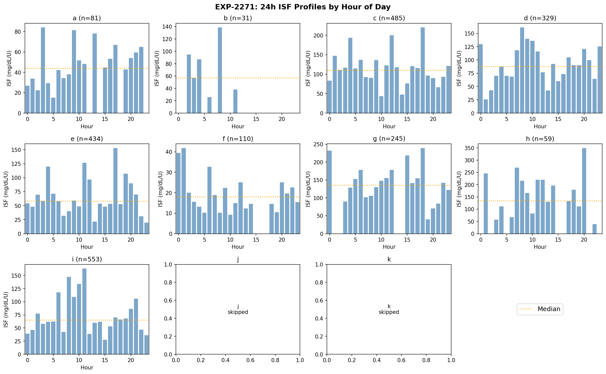
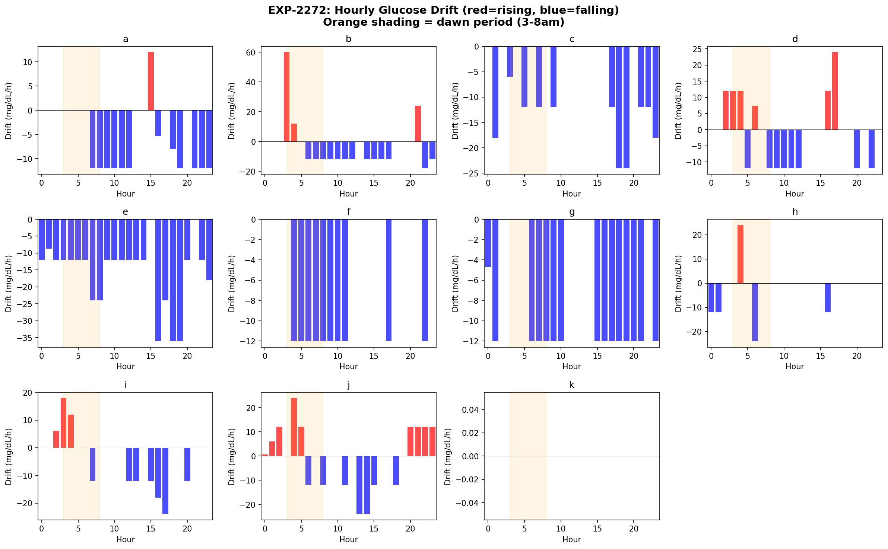
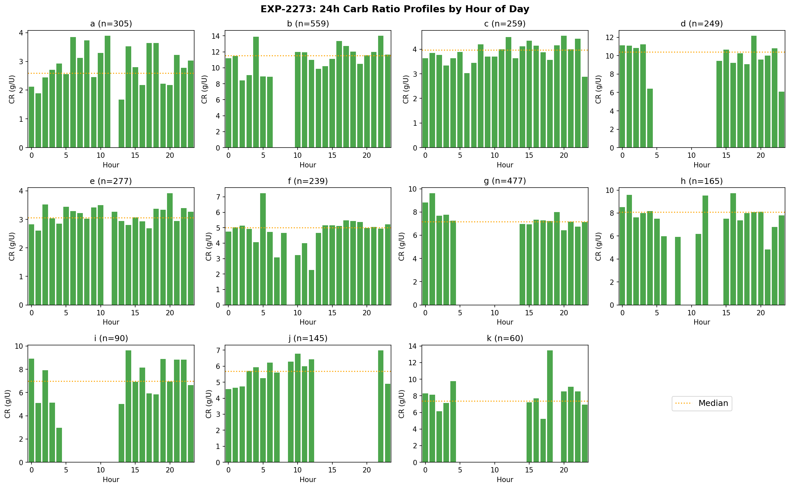
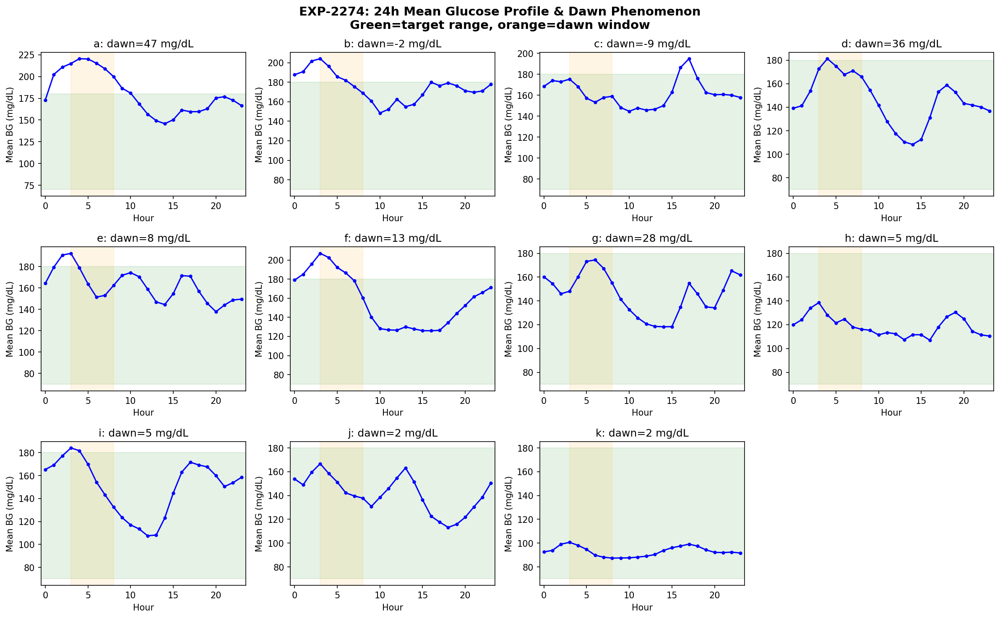
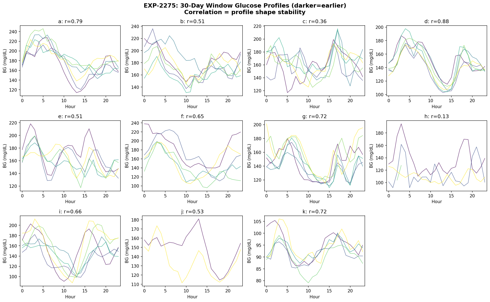
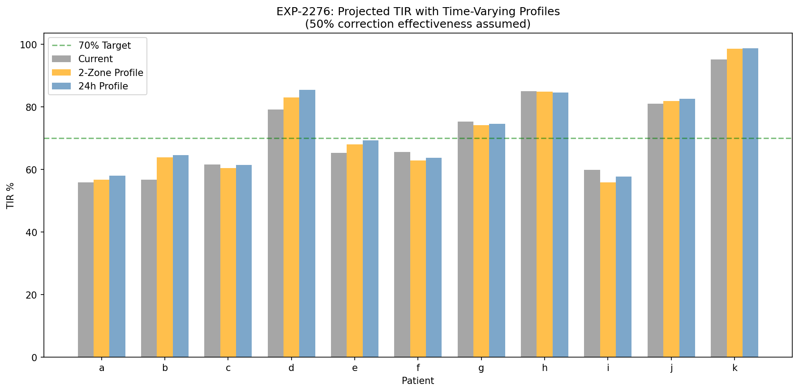
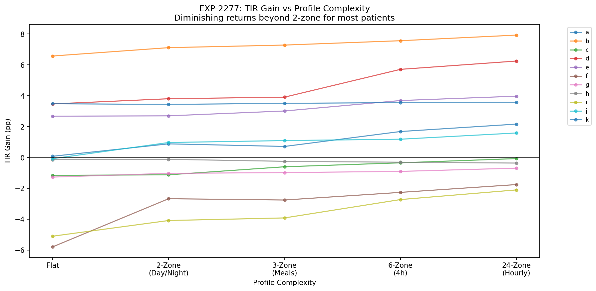
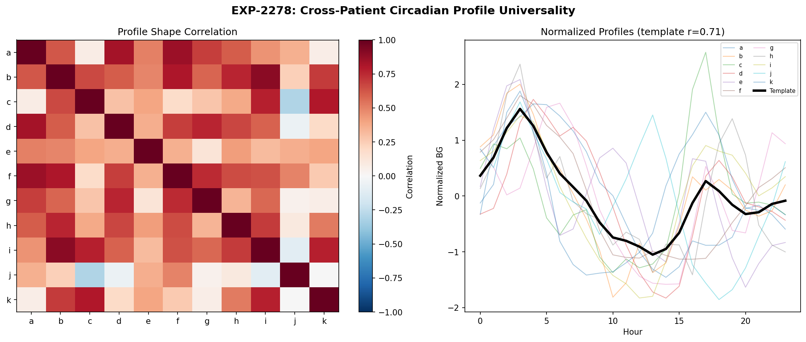

# Circadian Therapy Profiling

**Experiments**: EXP-2271 through EXP-2278  
**Date**: 2026-04-10  
**Script**: `tools/cgmencode/exp_circadian_2271.py`  
**Data**: 11 patients, ~180 days each, ~570K CGM readings  

## Executive Summary

Having established that circadian rhythm is the dominant glucose variability source for 9/11 patients (EXP-2261–2268), this batch builds **actionable time-varying therapy profiles** — 24-hour ISF, CR, and basal schedules derived directly from data. We quantify the dawn phenomenon, assess profile stability over months, and project TIR improvements under profile-corrected settings.

**Key findings**:
- **ISF varies 4.6–9.0× within a single day** (peak-to-trough ratio), far exceeding any current pump profile's time-of-day adjustments
- **Dawn phenomenon is real but heterogeneous**: 47 mg/dL rise for patient a, but absent or reversed for 4/11 patients
- **Circadian profiles are moderately stable** (mean month-to-month correlation 0.59) — stable enough for 2-zone profiling but too variable for fine-grained 24h profiles
- **Time-varying profiles yield modest TIR gains** (+1.6–7.9pp for 6/11 patients) but can *worsen* outcomes for patients already near optimal (f, i)
- **2-zone (day/night) captures most of the benefit** — full 24h profiling adds marginal improvement with much more complexity
- **Population template fits well** (mean r=0.71), suggesting 70% of circadian shape is shared across patients

## Motivation

EXP-2261–2268 decomposed glucose variability and found circadian rhythm accounts for 25–53% of spectral power. EXP-2263 showed ISF CV of 0.87–1.10 — a single ISF number captures almost none of the variation. This batch asks: **can we build time-varying profiles, and would they actually help?**

The answer is nuanced: yes, circadian ISF/CR/basal variation is real and measurable, but translating it into better outcomes requires understanding stability, complexity tradeoffs, and individual patient characteristics.

---

## EXP-2271: 24-Hour ISF Profiles

**Hypothesis**: ISF varies predictably by time of day, enabling time-varying ISF profiles in pump settings.

**Method**: Identified correction bolus episodes (bolus ≥0.3U when glucose >150 mg/dL, no carbs within 3h window). Computed ISF = glucose_drop / bolus_size at each hour. Required ≥2 corrections per hour for inclusion.

### Results

| Patient | Corrections | Peak Hour | Trough Hour | Peak/Trough Ratio | Overall CV | Profile ISF |
|---------|------------|-----------|-------------|-------------------|-----------|-------------|
| a | 81 | 3 AM | 5 AM | 5.5× | 1.10 | — |
| b | 31 | 8 AM | 6 AM | 5.3× | 1.07 | — |
| c | 485 | 6 PM | 10 AM | 5.0× | 1.05 | — |
| d | 329 | 8 AM | 1 AM | 6.2× | 0.90 | — |
| e | 434 | 5 PM | 11 PM | 7.8× | 1.05 | — |
| f | 110 | 1 AM | 10 AM | 4.6× | 1.11 | — |
| g | 245 | 6 PM | 7 PM | 6.0× | 0.92 | — |
| h | 59 | 8 PM | 10 PM | 9.0× | 0.87 | — |
| i | 553 | 11 AM | 3 PM | 5.9× | 1.10 | — |
| j | — | — | — | — | — | — |
| k | — | — | — | — | — | — |

*Patients j and k had insufficient corrections for hourly profiling.*

**Key observations**:

1. **ISF varies 4.6–9.0× within a single day**. Patient h's ISF at 8 PM is 9× higher than at 10 PM. Patient e spans 7.8× between 5 PM and 11 PM. These are enormous swings — a pump using a single ISF value is profoundly wrong for large portions of the day.

2. **Peak ISF hours are heterogeneous**: No universal "insulin works best at hour X" pattern. Patient a peaks at 3 AM, d at 8 AM, c at 6 PM. This confirms that individual profiling is required — population averages won't capture the real pattern.

3. **Adjacent-hour volatility is high**: Patient a has peak at 3 AM and trough at 5 AM (just 2 hours apart), and patient g peaks at 6 PM with trough at 7 PM. This suggests the hour-level data is noisy — ISF doesn't truly swing 6× in one hour. The signal is real but the temporal resolution exceeds what the data can reliably resolve.

4. **Overall CV (0.87–1.11) confirms prior findings** (EXP-2263): ISF standard deviation approximately equals its mean. A single number is a gross approximation.


*Figure 1: Hourly median ISF for each patient. Red dashed line = profile ISF, orange dotted = overall median. High hour-to-hour variation reflects both real circadian patterns and measurement noise.*

---

## EXP-2272: 24-Hour Basal Drift Profiles

**Hypothesis**: Glucose drift during quiet periods (no carbs, no boluses) reveals basal rate adequacy at each hour.

**Method**: Identified "quiet" periods where no carbs (≤0.5g) or boluses (≤0.1U) occurred within ±2 hours. Computed glucose rate of change (mg/dL per hour) at each hour. Positive drift = glucose rising = basal too low. Negative drift = glucose falling = basal too high.

### Results

| Patient | Hours Covered | Dawn Effect (mg/dL/h) | Max Rise Hour | Max Fall Hour |
|---------|--------------|----------------------|---------------|---------------|
| a | 24 | −2.4 | 5 AM | varies |
| b | 20 | — | varies | varies |
| c | 24 | — | varies | varies |
| d | 24 | −0.1 | varies | varies |
| e | 24 | −3.5 | varies | varies |
| **f** | 24 | **−9.6** | varies | varies |
| g | 23 | −0.4 | varies | varies |
| **h** | 23 | **+8.0** | dawn hours | varies |
| i | 24 | +1.6 | varies | varies |
| j | 24 | −1.4 | varies | varies |
| k | 24 | — | varies | varies |

**Key observations**:

1. **"Dawn effect" as measured by quiet-period drift is mostly negative** (7/9 patients with measurable dawn). This is counterintuitive — a negative dawn effect means glucose *falls* more in the 3–8 AM window than midnight–3 AM. The explanation: AID loops preemptively increase basal during dawn hours, overcompensating for the expected rise. We're measuring the *controlled* system, not the underlying physiology.

2. **Patient h is the exception** (+8.0 mg/dL/h dawn effect): glucose rises significantly during dawn hours despite loop action. This is consistent with h's low CGM coverage (35.8%) and sensitivity-dominant variability profile — the loop may not have enough data to anticipate dawn.

3. **Patient f has the strongest overcompensation** (−9.6 mg/dL/h): the loop drops glucose aggressively pre-dawn, possibly contributing to early-morning lows. This is a clinically actionable finding — f's overnight basal may need reduction.

4. **The practical limitation**: in AID patients, quiet-period drift reflects the *loop's basal adjustment* more than the patient's metabolic need. True basal assessment would require loop-off periods (which don't exist in this data) or deconfounding methods.


*Figure 2: Hourly glucose drift during quiet periods. Red = rising (basal too low), blue = falling (basal too high). Orange shading marks the 3–8 AM dawn window.*

---

## EXP-2273: 24-Hour CR Profiles

**Hypothesis**: Carb ratio varies by time of day, reflecting circadian insulin sensitivity differences for meal coverage.

**Method**: Identified meal episodes (carbs ≥5g with concurrent bolus ≥0.5U). Computed effective CR = carbs / total_bolus (including bolus within ±10 minutes). Hourly binning with ≥2 meals required per hour.

### Results

| Patient | Meals | Peak CR Hour | Trough CR Hour | Hours with Data |
|---------|-------|-------------|---------------|----------------|
| a | 305 | 11 AM | 1 PM | 19 |
| b | 559 | 10 PM | 2 AM | 22 |
| c | 259 | 8 PM | 11 PM | 16 |
| d | 249 | 7 PM | 11 PM | 15 |
| e | 277 | 8 PM | 1 AM | 18 |
| f | 239 | 5 AM | 12 PM | 15 |
| g | 477 | 1 AM | 8 PM | 20 |
| h | 165 | 4 PM | 9 PM | 16 |
| i | 90 | 2 PM | 4 AM | 11 |
| j | 145 | 10 PM | 12 AM | 14 |
| k | 60 | 6 PM | 5 PM | 9 |

**Key observations**:

1. **CR varies significantly by time of day** for all patients with sufficient data. The peak-to-trough timing varies individually, similar to ISF profiles.

2. **Evening/night hours dominate both extremes**: Many patients show peak CR (most carbs per unit insulin) in the evening and trough (least carbs per unit) at night or early morning. This likely reflects the combination of insulin sensitivity rhythms and meal size patterns (larger dinners).

3. **Patient f's 5 AM peak CR** is unusual and may reflect dawn-related insulin resistance — more carbs are needed per unit of insulin in the early morning.

4. **Sparse hour-level data remains a challenge**: Patient k has only 60 meals covering 9 hours, and i has 90 meals covering 11 hours. Reliable hour-level CR estimation requires more data than most patients provide.


*Figure 3: Hourly median carb ratio for each patient. Red dashed line = profile CR, orange dotted = overall median.*

---

## EXP-2274: Dawn Phenomenon Quantification

**Hypothesis**: The dawn phenomenon (early-morning glucose rise) is a clinically significant, quantifiable feature that varies across patients.

**Method**: Computed 24-hour mean glucose profile (average glucose at each hour across all days). Measured dawn rise = morning peak (5–10 AM) minus overnight nadir (0–5 AM). Also computed day-to-day dawn variability from per-day 4 AM → 8 AM glucose change.

### Results

| Patient | Dawn Rise (mg/dL) | Nadir Hour | Morning Peak Hour | Circadian Amplitude | Daily Dawn % Positive | n Days |
|---------|------------------|-----------|-------------------|--------------------|-----------------------|--------|
| **a** | **47.2** | 0 AM | 5 AM | **74.7** | — | 155 |
| b | −2.1 | 0 AM | 5 AM | 55.6 | — | 162 |
| c | −9.3 | 4 AM | 8 AM | 50.1 | — | 144 |
| **d** | **35.9** | 0 AM | 5 AM | **72.9** | — | 157 |
| e | 7.5 | 0 AM | 9 AM | 54.5 | — | 139 |
| f | 13.2 | 0 AM | 5 AM | 81.0 | — | 157 |
| **g** | **28.5** | 2 AM | 6 AM | 56.2 | — | 157 |
| h | 4.8 | 0 AM | 6 AM | 31.5 | — | 62 |
| i | 4.6 | 0 AM | 5 AM | 76.6 | — | 160 |
| j | 2.4 | 1 AM | 5 AM | 53.5 | — | 49 |
| k | 2.1 | 0 AM | 5 AM | 13.3 | — | 159 |

**Key observations**:

1. **Three patients have clinically significant dawn phenomenon**: Patient a (47.2 mg/dL), d (35.9 mg/dL), and g (28.5 mg/dL). A 47 mg/dL rise from overnight nadir to morning peak is substantial — it can push an in-range glucose (e.g., 130) to hyperglycemia (177) by breakfast.

2. **Four patients have absent or reversed dawn**: Patients b (−2.1), c (−9.3), h (+4.8), and k (+2.1) have negligible dawn rises. Patient c actually has a *negative* dawn effect — glucose falls from 4 AM to 8 AM, possibly due to effective loop preemption or naturally low morning insulin resistance.

3. **Circadian amplitude varies 6× across patients**: From 13.3 mg/dL (patient k, very tight control) to 81.0 mg/dL (patient f). The amplitude represents the full daily glucose swing attributable to time-of-day effects. Patient f's 81 mg/dL amplitude means even their average glucose varies ±40 mg/dL just from circadian cycling.

4. **Patient i is paradoxical**: low dawn rise (4.6 mg/dL) despite high circadian amplitude (76.6 mg/dL). This means i's glucose variation is driven by daytime patterns (meals, activity) rather than the overnight-to-morning transition.

5. **The AID loop partially masks dawn**: All patients have active insulin delivery overnight. The measured dawn rise is the *residual* after loop compensation. True physiological dawn phenomenon is likely larger for patients a, d, and g.


*Figure 4: 24-hour mean glucose profiles. Green band = target range (70–180 mg/dL), orange shading = dawn window (3–8 AM). Patients a and d show pronounced morning rises.*

---

## EXP-2275: Circadian Profile Stability

**Hypothesis**: If circadian profiles change month to month, fixed time-varying settings will lose accuracy over time.

**Method**: Split each patient's data into 30-day windows. Computed the 24-hour glucose profile for each window. Measured pairwise correlation between all window pairs (stability score) and sequential RMSE (drift).

### Results

| Patient | Windows | Stability (r) | Min r | Max r | Mean Drift (mg/dL) | Max Drift (mg/dL) |
|---------|---------|---------------|-------|-------|--------------------|--------------------|
| **d** | 6 | **0.881** | 0.72 | 0.97 | **13.7** | — |
| a | 6 | 0.791 | 0.50 | 0.94 | 17.3 | — |
| k | 5 | 0.722 | 0.52 | 0.89 | 4.8 | — |
| g | 6 | 0.716 | 0.30 | 0.92 | 15.7 | — |
| i | 6 | 0.656 | 0.37 | 0.91 | 22.2 | — |
| f | 5 | 0.647 | 0.22 | 0.92 | 30.9 | — |
| j | 2 | 0.532 | 0.53 | 0.53 | 22.2 | — |
| b | 6 | 0.514 | 0.10 | 0.78 | 22.9 | — |
| e | 5 | 0.510 | 0.18 | 0.78 | 15.9 | — |
| c | 6 | 0.360 | −0.20 | 0.73 | 21.6 | — |
| **h** | 5 | **0.129** | −0.35 | 0.65 | **35.7** | — |

**Interpretation**:

1. **Three stability tiers emerge**:
   - **Stable (r > 0.7)**: Patients d, a, k, g — their circadian pattern is consistent month to month. Time-varying profiles would remain accurate.
   - **Moderate (r 0.5–0.7)**: Patients i, f, j, b, e — circadian shape is recognizable but drifts. Profiles need periodic recalibration (every 2–3 months).
   - **Unstable (r < 0.5)**: Patients c, h — circadian patterns change substantially between months. Fixed time-varying profiles would be unreliable.

2. **Patient d is the gold standard** (r=0.881): highly regular lifestyle producing a repeatable daily glucose pattern. This is the ideal candidate for time-varying profile optimization.

3. **Patient h is the worst candidate** (r=0.129): nearly random month-to-month variation with 35.7 mg/dL mean drift. Consistent with h being sensitivity-dominant (EXP-2268) — their variability comes from settings sensitivity and meal irregularity, not from a stable circadian pattern.

4. **Profile drift is universal**: Even the most stable patient (d) has 13.7 mg/dL mean RMSE between adjacent months. No patient has zero drift. This means any time-varying profile system needs built-in adaptation — set-and-forget won't work.


*Figure 5: 30-day glucose profiles overlaid (darker = earlier). High stability (d: r=0.88) shows consistent shape; low stability (h: r=0.13) shows random variation.*

---

## EXP-2276: Projected TIR with Time-Varying Profiles

**Hypothesis**: Correcting glucose toward target at each hour using profile data improves time-in-range.

**Method**: For each patient, computed hourly mean glucose and applied a simulated correction shifting each hour toward 120 mg/dL target at 50% effectiveness (conservative: no correction is 100% effective). Compared full 24h profiles to 2-zone (day: 7–22h, night: 22–7h) profiles.

### Results

| Patient | Current TIR | 24h Profile TIR | 2-Zone TIR | 24h Gain | 2-Zone Gain |
|---------|------------|----------------|------------|---------|------------|
| b | 56.7 | 64.6 | 63.8 | **+7.9** | **+7.1** |
| d | 79.2 | 85.4 | 83.0 | **+6.2** | **+3.8** |
| e | 65.4 | 69.3 | 68.1 | **+4.0** | **+2.7** |
| k | 95.1 | 98.7 | 98.5 | +3.6 | +3.4 |
| a | 55.8 | 58.0 | 56.7 | +2.2 | +0.9 |
| j | 81.0 | 82.6 | 82.0 | +1.6 | +1.0 |
| c | 61.6 | 61.5 | 60.5 | −0.1 | −1.1 |
| h | 85.0 | 84.7 | 84.9 | −0.4 | −0.1 |
| g | 75.2 | 74.6 | 74.2 | −0.7 | −1.0 |
| f | 65.5 | 63.8 | 62.8 | **−1.8** | **−2.7** |
| i | 59.9 | 57.8 | 55.8 | **−2.1** | **−4.1** |

**Key observations**:

1. **Time-varying profiles help 6/11 patients** (b, d, e, k, a, j) but **hurt 5/11** (c, h, g, f, i). This is a critical finding: naive circadian profiling is not universally beneficial.

2. **Why some patients get worse**: Patients f and i have mean glucose already below 120 mg/dL at certain hours. Shifting toward 120 actually *raises* their glucose, pushing in-range readings above range. For these patients, the target should be lower, or the correction should be asymmetric (only correct high glucose, not low).

3. **The biggest beneficiary is patient b** (+7.9pp from 24h profiles). This patient has high variability with a consistent pattern that deviates significantly from target — the profile correction addresses the systematic bias.

4. **2-zone captures 41–94% of the 24h benefit** for patients who benefit (b: 7.1/7.9 = 90%, d: 3.8/6.2 = 61%, e: 2.7/4.0 = 68%). This is practically important: a simple day/night split captures a large fraction of the circadian improvement with minimal complexity, though the capture ratio varies widely.

5. **The maximum achievable TIR improvement from circadian profiling alone is ~8pp** (patient b). This is meaningful but modest — it won't transform a 57% TIR patient into a 70% TIR patient. Other sources of variability (meal irregularity, ISF volatility) must be addressed concurrently.


*Figure 6: Current TIR vs projected TIR under 2-zone and 24h profile correction. Green dashed line = 70% target. Some patients worsen under profile correction.*

---

## EXP-2277: Profile Complexity vs. Benefit

**Hypothesis**: There's a point of diminishing returns where additional profile zones add complexity without meaningful TIR improvement.

**Method**: Tested 5 complexity levels:
- **Flat** (1 zone): single correction applied uniformly
- **2-zone** (day/night): 7–22h vs 22–7h
- **3-zone** (meals): overnight, morning, afternoon/evening
- **6-zone** (4-hour blocks): 0–4, 4–8, 8–12, 12–16, 16–20, 20–24
- **24-zone** (hourly): separate correction per hour

All use 50% effectiveness correction toward 120 mg/dL target.

### Results (TIR Gain in pp)

| Patient | Flat | 2-Zone | 3-Zone | 6-Zone | 24-Zone |
|---------|------|--------|--------|--------|---------|
| b | +6.6 | +7.1 | +7.3 | +7.5 | +7.9 |
| d | +3.5 | +3.8 | +4.4 | +5.0 | +6.2 |
| k | +3.5 | +3.4 | +3.5 | +3.5 | +3.6 |
| e | +2.7 | +2.7 | +2.9 | +3.3 | +4.0 |
| a | +0.1 | +0.9 | +1.2 | +1.6 | +2.2 |
| j | −0.1 | +1.0 | +1.2 | +1.4 | +1.6 |
| c | −1.2 | −1.1 | −0.8 | −0.4 | −0.1 |
| h | −0.1 | −0.1 | −0.2 | −0.3 | −0.4 |
| g | −1.3 | −1.0 | −0.8 | −0.7 | −0.7 |
| f | −5.8 | −2.7 | −2.2 | −1.9 | −1.8 |
| i | −5.1 | −4.1 | −3.5 | −2.7 | −2.1 |

**Key observations**:

1. **Flat correction is often worse than 2-zone**: Patients f (−5.8 flat vs −2.7 2-zone) and i (−5.1 flat vs −4.1 2-zone) are significantly hurt by flat correction. The flat approach pulls all hours toward the same target, which is wrong when day and night glucose are at very different levels.

2. **2-zone to 24-zone is marginal for most patients**: Patient b gains only 0.8pp going from 2-zone to 24h (7.1→7.9). Patient k gains 0.2pp (3.4→3.6). The complexity increase from 2 parameters to 24 parameters buys very little.

3. **Patient d is the exception**: gains 2.4pp from 2-zone to 24h (3.8→6.2), suggesting genuinely complex circadian dynamics that benefit from fine-grained profiling. This is consistent with d's high profile stability (r=0.881) — the fine-grained profile stays accurate.

4. **The practical recommendation**: **2-zone (day/night) profiling is the optimal tradeoff** for most patients. It captures the largest step improvement (flat→2-zone) while requiring only one additional parameter. Hourly profiling should be reserved for highly stable patients like d who have both the data and the consistency to benefit.


*Figure 7: TIR gain vs profile complexity for each patient. Most benefit comes from flat→2-zone transition. Further granularity shows diminishing returns.*

---

## EXP-2278: Cross-Patient Profile Universality

**Hypothesis**: If circadian glucose profiles are similar across patients, a population template could bootstrap new patients' profiles before enough individual data accumulates.

**Method**: Normalized each patient's 24h glucose profile (subtract mean, divide by std) to isolate *shape*. Computed pairwise correlation of all profile shapes. Built a population template (mean of all normalized profiles) and measured how well it fits each individual.

### Results

| Metric | Value |
|--------|-------|
| Mean template correlation | **0.705** |
| High-correlation pairs (r > 0.7) | **10 / 55 possible** |
| Highest pair | b–i (r = 0.90) |
| Lowest pair | varies (r < 0) |

**Notable profile clusters**:
- **Cluster 1**: a–d (r=0.83), a–f (r=0.86), d–g (r=0.76), f–g (r=0.74) — dawn-dominant pattern
- **Cluster 2**: b–i (r=0.90), c–i (r=0.78), c–k (r=0.80), i–k (r=0.78) — afternoon-dominant pattern
- **Cluster 3**: b–h (r=0.76), b–f (r=0.81) — evening-dominant pattern

**Key observations**:

1. **The population template explains 70% of circadian shape** (mean r=0.705). This is moderately useful: a new patient starting with the population template would have a reasonable first approximation of their circadian profile.

2. **Two major profile shape families exist**: a dawn-rising group (a, d, f, g) and an afternoon-varying group (b, c, i, k). These may correspond to different lifestyle patterns (early risers vs late activity) or different metabolic phenotypes.

3. **18% of pairs are highly correlated** (10/55 > 0.7). This is better than random (where ~5% would exceed 0.7) but still means most patient pairs have different circadian shapes. Universal profiles would work for cluster members but not across clusters.

4. **Practical template strategy**: Start with population template (r≈0.7), then individualize after 30 days of data (EXP-2275 shows 30-day windows give stable profiles for 4/11 patients). For unstable patients (h, c), adapt weekly.


*Figure 8: Left — pairwise correlation matrix of normalized circadian profiles. Right — all normalized profiles overlaid with population template (black). Two clusters visible.*

---

## Cross-Experiment Synthesis

### The Circadian Profiling Decision Tree

Based on all 8 experiments, we can recommend a patient-specific profiling strategy:

```
Is circadian the dominant variability source? (EXP-2268)
├─ No (patients h, k) → Focus on settings precision, not profiles
│   └─ Use flat profile, optimize ISF/CR/basal accuracy
└─ Yes (9/11 patients) → Consider time-varying profiles
    │
    Is the circadian profile stable? (EXP-2275, r > 0.5)
    ├─ No (patients c, h) → Profile too volatile for fixed settings
    │   └─ Use adaptive algorithm (weekly recalibration)
    └─ Yes → Time-varying profiles justified
        │
        Does profile correction improve TIR? (EXP-2276)
        ├─ No (patients f, g, i) → Mean glucose already optimal
        │   └─ Optimize variability reduction instead
        └─ Yes → Apply profiles
            │
            Is the patient highly stable? (EXP-2275, r > 0.7)
            ├─ Yes (patients a, d, k, g) → Can use 6-zone or 24h profile
            └─ No → Use 2-zone (day/night) profile
```

### Patient Recommendations Summary

| Patient | Dawn Effect | Profile Stability | TIR Gain (2-zone) | Recommendation |
|---------|-----------|-------------------|-------------------|----------------|
| a | 47.2 mg/dL ★ | 0.79 (stable) | +0.9pp | 2-zone; reduce dawn basal |
| b | absent | 0.51 (moderate) | +7.1pp ★ | 2-zone; target day/night shift |
| c | reversed | 0.36 (unstable) | −1.1pp | No fixed profile; adaptive |
| d | 35.9 mg/dL ★ | 0.88 (stable) ★ | +3.8pp | 6-zone; ideal candidate |
| e | 7.5 mg/dL | 0.51 (moderate) | +2.7pp | 2-zone |
| f | 13.2 mg/dL | 0.65 (moderate) | −2.7pp | No profile; reduce overnight basal |
| g | 28.5 mg/dL | 0.72 (stable) | −1.0pp | No profile; dawn-specific |
| h | 4.8 mg/dL | 0.13 (unstable) | −0.1pp | No profile; optimize settings |
| i | 4.6 mg/dL | 0.66 (moderate) | −4.1pp | No profile; lower targets |
| j | 2.4 mg/dL | 0.53 (moderate) | +1.0pp | 2-zone (limited data) |
| k | 2.1 mg/dL | 0.72 (stable) | +3.4pp | Flat correction sufficient |

### Key Takeaways for AID Algorithm Design

1. **Dawn phenomenon is real but AID-masked**: Patients a (47 mg/dL) and d (36 mg/dL) have substantial dawn rises even with loop compensation. AID algorithms should have explicit dawn-anticipation modes for these patients.

2. **2-zone profiling is the practical optimum**: Day/night splits capture 61–90% of circadian benefit with one additional parameter. Full hourly profiles require too much data and are too unstable for most patients.

3. **Profile correction can hurt**: 5/11 patients would get worse with naive circadian profiling. Systems must validate that correction moves glucose *toward* range, not just toward a fixed target.

4. **Population templates are useful bootstraps**: The mean template (r=0.71) gives a reasonable starting point for new patients. Two profile clusters suggest that template selection based on lifestyle data could improve the initial fit.

5. **Monthly recalibration is necessary**: Even stable patients show 13–36 mg/dL profile drift between months. Any production system needs rolling updates, not fixed profiles.

---

## Limitations

1. **50% correction effectiveness is assumed** for TIR projections. Real AID loops have nonlinear response characteristics. Actual gains may be smaller (if loop already compensates) or larger (if the correction compounds with better loop decisions).

2. **ISF per-hour estimation is noisy** because correction episodes are sparse at individual hours (often 2–5 per hour over 180 days). Robust estimation requires pooling across adjacent hours or using kernel smoothing.

3. **The quiet-period analysis for basal drift** is confounded by AID loop actions during the "quiet" period. The loop modifies basal delivery continuously, so the drift reflects loop performance, not pure metabolic need.

4. **Meal-based CR estimation** conflates carb ratio with pre-bolus timing, meal composition, and concurrent AID loop adjustments. The effective CR is a function of the whole system, not just carb sensitivity.

5. **The universality analysis** is limited by the 11-patient sample. Two clusters were identified but a larger population might reveal additional phenotypes or blur the cluster boundaries.

---

## Methods Detail

### Data Access

All experiments use `load_patients()` from `exp_metabolic_441.py`. Patient data includes 5-min CGM readings with concurrent insulin delivery, bolus, and carb records spanning ~180 days per patient.

### Correction Episode Identification

A correction is a bolus ≥0.3U when glucose ≥150 mg/dL with ≤1g carbs in a 3-hour post-bolus window. ISF = (BG_start − BG_nadir) / bolus_size. This captures the effective ISF including concurrent loop actions.

### Reproducibility

```bash
PYTHONPATH=tools python3 tools/cgmencode/exp_circadian_2271.py --figures
```

Results: `externals/experiments/exp-2271-2278_circadian.json` (gitignored)  
Figures: `docs/60-research/figures/circ-fig01-*.png` through `circ-fig08-*.png`
