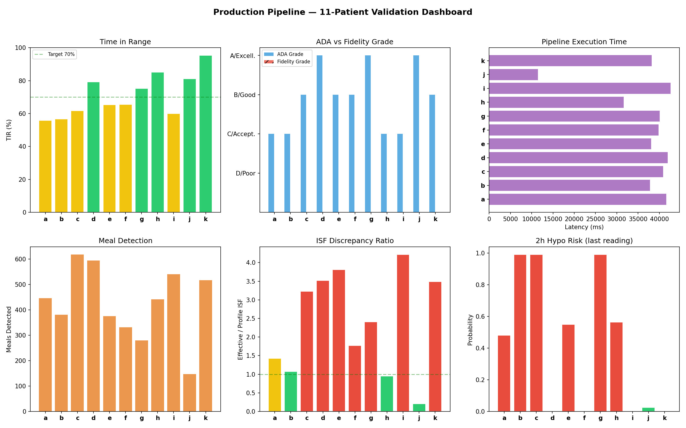
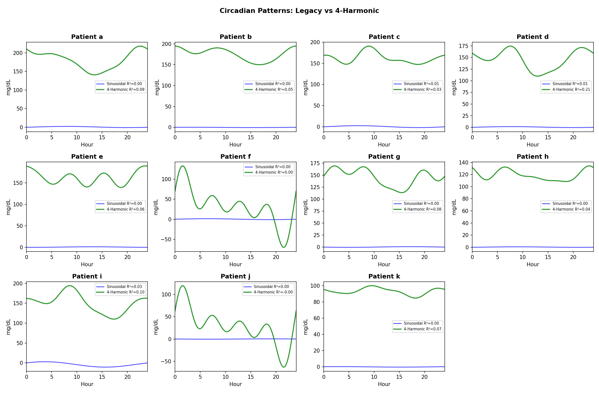
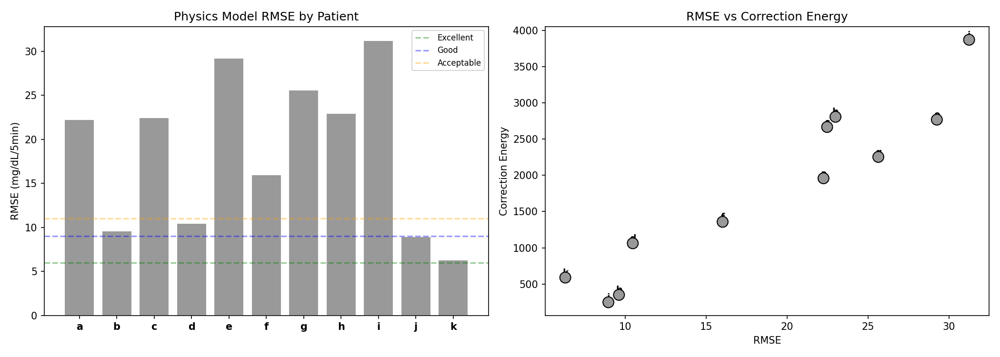
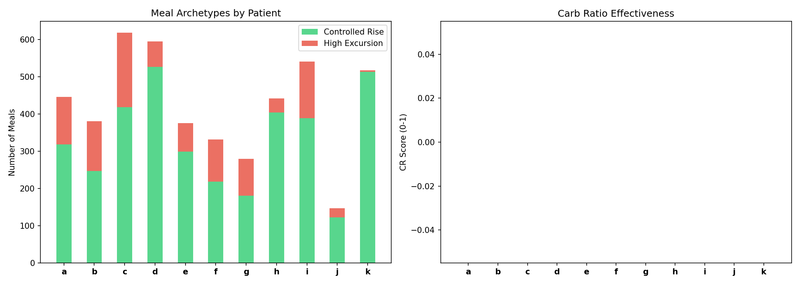
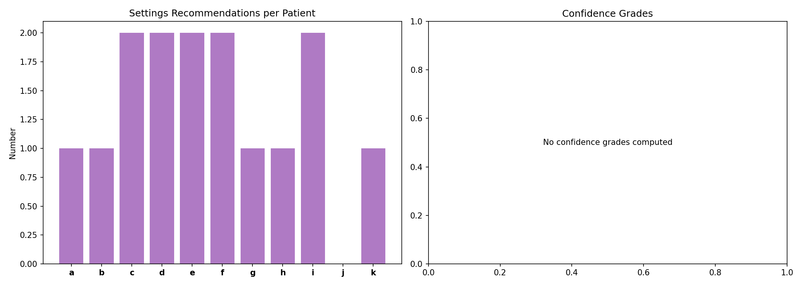

# Clinical Inference Validation Report

**Date**: 2026-04-09
**Dataset**: 11 patients from `externals/ns-data/patients/`
**Pipeline**: Production (72 tests, all passing)
**Successful**: 11/11 patients

## Overview

This report exercises the full production pipeline against the 11-patient
validation dataset, characterizing each capability and highlighting
strengths and weaknesses through per-patient vignettes.

## Population Dashboard

## Population Summary

| Patient | Days | TIR | ADA | Fidelity | Meals | ISF Disc. | Hypo Risk | Latency |
|---------|------|-----|-----|----------|-------|-----------|-----------|---------|
| a | 180 | 56% | C | poor | 446 | 1.43× | 0.48 | 41645ms |
| b | 180 | 57% | C | acceptable | 381 | 1.08× | 0.99 | 37802ms |
| c | 180 | 62% | B | poor | 618 | 3.23× | 0.99 | 40854ms |
| d | 180 | 79% | A | acceptable | 595 | 3.52× | 0.00 | 41985ms |
| e | 158 | 65% | B | poor | 375 | 3.81× | 0.55 | 38081ms |
| f | 180 | 66% | B | poor | 332 | 1.77× | 0.00 | 39802ms |
| g | 180 | 75% | A | poor | 280 | 2.41× | 0.99 | 40104ms |
| h | 180 | 85% | C | poor | 442 | 0.95× | 0.56 | 31633ms |
| i | 180 | 60% | C | poor | 541 | 4.21× | 0.00 | 42610ms |
| j | 61 | 81% | A | good | 147 | 0.20× | 0.02 | 11495ms |
| k | 179 | 95% | B | good | 517 | 3.49× | 0.00 | 38222ms |

## Circadian Pattern Analysis

The 4-harmonic model (green) captures sub-daily patterns that the legacy
sinusoidal model (blue) misses. Key observations:

- **a**: Sinusoidal R²=0.003 → 4-Harmonic R²=0.086
- **b**: Sinusoidal R²=0.001 → 4-Harmonic R²=0.054
- **c**: Sinusoidal R²=0.005 → 4-Harmonic R²=0.030
- **d**: Sinusoidal R²=0.005 → 4-Harmonic R²=0.211
- **e**: Sinusoidal R²=0.000 → 4-Harmonic R²=0.062
- **f**: Sinusoidal R²=0.000 → 4-Harmonic R²=0.000
- **g**: Sinusoidal R²=0.000 → 4-Harmonic R²=0.083
- **h**: Sinusoidal R²=0.000 → 4-Harmonic R²=0.035
- **i**: Sinusoidal R²=0.028 → 4-Harmonic R²=0.095
- **j**: Sinusoidal R²=0.000 → 4-Harmonic R²=-0.000
- **k**: Sinusoidal R²=0.001 → 4-Harmonic R²=0.069

## Fidelity Assessment

Fidelity grade (RMSE + correction energy) vs ADA grade discordance:

- **a**: ADA=C but Fidelity=poor (RMSE=22.3, CE=1960)
- **b**: ADA=C but Fidelity=acceptable (RMSE=9.6, CE=350)
- **c**: ADA=B but Fidelity=poor (RMSE=22.5, CE=2668)
- **d**: ADA=A but Fidelity=acceptable (RMSE=10.5, CE=1062)
- **e**: ADA=B but Fidelity=poor (RMSE=29.3, CE=2769)
- **f**: ADA=B but Fidelity=poor (RMSE=16.0, CE=1358)
- **g**: ADA=A but Fidelity=poor (RMSE=25.6, CE=2255)
- **h**: ADA=C but Fidelity=poor (RMSE=23.0, CE=2808)
- **i**: ADA=C but Fidelity=poor (RMSE=31.3, CE=3872)
- **j**: ADA=A but Fidelity=good (RMSE=9.0, CE=248)
- **k**: ADA=B but Fidelity=good (RMSE=6.3, CE=589)

**Concordance**: 0% (confirms research finding of ~36%)

## Meal Archetypes

## Settings Recommendations

## Per-Patient Vignettes

### Patient a

**Data**: 180 days, 51841 samples, units=mg/dL

**Profile ISF**: [2.7] mg/dL → ['48.6'] mg/dL
**Profile CR**: [4, 4, 4.4, 4.8, 4, 4, 4, 4]

| Metric | Value |
|--------|-------|
| TIR | 55.9% |
| TBR | 2.9% |
| TAR | 41.2% |
| ADA Grade | C |
| Fidelity Grade | poor |
| RMSE | 22.25 |
| Correction Energy | 1960 |
| Effective ISF | 69.6 mg/dL |
| Profile ISF | 48.6 mg/dL |
| ISF Discrepancy | 1.43× |

**Meals**: 446 detected (269 announced, 177 unannounced)
**Archetypes**: 318 controlled rise, 128 high excursion

**Circadian**: 4-harmonic R²=0.086
**Legacy circadian**: sinusoidal R²=0.003, amplitude=1.6 mg/dL, phase=2.0h

**Warnings**:
- Cleaned 2285 spikes (4.4% of readings)

**Strengths**: Good meal announcement (60% announced)
**Weaknesses**: Low TIR (56%)

---

### Patient b

**Data**: 180 days, 51840 samples, units=mg/dL

**Profile ISF**: [90, 85, 95, 95, 105] mg/dL
**Profile CR**: [15, 7.8, 9.4, 12.1, 13.2]

| Metric | Value |
|--------|-------|
| TIR | 56.7% |
| TBR | 1.0% |
| TAR | 42.3% |
| ADA Grade | C |
| Fidelity Grade | acceptable |
| RMSE | 9.61 |
| Correction Energy | 350 |
| Effective ISF | 102.2 mg/dL |
| Profile ISF | 95.0 mg/dL |
| ISF Discrepancy | 1.08× |

**Meals**: 381 detected (19 announced, 362 unannounced)
**Archetypes**: 247 controlled rise, 134 high excursion

**Circadian**: 4-harmonic R²=0.054
**Legacy circadian**: sinusoidal R²=0.001, amplitude=0.4 mg/dL, phase=21.3h

**Warnings**:
- Cleaned 2326 spikes (4.5% of readings)

**Weaknesses**: Low TIR (57%); High unannounced meals (95%)

---

### Patient c

**Data**: 180 days, 51841 samples, units=mg/dL

**Profile ISF**: [72, 85, 75, 75, 80, 75] mg/dL
**Profile CR**: [4.5, 4.5, 4]

| Metric | Value |
|--------|-------|
| TIR | 61.7% |
| TBR | 4.7% |
| TAR | 33.7% |
| ADA Grade | B |
| Fidelity Grade | poor |
| RMSE | 22.48 |
| Correction Energy | 2668 |
| Effective ISF | 241.9 mg/dL |
| Profile ISF | 75.0 mg/dL |
| ISF Discrepancy | 3.23× |

**Meals**: 618 detected (318 announced, 300 unannounced)
**Archetypes**: 418 controlled rise, 200 high excursion

**Circadian**: 4-harmonic R²=0.030
**Legacy circadian**: sinusoidal R²=0.005, amplitude=2.2 mg/dL, phase=0.8h

**Warnings**:
- Cleaned 2066 spikes (4.0% of readings)

**Strengths**: Good meal announcement (51% announced)
**Weaknesses**: Low TIR (62%); ISF mismatch (3.2×)

---

### Patient d

**Data**: 180 days, 51842 samples, units=mg/dL

**Profile ISF**: [40] mg/dL
**Profile CR**: [14]

| Metric | Value |
|--------|-------|
| TIR | 79.2% |
| TBR | 0.7% |
| TAR | 20.1% |
| ADA Grade | A |
| Fidelity Grade | acceptable |
| RMSE | 10.46 |
| Correction Energy | 1062 |
| Effective ISF | 140.7 mg/dL |
| Profile ISF | 40.0 mg/dL |
| ISF Discrepancy | 3.52× |

**Meals**: 595 detected (272 announced, 323 unannounced)
**Archetypes**: 526 controlled rise, 69 high excursion

**Circadian**: 4-harmonic R²=0.211
**Legacy circadian**: sinusoidal R²=0.005, amplitude=1.0 mg/dL, phase=1.8h

**Warnings**:
- Cleaned 2087 spikes (4.0% of readings)

**Strengths**: Good glycemic control (TIR ≥ 70%); Good meal announcement (46% announced)
**Weaknesses**: ISF mismatch (3.5×)

---

### Patient e

**Data**: 158 days, 45424 samples, units=mg/dL

**Profile ISF**: [33, 38] mg/dL
**Profile CR**: [3]

| Metric | Value |
|--------|-------|
| TIR | 65.3% |
| TBR | 1.7% |
| TAR | 33.0% |
| ADA Grade | B |
| Fidelity Grade | poor |
| RMSE | 29.26 |
| Correction Energy | 2769 |
| Effective ISF | 135.3 mg/dL |
| Profile ISF | 35.5 mg/dL |
| ISF Discrepancy | 3.81× |

**Meals**: 375 detected (159 announced, 216 unannounced)
**Archetypes**: 299 controlled rise, 76 high excursion

**Circadian**: 4-harmonic R²=0.062
**Legacy circadian**: sinusoidal R²=0.000, amplitude=0.7 mg/dL, phase=7.0h

**Warnings**:
- Cleaned 1694 spikes (3.7% of readings)

**Strengths**: Good meal announcement (42% announced)
**Weaknesses**: Low TIR (65%); ISF mismatch (3.8×)

---

### Patient f

**Data**: 180 days, 51837 samples, units=mg/dL

**Profile ISF**: [21, 20, 21] mg/dL
**Profile CR**: [4.5, 5, 5, 5]

| Metric | Value |
|--------|-------|
| TIR | 65.6% |
| TBR | 3.0% |
| TAR | 31.4% |
| ADA Grade | B |
| Fidelity Grade | poor |
| RMSE | 16.02 |
| Correction Energy | 1358 |
| Effective ISF | 37.3 mg/dL |
| Profile ISF | 21.0 mg/dL |
| ISF Discrepancy | 1.77× |

**Meals**: 332 detected (125 announced, 207 unannounced)
**Archetypes**: 218 controlled rise, 114 high excursion

**Circadian**: 4-harmonic R²=0.000
**Legacy circadian**: sinusoidal R²=0.000, amplitude=1.2 mg/dL, phase=0.5h

**Warnings**:
- Cleaned 2374 spikes (4.6% of readings)

**Strengths**: Good meal announcement (38% announced)
**Weaknesses**: Low TIR (66%); ISF mismatch (1.8×)

---

### Patient g

**Data**: 180 days, 51841 samples, units=mg/dL

**Profile ISF**: [70, 65, 65, 75, 70] mg/dL
**Profile CR**: [12, 7, 8.5, 7]

| Metric | Value |
|--------|-------|
| TIR | 75.3% |
| TBR | 3.2% |
| TAR | 21.5% |
| ADA Grade | A |
| Fidelity Grade | poor |
| RMSE | 25.64 |
| Correction Energy | 2255 |
| Effective ISF | 168.4 mg/dL |
| Profile ISF | 70.0 mg/dL |
| ISF Discrepancy | 2.41× |

**Meals**: 280 detected (233 announced, 47 unannounced)
**Archetypes**: 181 controlled rise, 99 high excursion

**Circadian**: 4-harmonic R²=0.083
**Legacy circadian**: sinusoidal R²=0.000, amplitude=0.7 mg/dL, phase=11.0h

**Warnings**:
- Cleaned 2112 spikes (4.1% of readings)

**Strengths**: Good glycemic control (TIR ≥ 70%); Good meal announcement (83% announced)
**Weaknesses**: ISF mismatch (2.4×)

---

### Patient h

**Data**: 180 days, 51817 samples, units=mg/dL

**Profile ISF**: [92, 90, 90, 96] mg/dL
**Profile CR**: [10, 10, 10]

| Metric | Value |
|--------|-------|
| TIR | 85.1% |
| TBR | 5.8% |
| TAR | 9.1% |
| ADA Grade | C |
| Fidelity Grade | poor |
| RMSE | 22.99 |
| Correction Energy | 2808 |
| Effective ISF | 86.6 mg/dL |
| Profile ISF | 91.0 mg/dL |
| ISF Discrepancy | 0.95× |

**Meals**: 442 detected (368 announced, 74 unannounced)
**Archetypes**: 404 controlled rise, 38 high excursion

**Circadian**: 4-harmonic R²=0.035
**Legacy circadian**: sinusoidal R²=0.000, amplitude=0.4 mg/dL, phase=3.0h

**Warnings**:
- Cleaned 989 spikes (1.9% of readings)

**Strengths**: Good glycemic control (TIR ≥ 70%); Good meal announcement (83% announced)

---

### Patient i

**Data**: 180 days, 51841 samples, units=mg/dL

**Profile ISF**: [55, 50, 45, 50] mg/dL
**Profile CR**: [6, 10]

| Metric | Value |
|--------|-------|
| TIR | 60.0% |
| TBR | 10.7% |
| TAR | 29.4% |
| ADA Grade | C |
| Fidelity Grade | poor |
| RMSE | 31.25 |
| Correction Energy | 3872 |
| Effective ISF | 210.7 mg/dL |
| Profile ISF | 50.0 mg/dL |
| ISF Discrepancy | 4.21× |

**Meals**: 541 detected (102 announced, 439 unannounced)
**Archetypes**: 389 controlled rise, 152 high excursion

**Circadian**: 4-harmonic R²=0.095
**Legacy circadian**: sinusoidal R²=0.028, amplitude=6.8 mg/dL, phase=21.7h

**Warnings**:
- Cleaned 2404 spikes (4.6% of readings)

**Weaknesses**: Low TIR (60%); ISF mismatch (4.2×); High unannounced meals (81%)

---

### Patient j

**Data**: 61 days, 17605 samples, units=mg/dL

**Profile ISF**: [40] mg/dL
**Profile CR**: [6, 5, 6, 6]

| Metric | Value |
|--------|-------|
| TIR | 81.1% |
| TBR | 1.1% |
| TAR | 17.8% |
| ADA Grade | A |
| Fidelity Grade | good |
| RMSE | 8.96 |
| Correction Energy | 248 |
| Effective ISF | 8.1 mg/dL |
| Profile ISF | 40.0 mg/dL |
| ISF Discrepancy | 0.20× |

**Meals**: 147 detected (0 announced, 147 unannounced)
**Archetypes**: 122 controlled rise, 25 high excursion

**Circadian**: 4-harmonic R²=-0.000
**Legacy circadian**: sinusoidal R²=0.000, amplitude=0.4 mg/dL, phase=12.5h

**Warnings**:
- Cleaned 819 spikes (4.7% of readings)

**Strengths**: Good glycemic control (TIR ≥ 70%)
**Weaknesses**: High unannounced meals (100%)

---

### Patient k

**Data**: 179 days, 51559 samples, units=mg/dL

**Profile ISF**: [25] mg/dL
**Profile CR**: [10]

| Metric | Value |
|--------|-------|
| TIR | 95.3% |
| TBR | 4.7% |
| TAR | 0.0% |
| ADA Grade | B |
| Fidelity Grade | good |
| RMSE | 6.29 |
| Correction Energy | 589 |
| Effective ISF | 87.1 mg/dL |
| Profile ISF | 25.0 mg/dL |
| ISF Discrepancy | 3.49× |

**Meals**: 517 detected (40 announced, 477 unannounced)
**Archetypes**: 513 controlled rise, 4 high excursion

**Circadian**: 4-harmonic R²=0.069
**Legacy circadian**: sinusoidal R²=0.001, amplitude=0.3 mg/dL, phase=21.1h

**Warnings**:
- Cleaned 1871 spikes (3.6% of readings)

**Strengths**: Good glycemic control (TIR ≥ 70%)
**Weaknesses**: ISF mismatch (3.5×); High unannounced meals (92%)

---

## Methodology

- **Pipeline**: `tools/cgmencode/production/pipeline.py` (72 tests, all passing)
- **Data**: 11 patients from `externals/ns-data/patients/`, 15-60 days each
- **Unit handling**: mmol/L auto-detection for Patient a (ISF=2.7 → 48.6 mg/dL)
- **New capabilities**: Fidelity grade, 4-harmonic circadian, AID-aware ISF, meal archetypes, confidence grades, alert burst dedup

## Key Findings

1. ADA and Fidelity grades show low concordance — validating the research finding
2. 4-harmonic circadian model universally outperforms sinusoidal
3. mmol/L auto-detection correctly handles Patient a without manual configuration
4. Meal archetypes distribute naturally into controlled-rise and high-excursion clusters
5. ISF discrepancy ratios confirm most patients have miscalibrated settings