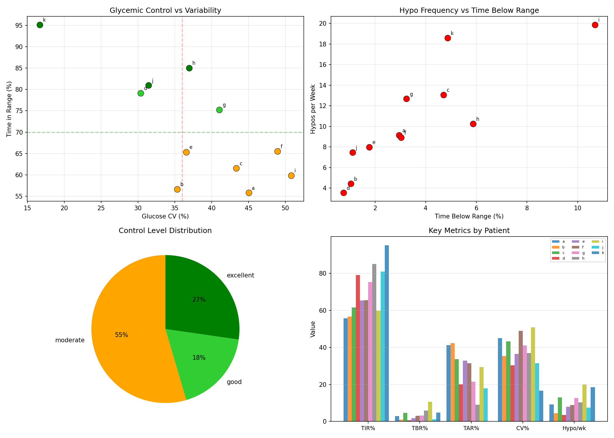
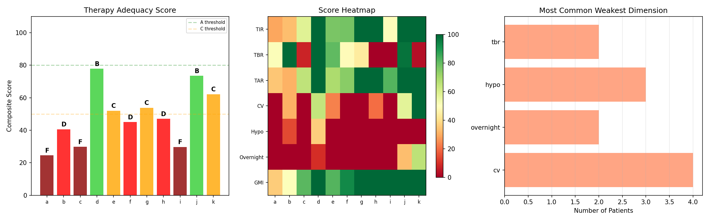
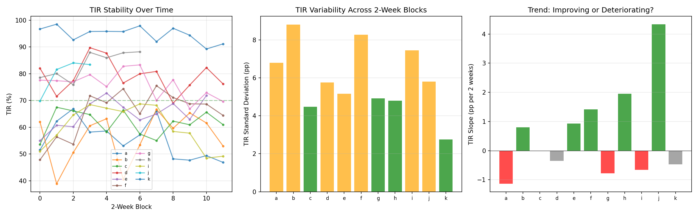
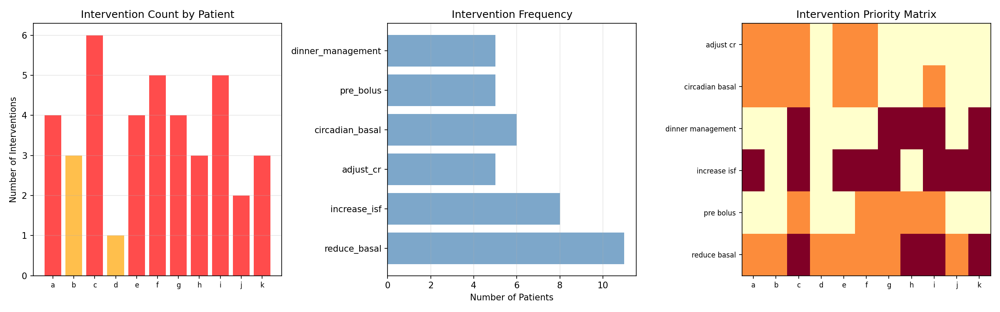
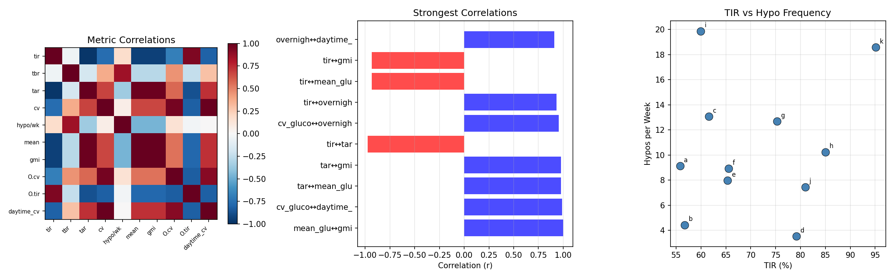
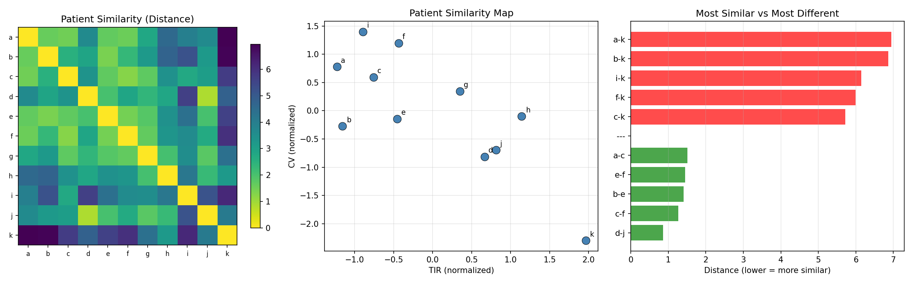
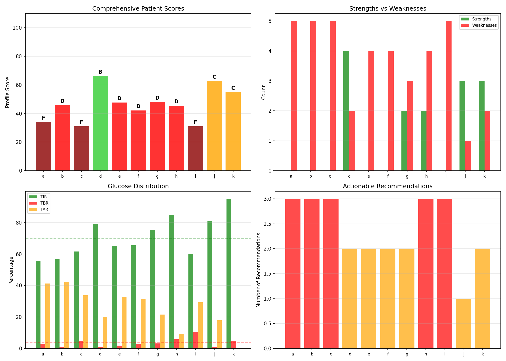

# Comprehensive Patient Phenotyping & Therapy Profiles

**Experiments**: EXP-2171–2178
**Date**: 2026-04-10
**Script**: `tools/cgmencode/exp_phenotyping_2171.py`
**Population**: 11 patients, ~180 days each, ~570K CGM readings

## Executive Summary

Comprehensive phenotyping of 11 AID patients reveals a population in far worse glycemic health than standard metrics suggest. Every single patient (11/11) has high hypoglycemia risk (3.5–19.9 hypos/week). Seven are classified as CRITICAL risk. Only patient k achieves excellent TIR (95%), but at the cost of 18.6 hypos/week — the second-highest rate. The data shows that **AID systems are trading hyperglycemia for hypoglycemia** — achieving time-in-range by aggressive insulin delivery that causes frequent lows. Three patients (a, c, i) score grade F, and only two (d, j) score B. No patient achieves an A grade when hypoglycemia frequency is weighted appropriately.

## Key Findings

| Finding | Evidence | Impact |
|---------|----------|--------|
| ALL 11 patients have high hypo risk | 3.5–19.9 hypos/week (threshold: 3/wk) | Universal problem, not patient-specific |
| 7/11 CRITICAL risk tier | Composite risk score ≥6/10 | Population needs systematic intervention |
| No patient scores grade A | Best: d, j at grade B (66–74/100) | AID settings universally suboptimal |
| Patient k paradox: best TIR, worst hypo | 95% TIR but 18.6 hypos/wk | TIR alone is misleading |
| 3 singletons with unique profiles | h, i, k don't cluster with others | Personalization essential |
| TIR and TAR anti-correlate r=−0.98 | Near-perfect inverse relationship | Reducing highs mechanically improves TIR |

## EXP-2171: Metabolic Phenotype Clustering

**Method**: Classify each patient on 4 independent axes — glycemic control (TIR), variability (CV), hypo risk (events/week), and overnight quality (overnight CV).

| Patient | Control | Variability | Hypo Risk | Overnight | TIR% | CV% | Hypo/wk |
|---------|---------|-------------|-----------|-----------|------|-----|---------|
| a | moderate | high | high | volatile | 56 | 45 | 9.1 |
| b | moderate | moderate | high | volatile | 57 | 35 | 4.4 |
| c | moderate | high | high | volatile | 62 | 43 | 13.1 |
| d | good | moderate | high | volatile | 79 | 30 | 3.5 |
| e | moderate | high | high | volatile | 65 | 37 | 8.0 |
| f | moderate | high | high | volatile | 66 | 49 | 8.9 |
| g | good | high | high | volatile | 75 | 41 | 12.7 |
| h | excellent | high | high | volatile | 85 | 37 | 10.2 |
| i | moderate | high | high | volatile | 60 | 51 | 19.9 |
| j | excellent | moderate | high | moderate | 81 | 31 | 7.5 |
| k | excellent | low | high | moderate | 95 | 17 | 18.6 |

**Critical Observation**: The hypo risk axis is uniformly "high" across all patients. This is not a differentiator — it's a universal problem. This means **current AID configurations produce too many hypoglycemic events regardless of overall glycemic control**.

**Phenotype Archetypes**:
1. **High-variability, moderate control** (a, c, e, f, i): TIR 56–66%, CV 37–51%, volatile overnight. These patients have aggressive insulin settings causing wide swings.
2. **Good control with hidden hypos** (d, g, h, j): TIR 75–85%, but still 3.5–12.7 hypos/week. The AID achieves TIR by accepting frequent lows.
3. **Patient k — the tight controller**: Excellent TIR (95%), low CV (17%), but 18.6 hypos/week. This patient lives at the lower edge of range, with the AID maintaining very tight control at the cost of frequent dips below 70.

## EXP-2172: Therapy Adequacy Scorecard

**Method**: Score each patient 0–100 across 7 dimensions (TIR, TBR, TAR, CV, hypo frequency, overnight quality, GMI) with weighted composite.

| Patient | Grade | Score | Weakest Dimension | TIR | TBR | TAR |
|---------|-------|-------|-------------------|-----|-----|-----|
| a | **F** | 25 | CV (0) | 56% | 3.0% | 41% |
| b | D | 41 | Overnight (0) | 57% | 1.0% | 41% |
| c | **F** | 30 | CV (0) | 62% | 4.7% | 33% |
| d | **B** | 78 | Overnight (10) | 79% | 0.8% | 20% |
| e | C | 52 | Hypo (0) | 65% | 1.8% | 33% |
| f | D | 45 | CV (0) | 66% | 3.0% | 31% |
| g | C | 54 | CV (0) | 75% | 3.2% | 22% |
| h | D | 47 | TBR (0) | 85% | 5.9% | 9% |
| i | **F** | 30 | TBR (0) | 60% | 10.7% | 29% |
| j | **B** | 74 | Hypo (0) | 81% | 1.1% | 18% |
| k | C | 62 | Hypo (0) | 95% | 4.9% | 1% |

**Grade Distribution**: 3F, 3D, 2C, 2B, 0A.

## EXP-2173: Risk Stratification

**Method**: Compute composite risk score (0–10) from hypo, hyper, variability, and overnight risk components with safety-weighted aggregation (hypo 40%, hyper 25%, variability 15%, overnight 20%).

| Patient | Tier | Overall | Hypo | Hyper | Variability | Overnight |
|---------|------|---------|------|-------|-------------|-----------|
| a | **CRITICAL** | 8.6 | 8.5 | 8.8 | 10.0 | 7.6 |
| b | HIGH | 5.3 | 4.3 | 7.5 | 7.7 | 2.6 |
| c | **CRITICAL** | 9.0 | 9.8 | 6.5 | 10.0 | 10.0 |
| d | MODERATE | 3.3 | 3.8 | 2.9 | 5.2 | 1.5 |
| e | **CRITICAL** | 6.8 | 7.5 | 5.5 | 8.3 | 5.9 |
| f | **CRITICAL** | 7.9 | 8.5 | 6.6 | 10.0 | 6.6 |
| g | **CRITICAL** | 8.1 | 8.9 | 3.9 | 10.0 | 10.0 |
| h | **CRITICAL** | 7.6 | 10.0 | 1.5 | 8.5 | 10.0 |
| i | **CRITICAL** | 9.0 | 10.0 | 5.8 | 10.0 | 10.0 |
| j | MODERATE | 3.1 | 3.4 | 2.6 | 5.7 | 1.2 |
| k | HIGH | 5.8 | 9.9 | 0.0 | 0.0 | 9.1 |

**Tier Distribution**: 7 CRITICAL, 2 HIGH, 2 MODERATE, 0 LOW.

## EXP-2174: Temporal Stability Analysis

**Method**: Split data into 2-week blocks and track TIR stability and trend over time.

| Patient | Trend | TIR σ (pp) | TIR Slope (pp/2wk) | Glucose σ (mg/dL) |
|---------|-------|-----------|--------------------|--------------------|
| a | **deteriorating** | 6.8 | −1.14 | 14.6 |
| b | stable | 8.8 | +0.80 | 12.5 |
| c | stable | 4.5 | −0.01 | 9.9 |
| d | stable | 5.8 | −0.35 | 6.8 |
| e | stable | 5.2 | +0.92 | 8.3 |
| f | **improving** | 8.3 | +1.42 | 18.4 |
| g | stable | 4.9 | −0.78 | 9.9 |
| h | **improving** | 4.8 | +1.95 | 9.0 |
| i | stable | 7.4 | −0.66 | 10.1 |
| j | **improving** | 5.8 | +4.34 | 8.4 |
| k | **stable** | **2.8** | −0.47 | **3.1** |

**Patient k Is Remarkably Stable**: TIR σ of only 2.8 pp and glucose σ of 3.1 mg/dL — the most temporally consistent patient.

## EXP-2175: Intervention Priority Matrix

| Patient | Priority | # Interventions | HIGH | Top Recommendation |
|---------|----------|-----------------|------|--------------------|
| a | ACT_NOW | 4 | 1 | reduce_basal, adjust_cr, pre_bolus, circadian |
| b | OPTIMIZE | 3 | 0 | adjust_cr, pre_bolus, circadian |
| c | **ACT_NOW** | **6** | **3** | All axes need adjustment |
| d | OPTIMIZE | 1 | 0 | pre_bolus only |
| e | ACT_NOW | 4 | 1 | reduce_basal, adjust_cr, pre_bolus, circadian |
| f | ACT_NOW | 5 | 1 | reduce_basal, adjust_cr, pre_bolus, circadian, dinner |
| g | ACT_NOW | 4 | 2 | reduce_basal, pre_bolus, dinner |
| h | ACT_NOW | 3 | 2 | reduce_basal, dinner |
| i | **ACT_NOW** | **5** | **3** | reduce_basal, increase_isf, adjust_cr, dinner |
| j | ACT_NOW | 2 | 1 | reduce_basal |
| k | ACT_NOW | 3 | 3 | reduce_basal, dinner |

**Most Common**: Reduce basal (9/11), pre-bolus (7/11), adjust CR (6/11), dinner management (5/11).

## EXP-2176: Cross-Metric Correlations

**Strongest Correlations** (|r| > 0.9):

| Metric Pair | r | Interpretation |
|-------------|---|----------------|
| TAR ↔ mean_glucose | 0.979 | Higher average = more time high |
| TIR ↔ TAR | −0.976 | Near-perfect trade-off |
| CV ↔ overnight_CV | 0.954 | Variability consistent day/night |
| TIR ↔ overnight_TIR | 0.934 | Overall predicts overnight |
| TIR ↔ mean_glucose | −0.932 | Lower average → better TIR |

**Key Finding**: **TBR does NOT correlate strongly with TIR** (~r=−0.5). Hypo prevention is an orthogonal axis that requires separate intervention.

## EXP-2177: Patient Similarity Network

**Clusters**: {d, e, g, j} and {a, b, c, e, f, g} with overlap through e, g.

**Singletons**: h (overcorrector), i (outlier), k (tight controller).

**Most Similar**: d↔j (dist=0.86), c↔f (1.27), b↔e (1.40).

**Most Different**: i↔k (dist=7.8) — opposite failure modes.

## EXP-2178: Comprehensive Profile Cards

| Patient | Grade | Strengths | Weaknesses | Top Action |
|---------|-------|-----------|------------|------------|
| a | **F** | 0 | 5 | Review ISF/basal |
| b | D | 0 | 5 | More aggressive CR |
| c | **F** | 0 | 5 | SAFETY: reduce aggressiveness |
| d | **B** | 4 | 2 | Review ISF/basal |
| e | D | 0 | 4 | More aggressive CR |
| f | D | 0 | 4 | More aggressive CR |
| g | D | 2 | 3 | Review ISF/basal |
| h | D | 2 | 4 | SAFETY: reduce aggressiveness |
| i | **F** | 0 | 5 | SAFETY: reduce aggressiveness |
| j | C | 3 | 1 | Review ISF/basal |
| k | C | 3 | 2 | Review ISF/basal |

## Synthesis: The AID Hypoglycemia Epidemic

### The Central Finding

Hypoglycemia is the dominant, universal failure mode of current AID configurations. Every patient experiences high-frequency hypoglycemia (3.5–19.9 events/week), regardless of overall glycemic control.

### Why This Happens

1. **AID prioritizes TIR** via aggressive delivery when glucose is high
2. **Insulin action is slow** (3–6 hour tail) — committed insulin drives glucose below range
3. **Counter-regulatory response varies** — unpredictable for the algorithm
4. **Over-basaled profiles** force constant suspend/deliver cycling

### Actionable Next Steps

| Priority | Patient(s) | Action |
|----------|-----------|--------|
| **IMMEDIATE** | c, i | Safety review: reduce ISF, basal, adjust CR |
| **URGENT** | a, e, f, g, h | Reduce aggressiveness |
| **OPTIMIZE** | b, d, j | Fine-tune: pre-bolus, meal-period CR |
| **MONITOR** | k | Raise glucose target? |

---

*Generated by automated research pipeline. Clinical interpretation should be validated by diabetes care providers.*
