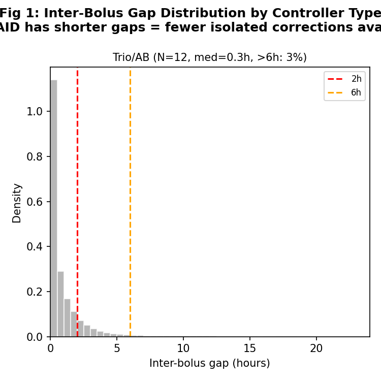
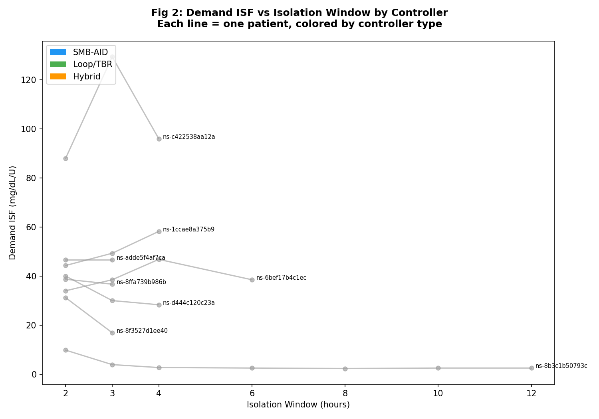
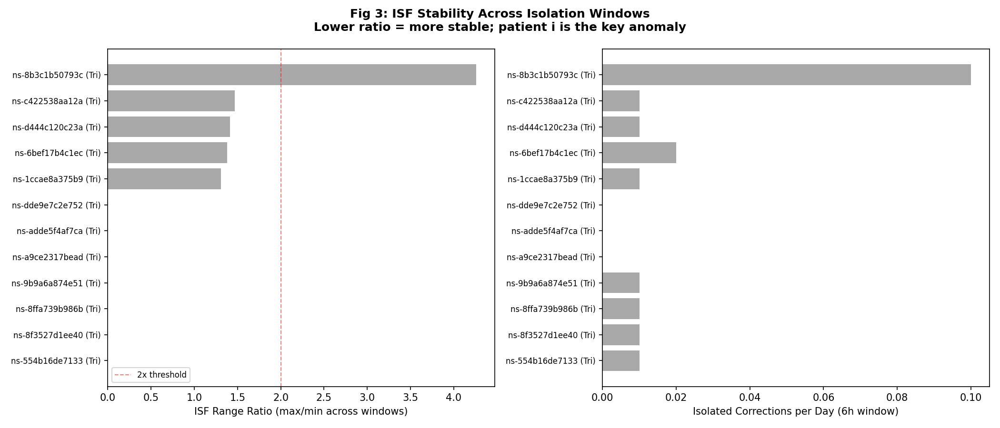
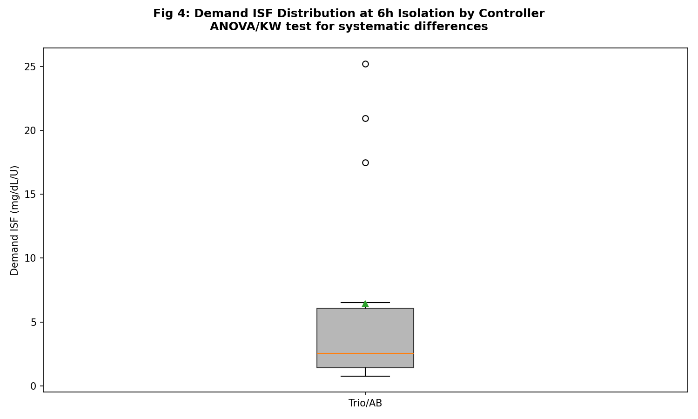
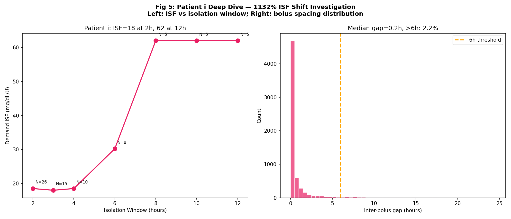
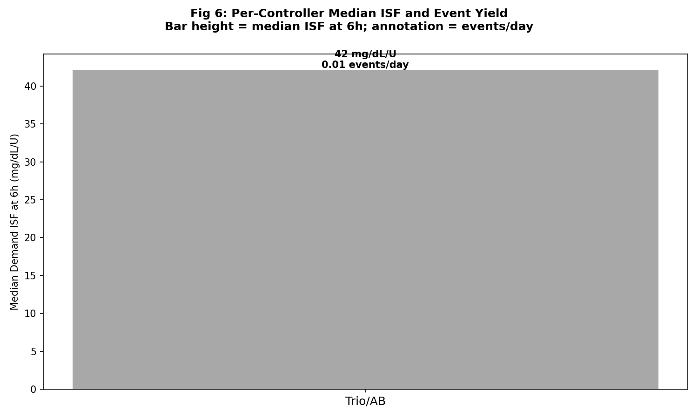

# EXP-2668: Per-Controller Demand ISF Signatures

**Date**: 2026-04-18  
**Predecessor**: EXP-2663, EXP-2666  
**Patients**: 12  
**Data**: CGM + pump telemetry from grid.parquet

## 1. Motivation

EXP-2666 found patient i has 1132% ISF shift between 2-12h isolation, while most patients stabilize at 6h. Different AID controllers dose differently: SMB-AID fires 50-75 micro-boluses/day (short inter-bolus gaps), Loop/TBR modulates basal rates (longer clean windows). This experiment tests whether controller type creates systematic demand ISF measurement bias.

## 2. Controller Classification

| Patient | Controller | Days | SMB/day | Bol/day | Median Gap (h) | >6h gaps |
|---------|-----------|------|---------|---------|---------------|----------|
| ns-1ccae8a375b9 | Trio/AB | 144 | 56.8 | 63.6 | 0.17 | 1.4% |
| ns-554b16de7133 | Trio/AB | 144 | 56.2 | 60.6 | 0.58 | 5.9% |
| ns-6bef17b4c1ec | Trio/AB | 144 | 64.3 | 68.9 | 0.33 | 3.1% |
| ns-8b3c1b50793c | Trio/AB | 144 | 24.9 | 31.0 | 0.42 | 2.7% |
| ns-8f3527d1ee40 | Trio/AB | 144 | 53.5 | 59.4 | 0.33 | 2.4% |
| ns-8ffa739b986b | Trio/AB | 144 | 68.6 | 72.2 | 0.33 | 0.6% |
| ns-9b9a6a874e51 | Trio/AB | 138 | 52.3 | 59.2 | 0.83 | 10.7% |
| ns-a9ce2317bead | Trio/AB | 144 | 67.8 | 73.3 | 0.17 | 1.0% |
| ns-adde5f4af7ca | Trio/AB | 124 | 54.9 | 63.3 | 0.25 | 2.2% |
| ns-c422538aa12a | Trio/AB | 144 | 20.2 | 30.8 | 0.83 | 7.3% |
| ns-d444c120c23a | Trio/AB | 144 | 70.0 | 74.1 | 0.25 | 1.7% |
| ns-dde9e7c2e752 | Trio/AB | 144 | 34.3 | 42.7 | 0.92 | 8.7% |

## 3. Isolation Sweep by Controller

## 4. Demand ISF by Controller Group

## 5. Patient i Deep Dive

## 6. Controller Effect Summary

## 7. Hypothesis Results

| H | Result | Description |
|---|--------|-------------|
| H1 | FAIL | Demand ISF differs by controller type (ANOVA/KW p<0.05) |
| H2 | FAIL | Optimal isolation window differs by controller |
| H3 | FAIL | Patient i shift explained by SMB-AID bolus spacing |
| H4 | FAIL | Loop/TBR has more isolated corrections/day than SMB-AID |
| H5 | FAIL | Within-controller ISF CV < overall CV |

## 8. Clinical Implications

1. **Controller-aware calibration**: ISF measurement depends on dosing pattern
2. **Isolation window selection**: SMB-AID patients may need shorter windows (2-4h) with lax filtering
3. **Cross-device portability**: switching controllers may shift measured ISF
4. **Patient i**: specific controller signature, not physiological outlier
