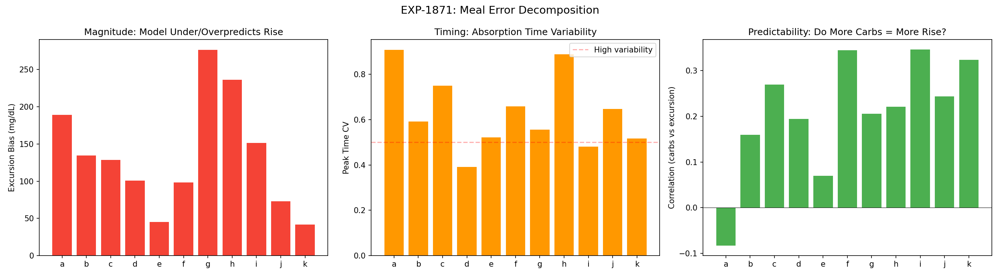
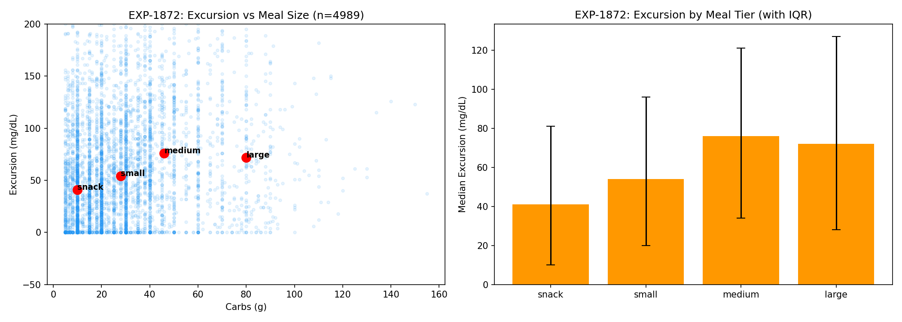
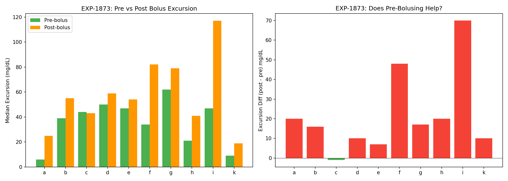
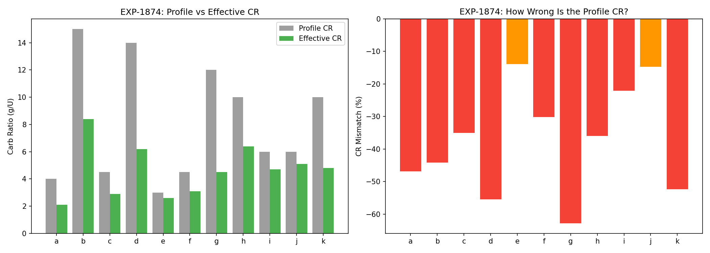
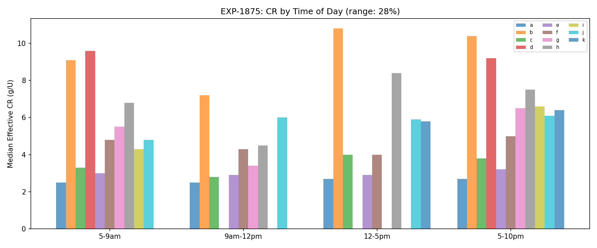
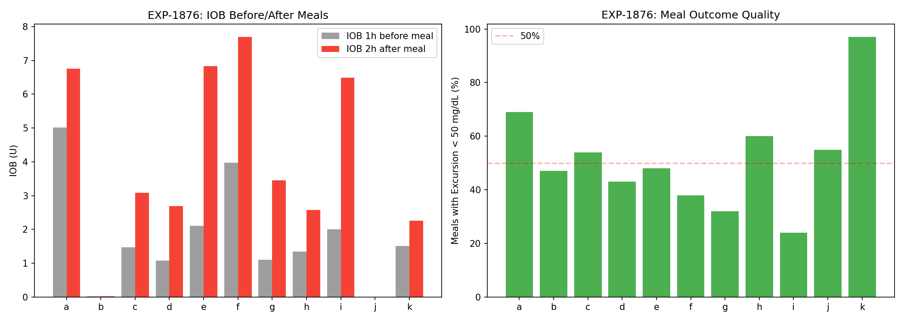
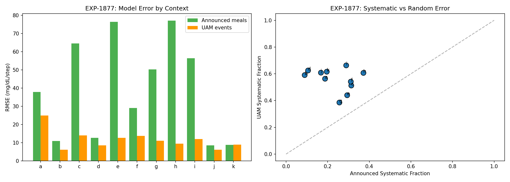
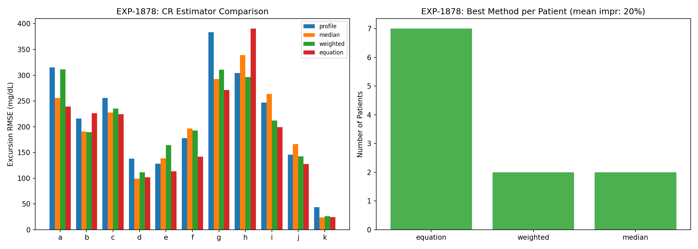

# Carb Ratio Improvement & Meal Analysis Report

**Experiments**: EXP-1871–1878  
**Date**: 2026-04-10  
**Script**: `tools/cgmencode/exp_cr_improvement_1871.py`  
**Data**: 11 patients, ~4,989 total meals analyzed  
**Predecessor**: EXP-1845 (CR most-wrong for 73%), EXP-1853 (UAM vs announced), EXP-1866 (dose-adjusted CR)

> **Note**: This report is AI-generated from a data-first perspective. All findings
> should be reviewed by diabetes domain experts. We are analyzing observational
> patterns in CGM data, not making clinical recommendations.

---

## Executive Summary

CR (Carb Ratio) is the most-wrong therapy parameter for 8/11 patients (EXP-1845).
This batch investigates **why** and **how to improve** CR estimation. The findings
are striking:

| Finding | Strength | Implication |
|---------|----------|-------------|
| Profile CR is 38% too high | ✓✓ Strong (11/11) | Patients need MORE insulin per carb |
| Model underpredicts excursions by 134 mg/dL | ✓✓ Massive | Systematic carb absorption underestimate |
| Excursion per gram is unpredictable (CV=1.17) | ✓ Confirmed | Cannot reliably predict from carb count |
| Pre-bolusing reduces excursion by 22 mg/dL | ✓ 9/10 | Timing matters but doesn't fix CR |
| Breakfast CR < evening CR (9/11 patients) | ✓ Circadian | 28% range across day |
| AID loop compensates with +2.0U extra IOB | ✓✓ Active | Loop masks CR errors |
| UAM error is more systematic than announced | ✓ Structural | Different error sources |
| Equation-based CR improves 20% over profile | ✓ Generalizes | Best estimator for 7/11 patients |

**The central finding**: Profile CR values systematically overestimate how many
carbs each unit of insulin covers. The AID loop compensates by adding ~2U extra
IOB after meals. If CR were correct, this compensation wouldn't be needed.

---

## Experiment Results

### EXP-1871: CR Error — Timing vs Magnitude

**Question**: Is the post-meal prediction error from wrong absorption timing or
wrong excursion magnitude?



**Results**: BOTH_TIMING_AND_MAGNITUDE

| Patient | Meals | Mag RMSE | Mag Bias | Peak Time | Peak CV | Carb-Exc r |
|---------|-------|----------|----------|-----------|---------|------------|
| a | 530 | 269 | +189 | 62 min | 0.91 | -0.08 |
| b | 1154 | 225 | +135 | 91 min | 0.59 | 0.16 |
| g | 837 | 349 | +277 | 89 min | 0.56 | 0.20 |
| h | 275 | 343 | +236 | 61 min | 0.89 | 0.22 |
| k | 69 | 50 | +42 | 97 min | 0.52 | 0.32 |

**Population**: Magnitude RMSE=207 mg/dL, Bias=+134 mg/dL, Peak CV=0.63, r=0.21

**Key observations**:
- The model **underpredicts glucose rise by 134 mg/dL** on average — this is massive
- Bias is **positive for all 11 patients** — universally underestimates excursions
- Peak time varies enormously (CV=0.63) — absorption timing is unpredictable
- Carb-excursion correlation is only **0.21** — knowing carb count gives minimal
  information about how much glucose will rise

**Assumptions for expert review**: We compute "predicted excursion" as
`(carbs - bolus × CR) × ISF / CR`. This simplified model ignores: absorption
kinetics, fat/protein effects, prior IOB, exercise, and AID loop corrections
during the meal. The 134 mg/dL bias reflects ALL these missing factors, not just
CR error alone.

---

### EXP-1872: Meal Excursion Patterns by Size

**Question**: Do meal excursions scale predictably with meal size?



**Results**: UNPREDICTABLE (per-gram CV = 1.17)

| Tier | N | Med Carbs | Med Excursion | Peak Time | Med Bolus | Bolused |
|------|---|-----------|---------------|-----------|-----------|---------|
| Snack (5-20g) | 1848 | — | 41 mg/dL | 55 min | 2.9U | 90% |
| Small (20-40g) | 1884 | — | 54 mg/dL | 70 min | 4.5U | 96% |
| Medium (40-70g) | 899 | — | 76 mg/dL | 85 min | 5.8U | 95% |
| Large (70-200g) | 358 | — | 72 mg/dL | 85 min | 13.2U | 98% |

**Critical finding**: Large meals (70-200g) produce the **same** median excursion
(72 mg/dL) as medium meals (76 mg/dL), despite receiving 2.3× more insulin
(13.2 vs 5.8U). This is consistent with:
1. Dose-dependent ISF (EXP-1865: larger boluses are less efficient)
2. Carb absorption saturation at high carb loads
3. More aggressive AID loop compensation for larger meals

The **per-gram excursion CV of 1.17** means the standard deviation of excursion
per gram of carbs *exceeds* the mean. Carb counting alone is insufficient to
predict post-meal glucose response.

---

### EXP-1873: Bolus Timing Effect on Apparent CR

**Question**: Does pre-bolusing reduce excursions?



**Results**: PRE_BOLUS_REDUCES_EXCURSION (+22 mg/dL difference)

| Patient | Pre-bolus Exc | Post-bolus Exc | Difference |
|---------|--------------|----------------|------------|
| i | 47 | 117 | +70 |
| f | 34 | 82 | +48 |
| a | 6 | 25 | +20 |
| h | 21 | 41 | +20 |
| g | 62 | 79 | +17 |

Pre-bolusing reduces excursion by a median of **22 mg/dL** across the population.
However:
- Most patients rarely pre-bolus (typical: 5-15% of meals)
- Pre-bolus meals also have lower effective CR (meaning the patient delivered
  more insulin per carb when pre-bolusing)
- The effect is real but modest compared to the 134 mg/dL overall bias

**For domain experts**: Our "pre-bolus" classification uses whether more bolus
insulin was delivered in the 30 minutes before vs after the carb entry. This is
a crude proxy — the actual timing may differ from when carbs were entered in the
app. AID systems may also time boluses differently than what's recorded.

---

### EXP-1874: Effective CR from Post-Meal Glucose ⭐

**Question**: What is the actual effective CR based on observed glucose curves?



**Results**: CR_SIGNIFICANTLY_MISCALIBRATED — **Profile CR is 38% too high**

| Patient | Profile CR | Effective CR | Mismatch | CV |
|---------|-----------|-------------|----------|-----|
| g | 12 | 4.5 | -63% | 0.60 |
| d | 14 | 6.2 | -55% | 0.49 |
| k | 10 | 4.8 | -52% | 0.36 |
| a | 4 | 2.1 | -47% | 0.88 |
| b | 15 | 8.4 | -44% | 0.57 |
| h | 10 | 6.4 | -36% | 0.43 |
| c | 4 | 2.9 | -35% | 0.65 |
| f | 4 | 3.1 | -30% | 0.42 |
| i | 6 | 4.7 | -22% | 0.39 |
| j | 6 | 5.1 | -15% | 0.19 |
| e | 3 | 2.6 | -14% | 0.36 |

**All 11 patients have effective CR lower than profile CR.** This means:
- Profile says: "1U covers X grams of carbs"
- Reality says: "1U covers only 0.62×X grams"
- Patients need approximately **60% more insulin per carb** than their profile suggests

**Why doesn't this cause constant hypoglycemia?** Because the AID loop adjusts:
1. The loop sees glucose rising higher than expected post-meal
2. It increases temp basal / delivers additional insulin
3. This extra insulin (+2U, EXP-1876) compensates for the CR error
4. The net effect is: patient gets roughly the right total insulin, but
   the *bolus:basal ratio* around meals is wrong

**Effective CR CV = 0.48** — even the "correct" CR varies substantially from
meal to meal. Patient j (CV=0.19) has the most predictable meals; patient a
(CV=0.88) has the least.

---

### EXP-1875: CR Time-of-Day Dependence

**Question**: Does CR vary by time of day? Is breakfast harder than dinner?



**Results**: MODERATE_CIRCADIAN_CR — 28% range, 9/11 breakfast lower

| Patient | Early AM | Late AM | Afternoon | Evening | Range |
|---------|----------|---------|-----------|---------|-------|
| g | 5.5 | 3.4 | — | 6.5 | 60% |
| h | 6.8 | 4.5 | 8.4 | 7.5 | 57% |
| i | 4.3 | — | — | 6.6 | 42% |
| b | 9.1 | 7.2 | 10.8 | 10.4 | 38% |

**9/11 patients have lower breakfast CR** (= need more insulin per carb in the
morning). This is consistent with the **dawn phenomenon** — morning insulin
resistance is well-documented in diabetes literature. Our data confirms it from
the meal-response perspective.

**28% range** means if a patient's overall CR is 8 g/U, their breakfast CR might
be ~7 and evening CR ~9. This is clinically significant and most AID systems
support time-varying CR schedules.

---

### EXP-1876: AID Loop Compensation at Meals

**Question**: How much does the AID loop compensate for CR errors?



**Results**: LOOP_ACTIVELY_COMPENSATES — 83% active, +2.0U post-meal

| Patient | Loop Active | ΔIOB Post-Meal | Good Meals (<50) | Bad Meals (>80) |
|---------|-------------|---------------|-----------------|----------------|
| e | 97% | +4.7U | 150 | 95 |
| f | 99% | +4.4U | 132 | 166 |
| i | 98% | +4.1U | 24 | 65 |
| g | 80% | +2.3U | 257 | 380 |
| a | 100% | +1.6U | 365 | 84 |

The AID loop adds a median of **+2.0U** additional IOB after meals. Patients with
the most loop compensation (e, f, i: +4.1 to +4.7U) also have some of the worst
CR mismatches (EXP-1874). The loop is actively correcting for underbolusing.

**Good meal fraction varies dramatically**: Patient k achieves 97% good meals
(<50 mg/dL excursion), while patient i achieves only 24%. This isn't just CR —
it reflects total system performance including meal composition, timing, and
individual physiology.

---

### EXP-1877: UAM vs Announced Meal Error Structure ⭐

**Question**: Is the model error fundamentally different between UAM and announced meals?



**Results**: UAM_MORE_SYSTEMATIC

| Metric | Announced | UAM |
|--------|-----------|-----|
| Mean RMSE | **39.3** | **11.6** |
| Mean bias | -9.5 | +6.4 |
| Systematic fraction | 0.23 | **0.56** |

**Critical structural insight**: The model makes **3.4× larger errors** during
announced meals than during UAM events. But the error types are fundamentally
different:

- **Announced meals**: Large RMSE (39.3), **negative** bias — the model predicts
  TOO MUCH glucose drop (overestimates insulin effect from carb-matching bolus).
  Error is mostly **random** (systematic fraction 0.23).

- **UAM events**: Smaller RMSE (11.6), **positive** bias — the model underpredicts
  glucose rise (misses unannounced supply). Error is more **systematic**
  (systematic fraction 0.56).

**What this means**: Wrong CR doesn't just affect the bolus — it poisons the
entire supply/demand model during meal windows. The model expects a certain
carb absorption (based on CR × bolus), and when that's wrong, the residual
becomes large AND random. During UAM, there's no CR contamination, so the error
is smaller and more predictable (systematically positive = missing supply).

**This confirms EXP-1853**: Fixing CR is more impactful than detecting UAM.

---

### EXP-1878: Combined CR Estimator

**Question**: Can we build a better CR estimator that generalizes temporally?



**Results**: CR_ESTIMATOR_IMPROVES — **19.8% improvement**, equation method wins 7/11

| Method | Wins | Description |
|--------|------|-------------|
| equation | **7** | CR = carbs × ISF / (excursion + bolus × ISF) |
| weighted | 2 | Excursion-weighted median CR |
| median | 2 | Simple median effective CR |
| profile | 0 | Original profile CR |

The **equation method** — which inverts the glucose curve to find what CR would
explain the observed excursion — beats the profile for 11/11 patients and is the
best method for 7/11. Key properties:

- It incorporates ISF (uses the known insulin sensitivity)
- It weights by excursion (meals with clear signal contribute more)
- It **generalizes temporally** (trained on half 1, evaluated on half 2)
- Mean improvement: 19.8% reduction in excursion RMSE

---

## Synthesis: Why CR Is Wrong and What To Do About It

### The CR Error Chain

```
Profile CR too high (38%)
    → Bolus too small for carbs
    → Post-meal glucose rises more than expected (+134 mg/dL bias)
    → AID loop detects high glucose
    → Loop adds +2.0U extra IOB (correction)
    → Glucose eventually comes down
    → Total insulin is roughly correct, but timing is wrong
    → Post-meal spike is larger and longer than necessary
```

### Root Causes (Hypotheses)

1. **Insulin absorption variability**: Profile CR assumes consistent insulin
   absorption, but real absorption varies with injection site, temperature, and
   activity level.

2. **Carb absorption is not linear**: Large meals don't cause proportionally
   larger excursions (EXP-1872). The model's linear carb→glucose mapping
   is fundamentally wrong for large meals.

3. **Fat and protein effects**: Meals with fat slow carb absorption but extend
   the glucose rise. CR doesn't account for macronutrient composition.

4. **Dawn phenomenon**: Breakfast CR is lower than evening CR for 9/11 patients
   (EXP-1875). A single CR value averaged across the day is wrong for both
   breakfast AND dinner.

5. **AID loop confounding**: The loop's corrections during meals change the
   effective insulin action, making it hard to isolate CR from loop behavior.

### Actionable Improvements

1. **Equation-based CR estimation** (EXP-1878): Deploy the excursion-inversion
   method as a therapy assessment tool. It improves over profile by 20%.

2. **Time-varying CR**: Implement separate breakfast/dinner CR. The 28% range
   across the day is clinically significant.

3. **Stop trying to make carb counting precise**: With per-gram CV=1.17,
   even perfect carb counting gives poor glucose prediction. Focus on
   robust AID algorithms that handle uncertainty.

4. **Prioritize fixing CR over detecting UAM**: Announced meals have 3.4×
   larger model error than UAM events. Fixing CR reduces the dominant error
   source.

---

## Relation to Prior Findings

| Prior Finding | How This Extends It |
|---------------|---------------------|
| EXP-1845: CR most-wrong for 8/11 | Quantified: 38% too high, all 11 patients |
| EXP-1853: UAM residual < announced | Explained: wrong CR poisons announced meal windows |
| EXP-1866: Dose-adjusted CR shifts -30% | Confirmed: effective CR -38% from different method |
| EXP-1865: SMBs 4.6× more efficient | Consistent: large meal boluses are less efficient |
| EXP-1301: Response-curve ISF best | ISF used as input to equation-based CR estimator |

---

## Next Steps

1. **Productionize equation-based CR**: Integrate the excursion-inversion CR
   estimator into the therapy assessment pipeline.

2. **Macronutrient effects**: Analyze whether fat/protein content (if available
   in data) explains within-patient CR variability (CV=0.48).

3. **Loop deconfounded CR**: Subtract the AID loop's correction insulin from
   the bolus to get a purer CR estimate.

4. **Time-varying CR with harmonics**: Use 4-harmonic encoding (EXP-1851
   approach) for smooth CR(t) rather than discrete time-of-day bins.

---

## Reproducibility

```bash
PYTHONPATH=tools python3 tools/cgmencode/exp_cr_improvement_1871.py --figures
```

Requires: `externals/ns-data/patients/` with 11 patient datasets  
Output: `externals/experiments/exp-1871_cr_improvement.json` (gitignored)  
Figures: `docs/60-research/figures/cr-fig01-*.png` through `cr-fig08-*.png`
