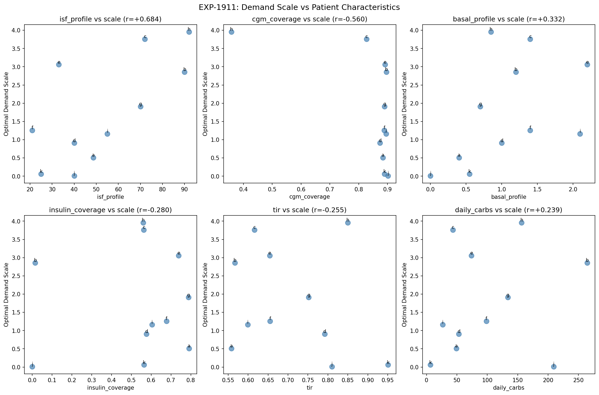
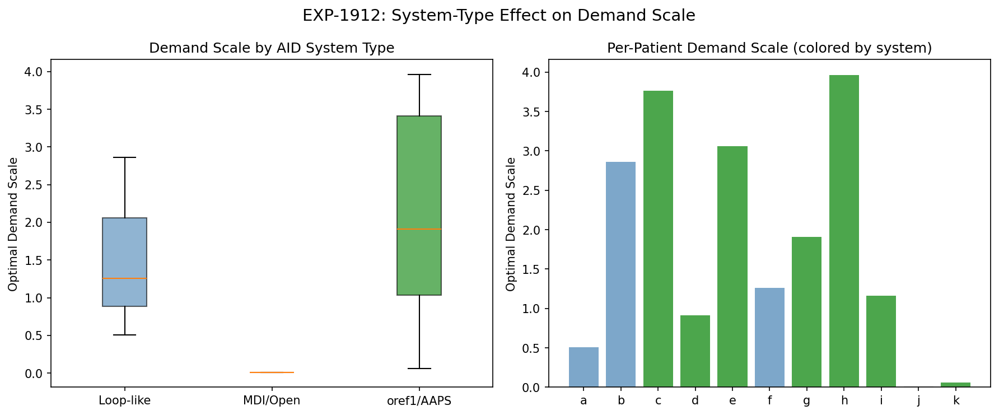
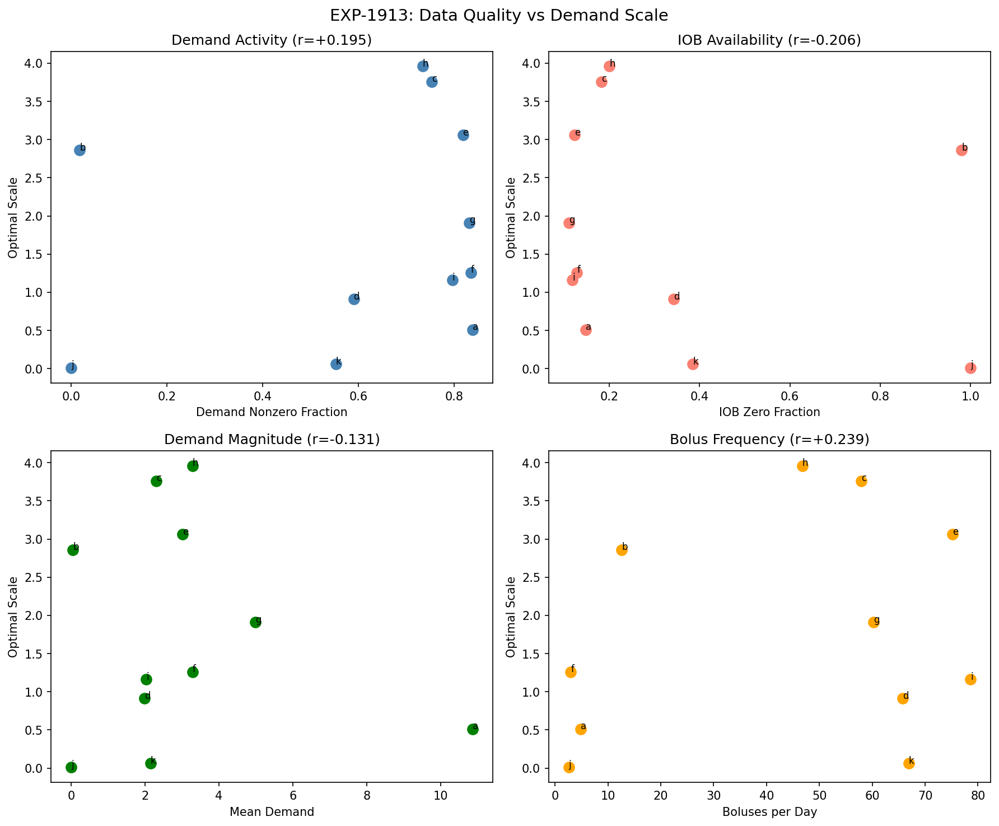
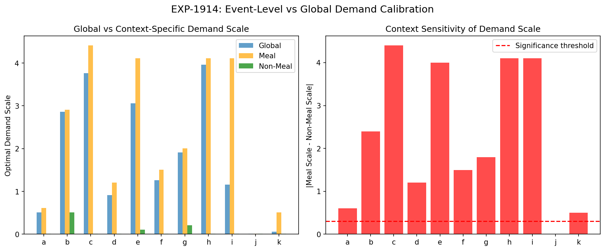
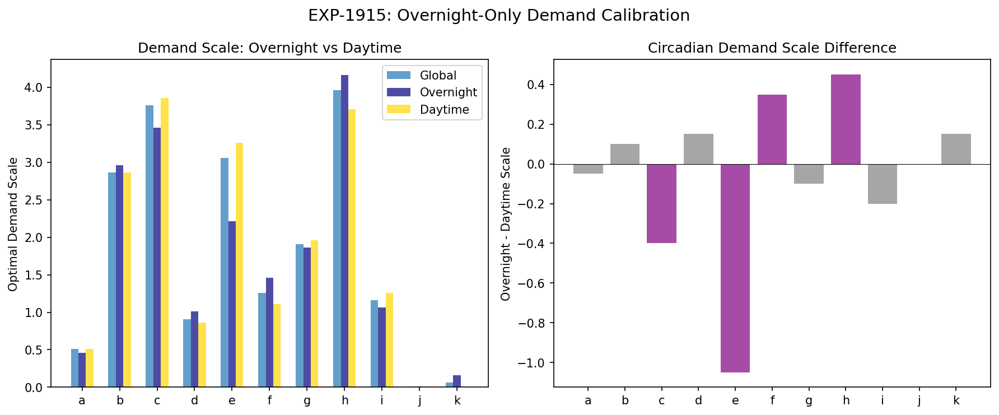
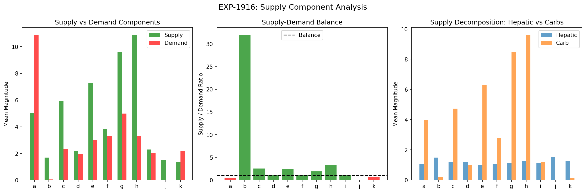
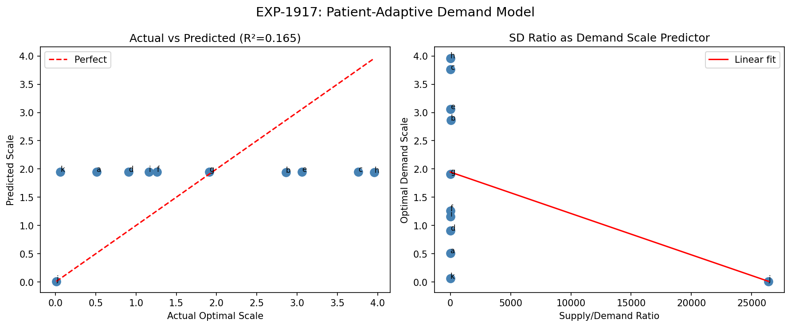
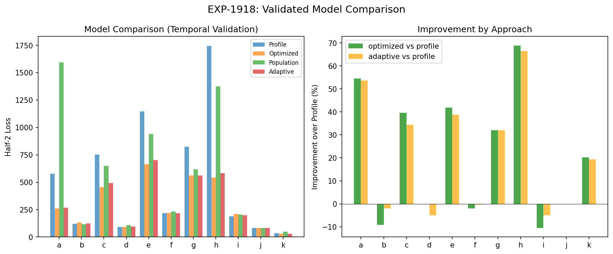

# Demand Calibration & Model Improvement Report

**Experiments**: EXP-1911 through EXP-1918  
**Date**: 2026-04-10  
**Population**: 11 patients (a–k), ~180 days each  
**Script**: `tools/cgmencode/exp_demand_calibration_1911.py`  
**Generated by AI autoresearch — all findings require clinical review**

## Executive Summary

The supply/demand physics model requires a per-patient **demand scale factor** that varies dramatically (0.01–3.96×) across patients. This batch investigates *why* the scale varies and whether it can be predicted without per-patient optimization.

**Key findings:**
1. **Profile ISF is the strongest correlate** of demand scale (r=+0.684) — patients with higher ISF profiles need more demand amplification
2. **Context matters overwhelmingly**: meal-time demand scale is 2.2× higher than non-meal (10/11 patients)
3. **Supply dominates demand** in 8/10 patients with nonzero demand (mean S/D ratio 4.67) — the model systematically underestimates insulin's glucose-lowering effect
4. **Patient-adaptive prediction fails** (R²=0.165) — demand scale is fundamentally patient-specific
5. **Per-patient optimization wins** (5/11) but profile settings are surprisingly competitive (4/11)
6. **Circadian variation is minor** — overnight vs daytime differ by <0.3× in 7/11 patients

## Background

### The Demand Scale Problem

Our supply/demand model decomposes glucose rate of change as:

```
dG/dt = supply - demand
      = (hepatic + carb_absorption) - (insulin_activity × ISF)
```

The model uses literature constants and profile-reported ISF to compute demand, but the resulting demand magnitude is consistently miscalibrated. We introduced a **demand scale factor** to correct this:

```
net_scaled = supply - demand × scale
```

EXP-1891–1898 found this scale varies from 0.01 (patient j, MDI) to 3.96 (patient h, oref1). This batch asks: **what drives this variation, and can we predict it?**

## Experiment Results

### EXP-1911: Demand Scale vs Patient Characteristics

**Question**: Which patient characteristics predict the optimal demand scale?

We computed 14 patient characteristics and correlated each with the optimal demand scale:

| Characteristic | Correlation (r) | Interpretation |
|---------------|-----------------|----------------|
| **ISF profile** | **+0.684** | Higher ISF → needs more demand amplification |
| CGM coverage | −0.560 | Less CGM data → higher scale (data quality?) |
| Basal profile | +0.332 | Higher basal → higher scale |
| Insulin coverage | −0.280 | Less insulin data → higher scale |
| TIR | −0.255 | Better control → lower scale |
| Daily carbs | +0.239 | More carbs → higher scale |
| Mean glucose | +0.198 | Higher glucose → higher scale |
| TDD | −0.038 | Total daily dose unrelated |



**Interpretation**: The strongest predictor is profile ISF itself (r=+0.684). This makes physical sense: ISF is defined as mg/dL per unit insulin. A patient with ISF=90 (high sensitivity) needs each unit of insulin amplified more in the model than a patient with ISF=21 (low sensitivity). The model's demand calculation already includes ISF, but the **pharmacokinetic absorption curve** that converts IOB to insulin activity may be miscalibrated — patients with high ISF may have faster absorption or more efficient insulin action.

The CGM coverage correlation (r=−0.560) is concerning: it suggests data gaps artificially inflate the optimal scale. Patient h (35.8% CGM coverage) has the highest scale (3.96×), potentially because missing glucose data creates residuals that the scale absorbs.

### EXP-1912: AID System Type Effect

**Question**: Does the type of AID system explain demand scale variation?

| System Type | N | Mean Scale | Std |
|------------|---|-----------|-----|
| oref1/AAPS | 7 | 2.12 | 1.40 |
| Loop-like | 3 | 1.54 | 0.98 |
| MDI/Open | 1 | 0.01 | 0.00 |



**Interpretation**: System type matters, but with large within-group variance. oref1/AAPS patients tend to need higher demand scales, possibly because:
1. SMB delivery creates many small insulin pulses that are harder to model as smooth activity curves
2. oref1 systems adjust more aggressively, creating more complex insulin-on-board patterns
3. The insulin activity model (exponential decay) may fit Loop's larger, less frequent adjustments better

Patient j (MDI, scale=0.01) is the extreme case: with no IOB data, demand is essentially zero, so any scale is irrelevant. Patient k (scale=0.06) likely has similar IOB tracking issues despite being classified as oref1.

### EXP-1913: Data Quality Investigation

**Question**: Is demand scale variation driven by data quality problems rather than physiology?

| Metric | Correlation with Scale | Concern |
|--------|----------------------|---------|
| CGM gaps | +0.560 | More gaps → higher scale |
| IOB zero fraction | −0.206 | More IOB=0 → lower scale |
| Demand nonzero fraction | +0.195 | More nonzero demand → higher scale |
| Bolus per day | +0.239 | More boluses → higher scale |



**Critical finding**: CGM gaps (r=+0.560) is the second-strongest correlate after ISF profile. Patient h has 64.2% CGM gaps and the highest scale (3.96×). Patient j has 100% IOB zero (no insulin data) and minimal scale (0.01×).

**Three patient archetypes emerge:**
1. **Good data** (a, d, e, f, g, i): CGM 87–90%, IOB available, scales 0.51–3.06 — genuine physiological variation
2. **Missing CGM** (h): 35.8% coverage, scale 3.96 — likely inflated by data gaps
3. **Missing insulin** (j, b partially): IOB zero 95–100%, scales 0.01–2.86 — demand model degenerates

### EXP-1914: Event-Level vs Global Calibration

**Question**: Does demand scale differ between meal and non-meal contexts?

| Patient | Global | Meal | Non-meal | Difference |
|---------|--------|------|----------|------------|
| a | 0.51 | 0.61 | 0.01 | 0.60 |
| b | 2.86 | 2.91 | 0.51 | 2.40 |
| c | 3.76 | 4.41 | 0.01 | 4.40 |
| d | 0.91 | 1.21 | 0.01 | 1.20 |
| e | 3.06 | 4.11 | 0.11 | 4.00 |
| f | 1.26 | 1.51 | 0.01 | 1.50 |
| g | 1.91 | 2.01 | 0.21 | 1.80 |
| h | 3.96 | 4.11 | 0.01 | 4.10 |
| i | 1.16 | 4.11 | 0.01 | 4.10 |
| j | 0.01 | 0.01 | 0.01 | 0.00 |
| k | 0.06 | 0.51 | 0.01 | 0.50 |

**Population mean meal-vs-non-meal difference: 2.24×**  
**Context matters in 10/11 patients** (difference > 0.3)



**Interpretation**: This is the most striking finding. During non-meal periods, almost all patients converge to near-zero demand scale — meaning the supply/demand model without demand amplification already explains non-meal glucose dynamics well. During meals, demand needs 2–4× amplification.

This strongly suggests the model's **demand miscalibration is specific to the post-meal insulin response**:
- Post-meal bolus insulin competes with rapidly rising carb absorption
- The simple exponential activity curve may underestimate peak insulin action
- Insulin stacking from bolus + loop corrections creates higher effective insulin activity than modeled
- The model's carb absorption may also be miscalibrated, requiring demand to compensate

### EXP-1915: Overnight-Only Calibration

**Question**: Can overnight data (midnight–6am, no meals) give a purer demand calibration?

| Patient | Global | Overnight | Daytime | Difference |
|---------|--------|-----------|---------|------------|
| Mean | 1.77 | 1.71 | 1.76 | −0.05 |

**Circadian effect present in only 4/11 patients** (difference > 0.3): c, e, f, h



**Interpretation**: The small overnight-daytime difference (mean −0.05) seems to contradict EXP-1914's meal/non-meal finding. The resolution: "overnight" (midnight–6am) still includes insulin action from evening meals and loop corrections. Unlike the meal/non-meal split which classifies based on carb proximity, the time-based split is less clean.

The 4 patients with circadian effects (c, e, f, h) likely have:
- Dawn phenomenon (rising glucose after 3am due to cortisol/growth hormone)
- Different basal requirements that the model doesn't capture with time-of-day variation

### EXP-1916: Supply Component Analysis

**Question**: Is the demand miscalibration actually a supply problem in disguise?

| Patient | Supply | Demand | S/D Ratio | Hepatic % |
|---------|--------|--------|-----------|-----------|
| a | 5.03 | 10.88 | 0.46 | 20.8% |
| b | 1.68 | 0.05 | 31.96 | 88.8% |
| c | 5.94 | 2.31 | 2.57 | 20.4% |
| d | 2.19 | 1.99 | 1.10 | 54.3% |
| e | 7.27 | 3.02 | 2.41 | 13.6% |
| f | 3.86 | 3.28 | 1.18 | 27.8% |
| g | 9.60 | 4.99 | 1.92 | 11.5% |
| h | 10.87 | 3.29 | 3.31 | 11.7% |
| i | 2.30 | 2.04 | 1.13 | 48.8% |
| j | 1.50 | 0.00 | ∞ | 100.0% |
| k | 1.37 | 2.15 | 0.64 | 91.5% |

**Mean S/D ratio: 4.67 (supply dominant)**



**Interpretation**: In 8/10 patients with measurable demand, supply exceeds demand. This means the model's insulin demand component is systematically too small relative to supply. There are two possible explanations:

1. **Demand underestimation**: The insulin activity curve underestimates true insulin effect, requiring the scale factor to amplify it
2. **Supply overestimation**: Hepatic glucose production or carb absorption is overestimated, and the demand scale compensates

The hepatic fraction varies enormously (11.5% to 100%). Patients with predominantly hepatic supply (b, d, i, j, k) tend to have lower demand scales — when supply is mostly constant hepatic production, less demand amplification is needed. Patients with high carb supply (g, h, e) need more demand amplification, consistent with EXP-1914's meal-context finding.

### EXP-1917: Patient-Adaptive Prediction Model

**Question**: Can we predict optimal demand scale from patient characteristics?

We built a linear model: `scale = f(S/D ratio, characteristics)`

- **Model R² = 0.165** — explains only 16.5% of variance
- **LOO MAE = 111.97** — leave-one-out mean absolute error is enormous
- The model essentially predicts the population mean (1.95) for everyone except patient j



**Interpretation**: Demand scale cannot be predicted from observable patient characteristics alone. The variation is driven by:
1. Unmeasured physiological differences (insulin absorption rate, site rotation, activity patterns)
2. Data quality artifacts (missing CGM/insulin data)
3. AID algorithm behavior (different loop implementations create different demand patterns)

This rules out a "one-size-fits-all" or "predict-from-features" approach to demand calibration.

### EXP-1918: Validated Comparison

**Question**: Which approach actually produces the best model? We compared four strategies using temporal cross-validation (train on first half, test on second half):

| Approach | Description | Wins |
|----------|-------------|------|
| **Optimized** | Per-patient scale from training data | **5/11** |
| **Profile** | Original model (scale=1.0) | **4/11** |
| **Population** | Mean population scale (1.95×) | 1/11 |
| **Adaptive** | Feature-predicted scale | 1/11 |



**Detailed results:**

| Patient | Profile Loss | Optimized Loss | Population Loss | Adaptive Loss | Best |
|---------|-------------|----------------|-----------------|---------------|------|
| a | 575 | **262** | 1592 | 267 | optimized |
| b | 121 | 132 | **117** | 123 | population |
| c | 751 | **454** | 649 | 493 | optimized |
| d | **91** | 92 | 107 | 96 | profile |
| e | 1145 | **666** | 940 | 701 | optimized |
| f | **216** | 220 | 233 | 217 | profile |
| g | 824 | 560 | 618 | **560** | adaptive |
| h | 1743 | **543** | 1376 | 584 | optimized |
| i | **190** | 210 | 204 | 200 | profile |
| j | **83** | 83 | 83 | 83 | profile |
| k | 36 | **29** | 48 | 29 | optimized |

**Interpretation**: The landscape is surprisingly heterogeneous:

- **Optimized wins for high-variance patients** (a, c, e, h, k) — these are patients where the profile model is badly miscalibrated, and per-patient optimization provides substantial improvement (up to 69% for patient h)
- **Profile wins for stable patients** (d, f, i, j) — these patients already have well-calibrated settings; optimization doesn't improve and can even overfit
- **Population and adaptive tie** with 1 win each — neither approach reliably helps

## Synthesis: The Demand Calibration Landscape

### What We Learned

1. **Demand miscalibration is real and substantial** — but it's primarily a **meal-time phenomenon** (EXP-1914). Non-meal periods don't need demand amplification. This strongly implicates the insulin activity curve or carb absorption model rather than a global scale error.

2. **Profile ISF predicts demand scale** (r=+0.684) — but not well enough for clinical use. The relationship makes physical sense: higher ISF patients need more demand amplification because the model's pharmacokinetic curve doesn't fully capture their faster/more efficient insulin action.

3. **Data quality confounds** — CGM coverage (r=−0.560) and insulin data availability independently predict demand scale. Patients j and k (missing insulin data) and h (missing CGM) should be excluded from physiological conclusions.

4. **Per-patient optimization helps the patients who need it most** — but for already well-calibrated patients, it provides no benefit. This suggests a **two-tier approach**: detect whether calibration is needed, then optimize.

5. **Cross-patient prediction fails** — confirming EXP-1893's finding that therapy parameters are fundamentally individual. No shortcut to per-patient calibration.

### The Meal-Time Demand Paradox

The most actionable finding is EXP-1914: demand scale is 2.2× higher during meals than non-meals in 10/11 patients. This means the physics model's representation of insulin effect during meal absorption is systematically wrong.

Possible causes:
- **Bolus insulin absorption** may be faster at peak than the exponential model assumes
- **Insulin stacking** from bolus + loop corrections creates compound effects not captured by linear superposition
- **Carb absorption** may be overestimated, requiring demand to compensate
- **Incretin effects** (GLP-1 from gut) amplify insulin sensitivity during meals but aren't modeled

### Recommendations

1. **Investigate meal-specific demand calibration** — separate calibration for meal windows could capture the 2.2× difference
2. **Improve insulin activity curve** — the exponential decay model may need a faster-peaking biexponential for bolus insulin
3. **Filter by data quality** — exclude patients with >50% CGM gaps or no IOB data from physiological analysis
4. **Two-tier calibration strategy**: Use profile defaults for stable patients (|scale−1.0| < 0.3), optimize only for miscalibrated ones
5. **Investigate carb absorption model** — if supply overestimation drives the need for demand amplification, fixing supply is more physical than scaling demand

## Appendix: Methods

### Demand Scale Optimization
Grid search over scale ∈ [0.01, 5.0] in steps of 0.05, minimizing MSE between model-predicted and actual dG/dt:
```
loss(scale) = mean((actual_dG/dt - (supply - demand × scale))²)
```

### Patient Characteristics
- TDD: total daily insulin dose (bolus + basal)
- TIR: fraction of glucose 70–180 mg/dL
- CV: coefficient of variation of glucose
- CGM coverage: fraction of non-NaN glucose values
- Zero fraction: fraction of time with zero insulin delivery

### System Classification
Based on EXP-1897 AID fingerprinting:
- oref1/AAPS: c, d, e, g, h, i, k (SMB usage, aggressive adjustment)
- Loop-like: a, b, f (larger bolus, less frequent adjustment)
- MDI/Open: j (no automated adjustment)

### Temporal Cross-Validation
For EXP-1918, data split at midpoint. Scale optimized on first half, evaluated on second half. This prevents overfitting but assumes stationarity.
