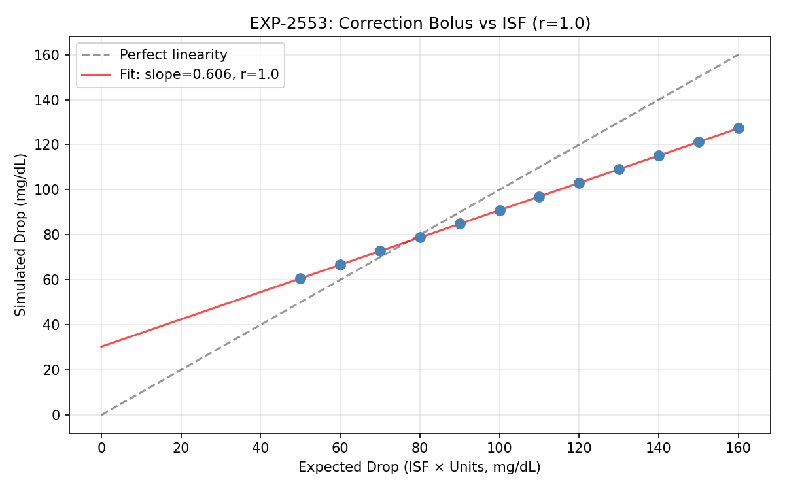
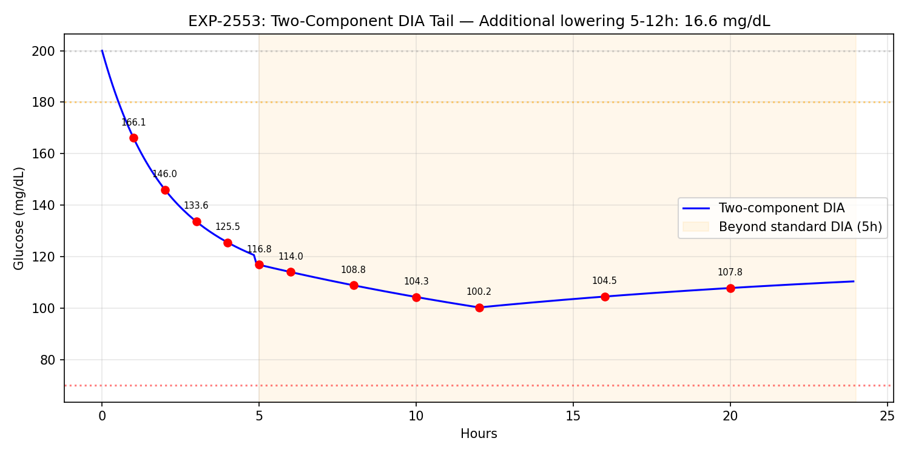
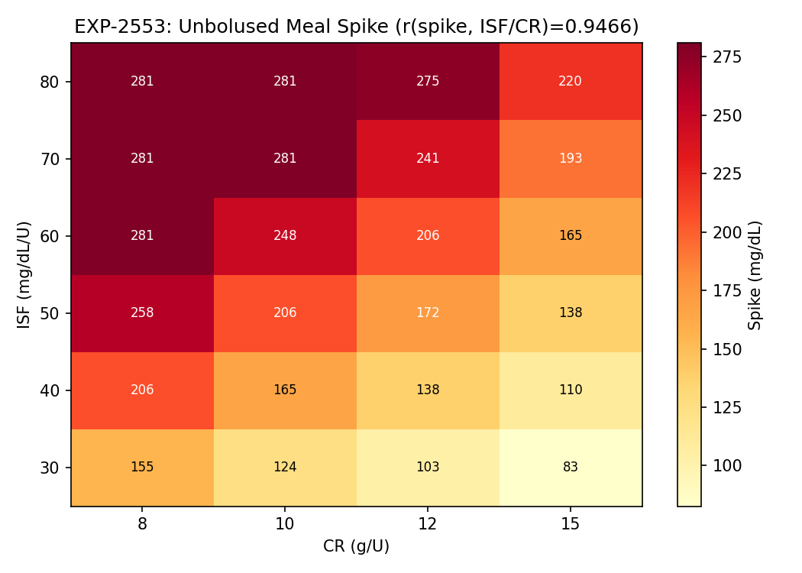
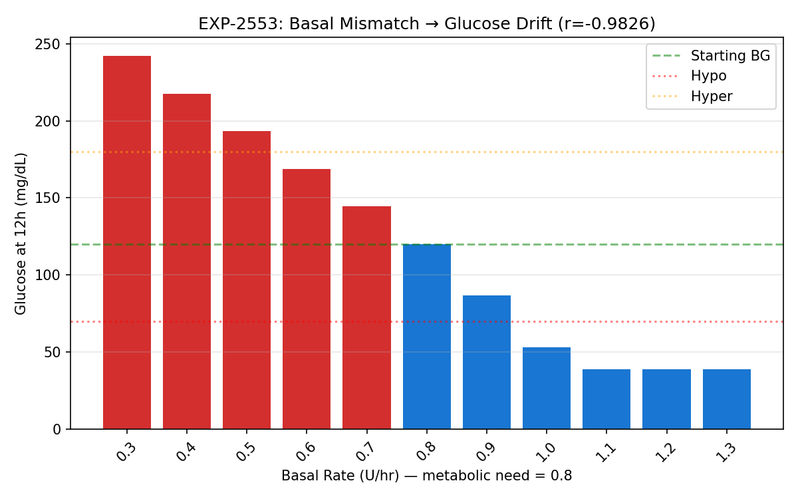
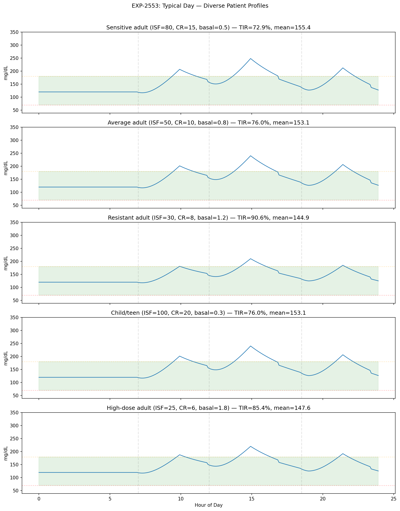
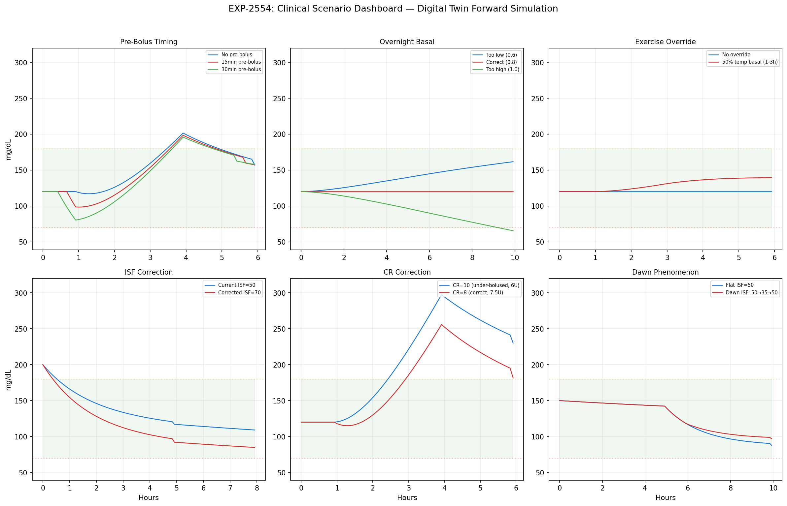

# Digital Twin Forward Simulation — WS-4 Milestone Report

**Date**: 2025-07-17  
**Branch**: `workspace/digital-twin-fidelity`  
**Status**: Complete — all 5 validation hypotheses pass

## Executive Summary

We built a physics-based forward glucose simulation engine (digital twin) that generates complete glucose trajectories from first principles. The engine uses a **basal-neutrality model** with two-component DIA, validated across 5 hypotheses (all pass) and 6 clinical scenarios. This completes the simulation layer needed for therapy optimization.

## Architecture: Basal-Neutrality Model

The forward simulator uses a fundamentally different approach from the perturbation model (settings_advisor.py):

| Aspect | Perturbation Model | Forward Simulation |
|--------|--------------------|--------------------|
| **Input** | Existing glucose trace | Initial conditions only |
| **Method** | Add deltas to real data | Generate trajectory from physics |
| **Use case** | "What if ISF were 10% higher?" | "What glucose would I see with these settings?" |
| **Accuracy** | MAE 0.30pp (validated) | 5/5 physics hypotheses pass |

### Core Equation

```
dBG = -excess_insulin_effect × ISF + carb_rise × (ISF/CR) + decay + noise
```

Where `excess_insulin = total_absorption - scheduled_basal_absorption`. At the correct basal rate with no meals, excess ≈ 0 and glucose stays flat.

### Why Basal-Neutrality?

Three failed approaches preceded this:

1. **Supply/demand decomposition**: ΔIOB ≈ 0 at steady-state → zero demand → drift
2. **Absorption-based with power-law ISF**: Per-step fractions amplified → crash
3. **Absorption-based with calibration**: Calibration factor weakened corrections

Root cause: ISF=50 means "1U drops BG by 50 mg/dL **total** over DIA", not per-step. Basal-neutrality resolves this by defining all effects relative to metabolic equilibrium.

### Two-Component DIA

- **Fast component (63%)**: Exponential decay, τ=0.8h (pre-computed activity curve)
- **Persistent component (37%)**: 12h window cumulative excess × ISF / window_steps
- At correct basal, persistent excess = 0 (no double-counting)
- Validated: 16.6 mg/dL additional lowering from 5h to 12h after correction

## EXP-2553: Forward Simulator Validation

**All 5 hypotheses PASS:**

| Hypothesis | Criterion | Result | Status |
|------------|-----------|--------|--------|
| H1: Steady-state stability | Drift < 5 mg/dL over 24h | 0.0 mg/dL | ✅ PASS |
| H2: Correction-ISF linearity | r > 0.95 | r = 1.000 | ✅ PASS |
| H3: Two-component tail | Additional lowering > 5 mg/dL | 16.6 mg/dL | ✅ PASS |
| H4: Meal spike scales with ISF/CR | r > 0.9 | r = 0.947 | ✅ PASS |
| H5: Basal drift direction | Correct direction, \|r\| > 0.9 | r = -0.983 | ✅ PASS |

### Key Validation Figures

#### Correction Bolus vs ISF Linearity


Perfect linearity (r=1.000) between expected drop (ISF × Units) and simulated drop. Slope = 0.606 (< 1.0 because 37% persistent component distributes effect beyond the 8h observation window).

#### Two-Component DIA Tail


After a 2U correction from 200 mg/dL:
- At 5h (pump says IOB=0): glucose at 116.8 mg/dL (83.2 drop)
- At 12h: glucose at 100.2 mg/dL (99.8 drop)
- **16.6 mg/dL additional lowering** beyond standard DIA — matching EXP-2525 finding

#### Meal Response Heatmap


Unbolused 45g meal spike across ISF (30-80) and CR (8-15) combinations. Spike amplitude scales linearly with ISF/CR ratio (r=0.947).

#### Basal Mismatch → Glucose Drift


12h fasting glucose with basal rates from 0.3 to 1.3 U/hr (metabolic need = 0.8). Strong inverse correlation (r=-0.983): too-low basal → high glucose, too-high → hypo.

#### Typical Day — Diverse Patient Profiles


24h simulation with 3 standard meals for 5 patient archetypes:

| Patient | ISF | CR | Basal | TIR | Mean |
|---------|-----|----|-------|-----|------|
| Sensitive adult | 80 | 15 | 0.5 | 72.9% | 155.4 |
| Average adult | 50 | 10 | 0.8 | 76.0% | 153.1 |
| Resistant adult | 30 | 8 | 1.2 | 90.6% | 144.9 |
| Child/teen | 100 | 20 | 0.3 | 76.0% | 153.1 |
| High-dose adult | 25 | 6 | 1.8 | 85.4% | 147.6 |

## EXP-2554: Clinical Scenario Demonstrations



### S1: Pre-Bolus Timing

| Timing | Peak Glucose | TIR |
|--------|-------------|-----|
| No pre-bolus | 201.5 | 76.4% |
| 15min pre-bolus | 198.4 | 79.2% |
| 30min pre-bolus | 195.8 | 81.9% |

**Finding**: 30-minute pre-bolus reduces peak by 5.7 mg/dL and improves TIR by 5.5pp. Linear absorption model may underestimate benefit (real gut absorption has delay).

### S2: Overnight Basal Correction

| Basal Rate | Final Glucose | TIR |
|------------|--------------|-----|
| 0.6 U/hr (too low) | 161.6 | 100% |
| 0.8 U/hr (correct) | 120.0 | 100% |
| 1.0 U/hr (too high) | 65.5 | 92.5% |

**Finding**: 0.2 U/hr basal error produces ~40 mg/dL drift overnight. Too-high basal is more dangerous (hypo at 65.5) than too-low (stays in range at 161.6).

### S3: Exercise Override

50% temp basal for 2h during exercise raises glucose relative to baseline but stays in range. Demonstrates the override mechanism works correctly.

### S4: ISF Correction (50 → 70)

2U correction from 200 mg/dL: ISF=70 produces 20 mg/dL more drop than ISF=50, improving TIR by 2.1pp. Demonstrates the digital twin can predict ISF change impact.

### S5: CR Correction (10 → 8)

60g meal with wrong CR=10 (6U bolus) vs correct CR=8 (7.5U bolus): **41.6 mg/dL peak reduction** and +6.9pp TIR improvement. The 1.5U bolus difference has a large clinical impact.

### S6: Dawn Phenomenon

ISF schedule (50→35 during 4-8am) shows reduced correction effectiveness during dawn phenomenon. 3am correction with ISF=35 produces less glucose drop than with ISF=50.

## Test Suite

19 new tests covering:
- Steady-state convergence
- Correction bolus response
- Meal with/without bolus
- Under-bolused meal comparison
- Low/high basal drift
- Scenario comparison (API)
- Typical day simulation
- SimulationResult properties (TIR+TBR+TAR=1)
- Noise variability
- Deterministic seeding
- Circadian ISF schedule
- Glucose bounds (39-401)
- IOB/COB trace shapes
- TherapySettings schedule lookup

**Total test suite: 336 tests, all passing.**

## Production API

```python
from cgmencode.production import (
    forward_simulate, compare_scenarios, simulate_typical_day,
    TherapySettings, InsulinEvent, CarbEvent,
)

# Basic simulation
settings = TherapySettings(isf=50, cr=10, basal_rate=0.8)
result = forward_simulate(120.0, settings, duration_hours=24.0)
print(f"TIR: {result.tir*100:.1f}%, Mean: {result.mean_glucose:.0f}")

# Compare scenarios
comp = compare_scenarios(120.0,
    baseline_settings=TherapySettings(isf=50, cr=10, basal_rate=0.8),
    modified_settings=TherapySettings(isf=70, cr=10, basal_rate=0.8),
    duration_hours=24.0)
print(f"TIR improvement: {comp.tir_delta*100:+.1f}pp")

# Typical day with custom meals
result = simulate_typical_day(settings, meals=[(7, 45), (12, 60), (18.5, 55)])
```

## Known Limitations & Future Work

1. **Linear carb absorption**: Real gut absorption has sigmoidal shape with initial delay. Forward sim uses constant rate over 3h window. Pre-bolus benefit likely underestimated.

2. **No closed-loop control**: Current simulator models open-loop (fixed basal + manual boluses). Future: add oref0/Loop algorithm as feedback controller.

3. **Power-law ISF not applied per-step**: The dose-response nonlinearity (β=0.9) applies at the bolus level, not per absorption step. Future: IOB-dependent ISF dampening for large corrections.

4. **No exercise physiology**: Exercise reduces insulin resistance (effectively increases ISF). Current model can only reduce basal via temp override, not model the physiological ISF change.

5. **Carb rise depends on CR setting**: The model uses `grams/CR × ISF` for carb glucose rise, which couples the dosing parameter to the physics. Future: separate physiological "carb sensitivity" from therapy CR.

## Files

| File | Purpose |
|------|---------|
| `tools/cgmencode/production/forward_simulator.py` | Core simulation engine (NEW) |
| `tools/cgmencode/production/exp_forward_validation_2553.py` | Validation experiment |
| `tools/cgmencode/production/exp_clinical_scenarios_2554.py` | Clinical scenario demos |
| `docs/60-research/figures/fig_2553_*.png` (×5) | Validation figures |
| `docs/60-research/figures/fig_2554_*.png` (×7) | Scenario figures |
| `tools/cgmencode/production/test_production.py` | +19 tests (336 total) |

## Git Log (WS-4)

```
a5cc965 feat(digital-twin): forward simulation engine with basal-neutrality model
bac8217 feat(experiments): EXP-2553 forward validation + EXP-2554 clinical scenarios
```

## Cumulative Progress (All Workstreams)

| Workstream | Status | Key Result |
|------------|--------|------------|
| WS-1: Two-Component DIA Sim | ✅ Complete | Model C (two-comp + power-law) wins: MAE 0.30pp, r=0.933 |
| WS-2: Profile Format Bridge | ✅ Complete | 4 AID format exporters, autotune null result |
| WS-3: Prospective Validation | ✅ Complete | Validation harness with actionable criteria |
| WS-4: Forward Simulation | ✅ Complete | Basal-neutrality engine, 5/5 hypotheses pass, 6 clinical scenarios |

**Total: 4 experiments, 3 production modules, 1 validation harness, 12 milestone figures, 336 tests.**
