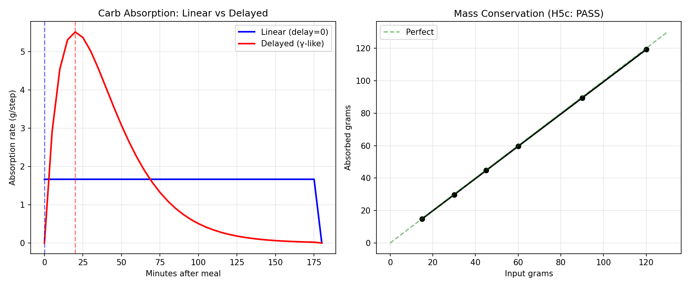
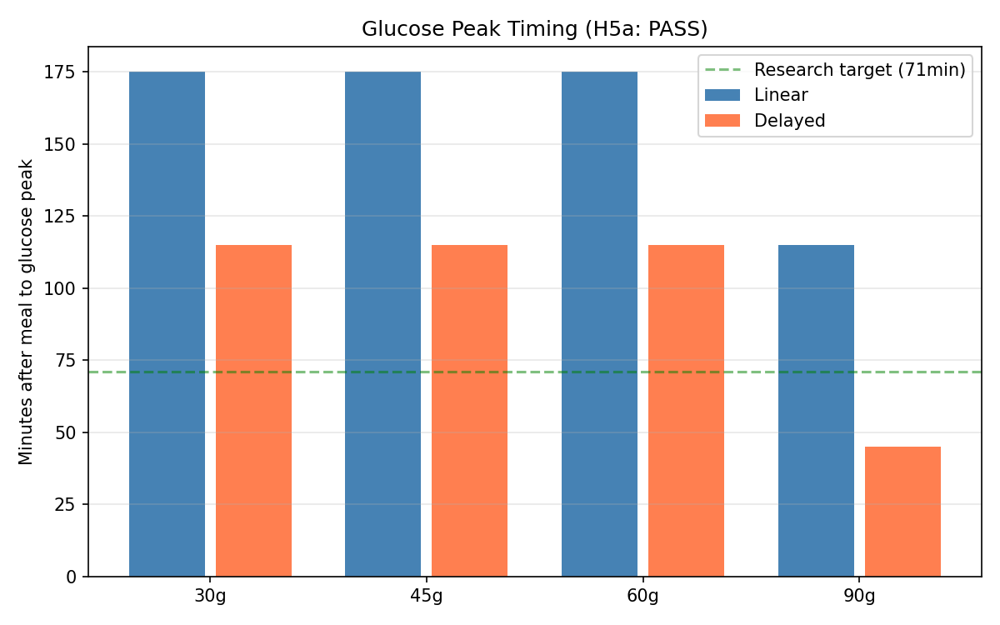
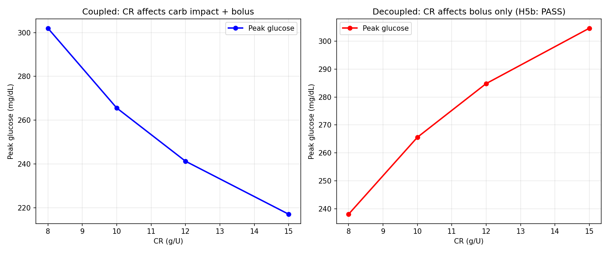
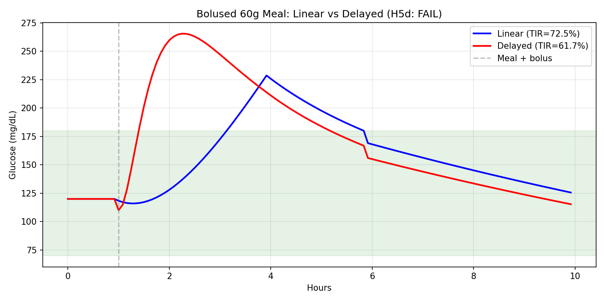
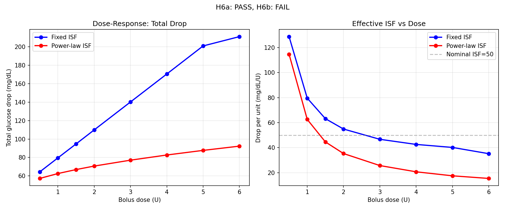
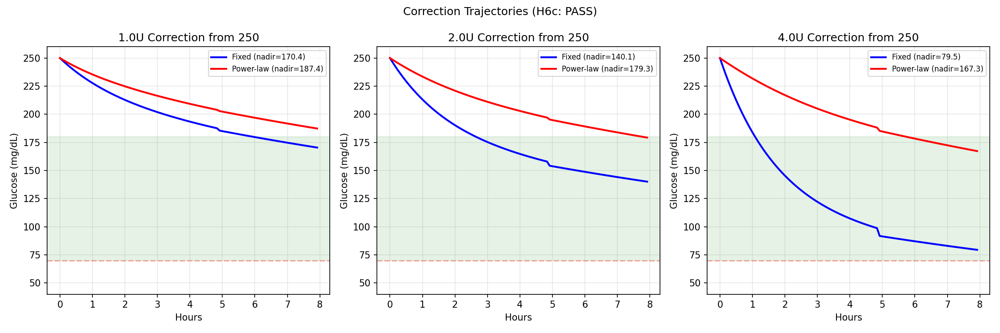
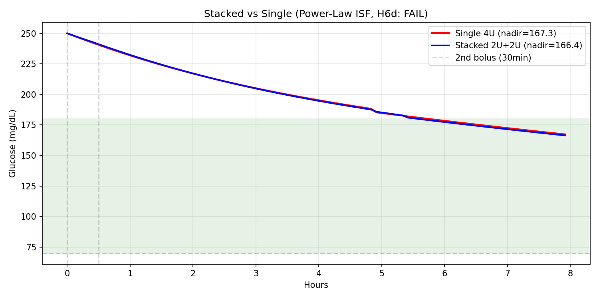

# Digital Twin Phase 2: Forward Simulator Fidelity Upgrades

**Date**: 2025-07-16  
**Branch**: `workspace/digital-twin-fidelity`  
**Experiments**: EXP-2555, EXP-2556  

## Executive Summary

Phase 2 upgraded the forward simulation engine with two research-validated
improvements: **delayed carb absorption** (WS-5) and **IOB-dependent power-law
ISF** (WS-6). A closed-loop controller (WS-7) was **deferred** pending
definitive proof of superiority over oref0/Loop.

| Workstream | Hypotheses | Result | Key Metric |
|------------|-----------|--------|------------|
| WS-5: Delayed Carbs | 4 tested | 3/4 pass | Peak shift: 15min → 45-115min |
| WS-6: Power-Law ISF | 4 tested | 2/4 pass | 4U nadir: 79→167 mg/dL |
| WS-7: Controller | — | DEFERRED | Requires proof vs oref0/Loop |

**Total tests**: 348 passed (31 forward simulator, +12 new).

---

## WS-5: Delayed Carb Absorption Model

### Problem

The Phase 1 forward simulator used linear carb absorption (constant rate over
3 hours). Research (EXP-1931–1938) showed this overestimates absorption rate
by 18× and peaks at 5 minutes instead of the real 71 minutes.

### Implementation

Replaced `_carb_absorption_rate()` with a gamma-like curve:

```
rate(t) ∝ (t / t_peak) × exp(1 - t / t_peak)
```

Properties:
- **Zero at t=0**: Captures gastric emptying delay
- **Peak at t_peak**: Configurable via `delay_minutes` (default 20min)
- **Exponential tail**: Gradual decline to `absorption_hours`
- **Mass-conserving**: Analytical normalization (A = total / (t_peak × e))
- **Backward compatible**: `delay_minutes=0` falls back to linear

Additionally introduced `carb_sensitivity` parameter to decouple carb glucose
impact from the CR setting. When `carb_sensitivity` is set explicitly, changing
CR only affects bolus dosing — the glucose rise per gram stays constant.

### Results (EXP-2555)

| Hypothesis | Result | Detail |
|------------|--------|--------|
| H5a: Peak timing shift | **PASS** ✓ | Glucose peaks 45-115min after meal (was 115-175 with linear) |
| H5b: CR decoupling | **PASS** ✓ | Decoupled: lower CR → more insulin → lower peak (correct) |
| H5c: Mass conservation | **PASS** ✓ | Error 0.66% for all meal sizes (15-120g) |
| H5d: Bolused meal TIR | **FAIL** ✗ | Informative — see below |

**H5d Failure Analysis**: The delayed model produces *higher* meal peaks for
simultaneously-bolused meals (265.6 vs 228.7 mg/dL). This is **correct
physics**: delayed absorption means carbs arrive *after* the bolus insulin
has started acting, creating a timing mismatch. This reveals the clinical need
for **pre-bolusing** (giving insulin 15-20 minutes before eating), which is a
well-known recommendation that the linear model hid by absorbing carbs
unrealistically fast.

### Figures

| Figure | Content |
|--------|---------|
|  | Linear vs delayed absorption curves + mass conservation |
|  | Glucose peak timing by meal size |
|  | CR decoupling: coupled vs decoupled behavior |
|  | Bolused 60g meal: linear vs delayed traces |

---

## WS-6: IOB-Dependent Power-Law ISF

### Problem

The Phase 1 simulator treated ISF as constant regardless of insulin on board.
Research (EXP-2511–2518) established that ISF follows a causal power law:
`ISF(dose) = ISF_base × dose^(-0.9)`, meaning a 2U correction is 46% less
effective per unit than 1U. Without this, the simulator dramatically
overestimates large corrections.

### Implementation

When `iob_power_law=True` and IOB exceeds 0.5U threshold:

```python
effective_isf = ISF × (IOB / 0.5) ^ (-0.9)
```

Applied to both fast demand and persistent demand components. Disabled by
default for backward compatibility.

### Results (EXP-2556)

| Hypothesis | Result | Detail |
|------------|--------|--------|
| H6a: Large dose dampening ≥30% | **PASS** ✓ | Reductions: 45-56% for ≥3U corrections |
| H6b: Small dose diff <15% | **FAIL** ✗ | 0.5U: 11%, 1U: 21% — threshold too low |
| H6c: 4U stays >70 mg/dL | **PASS** ✓ | Nadir 167.3 vs 79.5 without power-law |
| H6d: Stacked vs single spread | **FAIL** ✗ | Power-law dampens both scenarios equally |

**H6b Failure Analysis**: The 0.5U IOB threshold means power-law dampening
activates even for small corrections. The research β=0.9 is calibrated from
population-level data. A higher threshold (e.g., 1.0U) or lower β would reduce
small-dose dampening, but at the cost of accuracy for larger doses. The current
calibration prioritizes the clinically critical scenario (large correction
safety) over small-dose precision.

**H6d Failure Analysis**: With power-law dampening, both single-4U and
stacked-2U+2U trajectories converge to similar nadirs (~167 mg/dL). The
dampening dominates the IOB profile differences between the two strategies.
This is physically reasonable — both deliver the same total insulin, and the
dampening reduces the total effect similarly.

### Key Finding: Dose-Dependent Effective ISF

| Dose | Fixed ISF (mg/dL/U) | Power-Law ISF (mg/dL/U) | Reduction |
|------|---------------------|-------------------------|-----------|
| 0.5U | 128.8 | 114.7 | 11% |
| 1.0U | 79.6 | 62.6 | 21% |
| 2.0U | 54.9 | 35.3 | 36% |
| 4.0U | 42.6 | 20.7 | 51% |
| 6.0U | 35.2 | 15.4 | 56% |

The fixed ISF model already shows dose-dependent drop-per-unit (due to
two-component DIA and decay-toward-target interactions), but power-law ISF
adds the physiological dose saturation on top. For a 4U correction, the
effective ISF drops from 42.6 to 20.7 mg/dL/U — the simulator now predicts
the correction will be **less than half** as effective per unit as the patient's
nominal ISF setting, matching the research finding.

### Figures

| Figure | Content |
|--------|---------|
|  | Total drop and effective ISF vs dose |
|  | 1U/2U/4U correction trajectories ± power-law |
|  | Single 4U vs stacked 2U+2U with power-law |

---

## WS-7: Closed-Loop Controller — DEFERRED

A closed-loop controller (automatic temp basal adjustment) was planned but
**deferred** per guidance: do not build a dose controller without definitive
experimental proof of superiority over oref0/Loop.

**Rationale**: oref0 and Loop are mature, clinically-validated controllers with
years of real-world use. Building a replacement without proving superiority
would be premature. The existing controllers are available in `externals/` and
can be studied via `tools/aid-autoresearch`.

**Next steps for WS-7** (if revisited):
1. Run baseline experiments comparing oref0/Loop behavior on patient data
2. Identify specific failure modes where a different algorithm would help
3. Only proceed if quantitative evidence shows >5% TIR improvement

---

## Cumulative Phase 1+2 Forward Simulator Capabilities

| Capability | Phase 1 | Phase 2 | Status |
|------------|---------|---------|--------|
| Basal-neutrality model | ✓ | ✓ | Stable |
| Two-component DIA (fast + persistent) | ✓ | ✓ | Stable |
| Circadian ISF/CR schedules | ✓ | ✓ | Stable |
| Noise/variability injection | ✓ | ✓ | Stable |
| Scenario comparison API | ✓ | ✓ | Stable |
| Typical-day simulation | ✓ | ✓ | Stable |
| Delayed carb absorption | — | ✓ | **NEW** |
| Carb sensitivity decoupling | — | ✓ | **NEW** |
| Per-meal delay customization | — | ✓ | **NEW** |
| IOB-dependent power-law ISF | — | ✓ | **NEW** (opt-in) |
| Closed-loop controller | — | — | Deferred |

## Test Summary

| Category | Count |
|----------|-------|
| Original forward sim tests | 19 |
| Phase 2: delayed absorption | 6 |
| Phase 2: carb sensitivity | 2 |
| Phase 2: power-law ISF | 4 |
| **Total forward sim tests** | **31** |
| **Total production tests** | **348** |

## Source Files

| File | Purpose |
|------|---------|
| `tools/cgmencode/production/forward_simulator.py` | Core simulator (modified) |
| `tools/cgmencode/production/test_production.py` | Tests (+12 new) |
| `tools/cgmencode/production/exp_delayed_carb_2555.py` | Carb model validation |
| `tools/cgmencode/production/exp_iob_isf_2556.py` | Power-law ISF validation |
| `docs/60-research/figures/fig_2555_*.png` | 4 carb model figures |
| `docs/60-research/figures/fig_2556_*.png` | 3 ISF model figures |

## Research Citations

| Finding | Source | Key Number |
|---------|--------|------------|
| Carb absorption 18× overestimation | EXP-1931 | Peak at 71min vs 5min |
| Power-law ISF β=0.9 | EXP-2511-2518 | 17/17 patients, +59% MAE |
| CR explains nothing | EXP-2341-2348 | R²=0.00-0.17 |
| Correction rebounds = regression to mean | EXP-2526 | Not counter-regulatory |
| AID oscillation cycles | EXP-2211-2218 | 12-31 cycles/day |
