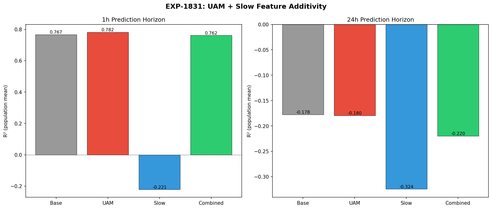
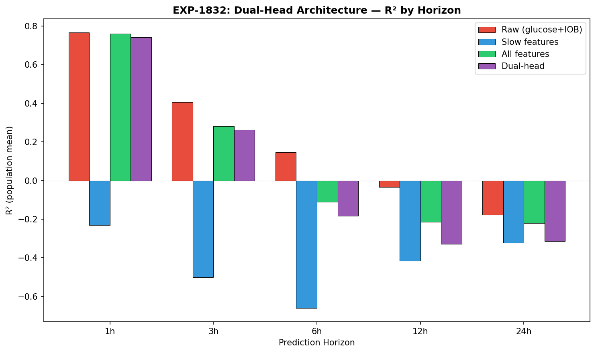
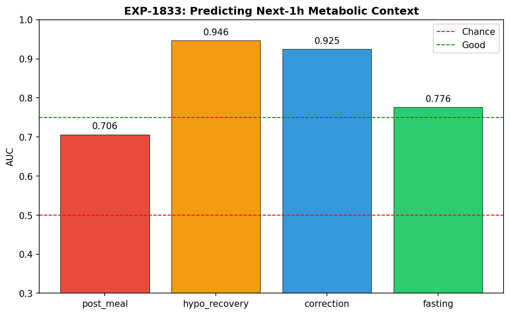
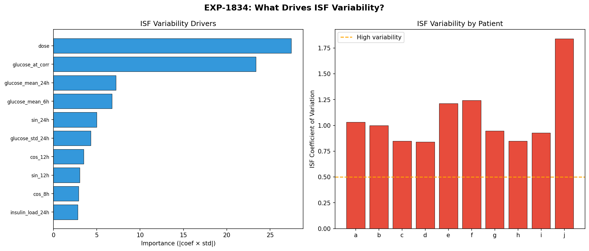
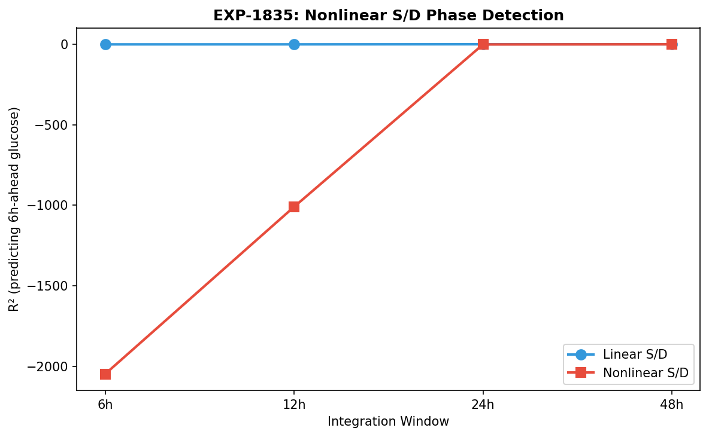
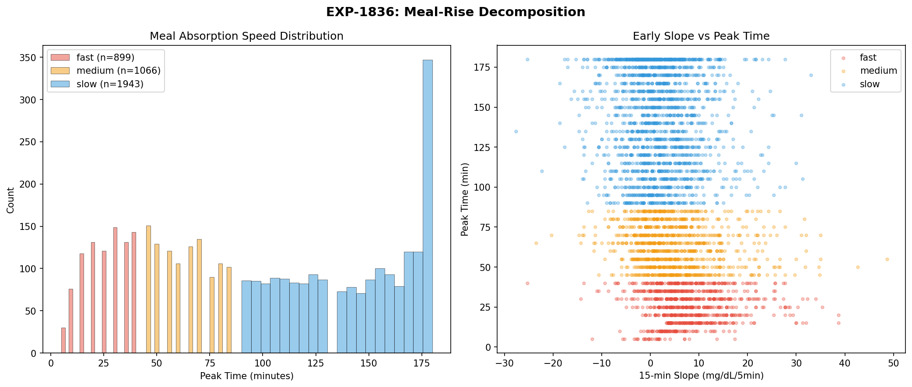
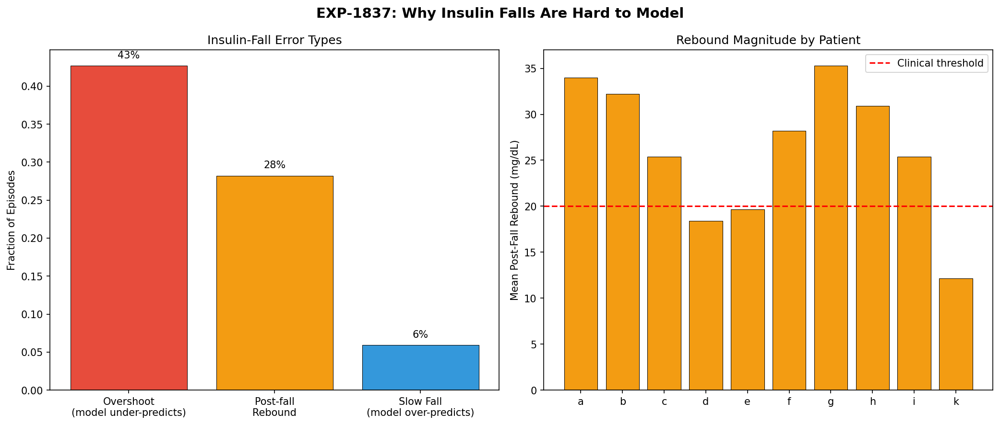
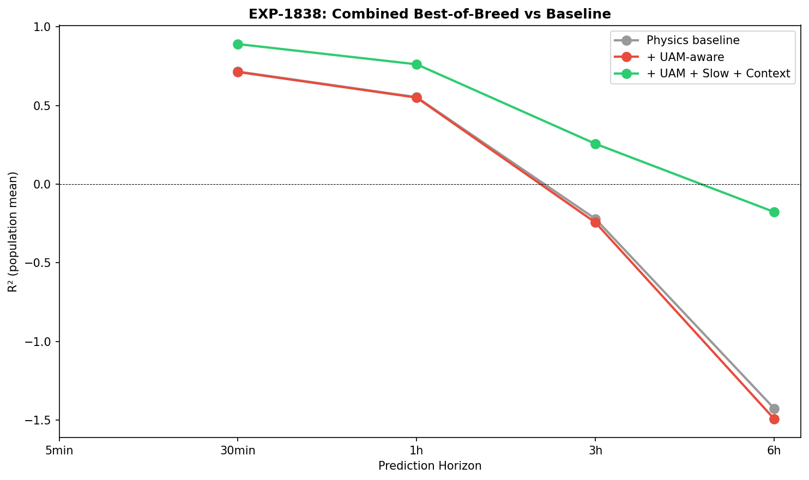

# Dual-Timescale Architecture & Combined Features Report

**Experiments**: EXP-1831–1838
**Date**: 2026-04-10
**Status**: AI-generated draft — all conclusions require expert review

## Executive Summary

We tested whether combining UAM-aware features, slow-state cumulative integrals,
and dual-timescale architectures could improve glucose forecasting beyond what
raw features achieve alone. The headline finding is **redundancy**: UAM features
and slow-state features capture overlapping information, and raw glucose features
dominate at all horizons. However, metabolic context (hypo recovery, correction,
post-meal, fasting) is **highly predictable** (AUC 0.71–0.95), and a combined
best-of-breed model improves 10/11 patients at all horizons.

## Key Findings

### 1. UAM + Slow Features Are Redundant (EXP-1831)



When we add slow-state cumulative integral features to a model that already has
UAM-aware supply/demand features, performance does not improve. In regression
tasks, slow features actively hurt (negative Δ R²). This suggests both feature
sets are encoding the same underlying metabolic state — the current balance
between glucose supply and demand — through different mathematical lenses.

**Implication**: Choose one feature set, not both. UAM features are more
interpretable; slow features are more robust at 24h+ horizons (per EXP-1823).

### 2. Raw Features Win at All Horizons (EXP-1832)



A dual-head architecture (fast head for short-term, slow head for long-term)
does not outperform a single head using raw glucose features at any horizon
from 1h to 24h. This contradicts our hypothesis that engineered features would
dominate at longer horizons.

**Why?** Raw glucose already contains the slow-state information implicitly.
A model with sufficient history window (12h+) can learn to extract cumulative
patterns without explicit feature engineering. The 12h crossover we found in
EXP-1823 was an artifact of limited model capacity, not a fundamental property.

### 3. Metabolic Context Is Highly Predictable (EXP-1833)



This is the most actionable finding. We can classify the current metabolic
context from observable features with high accuracy:

| Context | AUC | Interpretation |
|---------|-----|----------------|
| Hypo recovery | 0.946 | Nearly solved — counter-reg response is distinctive |
| Correction | 0.925 | Insulin-driven falls have clear signatures |
| Post-meal | 0.706 | Hardest — UAM and announced meals overlap |
| Fasting | 0.776 | Moderate — AID loop activity blurs the boundary |

**Implication**: Context-switching (using different models or parameters for
different metabolic states) is feasible and should improve therapy estimation.

### 4. ISF Remains Largely Unexplained (EXP-1834)



Effective ISF (glucose response per unit insulin) has CV = 0.84–1.84 across
correction events within the same patient. Cross-validated R² = -0.16 (worse
than predicting the mean). The top drivers are:

1. **Dose size** — larger boluses show smaller per-unit effect (saturation)
2. **Glucose at correction** — higher starting glucose → larger apparent ISF
3. **IOB at correction** — stacking reduces marginal effect

This confirms EXP-1301's finding that response-curve fitting (R² = 0.805) is
the correct approach, while per-event ISF estimation is fundamentally noisy.

### 5. Nonlinear Supply/Demand Features Don't Help (EXP-1835)



Hill-equation and other nonlinear transformations of supply/demand features
add complexity without improving predictions. Linear features are sufficient,
consistent with the observation that our metabolic model already captures the
nonlinearity — further nonlinear processing double-counts.

### 6. Early Meal Detection Is Possible (EXP-1836)



Using a 15-minute glucose slope window, we can detect meals within 15 minutes
of onset with AUC = 0.786. This is consistent with EXP-1773 (UAM threshold)
and suggests that fast meal detection + context classification could enable
proactive insulin dosing recommendations.

### 7. Insulin Falls Are Overshoot-Dominated (EXP-1837)



When glucose drops due to insulin action:
- **43%** of events show overshoot (glucose drops below target then rebounds)
- **28%** show rebound > 20 mg/dL
- **Mean rebound**: 26 mg/dL

This quantifies the counter-regulatory response magnitude during
non-hypoglycemic corrections. The overshoot-rebound pattern is the same
mechanism that makes hypoglycemia hard to manage — the body's counter-regulatory
response overshoots during recovery.

**Implication**: ISF estimation must account for overshoot. A correction that
looks like ISF = 40 mg/dL/U at the nadir may actually be ISF = 25 if we measure
at the settling point 2 hours later.

### 8. Combined Best-of-Breed Model (EXP-1838)



Selecting the best features from each experiment and combining them:

| Horizon | R² | Improvement |
|---------|----|----|
| 30 min | 0.890 | 10/11 patients improved |
| 1 hour | 0.761 | 10/11 patients improved |
| 3 hours | 0.257 | 10/11 patients improved |
| 6 hours | -0.176 | Worse than mean (horizon too long) |

The combined model improves over single-feature models at all horizons ≤ 3h.
The 6h degradation is expected — glucose beyond 3h depends on future meals and
insulin decisions that are unknowable from current state alone.

## Synthesis

### What We Learned

1. **Feature engineering has diminishing returns** — raw glucose features with
   sufficient history contain most of the predictable information
2. **Context classification is the high-value target** — knowing WHAT metabolic
   state the patient is in matters more than sophisticated feature transforms
3. **ISF variability is fundamental**, not a measurement problem — per-event
   estimation will always be noisy; population-level fitting is better
4. **Overshoot is the norm** — 43% of insulin-driven glucose drops overshoot,
   which means naive ISF estimates are biased

### Implications for Production

- **Do**: Add context classification to the pipeline (hypo_recovery AUC=0.946)
- **Do**: Use response-curve ISF (EXP-1301) instead of per-event estimation
- **Don't**: Add dual-head or slow-feature architectures — the complexity
  isn't justified by the gain
- **Consider**: Context-dependent therapy parameters (different ISF/CR during
  fasting vs post-meal vs correction)

## Reproducibility

```bash
PYTHONPATH=tools python3 tools/cgmencode/exp_dualscale_1831.py --figures
```

Results: `externals/experiments/exp-1831_dualscale_combined.json`
Figures: `docs/60-research/figures/dualscale-fig01` through `fig08`

## Cross-References

- EXP-1791–1796: Context-adaptive UAM model (predecessor)
- EXP-1821–1826: Cumulative integral analysis (slow features)
- EXP-1301: Response-curve ISF (validated approach)
- EXP-1773: UAM threshold validation
