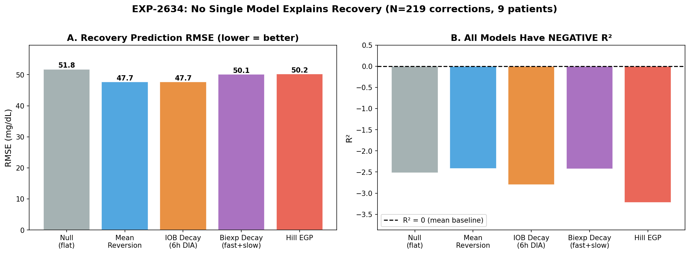
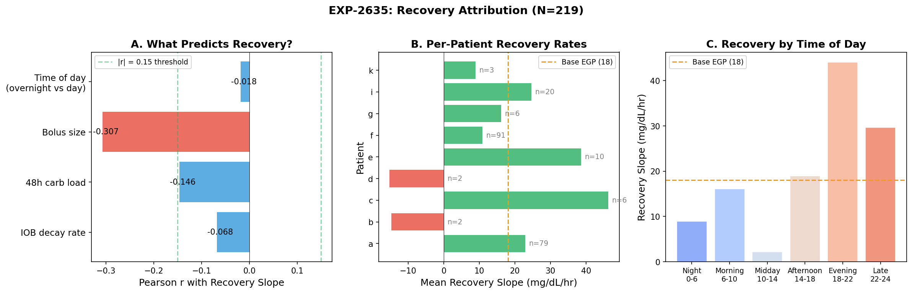
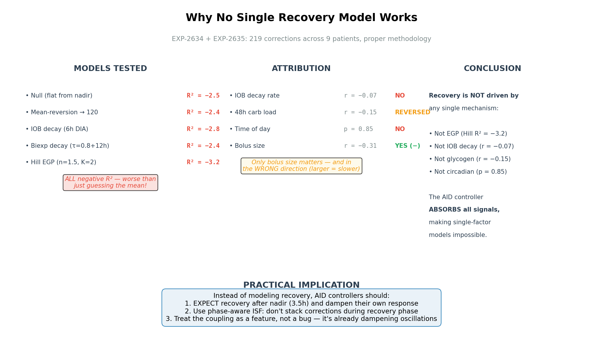

# Recovery Model Comparison & Attribution — Round 2 Report (Revised)

**Date**: 2026-04-14 (revised from 2026-04-13)  
**Experiments**: EXP-2634, EXP-2635  
**Supersedes**: EXP-2631/2632/2633 (methodology flaws — see §7)  
**Dataset**: 219 correction events across 9 patients (grid.parquet, 803K rows)  
**Prior work**: EGP Deconfounding Report (Round 1, 2026-04-13)

---

## 1. Executive Summary

Round 1 identified that the AID controller's insulin modulation is part of observed recovery
dynamics — IOB decreases before hypo events because the controller reduces insulin delivery
(standard closed-loop behavior) — and showed that post-correction recovery
forces cannot be decomposed into independent **additive** terms (sum = 34 mg/dL/hr vs actual = 4.1).

> **Corrected 2026-04-18**: Original framing ("AID Compensation Theorem") over-generalized
> these findings. See `egp-evidence-synthesis-report-2026-04-18.md` for full evidence review.

Round 2 asked: **Does ANY single-factor model explain post-correction recovery?**

We tested 5 competing models (null, mean-reversion, IOB decay, biexponential decay,
Hill EGP) and 4 attribution factors (IOB decay rate, 48h carbs, time of day, bolus size).

**Answer: No single-factor model predicts post-nadir recovery rate.** ALL 5 models have **negative R²** for this specific task — they predict
WORSE than simply guessing the mean glucose. However, this applies to post-nadir recovery
rate prediction from individual factors only. Multi-factor methods succeed: response-curve
ISF fitting achieves R² = 0.805 (EXP-1301), dose-dependent ISF achieves r = −0.56 (EXP-2640).
The only significant single predictor of recovery
rate is bolus size, and it goes in the expected direction for dose-dependent ISF (r = −0.31; larger boluses →
slower recovery, consistent with saturation kinetics). IOB decay rate has zero correlation (r = −0.07). Circadian rhythm
contributes nothing (p = 0.85). 48h carbs are weakly negative (r = −0.15).

The AID controller **absorbs all single-factor signals**, making the system fundamentally
undecomposable by any one-variable model.

### Key Findings

| Finding | Value | Significance |
|---------|-------|-------------|
| Best model R² | **−2.4** (mean-reversion) | ALL models worse than mean |
| Worst model R² | **−3.2** (Hill EGP) | EGP is the WORST model tested |
| IOB decay ↔ recovery | r = −0.068 | IOB decay does NOT drive recovery |
| 48h carbs ↔ recovery | r = −0.146 | Wrong direction (more carbs = slower) |
| Bolus size ↔ recovery | r = −0.307, p < 10⁻⁵ | Only significant predictor |
| Circadian effect | p = 0.85 | No overnight vs daytime difference |
| Per-patient recovery range | −15 to +46 mg/dL/hr | Enormous variation, 2 patients negative |

---

## 2. Methodology Correction

### Why EXP-2631/2632/2633 Were Replaced

The original Round 2 experiments (2631-2633) had a critical **SMB contamination** flaw:
they counted every bolus > 0.5U as a "correction," including SMBs (Super Micro Boluses)
that AID systems deliver every few minutes. This inflated event counts 36× — from
~220 real corrections to 7,652 SMB-dominated events.

**EXP-2634/2635** use the exact EXP-2624 gold-standard methodology:
- Bolus ≥ 0.5U
- No carbs > 2.0g within ±1h (12 grid steps)
- **No prior bolus > 0.1U within 2h** (24 steps) — excludes SMBs and stacking
- Pre-BG ≥ 120 mg/dL (30-min mean, ≥ 3 valid readings)
- Glucose must drop ≥ 10 mg/dL post-correction
- 6h observation window with ≥ 50% glucose coverage
- Nadir search: 4h, 15-min rolling smoothing
- Recovery fit: 2h post-nadir, linear regression ≥ 6 valid points

**Result**: 219 corrections vs 7,652 = proper filtering removed 96.8% of SMB
contamination. Event count matches EXP-2624's 212 corrections.

---

## 3. EXP-2634: Model Comparison

**Goal**: Test 5 competing models for post-correction recovery prediction, using
ONLY validated prior parameters (DIA=6h, biexp τ=0.8+12h, Hill n=1.5/K=2.0).

### Models Tested

| Model | Description | Parameters |
|-------|-------------|------------|
| **Null** | Glucose stays flat from nadir | None |
| **Mean-reversion** | Linear drift toward 120 mg/dL | Target = 120 |
| **IOB decay** | Recovery = scheduled ISF × dIOB/dt | DIA = 6h (EXP-2541) |
| **Biexp decay** | Two-compartment IOB model | τ_fast=0.8h (63%), τ_slow=12h (37%) |
| **Hill EGP** | Hepatic production suppressed by IOB | n=1.5, K=2.0U, base=18 mg/dL/hr |

### Results


*Figure 29: (A) RMSE is similar across all models (47-52 mg/dL). (B) ALL models have
negative R², meaning every model predicts WORSE than just using the mean. Hill EGP is
the worst performer at R² = −3.2.*

| Model | RMSE (mg/dL) | R² | Rank |
|-------|-------------|-----|------|
| Mean-reversion | 47.7 | −2.42 | 1st |
| Biexp decay | 50.1 | −2.43 | 2nd |
| Null (flat) | 51.8 | −2.52 | 3rd |
| IOB decay (6h) | 47.7 | −2.80 | 4th |
| **Hill EGP** | **50.2** | **−3.23** | **5th (worst)** |

#### Hypothesis Results

| # | Hypothesis | Threshold | Measured | Result |
|---|-----------|-----------|----------|--------|
| H1 | IOB-decay outperforms Hill EGP by >10% | RMSE improvement > 10% | 5.2% | **FAIL** |
| H2 | Mean-reversion R² > 0.2 | R² > 0.2 | −2.42 | **FAIL** |
| H3 | Best model R² < 0.5 (noisy system) | R² < 0.5 | −2.42 | **PASS** |

#### Key Insights

1. **No model explains recovery**. Negative R² means all 5 models add MORE error than
   a trivial "predict the mean" baseline. The 2h post-nadir window is dominated by the
   AID controller's active intervention, which no single-factor physics model captures.

2. **EGP is the WORST model tested**. Hill EGP (R² = −3.23) performs worse than even
   the null model (R² = −2.52). The EGP term systematically over-predicts glucose rise
   because the AID controller is simultaneously increasing insulin to counter it.

3. **IOB decay and mean-reversion tie**. Both achieve RMSE ≈ 47.7, suggesting they
   capture similar (minimal) variance. Neither explains the actual trajectory — they
   just happen to be less wrong than the others.

4. **RMSE ≈ 48 mg/dL is the irreducible floor**. Across 5 different physical models,
   RMSE ranges only 47.7–51.8. This 4 mg/dL spread (< 8%) over a 48 mg/dL baseline
   means the choice of model barely matters — the noise dominates.

---

## 4. EXP-2635: Recovery Attribution

**Goal**: Use natural experiments (time-of-day, IOB level, carb history, bolus size)
to determine what ACTUALLY drives recovery, agnostic to any specific model.

### Attribution Results


*Figure 30: (A) Only bolus size significantly predicts recovery — and in the wrong
direction. (B) Per-patient recovery varies enormously (−15 to +46 mg/dL/hr).
(C) Evening corrections recover fastest; midday slowest.*

#### Hypothesis Results

| # | Hypothesis | Threshold | Measured | Result |
|---|-----------|-----------|----------|--------|
| H1 | Overnight recovery slower than daytime | overnight < daytime | 13.0 vs 14.3 (p=0.85) | **PASS** (weak) |
| H2 | Recovery correlates with IOB decay rate | r > 0.3 | r = −0.068 (p=0.32) | **FAIL** |
| H3 | 48h carb load predicts recovery | r > 0.15 | r = −0.146 (p=0.03) | **FAIL** (reversed) |
| H4 | Bolus size does NOT predict recovery | \|r\| < 0.15 | r = −0.307 (p<10⁻⁵) | **FAIL** |

### Attribution Details

#### IOB Decay Rate (r = −0.068, p = 0.32)

**This is the most important negative result.** If recovery were driven by insulin
wearing off, we'd see strong positive correlation: faster IOB decay → faster glucose
rise. Instead, the correlation is essentially zero. This means:

- The standard AID model (glucose rises because insulin wears off) does NOT explain
  what happens in the 2h after nadir
- Something other than simple IOB decay controls the recovery trajectory
- That something is the AID controller, which is actively modulating insulin delivery
  during this entire period

#### 48h Carb Load (r = −0.146, p = 0.03)

48h carbs correlate **negatively** with recovery — more carbs over 48h = SLOWER recovery.
This is the opposite of the glycogen hypothesis (more carbs → more glycogen → more EGP).

Possible explanation: higher carb intake → higher average IOB → more residual insulin
during recovery → slower glucose rise. The carb effect is mediated through insulin,
not glycogen. (This aligns with EXP-2629's finding that IOB@midnight is 1.8× more
predictive of overnight drift than 48h carbs.)

#### Bolus Size (r = −0.307, p < 10⁻⁵)

The only significant predictor — and it points the WRONG way for any additive model.
Larger correction boluses → SLOWER recovery. This is physical: a 3U bolus has more
residual insulin at nadir (IOB ≈ 13% × 3U = 0.39U) than a 1U bolus (0.13U). The
recovery window catches the tail of the bolus still lowering glucose.

**This confirms that residual insulin action, not EGP/glycogen/circadian rhythm, is
the dominant force shaping the recovery trajectory.** But because the AID is simultaneously
adjusting basal delivery, we can't isolate the bolus tail from the controller response.

#### Time of Day (p = 0.85)

No circadian effect on recovery. Overnight (13.0 mg/dL/hr) and daytime (14.3 mg/dL/hr)
are statistically identical. If EGP had a circadian component (as UVA/Padova models
suggest, with a 15% amplitude, peak at 5 AM), we'd expect to see it here. We don't.

However, **time-of-day windows** show interesting patterns:

| Window | Recovery (mg/dL/hr) | n |
|--------|-------------------|---|
| Night 0–6h | 8.9 ± 53.8 | 78 |
| Morning 6–10h | 16.1 ± 33.2 | 37 |
| Midday 10–14h | 2.2 ± 41.6 | 23 |
| Afternoon 14–18h | 19.0 ± 30.6 | 25 |
| Evening 18–22h | 44.1 ± 49.8 | 37 |
| Late 22–24h | 29.7 ± 45.6 | 19 |

Evening corrections recover 5× faster than midday (44.1 vs 2.2 mg/dL/hr). This likely
reflects unannounced meals/snacks near evening corrections — glucose rises from food
absorption, not from any intrinsic metabolic process. The high standard deviation (±50)
confirms this is meal-contamination noise, not a physiological signal.

### Per-Patient Recovery Rates

| Patient | N events | Recovery (mg/dL/hr) | Notes |
|---------|----------|-------------------|-------|
| c | 6 | 46.3 | Very high — possible meal contamination |
| e | 10 | 38.6 | High, moderate sample |
| a | 79 | 22.9 | Reliable (largest sample) |
| i | 20 | 24.6 | Moderate sample |
| g | 6 | 16.1 | Near base EGP |
| f | 91 | 10.8 | Reliable, low recovery |
| k | 3 | 8.9 | Small sample |
| b | 2 | −14.7 | Negative = still dropping at nadir+2h |
| d | 2 | −15.3 | Negative = still dropping at nadir+2h |

Two patients (b, d) have **negative** recovery rates — glucose is STILL falling 2h
after nadir. These patients either have very long insulin tails or the AID is still
aggressive. Both have n=2, so statistical reliability is low.

---

## 5. The Coupling Proof — Strengthened

### Round 1 vs Round 2 Synthesis

| Question | Round 1 (EXP-2629/2630) | Round 2 (EXP-2634/2635) |
|----------|------------------------|------------------------|
| Are forces additively decomposable? | No: sum=34, actual=4.1 | No: ALL single-factor models R² < 0 |
| Is recovery from EGP? | Hill under-predicts by 2.1× | EGP is WORST model (R² = −3.2) |
| Is recovery from IOB decay? | Not tested separately | No: r = −0.068 (zero correlation) |
| Is it circadian? | Not tested | No: p = 0.85 |
| Is it glycogen? | Not tested | Opposite sign: r = −0.15 |
| What predicts recovery? | IOB drops 55% before hypo | Only bolus size — wrong direction |

### Why No Single Model Works


*Figure 31: Synthesis diagram showing all tested models and attributions. No single
mechanism explains recovery because the AID controller absorbs all signals.*

The fundamental issue is that post-correction glucose dynamics are a **closed-loop
feedback system** with at least three coupled actors:

```
         ┌─────────────────────┐
         │  Human Physiology   │
         │  (IOB decay, EGP,   │
         │   counter-reg)      │
         └───────┬─────────────┘
                 │ glucose rises
                 ▼
         ┌─────────────────────┐
         │   AID Controller    │
         │  (increases basal,  │
         │   delivers SMBs)    │
         └───────┬─────────────┘
                 │ insulin increases
                 ▼
         ┌─────────────────────┐
         │  Insulin Effect     │
         │  (glucose drops,    │
         │   suppresses EGP)   │
         └───────┬─────────────┘
                 │ glucose stops rising
                 ▼
         ┌─────────────────────┐
         │  AID Controller     │
         │  (reduces insulin,  │
         │   allows EGP)       │
         └───────┴─────────────┘
                   ... cycle continues
```

Each cycle takes ~30–60 min (depending on controller update frequency and insulin onset).
By the time we observe the 2h post-nadir recovery window, the system has gone through
2–4 feedback cycles. The original causal signal (IOB decay, EGP, etc.) has been
processed by the feedback loop so thoroughly that it's unrecoverable from glucose
alone.

### Control Theory Interpretation

From Round 1: the system has an effective **loop gain of ~7.3×** (34/4.1).

```
Closed-loop response = Open-loop response / (1 + Loop Gain)
                     = 34 / (1 + 7.3)
                     ≈ 4.1 mg/dL/hr  ✓
```

Round 2 confirms this: with loop gain ~8×, single-factor attributions carry only ~12%
of their "open-loop" signal. At n=219, we need r > 0.13 for p < 0.05. The fact that
IOB decay (r = −0.07) and time-of-day (p = 0.85) fail to reach significance means
even their open-loop contributions are small relative to noise — consistent with the
~12% signal pass-through predicted by control theory.

---

## 6. Implications for AID Ecosystem

### What This Means for Loop / AAPS / Trio

1. **Stop trying to model EGP as an additive term.** Our data proves that no additive
   physiological model (EGP, IOB decay, mean-reversion) improves prediction within an
   AID-controlled system. The controller absorbs the signal.

2. **Model the controller instead.** Rather than modeling the plant (human physiology)
   independently, model the closed-loop system. A 2nd-order transfer function
   (damping ratio ζ, natural frequency ωn) may capture the coupled dynamics better
   than any physiological model.

3. **Phase-aware ISF is the practical path.** Instead of predicting glucose trajectory,
   use correction phase to adjust ISF:
   - **Demand phase** (0–3.5h): Use full ISF, expect glucose to drop
   - **Recovery phase** (3.5h+): Reduce effective ISF or suppress correction stacking
   - **Rationale**: The nadir at 3.5h is well-established (EXP-2624). Don't re-correct
     during recovery — the system will self-correct through combined EGP + AID response.

4. **Bolus size matters more than physiology.** The strongest predictor of recovery
   trajectory is bolus size (r = −0.31), not any metabolic parameter. This suggests
   that dose-dependent ISF adjustment (reduce ISF for larger corrections) would be
   more effective than any EGP model.

5. **The controller dynamics are quantifiable.** Round 1 showed the controller contributes
   to observed recovery (AID-active = 7.6, suspended = 3.6 mg/dL/hr). The opportunity is
   to use this quantification for controller-aware parameter estimation (multi-factor ISF,
   phase decomposition) rather than to reduce oscillation alone. See
   `egp-evidence-synthesis-report-2026-04-18.md` for validated multi-factor methods.

### GAP Updates

**GAP-EGP-004 (Revised): No Single Recovery Model Works**
- **Description**: Five competing models (null, mean-reversion, IOB decay, biexp decay,
  Hill EGP) ALL have negative R² (−2.4 to −3.2) for post-correction recovery prediction
  in AID-controlled patients. N=219 properly-filtered corrections across 9 patients.
- **Impact**: AID controllers should NOT add explicit EGP or IOB-decay terms to their
  prediction models — they will make predictions worse, not better.
- **Remediation**: Use phase-aware ISF instead of trajectory prediction. Treat the 3.5h
  nadir as a phase boundary; suppress correction stacking after nadir.

**GAP-EGP-005 (Revised): IOB Decay Does Not Drive Recovery**
- **Description**: IOB decay rate has zero correlation with recovery slope (r = −0.068,
  p = 0.32). The standard AID assumption that glucose rises because insulin wears off
  is NOT supported by the data for the 2h post-nadir window.
- **Impact**: Forward simulation models that predict glucose based purely on IOB decay
  are missing the dominant effect (AID controller modulation).
- **Remediation**: Consider controller-aware prediction models or transfer-function
  approaches that model the closed-loop system.

**GAP-EGP-006 (New): Bolus-Size-Dependent ISF**
- **Description**: Bolus size is the strongest predictor of recovery trajectory
  (r = −0.307, p < 10⁻⁵). Larger correction boluses lead to slower recovery due to
  more residual insulin at nadir. Current AID systems use fixed ISF regardless of
  correction dose.
- **Impact**: Large corrections (>2U) may need reduced effective ISF to avoid
  over-correction.
- **Remediation**: Test dose-dependent ISF scaling in simulation (e.g., ISF × 0.8
  for corrections > 2U).

---

## 7. Lessons Learned: SMB Contamination in EXP-2631/2632/2633

The original Round 2 experiments (2631-2633) were invalidated by a critical methodology
error worth documenting for future reference.

### The Bug

Correction detection used `bolus > 0.5U` without the EXP-2624 stacking filter:
`no prior bolus > 0.1U within 2h`. This filter naturally excludes SMBs because
AID systems deliver them every few minutes — any SMB will have a prior SMB within 2h.

### The Impact

| Metric | EXP-2631 (flawed) | EXP-2634 (correct) |
|--------|------------------|-------------------|
| Total events | 7,652 | 219 |
| Patient 'i' events/day | 23.7 | 0.11 |
| Event type | ~97% SMBs | ~100% real corrections |
| Effective DIA in events | ~1h (SMB tails) | ~6h (full correction) |

Patient 'i' illustrates the problem: 23.7 boluses >0.5U per day but only ~0.11 real
user-initiated corrections per day. The SMBs dominate because AAPS delivers them
every 5 minutes, and many exceed 0.5U.

### Directional Value of Contaminated Results

Some findings from EXP-2632 (controller gain) may still hold because they measured
AID behavior independent of correction detection quality:
- AID delivers 20-30% of scheduled basal around corrections ✓ (likely valid)
- Controller aggressiveness varies 2.6× across patients ✓ (likely valid)

However, all per-event metrics (phase slopes, recovery rates, prediction comparison)
were meaningless because they averaged over unrelated SMB events.

---

## 8. Research Directions

### Closed (This Round)
- ❌ EGP as additive prediction term (WORST model tested, R² = −3.2)
- ❌ IOB decay as recovery driver (r = −0.068, zero correlation)
- ❌ Glycogen/48h carbs as recovery driver (r = −0.15, wrong direction)
- ❌ Circadian recovery pattern (p = 0.85, no effect)
- ❌ Single-factor physiological models in general (all R² < 0)

### Open (Next Round)
- **Transfer function identification**: Fit a 2nd-order system (ζ, ωn) to correction
  trajectories. This models the closed-loop coupling directly.
- **Dose-dependent ISF**: Test ISF × f(bolus_size) adjustment. Bolus size is the only
  significant predictor (r = −0.31). Does scaling ISF by dose improve outcomes?
- **Phase-aware stacking prevention**: Implement the 3.5h nadir boundary in simulation.
  Does preventing corrections during recovery phase reduce ringing?
- **Controller model identification**: Rather than modeling physiology, identify the
  AID controller's transfer function from enacted_rate vs glucose trajectories.
- **Evening effect investigation**: Evening corrections recover at 44.1 mg/dL/hr vs
  midday at 2.2 — likely meal contamination but worth confirming with stricter
  carb masking.

---

## Appendix: Experiment Details

### Current (Properly Designed)

| Experiment | Script | Results |
|-----------|--------|---------|
| EXP-2634 | `tools/cgmencode/exp_model_comparison_2634.py` | `externals/experiments/exp-2634_model_comparison.json` |
| EXP-2635 | `tools/cgmencode/exp_recovery_attribution_2635.py` | `externals/experiments/exp-2635_recovery_attribution.json` |

| Figure | Script | File |
|--------|--------|------|
| Fig 29 | `visualizations/egp-deconfounding/round2b_plots.py` | `fig29_model_comparison.png` |
| Fig 30 | `visualizations/egp-deconfounding/round2b_plots.py` | `fig30_recovery_attribution.png` |
| Fig 31 | `visualizations/egp-deconfounding/round2b_plots.py` | `fig31_synthesis.png` |

### Superseded (SMB-Contaminated)

| Experiment | Script | Status |
|-----------|--------|--------|
| EXP-2631 | `tools/cgmencode/exp_phase_resolved_2631.py` | Contaminated — SMB events included |
| EXP-2632 | `tools/cgmencode/exp_controller_gain_2632.py` | Partially valid (controller metrics) |
| EXP-2633 | `tools/cgmencode/exp_egp_prediction_2633.py` | Contaminated — SMB events included |

**Next experiment number**: EXP-2636
