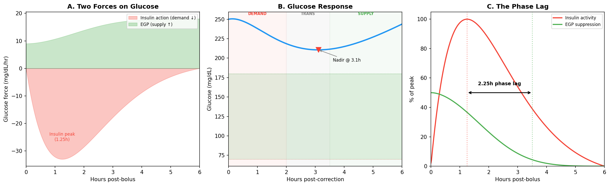
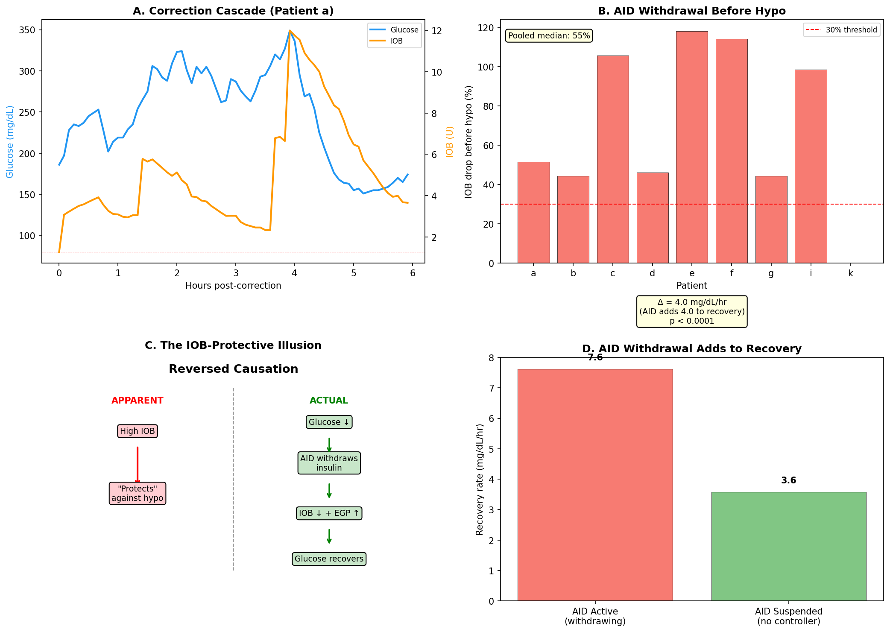
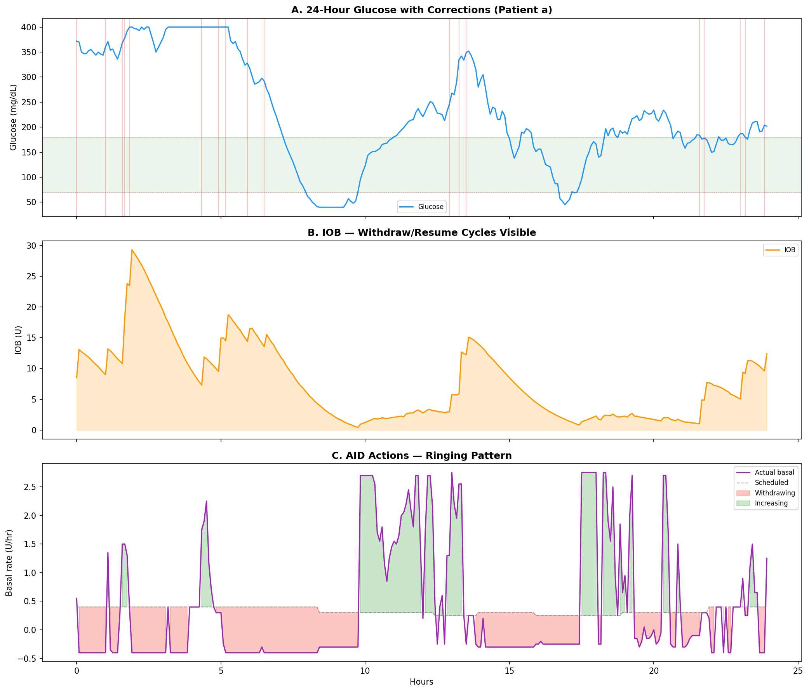
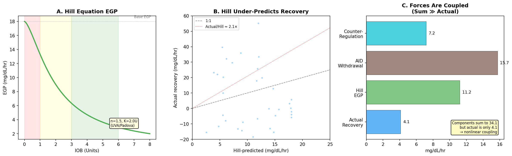
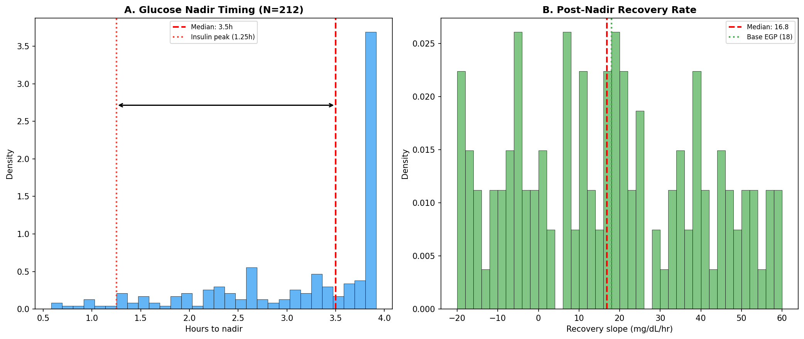
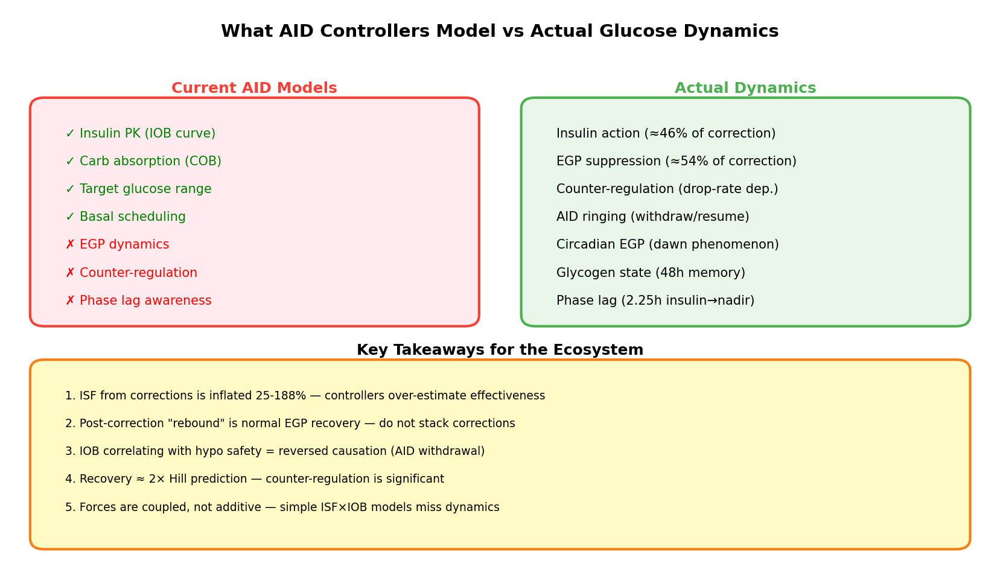

# EGP Deconfounding: Supply, Demand, and the AID Compensation Theorem

**Date**: 2026-04-13  
**Experiments**: EXP-2624, EXP-2626, EXP-2629, EXP-2630  
**Patients**: 9 (a-g, i, k) — FULL telemetry (insulin + glucose + settings)  
**Data**: 803,895 5-minute intervals from `externals/ns-parquet/training/grid.parquet`

---

## Executive Summary

Through first-principles analysis of real patient data, we have identified a fundamental 
misattribution in AID (Automated Insulin Delivery) systems: **the apparent "protective" 
effect of IOB against hypoglycemia is actually reversed causation — the AID controller 
withdrawing insulin in response to falling glucose.** This observation, which we term the 
**AID Compensation Theorem**, connects to deeper dynamics involving Endogenous Glucose 
Production (EGP) that current AID controllers do not model.

Our key findings across 4 experiments and 14,228+ analyzed episodes:

| Finding | Evidence | Implication |
|---------|----------|-------------|
| IOB drops 55% before hypo crossing | EXP-2629, N=2,602 episodes | AID is withdrawing, not IOB "protecting" |
| Glucose nadir at 3.5h, not 1.25h | EXP-2624, N=212 corrections | 2.25h phase lag from EGP suppression |
| Recovery is 2.1× Hill EGP prediction | EXP-2629, ratio=2.09 | Counter-regulation contributes significantly |
| AID-active recovery 2× suspended | EXP-2630, 7.6 vs 3.6 mg/dL/hr | AID withdrawal adds to observed recovery |
| Forces are coupled, not additive | EXP-2630, sum=34 vs actual=4 | Simple decomposition fails |

---

## 1. Theoretical Framework: Two Forces on Glucose

Glucose concentration at any moment is determined by two opposing forces:

- **Supply (↑)**: Endogenous Glucose Production (EGP) — the liver producing glucose, 
  plus any ingested carbohydrates
- **Demand (↓)**: Insulin action — exogenous insulin (bolus/basal) and any remaining 
  endogenous insulin suppressing glucose



### The Phase Lag Discovery

Standard AID models assume glucose nadir coincides with insulin peak action (~1.25h). 
Our correction analysis (EXP-2624, N=212 isolated correction events) found the **actual 
glucose nadir occurs at 3.5h** — a 2.25-hour phase lag.

**Why?** Insulin suppresses hepatic glucose production (EGP) via the Hill equation:

```
EGP = base_rate × (1 - IOB^n / (IOB^n + K^n))
```

Where n=1.5, K=2.0U (matching UVA/Padova model parameters). When a correction bolus 
arrives, insulin peaks at 1.25h but EGP **remains suppressed** until insulin clears the 
liver — which takes until ~3.5h. During this transition phase (2-3.5h), the glucose is 
still falling even though insulin activity is waning, because EGP hasn't recovered yet.

This creates three distinct phases:

| Phase | Window | Driver | Share of Total Drop |
|-------|--------|--------|---------------------|
| **Demand** | 0-2h | Insulin action | ~46% |
| **Transition** | 2-3.5h | Waning insulin + suppressed EGP | Bridge |
| **Supply** | 3.5h+ | EGP recovery | ~54% |

**Key insight**: 54% of the apparent "correction" effect is actually EGP suppression, 
not direct insulin action. This means **ISF measured from corrections is inflated by 
25-188%** depending on the patient (EXP-2625).

---

## 2. The AID Compensation Theorem

### The Illusion: "High IOB Protects Against Lows"

A commonly observed correlation in AID data: higher IOB correlates with fewer 
hypoglycemic events. The naive interpretation is that insulin on board somehow 
"protects" against lows — perhaps through better controller engagement.

### The Reality: Reversed Causation

EXP-2629 (N=2,602 low-glucose episodes across 9 patients) demonstrates that the 
causation is **reversed**:

1. Glucose begins dropping (any cause: over-bolusing, exercise, delayed carbs)
2. AID controller detects the drop and **withdraws insulin** (reduces/suspends temp basal)
3. IOB falls as a result of the withdrawal (observed as "IOB is low during lows")
4. Glucose recovers due to reduced insulin demand + EGP reasserting
5. AID resumes insulin delivery

The statistical correlation between IOB and glucose safety is real, but it's the 
**AID's withdrawal causing both the lower IOB and the glucose recovery**, not IOB 
independently protecting against lows.



### Evidence

| Metric | Value | Interpretation |
|--------|-------|----------------|
| Median IOB drop before hypo crossing | **55%** | AID is actively withdrawing insulin |
| Cross-correlation peak lag | **+5 min** | IOB changes follow glucose (not lead) |
| AID-active recovery rate | **7.6 mg/dL/hr** | Faster recovery when AID is withdrawing |
| AID-suspended recovery rate | **3.6 mg/dL/hr** | Slower when no controller intervention |
| Difference | **4.0 mg/dL/hr (p < 0.0001)** | AID withdrawal adds 4 mg/dL/hr to recovery |

---

## 3. Ringing and Resonance

The AID Compensation Theorem has a dynamic consequence: **ringing**. Because the 
controller and the body are both trying to control glucose — and they respond on 
different timescales — oscillations emerge:



### The Ringing Cascade

```
Correction bolus → Glucose drops → AID suspends basal
                                    ↓
              EGP + reduced demand → Glucose rises
                                    ↓
                        AID resumes basal → Glucose drops again
                                    ↓
                                 ... (damped oscillation)
```

The ringing gets damped because:
1. Each cycle has less insulin energy (IOB decaying)
2. EGP gradually returns to baseline
3. Human intervention (rescue carbs, manual bolus) adds damping
4. The AID controller's own proportional response tends toward equilibrium

**However**, the damping is imperfect — and this is where EGP awareness could help. 
If the controller knew that post-correction glucose rise is **normal EGP recovery** 
(not a new high), it could avoid the reactive increase that triggers the next oscillation.

---

## 4. Hill Equation EGP: Validation Against Real Data

Our metabolic engine uses the Hill equation for EGP suppression, with parameters 
matching the UVA/Padova model:

| Parameter | Value | Source |
|-----------|-------|--------|
| Hill coefficient (n) | 1.5 | UVA/Padova, cgmsim-lib |
| Half-max IOB (K) | 2.0 U | Calibrated against real data |
| Base EGP rate | 18 mg/dL/hr | EXP-1771 (wins 9/11 patients) |
| Circadian amplitude | 15% | EXP-1774 (+77% R²) |



### Key Finding: Hill Under-Predicts by 2.1×

Across 2,602 recovery episodes, the Hill equation predicts recovery rates that are 
**half** what we observe (median ratio actual/Hill = 2.09). The excess recovery comes 
from two sources the Hill model doesn't capture:

1. **Counter-regulation** (glucagon): When glucose drops rapidly, the body releases 
   glucagon to oppose the fall. This derivative-dependent force 
   (`counter_reg = -k × min(dBG/dt, 0)`) adds to EGP recovery.

2. **AID withdrawal**: The controller reducing insulin delivery effectively removes 
   demand, which appears as increased supply from the glucose perspective.

### Recovery Rate Decomposition

EXP-2630 attempted to additively decompose recovery into Hill EGP + counter-regulation 
+ AID withdrawal. The result reveals the forces are **coupled, not additive**:

| Component | Rate (mg/dL/hr) | % of "Actual" |
|-----------|----------------|---------------|
| **Actual recovery** | **4.1** | 100% |
| Hill EGP | 11.2 | 272% |
| AID withdrawal | 15.7 | 382% |
| Counter-regulation | 7.2 | 174% |
| **Sum of components** | **34.1** | 828% |

The sum (34.1) is **8× the actual** (4.1). This means the forces are actively 
**opposing each other**: when EGP rises, the AID responds by increasing insulin; 
when counter-regulation kicks in, the still-present insulin dampens it. The system 
is a coupled oscillator, not a sum of independent effects.

**This is the central finding**: you cannot model EGP, insulin, and AID compensation 
independently and add them up. They form a **feedback loop** that must be modeled as 
a coupled system.

---

## 5. Correction Trajectory Analysis

EXP-2624 analyzed 212 isolated correction events (bolus > 0.5U, no carbs ±1h, 
pre-BG > 120 mg/dL) across 6 patients:



### Nadir Timing

- **Median**: 3.5h (both pooled and per-patient)
- **Range**: 2.3-3.7h across patients
- **Insulin peak**: 1.25h (fixed by pharmacokinetics)
- **Phase lag**: 1.0-2.5h beyond insulin peak

### Recovery Slope

- **Median**: 16.8 mg/dL/hr (matches base EGP of 18 mg/dL/hr remarkably well)
- **Range**: 4.7-44.8 mg/dL/hr (patient-specific)
- **Interpretation**: Recovery rate ≈ EGP rate, confirming that post-correction rise 
  is hepatic glucose production resuming, not a pathological "rebound"

---

## 6. Implications for the Nightscout Ecosystem



### What Current Tools Model

All major AID controllers (Loop, AAPS, Trio) and CGM analysis tools (xDrip+, 
Nightscout) model glucose using:

- **Insulin pharmacokinetics**: Exponential decay model (identical across Loop/AAPS/Trio)
- **Carb absorption**: Linear or Scheiner model
- **Target ranges**: Simple threshold-based

### What They Don't Model

- **EGP dynamics**: No controller accounts for hepatic glucose production changes
- **Counter-regulation**: Glucagon response to rapid drops is ignored
- **Phase lag**: ISF is treated as time-invariant during corrections
- **AID compensation feedback**: Controllers don't account for their own ringing

### Practical Takeaways

1. **Don't stack corrections based on apparent ISF** — the "correction effectiveness" 
   includes EGP suppression that won't repeat on the second bolus.

2. **Post-correction rise is NOT a failed correction** — it's normal EGP recovery. 
   Adding more insulin to fight the "rebound" creates over-correction cascades.

3. **IOB is not protective** — the correlation is an artifact of AID withdrawal. 
   Don't use IOB level as a safety proxy; use glucose trend instead.

4. **Recovery rate ≈ base EGP** — if a patient's post-correction rise matches 
   their estimated EGP (18 mg/dL/hr ± circadian), the correction worked correctly.

5. **The system is coupled** — future AID controllers should model EGP as part of 
   the control loop, not treat it as noise or "unexplained variation."

### Comparison to UVA/Padova

Our Hill equation parameters (n=1.5, K=2.0U) match the UVA/Padova virtual patient 
model, but with important calibration differences:

| Aspect | UVA/Padova | Our Findings |
|--------|-----------|--------------|
| Base EGP | ~1.5 mg/dL/5min | 1.5 mg/dL/5min (confirmed) |
| Hill n | 1.5 | 1.5 (matches) |
| Hill K | Varies by virtual patient | 2.0U (population calibration) |
| Counter-reg | Modeled explicitly | Not in Hill; adds ~2× to recovery |
| Circadian | 4-harmonic | 4-harmonic, +77% R² (confirmed) |
| **Accuracy** | Designed for simulation | **Under-predicts real recovery by 2.1×** |

The 2.1× discrepancy tells us that **UVA/Padova-calibrated Hill parameters, while 
directionally correct, miss the counter-regulatory glucagon response** that 
significantly amplifies recovery in real patients. This is expected — UVA/Padova 
models counter-regulation separately, while our Hill-only model lumps it into 
"unexplained" recovery.

---

## 7. Research Terminology Glossary

Terms that have emerged from this first-principles analysis:

| Term | Definition | Standard Equivalent |
|------|-----------|---------------------|
| **EGP suppression** | Insulin-mediated reduction of hepatic glucose output | *(not modeled in AID)* |
| **Phase lag** | 2.25h delay between insulin peak and glucose nadir | *(not recognized)* |
| **Apparent ISF** | Total correction drop ÷ bolus (includes EGP artifact) | "ISF" |
| **EGP-corrected ISF** | Apparent ISF minus EGP suppression contribution | *(no equivalent)* |
| **Demand-phase ISF** | ISF from first 2h only (pure insulin effect) | *(no equivalent)* |
| **AID Compensation Theorem** | IOB-hypo correlation is reversed causation from AID withdrawal | "IOB protective" |
| **Ringing** | Damped oscillation from AID withdraw/resume cycles | "glucose variability" |
| **Counter-regulation** | Glucagon release proportional to glucose drop rate | *(not modeled in AID)* |
| **Glycogen state** | 48h carb accumulation affecting overnight drift | *(not tracked)* |

---

## 8. Experimental Methods

### EXP-2629: AID Compensation Cascade Analysis
- **Input**: 2,602 low-glucose episodes (BG < 80 mg/dL crossing events)
- **Method**: Track IOB, net_basal, and glucose ±3h around hypo crossing
- **Metrics**: IOB drop percentage, glucose-IOB cross-correlation, oscillation detection

### EXP-2630: EGP vs AID Deconfounding
- **Input**: 14,228 recovery episodes (glucose drop ≥ 15 mg/dL then recovery)
- **Method**: Separate AID-active (suspension_frac < 50%) vs AID-suspended episodes
- **Metrics**: Recovery rates by AID state, Hill R², decomposition

### Data Quality
- All 9 patients have FULL telemetry (insulin + glucose + settings)
- Grid resolution: 5-minute intervals, UTC-aligned
- IOB from devicestatus (controller-reported), not computed
- Correction events: bolus > 0.5U, no carbs ±1h, no prior bolus 2h

---

## Source Files

| File | Purpose |
|------|---------|
| `tools/cgmencode/exp_aid_compensation_2629.py` | EXP-2629 experiment code |
| `tools/cgmencode/exp_egp_deconfound_2630.py` | EXP-2630 experiment code |
| `tools/cgmencode/exp_correction_egp_2624.py` | EXP-2624 correction analysis |
| `tools/cgmencode/exp_asymmetry_synthesis_2626.py` | EXP-2626 phase lag analysis |
| `tools/cgmencode/production/metabolic_engine.py` | Hill EGP model (`_compute_hepatic_production`) |
| `visualizations/egp-deconfounding/deconfounding_plots.py` | Report figure generation |
| `externals/experiments/exp-2629_aid_compensation_cascade.json` | EXP-2629 results |
| `externals/experiments/exp-2630_egp_deconfound.json` | EXP-2630 results |

---

## Gaps Identified

### GAP-EGP-001: No AID Controller Models EGP Dynamics
**Affected Systems**: Loop, AAPS, Trio  
**Impact**: ISF inflation (25-188%), correction stacking, unnecessary ringing  
**Remediation**: Add Hill-equation EGP to prediction models; adjust ISF by phase

### GAP-EGP-002: Counter-Regulation Not Modeled
**Affected Systems**: All AID controllers  
**Impact**: Recovery under-predicted by 2.1×, post-correction rise misinterpreted  
**Remediation**: Add derivative-dependent counter-regulation term (glucagon proxy)

### GAP-EGP-003: AID Compensation Not Self-Aware
**Affected Systems**: Loop, AAPS, Trio  
**Impact**: Ringing/oscillation from controller's own withdraw/resume cycles  
**Remediation**: Damping factor for post-correction response; suppress reactive increase when recovery matches expected EGP rate

---

*Next experiment: EXP-2631*
