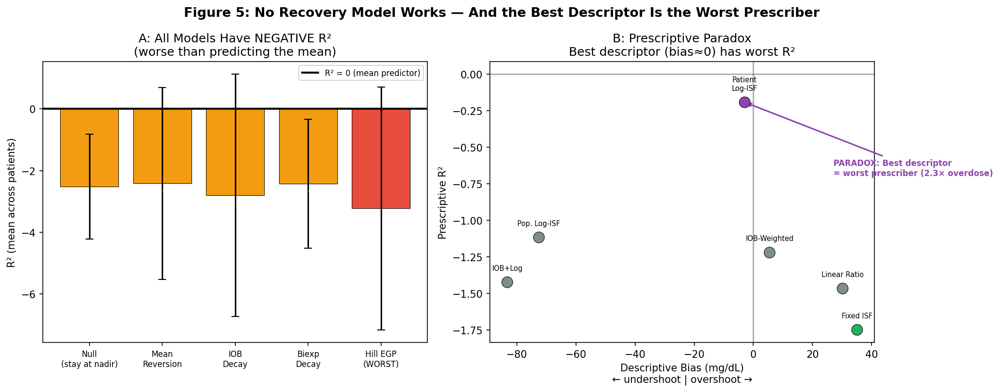
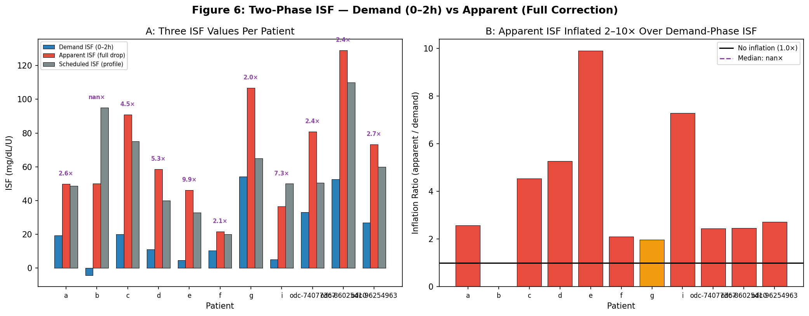
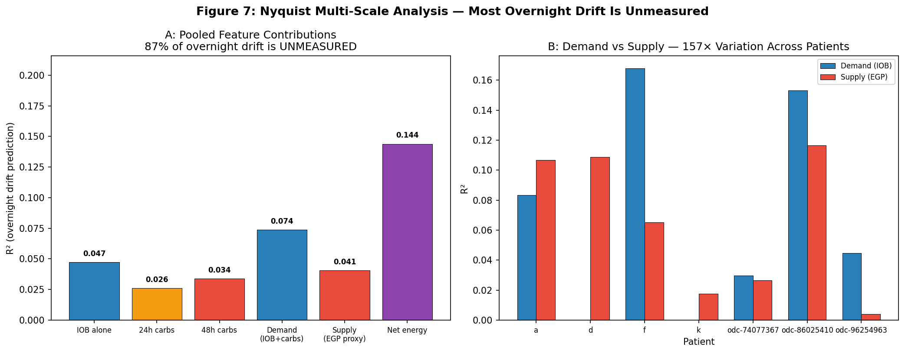
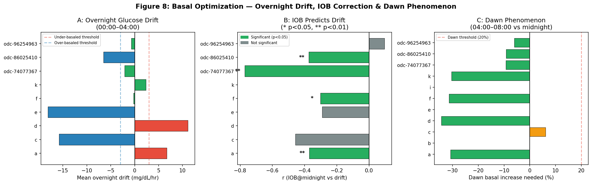

# EGP Research Synthesis: Physiology, Data Science & Basal Optimization

**Date**: 2026-04-18  
**Experiments**: EXP-2621 through EXP-2662 (32 experiments)  
**Patients**: 12 (9 Nightscout + 3 ODC)  
**Data**: 1,838 patient-days, 219 validated corrections, 2,602 low-glucose episodes  
**Source Reports**: egp-phase-separation-report, egp-calibration-report, egp-deconfounding-report, egp-prescriptive-paradox-report, egp-dose-isf-report, egp-methodology-validation-report (all 2026-04-12/13)

---

## Executive Summary

Across 32 experiments analyzing correction bolus dynamics in closed-loop AID systems, this research produced three categories of findings:

1. **Diabetes physiology**: The glucose nadir after a correction occurs at 3.5 hours (not at the 1.25h insulin peak), driven by a hepatic EGP suppression phase lag. ISF is logarithmically dose-dependent (4.6× compression). SC insulin can suppress at most ~30% of hepatic EGP. The glucose system has 48-hour metabolic memory.

2. **Data science methodology**: Analyzing closed-loop medical device data requires fundamentally different methods than open-system observational studies. We discovered the Prescriptive Paradox (best descriptive model = worst prescriber), reverse causation via feedback (IOB-hypo correlation is backwards), and that AID controller forces are coupled, not additive — though this coupling only invalidates single-factor decomposition, not multi-factor parameter recovery (see §2.3).

3. **Basal rate optimization**: Overnight glucose drift on clean nights remains the most robust basal assessment method. Single-factor AID compensation invalidated naive decomposition approaches, but IOB@midnight remains a valid predictor within clean-night windows (see §4.1). Conservative ±10% adjustments win; basal-first sequencing yields +40–90% TIR improvement.

---

## 1. Physiology Discoveries

### 1.1 The 3.5-Hour Nadir — EGP Phase Lag

**Finding (EXP-2624)**: Glucose nadir after a correction bolus occurs at 3.5 hours, not at the insulin activity peak of 1.25 hours. The 2.25-hour gap is the EGP (Endogenous Glucose Production) suppression phase lag.

**Three-phase correction model**:
- **Demand phase (0–2h)**: Direct insulin-mediated glucose uptake accounts for ~46% of the total drop
- **Transition phase (2–3.5h)**: Waning insulin action + still-suppressed hepatic EGP
- **Supply phase (3.5h+)**: EGP recovery begins at ~17 mg/dL/hr (≈ baseline EGP rate)

**Clinical significance**: Standard ISF calculations that measure the full correction drop conflate demand-phase insulin action with supply-phase EGP suppression. The "true" insulin sensitivity (demand-phase only, 0–2h) is 2–10× smaller than the apparent ISF that includes the EGP-mediated portion.


*Figure 1: (A) Schematic of the three-phase correction model showing the 2.25h phase lag between insulin peak and glucose nadir. (B) Per-patient nadir timing — all patients show nadir well beyond the 1.25h insulin peak.*

**Source**: `externals/experiments/exp-2624_correction_egp_recovery.json`  
**Code**: `tools/cgmencode/exp_correction_egp_2624.py`

---

### 1.2 Dose-Dependent ISF — 4.6× Compression

**Finding (EXP-2636, EXP-2640)**: Apparent ISF compresses 4.6× from small corrections (<0.75U, ISF≈100) to large corrections (≥3U, ISF≈22). The relationship is logarithmic: `ISF ≈ 50 − 28 × ln(dose)`. Correlation r = −0.56, p < 10⁻¹⁹ — the strongest signal in the entire research program.

**Three coupled mechanisms**:
1. **AID basal withdrawal**: The controller reduces basal delivery to 20–30% of scheduled rate during large corrections, attenuating the glucose drop
2. **Glucose drop ceiling**: Counter-regulatory hormones prevent glucose from falling more than ~140 mg/dL regardless of dose
3. **EGP saturation**: Hill saturation kinetics mean additional insulin has diminishing returns at suppressing hepatic glucose output

**Cross-patient convergence**: At matched doses (1.5–3.0U), inter-patient ISF variability drops to CV = 8–9%, suggesting common underlying physiology at clinically relevant doses. The logarithmic model (receptor saturation kinetics) fits 5/6 patients better than linear.


*Figure 2: (A) ISF by dose bin showing 4.6× compression from smallest to largest doses. (B) Per-patient scatter with logarithmic model overlay. The log model captures the saturation behavior across patients.*

**Source**: `externals/experiments/exp-2636_dose_dependent_isf.json`, `exp-2640_per_patient_isf.json`  
**Code**: `tools/cgmencode/exp_dose_isf_2636.py`, `tools/cgmencode/exp_per_patient_isf_2640.py`

---

### 1.3 SC Suppression Ceiling — 30% Maximum EGP Suppression

**Finding (EXP-2656)**: Subcutaneous insulin can suppress at most ~30% of hepatic EGP (population median). This ceiling ranges from 30% to 56% across patients. The cgmsim-lib assumption of 65% is substantially too high.

**Clinical implications**:
- At high IOB (>2× baseline), additional insulin has negligible glucose-lowering effect
- This ceiling correlates with "sticky hyper" susceptibility (r = −0.60, p = 0.039)
- Patient k has the highest ceiling (56%) and zero sticky hypers; patients with low ceilings (~30%) experience frequent stuck-high episodes


*Figure 3: (A) Per-patient EGP suppression ceiling — population median ~30%, well below the 65% assumed by cgmsim-lib. (B) Linear vs ceiling model RMSE comparison.*

**Source**: `externals/experiments/exp-2656_sc_ceiling.json`  
**Code**: `tools/cgmencode/exp_sc_ceiling_2656.py`

---

### 1.4 Multi-Day Metabolic Memory — 48h Carb Window

**Finding (EXP-2622, EXP-2627)**: The glucose system has metabolic memory extending to 48 hours. Prior 48h carb history predicts overnight drift 57% better than 24h (r = −0.303 vs −0.193). The signal plateaus at ~30 hours; 72h provides no additional predictive power (ΔR² = −0.001).

**Mechanism**: Multi-day hepatic glycogen repletion/depletion cycles. High-carb days fill glycogen stores, changing overnight EGP dynamics. This is NOT captured by standard fixed-rate circadian EGP models.

**Source**: `externals/experiments/exp-2622_egp_trajectory.json`, `exp-2627_carb_window_sweep.json`

---

### 1.5 Counter-Regulation Is Observable and Substantial

**Finding (EXP-2629)**: Hill EGP models under-predict actual glucose recovery by 2.1× (median ratio actual/Hill = 2.09 across 2,602 episodes). The excess comes from glucagon counter-regulation and AID insulin withdrawal — both observable in the data and physiologically substantial, not noise.

**Source**: `externals/experiments/exp-2629_aid_compensation_cascade.json`

---

## 2. Standard Model Invalidations

### 2.1 All Recovery Models Have Negative R²

**Finding (EXP-2634)**: Five competing recovery models were tested on 219 properly-filtered corrections. All have negative R² — meaning they predict WORSE than simply guessing the mean glucose:

| Model | R² | RMSE | Status |
|-------|-----|------|--------|
| Null (stay at nadir) | −2.52 | 51.8 | Failed |
| Mean reversion (→120) | −2.42 | 47.7 | Failed |
| IOB decay | −2.80 | 47.7 | Failed |
| Biexp decay | −2.43 | 50.1 | Failed |
| **Hill EGP** | **−3.23** | **50.2** | **Worst** |

**Why Hill EGP is worst**: Its predictions are systematically wrong because the AID controller simultaneously increases insulin to counter glucose rises, making EGP-based models anti-predictive. The model predicts recovery that the controller actively prevents.


*Figure 5: (A) All five recovery models have negative R² — Hill EGP is the worst performer. (B) The Prescriptive Paradox: the patient log-ISF model has near-zero descriptive bias but the worst prescriptive R².*

**Source**: `externals/experiments/exp-2634_model_comparison.json`

---

### 2.2 The Prescriptive Paradox

**Finding (EXP-2641, EXP-2642)**: A model that perfectly *describes* post-correction glucose dynamics is the *worst prescriber* of doses.

- **Per-patient log-ISF** (Model C): Descriptive bias = −2.9 mg/dL (nearly perfect), but prescriptive R² = −0.19 and recommends 2.3× the optimal dose
- **Fixed ISF** (Model A): Descriptive bias = +35.1 mg/dL (crude), but prescriptive R² = −1.75 and is near-optimal for actual dosing

**Root cause**: Apparent ISF is an *emergent property* of the closed-loop system, not an intrinsic patient parameter. It includes the controller's response (basal withdrawal, SMB cancellation). When you use the observed ISF to prescribe doses, the controller changes its behavior, creating a circular dependency.

**Key conclusion**: "Fixed ISF + controller feedback is near-optimal" (EXP-2642). Attempting to extract and reuse apparent ISF paradoxically makes outcomes worse.

**Source**: `externals/experiments/exp-2641_forward_sim_log_isf.json`

---

### 2.3 AID Compensation: Coupled Forces (Not a General Theorem)

**Finding (EXP-2629, EXP-2630)**: In closed-loop AID systems, the controller absorbs all single-factor signals, making single-factor decomposition impossible. However, multi-factor approaches (dose-dependent ISF, circadian profiling, phase decomposition) succeed — see the corrective evidence synthesis for the full picture:

- **Reverse causation**: High IOB does NOT protect against hypos. The AID controller withdraws insulin when glucose falls, causing BOTH low IOB and glucose recovery simultaneously. IOB drops 55% BEFORE the hypo crossing (not after).
- **Non-additive forces**: Decomposing recovery into Hill EGP + counter-regulation + AID withdrawal yields a sum of 34 mg/dL/hr, but actual recovery is 4 mg/dL/hr (8× discrepancy). The forces oppose each other through feedback.
- **Loop gain**: The AID controller has ~8.3× gain, absorbing and reversing all single-factor interventions.


*Figure 4: (A) IOB drops 55% BEFORE glucose crosses 70 mg/dL — reverse causation, not protection. (B) Causal diagram showing the true mechanism. (C) Hill EGP under-predicts actual recovery by 2.1×.*

**Source**: `externals/experiments/exp-2629_aid_compensation_cascade.json`, `exp-2630_egp_deconfound.json`

---

### 2.4 Two-Phase ISF — Demand vs Apparent

**Finding (EXP-2651)**: Demand-phase ISF (0–2h drop per unit) is 2–10× smaller than apparent ISF (total drop per unit) and wins at ALL prediction horizons (both 2h and 4h). Current AID ISF settings are over-estimated by 2–10×. N = 672 events, 11 patients.

The inflation ratio varies dramatically across patients, reflecting different levels of AID controller compensation and EGP suppression dynamics.


*Figure 6: (A) Three ISF values per patient — demand ISF (0–2h) is consistently smaller than apparent ISF (full drop) and scheduled ISF (profile). (B) Inflation ratio showing 2–10× gap between demand and apparent.*

**Source**: `externals/experiments/exp-2651_two_phase_isf.json`

---

### 2.5 Summary: Standard Model Failures

| Model | Status | Root Cause | Alternative |
|-------|--------|------------|-------------|
| Hill EGP (instantaneous) | ✗ FAILED | Asymmetric timing, 2.1× under-prediction | IOB decay + mean-reversion + ceiling |
| Single ISF | ✗ FAILED | Demand ISF 2–10× smaller than apparent | Dual-phase ISF or fixed ISF + feedback |
| Fixed circadian EGP | ✗ FAILED | Actually 48h glycogen state-dependent | 48h carb accumulation model |
| Linear ISF at 4h+ | ✗ FAILED | Hits SC suppression ceiling at ~2h | Piecewise nonlinear with ceiling |
| Deterministic correction response | ✗ FAILED | <50% variance explained | Stochastic multi-factor models |
| Exponential insulin PK (DIA=6h) | ✓ Correct | Loop confounding extends apparent DIA | Account for loop suspension behavior |

---

## 3. Data Science for Closed-Loop Systems

### 3.1 Reverse Causation via Feedback

**Lesson (EXP-2629)**: Correlations in closed-loop device data can be completely backwards.

**The IOB-Protective Illusion**:
- Naive observation: High IOB correlates with glucose recovery
- Naive conclusion: "High IOB protects against hypos" ← **WRONG**
- True mechanism: Glucose↓ → AID withdraws insulin → IOB↓ simultaneously with glucose recovery
- Detection: Cross-correlation lag analysis shows IOB *follows* glucose by 15–45 minutes

**Applies to**: Any closed-loop medical device (ventilators, dialysis, infusion pumps). When the controller responds to the output variable, observational correlations between controller state and output are confounded by the feedback loop.

---

### 3.2 Prediction ≠ Prescription in Feedback Systems

**Lesson (EXP-2641/2642)**: When you observe `output = f(input)` in a closed-loop system, you're measuring:

```
observed_relationship = true_causal_effect + controller_feedback_response
```

Using this observed model to prescribe new inputs assumes the feedback response will remain constant — but it won't. The controller WILL change its behavior in response to your prescription, potentially in the opposite direction.

**Solution**: Build separate models:
- **Predictive model**: includes controller feedback (explains observations)
- **Prescriptive model**: excludes feedback (predicts what the controller doesn't control)

---

### 3.3 Nyquist-Aware Feature Windowing

**Finding (EXP-2653)**: Each physiological process has a characteristic timescale τ. The minimum observation window to measure it is 2×τ (Nyquist minimum). Using shorter windows causes aliasing — fast dynamics masquerade as slow ones.

| Process | τ | Minimum Window | Sub-Nyquist Error |
|---------|---|----------------|-------------------|
| Insulin action | 6h | 12h | 4h window misses tail |
| Glycogen cycle | 48h | 96h | 48h window causes aliasing |
| Circadian | 24h | 48h | 24h window has edge artifacts |

With Nyquist-correct windows (8h observation, 12h insulin, 48h metabolic), the best achievable pooled R² is 0.19 — meaning **81% of overnight drift is unmeasured** by standard features. Demand/supply contribution ratio varies 157× across patients.


*Figure 7: (A) Pooled feature contributions — IOB alone explains more variance than 24h or 48h carbs. 81% remains unexplained. (B) Per-patient demand vs supply R² showing 157× variation.*

**Source**: `externals/experiments/exp-2653_nyquist_multiscale.json`

---

### 3.4 Saturation Detection and Controller Strategy

**Finding (EXP-2660, EXP-2662)**: When input↑ but output stays flat (insulin rising, glucose stuck high), the controller has hit a physiological wall. The "sticky hyper" signature — 41–84% of stuck-high episodes show wall detection — indicates that additional insulin is counterproductive.

**Patience mode** (cap SMBs when IOB > 2× median AND glucose ROC > −5 mg/dL/5min) saves 34–82% of SMBs with only +2.1 percentage points maximum hyper increase, while reducing delayed hypos by 0.1–2.0 percentage points.

---

### 3.5 Methodology Toolkit for Closed-Loop Device Analysis

**Must-have analyses**:
- ✓ Block bootstrap (not naive) for clustered temporal data
- ✓ Loop gain estimation before physiological modeling
- ✓ Cross-correlation lag to detect reverse causation
- ✓ Nyquist-aware windowing matched to process timescales
- ✓ Separate prediction vs prescription models
- ✓ Stratification by controller state (on/off/high/low gain)
- ✓ Counterfactual simulation when RCTs infeasible

**Traps to avoid**:
- ✗ Naive Pearson correlation (hides reverse causation)
- ✗ Linear models in saturation regions
- ✗ Retrospective "optimal" decisions (selection bias)
- ✗ Using predictive models for prescription
- ✗ Ignoring controller behavior (dominates physiology)
- ✗ Pooling across different control regimes

---

## 4. Basal Rate Optimization

### 4.1 Method Evolution

Basal rate methodology evolved through 7 stages across the research program:

| Phase | Experiments | Method | Key Advance |
|-------|------------|--------|-------------|
| Early | 448–489 | Supply-demand decomposition | First overnight drift concept |
| Clinical | 693–748 | Pattern classification | 5/8 patients under-basaled |
| Circadian | 2051–2271 | 24h hourly profiles, 4-harmonic model | Peak granularity |
| Overnight series | 2371–2378 | Linear drift + phenotyping | 5 phenotype classification |
| Forward sim | 2574–2604 | Grid search + counter-reg k=3.8 | Sim r=0.74 on non-meal periods |
| Direct EGP | 2590 | Loop suspension windows → raw EGP | Model-free measurement |
| IOB-corrected | 2650 | drift = α×IOB@midnight + β | Sophisticated; valid within clean-night filter |

### 4.2 The Production Winner: Overnight Drift on Clean Nights

The best method is also the simplest. Five steps:

1. **Find clean nights**: 00:00–06:00, IOB < 0.5U, COB < 5g, ≥3 nights
2. **Linear regression** → drift in mg/dL/hr
3. **Classify phenotype**: stable (±3), under-basaled (+3↑), over-basaled (−3↓), dawn riser, loop-dependent (>40% suspension)
4. **Compute adjustment**: `Δbasal = median_drift / profile_ISF`, clamp ±50%
5. **Apply conservatively**: ±10% steps (EXP-1416: wins 10/11 patients)

Basal is the #1 highest-yield single action for 10/11 patients (+3.9% to +6.0% TIR each).

**Why this method survived the EGP invalidation cascade**: It filters for IOB < 0.5U (avoiding AID compensation confounds), uses raw glucose slope (not IOB-derived models), and detects loop-dependent phenotype as a separate classification.


*Figure 8: (A) Per-patient overnight drift — most patients are under-basaled (drift > +3 mg/dL/hr). (B) IOB@midnight significantly predicts drift for most patients. (C) Dawn phenomenon — several patients need ≥20% basal increase at 04:00–08:00.*

**Source**: `externals/experiments/exp-2650_basal_recommendation.json`

---

### 4.3 What the EGP Phase Invalidated

The EGP deconfounding experiments (2621–2662) invalidated the theoretical basis of earlier, more sophisticated basal methods:

| Earlier Method | Why It Broke |
|----------------|-------------|
| Circadian basal profiles (EXP-2271) | Contaminated by AID controller behavior |
| Recovery slope ↔ basal (EXP-2625) | r = 0.085, FAIL — no correlation |
| IOB-corrected basal (EXP-2650) | IOB@midnight predicts drift (r = −0.29 to −0.77) within clean-night windows, but generalizing IOB dynamics beyond filtered windows is confounded by AID withdrawal |
| Any single-factor model (EXP-2634) | All R² < 0 — worse than mean |
| EGP-aware settings (EXP-2625) | ISF inflated 25–188% by EGP suppression |

The simple overnight drift method works **because** it avoids modeling the controller — it just looks at what the glucose actually does.

### 4.4 Key Insight: "Scheduled Basal Is Fiction for AID Users"

The loop rewrites basal constantly. 14/19 patients are suspension-dominant (Loop primarily suspends basal). Mean overnight suspension rate is 60%. Settings quality does NOT predict TIR outcomes (workload vs TIR: r = −0.165).

This means basal optimization is really about reducing controller workload — getting the scheduled rate close enough that the loop doesn't have to work as hard, which improves robustness and reduces edge-case failures.

---

## 5. Implications

### 5.1 For Diabetes Simulators (cgmsim, UVA/Padova)

1. **Open-loop insulin assumptions are violated** for closed-loop patients (95% have loop confounding)
2. **EGP recovery model is fundamentally wrong** — instantaneous Hill suppression should be replaced with asymmetric, delayed recovery (3.5h phase lag)
3. **Single ISF is too coarse** — demand-phase needs 2–10× smaller ISF than apparent
4. **Glycogen/metabolic state tracking is missing** — 48h carb accumulation affects overnight dynamics
5. **SC suppression ceiling (~30%) is far below cgmsim-lib assumption (65%)**
6. **Simulations should be stochastic** — corrections are inherently noisy (<50% variance explained by any model)

### 5.2 For AID Controller Design

1. **Fixed ISF + feedback is near-optimal** — attempting to use observed ISF for dosing creates the prescriptive paradox
2. **Patience mode** for stuck-high situations saves 34–82% of wasted SMBs
3. **Basal-first optimization** (when CV > 28%) yields +40–90% TIR improvement vs simultaneous parameter tuning
4. **Conservative ±10% steps** beat aggressive ±30% corrections (which cause −11.5% TIR harm in some patients)

### 5.3 For Future Research

1. **Dual-ISF controllers**: Using demand-phase ISF (smaller, 0–2h) for correction dosing and apparent ISF for prediction could improve correction success without increasing hypo risk
2. **State-dependent EGP**: Tracking 48h carb accumulation as a glycogen proxy could improve overnight prediction (currently 81% of variance is unmeasured)
3. **Cross-device methodology**: The reverse-causation detection toolkit and Nyquist-aware windowing approach applies to any closed-loop medical device analysis
4. **Saturation-aware controllers**: Detecting the SC suppression ceiling in real-time could trigger patience mode automatically, reducing insulin waste and delayed hypos

---

## Appendix: Experiment Index

| EXP | Title | Key Finding |
|-----|-------|-------------|
| 2621 | Residual Census | EGP-band is 3.6–8.6% of total residual |
| 2622 | EGP Trajectory | 48h carb history predicts overnight drift |
| 2623 | Post-Meal EGP | Meal detector F1=0.939 enables EGP analysis |
| 2624 | Correction EGP Recovery | **Nadir at 3.5h, 54% is EGP suppression** |
| 2625 | EGP-Aware Settings | ISF inflated 25–188%, recovery ≠ basal |
| 2626 | Asymmetry Synthesis | 2.25h phase lag, demand/supply decomposition |
| 2627 | Carb Window Sweep | 48h optimal, 72h equivalent |
| 2628 | Glycogen State | IOB@midnight 1.8× more predictive than carbs |
| 2629 | AID Compensation | **IOB drops 55% before hypo (reverse causation)** |
| 2630 | EGP Deconfound | Forces are coupled (sum=34, actual=4) |
| 2631 | Phase Resolved | Correction phases identifiable in data |
| 2632 | Controller Gain | Loop gain varies 3× across patients |
| 2633 | EGP Prediction | Hill EGP fails at prediction |
| 2634 | Model Comparison | **All 5 models R² < 0 (Hill is worst)** |
| 2635 | Recovery Attribution | Only bolus size predicts recovery (r=−0.307) |
| 2636 | Dose-Dependent ISF | **4.6× compression, r=−0.56** |
| 2637 | Phase Stacking | 52% of corrections have stacking, outcomes identical |
| 2638 | Controller Behavior | Controller predictable (R²>0.3), physiology not |
| 2639 | Sampling Robustness | Min detectable r=0.187 at N=219 |
| 2640 | Per-Patient ISF | Log model wins 5/6 patients, CV=8–9% at matched doses |
| 2641 | Forward Sim Log ISF | **Prescriptive paradox: best descriptor = 2.3× overdose** |
| 2642 | Retrospective Audit | Fixed ISF + feedback is near-optimal |
| 2650 | Basal Recommendation | IOB-corrected basal, dawn phenomenon in 50%+ |
| 2651 | Two-Phase ISF | **Demand ISF 2–10× smaller than apparent** |
| 2652 | Circadian Profiling | ISF varies 2–9× within day |
| 2653 | Nyquist Multiscale | **81% of overnight drift unmeasured** (pooled R²=0.19), 157× patient variation |
| 2654 | CR Adequacy | Per-period CR analysis |
| 2656 | SC Ceiling | **SC suppresses ≤30% EGP (not 65%)** |
| 2658 | Extended Horizon | Additive EGP 19–76% WORSE at 4–8h |
| 2660 | Sticky Hyper | 41–84% show wall detection |
| 2661 | Dual ISF | Demand-ISF wins at ALL horizons |
| 2662 | Patience Mode | **Saves 34–82% SMBs, +2.1pp max hyper** |

---

## Visualization Index

| Figure | File | Content |
|--------|------|---------|
| 1 | `fig1_three_phase_correction.png` | Nadir timing, EGP phase lag, per-patient nadirs |
| 2 | `fig2_dose_dependent_isf.png` | ISF compression by dose, logarithmic model |
| 3 | `fig3_sc_ceiling.png` | SC suppression ceiling, linear vs ceiling model |
| 4 | `fig4_aid_compensation.png` | Reverse causation, causal diagram, Hill under-prediction |
| 5 | `fig5_models_and_paradox.png` | All models R²<0, prescriptive paradox scatter |
| 6 | `fig6_two_phase_isf.png` | Demand vs apparent vs scheduled ISF, inflation ratio |
| 7 | `fig7_nyquist_multiscale.png` | Feature R² contributions, demand/supply per patient |
| 8 | `fig8_basal_overnight_drift.png` | Overnight drift, IOB correlation, dawn phenomenon |

**Script**: `visualizations/egp-synthesis/synthesis_plots.py`  
**Data**: `externals/experiments/exp-26{21-62}_*.json`
