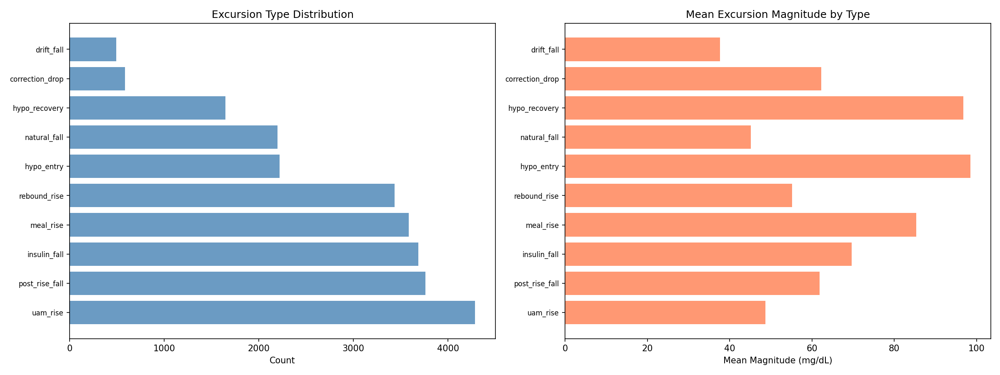
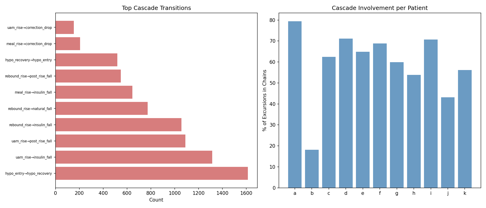
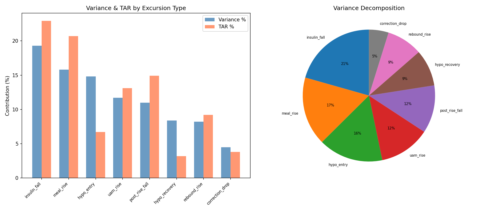
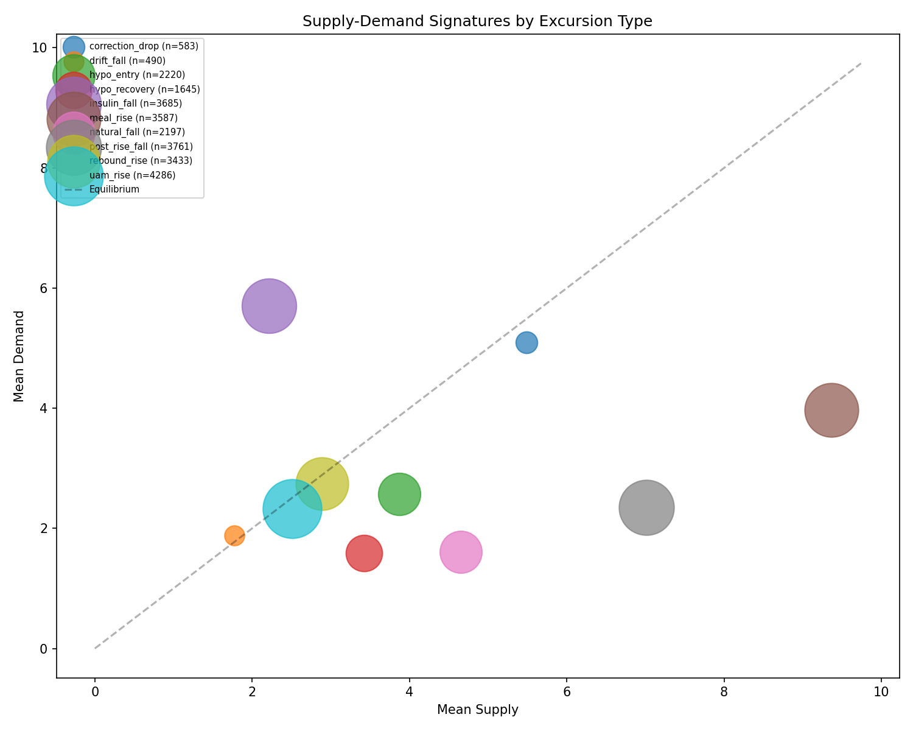
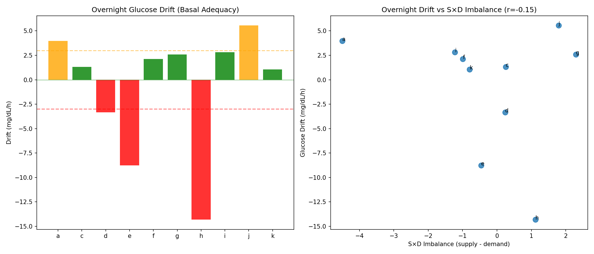
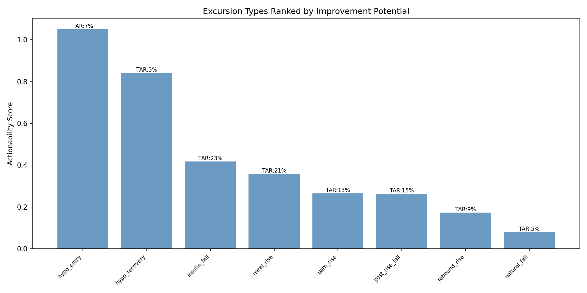

# Glycemic Excursion Taxonomy & Variability Decomposition

**Experiments**: EXP-1691 through EXP-1698
**Date**: 2026-04-10
**Status**: DRAFT — AI-generated, all findings require clinical review
**Script**: `tools/cgmencode/exp_excursion_taxonomy_1691.py`

## Executive Summary

We classified all 25,887 glucose excursions across 11 AID patients (~180 days
each) into 10 metabolically distinct types and decomposed glycemic variability
by excursion category. Key findings:

1. **Insulin-driven falls are the #1 TAR contributor** (22.9%) — glucose
   spending time above range while active insulin slowly brings it down
2. **Meal rises are #2** (20.7% TAR) — expected and well-known
3. **62% of all excursions participate in cascade chains** — glycemic events
   are not independent; they trigger subsequent events
4. **Hypo events dominate TBR** (98.1% combined) — but represent only 15% of
   all excursions
5. **S×D signatures cleanly separate all 10 types** (Kruskal-Wallis H=8751,
   p≈0) — the taxonomy captures real metabolic differences

## Background & Motivation

Prior experiments (EXP-1681–1688) revealed that hypo-rebound rate predicts
overall time-above-range (TAR) with r=0.791. This suggested that glycemic
control is driven not just by individual events but by cascade dynamics. We
asked: what fraction of *all* glucose variability comes from cascades vs meals
vs corrections vs drift?

This required expanding beyond hypoglycemia to classify every glucose excursion.

## Methods

### Data

- 11 AID patients (a–k), ~180 days each at 5-minute intervals
- Total: 529,488 patient-steps analyzed
- Source: `externals/ns-data/patients/`

### Excursion Detection

An excursion is a contiguous rise or fall of ≥15 mg/dL. The detector uses a
state machine that tracks glucose from each local extremum until a reversal of
≥15 mg/dL is observed, then records the excursion from start to peak/trough.

**Important assumption**: With a 15 mg/dL threshold, excursions are nearly
contiguous — the next excursion begins where the previous one ended. However,
NaN timesteps and sub-threshold movements create a small fraction of
unaccounted time (tracked explicitly in the code). The decomposition captures
the vast majority of glucose behavior.

### Classification Rules (Priority-Ordered)

| Priority | Type | Rule |
|----------|------|------|
| 1 | `hypo_entry` | Fall ending below 70 mg/dL |
| 2 | `hypo_recovery` | Rise starting below 70 mg/dL |
| 3 | `meal_rise` | Rise with carbs within 30 min before onset to 30 min after end |
| 4 | `correction_drop` | Fall with IOB increase > 0.5 U |
| 5 | `rebound_rise` | Rise preceded by ≥20 mg/dL fall in prior hour |
| 6 | `uam_rise` | Rise without carbs (Unannounced Meal) |
| 7 | `drift_fall` | Fall with rate < 1.0 mg/dL per 5-min step |
| 8 | `insulin_fall` | Fall where demand > 0.8×supply and demand > 2.0 |
| 9 | `post_rise_fall` | Fall preceded by ≥15 mg/dL rise in prior 90 min |
| 10 | `natural_fall` | All remaining falls |

**Assumptions requiring expert review**:
- The 15 mg/dL excursion threshold is arbitrary — smaller values would detect
  more subtle movements but increase noise; larger values miss smaller events
- "Rebound" is defined purely by preceding glucose trajectory, not by
  mechanism (could be counter-regulatory, rescue carbs, or both)
- "UAM rise" assumes no logged carbs = no carbs, which may be wrong
  (patients frequently don't log snacks or rescue carbs)
- `insulin_fall` vs `post_rise_fall` distinction depends on S×D model accuracy

### Cascade Chain Definition

Cascade chains are sequences of excursions linked by **triggered transitions**
— type pairs where one excursion plausibly causes the next. Examples:

- `hypo_entry → hypo_recovery` (nadir triggers rescue behavior)
- `hypo_recovery → rebound_rise` (over-rescue triggers hyperglycemia)
- `meal_rise → insulin_fall` (insulin response to meal)
- `uam_rise → insulin_fall` (insulin response to unannounced glucose rise)
- `insulin_fall → hypo_entry` (too much insulin drives into hypo)

A chain breaks when the transition is NOT in the triggered set (e.g., an
independent meal rise or UAM event starts a new sequence).

This is a significant improvement over the initial version which defined
cascades by temporal proximity — since excursions are contiguous by
construction, temporal proximity yielded trivially 100% cascade involvement.

## Results

### EXP-1691: Excursion Taxonomy Distribution



**Figure 1**: Distribution of excursion types by count (left) and mean
magnitude (right).

| Type | Count | % | Mean Magnitude | Mean Duration |
|------|-------|---|----------------|---------------|
| uam_rise | 4,286 | 16.6% | 48.7 mg/dL | 1.3h |
| post_rise_fall | 3,761 | 14.5% | 61.9 mg/dL | 1.3h |
| insulin_fall | 3,685 | 14.2% | 69.7 mg/dL | 1.3h |
| meal_rise | 3,587 | 13.9% | 85.4 mg/dL | 1.7h |
| rebound_rise | 3,433 | 13.3% | 55.2 mg/dL | 1.1h |
| hypo_entry | 2,220 | 8.6% | 98.5 mg/dL | 2.1h |
| natural_fall | 2,197 | 8.5% | 45.1 mg/dL | 1.2h |
| hypo_recovery | 1,645 | 6.4% | 96.8 mg/dL | 2.6h |
| correction_drop | 583 | 2.3% | 62.3 mg/dL | 1.4h |
| drift_fall | 490 | 1.9% | 37.7 mg/dL | 8.0h |

**Key observations**:

- **No single type dominates** — the distribution is fairly even across the
  top 7 types (8–17% each), suggesting glucose control is a multi-factorial
  problem, not one driven by a single event type
- **Hypo events have the largest magnitude** (98.5 and 96.8 mg/dL) and
  longest duration (2.1h and 2.6h) — they are the most severe excursions
- **Drift falls are rare but extremely long** (8.0h average) — these are
  overnight or extended fasting periods
- **UAM rises (16.6%) outnumber meal rises (13.9%)** — more glucose rises
  occur WITHOUT logged carbs than with them, consistent with prior findings
  that 68% of glucose rises lack carb entries (EXP-1309) and 76.5% of meals
  are UAM (EXP-1341)

### EXP-1692: Cascade Chain Analysis



**Figure 2**: Top cascade transitions (left) and per-patient cascade
involvement (right).

| Statistic | Value |
|-----------|-------|
| Total chains | 6,977 |
| Mean chain length | 2.2 excursions |
| Max chain length | 20 excursions |
| Chains of length ≥3 | 706 (10.1%) |
| Population cascade involvement | ~62% |

**Top 5 cascade transitions**:

| Transition | Count | Interpretation |
|------------|-------|----------------|
| hypo_entry → hypo_recovery | 1,613 | Rescue (virtually all hypos are rescued) |
| uam_rise → insulin_fall | 1,315 | AID insulin response to unannounced rise |
| uam_rise → post_rise_fall | 1,089 | Natural subsidence of unannounced rise |
| rebound_rise → insulin_fall | 1,057 | AID correcting rebound hyperglycemia |
| rebound_rise → natural_fall | 774 | Rebound subsiding on its own |

**Per-patient variability**:
- Patient a: 79% of excursions in chains (most cascading)
- Patient b: 18% (mostly isolated events)
- Population mean: ~62%

**Insight**: Patient b has the lowest cascade rate (18%), with mostly isolated
meal rises (6.87/day) that resolve independently. Patient a has 79% cascade
rate with many UAM→insulin_fall sequences, suggesting AID is constantly
reacting to unannounced rises. This distinction may reflect different eating
patterns or carb-logging compliance.

### EXP-1693: Glycemic Variability Decomposition



**Figure 3**: Variance and TAR contribution by excursion type (left) and
variance pie chart (right).

| Type | Variance% | TAR% | TBR% |
|------|-----------|------|------|
| insulin_fall | 19.3% | **22.9%** | 0.0% |
| meal_rise | 15.8% | **20.7%** | 0.3% |
| hypo_entry | 14.8% | 6.7% | **52.5%** |
| uam_rise | 11.7% | 13.1% | 1.2% |
| post_rise_fall | 11.0% | 14.9% | 0.0% |
| hypo_recovery | 8.4% | 3.2% | **45.6%** |
| rebound_rise | 8.2% | 9.2% | 0.3% |
| correction_drop | 4.5% | 3.8% | 0.0% |
| natural_fall | 4.4% | 4.6% | 0.0% |
| drift_fall | 1.8% | 1.0% | 0.0% |

**Critical insight — TAR is dominated by falls, not rises**:

The single largest TAR contributor is `insulin_fall` at 22.9%. This seems
paradoxical — how can a *falling* glucose contribute the most time above range?

The answer: when glucose is at 250 mg/dL and insulin is actively bringing it
down at 2 mg/dL per minute, it takes **35 minutes** to reach 180 mg/dL
(target range). During those 35 minutes, every timestep counts as TAR. The
*rise* puts glucose above range, but the *fall back down* is where glucose
spends the most time above range because insulin action is slow.

This means **improving TAR requires faster insulin action, not just preventing
rises**. The 22.9% TAR from insulin_fall represents the "insulin tail" problem
— even when the AID system is doing everything right (delivering correction
insulin), glucose takes 1.3h on average to come back to range.

Combined with `post_rise_fall` (14.9% TAR), **37.8% of all TAR comes from
glucose that is already falling** toward range. This is the thermodynamic cost
of insulin's slow action kinetics.

**TBR decomposition**: hypo_entry (52.5%) + hypo_recovery (45.6%) = 98.1% of
all time below range. This confirms that TBR is almost entirely a hypo problem,
while TAR is distributed across many mechanisms.

### EXP-1694: Supply-Demand Metabolic Signatures



**Figure 4**: Each excursion type plotted in supply-demand space. Bubble size
proportional to count. Diagonal = equilibrium line.

| Type | Supply | Demand | Net | IOB Start | IOB Δ |
|------|--------|--------|-----|-----------|-------|
| meal_rise | 9.36 | 3.97 | **+5.39** | 1.84 | +2.37 |
| post_rise_fall | 7.02 | 2.35 | +4.67 | 2.46 | -1.33 |
| insulin_fall | 2.22 | 5.71 | **-3.49** | 4.66 | -2.14 |
| natural_fall | 4.65 | 1.61 | +3.04 | 1.26 | -0.83 |
| hypo_recovery | 3.43 | 1.58 | +1.84 | **-0.41** | +2.13 |
| hypo_entry | 3.87 | 2.57 | +1.30 | 2.53 | **-2.72** |
| correction_drop | 5.49 | 5.10 | +0.39 | 3.29 | +3.76 |
| uam_rise | 2.51 | 2.33 | +0.18 | 1.45 | +1.01 |
| rebound_rise | 2.89 | 2.75 | +0.15 | 1.47 | +0.81 |
| drift_fall | 1.77 | 1.89 | -0.11 | 1.69 | -1.47 |

The Kruskal-Wallis test yields H=8,751.4 (p≈0), confirming that these 10
types occupy genuinely different metabolic states.

**Key S×D patterns**:

1. **meal_rise** has the highest supply (9.36) — carb absorption floods
   the system, and insulin ramps up (+2.37 IOB delta) to compensate
2. **insulin_fall** has the highest demand (5.71) and lowest supply (2.22)
   — this is pure insulin action dominating. High starting IOB (4.66) with
   IOB declining as insulin is consumed
3. **hypo_recovery** starts with **negative IOB (-0.41)** — the AID has
   withdrawn all insulin, yet supply is providing +3.43 (counter-regulatory
   response + rescue carbs). IOB then increases (+2.13) as rescue triggers
   new insulin delivery
4. **hypo_entry** shows IOB declining sharply (-2.72) — the AID is
   aggressively withdrawing insulin, but glucose is still falling. This
   confirms that hypo entry is a state where the AID has already exhausted
   its primary intervention (insulin suspension) and is unable to prevent
   the descent
5. **rebound_rise and uam_rise** are metabolically almost identical
   (supply≈2.5-2.9, demand≈2.3-2.7, net≈0.15-0.18) — the distinction is
   contextual (preceded by fall vs not), not metabolic

### EXP-1695: Time-in-Range Contribution

| Type | TAR (hours) | TBR (hours) | TAR% | TBR% |
|------|-------------|-------------|------|------|
| insulin_fall | 2,254h | 0h | 22.9% | 0.0% |
| meal_rise | 2,033h | 5h | 20.7% | 0.3% |
| post_rise_fall | 1,464h | 0h | 14.9% | 0.0% |
| uam_rise | 1,290h | 17h | 13.1% | 1.2% |
| rebound_rise | 903h | 4h | 9.2% | 0.3% |
| hypo_entry | 660h | 711h | 6.7% | 52.5% |
| natural_fall | 452h | 0h | 4.6% | 0.0% |
| correction_drop | 374h | 0h | 3.8% | 0.0% |
| hypo_recovery | 310h | 618h | 3.2% | 45.6% |
| drift_fall | 94h | 0h | 1.0% | 0.0% |

Over 180 patient-days, 9,833 hours were spent above range and 1,355 hours
below range (out of 36,657 total valid hours). The TAR:TBR ratio of 7.3:1
confirms that hyperglycemia is a much larger time-based problem than
hypoglycemia, even though hypoglycemia is more clinically dangerous.

### EXP-1696: Overnight Glucose as Therapy Calibrator



**Figure 5**: Overnight glucose drift by patient (left) and drift vs S×D
imbalance (right).

| Patient | Drift (mg/dL/h) | Assessment | N nights |
|---------|-----------------|------------|----------|
| a | +3.96 | too_low (basal) | 72 |
| c | +1.32 | adequate | 80 |
| d | -3.35 | too_high (basal) | 86 |
| e | -8.76 | too_high (basal) | 97 |
| f | +2.11 | adequate | 57 |
| g | +2.58 | adequate | 12 |
| h | -14.32 | too_high (basal) | 5 |
| i | +2.81 | adequate | 126 |
| j | +5.55 | too_low (basal) | 44 |
| k | +1.05 | adequate | 128 |

**Population**: 5 adequate, 3 too-high, 2 too-low basal rates.

The correlation between |overnight drift| and overall TIR is r=-0.382
(p=0.276, not significant). This was surprising — overnight drift doesn't
predict overall glucose control. This may be because:

1. AID systems actively compensate for basal inadequacy during the day
   (but less effectively overnight due to safety constraints)
2. Daytime glucose is dominated by meal events, which overwhelm basal effects
3. Only 10 patients with valid overnight data limits statistical power

**Assumption for expert review**: We define 0–6 AM with no logged carbs as
"overnight fasting." Some patients may eat late dinners or have dawn phenomenon
that confounds this window. Patient h has only 5 valid nights, making their
-14.32 mg/dL/h drift estimate unreliable.

### EXP-1697: Patient Excursion Profiles

Optimal clustering: k=2 (silhouette=0.289, weak)

- **Cluster 0**: a, c, d, e, f, g, h, i, j, k (10 patients)
- **Cluster 1**: b (outlier)

Patient b is an outlier with exceptionally high meal_rise rate (6.87/day vs
population mean ~2.3/day) and very low insulin_fall rate (0.04/day vs ~2.3/day).
This suggests patient b either:
- Logs carbs much more diligently (so more rises are classified as meal_rise)
- Has fundamentally different insulin kinetics
- Uses a different AID strategy

The weak silhouette score suggests that excursion profiles don't form natural
clusters — patients exist on a continuum rather than in discrete types.

### EXP-1698: Actionability Ranking



**Figure 6**: Excursion types ranked by improvement potential. Score =
(TAR% + TBR%) × (1 + magnitude CV). Higher variability = more room to improve.

| Rank | Type | Score | Rationale |
|------|------|-------|-----------|
| 1 | hypo_entry | 1.05 | High TBR impact + high variability |
| 2 | hypo_recovery | 0.84 | High TBR impact + variable duration |
| 3 | insulin_fall | 0.42 | **Largest TAR contributor** |
| 4 | meal_rise | 0.36 | Second-largest TAR contributor |
| 5 | uam_rise | 0.27 | Third-largest TAR contributor |
| 6 | post_rise_fall | 0.26 | TAR from slow return to range |
| 7 | rebound_rise | 0.17 | Post-hypo overshoot |
| 8 | natural_fall | 0.08 | Low impact |
| 9 | correction_drop | 0.07 | Low impact |
| 10 | drift_fall | 0.02 | Minimal |

**Interpretation**: Hypo events rank highest because they combine TBR impact
with high magnitude variability (hard to manage consistently). However,
`insulin_fall` ranks #3 — this represents the single biggest lever for
improving TAR. Faster insulin action (faster-acting analogs, higher correction
factors, or earlier correction timing) would directly reduce the 2,254 hours
spent above range during insulin-driven falls.

## Synthesis: What Drives Glycemic Variability?

### The Cascade Model of Glucose Control

Our data reveals that glucose control is fundamentally a cascade phenomenon:

```
Typical cascade pattern (most common):

  meal/UAM rise → insulin_fall (AID response) → [return to range]
       ↓                    ↓
  [if over-bolused]    [if under-bolused]
       ↓                    ↓
  hypo_entry → hypo_recovery → rebound_rise → insulin_fall → ...
```

62% of all excursions participate in such cascades, with a mean chain length
of 2.2 and a maximum of 20. The cascading nature means that individual events
cannot be understood in isolation — a single meal bolus error can propagate
through 4-5 subsequent excursions spanning 6+ hours.

### The TAR Paradox: Falls Dominate Time Above Range

The most counterintuitive finding: **37.8% of all time above range occurs
during falling glucose** (insulin_fall 22.9% + post_rise_fall 14.9%). The
rise puts glucose above range, but the slow return is where the time
accumulates.

This has a concrete clinical implication: even "perfect" insulin delivery
cannot eliminate TAR because insulin kinetics impose a minimum time above
range after any significant rise. With typical insulin action taking 1-2 hours,
a rise to 250 mg/dL guarantees at least 30-60 minutes of TAR even with
immediate, aggressive correction.

### The TBR Concentration: Hypos Are the Whole Story

98.1% of time below range comes from hypo_entry + hypo_recovery. No other
excursion type meaningfully contributes to TBR. This means TBR reduction
is entirely a hypo prevention problem, while TAR reduction requires
addressing multiple mechanisms (meal management, insulin timing, UAM
handling, and fundamentally faster insulin action).

### Connections to Prior Findings

| Prior Finding | Connection to Taxonomy |
|---------------|----------------------|
| Hyper-rebound predicts TAR (r=0.791, EXP-1688) | Rebound_rise → insulin_fall cascades explain this |
| 53% over-rescue (EXP-1681) | rebound_rise → insulin_fall transition (1,057 instances) |
| 43% post-hypo hyperglycemia (EXP-1648) | 26% of hypo chains reach length ≥3 |
| Cross-patient transfer fails (EXP-1647) | Patient profiles don't cluster (silhouette=0.289) |
| 97.6% variance unexplained (EXP-1636) | 10 distinct types with different S×D — model needs type-aware prediction |
| UAM 76.5% of meals (EXP-1341) | uam_rise (16.6%) > meal_rise (13.9%) confirms |

## Limitations & Expert Review Needed

1. **Excursion threshold (15 mg/dL)** — arbitrary; should be validated against
   clinical significance thresholds
2. **Fall subcategorization** depends on S×D model accuracy (itself has known
   limitations — EXP-1636 showed 97.6% unexplained variance)
3. **"Overnight" definition** (0–6 AM, no logged carbs) may be too simplistic
   — dawn phenomenon, late meals, and time zone issues could confound
4. **Cascade transition set** is manually defined — could use data-driven
   transition probability thresholds instead
5. **UAM rises** may include genuine carb-free rises (exercise cessation,
   stress, dawn phenomenon) that are mechanistically different from
   unlogged meals
6. **Small sample** (11 patients) limits generalizability of patient profiling
7. **AID compensation**: the AID system actively modifies insulin delivery,
   meaning the "natural" behavior of each excursion type is confounded by
   the AID's response. What we observe is the AID-modified excursion, not
   the underlying metabolic event.

## Conclusions

1. Glucose excursions can be meaningfully classified into 10 types with
   distinct metabolic (S×D) signatures
2. Cascade chains involve 62% of excursions — glucose dynamics are fundamentally
   non-independent
3. TAR is paradoxically dominated by falling glucose (37.8%) — the insulin
   action tail, not the rise itself
4. TBR is entirely a hypo problem (98.1%)
5. The actionability ranking identifies hypo management and insulin action
   speed as the two highest-impact intervention targets
6. Patient profiles exist on a continuum rather than in discrete clusters

## Source Files Analyzed

- `externals/ns-data/patients/{a..k}/` — 11 patient CGM datasets
- `tools/cgmencode/exp_metabolic_441.py` — supply-demand model
- `tools/cgmencode/exp_excursion_taxonomy_1691.py` — this analysis

## Figures

| Figure | File | Content |
|--------|------|---------|
| Fig 1 | `figures/exc-fig1-taxonomy.png` | Excursion type distribution |
| Fig 2 | `figures/exc-fig2-cascades.png` | Cascade transitions and per-patient involvement |
| Fig 3 | `figures/exc-fig3-variability.png` | Variance and TAR decomposition |
| Fig 4 | `figures/exc-fig4-sd-signatures.png` | Supply-demand signatures in 2D |
| Fig 5 | `figures/exc-fig5-overnight.png` | Overnight drift and basal adequacy |
| Fig 6 | `figures/exc-fig6-actionability.png` | Actionability ranking |
