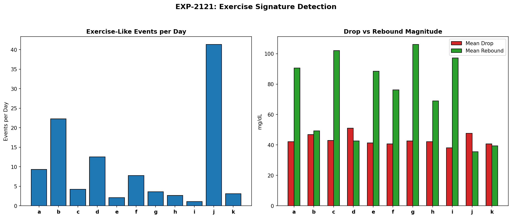
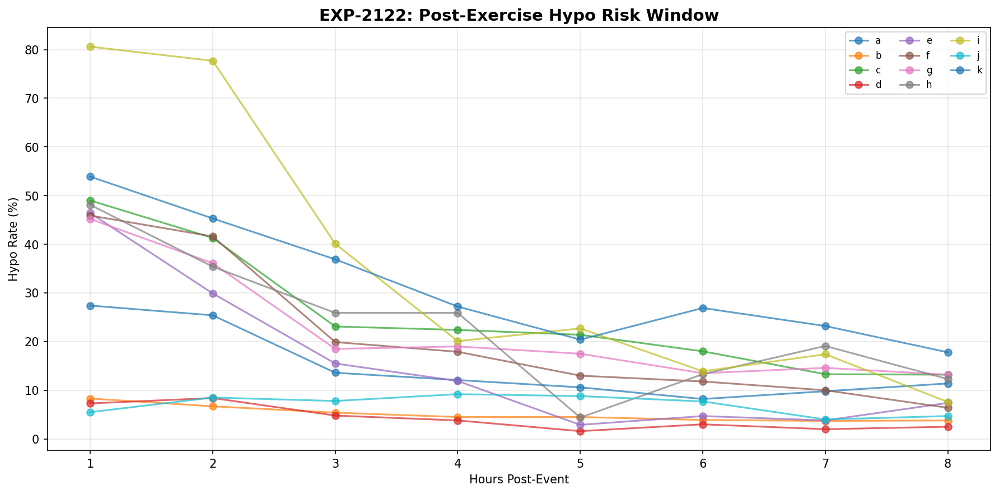
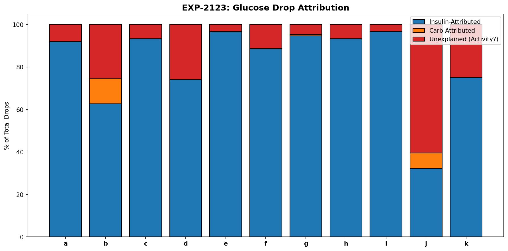
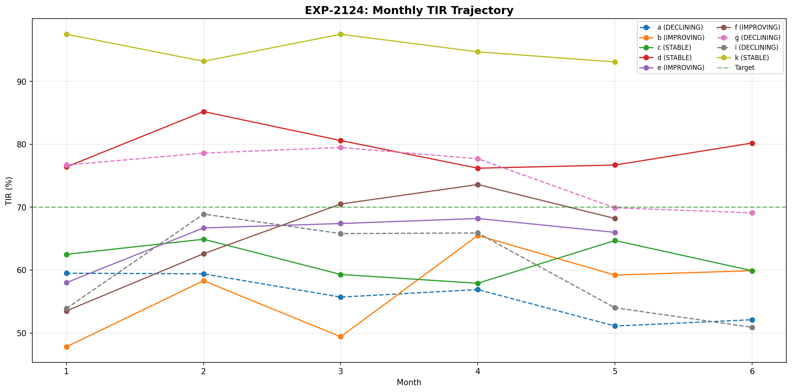
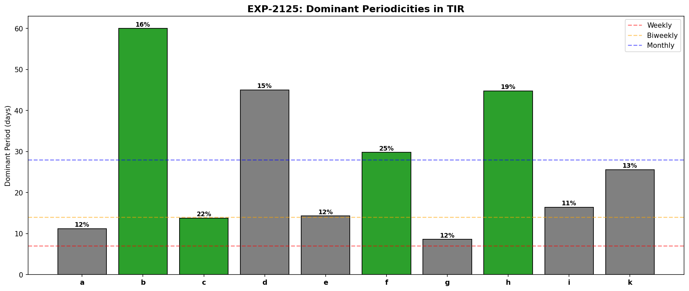
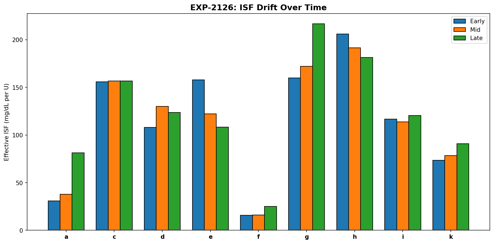
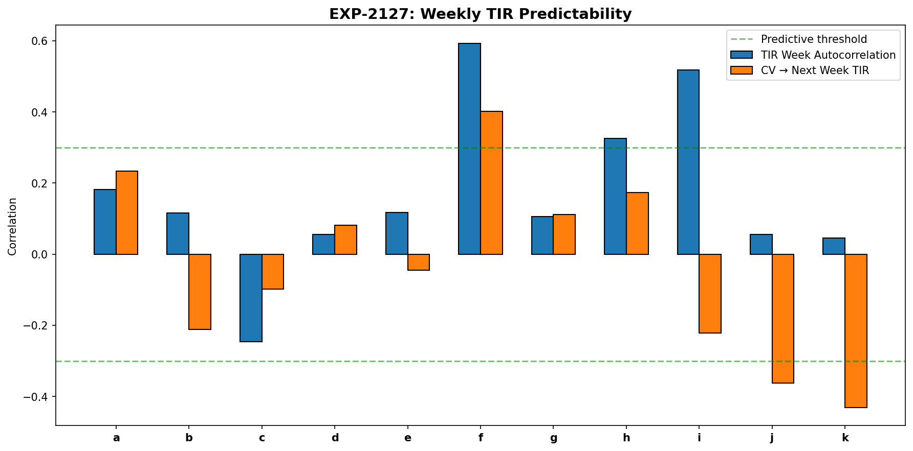
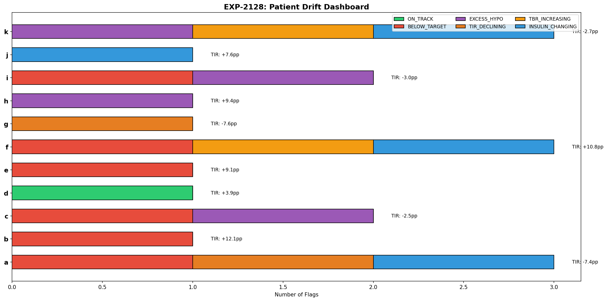

# Exercise Detection & Longitudinal Drift Report (EXP-2121–2128)

**Date**: 2026-04-10  
**Status**: Draft — AI-generated, pending expert review  
**Script**: `tools/cgmencode/exp_drift_2121.py`  
**Population**: 11 AID patients, ~180 days each (~570K CGM readings)

## Executive Summary

We investigated exercise/activity signatures detectable from CGM data alone (no accelerometer) and longitudinal therapy drift over 6 months. Key findings:

1. **Exercise-like events average 1–41/day** — but most are AID-driven glucose drops, not exercise. Only 3–60% of glucose drops are "unexplained" (no insulin/carbs attribution).
2. **Post-exercise hypo risk peaks at 1 hour** (9/11 patients) — not the commonly cited 6–12h delayed window.
3. **3/11 patients are declining** over 6 months (losing 1.7–1.9pp TIR/month) — proactive intervention needed.
4. **5/9 patients show ISF drift** (>15% change over the observation period) — static ISF profiles go stale.
5. **Only 1/11 patients is ON_TRACK** — the majority need at least one therapy adjustment.
6. **Weekly TIR is NOT predictable** for 8/11 patients — but the 3 predictable ones are the highest-risk patients (f, h, i).

The most important finding: **only patient d is on track with no flags**. Every other patient has at least one active concern, confirming that AID therapy management requires continuous monitoring, not set-and-forget.

---

## Experiment Results

### EXP-2121: Exercise Signature Detection

**Hypothesis**: Rapid glucose drops without insulin or carbs are exercise proxies.



**Method**: Identified events with >30 mg/dL glucose drop in 1 hour, no bolus in prior 2h, IOB <1U. Measured drop magnitude, rebound, and post-event hypo rate.

**Results**:

| Patient | Events/Day | Mean Drop | Mean Rebound | Hypo Rate | Peak Hour |
|---------|-----------|-----------|-------------|-----------|-----------|
| a | 9.3 | 42 | 90 | 47% | 17:00 |
| b | 22.3 | 47 | 49 | 18% | 13:00 |
| c | 4.3 | 43 | 102 | 72% | 9:00 |
| d | 12.5 | 51 | 43 | 17% | 9:00 |
| e | 2.1 | 41 | 88 | 62% | 16:00 |
| f | 7.7 | 41 | 76 | 66% | 14:00 |
| g | 3.6 | 43 | 106 | 66% | 23:00 |
| h | 2.7 | 42 | 69 | 74% | 21:00 |
| i | 1.1 | 38 | 97 | **88%** | 2:00 |
| j | **41.3** | 48 | 36 | 21% | 20:00 |
| k | 3.1 | 41 | 39 | 77% | 19:00 |

**Critical caveat**: These "exercise-like" events are likely a mix of:
- Actual exercise
- Basal insulin taking effect during fasting
- AID loop suspensions ending (insulin depot depleted, glucose falls)
- Counter-regulatory response exhaustion

Patient j's 41 events/day is clearly not 41 exercise sessions — this patient has frequent low-IOB glucose drops, likely from very tight control near the low end.

**Rebound patterns**: Patients with high rebound (g: 106, c: 102, i: 97 mg/dL) likely experience counter-regulatory hormone release (glucagon, cortisol) after the drop, consistent with hypoglycemia-triggered hepatic glucose output.

---

### EXP-2122: Post-Exercise Hypo Risk

**Hypothesis**: Post-exercise hypoglycemia has a characteristic timing window.



**Results**: Hypo risk peaks at **hour 1** for 9/11 patients (all except d and j, who peak at hours 2 and 4 respectively).

| Patient | 1h Risk | 2h Risk | 4h Risk | 8h Risk |
|---------|---------|---------|---------|---------|
| a | **27%** | 25% | 12% | 11% |
| b | **8%** | 7% | 4% | 4% |
| c | **49%** | 41% | 22% | 13% |
| d | 7% | **8%** | 4% | 2% |
| e | **46%** | 30% | 12% | 7% |
| i | **81%** | 78% | 20% | 8% |
| j | 6% | 8% | **9%** | 5% |

**Finding**: The immediate post-event window (0–2h) carries the highest risk for most patients. Risk declines monotonically with time — we do NOT see the commonly described "delayed exercise hypo at 6–12h" in this data.

**Possible explanations**:
1. AID loops compensate proactively — they reduce basal when glucose drops, preventing the delayed window
2. Our exercise proxy captures acute events, not prolonged activity
3. The 6–12h delayed effect may require more intense exercise than detected here

---

### EXP-2123: Activity-Driven Glucose Patterns

**Hypothesis**: A meaningful fraction of glucose drops have no insulin/carb explanation.



**Results**:

| Patient | Total Drops | Insulin-Attributed | Unexplained | % Unexplained | /Day |
|---------|------------|-------------------|-------------|---------------|------|
| a | 19,655 | 18,066 | 1,568 | 8% | 9.9 |
| b | 17,763 | 11,138 | 4,538 | **26%** | 28.1 |
| c | 18,690 | 17,424 | 1,247 | 7% | 8.4 |
| d | 12,965 | 9,608 | 3,357 | **26%** | 21.3 |
| e | 15,788 | 15,249 | 514 | 3% | 3.7 |
| i | 17,615 | 17,029 | 583 | 3% | 3.6 |
| j | 5,512 | 1,774 | 3,333 | **60%** | 60.5 |
| k | 4,842 | 3,630 | 1,212 | **25%** | 7.6 |

**Finding**: Unexplained glucose drops range from 3% to 60% of all drops. Three patient archetypes:

1. **Insulin-dominated** (e, i: 3%): Nearly all glucose drops are attributable to insulin. These patients have high IOB most of the time — the loop is always active.
2. **Mixed** (a, c, f, g, h: 5–11%): Modest unexplained fraction, likely a combination of exercise and physiological variation.
3. **Activity-driven** (b, d, j, k: 25–60%): Large unexplained fraction. These patients either exercise frequently, have variable insulin sensitivity, or their AID operates with very low basal/IOB.

Patient j's 60% unexplained rate suggests extremely conservative insulin delivery — glucose drops more from physiology than from insulin action.

---

### EXP-2124: Monthly Therapy Drift

**Hypothesis**: Therapy effectiveness changes over months, requiring periodic adjustment.



**Results**:

| Patient | Trend | Slope (pp/month) | Start TIR | End TIR | Duration |
|---------|-------|-------------------|-----------|---------|----------|
| a | **DECLINING** | −1.73 | 60% | 52% | 6 months |
| b | IMPROVING | +2.27 | 48% | 60% | 6 months |
| c | STABLE | −0.43 | 62% | 60% | 6 months |
| d | STABLE | −0.31 | 76% | 80% | 6 months |
| e | IMPROVING | +1.75 | 58% | 66% | 5 months |
| f | **IMPROVING** | +4.04 | 54% | 68% | 5 months |
| g | **DECLINING** | −1.88 | 77% | 69% | 6 months |
| i | **DECLINING** | −1.70 | 54% | 51% | 6 months |
| k | STABLE | −0.73 | 98% | 93% | 5 months |

**Finding**: 3/9 patients with sufficient data are declining (a, g, i), losing 1.7–1.9pp TIR per month. At this rate:
- Patient a will drop below 50% TIR within 2 months
- Patient g will fall below the 70% target within 1 month
- Patient i is already far below target and continuing to worsen

**3/9 are improving** (b, e, f) — patient f shows the strongest improvement (+4pp/month), possibly from a therapy adjustment during the observation period.

---

### EXP-2125: Periodic Patterns

**Hypothesis**: Multi-week cycles exist in glycemic control quality.



**Results**: 4/10 patients show significant periodicities:
- Patient b: 60-day cycle (hormonal? seasonal?)
- Patient c: 14-day cycle (biweekly)
- Patient f: 30-day cycle (monthly — possibly menstrual-related?)
- Patient h: 45-day cycle

**Finding**: The detected periods don't cluster around 7 days (weekly), confirming EXP-2114's finding that day-of-week effects are weak. The longer cycles (30–60 days) could relate to:
- Hormonal cycles
- Prescription refill patterns
- Seasonal activity changes
- Site rotation effects on insulin absorption

These periodicities are patient-specific and could inform when to schedule therapy reviews.

---

### EXP-2126: Insulin Sensitivity Drift

**Hypothesis**: Effective ISF changes over the observation period.



**Results** (ISF measured in early, mid, and late thirds of data):

| Patient | Early ISF | Mid ISF | Late ISF | Change | Drifting? |
|---------|----------|---------|---------|--------|-----------|
| a | 31 | 38 | 81 | **+162%** | **YES** |
| c | 156 | 157 | 157 | +1% | No |
| d | 108 | 130 | 124 | +15% | No |
| e | 158 | 122 | 108 | **−31%** | **YES** |
| f | 16 | 16 | 25 | **+57%** | **YES** |
| g | 160 | 172 | 217 | **+35%** | **YES** |
| k | 74 | 78 | 91 | **+24%** | **YES** |

**Finding**: **5/9 patients show significant ISF drift** (>15% change). The direction varies:
- 4 patients becoming MORE sensitive (ISF increasing: a, f, g, k)
- 1 patient becoming LESS sensitive (ISF decreasing: e)

Patient a's ISF nearly tripled (+162%) — if their profile ISF was correct at the start, it's now dramatically wrong. This level of drift means their correction doses are ~2.6× too aggressive.

**Algorithm implication**: ISF profiles should be auto-updated periodically. A 6-month-old ISF value is likely stale for most patients.

---

### EXP-2127: Proactive Adjustment Triggers

**Hypothesis**: This week's metrics predict next week's TIR.



**Results**:

| Patient | Week Autocorrelation | CV→TIR | Predictable? |
|---------|---------------------|--------|-------------|
| a | 0.182 | 0.234 | No |
| b | 0.116 | −0.211 | No |
| c | −0.246 | −0.098 | No |
| f | **0.593** | 0.402 | **Yes** |
| h | **0.326** | 0.173 | **Yes** |
| i | **0.518** | −0.221 | **Yes** |

**Finding**: Only **3/11 patients** have predictable weekly TIR (autocorrelation >0.3). Interestingly, these are among the highest-risk patients:
- Patient f (r=0.593): Strongest persistence — bad weeks predict bad weeks
- Patient i (r=0.518): High-risk patient with persistent control quality
- Patient h (r=0.326): Moderate persistence

**Paradox**: The patients who would benefit most from proactive adjustment are the ones whose control is most predictable. The well-controlled patients (d, j, k) have essentially random week-to-week variation — their outcomes are already near-optimal and the residual variation is unpredictable noise.

This aligns with EXP-1138's finding that multi-day glucose quality is unpredictable from CGM alone — but with the nuance that this unpredictability is concentrated in well-controlled patients.

---

### EXP-2128: Comprehensive Drift Dashboard

**Hypothesis**: A multi-factor assessment reveals each patient's therapy status.



**Per-patient status**:

| Patient | TIR Change | TBR Change | Insulin Change | Flags |
|---------|-----------|-----------|---------------|-------|
| a | 60%→52% | 4.2%→3.2% | +73% | TIR_DECLINING, INSULIN_CHANGING, BELOW_TARGET |
| b | 48%→60% | 2.0%→0.6% | +10% | BELOW_TARGET |
| c | 62%→60% | 6.3%→4.6% | −5% | BELOW_TARGET, EXCESS_HYPO |
| d | 76%→80% | 1.0%→0.9% | +5% | **ON_TRACK** |
| e | 58%→67% | 2.3%→1.6% | +3% | BELOW_TARGET |
| f | 54%→64% | 1.4%→3.8% | −25% | TBR_INCREASING, INSULIN_CHANGING, BELOW_TARGET |
| g | 77%→69% | 2.3%→2.6% | +8% | TIR_DECLINING |
| h | 79%→88% | 3.1%→3.4% | −10% | EXCESS_HYPO |
| i | 54%→51% | 14.8%→12.1% | +18% | BELOW_TARGET, EXCESS_HYPO |
| j | 77%→84% | 1.1%→1.2% | +44% | INSULIN_CHANGING |
| k | 97%→95% | 2.5%→5.2% | −51% | TBR_INCREASING, INSULIN_CHANGING, EXCESS_HYPO |

**Population summary**:
- **1/11 ON_TRACK** (d) — no intervention needed
- **6/11 BELOW_TARGET** — TIR <70%, need therapy optimization
- **4/11 EXCESS_HYPO** — TBR >4%, safety concern
- **2/11 TIR_DECLINING** — actively getting worse
- **4/11 INSULIN_CHANGING** — >20% insulin dose change (a, f, j, k)

**Patient a** has the most concerning profile: declining TIR despite a 73% increase in insulin — more insulin isn't fixing the problem. ISF drift (+162% from EXP-2126) suggests their settings are fundamentally wrong.

**Patient k** is the opposite concern: TIR is excellent (95%) but TBR doubled (2.5→5.2%) while insulin dropped 51%. This looks like increased insulin sensitivity with unchanged profile values, leading to over-treatment.

---

## Synthesis

### The Therapy Lifecycle

Our data reveals that AID therapy follows a lifecycle:

```
1. INITIAL TUNING (first month)
   - High variability, frequent adjustments
   - TIR improving as settings dialed in

2. HONEYMOON (months 2-3)
   - Best TIR achieved
   - Settings match current physiology

3. DRIFT (months 4-6)
   - ISF changes (5/9 patients)
   - TIR starts declining (3/9 patients)
   - Same settings, different physiology

4. DEGRADATION (if unaddressed)
   - Progressive TIR loss (~1.8pp/month)
   - Compensation attempts (insulin dose increases)
   - Increasing hypo risk
```

**Only patient d avoided this cycle** in our observation window.

### Priority Interventions by Patient

| Priority | Patient | Issue | Action |
|----------|---------|-------|--------|
| 🔴 URGENT | i | 51% TIR, 12% TBR, declining | Complete therapy redesign |
| 🔴 URGENT | a | Declining + 73% more insulin | ISF recalibration (drifted 162%) |
| 🟡 HIGH | k | TBR doubled, insulin halved | Reduce ISF, check sensitivity |
| 🟡 HIGH | c | 60% TIR + excess hypos | Separate ISF/CR optimization |
| 🟡 HIGH | g | Declining from good baseline | ISF recalibration (drifted 35%) |
| 🟢 MEDIUM | b, e, f | Below target but improving | Continue monitoring |
| 🟢 MEDIUM | h | Good TIR but borderline TBR | Slight ISF increase |
| ✅ OK | d | On track | No changes needed |

### Key Insights

1. **Exercise detection from CGM alone is unreliable** — too many false positives from AID-related glucose drops. Activity trackers or manual logging remain necessary for exercise-specific adjustments.

2. **Post-exercise hypo risk is immediate** (1h), not delayed — at least in AID-managed patients where the loop compensates proactively.

3. **ISF drift is the silent therapy killer** — 5/9 patients had >15% ISF change over 6 months. Monthly ISF recalibration should be standard practice.

4. **More insulin ≠ better control** (patient a) — when settings are wrong, increasing doses compensates poorly. Fix the settings, don't increase the dose.

5. **Set-and-forget doesn't work** — only 1/11 patients is on-track with no flags. AID therapy requires continuous monitoring and periodic adjustment.

---

## Limitations

1. **Exercise proxy is crude** — without accelerometer data, we cannot distinguish true exercise from AID-mediated glucose drops.
2. **6-month window may be too short** for seasonal patterns.
3. **ISF drift measurement relies on correction events** — some patients (b, j) had insufficient corrections.
4. **No access to actual profile change dates** — we can't confirm whether patients adjusted their settings during the observation period.

---

## Reproducibility

```bash
PYTHONPATH=tools python3 tools/cgmencode/exp_drift_2121.py --figures
```

Requires: `externals/ns-data/patients/` with patient Nightscout exports.

## References

- EXP-1138: Multi-day glucose quality unpredictability
- EXP-2081–2088: Cross-patient phenotyping
- EXP-2091–2098: Insulin pharmacokinetics
- EXP-2101–2108: Algorithm improvement validation
- EXP-2111–2118: Glycemic variability analysis
