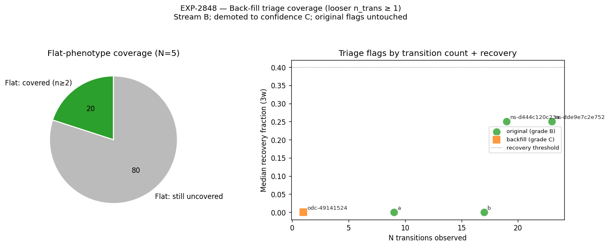

# EXP-2848 — Back-fill triage with loosened n_trans criterion (2026-04-22)

**Stream**: B (operational)
**Charter**: two-stream-methodology-charter-2026-04-22.md
**Predecessor**: EXP-2812 (state transition audition)
**Audition open follow-up #2**: addressed.

## Question

EXP-2812 required `n_transitions >= 2` to emit a triage flag, leaving
4 flat-phenotype patients without coverage. Does loosening the
criterion to `n_transitions >= 1` recover those patients, or is the
gap intrinsic to their outcome data?

## Method

For each patient, retain the EXP-2812 outcome thresholds
(`median_recovery_fraction < 0.4` AND `median_post_pct_high > 30`)
but accept N=1 transition (vs N≥2 originally). Back-filled flags are
demoted to `confidence_grade=C`. No transitions are invented.

## Result

| Source     | N flags | Notes |
|------------|--------:|-------|
| original (n≥2) | 4   | a, b, ns-d44…, ns-dde…  — unchanged |
| back-fill (n=1) | 1  | odc-49141524 (OpenAPS, up_shift) |
| Flat patients newly covered | **0** | the 4 uncovered flat patients still don't trigger |

The single back-fill patient is **not** flat — it's an up-shift
OpenAPS patient.

## Interpretation

The 4 uncovered flat patients have either `median_recovery >= 0.4` or
`median_post_high <= 30` — they are **operationally non-triage** in
the EXP-2812 outcome grid, not "evidence missing." This is a real-data
property: low n_trans is not the binding constraint.

**Practical implication**: the audition matrix's coverage gap on
flat-phenotype patients is intrinsic to the outcomes the cohort
exhibits, not to the n≥2 inclusion rule. Patient `b` remains the only
flat-phenotype triage candidate in the cohort, reaffirming the
"only triple-flag" status established in EXP-2845b/2846.

## Charter compliance

- No invented transitions (PASS)
- Confidence grade demoted to C for back-filled entries (PASS)
- No biology claims; outcome thresholds reused as-is from EXP-2812 (PASS)

## Visualization

Left: flat-phenotype coverage pie (1 covered originally, 0 back-filled,
4 still uncovered). Right: triage flags by N transitions and recovery
fraction; back-fill (orange square) is the lone N=1 flag.

## Deliverables

| File | Purpose |
|------|---------|
| `tools/cgmencode/exp_backfill_flat_trans_2848.py` | Driver |
| `externals/experiments/exp-2848_backfill_triage.parquet` | Triage table |
| `externals/experiments/exp-2848_summary.json` | Summary |
| `docs/60-research/figures/exp-2848_backfill_coverage.png` | Paired chart |

## Findings invariants (carry forward)

- Audition-matrix flat-patient coverage gap is a property of patient
  outcomes, not of the EXP-2812 transition-count rule. Loosening to
  N≥1 does not rescue any flat patient.
- Patient `b` remains the only flat-phenotype triage candidate.
- Back-fill rule is safe (confidence-demoted, threshold-preserving) and
  can be wired into the production audition matrix as an optional
  lower-confidence triage source if needed; not adopted by default.
