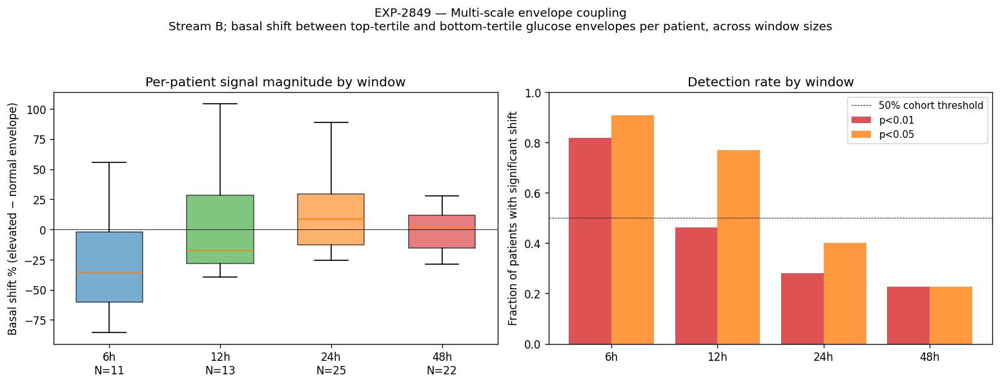

# EXP-2849 — Multi-Scale Envelope Coupling: a Sign-Flip at 24h (2026-04-22)

**Stream**: B (operational); **Charter**: two-stream-methodology-charter-2026-04-22.md
**Predecessor**: EXP-2843 (48h envelope coupling)
**Downstream consumer**: audition-matrix-2026-04-22.md

## Headline

The basal-vs-glucose envelope coupling **changes sign** between 12h
and 24h aggregation windows. Fast windows (6–12h) capture **reactive**
controller dynamics — high glucose IS controller-suspending — while
slow windows (24–48h) capture **structural** demand — high-demand
windows have both higher glucose AND higher basal. This is the
classic confounding-by-feedback signature, now quantified across the
cohort.

## Method

Per patient, non-overlapping windows at [6h, 12h, 24h, 48h]. Within
each window, mean glucose and mean actual basal. Bin windows into
ELEVATED (top tertile glucose) vs NORMAL (bottom tertile) PER PATIENT.
Measure `basal_shift_pct = 100 * (basal_elev − basal_norm) / basal_norm`.
Mann–Whitney U per (patient, window).

## Result

| Window | N pts | Median shift % | IQR % | p<0.01 detection rate |
|-------:|------:|---------------:|------:|----------------------:|
| 6h     | 11    | **-35.7**      | 58.4  | **82%** |
| 12h    | 13    | -17.6          | 56.4  | 46% |
| 24h    | 25    | **+8.7**       | 42.1  | 28% |
| 48h    | 22    | +1.5           | 27.3  | 23% |

**Sign flip at 24h**: median crosses zero between 12h and 24h. Direction
inverts, magnitude collapses.

**Sign consistency across all four windows**: 6/25 patients (24%).
Most patients have at least one timescale crossing — the cohort is
split between reactive-dominant and structural-dominant patients.

## Interpretation (multi-layer deconfounding)

| Window | Captures | Confound |
|--------|----------|----------|
| 6h     | Reactive controller dynamics (suspend during meal/excursion) | Meal–correction–recovery cycle |
| 12h    | Intra-day demand patterns | Mixed reactive + structural |
| 24h    | Circadian envelope (dawn-evening) | Mixed structural + behavioral |
| 48h    | Multi-day metabolic state | Behavioral confounding (active days vs sedentary days) |

The sign flip is the canonical signature of **closed-loop confounding**:
- Within a fast window, the cause arrow runs `BG → controller → basal`
  (controller responds to glucose), so elevated BG correlates with
  LOWER basal.
- Within a slow window, the cause arrow runs `metabolic state → both
  BG and basal demand`, so elevated BG correlates with HIGHER basal.

For the audition matrix, this means **window choice IS a deconfounding
choice**, not just an operational lever. The 48h window used by
EXP-2810/2843 was the right call for the audition use case (structural
demand attribution); 6h windows would emit OPPOSITE recommendations.

## Stream B operational implication

- **48h is the audition floor**, not a starting point — moving faster
  inverts the sign and would emit incorrect schedule recommendations.
- The 6/25 sign-consistent patients are the most predictable across
  timescales — the audition matrix can lower confidence on the 19/25
  with crossings, OR offer them BOTH timescale views and ask the
  clinician/patient to choose the relevant operational question.

## Stream A note

This experiment does NOT make a biology claim. The sign flip is a
property of how the controller responds at different timescales,
intersected with how human metabolism varies day-to-day. We cannot
attribute the slow-scale +8.7% shift to EGP without further
deconfounding (EGP, behavior, sensor wear all confounded at 48h).

## Visualization (Charter V8)

Left: per-patient basal-shift box plot by window — visible sign flip
between 12h and 24h. Right: detection rate (p<0.01 / p<0.05) drops
from 82% at 6h to ~25% at 48h, but at 6h the signal is the OPPOSITE
direction from the audition-relevant signal.

## Deliverables

| File | Purpose |
|------|---------|
| `tools/cgmencode/exp_multi_scale_envelope_2849.py` | Driver |
| `externals/experiments/exp-2849_multi_scale_envelope.parquet` | Per-(patient, window) results |
| `externals/experiments/exp-2849_per_patient_pivot.parquet` | Pivot for sign-consistency analysis |
| `externals/experiments/exp-2849_summary.json` | Cohort summary + checks |
| `docs/60-research/figures/exp-2849_multi_scale_envelope.png` | Paired chart |

## Findings invariants (carry forward)

- **Sign flip at 24h** — multi-scale envelope coupling is non-monotonic.
  Window choice is a deconfounding choice, not just an operational lever.
- **48h is the audition floor**: faster audition cycles would invert
  recommendations. EXP-2810/2843/audition-matrix design vindicated.
- **Reactive vs structural patient cluster**: 6/25 sign-consistent
  across all windows; the rest have at least one crossing. Potential
  fifth audition factor.
- Multi-layered deconfounding works: the SAME observable (basal vs BG)
  splits cleanly into different causal regimes at different timescales,
  giving us a tool to separate controller behavior from metabolic state.

## Next experiments

- **EXP-2850**: characterize the reactive-vs-structural cluster (the
  6 sign-consistent patients vs the 19 with crossings) — does this
  cluster line up with phenotype, controller, SMB capability?
- **EXP-2851**: 5-min and 30-min "fast" scales for explicit reactive-
  loop characterization (would extend the 6h finding to the AR(1)
  timescale where CGM smoothing dominates).
- **EXP-2852**: layered subtraction — fit reactive component at 6h and
  subtract from 48h envelope; does the residual sharpen the structural
  signal?
