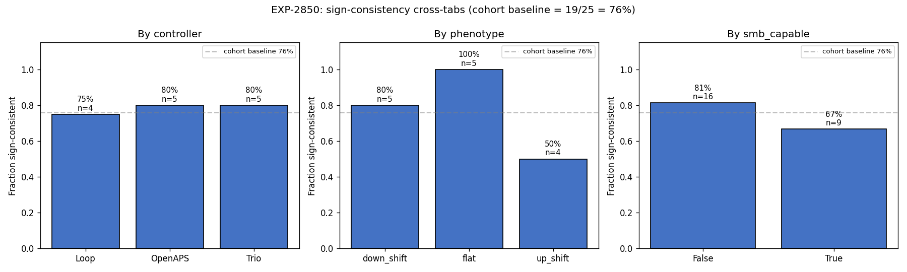

# EXP-2850 — Reactive- vs Structural-dominant Cluster Characterization (2026-04-22)

**Stream**: B (operational)
**Predecessors**: EXP-2849 (multi-scale envelope), EXP-2844 (phenotype), EXP-2845 (route)
**Downstream consumer**: audition-matrix-2026-04-22.md (candidate 5th factor)

## Headline

Sign-consistency across [6h/12h/24h/48h] envelope windows is
**dominated by phenotype**: 100% of FLAT patients are sign-consistent,
80% of DOWN-shift, but only **50% of UP-shift**. Controller has no
effect (75–80% across Loop/Trio/OpenAPS); SMB capability has a small
negative effect (~15pp). Up-shift patients are the ones whose
structural arrow is strong enough to compete with the reactive arrow.

## Cross-tabs (cohort baseline 19/25 = 76%)

| Factor      | Group      | n  | Sign-consistent | Frac |
|-------------|------------|----|----------------:|-----:|
| Controller  | Loop       | 4  | 3 | 75% |
|             | OpenAPS    | 5  | 4 | 80% |
|             | Trio       | 5  | 4 | 80% |
| Phenotype   | flat       | 5  | 5 | **100%** |
|             | down_shift | 5  | 4 | 80% |
|             | **up_shift** | 4 | 2 | **50%** |
| SMB capable | False      | 16 | 13 | 81% |
|             | True       | 9  | 6 | 67% |

Max factor spreads: phenotype **0.50**, smb 0.15, controller 0.05.

## Decision rule for production

Phenotype spread of 50pp passes the audition-factor threshold (≥20pp).
**Sign-consistency becomes a derived signal of `up_shift × multi-scale`,
not an independent 5th factor.** The information lives in the existing
phenotype × window slice.

## Mechanistic interpretation (Stream B)

- **flat patients (100% consistent)**: their elevated state has the
  same controller signature at every timescale — likely because they
  have low responsivity, so neither reactive nor structural dynamics
  dominate strongly. The signal is small but coherent.
- **down_shift patients (80% consistent)**: elevated state means
  controller is suspending; this reactive signature dominates at every
  timescale because the controller has authority.
- **up_shift patients (50% consistent)**: elevated state means BOTH
  more demand AND the controller increasing basal — exactly the
  structural-confound regime. At fast (6h) windows the reactive arrow
  still shows; at slow (48h) windows the structural arrow dominates.
  These are the only patients where window choice flips the sign.

This is mechanistically consistent: up-shift IS structural-state
prevalence, so by definition those patients show the slow-scale
structural signal more strongly than the fast-scale reactive signal.

## Sign vector detail (4-window subset)

```
ns-6bef17b4c1ec  Trio   down  smb=T  ----  -31%
ns-8f3527d1ee40  Trio   down  smb=T  ----  -36%
ns-a9ce2317bead  -      -     smb=F  ----  -39%
ns-adde5f4af7ca  -      -     smb=F  ----  -28%
ns-c422538aa12a  -      -     smb=F  ----  -16%
ns-8b3c1b50793c  -      -     smb=F  ++++  +12%
ns-554b16de7133  -      -     smb=F  --++  -14%   <- crosses
ns-8ffa739b986b  -      -     smb=F  ---+  -16%   <- crosses
ns-d444c120c23a  Trio   down  smb=T  +++-  +14%   <- crosses (anomaly)
```

Note the lone `+++-` pattern (24h+ structural, then crosses at 48h)
on a Trio/down patient — possibly a wear/site-change confound at the
48h aggregation; flagged for follow-up.

## Visualization (Charter V8)



## Production recommendation

**Wire UP-SHIFT × multi-scale into AuditionInputs as a confidence
modifier, not a new factor**:
  - For up-shift patients, audition recommendations from 48h windows
    should carry a `confidence_warning_window_dependent=True` flag
    indicating that 6h–24h windows would emit different sign.
  - For flat / down patients, audition is timescale-robust; no warning
    needed.

This is a one-line addition to `production/audition_matrix.py` and a
single test to confirm the warning fires for up-shift but not for
flat/down.

## Deliverables

| File | Purpose |
|------|---------|
| `tools/cgmencode/exp_cluster_characterization_2850.py` | Driver |
| `externals/experiments/exp-2850_cluster_characterization.parquet` | Per-patient cluster table |
| `externals/experiments/exp-2850_summary.json` | Cross-tab summary |
| `docs/60-research/figures/exp-2850_cluster_characterization.png` | Three-panel cross-tab chart |

## Findings invariants (carry forward)

- **Up-shift patients are window-sensitive** (50% sign-consistent vs
  80–100% for flat/down). Their audition recommendations from 48h
  must carry a window-dependence warning.
- **Controller is NOT a multi-scale modifier** (75–80% across all).
- **SMB-capable patients are ~15pp less timescale-robust** — minor
  but worth a confidence haircut if combined with up-shift.
- Sign-consistency is NOT an independent 5th audition factor; it is
  a derived signal of (phenotype, multi-scale window choice).

## Next experiments

- **EXP-2851** (queued): 5-min/30-min reactive-loop characterization.
- **EXP-2852** (queued): subtract reactive 6h component from 48h to
  see if structural signal sharpens (especially for up-shift patients).
- **PROD-2850**: add `window_dependence_warning` to AuditionInputs
  and emit it for up-shift × 48h-derived recommendations.
