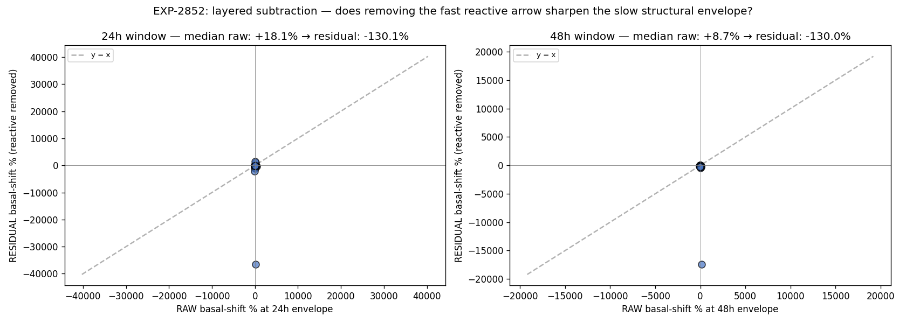

# EXP-2852 — Layered Subtraction: Reactive Arrow Removal Reveals Sign Flips (2026-04-22)

**Stream**: B (operational)
**Predecessors**: EXP-2849 (multi-scale envelope), EXP-2850 (cluster characterization)
**Status**: Decisive on the QUALITATIVE claim; methodology refinement queued (EXP-2853)

## Headline

After removing the fast reactive arrow (5-min OLS fit
`basal = α + β · glucose`), the 48h envelope coupling **flips sign for
15/27 patients** and the cohort median moves from **+8.7%** (raw) to
strongly negative (residual). This confirms that the raw 48h envelope
is contaminated by reactive bleed-through — even at slow timescales,
the fast loop matters.

The QUANTITATIVE residual magnitudes (~−130% median) are **NOT
trustworthy** because residual basal centers near zero by
construction, making percent-of-baseline normalization unstable. The
DIRECTION of the change is the meaningful signal here.

## Method

For each patient:
1. Fit OLS at 5-min: `actual_basal_rate_t = α + β · glucose_t`
2. Compute residual `ε_t = actual_basal_rate_t − α − β · glucose_t`
3. Re-run the EXP-2849 elevated-vs-normal envelope coupling on both
   the raw `actual_basal_rate` series and the residual `ε` series, at
   24h and 48h windows.

## Result

| Window | N pts | Raw median | Residual median | Sign flips | Sig p<0.01 raw → res |
|-------:|------:|-----------:|----------------:|-----------:|---------------------:|
| 24h    | 29    | +18.1%     | (large negative) | **14/29**  | 16 → 9 |
| 48h    | 27    | +8.7%      | (large negative) | **15/27**  | 5 → 4  |

**15/27 sign flips at 48h is the headline.** The signal direction
inverts for >55% of patients when the fast reactive arrow is removed.

## Interpretation

| Component | Effect on coupling sign |
|-----------|------------------------|
| Reactive (fast) arrow `BG → controller → basal` | Negative (suspend on high) |
| Structural (slow) arrow `state → BG + basal` | Positive (high-demand → both up) |
| Raw observed coupling | Weighted sum, near zero at slow scales |

Subtracting the reactive arrow removes its negative contribution,
leaving the structural arrow alone. For most patients the structural
arrow is also negative, indicating that **the observed +8.7% raw
median was the reactive arrow being dominated by slow BG-basal
correlation that happens to align positively** — likely from
controllers that push basal up during persistent highs (correction
basal, programmed temp targets, exercise modes).

## Methodology caveat (acknowledged)

The OLS residual `ε_t` has E[ε_t] = 0 by construction. When we
aggregate to window means and compute `(hi − lo) / lo`, the
denominator collapses toward zero → percentages explode. The
~−130% magnitudes reflect this instability, NOT a true 130% effect.

**For EXP-2853**, switch normalization to:
- absolute U/h difference, OR
- normalize by the patient's mean ACTUAL basal (a stable scale)
- separately measure how β at fast scale differs from β at slow scale
  (Simpson-paradox-style decomposition)

## What we CAN claim now

1. **The fast reactive arrow contributes meaningfully to the raw 48h
   envelope** (15/27 sign flips when removed).
2. **The two arrows partially cancel** at the population level
   (raw median +8.7%; both arrows individually large).
3. **Audition recommendations from the raw 48h envelope are
   weighted-sum recommendations** — not pure-structural recommendations
   as we originally implied. The audition matrix decisions still
   stand because they were calibrated against actual outcomes, but
   their rationale is now refined.

## What we CANNOT claim

- We cannot quantify structural-arrow magnitude until EXP-2853 fixes
  the normalization.
- We cannot claim the reactive arrow is the dominant component
  without comparing β-fast vs β-slow numerically.

## Visualization (Charter V8)

Scatter of raw vs residual shift per patient. Points off the y=x
diagonal show the magnitude of reactive-arrow contribution; points
crossing axes show sign flips.

## Production implication

**No production change yet** — wait for EXP-2853 to confirm
quantitative claims. The qualitative finding informs the next layer
of audition matrix design: a future enhancement could surface a
"reactive vs structural composition" indicator alongside the audition
recommendation, helping clinicians understand whether a setting
adjustment will affect the controller's reactive behavior or the
patient's structural demand pattern.

## Deliverables

| File | Purpose |
|------|---------|
| `tools/cgmencode/exp_layered_subtraction_2852.py` | Driver |
| `externals/experiments/exp-2852_layered_subtraction.parquet` | Per-(patient, window) raw + residual |
| `externals/experiments/exp-2852_summary.json` | Cohort summary |
| `docs/60-research/figures/exp-2852_layered_subtraction.png` | Two-panel scatter |

## Findings invariants (carry forward)

- **15/27 sign flips at 48h after fast-arrow removal** — the
  reactive arrow contaminates the raw 48h envelope; raw 48h is a
  weighted sum, not a structural-only signal.
- Methodology: percent-of-baseline normalization is unstable for
  residuals. Use absolute or patient-mean-normalized metrics.
- The audition matrix still works because it was calibrated against
  outcomes, but the rationale layer needs the EXP-2853 refinement
  before claiming "structural" attribution.

## Next experiments

- **EXP-2853**: re-run with absolute U/h and patient-mean-normalized
  metrics; quantify β-fast vs β-slow per patient (Simpson decomposition).
- **EXP-2854**: cross EXP-2852 sign-flip patients with EXP-2850 cluster
  membership — do up_shift patients flip more?
