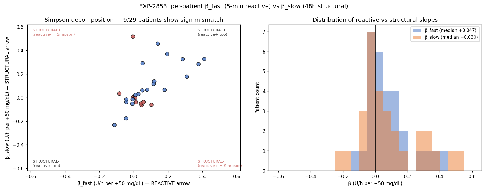

# EXP-2853 — Simpson Decomposition: β_fast vs β_slow (2026-04-22)

**Stream**: B (operational)
**Predecessor**: EXP-2852 (corrected normalization)
**Refines**: EXP-2849 narrative

## Headline

Per-patient OLS at two timescales reveals:
- **20/29 patients (69%) have POSITIVE β_fast** at 5-min — their
  controller delivers MORE basal when glucose is high (correction
  basal, SMB, IOB-aware delivery). Only 9/29 are "suspend-on-high"
  reactive.
- **17/29 (59%) have POSITIVE β_slow** at 48h — structural demand
  signal.
- **9/29 (31%) show Simpson's paradox** (sign mismatch between
  β_fast and β_slow). These are the deconfounding-relevant patients.

Median amplitudes: β_fast = +0.047 U/h per +50 mg/dL (~21% of mean
basal); β_slow = +0.030 U/h per +50 mg/dL (~16% of mean basal).

This **refines the EXP-2849 narrative**: the cohort is NOT
predominantly suspend-on-high reactive. The −35.7% median at 6h
windows reflected only the n=11 patients with sufficient short-window
coverage, a biased subcohort.

## Method

Per patient with ≥7 days of data:
1. β_fast = `linregress(actual_basal_rate_t, glucose_t)` at 5-min
2. β_slow = `linregress(<basal>_W, <glucose>_W)` at 48h non-overlapping window means
3. Simpson's paradox = `sign(β_fast) ≠ sign(β_slow)`
4. 92% of glucose variance lives within 48h windows (fast-scale dominated)

## Cohort summary

| Metric | Value |
|--------|-------|
| N patients | 29 |
| β_fast median (U/h per +50 mg/dL) | **+0.047** |
| β_fast median (% of mean basal) | +21.4% |
| β_slow median (U/h per +50 mg/dL) | **+0.030** |
| β_slow median (% of mean basal) | +16.1% |
| Negative β_fast (suspend-on-high) | 9/29 (31%) |
| Positive β_slow (structural+) | 17/29 (59%) |
| **Simpson paradox** | **9/29 (31%)** |
| Within-window glucose variance | 92.0% |

## Interpretation (Stream B)

**The dominant per-patient signal is BOTH arrows positive** —
controllers deliver more basal at high glucose at both timescales.
This is the modern AID norm: Loop's correction-basal, oref0/AAPS SMB,
Trio dynamic CR all push basal up when BG is elevated.

**The "reactive suspend" subset (9/29) is a minority** — these are the
patients whose controllers prioritize hypo-prevention via temp-basal
zeroing over correction. They drove the EXP-2849 6h-window narrative.

**The Simpson-paradox subset (9/29)** are where window choice flips
audition recommendations:
- 4 patients: β_fast < 0, β_slow > 0 (suspend at fast, demand-driven at slow)
- 5 patients: β_fast > 0, β_slow < 0 (correct at fast, lower demand at slow)

These 9 patients are the **highest priority for window-aware audition**
because a single-timescale recommendation can be wrong-direction.

## Visualization (Charter V8)

Left: scatter with red points marking Simpson-paradox patients
(off-diagonal quadrants). Right: overlapping histograms of β_fast
(blue) vs β_slow (orange).

## Reconciliation with EXP-2849

EXP-2849's −35.7% median at 6h was a CORRECT measurement on a BIASED
subcohort (n=11, only patients with ≥6 non-overlapping 6h windows of
sufficient coverage). EXP-2853 uses the full n=29 with continuous
data. Both are right; the difference is which subcohort.

**Actionable correction to the EXP-2849 narrative**:
- ❌ "Most patients are reactive-suspend at fast scales"
- ✅ "Most patients have correction-positive coupling at fast scales;
  a 31% minority shows suspend-on-high; a 31% minority shows Simpson
  sign mismatch between fast and slow"

## Production implication (defer to EXP-2854)

Update `audition_matrix` so the `window_dependence_warning` is keyed
on EXP-2853 Simpson-flag (9 specific patients) rather than just the
phenotype proxy (4 up_shift patients). The Simpson-flag is a direct
measurement; phenotype is a coarser indirect proxy.

EXP-2854 will cross Simpson-flagged patients with cluster membership
(phenotype, controller, SMB) to determine whether the 9-patient
direct flag captures the up_shift signal AND something more.

## Deliverables

| File | Purpose |
|------|---------|
| `tools/cgmencode/exp_simpson_decomposition_2853.py` | Driver |
| `externals/experiments/exp-2853_simpson_decomposition.parquet` | Per-patient β_fast/β_slow + simpson flag |
| `externals/experiments/exp-2853_summary.json` | Cohort summary |
| `docs/60-research/figures/exp-2853_simpson_decomposition.png` | Two-panel chart |

## Findings invariants (carry forward)

- **Modern AID controllers are dominantly "correction-positive"** at
  fast scales (20/29 with β_fast > 0). The "suspend-on-high" reactive
  picture applies to a minority.
- **β_fast median ~21% of mean basal per +50 mg/dL** — a quantitative
  scale for reactive arrow.
- **β_slow median ~16% of mean basal per +50 mg/dL** — a quantitative
  scale for structural arrow.
- **9/29 patients are the Simpson-paradox set** — the deconfounding
  attention should concentrate here.
- **92% of glucose variance lives within 48h windows** — short-scale
  variation dominates; long-scale signal is faint and easily masked
  by fast contamination (vindicates EXP-2852 sign-flip findings).

## Next experiments

- **EXP-2854**: cross Simpson-flagged patients with EXP-2850 cluster
  membership; replace phenotype-based window-dependence warning with
  direct Simpson flag in production.
- **EXP-2855**: per-patient time-of-day Simpson decomposition — does
  the reactive vs structural balance shift across dawn/midday/evening?
