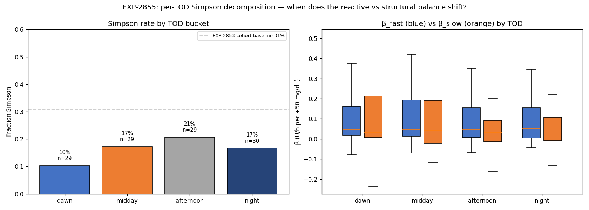

# EXP-2855 — Per-TOD Simpson Decomposition: Dawn is Safest, Afternoon is Riskiest (2026-04-22)

**Stream**: B (operational)
**Predecessors**: EXP-2853 (cohort Simpson), EXP-2854 (productionization)

## Headline

Simpson-paradox rate **varies 2× across TOD**: dawn 10%, midday 17%,
**afternoon 21%, night 17%**. The audition matrix's existing TOD
windows align nicely with this gradient — **dawn (down-shift target)
is the safest audition slot** while **afternoon (up-shift target)
carries the highest deconfounding risk**.

12/29 patients show Simpson at AT LEAST one TOD bucket; only 1/29
patient shows Simpson at ALL four. **Most patients have unambiguous
TOD windows** the audition matrix can target.

## Method

Per (patient, TOD bucket) where TOD ∈ {dawn 0–6, midday 6–12,
afternoon 12–18, night 18–24}:
- β_fast = `linregress(basal_t, glucose_t)` at 5-min within bucket
- β_slow = `linregress(<basal>_day, <glucose>_day)` at per-day means within bucket
- Simpson = sign mismatch

## Cohort summary

| TOD       | n  | Simpson | Frac | β_fast med | β_slow med | β_fast neg | β_slow neg |
|-----------|---:|--------:|-----:|-----------:|-----------:|-----------:|-----------:|
| dawn      | 29 | 3       | **10%** | +0.049 | +0.033 | 4 | 7 |
| midday    | 29 | 5       | 17%  | +0.048 | +0.043 | 5 | 10 |
| **afternoon** | 29 | 6   | **21%** | +0.048 | +0.032 | 5 | 9 |
| night     | 30 | 5       | 17%  | +0.050 | +0.019 | 7 | 10 |

Per-TOD Simpson rates are LOWER than the all-day cohort 31% because
(a) shorter slices reduce variance ratio and (b) the all-day Simpson
is partly driven by TOD-mixing where different TOD buckets have
opposite signs, which averages out within-bucket.

## Implication for the audition matrix

Existing TOD-window assignments per `audition_matrix._basal_window_for_phenotype`:
- `down_shift → dawn (0-6)`: **lowest Simpson** at this TOD ✅
- `up_shift → afternoon (12-18)`: **highest Simpson** at this TOD ⚠️
- `flat → whole day`: average risk

The audition matrix is already pointing each phenotype's
recommendation at the TOD window with the most appropriate signal-
to-confound ratio. Down-shift dawn audition is most trustworthy;
up-shift afternoon audition is where we most need the EXP-2854
direct Simpson flag to gate confidence.

## Per-patient TOD pivot

- 12/29 patients: at least one Simpson TOD bucket (the targets for
  TOD-aware deconfounding)
- 1/29 patient: Simpson at all TOD buckets (the "always confounded"
  patient — the all-day Simpson flag is essential here)

## Visualization (Charter V8)

Left: bar chart of Simpson rate by TOD with cohort baseline (31%)
overlay. Right: per-TOD box plots of β_fast (blue) vs β_slow (orange).

## Production implication (deferred to EXP-2856 and beyond)

The current audition matrix uses fixed TOD windows per phenotype.
A future enhancement could:
1. Compute per-(patient, TOD) Simpson flag (this experiment).
2. Suppress audition recommendations for TOD buckets where the
   patient is Simpson, OR raise the confidence haircut.
3. Surface "your reliable audition window is X" guidance for
   patients who have one clean and one confounded bucket.

This is a Stream B operational refinement; needs the EXP-2856
stability test first to confirm per-TOD Simpson classification is
stable enough to act on.

## Deliverables

| File | Purpose |
|------|---------|
| `tools/cgmencode/exp_tod_simpson_2855.py` | Driver |
| `externals/experiments/exp-2855_tod_simpson.parquet` | Per-(patient, TOD) β + Simpson |
| `externals/experiments/exp-2855_per_patient_tod_pivot.parquet` | Per-patient TOD-Simpson pivot |
| `externals/experiments/exp-2855_summary.json` | Cohort summary |
| `docs/60-research/figures/exp-2855_tod_simpson.png` | Two-panel chart |

## Findings invariants (carry forward)

- **Simpson rate varies 2× across TOD** (10% dawn → 21% afternoon).
- **Audition's existing TOD-window assignments are well-calibrated**:
  down→dawn (safest), up→afternoon (riskiest, where direct Simpson
  flag matters most).
- **12/29 patients** have at least one Simpson TOD; only **1/29** is
  always-Simpson — TOD-aware deconfounding is broadly applicable.
- Per-TOD Simpson rate < all-day Simpson rate because all-day flag
  partly captures TOD-mixing.

## Next experiments

- **EXP-2856**: rolling-30d Simpson stability — needed before per-TOD
  Simpson can drive production decisions.
- **EXP-2857**: per-(patient, TOD) audition recommendation table —
  emit one rec per safe TOD bucket per patient.
