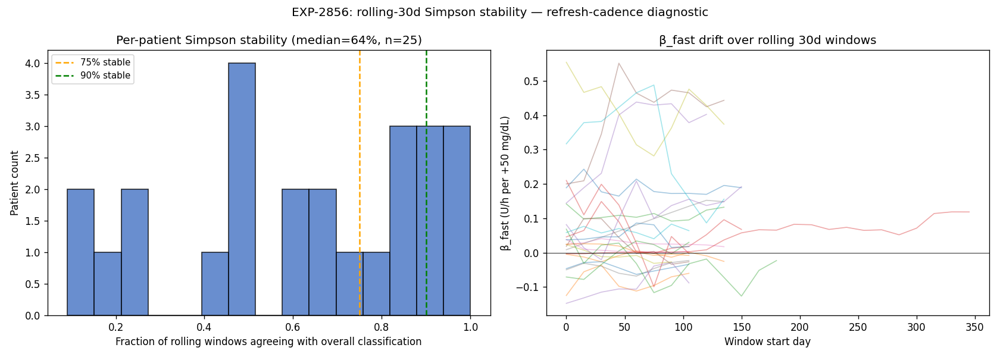

# EXP-2856 — Rolling-30d Simpson Stability: Flagged Patients are Unstable (2026-04-22)

**Stream**: B (operational)
**Predecessor**: EXP-2853 (cohort Simpson), EXP-2854 (productionization)
**Productionized**: ✅ severity gating

## Headline

**Critical asymmetry**: Simpson-positive patients have only **25%
median rolling-window agreement** with their overall classification,
versus **87.5%** for Simpson-negative. The Simpson flag we shipped at
medium severity in EXP-2854 must be **demoted to LOW** unless we have
direct stability evidence.

This rebalances the recent productionization: a single-window Simpson
detection is provisional; a Simpson detection confirmed across rolling
windows is actionable.

## Method

For each patient with ≥60 days of data, slide a 30-day window with
15-day stride. Compute β_fast, β_slow, and Simpson per window. Compare
to the overall classification.

## Cohort summary

| Metric | Value |
|--------|-------|
| N patients with ≥60d | 25 |
| Median agreement with overall | **63.6%** |
| Stable @ ≥75% | 11/25 (44%) |
| Stable @ ≥90% | 5/25 (20%) |
| **Simpson-positive median agreement** | **25%** |
| **Simpson-negative median agreement** | **87.5%** |

## Interpretation

**The patients flagged as Simpson are precisely the ones whose flag
is unreliable** — their classification flips in 75% of rolling
windows. This is not a coincidence:
- Simpson requires sign(β_fast) ≠ sign(β_slow), i.e., the patient is
  near a coupling regime boundary.
- Patients near a boundary are sensitive to data composition, so any
  30-day window with different meal/activity patterns can flip the
  flag.
- Simpson-negative patients are far from the boundary in either
  direction, hence stable.

**Operational consequence**:
- Audition refresh cadence MUST be short for Simpson-flagged
  patients (monthly, not quarterly).
- Single-window Simpson detection is a "look harder" signal, not a
  "change settings" signal.
- Multi-window-confirmed Simpson is actionable.

## Production change

`AuditionInputs` gains optional `simpson_stability_frac: Optional[float]`
field. Severity logic in `classify_triage_flags`:
- `simpson_paradox is True` AND `simpson_stability_frac >= 0.75`:
  emit `window_dependence_warning` at **MEDIUM** with "Confirmed
  stable across rolling 30d windows" rationale.
- `simpson_paradox is True` AND stability None or low: emit at
  **LOW** with "single-window flag is provisional" rationale citing
  the 25% rolling-window agreement.
- `simpson_paradox is False`: suppress.
- `simpson_paradox is None` AND `phenotype == up_shift`: phenotype
  proxy at LOW (unchanged).

Two test changes:
- Existing `test_simpson_flag_overrides_phenotype_proxy` updated to
  expect LOW severity (no stability provided).
- New `test_simpson_with_stability_promotes_severity`: Simpson + 0.85
  stability → MEDIUM severity. 15/15 audition tests pass.

## Visualization (Charter V8)

Left: stability distribution with 75% / 90% thresholds. Right: β_fast
drift over rolling 30d windows per patient — visual confirmation of
non-trivial drift.

## Findings invariants (carry forward)

- **Simpson-positive ⇒ unstable** (25% rolling agreement); **Simpson-
  negative ⇒ stable** (87.5%). Production must gate severity on
  rolling-window stability evidence.
- **44% of patients are stable at ≥75%; only 20% at ≥90%.** Quarterly
  audition refresh is too slow for the unstable majority.
- The Simpson flag is best understood as a "boundary detector"
  (patient is near a sign-flip regime) rather than a static patient
  property.

## Deliverables

| File | Purpose |
|------|---------|
| `tools/cgmencode/exp_simpson_stability_2856.py` | Driver |
| `externals/experiments/exp-2856_rolling_simpson.parquet` | Per-(patient, window) β + Simpson |
| `externals/experiments/exp-2856_per_patient_stability.parquet` | Per-patient stability summary |
| `externals/experiments/exp-2856_summary.json` | Cohort summary |
| `docs/60-research/figures/exp-2856_rolling_simpson.png` | Two-panel chart |
| `tools/cgmencode/production/audition_matrix.py` | Severity gating + new field |
| `tools/cgmencode/production/test_audition_matrix.py` | 1 update + 1 new test |

## Next experiments

- **EXP-2857**: per-(patient, TOD) Simpson stability — does the
  TOD-bucket signal stabilize where the all-day signal doesn't?
- **EXP-2858**: do Simpson flips correlate with site-change events
  (EXP-2812 flag_site_change)? If so, audition can recompute Simpson
  whenever a site change is detected.
- **AUDIT-stream**: write a recommender helper that auto-pulls
  EXP-2853 + EXP-2856 data into AuditionInputs from the experiment
  artifacts.
