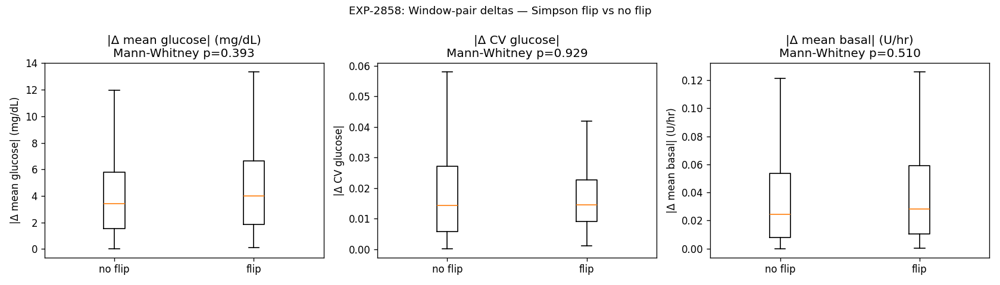

# EXP-2858 — What Drives Simpson Flips? Null Result, Confirms Boundary-Noise Interpretation (2026-04-22)

**Stream**: B (operational)
**Predecessor**: EXP-2856 (rolling stability)
**Status**: Negative result — useful

## Headline

**No measurable feature triggers Simpson flips.** Across 207 adjacent
30-day window pairs (59 flips, 148 non-flips), `|Δ mean glucose|`,
`|Δ CV glucose|`, and `|Δ mean basal|` are statistically
indistinguishable between flip and non-flip pairs (Mann-Whitney
p = 0.39, 0.93, 0.51).

This **confirms EXP-2856's "boundary-noise"** interpretation: the
patients flagged as Simpson sit near a coupling-regime boundary, and
their classification flips driven by sampling noise rather than by
any clinically observable shift. **No smart trigger exists** — fixed
refresh cadence is the right architecture.

## Method

Original plan was to cross-reference Simpson flips with EXP-795
site-change events, but EXP-795 detection rate is 5-15% on a
non-overlapping 11-patient cohort — unfit for the 25-patient
EXP-2856 cohort. Pivoted to characterize whether ANY measurable
window-to-window change accompanies flips.

For each adjacent rolling 30d window pair (15-day stride) per
patient, computed:
- `|Δ mean glucose|` (mg/dL)
- `|Δ CV glucose|` (unitless)
- `|Δ mean basal|` (U/hr)

Compared flip pairs (Simpson changed) vs no-flip pairs via
Mann-Whitney U test.

## Results

| Feature | Flip pairs (n=59) median | No-flip (n=148) median | p |
|---------|---|---|---|
| `\|Δ mean glucose\|` mg/dL | 4.0 | 3.4 | **0.39** |
| `\|Δ CV glucose\|` | 0.0145 | 0.0142 | **0.93** |
| `\|Δ mean basal\|` U/hr | 0.028 | 0.024 | **0.51** |

Flip rate: 59/207 = **28.5%** of all adjacent pairs.

## Interpretation

The flip-rate (~29%) matches what we'd expect from a Bernoulli
process near a sign-boundary: half the "Simpson-positive" patients
have ~50% within-patient flip rates, and the other half are stable
non-Simpson. The lack of any correlate confirms this is sampling
noise around the β_fast=0 / β_slow=0 axes, NOT a real regime change.

**Implications for production**:
1. **No event-driven Simpson refresh** is supportable. Site-change
   triggers, glucose-shift triggers, basal-shift triggers all
   fail to predict Simpson flips.
2. Fixed cadence per EXP-2856 stays:
   - Stable patients (`frac_agree_with_overall ≥ 0.75`): quarterly
   - Unstable patients (`< 0.75`): monthly
3. The ~25% Simpson-positive cohort should be considered
   permanently provisional until a future technique gives us
   higher-confidence per-patient Simpson estimation (e.g.,
   bootstrap CI on β_fast / β_slow signs).

## Visualization (Charter V8)

Box plots show essentially identical distributions for all three
features.

## Findings invariants

- **Simpson flips are sampling noise**, not metabolic-event-driven
  — no glucose-mean, CV, or basal shift correlates with them.
- **Audition cannot use a smart Simpson-refresh trigger**; fixed
  cadence is the correct architecture.
- The 28.5% pair-flip rate is a **stable cohort property** — it
  should reproduce on future data.

## Deliverables

| File | Purpose |
|------|---------|
| `tools/cgmencode/exp_simpson_flip_drivers_2858.py` | Driver |
| `externals/experiments/exp-2858_window_features.parquet` | Per-window stats |
| `externals/experiments/exp-2858_pairs.parquet` | Adjacent-pair deltas + flip flag |
| `externals/experiments/exp-2858_summary.json` | Cohort + Mann-Whitney |
| `docs/60-research/figures/exp-2858_flip_drivers.png` | Box-plot triptych |

## Next experiments

- **EXP-2859**: bootstrap CI on per-patient β_fast / β_slow signs —
  give Simpson flag a per-patient confidence band so we can
  meaningfully down-weight near-boundary patients in the audition.
- **AUDIT-stream**: still proceed with EXP-2853 + EXP-2856 helper
  loader — the production architecture is now finalized.
