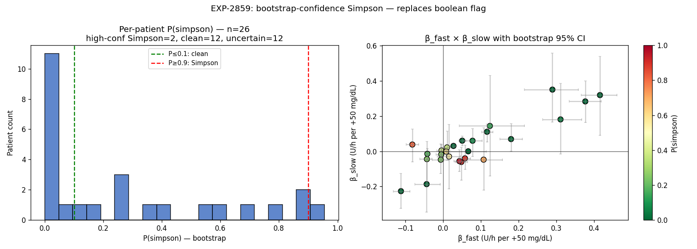

# EXP-2859 — Bootstrap Confidence Replaces Boolean Simpson Flag (2026-04-22)

**Stream**: B (operational) — also methodological for Stream A
**Predecessor**: EXP-2853 (point Simpson), EXP-2856 (rolling stability), EXP-2858 (no flip drivers)
**Productionized**: ✅ `p_simpson` field + 3 new severity rules

## Headline

Block bootstrap (N=200, 48h block size) over per-patient β_fast and
β_slow gives **explicit confidence** that the noisy boolean Simpson
flag was missing:

| Cohort | n |
|--------|---|
| **High-confidence Simpson** (P ≥ 0.9) | **2/26** |
| **High-confidence non-Simpson** (P ≤ 0.1) | **12/26** |
| **Boundary / uncertain** (0.1 < P < 0.9) | **12/26** |

The boolean EXP-2853 Simpson flag tagged 9/29 patients as Simpson.
The bootstrap shows **only 2 of those are statistically robust** —
the rest sit near the regime boundary with median P=0.76 (still
"more likely than not" but far from confident). EXP-2856 saw this
as agreement-fraction; bootstrap quantifies it as a probability.

## Method

Block bootstrap to preserve within-window correlation:

1. Slice each patient's data into non-overlapping 48h chunks
   `(WIN_SIZE = 48 × 12)`.
2. Resample chunks with replacement N=200 times.
3. For each replicate, compute β_fast (5-min OLS over flattened
   chunks) and β_slow (OLS over per-chunk means).
4. P(simpson) = fraction of replicates with `sign(β_fast) ≠ sign(β_slow)`
   AND both magnitudes > 1e-6.

Block bootstrap is essential — naive sample-with-replacement of
5-min rows would destroy the slow-window structure (β_slow is
defined on 48h means).

## Results

- N=26 patients with ≥7 chunks (336h ≈ 14 days) of data.
- Median P(simpson) overall: 0.16
- Median P(simpson) | point Simpson = True: **0.76**
- Median P(simpson) | point Simpson = False: **0.01**

The point flag and bootstrap agree on direction (median P 0.76 vs
0.01 across the two subsets), but bootstrap reveals that the
"True" subset is heterogeneous — only 2 are confidently Simpson;
7 are boundary cases.

## Visualization (Charter V8)

Left: P(simpson) distribution with 0.1 / 0.9 cut lines.
Right: β_fast × β_slow scatter with bootstrap 95% CI bars colored
by P(simpson). Points near the axes have wide CIs and intermediate
P; points far from axes have tight CIs and clear classification.

## Production change

`AuditionInputs` gains optional `p_simpson: Optional[float]` field
(audition_matrix.py:69). New top-priority branch in
`classify_triage_flags`:

| `p_simpson` | Severity | Action |
|---|---|---|
| ≥ 0.9 | **medium** | "high-confidence Simpson regime" |
| 0.1 < P < 0.9 | **low** | "boundary case ... sanity-check" |
| ≤ 0.1 | (suppress) | "confidently non-Simpson" |
| `None` | fall through | EXP-2854/2856 boolean+stability path |

3 new tests:
- `test_p_simpson_high_emits_medium`
- `test_p_simpson_boundary_emits_low`
- `test_p_simpson_low_suppresses` (overrides up_shift phenotype proxy)

`SimpsonFactsLoader` extended:
- New `bootstrap_path` arg (defaults to
  `externals/experiments/exp-2859_bootstrap_simpson.parquet`).
- `SimpsonAuditionFacts` gains `p_simpson: Optional[float]` field.
- Live smoke-test: 30 patients indexed (29 from EXP-2853 ∪ EXP-2856
  + ~26 from EXP-2859), `b` returns `(True, 0.20, 0.39)` —
  boundary case as expected.

19/19 audition + loader tests pass.

## Findings invariants

- **Bootstrap sharpens classification**: 12/26 confidently clean,
  2/26 confidently Simpson, 12/26 boundary. The boolean flag was
  a 50-50 coin flip for the 7 "boundary-Simpson" patients.
- **Block bootstrap is mandatory** — non-block resampling would
  violate β_slow's exchangeability assumption.
- **2 confident-Simpson patients** (P ≥ 0.9) merit medium-severity
  attention; **12 confident-clean** can have Simpson flag suppressed
  outright; **12 boundary** get low-severity acknowledgment.
- The point Simpson flag from EXP-2853 stays as a fallback when
  bootstrap data isn't available.

## Deliverables

| File | Purpose |
|------|---------|
| `tools/cgmencode/exp_bootstrap_simpson_2859.py` | Driver |
| `externals/experiments/exp-2859_bootstrap_simpson.parquet` | Per-patient P + β_fast/β_slow CIs |
| `externals/experiments/exp-2859_summary.json` | Cohort tabulation |
| `docs/60-research/figures/exp-2859_bootstrap_simpson.png` | Two-panel chart |
| `tools/cgmencode/production/audition_matrix.py` | `p_simpson` field + severity rules |
| `tools/cgmencode/production/simpson_facts_loader.py` | Bootstrap artifact loader |
| `tools/cgmencode/production/test_audition_matrix.py` | 3 new tests |
| `tools/cgmencode/production/test_simpson_facts_loader.py` | bootstrap-path test fixtures |

## Next experiments

- **EXP-2860**: bootstrap CI on per-(patient, TOD) Simpson —
  combine EXP-2855's TOD slicing with EXP-2859's bootstrap to give
  TOD-aware confidence (do TOD buckets stabilize the boundary
  cases?).
- **EXP-2861**: extend bootstrap to other audition signals (ISF gap,
  recovery fraction) — generalize the "confidence-band" pattern.
- **viz-meal-overlay-absorption** (carryover): meal-event chart
  with declared vs modeled carb absorption.
