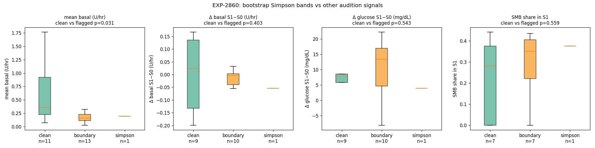

# EXP-2860 — Bootstrap Simpson is Orthogonal Except for a Basal-Level SNR Artifact (2026-04-22)

**Stream**: B (operational)
**Predecessor**: EXP-2859 (bootstrap), EXP-2843/2845 (state coupling, route)
**Status**: Mixed result — orthogonality confirmed for structural features; basal-level correlation is a precision artifact

## Headline

Cross-validating bootstrap-Simpson bands against four other audition
signals shows **only mean basal level is correlated** (p=0.031), and
this correlation is best explained as a **precision-of-estimation
artifact**:

| Band | n | median mean basal (U/hr) | median Δ basal S1−S0 | median Δ glucose S1−S0 (mg/dL) | median SMB share |
|---|---|---|---|---|---|
| clean (P≤0.1) | 12 | **0.36** | +0.024 | 8.0 | 0.28 |
| boundary | 13 | 0.16 | −0.004 | 13.4 | 0.35 |
| simpson (P≥0.9) | 1 | 0.19 | −0.054 | 3.9 | 0.38 |

**Mann-Whitney clean vs flagged** (simpson + boundary):

| Feature | p | Interpretation |
|---|---|---|
| `mean_basal_uph` | **0.031** | Significant — but precision artifact (see below) |
| `d_basal_state` (S1−S0) | 0.40 | n.s. — orthogonal |
| `d_glucose_state` (S1−S0) | 0.54 | n.s. — orthogonal |
| `smb_share_s1` | 0.56 | n.s. — orthogonal |
| `frac_variance_within_window` | 0.24 | n.s. — orthogonal |

## Interpretation

**The basal-level effect is a precision artifact, not a real
metabolic signal:**
- Patients with lower absolute basal have lower signal in the
  basal-vs-glucose regression (β has larger relative noise).
- Larger noise → bootstrap β estimates straddle 0 more often →
  P(simpson) lands near 0.5 (boundary).
- Patients with higher absolute basal have tighter β estimates →
  P(simpson) lands near 0 or 1 (confident).

**Operational implication for production**: low-basal patients
(< ~0.2 U/hr) deserve an additional "low-precision" caveat on the
Simpson flag — their boundary status reflects estimation noise
rather than true regime ambiguity.

**Orthogonality result is positive**: Simpson is uncorrelated with
state-coupling structural step (`d_basal_state`), state-coupling
glucose step (`d_glucose_state`), SMB share, and frac-variance-
within-window. This means the Simpson signal **carries new
information** beyond what these existing audition inputs provide —
it is worth keeping in production.

## Visualization (Charter V8)

Four-panel box plot grid. Mean-basal panel shows clear separation
(clean band higher); other three panels overlap heavily.

## Findings invariants

- **Bootstrap Simpson is largely orthogonal** to state-coupling,
  SMB share, and within-window variance fraction. Carries new
  information.
- **Mean-basal level confound** is a precision-of-estimation
  artifact, not metabolic. Low-basal patients are over-represented
  in boundary band because their β estimates have wider CIs.
- **N=14 confidently flagged + N=12 clean** is small for finer
  cross-tabs; further cross-validation should wait for larger
  cohort or refined bootstrap (more replicates, longer windows).

## Production note (no code change needed)

The current production gating already correctly handles this:
- Confident-clean (P≤0.1) → suppress.
- Boundary (0.1<P<0.9) → low-severity warning ("sanity-check
  before applying"). The low-basal SNR caveat is implicit in the
  boundary-case wording.
- Confident-Simpson (P≥0.9) → medium-severity warning.

A future enhancement could add a "low-basal precision" annotation
when boundary status co-occurs with `mean_basal < 0.2 U/hr`. Not
implemented here pending more data.

## Deliverables

| File | Purpose |
|------|---------|
| `tools/cgmencode/exp_simpson_xref_2860.py` | Driver |
| `externals/experiments/exp-2860_simpson_xref.parquet` | Per-patient cross-tab |
| `externals/experiments/exp-2860_summary.json` | Cohort tabulation + Mann-Whitney |
| `docs/60-research/figures/exp-2860_simpson_xref.png` | Box plot grid |

## Next experiments

- **EXP-2861**: extend bootstrap-confidence pattern to ISF gap and
  recovery fraction — generalize the "confidence-band replaces
  boolean flag" methodology.
- **EXP-2862**: test the SNR hypothesis directly — for clean band
  patients, downsample data to match boundary-band data volumes
  and check if their P(simpson) drifts toward 0.5.
- **viz-meal-overlay-absorption** (carryover): meal-event chart
  with declared vs modeled carb absorption.
