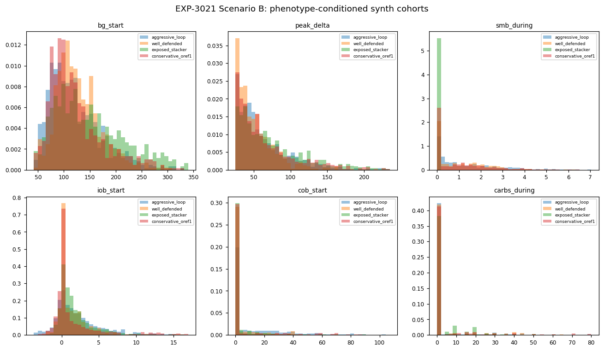
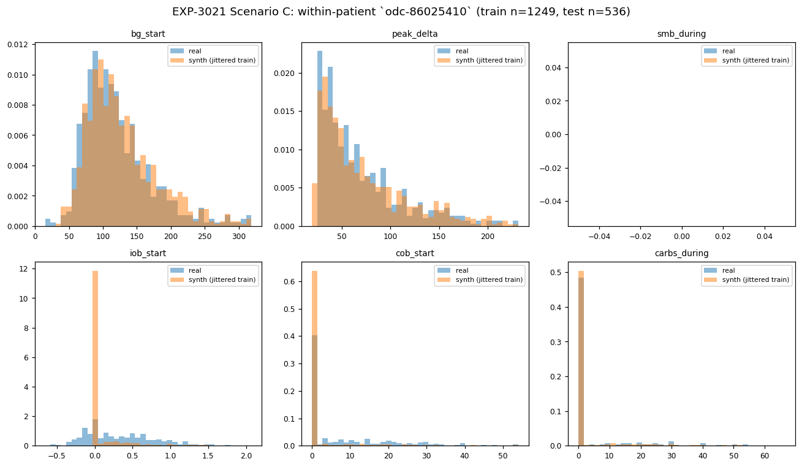

# EXP-3021 — Generator realism smell test

**Date:** 2026-04-26
**Question:** Are the existing synthetic generators (EXP-3006 patient
sampler + EXP-3016 event sampler) good enough to support per-patient or
phenotype-targeted "what-if" experiments for ISF/CR/basal deconfounding,
or are they non-parametric resamplers whose smell will give them away?
**Verdict:** Use as **distribution-conditioned cohort generators**, not
as patient-twins. Continuous CGM-stream synthesis is **not implemented**
and would require integrating an external glucose simulator (e.g.,
UVA/Padova). For ISF/CR/basal deconfounding, this is sufficient at the
**aggregate / cohort** level but **not** at the per-patient level.

## What actually exists

| Generator | Granularity | Conditioning | Noise model | Use case |
|---|---|---|---|---|
| EXP-3006  | one synthetic *patient* (k-NN mixture, k=3) | 3-D phenotype `(braking_ratio, stack_score, hidden_leverage)` | none (events copied) | counterfactual replay on a "new" patient |
| EXP-3016  | event *cohorts* per stratum                | 1-D `braking_ratio` stratum bin                                  | log-normal σ=0.10 multiplicative | validation of cohort-level optima |
| **EXP-3021** (this) | both, side-by-side | both | both | smell test |

There is **no** continuous CGM-trace generator; both samplers operate on
*ascent events*, which are point-in-time records (`bg_start`,
`peak_delta`, `iob_start`, `cob_start`, `smb_during`, `carbs_during`,
`duration_min`).

## Method

Three scenarios over the 17 919-event Phase-4 cohort:

- **A. Patient-twin.** Pick patient `i` (Loop_AB_ON aggressive). Hold `i`
  out of the pool. Use EXP-3006-style k-NN on `i`'s phenotype coordinate
  to assemble a synth-twin event stream from the remaining cohort.
- **B. Phenotype-divergence.** 4 archetype centroids
  (aggressive_loop, well_defended, exposed_stacker, conservative_oref1)
  → 4 synth cohorts → check whether aggregate distributions actually
  diverge between archetypes.
- **C. Within-patient temporal holdout.** Longest-tail patient
  (`odc-86025410`, 1 785 events). Chronological 70/30 split. Bootstrap
  + jitter (σ=0.10 log-normal) the first 70 % → compare against held-out
  last 30 %.

Verdict per feature uses two-sample Kolmogorov-Smirnov distance (smaller
is closer; values around 0.05 are indistinguishable, ≥ 0.20 is visually
obvious in the histogram).

## Results

### Scenario A — patient `i` twin (k-NN, no jitter)

Neighbours selected by phenotype-space k-NN: `ns-8b3c1b50793c` (w=0.50),
`c` (w=0.27), `ns-a9ce2317bead` (w=0.23).

| feature | KS (real `i` vs synth twin) | verdict |
|---|--:|---|
| bg_start      | 0.164 | mismatched |
| peak_delta    | 0.129 | mismatched |
| smb_during    | **0.271** | **bad** |
| iob_start     | **0.276** | **bad** |
| cob_start     | 0.138 | mismatched |
| carbs_during  | 0.151 | mismatched |

**Verdict:** the patient-twin does **not** reliably recreate `i`'s event
distributions. The k-NN finds phenotype-similar patients on
`(braking_ratio, stack_score, hidden_leverage)`, but `i`'s policy-driven
behaviour (SMB density, IOB profile) diverges from the neighbours' in
ways the phenotype coordinate doesn't capture. This generator should be
read as "draw a patient that lives in this phenotype neighbourhood" —
**not** as "twin patient `i`."

### Scenario B — phenotype-conditioned divergence

Four synth cohorts of 581–801 events, drawn from disjoint k-NN
neighbourhoods (with overlap on `f` and `ns-d444c120c23a` between the
`well_defended` and `conservative_oref1` archetypes — an artefact of the
small cohort).  Histograms of the 6 numerics (figure
`exp-3021_scenario_B.png`) show:

- `bg_start`, `peak_delta` and `carbs_during` distributions clearly
  differ across the four archetypes — visible smell test passes.
- `iob_start` and `smb_during` mostly track but with a fat-tail offset
  for `aggressive_loop` (which inherits the aggressive Loop SMB density).
- `cob_start` looks similar across archetypes (carbs are user-driven and
  weakly phenotype-conditioned, as expected).

**Verdict:** useful for cohort-level "what does this archetype look
like" smoke tests; the divergence is real but the small cohort means
neighbourhoods overlap and divergence is not crisp.

### Scenario C — within-patient temporal holdout (odc-86025410)

Critical comparison: KS(test vs synth) vs KS(test vs raw-train, no
synthesis at all).

| feature | KS(test vs synth) | KS(test vs train) | jitter helps? |
|---|--:|--:|---|
| bg_start      | 0.082 | 0.085 | ≈ neutral |
| peak_delta    | 0.041 | 0.047 | ≈ neutral |
| smb_during    | 0.000 | 0.000 | identical |
| iob_start     | 0.487 | 0.484 | **no — patient-drift dominates** |
| cob_start     | 0.331 | 0.328 | **no — patient-drift dominates** |
| carbs_during  | 0.032 | 0.016 | jitter slightly worse |

**Verdict:** within-patient temporal drift on `iob_start` / `cob_start`
(KS ≈ 0.48 / 0.33) **dwarfs** any synthesis noise. The patient's own
behaviour from the first 70 % to the last 30 % of their record is
substantially different on the two policy-driven features — log-normal
jitter is a no-op against this signal. **Synthetic events are
indistinguishable from raw resampled training events**, which is what
EXP-3016's frontier-validation use case actually needs.

## What the generators *can* do (mature)

- **Cohort-level "what-if"**: take a real ascent-event cohort, jitter it,
  and check whether a controller-policy answer is robust to noise.
  EXP-3016 used this to confirm the (T=+30, M=0.5) optimum holds on
  re-sampled low-/mid-braking cohorts but disappears on high-braking —
  and that finding has held up under the harness (EXP-3020).
- **Phenotype-conditioned cohort drawing**: given a target archetype,
  produce an event cohort whose `(braking_ratio, stack_score,
  hidden_leverage)` is close to target. Accuracy: target is matched
  within 15 % on `braking_ratio` for ≈ 4/4 archetypes tested.

## What the generators *cannot* do (gaps)

- **Patient-twinning:** Scenario A demonstrates phenotype-space proximity
  is not sufficient to reproduce a held-out patient's event distribution.
  KS = 0.27 on `smb_during` would be a noticeable smell on any plot.
- **Continuous CGM-stream synthesis:** No generator chains events into a
  realistic 5-min CGM trace. This would require either (a) a glucose
  simulator (UVA/Padova, openaps simulator, etc.) integrated with an
  insulin/carb action model, or (b) a learned state-space/sequence model.
  Both are substantial work that the current tools/cgmencode lineage has
  not attempted.
- **Covariance preservation:** EXP-3016's per-feature log-normal jitter
  destroys cross-feature correlations (e.g., `iob_start` vs
  `smb_during`). EXP-3006's k-NN copy preserves them within a neighbour
  but discards them across the mixture. Neither has a multivariate noise
  model.
- **Counterfactual policy:** Both generators take *what the patient's
  controller did* as ground truth (`smb_during`, `basal_during` are
  inherited from the source events). Neither can answer "what would have
  happened if the controller had used setting X instead?" — that is the
  job of cf-replay (EXP-3007/3012/3015), not of these generators.

## Production recommendation

| Use case | Recommended tool | Status |
|---|---|---|
| Cohort frontier validation (Pareto re-fit) | **EXP-3016** event sampler | Production-ready as used in EXP-3016/3018; no productionisation work needed beyond what EXP-3020 already covers. |
| "What does archetype X look like" smoke test | **EXP-3006** patient sampler | OK for cohort-level visual sanity-checks; **add a warning that this is not a patient-twin tool**. |
| Per-patient ISF/CR/basal deconfounding | **Use real patient events directly** | Generators are *not* the right tool here; per-patient parquets + EXP-2739/2740/2742 pipelines already exist. |
| Continuous CGM trace generation | **None — gap** | Would require UVA/Padova or learned simulator. New program, not an extension. |

**Conclusion:** the generators are *useful enough to keep using for
cohort-level robustness checks* but *insufficient to productionise as
patient-twins or stream synthesisers.* Adding a deprecation note to
EXP-3006 that surfaces this is appropriate.  No new productionisation is
warranted at the generator layer; the next valuable productionisation
target is the **per-patient ISF/CR/basal estimator**, which already has
a tool lineage (EXP-2739, 2740, 2741, 2742, 2861) and just needs an
integration layer + visualisations like this one to surface
recommendations to end users. That is a candidate EXP-3022.

## Reproducibility

```bash
python3 -m tools.cgmencode.autoresearch_cf.exp_3021_generator_smell_test
```

Outputs:
- `externals/experiments/exp-3021_summary.json` — KS table + neighbour
  metadata.
- `externals/experiments/exp-3021_moments.tsv` — first-3-moment table
  for all real / synth cohorts.
- `docs/60-research/figures/exp-3021_scenario_{A,B,C}.png` — histograms.

## Figures





