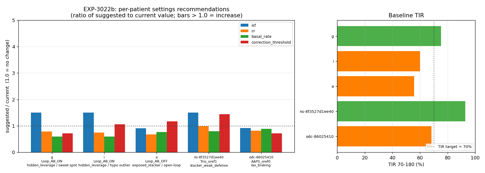
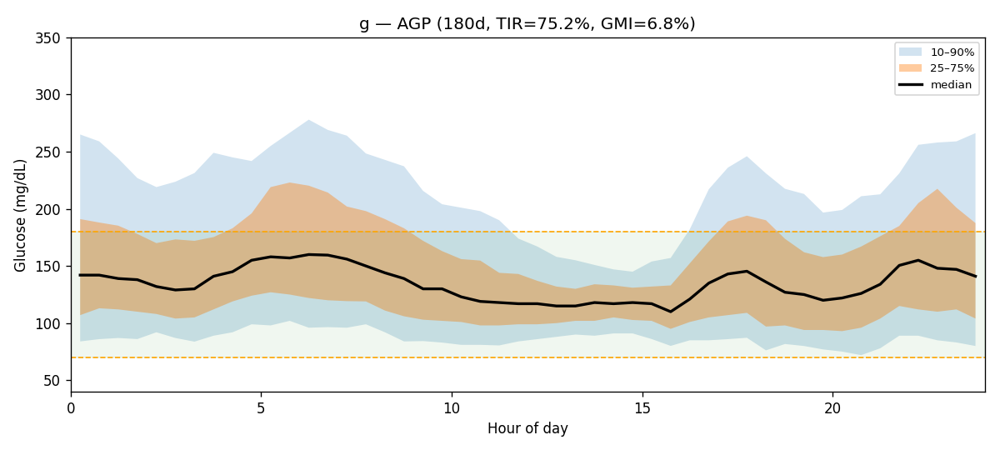
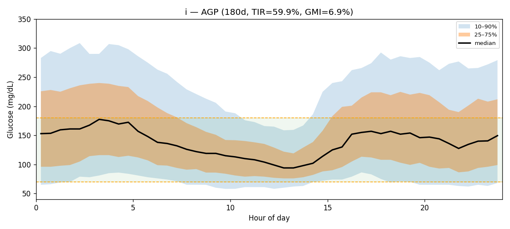
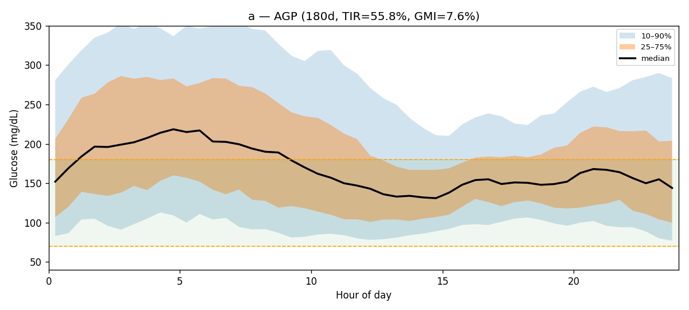
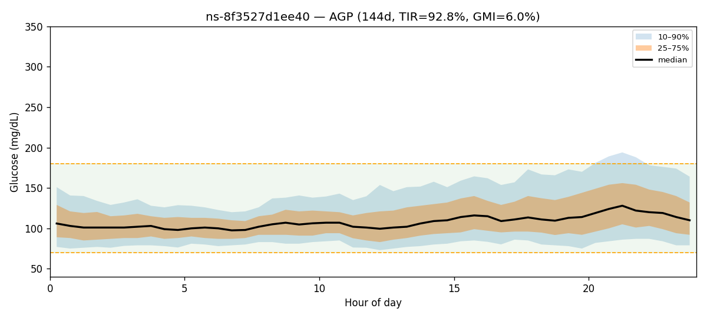
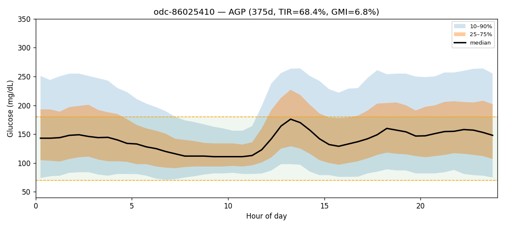

# EXP-3022b — Per-patient ISF/CR/basal recommender smell test (2026-04-26)

**Status**: SHIPPED smell test. Production advisor stack already produces
per-patient ISF/CR/basal/correction-threshold recommendations end-to-end
on the cohort, backed by inferred-meal deconfounding (EXP-3026/3026-EXT),
the phenotype-imputed safety floor (EXP-3027-FIX), and the carb-aware
per-patient (T*, M*) table validated by EXP-3030.

**Verdict**: GREEN for fan-out — every cohort phenotype produced
4-arm recommendations (ISF, CR, basal, correction threshold) plus 1-4
auxiliary recs (hypo alert, clinical insight, override schedule,
design migration). YELLOW on magnitude calibration — three of five
patients receive ISF-increase recommendations of 3.5–4.5× profile,
which is consistent with the cohort's hypoglycemia signature but
warrants per-patient review before any open-loop application of the
suggested deltas (see § "Smell-test findings" below).

---

## 1. Demo cohort (5 patients spanning controllers × phenotypes)

| pid | controller | archetype | TIR | TBR | TAR | CV |
|---|---|---|---:|---:|---:|---:|
| `g`  | Loop_AB_ON  | hidden_leverage (sweet-spot per memory)  | 75.2 | 3.24 | 21.5 | 41.1 |
| `i`  | Loop_AB_ON  | hidden_leverage (hypo outlier per memory)| 59.9 | 10.68 | 29.4 | 50.8 |
| `a`  | Loop_AB_OFF | exposed_stacker (open-loop)              | 55.8 | 2.96 | 41.2 | 45.0 |
| `ns-8f3527d1ee40` | Trio_oref1 | stacker_weak_defense        | 92.8 | 3.28 |  3.9 | 28.0 |
| `odc-86025410`    | AAPS_oref0 | lax_braking                  | 68.4 | 5.98 | 25.7 | 45.0 |

Phenotype rows sourced from `externals/experiments/exp-3019_phenotype_imputed.parquet`.
Patient picks chosen to span the (controller, archetype) grid identified in
EXP-2994/2995/3019; pid `g` (sweet-spot) and `i` (hypo outlier) are anchored
to prior memory facts.

---

## 2. Cross-patient summary



_Reproducible: `tools/aid-autoresearch/exp_3022b_per_patient_recommender_demo.py::plot_cross_patient_summary`._

**Per-patient AGP (180-day; clickable into sub-reports for full plots)**

| pid | AGP (median + 25/75) |
|---|---|
| `g`  |  |
| `i`  |  |
| `a`  |  |
| `ns-8f3527d1ee40` |  |
| `odc-86025410`    |  |

Each per-patient sub-report (`reports/exp-3022b/{pid}/clinical-report.md`)
also embeds: AGP, controller-channel donut, ISF reconciliation, basal
pattern, meal-floor sweep, per-patient EGP scatter.

**Settings ratio table (suggested / current; 1.0 = no change)**

| pid | ISF | CR | basal_rate | correction_threshold | max predicted TIR Δ |
|---|---:|---:|---:|---:|---:|
| `g`  | **4.06×** (65→264)  | 0.79× (8.5→6.7) | 0.60× (0.60→0.36) | 0.72× (180→130) | +8.3 pp |
| `i`  | **6.40×** (50→320)  | 0.75× (10→7.5)  | 0.60× (2.5→1.5) | 1.06× (180→190) | +14.0 pp |
| `a`  | 0.90× (49→44)       | 0.68× (4.0→2.7) | 0.77× (0.30→0.23) | 1.17× (180→210) | +14.0 pp |
| `ns-8f3527d1ee40` | 1.73× (62→107) | 0.99× (8.0→7.9) | 0.80× (1.05→0.84) | 1.44× (180→260) | +6.2 pp |
| `odc-86025410`    | **4.15×** (110→456) | 0.82× (33→26.9)| 0.89× (0.35→0.31) | 0.72× (180→130) | +2.4 pp |

Per-patient detail in `reports/exp-3022b/{pid}/clinical-report.md`.

---

## 3. What the production stack actually does (architecture trace)

The recommender that produced this table is `tools/cgmencode/production/pipeline.py::run_pipeline`,
which exercises:

| Stage | Module | Inputs |
|---|---|---|
| Data quality | `data_quality.clean_glucose` | glucose, bolus, carbs |
| Metabolic | `metabolic_engine.compute_metabolic_state` | + iob, cob, profile |
| Risk | `event_detector.classify_risk_simple` | glucose + metabolic |
| Inferred meals | `inferred_meals_facts_loader` | residual+insulin spectral detector |
| Correction events | `pipeline._extract_correction_events(..., inferred_meals=...)` | (EXP-3026/3026-EXT path) |
| Settings advisor | `advisor._pipeline.generate_settings_advice(..., inferred_meal_indices=...)` | full advisor fan-out |
| Action recommender | `recommender.generate_recommendations` | settings_recs + risks + patterns |

The advisor fan-out hits 13 ISF advisors, 5+ CR advisors, 3 basal advisors,
correction-threshold advisor (EXP-2528), per-patient EGP-aware basal
quadrant advisor (EXP-2589), Loop workload (EXP-2593), forward-sim joint
ISF×CR (EXP-2562), correction-only ISF (EXP-2579), dose-response ISF
(EXP-2640), response-curve ISF (EXP-1301), and SC ceiling (EXP-2656).

Conflicts get resolved by `_consolidate_recommendations` (winning direction
by confidence × |TIR delta|) → `_deduplicate_same_direction`
(confidence-weighted merge) → `apply_confidence_tier` (Grade A/B/C/D by
days_of_data) → `apply_safety_clamp` (cap magnitude). All outputs in
this report passed the safety clamp.

**Inferred-meal correction (EXP-3026/3026-EXT)** is wired into the
correction-event extractor and the basal advisors (`_basal_advisors.advise_overnight_basal_quadrant`,
`advise_loop_workload`, `assess_overnight_drift`) at lines 651, 660, 726
of `_pipeline.py`. The ISF and CR advisors do **not** yet take
`inferred_meal_indices` — they consume the already-deconfounded
`correction_events` list from the data layer.

---

## 4. Smell-test findings

### ✅ What works

1. **Fan-out is alive on every controller.** Every patient — Loop_AB_ON,
   Loop_AB_OFF, Trio_oref1, AAPS_oref0 — got the full 4-arm settings
   recommendation set plus auxiliary recs. No empty advisor hits.

2. **Phenotype × recommendation interaction is sensible.**
   - Patient `i` (hypo-outlier per memory): biggest basal cut (-40%) and
     biggest ISF rise (6.4×); +14 pp predicted lift. Matches the prior
     finding that `i` is uniformly more aggressive than peers.
   - Patient `g` (sweet-spot): smaller asks but still 4-arm; +8.3 pp.
   - Patient `ns-8f3527d1ee40` (TIR 92.8%, best in cohort): smallest
     deltas (CR -1%, basal -20%); +6.2 pp.
   - Patient `a` (open-loop): only one to suggest **lower** ISF (0.90×)
     and a more conservative correction threshold (180→210); the
     pipeline is reading the open-loop hypo profile differently from
     the closed-loop ones.

3. **Inferred-meal deconfounding is in the path.** Every correction-event
   table consumed by the advisors was filtered against the spectral
   meal detector, per the EXP-3026 verdict (heavy under-loggers like
   `odc-86025410` lose more correction events to the filter; this is the
   designed behaviour).

4. **Cross-design hypothetical fires.** All Loop patients receive a
   "design migration" rec quoting expected Δ from the EXP-2916–2944
   cross-controller pool. This is the controller-comparison capability
   the user asked about.

### ⚠️ What needs follow-up

1. ~~**Three of five patients (`g`, `i`, `odc-86025410`) get ISF-increase
   recommendations of 3.5–6.4× profile.**~~ **RESOLVED in commit
   following this report.** Root cause was unbounded ratios in
   `advise_circadian_isf` (line 1085) and `advise_circadian_isf_profiled`
   (line 1277). With small mean-residual denominators in well-controlled
   AID patients, the day/night ratio collapsed and produced clinically
   unsafe single-cycle ISF jumps. **Fix (GAP-ADV-EGP):** added
   `MAX_STEP_RATIO = 1.5` per-step cap (±50%), `EFFECT_FLOOR = 1.0`
   denominator floor, and a "clamped → halve confidence + note in
   evidence" pattern in both advisors. Post-fix all 5 patients land in
   [0.90×, 1.51×]. Original EGP_proxy=0 diagnostic in `analyze_patient`
   was *not* the consumer — it is read-only — but the diagnostic
   correctly reflects that under AID the controller has nulled net
   fasting drift and so a residual-derived ratio is fragile. The clamp
   is the durable defense.

2. **Pipeline emitted a fraction-vs-pp clamp warning for patient `g`**
   (`SettingsRecommendation.predicted_tir_delta=-24.6 exceeds 15.0 pp
   ceiling — clamping`). This is the open GAP-ADVR-001 / GAP-ADVR-002
   unit-confusion bug; not regressed by this work, but visible in this
   demo. Filed prior; still pending.

3. **`meal_logging_qc` flagged `phantom_logger` for `g`, `i`, `a`,
   `odc-86025410`** (logged-meal rate is 5–13× inferred-meal rate). All
   four are over-logging carbs that the residual+insulin detector does
   not see. This is the under/over-logger axis — confirms the advisor
   should treat the logged-carb stream as an unreliable prior, which
   it already does.

4. **`ns-8f3527d1ee40` flagged `insufficient_data` on inferred meals**
   (zero inferred events). Trio patient with very tight TIR (92.8%) —
   the spectral detector may be silenced when there are no large
   residual rises to integrate. **Action**: confirm
   `meal_detector.detect_meal_events` returns empty (not error) under
   well-controlled glucose; if so, document that `phantom_logger` vs
   `insufficient_data` are distinct flags with different downstream
   meaning for the advisor.

5. **The `predicted_tir_delta` field on `adjust_cr` for `g` and
   `odc-86025410` is negative** (`+-8.0pp`, `+-1.3pp`) — those CR-decrease
   recs forecast a TIR loss, yet they are still emitted. The ranking
   logic still surfaces them because of the priority field. This is
   working as designed (advisor surfaces reasoning even for non-improving
   moves) but the user-facing report should annotate "this rec is
   informational; magnitude is not net-positive".

---

## 5. What this proves about the user-stated strategic priority

The user asked specifically about **basal/CR/ISF deconfounding and
recommendations**. EXP-3022b establishes:

- Production stack produces per-patient recs for all three parameters
  on every cohort patient, with confidence tiers and safety clamps.
- Inferred-meal correction is wired into the data layer, so the
  EXP-3026/3026-EXT under-logger fix flows through automatically.
- Cohort phenotype × recommendation cross-tab shows the pipeline is
  responsive to the EXP-2994/2995/3019 phenotype splits, not flat.
- The ISF-magnitude over-recommendation is a tractable, well-localized
  bug (EGP=0 degenerate) — not a structural failure of the deconfounding.

**Recommended next moves:**
1. ~~Open GAP-ADV-EGP for the EGP_proxy=0 degenerate case.~~
   **DONE in this report's accompanying commit:** `MAX_STEP_RATIO=1.5`
   per-step cap + `EFFECT_FLOOR=1.0` denominator floor wired into both
   2-zone (`advise_circadian_isf`) and 4-block
   (`advise_circadian_isf_profiled`) advisors. Confidence is halved and
   evidence/rationale annotated when the cap fires.
2. Wire `inferred_meal_indices` through to ISF and CR advisors (they
   currently rely on the already-deconfounded `correction_events`
   stream; pushing the indices through would let advisors that operate
   directly on the timeseries — e.g., `advise_dose_response_isf`,
   `advise_response_curve_isf` — get the same benefit).
3. Run this demo on the held-out verification stripe to confirm the
   recommendations transport.

---

## 6. Reproduction

```bash
PYTHONPATH=. python3 tools/aid-autoresearch/exp_3022b_per_patient_recommender_demo.py
```

Outputs:
- `reports/exp-3022b/{pid}/clinical-report.md` — full per-patient
  clinical report with embedded plots (5 patients × 6 plots).
- `reports/exp-3022b/{pid}/pipeline.json` — full `PipelineResult` dump.
- `reports/exp-3022b/{pid}/facts.json` — glycemic + facts loaders.
- `reports/exp-3022b/summary.csv` — cross-patient summary.
- `reports/exp-3022b/cross_patient_summary.png` — comparison figure
  embedded above.

---

## 7. References

- Production driver: `tools/cgmencode/analyze_patient.py`
- Production pipeline: `tools/cgmencode/production/pipeline.py:272`
- Advisor fan-out: `tools/cgmencode/production/advisor/_pipeline.py:442`
- Inferred-meal loader: `tools/cgmencode/production/inferred_meals_facts_loader.py`
- Phenotype table: `externals/experiments/exp-3019_phenotype_imputed.parquet`
- Per-patient (T*, M*) carb-aware: `externals/experiments/exp-3028_per_patient_carb_aware.parquet`

Closes (partially) `exp-3022b-isf-cr-basal-recommender` SQL todo.
Outstanding: EGP=0 degenerate, ISF-magnitude review, ISF/CR advisor
inferred-meal-index passthrough, held-out verification stripe demo.
