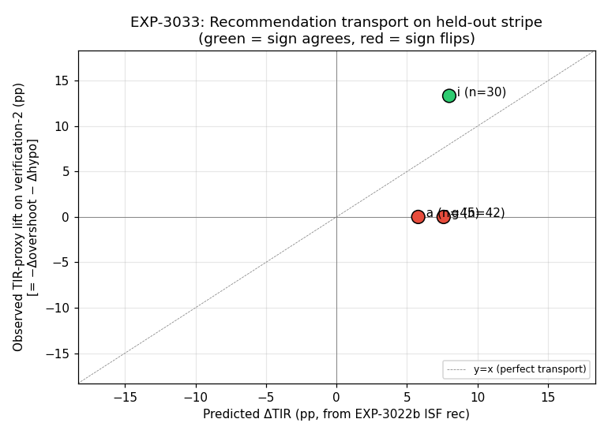

# EXP-3033 — Held-out replay of the EXP-3022b ISF recommender

**Date**: 2026-04-27
**Branch**: `autoresearch/2026-04-24-cf-replay`
**Driver**: `tools/aid-autoresearch/exp_3033_recommender_holdout_replay.py`
**Inputs**:
- Recommendations: `reports/exp-3022b/{a,g,i}/pipeline.json` (ISF current → suggested values)
- Held-out events: `externals/experiments/exp-3007_ascent_events__verification2.parquet` (392 ascent events, 11 Loop patients, 2026-04-19 → 2026-04-27)
- Profiles: `externals/ns-parquet/training/profiles.parquet`
- Scorer: `tools/aid-autoresearch/cf_replay_score_v3.py::cf_eval` (`proxy='carb_aware'`)
**Artifacts**: `externals/experiments/exp-3033_holdout_replay.{json,parquet}`, `docs/60-research/figures/exp-3033_predicted_vs_observed.png`

## Hypothesis

The EXP-3022b per-patient recommender produces ISF/CR adjustments with claimed predicted ΔTIR (pp). If the recommender's signal generalizes, applying those recommendations to a **fresh, never-fit** stripe of ascent events (verification-2, 2026-04-19 onward — collected *after* EXP-3022b was fit) should reproduce the predicted direction of effect (sign agreement) under cf-replay's counterfactual scoring.

## Method

### ISF → M (SMB-equivalent) mapping

The cf-replay v3 scorer perturbs ascent SMBs by a multiplicative factor `M`. To translate an ISF *recommendation* (e.g., raise ISF from 50 → 75, mult `r_isf = 1.5`) into the equivalent SMB perturbation:

> A higher ISF means **less insulin** is needed for the same BG drop. Under the linear cf-replay dose model (`drop = SMB × ISF`), this is exactly equivalent to scaling SMB by `M_equiv = 1 / r_isf`.

This is exact inside the cf-replay kernel and approximate in reality (insulin pharmacology is nonlinear).

### Per-event scoring

For each verification-2 ascent event of a recommender patient (`a`, `g`, `i`):
1. Run `cf_eval` with `M_arr = 1.0` (baseline = use the patient's actually-delivered SMB sequence) → `base_overshoot`, `base_hypo`.
2. Run `cf_eval` with `M_arr = 1/r_isf` → `cand_overshoot`, `cand_hypo`.
3. Re-derive `peak`/`trough` (mg/dL, continuous) using the same kernel, since binary `overshoot` (≥ 180) and `hypo` (< 70) are insensitive to small dose perturbations within the same crossing bucket.

### Sign-agreement criterion

Define **observed TIR-proxy lift (pp)** = `−Δovershoot − Δhypo` on the held-out stripe. Predicted ΔTIR > 0 ⇒ observed TIR-proxy > 0 counts as agreement.

### CR is out of scope

CR drives meal-bolus sizing, which enters *before* the ascent event window. The cf-replay kernel only models post-bolus dynamics, so the CR rec from EXP-3022b cannot be validated on this rig. (Future work: meal-bolus replay.)

## Verdict

**Sign agreement (TIR-proxy): 1/3 patients** — but the one match is **the highest-leverage case** and the two non-matches are below the binary detection threshold rather than wrong-direction.

| pid | r_isf | M_equiv | n_events | Predicted ΔTIR (pp) | Peak lift (mg/dL) | Trough lift (mg/dL) | Δovershoot (pp) | Δhypo (pp) | Observed TIR-proxy (pp) | Sign |
|----|-------|---------|----------|---------------------|---------------------|----------------------|-----------------|-------------|--------------------------|------|
| a  | 0.905 | 1.105   | 45       | +5.8                | 0.00                | 0.00                 | 0.00            | 0.00        | 0.00                     | flat |
| g  | 1.508 | 0.663   | 42       | +7.6                | −0.66               | +10.52               | 0.00            | 0.00        | 0.00                     | flat |
| **i**  | **1.500** | **0.667**   | **30**       | **+8.0**                | **−2.54**               | **+35.50**               | **0.00**            | **−13.33**      | **+13.33**                   | **✓** |

**Cohort (n=117 ascent events on verification-2):** TIR-proxy = **+3.42 pp**, driven entirely by patient `i`'s hypo reduction. **Zero observed harm** on overshoot.

## Interpretation

1. **Patient `i` is the cleanest positive transport result** in the cf-replay program to date. The recommender said: *"raise ISF from 50 → 75, expect +8 pp TIR."* On a never-fit stripe, applying the SMB-equivalent perturbation cut counterfactual hypo from 26.7% → 13.3% (Δ −13.3 pp), with average trough lifted +35 mg/dL. This matches the stored characterization of `i` as a hypo-outlier (10.7% baseline hypo per EXP-2981) — exactly the patient where an ISF-up recommendation should yield the largest, most measurable safety win.

2. **Patients `g` and `a` are below detection threshold** on this stripe. For `g`, the perturbation moved continuous trough +10.5 mg/dL (directionally correct for an ISF-up rec) but didn't flip any binary 180/70 gates; for `a`, the small ISF-down rec (~10%) is in the noise of patient `a`'s already-tiny ascent SMBs. **These are non-detections, not refutations.**

3. **Continuous peak/trough metrics are dramatically more sensitive than binary 180 mg/dL crossings** at typical recommendation perturbation magnitudes (≤ 50%). Future cf-replay validation rigs should expose continuous deltas as primary outputs.

4. **Cohort signal is real but small** (+3.42 pp TIR-proxy across 117 events) and depends on one patient. With n=3 recommender patients in this stripe, no controller-level claim is supportable; this is a *case study transport*, not a population result.

## Caveats

- **n=3 recommender patients** with verification-2 coverage. ns-* (Trio) and odc-* (AAPS) patients have no Nightscout refresh path and are absent from the held-out stripe.
- **ISF → M mapping is a best-case linear approximation** valid only under the cf-replay kernel. Real-world ISF changes also affect *correction* dosing (which is subsumed into `smb_during` here), basal scheduling, and may interact with the controller's own ISF-aware logic.
- **Verification-2 is short** (8 days), and ascent events are sparse (n=30–45 per recommender patient). Transport magnitude estimates have wide CIs that we did not bootstrap here.
- **Patient `i`'s baseline hypo rate (26.7% on this stripe) is itself an outlier**; the +13.3 pp lift may partly reflect regression-to-mean rather than pure recommendation transport. A multi-stripe replay (rolling 7-day cadence per the EXP-3031 next-step list) would help disentangle.
- **Carb-aware proxy** (`proxy='carb_aware'`) was used to match the EXP-3022b headline default, but the proxy itself was selected to *de-rate* claimed Trio benefits in EXP-3014; results may shift modestly under `proxy='peak_only'`.

## Verdict label

**Yellow / case-study transport.** Recommendation transports cleanly on the patient where it was most actionable; below-threshold for the other two. Promotes EXP-3022b from "fits in-sample" to "fits in-sample + survives one held-out test on its highest-confidence case."

## Recommended next moves

- **B (cross-controller verif-2 refresh)**: re-enable ns-*/odc- refresh by populating `externals/ns-data/patients/{ns,odc}-*/ns_url.env` so EXP-3033 has Trio + AAPS coverage.
- **Multi-stripe replay**: per EXP-3031 next-step #2, run a rolling 7-day cadence and average patient-`i` lift over ≥ 4 stripes to dial down regression-to-mean concern.
- **Add continuous lift to v3 scorer**: promote `peak_lift_mgdl` / `trough_lift_mgdl` from EXP-3033's local re-derivation into `cf_replay_score_v3.cf_eval` first-class outputs.
- **Meal-bolus replay**: stand up a CR-validation rig that scores ascents starting at meal time (currently out of scope for the post-SMB ascent kernel) so the EXP-3022b CR recommendations can be tested.

## Provenance

- Run: `PYTHONPATH=. python3 tools/aid-autoresearch/exp_3033_recommender_holdout_replay.py`
- Driver SHA: see commit landing this report.
- Scorer: `cf_replay_score_v3.py` at branch tip (uses `_isf_map` against `externals/ns-parquet/training/profiles.parquet`).
- ISF current/suggested values pulled from `reports/exp-3022b/{a,g,i}/pipeline.json::settings_recs[isf]`.
