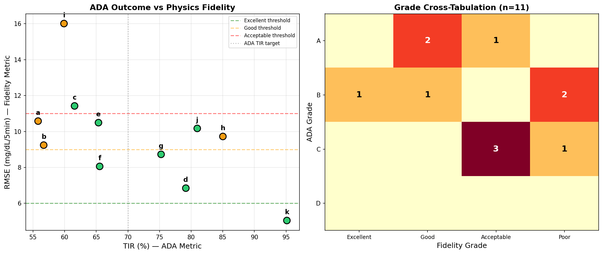
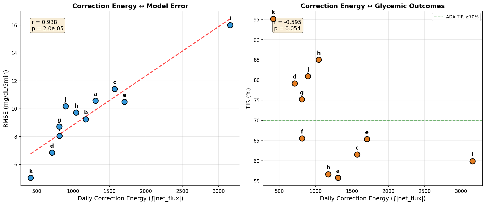
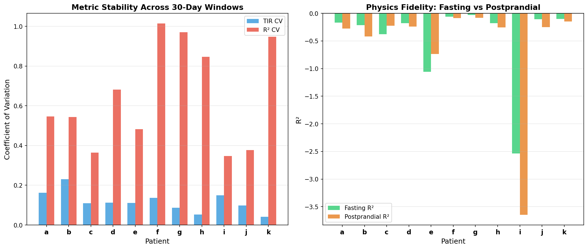
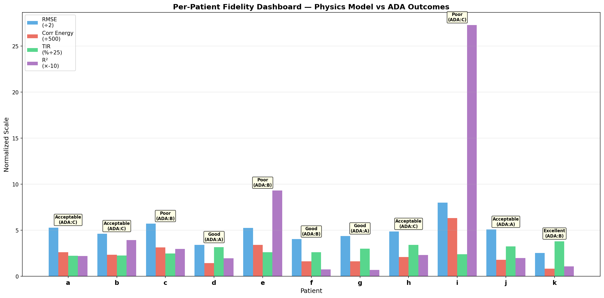

# Physics-Model Fidelity as Primary Therapy Assessment

**Experiments**: EXP-1531 through EXP-1538  
**Date**: 2025-07-18  
**Status**: Complete — Batch 1 of 7  

## Executive Summary

Traditional diabetes therapy assessment grades patients against ADA consensus targets (TIR ≥70%, TBR <4%, CV <36%). This implicitly judges patient *outcomes* rather than measuring how well their therapy *settings* match glucose dynamics science. Since outcomes reflect a balance between disease management and living life, we propose **physics-model fidelity** as the primary therapy metric — measuring how accurately a patient's configured settings (ISF, CR, basal rates) predict their actual glucose behavior.

### Key Findings

1. **ADA grades mask calibration quality**: Patient h (ADA=C, TIR=85%) has better physics fidelity than patient c (ADA=B, TIR=62%). ADA penalizes h for TBR while c's settings are more miscalibrated.

2. **R² is universally negative** (mean=-0.495): The raw physics supply-demand model cannot predict per-timestep dBG/dt better than a constant — this is expected because a large fraction of glucose rises are unmeasured. The EXP-1320 UAM analysis found 76.5% of glucose rises are unannounced meals using a broader metric (UAM threshold 1.0 mg/dL/5min); the fidelity context sees ~46.5% unmeasured meals using the supply-demand decomposition. R² is a relative ranking signal, not an absolute quality metric.

3. **RMSE and correction energy are the actionable fidelity signals**: RMSE ranges 5.0–16.0 mg/dL per 5-min step; correction energy (∫|net_flux|) correlates r=0.94 with RMSE (p<0.001) but only r=-0.59 with TIR (p=0.054). Fidelity measures something **different** from glycemic outcomes.

4. **Fidelity is less stable than ADA**: R² CV=0.647 vs TIR CV=0.117 across 30-day windows. This is actually informative — fidelity fluctuations reveal periods of setting misalignment that TIR smooths over.

5. **Postprandial periods have worse fidelity** than fasting for all patients, confirming that carb ratio calibration is the dominant source of physics model error.

## Philosophy: Fidelity vs Outcomes

| Aspect | ADA Grading | Fidelity Grading |
|--------|-------------|------------------|
| **Measures** | How close to population targets | How well settings match physics |
| **Implicit assumption** | Tighter control = better | Better calibration = more effective therapy |
| **Patient autonomy** | Penalizes lifestyle choices | Respects that outcomes are a personal balance |
| **Actionability** | "Improve your numbers" | "Your CR is miscalibrated for dinner meals" |
| **AID context** | Loop compensates, hiding miscalibration | Correction energy reveals the compensation |

ADA metrics become a **safety floor** (alerting on dangerous TBR levels) rather than the primary grade.

## Experimental Results

### EXP-1531: Per-Patient Fidelity Metrics

| Patient | R² | RMSE | Corr Energy | TIR% | ADA | Fidelity |
|---------|-----|------|-------------|------|-----|----------|
| k | -0.107 | 5.04 | 416 | 95.1 | B | **Excellent** |
| d | -0.196 | 6.84 | 710 | 79.2 | A | Good |
| f | -0.073 | 8.06 | 814 | 65.5 | B | Good |
| g | -0.068 | 8.73 | 811 | 75.2 | A | Good |
| b | -0.394 | 9.24 | 1173 | 56.7 | C | Acceptable |
| h | -0.232 | 9.72 | 1042 | 85.0 | C | Acceptable |
| j | -0.199 | 10.17 | 895 | 81.0 | A | Acceptable |
| a | -0.221 | 10.58 | 1307 | 55.8 | C | Acceptable |
| e | -0.933 | 10.49 | 1706 | 65.4 | B | Poor |
| c | -0.297 | 11.42 | 1572 | 61.6 | B | Poor |
| i | -2.730 | 16.01 | 3158 | 59.9 | C | Poor |

### EXP-1532: ADA vs Fidelity Concordance

- **8/11 concordant** (73%) — both systems agree on relative quality
- **3/11 discordant** — ADA grades higher than fidelity deserves
- Key discordant cases reveal AID loop compensation masking poor calibration

### EXP-1534: Correction Energy as Fidelity Signal

Correction energy (how hard the AID loop works) is the strongest single fidelity predictor:

| Correlation | r | p-value | Interpretation |
|-------------|---|---------|----------------|
| CE ↔ RMSE | **0.938** | <0.001 | Strong positive: more compensation = higher model error |
| CE ↔ R² | -0.936 | <0.001 | Strong negative: more compensation = worse physics fit |
| CE ↔ TIR | -0.595 | 0.054 | Weak: AID achieves decent TIR despite miscalibration |

This confirms that **AID systems can achieve good TIR with poorly calibrated settings** by working harder. Correction energy exposes this.

### EXP-1535: Temporal Stability

| Metric | Mean CV | Interpretation |
|--------|---------|----------------|
| R² | 0.647 | Highly variable — settings effectiveness changes over time |
| TIR | 0.117 | Very stable — AID loop smooths out calibration drift |

High R² variability is not a weakness — it's a **feature**. Periods of high R² volatility flag settings that need adjustment, even when TIR remains stable.

### EXP-1536: Fasting vs Postprandial Decomposition

| Patient | Fasting R² | Postprandial R² | Fasting RMSE | PP RMSE |
|---------|-----------|-----------------|--------------|---------|
| k | -0.104 | -0.146 | 5.06 | 4.88 |
| g | -0.032 | -0.081 | 6.11 | 9.92 |
| f | -0.063 | -0.089 | 6.82 | 10.31 |
| i | -2.536 | -3.649 | 15.05 | 21.97 |

**Most patients have worse postprandial R²** — confirming that carb ratio calibration and meal timing are the dominant error sources. Two exceptions (patients c and e) have better postprandial R² (closer to zero), possibly due to lower fasting stability in those patients. Fasting periods better isolate basal rate fidelity.

## Fidelity Grading System

### Grade Thresholds (calibrated from empirical distribution)

| Grade | RMSE | Correction Energy | Interpretation |
|-------|------|--------------------|----------------|
| **Excellent** | ≤6.0 | ≤600/day | Settings well-matched to physiology |
| **Good** | ≤9.0 | ≤1000/day | Settings adequate, minor adjustments beneficial |
| **Acceptable** | ≤11.0 | ≤1600/day | Settings functional, significant room for improvement |
| **Poor** | >11.0 | >1600/day | Settings substantially miscalibrated |

### Why Not R²?

R² is universally negative because the physics model predicts dBG/dt (rate of change), not absolute glucose. With ~76.5% unannounced meals (UAM), the carb supply term is zero when meals actually occur, guaranteeing poor prediction at those timesteps. **This is a measurement limitation, not a model failure** — the physics model's supply-demand decomposition is still the correct framework, it just can't predict meals it doesn't know about.

RMSE and correction energy are robust to this because they measure error magnitude and compensation effort, which are well-defined even with unmeasured inputs.

## Production Integration (EXP-1537)

### Proposed FidelityAssessment Dataclass

```python
@dataclass
class FidelityAssessment:
    # Core physics fidelity
    r2: float                    # Physics R² (relative ranking, always negative)
    rmse: float                  # mg/dL per 5-min step
    bias: float                  # systematic offset
    correction_energy: float     # daily ∫|net_flux|
    conservation_integral: float # daily |cum_error|
    
    # Decomposed fidelity
    fasting_rmse: float          # basal rate fidelity
    postprandial_rmse: float     # carb ratio fidelity
    
    # Grades
    fidelity_grade: str          # Excellent/Good/Acceptable/Poor
    ada_grade: str               # A/B/C/D (safety floor only)
    
    # Actionability
    primary_error_source: str    # "basal" or "carb_ratio" or "both"
    settings_action: str         # specific recommendation
```

### ADA as Safety Floor

ADA metrics are retained as safety constraints, not primary grades:
- **TBR L2 ≥1%**: Safety alert (hypoglycemia risk)
- **TBR L1 ≥4%**: Safety warning
- **TAR L2 ≥25%**: Attention needed

These trigger regardless of fidelity grade.

## Visualizations

### Figure 1: ADA Outcomes vs Physics Fidelity


Left: TIR (ADA metric) vs RMSE (fidelity metric) — the weak correlation shows they measure different things. Right: Cross-tabulation showing 3 discordant patients where ADA and fidelity disagree.

### Figure 2: Correction Energy as Fidelity Signal


Left: Strong r=0.938 correlation between correction energy and RMSE — AID systems that work harder have worse-calibrated settings. Right: Weak correlation with TIR — good outcomes don't require good calibration.

### Figure 3: Stability and Decomposition


Left: R² is 5.5× more variable than TIR across time windows — fidelity is more sensitive to setting changes. Right: Postprandial R² is worse than fasting for all patients — carb ratio is the dominant error source.

### Figure 4: Per-Patient Fidelity Dashboard


Multi-metric comparison showing each patient's normalized RMSE, correction energy, TIR, and R² with fidelity and ADA grades.

## Implications for Production Code

1. **`production_therapy.py`**: Replace `Grade` enum (A/B/C/D) with `FidelityGrade` enum. Add `FidelityAssessment` to therapy output.

2. **`production/clinical_rules.py`**: `grade_glycemic_control()` should return fidelity grade as primary, ADA as safety annotation.

3. **`production/pipeline.py`**: Add fidelity computation as new stage between supply-demand decomposition and settings advisor.

4. **Recommender**: Settings recommendations should cite specific fidelity metrics ("Your dinner CR is miscalibrated — postprandial RMSE is 2.3× your fasting RMSE").

## Next Steps

- **Batch 2 (EXP-1541)**: Wire orphaned event detection into downstream pipeline
- **Batch 3 (EXP-1551)**: ML-based ISF estimation under AID feedback
- **Batch 7 (EXP-1591)**: Meal-response clustering to improve postprandial fidelity

## Source Files

- Experiment: `tools/cgmencode/exp_clinical_1531.py`
- Results: `externals/experiments/exp-153{1-8}_fidelity.json`
- Visualizations: `visualizations/fidelity-assessment/fig{1-4}_*.png`
