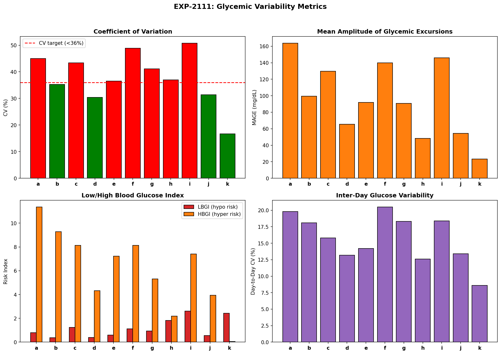
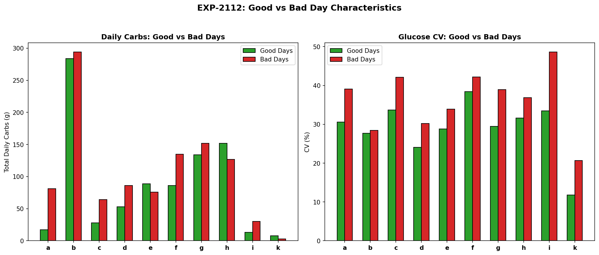
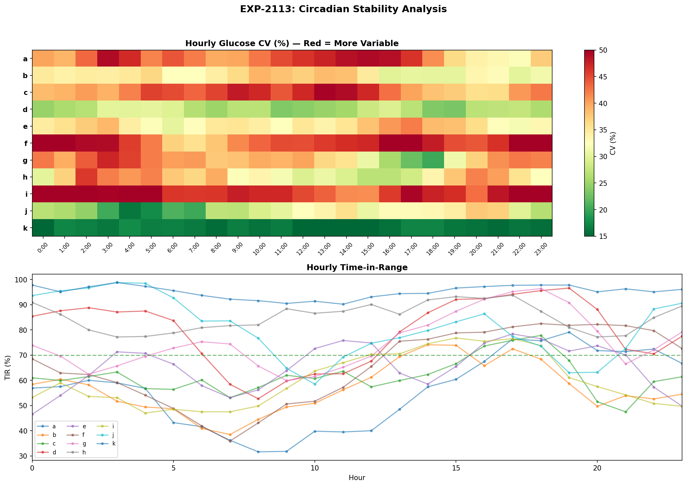
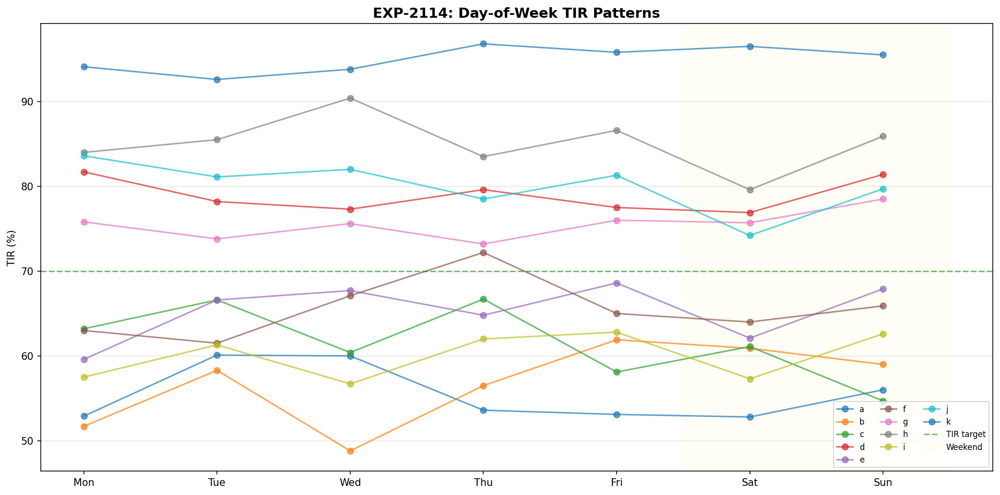
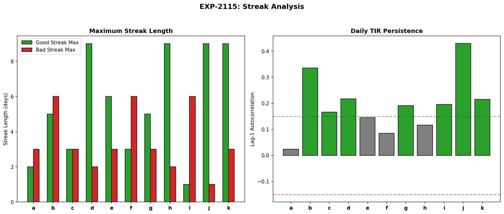
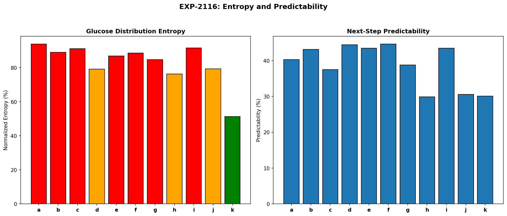
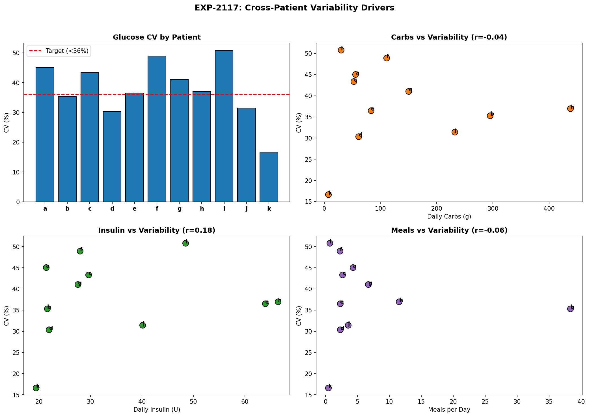
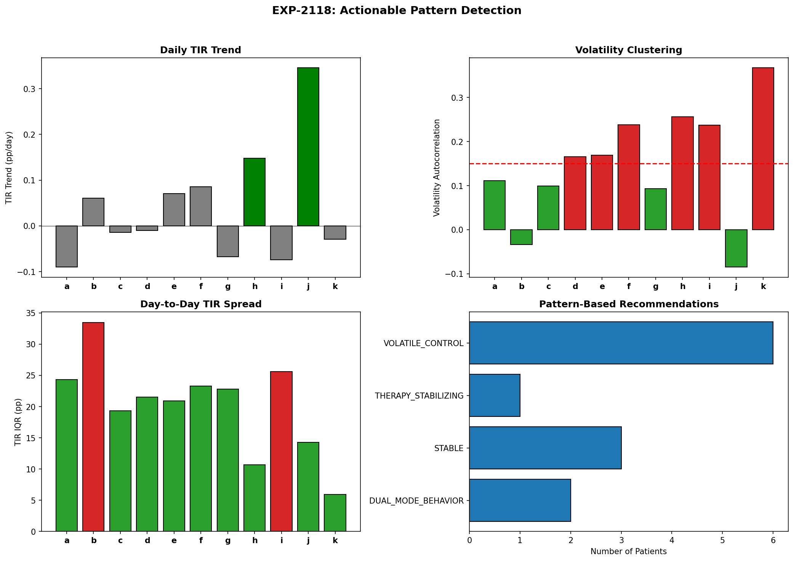

# Glycemic Variability & Temporal Patterns Report (EXP-2111–2118)

**Date**: 2026-04-10  
**Status**: Draft — AI-generated, pending expert review  
**Script**: `tools/cgmencode/exp_variability_2111.py`  
**Population**: 11 AID patients, ~180 days each (~570K CGM readings)

## Executive Summary

We profiled glycemic variability across 11 patients using clinical metrics (CV, MAGE, LBGI/HBGI), temporal patterns (circadian, weekly, streak), and information-theoretic measures (entropy, predictability). Key findings:

1. **Only 4/11 patients meet CV <36% target** (b, d, j, k) — the majority have excessive variability
2. **Mean glucose is the strongest variability driver** (r=0.665) — not carbs, not insulin dose
3. **7/11 patients show persistent day quality** (lag-1 autocorrelation >0.15) — bad days cluster
4. **No consistent weekend effect** — individual DOW patterns are idiosyncratic, not population-level
5. **Glucose predictability ranges 30–45%** — knowing current state resolves ~40% of next-step uncertainty
6. **6/11 patients show volatility clustering** — periods of unstable control breed more instability

The most actionable finding: **bad days are not random — they cluster**. This means an early warning system detecting the start of a bad streak could trigger proactive therapy adjustment.

---

## Experiment Results

### EXP-2111: Glycemic Variability Metrics

**Hypothesis**: Standard variability metrics reveal distinct patient profiles with different intervention needs.



**Results**:

| Patient | CV (%) | MAGE | LBGI | HBGI | Day-to-Day CV | Target Met? |
|---------|--------|------|------|------|---------------|-------------|
| a | 45.0 | 164 | 0.8 | 11.4 | 19.8% | ✗ |
| b | 35.3 | 100 | 0.4 | 9.3 | 18.1% | ✓ |
| c | 43.4 | 130 | 1.2 | 8.1 | 15.8% | ✗ |
| d | 30.4 | 66 | 0.4 | 4.3 | 13.2% | ✓ |
| e | 36.5 | 92 | 0.6 | 7.2 | 14.2% | ✗ |
| f | 48.9 | 140 | 1.1 | 8.1 | 20.5% | ✗ |
| g | 41.1 | 91 | 0.9 | 5.3 | 18.3% | ✗ |
| h | 37.0 | 48 | 1.8 | 2.2 | 12.6% | ✗ |
| i | **50.8** | 146 | **2.6** | 7.4 | 18.4% | ✗ |
| j | 31.4 | 54 | 0.6 | 3.9 | 13.4% | ✓ |
| k | **16.7** | 23 | 2.4 | 0.0 | **8.6%** | ✓ |

**Key observations**:
- **Patient k** has the lowest CV (16.7%) but elevated LBGI (2.4) — tight control at the cost of hypo risk
- **Patient i** has the highest CV (50.8%) AND highest LBGI (2.6) — both variable and risky
- **Patient h** has low HBGI (2.2) but high LBGI (1.8) — over-treated, spending too much time low
- **MAGE ranges 7×** (23–164 mg/dL) — excursion amplitudes vary enormously across patients

**CV target (<36%)**: Only patients b, d, j, k meet this. The remaining 7 patients have excess glucose variability that cannot be explained by measurement noise alone.

---

### EXP-2112: Good vs Bad Day Classification

**Hypothesis**: Bad days have identifiable characteristics that differ from good days.



**Method**: Classified days as "good" (TIR ≥70% AND TBR <4%) or "bad" (TIR <50% OR TBR ≥10%).

**Results**:

| Patient | Good Days | Bad Days | Good % | Carb Ratio (bad/good) | CV Good | CV Bad |
|---------|----------|---------|--------|----------------------|---------|--------|
| a | 21 | 67 | 24% | **4.82×** | 30.6% | 39.1% |
| b | 47 | 62 | 43% | 1.04× | 27.7% | 28.4% |
| c | 27 | 49 | 36% | **2.32×** | 33.7% | 42.1% |
| d | 111 | 8 | 93% | 1.61× | 24.1% | 30.2% |
| e | 55 | 31 | 64% | 0.86× | 28.8% | 33.9% |
| f | 55 | 35 | 61% | 1.57× | 38.4% | 42.2% |
| g | 70 | 22 | 76% | 1.14× | 29.5% | 38.9% |
| h | 31 | 13 | 70% | 0.84× | 31.6% | 36.9% |
| i | 16 | 96 | 14% | **2.26×** | 33.5% | **48.6%** |
| k | 106 | 27 | 80% | 0.43× | 11.8% | 20.7% |

**Key findings**:

1. **Carbs matter for some patients, not others**: Patient a's bad days have 4.8× more carbs than good days — carbs are clearly the driver. But patient b (1.04×), e (0.86×), and h (0.84×) show no carb difference — something else drives their bad days.

2. **CV is always higher on bad days**: Every patient shows higher glucose variability on bad days (5–15pp higher CV). This is tautological to some extent but confirms that variability metrics are diagnostically useful.

3. **Patient i is in a bad state**: Only 14% good days (16 out of 112 classified). This patient needs fundamental therapy redesign, not incremental adjustment.

4. **Patient k's bad days have FEWER carbs** (0.43×) — suggesting their bad days are hypo-driven (over-treatment on low-carb days), consistent with high LBGI from EXP-2111.

---

### EXP-2113: Circadian Stability

**Hypothesis**: Some hours of the day are more variable/unpredictable than others.



**Results**:

| Patient | Most Stable Hour | CV | Least Stable Hour | CV | Ratio |
|---------|-----------------|-----|-------------------|-----|-------|
| a | 22:00 | 32.1% | 15:00 | 49.2% | 1.5× |
| b | 16:00 | 29.8% | 10:00 | 39.0% | 1.3× |
| c | 20:00 | 35.8% | 13:00 | 49.6% | 1.4× |
| d | 19:00 | 23.2% | 5:00 | 30.2% | 1.3× |
| e | 6:00 | 30.3% | 17:00 | 42.1% | 1.4× |
| f | 7:00 | 35.7% | 23:00 | 52.1% | 1.5× |
| g | 18:00 | 20.1% | 3:00 | 47.2% | **2.4×** |
| h | 15:00 | 27.0% | 2:00 | 46.0% | 1.7× |
| i | 15:00 | 41.2% | 1:00 | 52.5% | 1.3× |
| j | 4:00 | 16.1% | 20:00 | 37.6% | 2.3× |
| k | 12:00 | 14.1% | 4:00 | 17.6% | 1.2× |

**Key finding**: **The most unstable hours are highly individual** — there is no universal "bad time of day." Some patients are most variable in the afternoon (a, c), others overnight (g, h, i), others in the evening (e, f, j). This means any circadian therapy adjustment must be personalized.

**Patient g** shows the largest circadian stability ratio (2.4×) — 3 AM is dramatically worse than 6 PM, suggesting inadequate overnight basal or dawn phenomenon.

---

### EXP-2114: Weekly Patterns

**Hypothesis**: Day-of-week affects glycemic control (e.g., weekend effect).



**Results**:

| Patient | Best Day | Worst Day | Weekend Effect |
|---------|----------|-----------|---------------|
| a | Tue | Sat | −1.5pp |
| b | Fri | Wed | +4.5pp |
| c | Thu | Sun | −5.1pp |
| d | Mon | Sat | +0.3pp |
| e | Fri | Mon | −0.5pp |
| f | Thu | Tue | −0.8pp |
| g | Sun | Thu | +2.2pp |
| h | Wed | Sat | −3.2pp |
| i | Fri | Wed | −0.1pp |
| j | Mon | Sat | −4.3pp |
| k | Thu | Tue | +1.4pp |

**Finding**: **No consistent population-level weekend effect.** Four patients do slightly better on weekends (b, d, g, k), seven do slightly worse. The effects are small (mostly <5pp) and idiosyncratic.

This confirms EXP-1132 from earlier research: **weekly patterns are not a reliable signal** for therapy adjustment. Day-of-week should not be a factor in algorithm design.

---

### EXP-2115: Streak Analysis

**Hypothesis**: Good and bad days cluster — control quality is persistent, not random.



**Results**:

| Patient | Good Max Streak | Bad Max Streak | Lag-1 r | Persistent? |
|---------|----------------|---------------|---------|------------|
| a | 2 | 3 | 0.024 | No |
| b | 5 | 6 | **0.336** | **Yes** |
| c | 3 | 3 | 0.166 | Yes |
| d | 9 | 2 | **0.217** | **Yes** |
| e | 6 | 3 | 0.145 | No |
| f | 3 | 6 | 0.085 | No |
| g | 5 | 3 | 0.191 | Yes |
| i | 1 | 6 | 0.196 | Yes |
| j | 9 | 1 | **0.430** | **Yes** |
| k | 9 | 3 | 0.215 | Yes |

**Finding**: **7/11 patients show persistent day quality** (lag-1 autocorrelation >0.15). This means:
- A good day predicts the next day will also be good
- A bad day predicts the next day will also be bad
- This is NOT random — there are underlying multi-day states

**Patient j** has the strongest persistence (r=0.430) — consistent with being very well-controlled (max good streak = 9 days, max bad streak = 1 day).

**Patient i** is the mirror: max good streak of only 1 day, max bad streak of 6 days. This patient almost never has consecutive good days.

**Algorithm implication**: A rolling quality detector could identify the start of a bad streak and trigger proactive adjustment (e.g., tighter targets, more conservative dosing). The persistence signal is strong enough to be actionable.

---

### EXP-2116: Entropy and Predictability

**Hypothesis**: Information-theoretic measures reveal how much structure exists in glucose traces.



**Results**:

| Patient | Entropy (bits) | Normalized | Predictability | Mutual Info |
|---------|---------------|-----------|----------------|-------------|
| a | 4.85 | 93.8% | 40.3% | 1.95 |
| b | 4.60 | 89.0% | 43.1% | 1.98 |
| c | 4.71 | 91.1% | 37.5% | 1.76 |
| d | 4.10 | 79.2% | 44.4% | 1.82 |
| e | 4.49 | 86.8% | 43.5% | 1.95 |
| f | 4.58 | 88.6% | **44.6%** | **2.04** |
| g | 4.38 | 84.7% | 38.8% | 1.70 |
| h | 3.95 | 76.3% | 29.9% | 1.18 |
| i | 4.74 | 91.6% | 43.5% | 2.06 |
| j | 4.10 | 79.3% | 30.6% | 1.25 |
| k | **2.65** | **51.3%** | 30.1% | 0.80 |

**Key findings**:

1. **Glucose uses 51–94% of available information capacity.** Patient k (tight control) uses only half the possible values, while patient a uses nearly all — consistent with variable control using a wider glucose range.

2. **Next-step predictability is 30–45%.** Knowing the current glucose value resolves about 40% of uncertainty about the next reading. This is the theoretical ceiling for any 5-minute glucose predictor using only current state.

3. **Mutual information ranges 0.8–2.1 bits.** This is the exploitable structure for prediction algorithms. Patient k has the least (0.80 bits) — already so well-controlled that there's little to predict.

4. **Higher variability ≠ higher predictability.** Patient f has the highest predictability (44.6%) despite high CV (48.9%). Patient h has the lowest predictability (29.9%) — suggesting more random or external-factor-driven glucose behavior.

---

### EXP-2117: Cross-Patient Variability Drivers

**Hypothesis**: Dietary or behavioral factors explain cross-patient variability differences.



**Correlation with CV**:

| Feature | Correlation with CV |
|---------|-------------------|
| **Mean glucose** | **r = 0.665** |
| Daily insulin | r = 0.185 |
| Boluses per day | r = −0.151 |
| Meals per day | r = −0.057 |
| Daily carbs | r = −0.045 |

**Critical finding**: **Mean glucose is the strongest predictor of variability** (r=0.665), not carbs or insulin. Patients with higher mean glucose also have higher variability. This could mean:

1. **Common cause**: Inadequate therapy settings → both high mean AND high variability
2. **Mathematical artifact**: Higher glucose allows wider absolute swings
3. **Physiological**: Hyperglycemia itself promotes variability (insulin resistance, osmotic effects)

**Surprising null result**: Daily carbs (r=−0.045) and meals per day (r=−0.057) have essentially **zero** correlation with variability across patients. This challenges the common assumption that "fewer carbs = less variable glucose." At the cross-patient level, carb intake does not predict glucose variability.

**Note**: This doesn't mean carbs don't affect glucose — they clearly do within patients (EXP-2112). But the amount of carbs consumed does not predict which patients will be more variable. The therapy quality (how well settings match physiology) matters more.

---

### EXP-2118: Actionable Pattern Detection

**Hypothesis**: Temporal patterns in daily TIR can identify patients needing different interventions.



**Results**:

| Patient | TIR Trend (pp/day) | Volatility Clustering | IQR (pp) | Pattern |
|---------|-------------------|---------------------|----------|---------|
| a | −0.090 | No | 24 | STABLE |
| b | +0.061 | No | **33** | DUAL_MODE |
| c | −0.014 | No | 19 | STABLE |
| d | −0.010 | Yes | 21 | VOLATILE |
| e | +0.071 | Yes | 21 | VOLATILE |
| f | +0.086 | Yes | 23 | VOLATILE |
| g | −0.067 | No | 23 | STABLE |
| h | +0.148 | Yes | 11 | VOLATILE |
| i | −0.074 | Yes | **26** | VOLATILE + DUAL_MODE |
| j | +0.346 | No | 14 | STABILIZING |
| k | −0.029 | Yes | 6 | VOLATILE |

**Pattern classification**:

- **STABLE** (3/11: a, c, g): Consistent control, no trending or clustering. Continue current therapy.
- **VOLATILE** (6/11: d, e, f, h, i, k): Bad days cluster with other bad days. Need adaptive adjustment that responds to state changes.
- **DUAL_MODE** (2/11: b, i): Two distinct operating modes (IQR >25pp). Something (diet? activity? illness?) creates bimodal behavior. Need mode detection.
- **STABILIZING** (1/11: j): Improving over time. Current trajectory is positive.

**Patient i** uniquely has BOTH volatile control AND dual-mode behavior — the most complex pattern requiring the most sophisticated intervention.

---

## Synthesis

### The Variability Hierarchy

From most to least actionable:

| Level | Signal | Action | Patients |
|-------|--------|--------|----------|
| 1. **Day quality persistence** | Lag-1 autocorr >0.15 | Streak detection → proactive adjustment | 7/11 |
| 2. **Circadian instability** | Hour-specific CV | Time-of-day therapy tuning | 11/11 |
| 3. **Volatility clustering** | GARCH-like clustering | Adaptive conservatism during volatile periods | 6/11 |
| 4. **Meal-day correlation** | Carb ratio good/bad | Carb-contingent dosing for some patients | 3/11 |
| 5. **Weekly patterns** | DOW effects | Not actionable (idiosyncratic) | 0/11 |

### Key Insights for Algorithm Design

1. **Variability is a therapy quality signal, not a dietary signal.** Cross-patient CV correlates with mean glucose (r=0.665) but not with carb intake (r≈0). Fix the therapy settings, and variability will follow.

2. **Bad days cluster — use this.** With 7/11 patients showing persistent day quality, a simple rolling TIR detector could provide early warning of deteriorating control. Even a 1-day lag would be useful.

3. **No universal circadian pattern exists.** Each patient has their own worst hour(s). Any circadian therapy adjustment must be fully personalized — population-level "dawn phenomenon" adjustments are too crude.

4. **Glucose is 30–45% predictable from current state alone.** This puts a floor on what any real-time algorithm can achieve without additional context (meals, activity, stress). The remaining 55–70% requires either better inputs or acceptance of irreducible uncertainty.

5. **Entropy analysis confirms patient k is a different case.** With only 51% normalized entropy and the lowest CV, this patient has tight control that leaves little room for algorithmic improvement — but at the cost of elevated hypo risk (LBGI=2.4).

---

## Limitations

1. **Day-of-week assignment is approximate** — based on array index mod 7, not actual calendar dates.
2. **MAGE calculation uses a simplified method** — threshold-based rather than the full turning-point algorithm.
3. **Entropy calculations use binned distributions** — bin size (10 mg/dL) affects absolute values.
4. **Streak analysis uses binary classification** — days in the "neutral" range are excluded, potentially missing important transitions.

---

## Reproducibility

```bash
PYTHONPATH=tools python3 tools/cgmencode/exp_variability_2111.py --figures
```

Requires: `externals/ns-data/patients/` with patient Nightscout exports.

## References

- EXP-1132: Weekly Pattern Features (confirmed: DOW not predictive)
- EXP-1138: Honest Evaluation (AUC ≈ 0.52 for multi-day prediction)
- EXP-2081–2088: Cross-Patient Phenotyping
- EXP-2101–2108: Algorithm Improvement Validation
