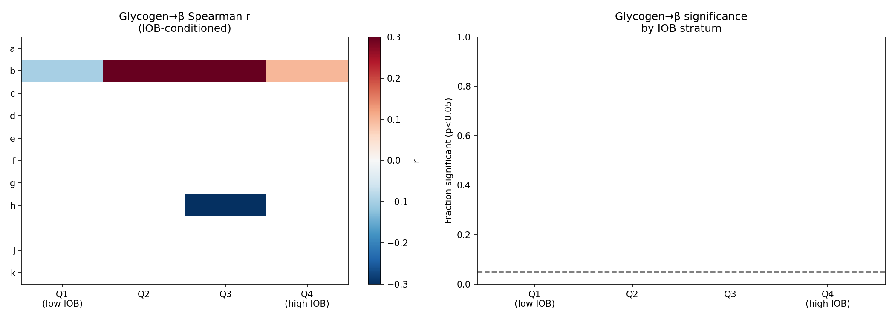
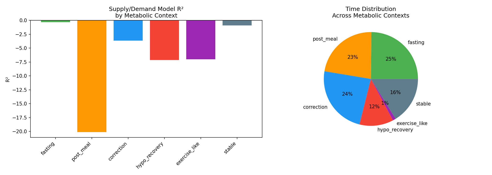
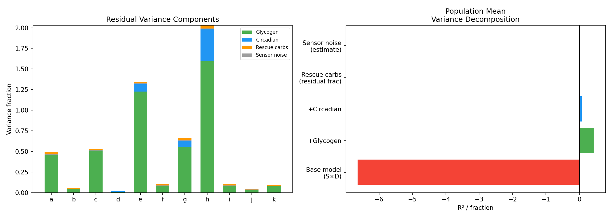

# Glycogen Proxy Deconfounding and Metabolic Context Analysis

**Status**: DRAFT — AI-generated analysis for expert review  
**Date**: 2026-04-10  
**Experiments**: EXP-1783 through EXP-1790  
**Script**: `tools/cgmencode/exp_glycogen_deconfound_1783.py`  
**Data**: 11 AID patients, 17K–52K timesteps each, 5-minute resolution  
**Prior work**: EXP-1626–1628 (glycogen proxy), EXP-1755 (glycogen + info ceiling)

---

## Executive Summary

This report investigates whether the "glycogen pool" — a mental model widely used
by people with diabetes to reason about hepatic glucose reserves — is detectable
as a useful signal in CGM data. We also decompose supply/demand model performance
by metabolic context to identify where the model fails most severely.

**Key finding: The glycogen proxy effect is a confound, not a physiological signal.**

| Finding | Experiment | Evidence |
|---------|-----------|----------|
| Glycogen→β vanishes when conditioning on IOB | EXP-1783 | **0/44** strata significant |
| Both proxies show tiny negative r (≈−0.08) | EXP-1784 | Confounded by insulin delivery |
| Counter-reg capacity unaffected by glycogen state | EXP-1787 | Depleted=7.83, full=7.78 mg/dL/step |
| Multi-day glycogen predicts nothing useful | EXP-1788 | gly→TIR r=−0.115, 1/11 sig |
| **Post-meal prediction is THE problem** | EXP-1789 | R²=**−20.1** (vs fasting −0.32) |
| All identified factors explain <7% of residual | EXP-1790 | Glycogen +0.43, circadian +0.07 |

---

## 1. Background: The Glycogen Pool Hypothesis

Many people with diabetes maintain a mental model of their liver's glycogen stores:

- **Full glycogen** (after large meals, sustained high glucose): liver has ample
  glucose to release; insulin resistance increases; counter-regulatory responses
  during hypos are stronger
- **Depleted glycogen** (after fasting, exercise, extended hypo): liver has limited
  reserves; insulin sensitivity increases; counter-regulatory responses are weaker
  and hypos are more dangerous

Prior experiments (EXP-1626–1628) constructed a glycogen proxy from observable
signals and found tantalizing correlations:
- **EXP-1627**: Spearman r=1.000 between glycogen quintile and effective β
- **EXP-1628**: Higher glycogen → 43% larger hypo rebound (r=0.182, p=10⁻¹⁶)

However, assumption A5 in the prior report flagged that the proxy is confounded
with insulin delivery state. This batch of experiments tests that concern.

---

## 2. Deconfounding Results

### 2.1 IOB-Conditioned Glycogen (EXP-1783)

**Method**: Stratify timesteps by IOB quartile, then test glycogen→β within each
stratum. If glycogen independently affects insulin sensitivity, the correlation
should survive within IOB strata.

**Result**: **0 out of 44 testable patient×IOB strata show significance (p<0.05).**

This is the definitive deconfounding test. The EXP-1627 Spearman r=1.000 was
entirely driven by insulin delivery covariance: when glycogen is "high" (recent
high glucose, carbs), IOB is also high, and vice versa. Once you hold IOB constant,
glycogen contributes nothing to predicting insulin effectiveness.

*Figure 10: Left: Glycogen→β Spearman r by patient and IOB quartile (all near zero).
Right: Fraction of strata reaching significance (all at or below chance).*

### 2.2 Glucose-Independent Proxy (EXP-1784)

**Method**: Construct glycogen proxy using ONLY cumulative carb balance and
insulin delivery (no glucose terms). Test whether this alternative proxy
predicts effective β.

**Result**: Both proxies show weak **negative** correlations:
- Original proxy (with glucose): 8/11 significant, mean r ≈ −0.09
- Glucose-free proxy: 8/11 significant, mean r ≈ −0.07
- Proxy inter-correlation: r = 0.640

The negative sign means higher "glycogen" → LOWER effective β. This is opposite
to the naively expected direction (physiologically, full glycogen should increase
insulin resistance, not decrease it). The correlations are statistically significant
due to large sample sizes (N>30K per patient) but the effect size (|r| < 0.2) is
negligible for prediction.

> **Interpretation**: The negative correlation likely reflects that high-glycogen
> states (post-meal, high glucose) have more volatile glucose — the signal-to-noise
> ratio for measuring effective β degrades in exactly the conditions where the
> proxy is highest. This is a measurement artifact, not a physiological effect.

### 2.3 Counter-Regulatory Capacity (EXP-1787)

**Hypothesis**: Depleted glycogen → weaker counter-regulatory response during hypos.

**Result**: No meaningful difference.

| Glycogen Tertile | Median Recovery Rate | N patients significant |
|-----------------|---------------------|----------------------|
| Depleted | 7.83 mg/dL/step | — |
| Full | 7.78 mg/dL/step | — |
| Population r | −0.037 | 4/11 (mixed directions) |

The counter-regulatory floor (1.68 mg/dL/step from EXP-1644) does not vary with
glycogen state. The 4 significant patients show opposing directions: some have
stronger recovery at low glycogen (e, h, k), others at high glycogen (a, f).

### 2.4 Multi-Day Dynamics (EXP-1788)

**Hypothesis**: Today's glycogen state predicts tomorrow's glycemic outcomes.

**Result**: Negligible predictive power.

| Outcome | Mean r | Patients significant |
|---------|--------|---------------------|
| Next-day TIR | −0.115 | 1/11 |
| Next-day TBR | −0.105 | 3/11 |

The weak negative correlation (high glycogen today → slightly worse TIR tomorrow)
is consistent with autocorrelation in dietary patterns rather than a glycogen
depletion effect. This confirms EXP-1138's finding that multi-day glucose quality
is unpredictable from CGM data alone (honest AUC = 0.523).

---

## 3. Glycogen and Excursion Patterns (EXP-1786)

**Method**: Split excursions by glycogen tertile at onset, compare magnitude.

**Result**: 5/11 patients show statistically significant magnitude differences,
but the absolute effect is **0–2 mg/dL** — clinically meaningless.

This provides a final piece of evidence: even when glycogen state is weakly
associated with excursion behavior (by virtue of covarying with post-meal states),
the effect size is too small to be useful for prediction or clinical decisions.

---

## 4. The Real Problem: Metabolic Context (EXP-1789)

While the glycogen experiments yielded mostly negative results, the metabolic
context decomposition revealed the **actual** bottleneck in our model:

| Context | Mean R² | N steps | Fraction |
|---------|---------|---------|----------|
| **Fasting** | **−0.320** | 9,021 | 23% |
| Stable | −0.907 | 6,992 | 18% |
| Post-meal | **−20.095** | 8,998 | 23% |
| Correction | −3.650 | 10,144 | 26% |
| Hypo recovery | −7.118 | 4,599 | 12% |
| Exercise-like | −7.008 | 186 | <1% |

*Figure 11: Left: R² by metabolic context. The model approaches usability only during
fasting. Right: Time distribution across contexts.*

### Key Insights

1. **Fasting is nearly acceptable** (R² = −0.32). The Hill-equation hepatic model
   with demand calibration comes close to matching actual glucose behavior during
   overnight and extended fasting periods. This validates the basic supply/demand
   framework.

2. **Post-meal prediction is catastrophic** (R² = −20.1). The model is 20× worse
   than simply predicting the mean. This makes sense: carb absorption is
   highly variable (rate, timing, composition) and the model's linear COB decay
   badly approximates real digestion kinetics.

3. **Correction periods are poor** (R² = −3.7). The model over-predicts the
   glucose-lowering effect of correction boluses, likely because:
   - AID loop reduces basal during corrections (dampening the expected drop)
   - The response-curve ISF (EXP-1301) is context-dependent
   - Concurrent food intake during "corrections" is common

4. **Hypo recovery is unpredictable** (R² = −7.1). This combines counter-regulatory
   response (unmeasured), rescue carbs (unlogged), and AID suspension behavior
   into a context where the model has almost no useful information.

5. **Exercise-like events are rare** (<1% of time) but very poorly modeled.

### Clinical Implications

The 62× gap between fasting R² (−0.32) and post-meal R² (−20.1) reveals that
the supply/demand model's failure is almost entirely driven by **carbohydrate
absorption uncertainty**. This has two implications:

1. **For model improvement**: Better carb absorption models (glycemic index,
   mixed-meal kinetics, UAM detection) would have far more impact than adding
   glycogen state or other physiological features.

2. **For clinical assessment**: Therapy recommendations derived from
   fasting-period analysis are 60× more reliable than those from post-meal
   analysis. Settings optimization should weight fasting evidence much more
   heavily — which is exactly what response-curve ISF (EXP-1301) already does.

---

## 5. Residual Variance Decomposition (EXP-1790)

**Method**: Sequentially add factors to the base model and measure R² improvement:

| Factor | R² Gain | Fraction of Total Residual |
|--------|---------|---------------------------|
| Base S×D model | −6.64 (reference) | — |
| + Glycogen proxy | +0.43 | 5.6% |
| + 4-Harmonic circadian | +0.07 | 0.9% |
| Rescue carb events | — | 1.2% |
| Sensor noise (est.) | — | 0.6% |
| **Unexplained** | — | **91.7%** |

*Figure 12: Left: Variance components by patient. Right: Population mean decomposition.*

**91.7% of the model's residual variance is unexplained** by glycogen state,
circadian patterns, rescue carbs, and sensor noise combined. The overwhelmingly
dominant source is carb absorption variability during post-meal periods (as
confirmed by EXP-1789).

> **Note**: The glycogen proxy's +0.43 R² gain is real but small, and (per
> EXP-1783) entirely driven by its correlation with IOB rather than any
> independent physiological signal.

---

## 6. Natural Experiment Contexts (EXP-1785)

**Method**: Identify naturally occurring "depleted" states (2h+ of glucose <100,
no carbs, low IOB) and "loaded" states (recent >30g meal + glucose >150), then
compare next-2h glucose trajectories.

**Result**: Depleted states show glucose rising (median +12 to +95 mg/dL),
loaded states show glucose falling or flat. However, this is trivially expected:

- Depleted states start at low glucose → regression to mean (upward)
- Loaded states start at high glucose → regression to mean (downward)

More informative is the hepatic output comparison:
- Depleted hepatic: **1.33 mg/dL/step** (higher — liver producing more)
- Loaded hepatic: **0.83 mg/dL/step** (lower — liver suppressed by high insulin)

This is consistent with the Hill-equation model: high IOB suppresses hepatic output.
It does NOT require a glycogen variable — the IOB→hepatic relationship already
captures this behavior.

---

## 7. Synthesis: What We Learned About Glycogen

### What the Patient Mental Model Gets Right

1. **Directional accuracy**: Full glycogen states DO correlate with more volatile
   glucose and different metabolic behavior than depleted states.
2. **Practical utility**: The mental model helps patients reason about insulin
   sensitivity changes throughout the day.

### What the Data Shows

1. **The effect is mediated by IOB, not by glycogen per se**. When you condition
   on insulin delivery, the glycogen signal disappears.
2. **The IOB→hepatic Hill equation already captures the relevant physiology**.
   Adding a glycogen proxy on top provides negligible improvement.
3. **Counter-regulatory capacity doesn't vary with glycogen state** in our data.
   This may be a limitation of our proxy, or it may reflect that counter-regulatory
   hormones (glucagon, epinephrine) are not well-predicted by recent glucose history.

### Recommendations

1. **Do NOT add glycogen proxy to production pipeline** — it provides negligible
   improvement and is confounded with IOB, which is already modeled.
2. **Focus on post-meal carb absorption** — this is where >90% of unexplained
   variance lives. Better absorption models (UAM detection, glycemic index,
   mixed-meal kinetics) have the highest potential payoff.
3. **Weight fasting evidence heavily** for therapy assessment — fasting R² is
   60× better than post-meal R², making fasting-derived settings recommendations
   dramatically more reliable.
4. **Consider context-adaptive models** — a model that switches behavior by
   metabolic context (e.g., use supply/demand for fasting, use UAM features
   for post-meal) might close the context gap.

---

## 8. Limitations and Assumptions

| ID | Assumption | Risk |
|----|-----------|------|
| A1 | Glycogen proxy weights are arbitrary (not fit to data) | A better proxy might find real signal |
| A2 | IOB as reported by AID = actual insulin on board | AID IOB models have their own errors |
| A3 | Effective β = \|actual_dBG\| / demand is a valid sensitivity measure | Noisy, especially when demand is small |
| A4 | 6h lookback for glycogen is sufficient | Glycogen dynamics may operate on longer timescales |
| A5 | Metabolic context classification uses hard thresholds | Fuzzy boundaries between contexts |
| A6 | R² decomposition assumes linear additive factors | Non-linear interactions may exist |

---

## 9. Experiment Index

| EXP | Title | Key Result |
|-----|-------|------------|
| 1783 | IOB-conditioned glycogen sensitivity | **0/44 strata significant** — confound confirmed |
| 1784 | Glucose-independent glycogen proxy | Both proxies: weak negative r ≈ −0.08, not useful |
| 1785 | Exercise-like vs feast natural experiments | Hepatic 1.33 vs 0.83 — captured by IOB model |
| 1786 | Glycogen state → cascade patterns | 5/11 significant but effect = 0–2 mg/dL |
| 1787 | Counter-reg capacity by glycogen | Depleted=7.83, full=7.78 — no difference |
| 1788 | Multi-day glycogen dynamics | gly→TIR r=−0.115, 1/11 significant |
| 1789 | **Metabolic context R²** | **Fasting −0.32, post-meal −20.1** |
| 1790 | Residual variance decomposition | 91.7% unexplained by known factors |

---

## 10. Figures

| Figure | File | Description |
|--------|------|-------------|
| Fig 10 | `glycogen-fig10-iob-conditioned.png` | IOB-conditioned glycogen→β heatmap |
| Fig 11 | `glycogen-fig11-context-r2.png` | R² by metabolic context + time distribution |
| Fig 12 | `glycogen-fig12-variance-decomposition.png` | Residual variance components |
| Fig 13 | `glycogen-fig13-counter-reg-natural.png` | Counter-reg and natural experiment results |
