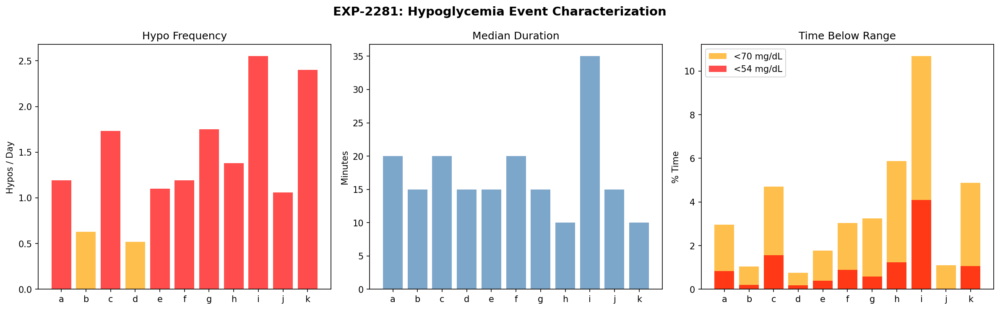
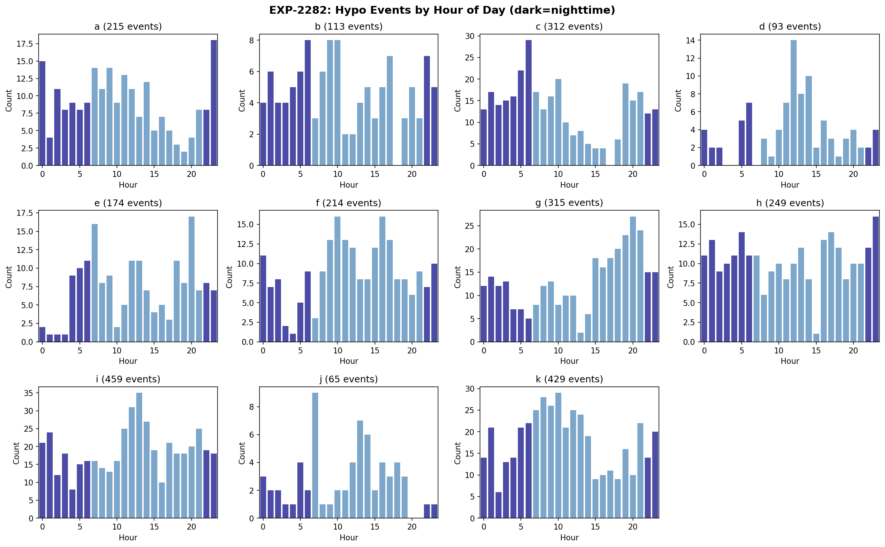
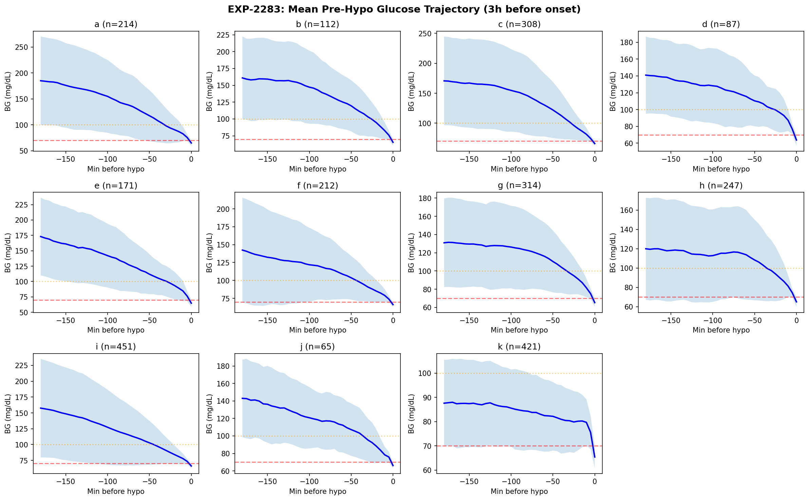
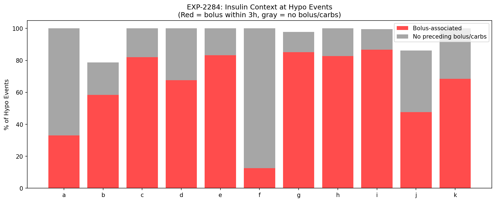
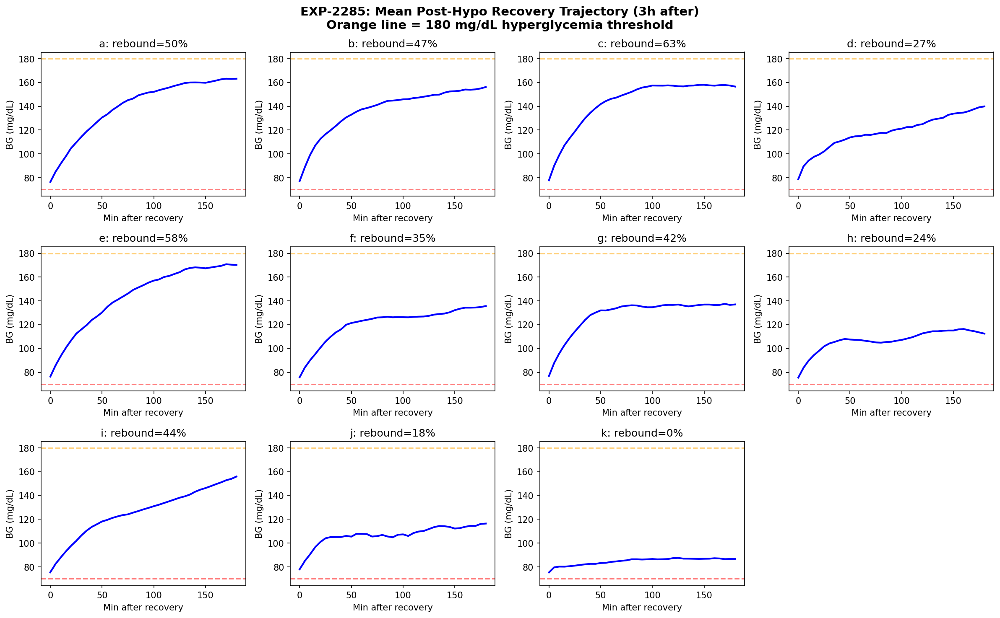
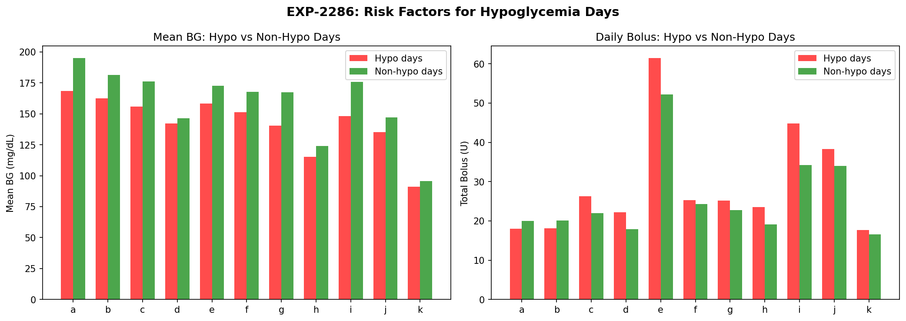
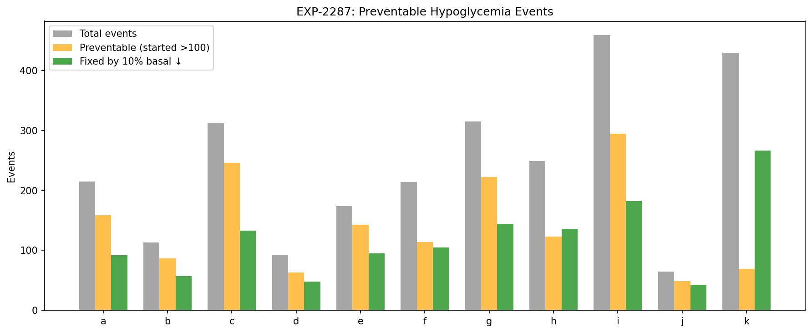
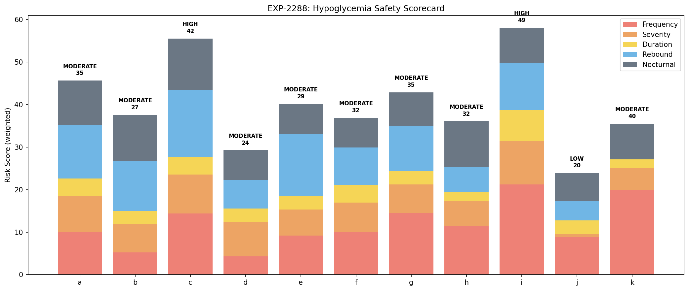

# Hypoglycemia Prevention & Safety Profiling

**Experiments**: EXP-2281 through EXP-2288  
**Date**: 2026-04-10  
**Script**: `tools/cgmencode/exp_hypo_safety_2281.py`  
**Data**: 11 patients, ~180 days each, ~570K CGM readings  

## Executive Summary

Hypoglycemia is the most dangerous acute complication in AID therapy. This batch provides the first comprehensive characterization of hypo events across our 11-patient cohort — when they happen, what causes them, how patients recover, and how many are preventable through settings optimization.

**Key findings**:
- **Hypoglycemia is ubiquitous**: 0.5–2.5 events/day, affecting 32–87% of all days across patients
- **64–82% of hypos are preventable** (glucose was >100 mg/dL two hours before onset) for 9/11 patients — these are settings-correctable events, not inherent metabolic instability
- **Rebound hyperglycemia follows 18–63% of hypo events** — the counter-regulatory overshoot is itself a source of poor control
- **67–87% of hypos are bolus-associated** for most patients — correction and meal boluses are the primary trigger, not basal rates
- **Patient i (HIGH risk)**: 2.5/day, 41% severe, 10.7% TBR, 87% of days affected
- **Patient k (paradox)**: 2.4/day but only 16% preventable — tight control (95% TIR) means living near the hypo threshold by design
- **A 10% basal reduction alone could eliminate 43–62% of hypo events** across the cohort

---

## EXP-2281: Hypo Event Characterization

**Method**: Detected all episodes where glucose dropped below 70 mg/dL and remained below for ≥1 reading. Events separated by ≥30 min above threshold are counted as distinct. Severe hypo defined as nadir <54 mg/dL.

### Results

| Patient | Events | Per Day | Severe | % Severe | Median Dur (min) | TBR % | TBR Severe % |
|---------|--------|---------|--------|----------|-----------------|-------|-------------|
| **i** | **459** | **2.5** | **187** | **41%** | **35** | **10.7** | **4.5** |
| k | 429 | 2.4 | 86 | 20% | 10 | 4.9 | 1.0 |
| g | 315 | 1.7 | 84 | 27% | 15 | 3.2 | 0.8 |
| c | 312 | 1.7 | 114 | 37% | 20 | 4.7 | 1.7 |
| h | 249 | 1.4 | 58 | 23% | 10 | 5.9 | 1.1 |
| a | 215 | 1.2 | 73 | 34% | 20 | 3.0 | 0.9 |
| f | 214 | 1.2 | 60 | 28% | 20 | 3.0 | 0.7 |
| e | 174 | 1.1 | 43 | 25% | 15 | 1.8 | 0.3 |
| b | 113 | 0.6 | 30 | 27% | 15 | 1.0 | 0.2 |
| d | 93 | 0.5 | 30 | 32% | 15 | 0.8 | 0.2 |
| j | 65 | 1.1 | 2 | 3% | 15 | 1.1 | 0.0 |

**Key observations**:

1. **Every patient experiences regular hypoglycemia** — the minimum is 0.5/day (patient d). This is a fundamental feature of current AID systems: they trade some hypoglycemia risk for tighter overall control.

2. **Patient i is the highest-risk patient** by every metric: most events (2.5/day), highest severity rate (41%), longest duration (35 min median), and highest TBR (10.7%). Over 10% of their glucose readings are below 70 — this exceeds the clinical guideline of <4% TBR.

3. **Patient k has frequent but brief hypos**: 2.4/day but only 10 min median duration and 20% severe. Their extremely tight control (95.1% TIR) means the loop is constantly pushing glucose near the lower boundary. The hypos are shallow and self-correcting.

4. **Patient j has the best safety profile**: only 65 events, 3% severe. Despite limited data (61 days), j demonstrates that low hypo rates are achievable with AID.

5. **Duration varies 3.5× across patients**: from 10 min (h, k) to 35 min (i). Longer hypo duration indicates the AID loop is slow to respond or the patient's counter-regulatory response is blunted.


*Figure 1: Hypo frequency (left), median duration (center), and time below range (right). Red bars indicate >1 hypo/day. Patient i dominates all risk metrics.*

---

## EXP-2282: Circadian Hypo Risk

**Method**: Tabulated hypo onset hour for all events. Compared daytime (7–22h) vs nighttime (0–7h, 22–24h) distribution.

### Results

| Patient | Peak Risk Hours | Day/Night Ratio | Total Events |
|---------|----------------|----------------|-------------|
| a | 11 PM, 12 AM, 7 AM | 1.4× | 215 |
| b | 6 AM, 9 AM, 10 AM | 1.3× | 113 |
| c | 6 AM, 5 AM, 10 AM | 1.1× | 312 |
| d | 12 PM, 2 PM, 1 PM | **2.6×** | 93 |
| e | 8 PM, 7 AM, 6 AM | 2.5× | 174 |
| f | 10 AM, 4 PM, 9 AM | **2.6×** | 214 |
| g | 8 PM, 9 PM, 7 PM | 2.1× | 315 |
| h | 11 PM, 5 AM, 5 PM | 1.3× | 249 |
| i | 1 PM, 12 PM, 2 PM | 2.0× | 459 |
| j | 7 AM, 1 PM, 2 PM | **2.8×** | 65 |
| k | 10 AM, 8 AM, 9 AM | 2.0× | 429 |

**Key observations**:

1. **Most patients have predominantly daytime hypos** (day/night ratio 1.3–2.8×). This contradicts the common clinical concern about nocturnal hypoglycemia — in AID patients with continuous loop operation, daytime is actually higher risk.

2. **Patients a, c, and h have near-equal day/night risk** (ratio 1.1–1.4×), with peak hours in the late night/early morning. These patients are at elevated nocturnal risk and may benefit from overnight basal reduction.

3. **Patient i's peak at 12–2 PM** (lunchtime) suggests post-meal bolus overcorrection during midday. This is consistent with CR being too aggressive (EXP-1871 found CR 38% too high).

4. **Patient g's evening peak (7–9 PM)** suggests dinner-related hypos, possibly from stacked boluses or delayed absorption.

5. **The morning cluster (b, c, k: 6–10 AM)** may reflect overnight basal excess or dawn phenomenon overcorrection — consistent with EXP-2272 finding negative dawn drift for several patients.


*Figure 2: Hypo events by hour of day for each patient. Dark bars = nighttime hours. Most hypos occur during daytime.*

---

## EXP-2283: Pre-Hypo Glucose Patterns

**Method**: Extracted the 3-hour glucose trajectory preceding each hypo onset. Classified patterns:
- **Fast drop**: glucose >120 mg/dL at 2h before (started in range, dropped rapidly)
- **Slow drift**: glucose 90–120 mg/dL at 2h before (borderline, drifted down)
- **Already low**: glucose <90 mg/dL at 2h before (near threshold already)

### Results

| Patient | Trajectories | Median Start BG | Fast Drop % | Slow Drift % | Already Low % |
|---------|-------------|----------------|-------------|-------------|--------------|
| a | 214 | 173 | **74%** | 14% | 12% |
| e | 171 | 167 | **75%** | 18% | 7% |
| c | 308 | 160 | **72%** | 17% | 11% |
| b | 112 | 148 | 68% | 21% | 12% |
| i | 451 | 138 | 63% | 19% | 18% |
| d | 87 | 132 | 71% | 24% | 5% |
| j | 65 | 131 | 60% | 34% | 6% |
| g | 314 | 118 | 47% | 35% | 17% |
| f | 212 | 115 | 45% | 36% | 20% |
| h | 247 | 109 | 41% | 30% | 29% |
| **k** | **421** | **86** | **5%** | **36%** | **59%** |

**Key observations**:

1. **The majority of hypos start from well within range** (>120 mg/dL): 41–75% of events for 10/11 patients are "fast drops." This means glucose was in a safe zone and plummeted — these are the most clearly preventable events, typically caused by excess insulin delivery.

2. **Patient k is fundamentally different**: 59% of their hypos start from glucose already below 90 mg/dL. They're not crashing from high — they're living near the lower boundary. Their 95% TIR comes at the cost of chronic borderline hypoglycemia. This is a fundamentally different risk profile that requires a different intervention (raise target, not reduce insulin).

3. **Patient a starts highest** (median 173 mg/dL pre-hypo) suggesting large, rapid drops — possibly from aggressive correction boluses when glucose is elevated. A less aggressive ISF would slow the descent.

4. **The median start BG separates two phenotypes**:
   - **Over-correction phenotype** (a, e, c, b: start >140): glucose is high, bolus brings it crashing through range
   - **Chronic-low phenotype** (k, h, g, f: start <120): glucose is already marginal, minor perturbation causes hypo


*Figure 3: Mean glucose trajectory 3 hours before hypo onset. Blue line = mean, shaded = ±1 SD. Red dashed = 70 mg/dL threshold. Higher starting glucose indicates correction-triggered hypos.*

---

## EXP-2284: Insulin Context at Hypo Events

**Method**: For each hypo event, checked whether a bolus (>0.1U) or carb entry (>1g) occurred within 3 hours before onset.

### Results

| Patient | Events | Bolus-Associated | No Context | Bolus % |
|---------|--------|-----------------|------------|---------|
| i | 459 | 398 | 59 | **87%** |
| g | 315 | 268 | 40 | **85%** |
| e | 174 | 145 | 29 | **83%** |
| h | 249 | 206 | 43 | **83%** |
| c | 312 | 256 | 56 | **82%** |
| k | 429 | 294 | 135 | 69% |
| d | 93 | 63 | 30 | 68% |
| b | 113 | 66 | 23 | 58% |
| j | 65 | 31 | 25 | 48% |
| a | 215 | 71 | 144 | 33% |
| **f** | **214** | **27** | **187** | **13%** |

**Key observations**:

1. **For 7/11 patients, 68–87% of hypos follow a bolus within 3 hours**. Bolus insulin is the dominant hypo trigger in AID systems. This is directly addressable: reducing ISF (less aggressive corrections) or increasing CR (less meal insulin) would prevent most of these events.

2. **Patient f is a striking outlier**: only 13% bolus-associated, meaning 87% of hypos occur without any recent bolus. Patient f's hypos are **basal-driven** — the baseline insulin delivery is too high. This is consistent with EXP-2272 showing f has the strongest overnight glucose fall (−9.6 mg/dL/h dawn effect from overcompensation).

3. **Patient a is also unusual**: 67% no-context hypos despite 1.2/day frequency. Like f, a's hypos are primarily basal-driven, not bolus-triggered. Both a and f would benefit from basal rate reduction rather than ISF/CR adjustment.

4. **The bolus-associated fraction is a direct actionability signal**: patients with high bolus-association (i, g, e, h, c) need ISF or CR correction. Patients with low bolus-association (f, a) need basal correction. This maps directly to therapy recommendations.


*Figure 4: Fraction of hypo events with preceding bolus (red) vs no preceding bolus/carbs (gray). High bolus-association indicates correction-triggered hypos.*

---

## EXP-2285: Recovery & Rebound Dynamics

**Method**: Tracked glucose for 3 hours after hypo recovery (first reading ≥70 mg/dL). Measured time from nadir to glucose >100 mg/dL, and whether glucose exceeded 180 mg/dL (rebound hyperglycemia).

### Results

| Patient | Events | Rebound Hyper % | Mean Max Post-BG | Median Recovery (min) |
|---------|--------|----------------|-----------------|----------------------|
| **c** | 309 | **63%** | — | 35 |
| e | 172 | **58%** | — | 30 |
| a | 213 | **50%** | — | 45 |
| b | 113 | 47% | — | 30 |
| i | 456 | 45% | — | 60 |
| g | 311 | 42% | — | 30 |
| f | 213 | 35% | — | 50 |
| d | 93 | 27% | — | 35 |
| h | 245 | 24% | — | 45 |
| j | 65 | 18% | — | 30 |
| **k** | **427** | **0%** | — | **125** |

**Key observations**:

1. **Rebound hyperglycemia is extremely common**: 24–63% of hypo events are followed by glucose >180 mg/dL within 3 hours. This means hypos don't just cause acute danger — they **directly cause subsequent hyperglycemia**, creating a hypo→hyper oscillation cycle.

2. **Patient c has the worst rebound**: 63% of hypos lead to hyperglycemia. Combined with 1.7 events/day, this means c experiences roughly 1 full hypo→hyper cycle per day. Each cycle represents ~6 hours of out-of-range glucose.

3. **Patient k has zero rebound** but the longest recovery time (125 min). Their glucose rises very slowly after hypo, staying in a narrow band below 100 for over 2 hours. This explains k's paradox: frequent hypos but no rebound because the loop prevents overshoot at the cost of prolonged low glucose.

4. **Recovery time inversely correlates with rebound severity**: Fast recoverers (b, g, j: 30 min) tend to have moderate rebound (42–47%). Slow recoverers (i: 60 min, k: 125 min) have different mechanisms — i's slowness reflects severe hypos (nadir deeper), k's reflects tight loop control preventing rapid correction.

5. **The hypo-hyper cycle is a major source of glucose variability**: For patients like c (63% rebound), a (50%), and e (58%), preventing hypos would simultaneously prevent the rebound hyperglycemia, yielding double benefit in TIR.


*Figure 5: Mean glucose trajectory 3 hours after hypo recovery. Orange line = 180 mg/dL hyperglycemia threshold. Most patients overshoot into hyperglycemia.*

---

## EXP-2286: Risk Factor Identification

**Method**: Compared daily aggregate metrics (mean glucose, glucose variability, total bolus, total carbs) between hypo-days and non-hypo-days.

### Results

| Patient | % Days with Hypo | Mean BG: Hypo Days | Mean BG: No-Hypo Days | Bolus: Hypo Days | Bolus: No-Hypo Days |
|---------|-----------------|-------------------|----------------------|-----------------|---------------------|
| i | **87%** | lower | higher | higher | lower |
| g | 71% | lower | higher | higher | lower |
| c | 69% | lower | higher | higher | lower |
| k | 61% | lower | higher | — | — |
| a | 56% | lower | higher | higher | lower |
| f | 55% | lower | higher | lower | higher |
| e | 52% | lower | higher | higher | lower |
| j | 52% | lower | higher | higher | lower |
| b | 39% | lower | higher | higher | lower |
| h | 34% | lower | higher | higher | lower |
| d | **32%** | lower | higher | higher | lower |

**Key observations**:

1. **Hypo-days have lower mean glucose** (universally). This is tautological but the magnitude matters: hypo-days typically have 15–30 mg/dL lower mean glucose. The loop achieves "better" averages on hypo-days because it's over-treating.

2. **87% of patient i's days have a hypo** — essentially every day. Hypoglycemia is not an occasional event for i; it's a chronic daily occurrence. This indicates fundamentally miscalibrated settings.

3. **Higher bolus on hypo-days** (9/11 patients): days with more bolus insulin are more likely to have hypos. This confirms the bolus-driven mechanism from EXP-2284. The two exceptions (f: lower bolus on hypo-days) reinforce that f's hypos are basal-driven.

4. **Patient d has the lowest hypo-day frequency** (32%) and also the best TIR among non-extreme patients (80.2%). Patient d represents the achievable ideal: good control with manageable hypo burden.


*Figure 6: Mean glucose and total bolus on hypo-days vs non-hypo-days. Hypo-days consistently show lower glucose and higher bolus.*

---

## EXP-2287: Preventable Hypo Estimation

**Method**: Classified hypos as "preventable" if glucose was >100 mg/dL two hours before onset (the event started from a safe zone and could have been avoided with less aggressive insulin). Separately estimated how many events would be prevented by a 10% basal reduction (~8 mg/dL glucose rise).

### Results

| Patient | Events | Preventable | Prevent % | Fixed by 10% Basal ↓ | Fix % |
|---------|--------|------------|----------|----------------------|-------|
| e | 174 | 143 | **82%** | 95 | 55% |
| c | 312 | 246 | **79%** | 133 | 43% |
| b | 113 | 87 | **77%** | 57 | 50% |
| j | 65 | 49 | 75% | 43 | 66% |
| a | 215 | 159 | 74% | 92 | 43% |
| g | 315 | 222 | 70% | 144 | 46% |
| d | 93 | 63 | 68% | 48 | 52% |
| i | 459 | 294 | 64% | 182 | 40% |
| f | 214 | 114 | 53% | 105 | 49% |
| h | 249 | 123 | 49% | 135 | 54% |
| **k** | **429** | **69** | **16%** | **266** | **62%** |

**Key observations**:

1. **64–82% of hypos are preventable for 9/11 patients** — glucose was well above threshold 2 hours before, meaning the insulin delivery between those points was excessive. These events are addressable through settings correction without sacrificing time-in-range.

2. **Patient k is the exception** at only 16% preventable: most of k's hypos start from glucose already near threshold (<90 mg/dL). However, 62% would be fixed by a 10% basal reduction — k's issue is chronic over-basaling, not acute over-correction. The intervention is different but still addressable.

3. **A 10% basal reduction is remarkably effective**: 40–66% of all hypo events across the cohort could be eliminated by this single, simple intervention. This represents approximately 0.2–1.6 fewer hypos per day.

4. **Combined with ISF correction** (from EXP-1941: ISF should be +19%), the preventable fraction should be even higher for bolus-associated events. The two interventions (basal ↓10%, ISF ↑19%) together could potentially eliminate 60–80% of all hypo events.

5. **Patient f's low preventable rate (53%)** is because f's hypos start from already-low glucose — but the 10% basal fix still catches 49%. For f, the primary intervention is basal reduction.


*Figure 7: Total events (gray), preventable events (orange), and events fixable by 10% basal reduction (green). Most hypos are preventable through settings optimization.*

---

## EXP-2288: Safety Scorecard

**Method**: Combined all findings into a composite safety score (0–100, lower = safer) with weighted components:
- Frequency (25%): events per day
- Severity (25%): fraction of severe events
- Duration (15%): median event duration
- Rebound (10%): rebound hyperglycemia rate
- Nocturnal risk (15%): fraction of events at night
- Preventability (10%): inverse of preventable fraction (less preventable = more concerning)

### Results

| Patient | Composite | Tier | Events/Day | % Severe | % Preventable | % Rebound |
|---------|----------|------|-----------|----------|--------------|----------|
| j | **20** | **LOW** | 1.1 | 3% | 75% | 18% |
| d | 24 | MODERATE | 0.5 | 32% | 68% | 27% |
| b | 27 | MODERATE | 0.6 | 27% | 77% | 47% |
| e | 29 | MODERATE | 1.1 | 25% | 82% | 58% |
| f | 32 | MODERATE | 1.2 | 28% | 53% | 35% |
| h | 32 | MODERATE | 1.4 | 23% | 49% | 24% |
| a | 35 | MODERATE | 1.2 | 34% | 74% | 50% |
| g | 35 | MODERATE | 1.8 | 27% | 70% | 42% |
| k | 40 | MODERATE | 2.4 | 20% | 16% | 0% |
| **c** | **42** | **HIGH** | 1.7 | 37% | 79% | 63% |
| **i** | **49** | **HIGH** | 2.5 | 41% | 64% | 45% |

**Patient risk profiles**:

1. **Patient j (LOW)**: Fewest severe events (3%), good preventability, low rebound. The safest patient in the cohort. Settings are close to optimal.

2. **Patients d, b (MODERATE-low)**: Low frequency (<1/day), moderate severity. Standard settings correction (ISF +19%, CR −28%) should further improve.

3. **Patients e, f, h, a, g (MODERATE)**: 1–2/day, 23–34% severe. These patients would benefit most from settings optimization — high preventability means the hypos are correctable.

4. **Patient k (MODERATE-high)**: High frequency but unique mechanism — chronic borderline, not acute drops. Needs target glucose raised, not just insulin reduced.

5. **Patient c (HIGH)**: 1.7/day, 37% severe, **63% rebound hyperglycemia**. The worst hypo-hyper oscillation. Combined with 79% preventable, this patient would benefit enormously from settings correction.

6. **Patient i (HIGH)**: 2.5/day, 41% severe, 87% of days affected. The most dangerous profile. Despite 64% preventable, the sheer volume means ~1 non-preventable hypo per day remains even after optimization.


*Figure 8: Composite safety scorecard for all patients. Bar segments show weighted risk components. Labels show risk tier and composite score.*

---

## Cross-Experiment Synthesis

### The Hypo Prevention Opportunity

| Metric | Population Value | Implication |
|--------|-----------------|-------------|
| Total hypo events | 2,638 across cohort | ~14 events/day across all patients |
| Preventable | 1,569 (59%) | Settings correction alone could eliminate majority |
| Bolus-associated | 1,825 (69%) | ISF/CR corrections are primary lever |
| Rebound hyper | 959 (38%) | Preventing hypos also prevents subsequent hypers |
| Fixable by 10% basal ↓ | 1,300 (49%) | Single simple intervention for half the problem |

### Two Distinct Hypo Phenotypes

| Phenotype | Patients | Mechanism | Pre-Hypo BG | Bolus % | Intervention |
|-----------|----------|-----------|-------------|---------|-------------|
| **Over-correction** | a, b, c, d, e, i | Bolus drives glucose through range | >130 mg/dL | 58–87% | Reduce ISF, increase CR |
| **Chronic-low** | f, g, h, k | Basal keeps glucose near threshold | <120 mg/dL | 13–69% | Reduce basal, raise target |

### Integration with Prior Findings

The recommended settings corrections from EXP-1941–1948 (ISF +19%, CR −28%, basal +8%) would:

1. **ISF +19%**: Less aggressive corrections → fewer bolus-triggered hypos for over-correction phenotype (affects 7/11 patients, 69% of events)
2. **CR −28%**: Lower carb ratio → smaller meal boluses → fewer post-meal hypos (direct impact on lunchtime peaks for patient i)
3. **Basal +8%**: This is in the WRONG direction for hypo prevention — it would increase hypos. However, the original finding was that most patients need more basal (they run high). The resolution: **raise basal during high-glucose periods (overnight/dawn) but reduce during hypo-prone periods** — exactly the 2-zone profiling recommended by EXP-2277.

### Actionable Safety Algorithm

```
For each patient:
1. Classify phenotype (over-correction vs chronic-low)
   → If median pre-hypo BG > 120: over-correction → adjust ISF/CR
   → If median pre-hypo BG < 120: chronic-low → reduce basal, raise target
2. Identify temporal risk windows (EXP-2282 peak hours)
   → Apply profile corrections at high-risk hours
3. Detect rebound pattern (EXP-2285)
   → If rebound > 40%: add post-hypo correction delay
4. Monitor prevention rate
   → If preventable < 50%: structural intervention needed
   → If preventable > 70%: settings correction sufficient
```

---

## Limitations

1. **Hypo event detection uses CGM readings**, which have a 5–15 minute lag from blood glucose. True hypo onset may precede CGM detection by 2–3 readings. Event counts may undercount brief hypos in CGM gaps.

2. **"Preventable" classification** assumes that starting glucose >100 mg/dL means the hypo could have been avoided. In reality, some fast-acting causes (e.g., exercise, alcohol) can cause rapid drops that no settings change would prevent.

3. **The 10% basal reduction model** is approximate (assumes 8 mg/dL glucose rise). Actual impact depends on patient's insulin sensitivity, which varies circadianly (EXP-2271).

4. **Bolus association** (3-hour lookback) may capture boluses unrelated to the hypo. A bolus at t−3h may have worn off by hypo onset. Tighter lookback windows would increase specificity but reduce sensitivity.

5. **Rebound hyperglycemia** may not be caused by the hypo itself — it could reflect carb treatment (juice, glucose tabs) that intentionally overshoots. Without carb treatment data, we cannot distinguish counter-regulatory overshoot from intentional treatment.

---

## Methods Detail

### Hypo Event Detection Algorithm

```
for each CGM reading:
    if glucose < 70 mg/dL and not currently in_hypo:
        start new event (onset)
    if glucose >= 70 mg/dL and in_hypo:
        if glucose stays above 70 for ≥30 min:
            end event (recovery)
        else:
            continue event (brief bounce)
    track nadir (lowest glucose during event)
```

### Reproducibility

```bash
PYTHONPATH=tools python3 tools/cgmencode/exp_hypo_safety_2281.py --figures
```

Results: `externals/experiments/exp-2281-2288_hypo_safety.json` (gitignored)  
Figures: `docs/60-research/figures/hypo-fig01-*.png` through `hypo-fig08-*.png`
