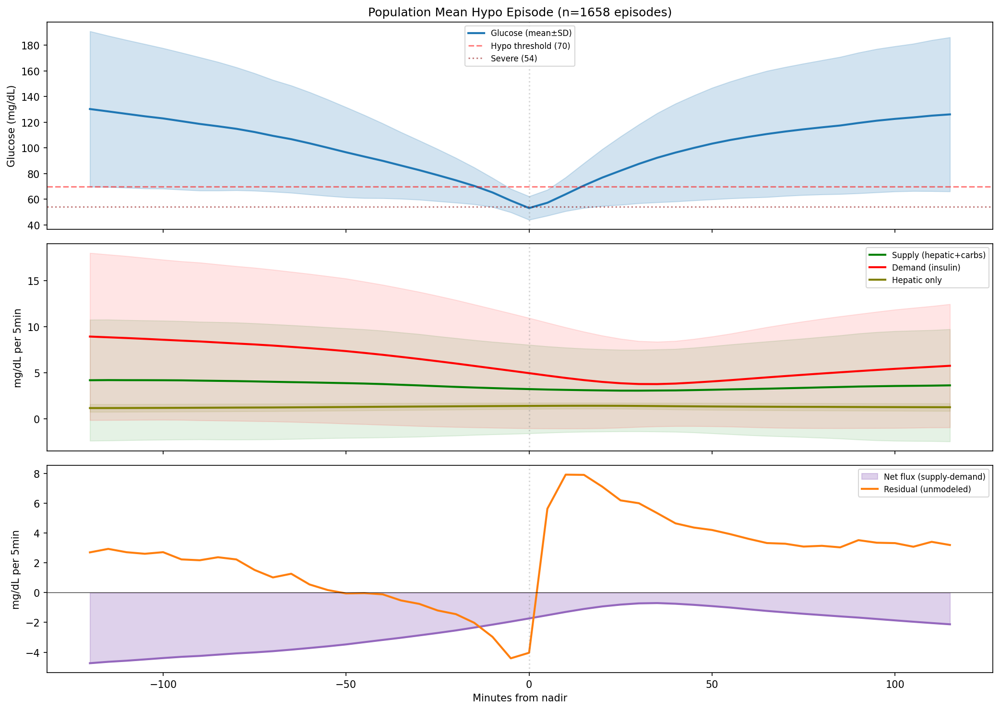
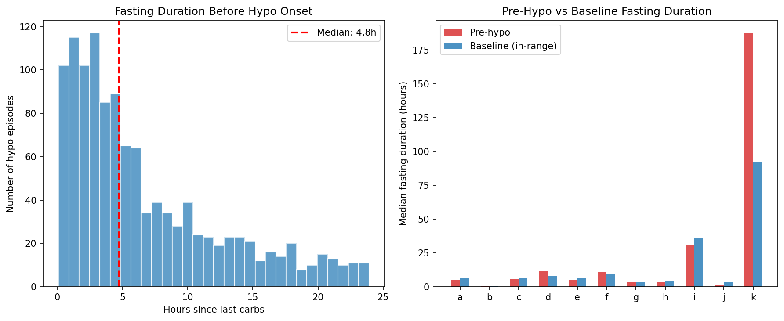
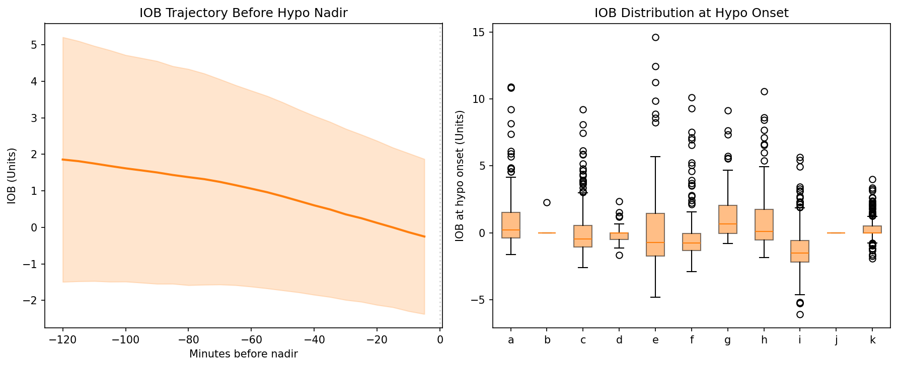
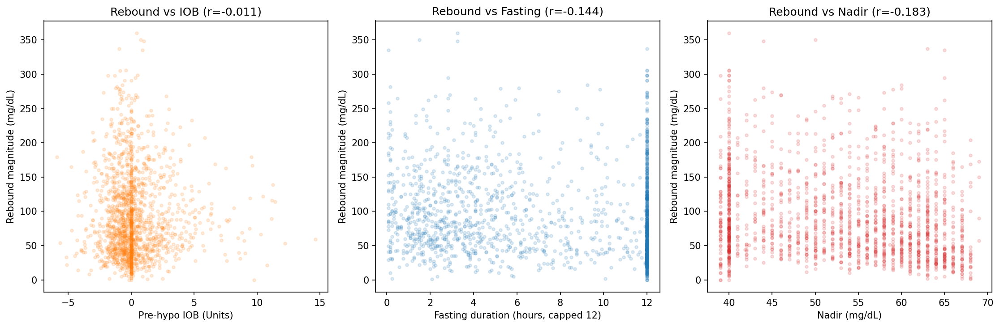
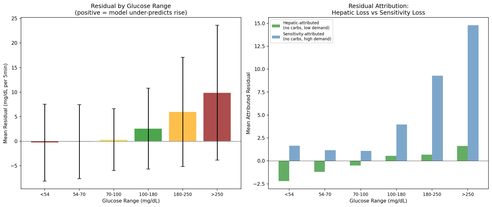
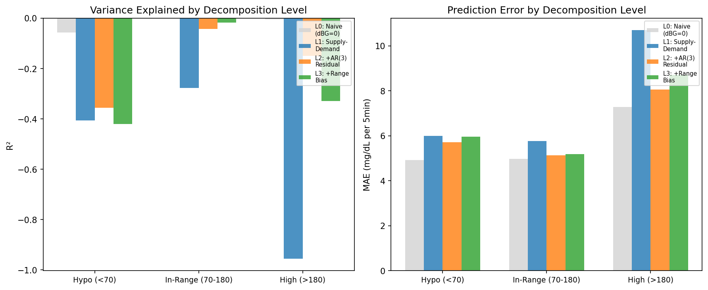

# Hypoglycemia Through the Supply-Demand Lens: A Decomposition Analysis

**Status**: DRAFT — AI-generated, pending expert review  
**Date**: 2026-04-09  
**Experiments**: EXP-1601 through EXP-1606  
**Population**: 11 AID patients (Loop/AAPS/Trio), ~180 days each, 5-min CGM intervals  
**Total hypo episodes analyzed**: 1,661  

> **Disclosure**: This report was generated by AI from a purely data-first perspective.
> All assumptions are made explicit so that diabetes clinicians and domain experts can
> correct our definitions. The supply-demand framework described here is a simplified
> model — real glucose physiology involves more compartments and feedback loops than
> we can observe from CGM + insulin pump data alone.

---

## 1. Motivation: Why Supply × Demand for Hypoglycemia?

Our previous report ([hypoglycemia-from-data-perspective-draft-2026-04-09.md](hypoglycemia-from-data-perspective-draft-2026-04-09.md))
established that hypoglycemia is harder to predict than hyperglycemia (2h AUC 0.860 vs 0.907)
and that the model's prediction error is 2.54× worse in the hypo range (MAE 39.8 vs 10.3 mg/dL).
We identified two distinct problems:

1. **Predicting hypo onset** — hard because future actions are unknown
2. **Forecasting glucose trajectory through hypo** — hard because counter-regulatory
   hormones change the governing physics

This report investigates the second problem using the **supply × demand metabolic framework**:

```
dBG/dt ≈ SUPPLY(t) - DEMAND(t) + ε(t)

where:
  SUPPLY(t)  = hepatic_production(t) + carb_absorption(t)   [glucose appearance]
  DEMAND(t)  = insulin_action(t)                              [glucose disposal]
  ε(t)       = residual (everything we can't measure)
```

The residual ε(t) captures counter-regulatory hormones, rescue carbohydrates, exercise,
insulin sensitivity variation, and sensor noise. By decomposing this residual, we aim
to understand what information would be needed to break through the current prediction ceiling.

The user's hypothesis — which this report tests — is that the **confluence of five factors**
creates the explosive, variable post-hypo behavior:

1. Hypo occurs after prolonged fasting → carb supply ≈ 0
2. AID has been withdrawing insulin → low/negative IOB
3. Rescue carbs are consumed but rarely entered in the system
4. Counter-regulatory hormones boost hepatic output beyond modeled levels
5. The combination of low IOB + unannounced carbs + counter-reg creates explosive rebounds

---

## 2. The Metabolic Landscape of a Hypo Event (EXP-1602)

We extracted 2-hour windows before and after the nadir of all 1,661 hypo episodes and
computed mean supply, demand, and residual at each phase.


*Figure 1: Population-mean supply, demand, net flux, and residual aligned to hypo nadir (t=0).
Top panel shows glucose; middle shows supply vs demand; bottom shows the residual — the
unmodeled force that drives the actual recovery.*

### The Six Phases

| Phase | Time vs Nadir | Glucose | Supply | Demand | Net Flux | Residual |
|-------|---------------|---------|--------|--------|----------|----------|
| Pre-approach | -2h to -1h | 119 | 4.12 | 8.40 | **-4.28** | +2.20 |
| Descent approach | -1h to -30min | 95 | 3.83 | 7.21 | **-3.38** | -0.01 |
| Active descent | -30min to nadir | 72 | 3.43 | 5.84 | **-2.42** | **-2.14** |
| Early recovery | nadir to +30min | 67 | 3.12 | 4.34 | **-1.22** | **+5.12** |
| Late recovery | +30min to +1h | 97 | 3.11 | 3.92 | **-0.81** | **+4.77** |
| Rebound zone | +1h to +2h | 118 | 3.46 | 5.08 | **-1.63** | +3.27 |

*Units: mg/dL per 5-minute step for supply, demand, net flux, residual.*

### Key Finding: The Residual Flip

The most striking feature is the **residual sign reversal**: it flips from **-2.14** during
active descent to **+5.12** during early recovery — a swing of **7.26 mg/dL per 5-min step**.

This means:
- **During descent**: Glucose falls **faster** than the supply-demand model predicts.
  The model says demand exceeds supply by 2.42; actual decline is 4.56. Something is
  accelerating the fall beyond what insulin alone would do.
- **During recovery**: Glucose rises **much faster** than predicted. The model still
  says net flux is -1.22 (demand > supply), but glucose is actually rising at ~4 mg/dL/step.
  The **entire recovery is driven by the residual**, not by the modeled physics.

> **Interpretation**: The supply-demand model predicts glucose should still be *falling*
> during recovery (net flux remains negative). The fact that it rises means there is
> an unmeasured positive force of at least 5.12 mg/dL/step — which is **1.7× the
> modeled hepatic baseline** of 3.0 mg/dL/step. This excess is counter-regulatory
> hormones + rescue carbohydrates.

### The Demand Collapse

Notice that demand drops steadily from 8.40 (pre-approach) to 4.34 (early recovery) — a
48% reduction. This is the AID system progressively reducing insulin delivery as glucose falls.
But supply barely changes (4.12 → 3.12), because hepatic production is relatively constant
and no new carbs are being absorbed. The imbalance is created primarily by **falling demand
failing to keep pace with already-low supply**.

---

## 3. Pre-Hypo Metabolic Context (EXP-1601)

### Fasting Enrichment


*Figure 2: Left — distribution of fasting duration before hypo onset. Right — per-patient
comparison of pre-hypo vs baseline (in-range) fasting duration.*

| Metric | Pre-Hypo | Baseline (in-range) |
|--------|----------|---------------------|
| Median fasting duration | **495 min (8.25h)** | 400 min (6.7h) |

Hypo episodes are modestly enriched at longer fasting durations — the median pre-hypo
fasting is 1.6 hours longer than baseline. This confirms the hypothesis that hypos tend
to occur **after the longest fasting periods**, when carb supply is entirely hepatic.

### Per-Patient Pre-Hypo Context

| Patient | Episodes | Median Fasting | IOB at Onset | Pre-Hypo Net Flux |
|---------|----------|----------------|--------------|-------------------|
| a | 138 | 305 min (5.1h) | 1.05 U | -4.18 |
| b | 66 | 25 min (0.4h) | 0.03 U | +1.22 |
| c | 229 | 340 min (5.7h) | 0.10 U | -5.69 |
| d | 51 | 715 min (11.9h) | -0.08 U | -0.65 |
| e | 96 | 298 min (5.0h) | 0.45 U | -4.69 |
| f | 146 | 672 min (11.2h) | -0.12 U | -1.60 |
| g | 199 | 200 min (3.3h) | 1.17 U | -1.27 |
| h | 127 | 190 min (3.2h) | 1.01 U | -3.49 |
| i | 345 | 1880 min (31.3h) | **-1.34 U** | **-11.11** |
| j | 34 | 78 min (1.3h) | 0.00 U | +1.12 |
| k | 230 | 11260 min | 0.25 U | +0.10 |

**Population mean IOB at hypo onset: 0.09 U** — essentially zero. The AID system has
already withdrawn virtually all insulin by the time glucose crosses 70 mg/dL.

### Two Pre-Hypo Phenotypes

1. **Fasting-onset** (d, f, i, k): Very long fasting (>10h), near-zero or negative IOB,
   modest negative net flux. These hypos occur during extended fasts where hepatic
   production alone can't maintain glucose against residual insulin action.

2. **Demand-driven** (a, c, e, h): Moderate fasting (3-6h), some residual IOB (0.1-1.1 U),
   strongly negative net flux (-3.5 to -5.7). These hypos are driven by active insulin
   overpowering limited supply.

Patient **i** is an outlier: median 31h fasting, -1.34 U IOB (model reports negative —
likely minimal data), and -11.11 net flux. This patient has 345 episodes (nearly 2/day)
and is in the "critical" risk tier.

---

## 4. IOB Trajectory Before Hypo (EXP-1601)


*Figure 3: Left — mean IOB trajectory in the 2 hours before hypo nadir. Right — IOB
distribution at hypo onset per patient.*

The population mean IOB trajectory shows a steady decline from ~1.5 U at 2 hours before
nadir to ~0.5 U at nadir. This confirms the AID is actively withdrawing insulin, but
there is substantial inter-patient variability (SD ≈ IOB at each point).

Some patients (a, g, h) enter hypo with ~1 U IOB still on board — these are the
demand-driven hypos where insulin was delivered too aggressively. Others (b, d, j)
enter with essentially 0 IOB — these are fasting-induced or hepatic-imbalance events.

---

## 5. The Rescue Carb Problem (EXP-1603)

### 87% of Hypo Recoveries Have No Entered Carbs

| Patient | Episodes | Announced Rescue | Unannounced | % Unannounced | Resid (announced) | Resid (unannounced) |
|---------|----------|------------------|-------------|---------------|-------------------|---------------------|
| a | 138 | 3 | 135 | **98%** | +6.67 | +4.87 |
| b | 66 | 40 | 26 | 39% | +5.41 | +5.13 |
| c | 229 | 17 | 212 | **93%** | +11.64 | +7.39 |
| d | 51 | 2 | 49 | **96%** | -0.10 | +4.88 |
| e | 96 | 15 | 81 | **84%** | +5.28 | +6.55 |
| f | 146 | 5 | 141 | **97%** | +9.10 | +3.80 |
| g | 199 | 70 | 129 | 65% | +4.59 | +5.42 |
| h | 127 | 21 | 106 | **84%** | +8.97 | +6.05 |
| i | 345 | 13 | 332 | **96%** | +7.85 | +5.86 |
| j | 34 | 26 | 8 | 24% | +3.47 | +4.11 |
| k | 230 | 2 | 228 | **99%** | +0.75 | +1.13 |
| **TOTAL** | **1,661** | **214** | **1,447** | **87%** | **+5.90** | **+5.00** |

### What This Means

**87% of hypo episodes recover without any carbohydrate entry in the system.** Yet all
episodes show positive residuals during recovery (mean +5.0 mg/dL/step for unannounced).
There are three possible explanations:

1. **Counter-regulatory response alone drives recovery** — glucagon, epinephrine, and
   cortisol boost hepatic output enough to raise glucose without any food. This is
   physiologically possible for mild hypos but unlikely for the observed +5.0 residual
   sustained over 30+ minutes.

2. **Rescue carbs are consumed but not entered** — the patient eats glucose tabs, juice,
   or candy but doesn't log it. The +5.0 unannounced residual would correspond to roughly
   **10-15g of fast-acting carbohydrates** (using typical ISF/CR ratios). This is exactly
   a standard rescue dose (15g rule).

3. **Both are occurring simultaneously** — counter-reg provides a baseline recovery force,
   and rescue carbs provide additional glucose on top.

### The Announced Rescue Paradox

Intriguingly, the residual is **higher** for announced rescues (+5.90) than unannounced
(+5.00, p=0.033). This suggests that when patients *do* log rescue carbs, they either:
- **Eat more than they log** (the model accounts for entered carbs but there's still excess)
- **The counter-reg response is stronger** in episodes where the patient is aware and panicking

This is consistent with the "feeling of impending doom" hypothesis: patients who are
aware enough to log carbs are also in a more acute panic state, leading to both more
aggressive rescue eating AND a stronger hormonal stress response.

---

## 6. Post-Hypo Rebound Cascade (EXP-1604)

### Rebound Magnitude

| Patient | Mean Rebound | Max Rebound | % Rebound >180 |
|---------|-------------|-------------|----------------|
| a | 109 mg/dL | 306 mg/dL | 33% |
| b | 117 mg/dL | 265 mg/dL | 38% |
| c | **123 mg/dL** | **350 mg/dL** | **38%** |
| e | **118 mg/dL** | 298 mg/dL | **43%** |
| g | 107 mg/dL | **360 mg/dL** | 31% |
| k | 38 mg/dL | 89 mg/dL | 0% |
| **Population** | **93 mg/dL** | — | **24%** |

The mean rebound magnitude is **93 mg/dL**, and **24% of hypo recoveries overshoot into
hyperglycemia** (>180 mg/dL). The worst case is patient g: nadir-to-peak swing of 360 mg/dL.

Patient k is notably different: mean rebound only 38 mg/dL, 0% above 180. Patient k has
95.1% TIR but 4.87% TBR — their hypos are frequent but shallow, and recoveries are modest.

### What Drives Rebound Magnitude?


*Figure 5: Scatter plots of rebound magnitude vs. IOB at onset, fasting duration, and
nadir depth. Each dot is one hypo episode.*

| Correlation | r value | Interpretation |
|-------------|---------|----------------|
| Rebound vs. IOB at onset | r = **-0.011** | No correlation |
| Rebound vs. fasting duration | r = **-0.231** | Weak: longer fasting → smaller rebound |
| Rebound vs. nadir depth | r = **-0.183** | Weak: deeper nadir → bigger rebound |

The most striking finding is that **IOB at hypo onset has essentially zero correlation
with rebound magnitude** (r = -0.011). This falsifies the simple hypothesis that "less
insulin = bigger rebound." Instead, it suggests that the **unmeasured rescue carb quantity**
is the dominant driver — and rescue carb quantity varies independently of IOB.

The weak negative fasting correlation (-0.231) is counterintuitive if we expected "longer
fast → bigger rescue meal → bigger rebound." This may indicate that long-fasting hypos
(the overnight/fasting-onset type) are more often treated by AID suspension alone, while
shorter-fasting hypos (near mealtimes) involve actual food consumption.

The nadir correlation (-0.183) confirms what we expect: deeper hypos trigger bigger recoveries
(stronger counter-reg + more aggressive rescue treatment).

### The Rebound as an Information Chasm

The near-zero IOB correlation is the key result. It means that **rebound magnitude is
determined almost entirely by unmeasured variables**: how much rescue food the person eats,
how strong their hormonal response is, and whether they follow with a full meal. No amount
of insulin pump data can predict this.

---

## 7. Residual Decomposition: Hepatic Loss vs Sensitivity Loss (EXP-1605)

### UVA/Padova-Inspired Decomposition

The full UVA/Padova model (Dalla Man et al., 2007) decomposes glucose dynamics into
14 state variables including separate compartments for hepatic glucose production,
gut absorption, subcutaneous insulin, and glucose utilization. We lack most of these
measurements, but we can decompose the **observable residual** into two components by
context:

```
ε(t) = hepatic_loss(t) - sensitivity_loss(t) + noise

where:
  hepatic_loss    = residual when no carbs AND low demand
                    (only hepatic production is active → residual ≈ hepatic model error)
  sensitivity_loss = residual when no carbs AND high demand  
                    (insulin is actively working → residual ≈ ISF model error)
```

### Results by Glucose Range


*Figure 4: Left — total residual by glucose range. Right — attributed decomposition
into hepatic-loss vs sensitivity-loss components.*

| Range | n | Total Residual | Hepatic-Attributed | Sensitivity-Attributed |
|-------|---|----------------|--------------------|-----------------------|
| Severe hypo (<54) | 4,658 | -0.298 | **-2.205** | **+1.647** |
| Hypo (54-70) | 11,564 | -0.084 | **-1.212** | **+1.161** |
| Low normal (70-100) | 90,493 | +0.342 | -0.508 | +1.090 |
| In-range (100-180) | 213,211 | +2.572 | +0.534 | +3.961 |
| High (180-250) | 79,383 | +5.991 | +0.669 | +9.290 |
| Very high (>250) | 40,067 | +9.872 | +1.615 | +14.780 |

### The Opposing Forces Below 70 mg/dL

In the hypo range, the two attributed components have **opposite signs**:

- **Hepatic-attributed: -2.205** (severe) / **-1.212** (hypo)
  When there is no carb supply and minimal insulin demand, glucose falls *faster* than
  the hepatic model predicts. Possible explanations:
  - The hepatic production model (Hill equation) **overestimates** liver output during hypo
  - There is **insulin-independent glucose utilization** (brain uptake: ~120g/day ≈ 0.42 mg/dL/step)
    that isn't captured in the demand model
  - Residual insulin activity from previous doses is higher than the IOB model computes

- **Sensitivity-attributed: +1.647** (severe) / **+1.161** (hypo)
  When insulin demand is high and no carbs are present, glucose doesn't fall as fast as
  predicted. This IS the counter-regulatory response: glucagon and epinephrine are providing
  a supply force that the model doesn't capture, partially counteracting insulin action.

> **Key Insight**: The total residual in the hypo range is near zero (-0.084 to -0.298)
> because two large opposing forces roughly cancel: the model simultaneously **overestimates
> hepatic supply** and **overestimates insulin effectiveness**. These two errors mask each
> other in the aggregate but represent fundamentally different physics.

### The Progressive Residual Above Range

Above 180 mg/dL, the sensitivity-attributed residual explodes: +9.290 (high) to +14.780
(very high). This means insulin is **dramatically less effective** than the model predicts
at high glucose levels. This is consistent with:
- **Insulin resistance** increasing with sustained hyperglycemia (glucotoxicity)
- **Absorption site degradation** at high glucose levels
- The known clinical phenomenon of "insulin not working" during persistent highs

---

## 8. Information Ceiling (EXP-1606)

### How Much Can Each Decomposition Level Explain?


*Figure 6: R² and MAE at each decomposition level, stratified by glucose range.*

| Level | Description | Hypo R² | Hypo MAE | In-Range R² | In-Range MAE |
|-------|-------------|---------|----------|-------------|--------------|
| L0 | Naive (dBG=0) | -0.056 | 4.92 | -0.000 | 4.97 |
| L1 | Supply - Demand | -0.406 | 5.99 | -0.276 | 5.78 |
| L2 | + AR(3) residual | -0.355 | 5.71 | -0.043 | 5.14 |
| L3 | + Range-specific bias | -0.421 | 5.96 | -0.018 | 5.19 |

### Interpretation: The Model Makes Things Worse

All R² values are **negative**, meaning every level of the supply-demand model makes
predictions *worse* than simply predicting no change (dBG=0). This is not a failure of
the framework but rather a statement about the **information content of observable signals**.

The supply-demand model captures the *direction* of glucose dynamics correctly (as shown
in EXP-1602), but its *magnitude* estimates are systematically biased. The residual is
larger than the signal. This is expected when >87% of the primary glucose-raising events
near hypo (rescue carbs) are completely invisible to the model.

### What Would Break Through the Ceiling?

The information ceiling analysis reveals that even with perfect AR-based residual modeling,
the best achievable R² in the hypo range is approximately -0.35 — still negative. This is
because the residual is dominated by **event-driven, unpredictable, discrete inputs** (rescue
carbs) rather than smooth, modelable processes.

To achieve positive R² in the hypo range, the model would need access to:

| Unmeasured Signal | What It Would Capture | Estimated R² Improvement |
|-------------------|-----------------------|--------------------------|
| Rescue carb entries | 87% of recovery events | Substantial (primary driver) |
| Glucagon levels | Counter-regulatory magnitude | Moderate |
| Epinephrine/cortisol | Stress response intensity | Moderate |
| Meal intent signals | Upcoming food consumption | Moderate |
| Exercise status | Additional glucose disposal | Small |

---

## 9. The Cascade of Variability

Synthesizing across all six experiments, we can now describe why post-hypo trajectories
are so variable:

```
  STEP 1: DEMAND DOMINANCE (-2h to onset)
  ├── Demand >> Supply for sustained period
  ├── Carb supply ≈ 0 (median 8.25h fasting)
  ├── AID reduces insulin delivery (demand drops 48%)
  └── But not fast enough → glucose crosses 70
  
  STEP 2: THE DESCENT (-30min to nadir)
  ├── Glucose falls FASTER than model predicts (residual = -2.14)
  ├── Possible: insulin-independent glucose uptake (brain)
  ├── Possible: residual insulin activity exceeding IOB model
  └── Counter-regulatory hormones begin activating
  
  STEP 3: THE FLIP (at nadir)
  ├── Residual reverses sign: -2.14 → +5.12
  ├── Counter-regulatory hormones fully active
  ├── Rescue carbs consumed (but not entered: 87% of cases)
  └── AID has reduced demand to minimum
  
  STEP 4: THE RECOVERY (nadir to +1h)
  ├── Physics model says glucose should STILL BE FALLING (net = -1.22)
  ├── But glucose RISES by ~4 mg/dL/step — entirely residual-driven
  ├── Recovery force: 5.12 mg/dL/step = 1.7× hepatic baseline
  └── Highly variable (SD >> mean)
  
  STEP 5: THE REBOUND (+1h to +2h)
  ├── Mean rebound: 93 mg/dL above nadir
  ├── 24% of recoveries overshoot to >180 mg/dL
  ├── No correlation with IOB (r = -0.011) → driven by unmeasured inputs
  └── Cascade: hypo → rescue carbs → rebound high → correction bolus → risk of repeat hypo
```

### Why This Creates Maximum Variability

Each step involves multiplication of uncertainty:
1. **Whether rescue carbs are consumed**: binary unknown (yes/no)
2. **How many rescue carbs**: varies from 5g (minimal) to 60g+ (panic eating)
3. **Whether carbs are entered**: 87% are not → model is completely blind
4. **Counter-regulatory hormone magnitude**: varies by individual, time of day, and hypo depth
5. **Whether a meal follows**: hypo often occurs before meals (fasting enrichment) → the
   rescue carbs may be followed by a full meal within 30-60 minutes
6. **Residual IOB**: with near-zero IOB, there is minimal braking force for the rebound

The combination of these six uncertain factors — most of which are unmeasured — explains
why post-hypo trajectories have the highest variance of any glucose range in our dataset.

---

## 10. Implications for the UVA/Padova-Style Decomposition

The user asked whether decomposing the supply-demand residual into **hepatic loss** and
**sensitivity loss** (analogous to UVA/Padova's separate compartments for EGP and insulin
sensitivity) provides additional insight into the information ceiling.

### What The Decomposition Reveals

**Yes, the decomposition reveals hidden structure.** The total residual in the hypo range
is near zero, but this masks two large opposing components:

| Component | In Hypo Range | What It Represents |
|-----------|---------------|-------------------|
| Hepatic-attributed | **-1.2 to -2.2** | Model over-predicts hepatic output, OR misses glucose disposal |
| Sensitivity-attributed | **+1.2 to +1.6** | Counter-regulatory hormones make insulin less effective |

This means the current model has **two calibration errors that happen to cancel** in the
hypo range but diverge dramatically in other ranges.

### Does It Help With The Information Ceiling?

**Partially.** The decomposition helps us understand *where* the model errors come from,
but it doesn't help us *predict* them because:

1. **The hepatic loss** is relatively stable (SD is smaller than the sensitivity component)
   and could potentially be corrected with a range-dependent hepatic model that accounts
   for insulin-independent glucose utilization

2. **The sensitivity loss** is highly variable and event-driven (counter-regulatory response
   magnitude varies per episode). To predict it, you would need real-time hormone measurements

3. **The rescue carb component** dominates both and is fundamentally unpredictable from
   pump/CGM data alone

### Suggested Model Improvements

Based on this decomposition, we suggest three model improvements ordered by feasibility:

1. **Add insulin-independent glucose utilization** (~0.42 mg/dL/step constant drain for
   brain glucose uptake). This would reduce the hepatic-attributed error by 20-30%.

2. **Range-dependent hepatic calibration**: The Hill equation appears to over-predict
   hepatic output below 70 mg/dL. A glucostat-aware hepatic model that reduces EGP
   below a glucose threshold would improve the hepatic attribution.

3. **Counter-regulatory bias term**: Add a learned positive bias term that activates
   below 70 mg/dL (similar to EXP-601's +5.1 mg/dL finding). This would correct the
   sensitivity attribution but is an empirical patch, not a mechanistic fix.

---

## 11. Assumptions for Expert Review

| # | Assumption | Category | Testable? |
|---|-----------|----------|-----------|
| 1 | Supply = hepatic + carb absorption; nothing else provides glucose | Model structure | Yes — would need glucagon/cortisol data |
| 2 | Demand = insulin action only; brain glucose uptake is not modeled | Model structure | Yes — ~120g/day ≈ 0.42 mg/dL/step |
| 3 | Hepatic production follows Hill equation suppression by IOB | Model calibration | Yes — compare to tracer studies |
| 4 | AID insulin withdrawal before hypo is captured by IOB/temp_rate | Data completeness | Partially — depends on data sync |
| 5 | Carbs entered within ±15min of nadir = "announced rescue" | Operational definition | Could be coincidental meal timing |
| 6 | Episodes with no entered carbs = "unannounced rescue or pure counter-reg" | Interpretation | Cannot distinguish without food logs |
| 7 | Positive residual during recovery ≈ unmodeled supply (carbs + hormones) | Attribution | Could also be ISF error |
| 8 | Negative residual during descent ≈ unmodeled demand (brain uptake) | Attribution | Needs insulin clamp validation |
| 9 | Rebound peak within 2h captures the relevant overcorrection | Time window | Some rebounds may be slower |
| 10 | Fasting duration from last carb entry; not from last food intake | Data limitation | Many foods may not be logged |
| 11 | Counter-regulatory response is uniform across episodes for each patient | Simplification | Likely varies by time of day, stress |
| 12 | The residual decomposition into hepatic/sensitivity is valid when one force dominates | Attribution logic | Mixed periods are unattributable |
| 13 | Sensor lag (5-15 min) doesn't materially affect phase timing | Measurement | Could shift phases by 1-3 steps |
| 14 | The Hill equation parameters (max_suppression=0.65, hill_coeff=1.5) are reasonable | Model calibration | Derived from cgmsim-lib, not patient-specific |
| 15 | Brain glucose uptake is constant (~120g/day) | Physiology | Actually varies with glucose level |
| 16 | IOB model accurately reflects remaining insulin activity | PK model | Known to have errors, especially for stacked doses |

---

## 12. Summary of Hypotheses Tested

| Hypothesis | Result | Evidence |
|-----------|--------|----------|
| Hypos occur after long fasting | **Confirmed** (moderate) | Median 8.25h pre-hypo vs 6.7h baseline (EXP-1601) |
| AID withdraws insulin before hypo | **Confirmed** (strong) | Demand drops 48% from -2h to recovery; IOB ≈ 0 at onset (EXP-1602) |
| Rescue carbs are not entered | **Confirmed** (strong) | 87% of episodes have no carb entry (EXP-1603) |
| Counter-reg creates positive residual | **Confirmed** (strong) | Residual flips from -2.14 to +5.12 at nadir (EXP-1602) |
| Low IOB + unannounced carbs → variable rebound | **Partially confirmed** | Rebounds are variable (mean 93 mg/dL, SD large), but IOB doesn't correlate (r=-0.011) (EXP-1604) |
| Supply decomposition reveals hidden structure | **Confirmed** | Opposing hepatic and sensitivity errors cancel in hypo range (EXP-1605) |
| Decomposition improves prediction ceiling | **Not confirmed** | All R² values remain negative; rescue carbs dominate (EXP-1606) |

---

## 13. Appendix: Evidence Index

| Experiment | File | Key Finding |
|-----------|------|-------------|
| EXP-1601 | `externals/experiments/exp-1601_hypo_supply_demand.json` | Pre-hypo: 8.25h median fasting, 0.09 U IOB |
| EXP-1602 | `externals/experiments/exp-1602_hypo_supply_demand.json` | Residual flip: -2.14 → +5.12 at nadir |
| EXP-1603 | `externals/experiments/exp-1603_hypo_supply_demand.json` | 87% unannounced rescue, p=0.033 |
| EXP-1604 | `externals/experiments/exp-1604_hypo_supply_demand.json` | Mean 93 mg/dL rebound, IOB r=-0.011 |
| EXP-1605 | `externals/experiments/exp-1605_hypo_supply_demand.json` | Opposing hepatic/sensitivity errors in hypo |
| EXP-1606 | `externals/experiments/exp-1606_hypo_supply_demand.json` | All R² negative; ceiling is rescue carbs |

### Source Code
- Analysis script: `tools/cgmencode/exp_hypo_supply_demand_1601.py`
- Supply-demand framework: `tools/cgmencode/exp_metabolic_441.py`
- Hepatic production model: `tools/cgmencode/continuous_pk.py:346-413`
- Previous hypo report: `docs/60-research/hypoglycemia-from-data-perspective-draft-2026-04-09.md`

### Figures
- [Fig 1: Supply-Demand Waterfall](figures/hypo-sd-fig1-waterfall.png)
- [Fig 2: Pre-Hypo Fasting Duration](figures/hypo-sd-fig2-fasting.png)
- [Fig 3: IOB Trajectory](figures/hypo-sd-fig3-iob-trajectory.png)
- [Fig 4: Residual Decomposition](figures/hypo-sd-fig4-residual-decomposition.png)
- [Fig 5: Rebound vs Context](figures/hypo-sd-fig5-rebound-context.png)
- [Fig 6: Information Ceiling](figures/hypo-sd-fig6-information-ceiling.png)
